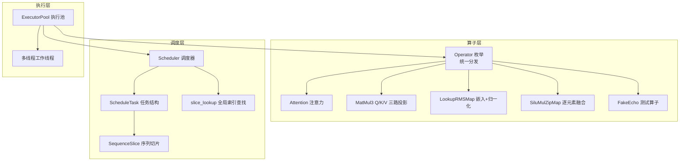
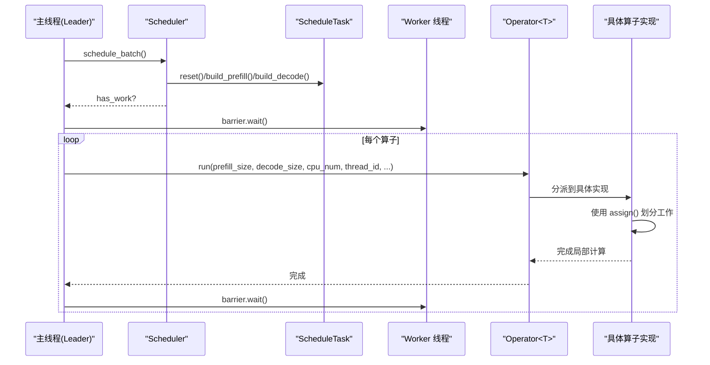
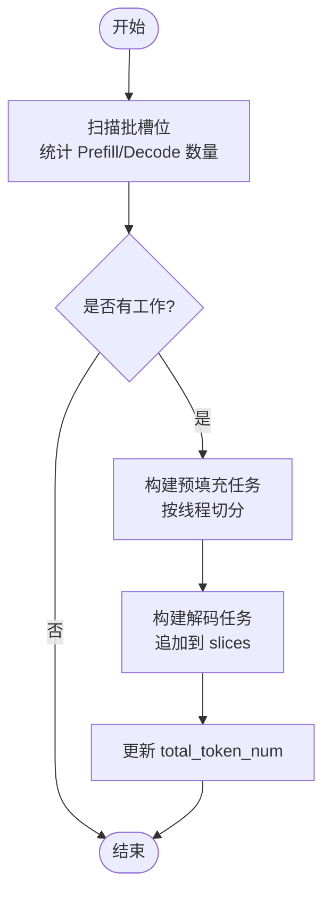
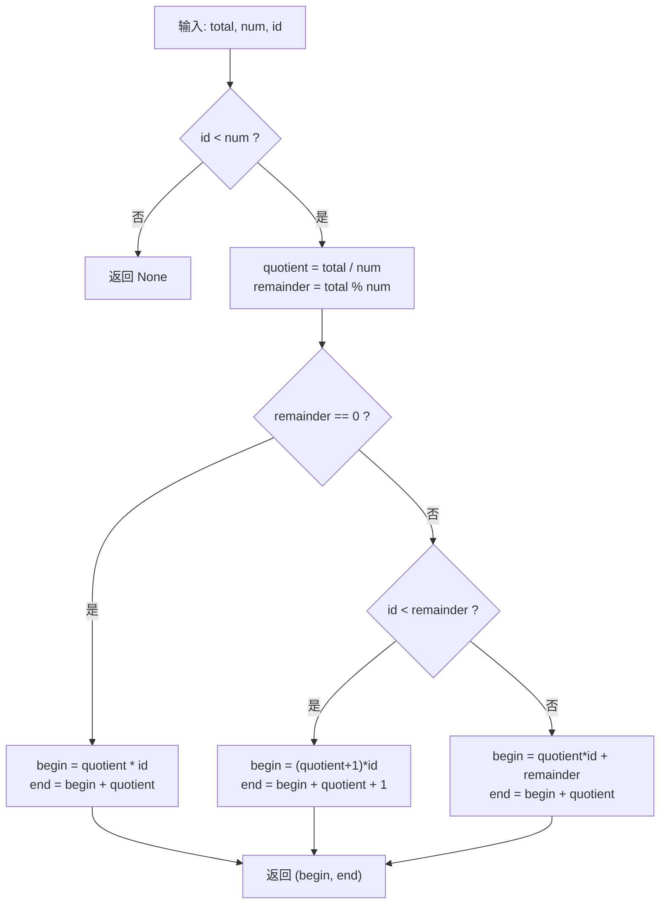
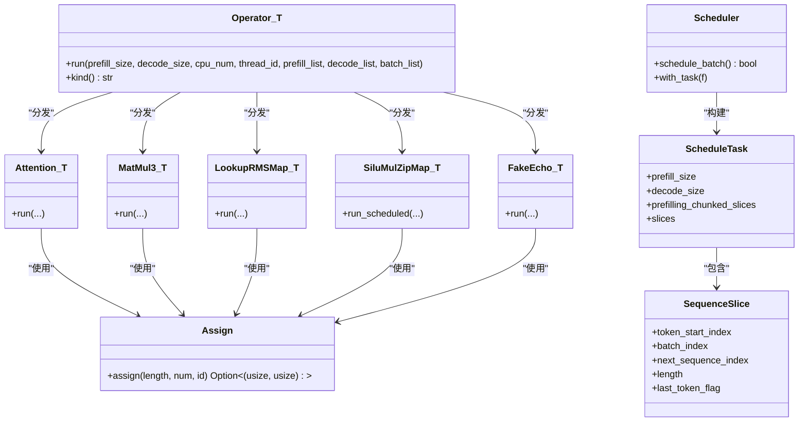

# 算子架构设计

<cite>
**本文引用的文件列表**
- [src/operators/operator.rs](file://src/operators/operator.rs)
- [src/operators/mod.rs](file://src/operators/mod.rs)
- [src/operators/assign.rs](file://src/operators/assign.rs)
- [src/operators/attention/attention.rs](file://src/operators/attention/attention.rs)
- [src/operators/matmul/matmul3.rs](file://src/operators/matmul/matmul3.rs)
- [src/operators/normalization/lookup_rms_map.rs](file://src/operators/normalization/lookup_rms_map.rs)
- [src/operators/elementwise/silu_mul_zip.rs](file://src/operators/elementwise/silu_mul_zip.rs)
- [src/operators/fake_echo.rs](file://src/operators/fake_echo.rs)
- [src/runtime/scheduler/task.rs](file://src/runtime/scheduler/task.rs)
- [src/runtime/scheduler/scheduler.rs](file://src/runtime/scheduler/scheduler.rs)
- [src/runtime/scheduler/slice_lookup.rs](file://src/runtime/scheduler/slice_lookup.rs)
- [docs/design/operators/fake_echo.md](file://docs/design/operators/fake_echo.md)
- [docs/design/runtime/executor.md](file://docs/design/runtime/executor.md)
</cite>

## 目录
1. [简介](#简介)
2. [项目结构](#项目结构)
3. [核心组件](#核心组件)
4. [架构总览](#架构总览)
5. [详细组件分析](#详细组件分析)
6. [依赖关系分析](#依赖关系分析)
7. [性能考量](#性能考量)
8. [故障排查指南](#故障排查指南)
9. [结论](#结论)
10. [附录：实现一个符合规范的算子](#附录实现一个符合规范的算子)

## 简介
本文件系统化阐述 eLLM 的算子架构设计与执行机制，重点覆盖以下方面：
- Operator<T> 枚举的设计模式与无状态算子原则
- 调度周期中算子的执行流程与线程间工作分配
- ScheduleTask 的结构与作用，包括 prefill_list 与 decode_list 的处理逻辑
- 线程间任务划分工具 assign(total, thread_num, thread_id) 的使用方式
- 算子生命周期管理（从创建到执行的各阶段）
- 提供具体代码示例路径，展示如何正确实现一个符合架构规范的算子

## 项目结构
eLLM 将“算子”作为最小可执行计算单元，通过统一枚举进行分发，并由运行时调度器生成每轮的任务计划。关键目录与职责如下：
- operators：算子定义、枚举分发、通用工具（如线程分配）
- runtime/scheduler：调度器与任务结构体，负责将批请求切分为可并行执行的切片
- kernel：底层内核实现（SIMD/AVX 等），被算子调用
- docs/design：架构与设计文档

图表来源
- [src/operators/operator.rs:32-224](file://src/operators/operator.rs#L32-L224)
- [src/runtime/scheduler/scheduler.rs:15-82](file://src/runtime/scheduler/scheduler.rs#L15-L82)
- [src/runtime/scheduler/task.rs:1-49](file://src/runtime/scheduler/task.rs#L1-L49)
- [src/runtime/scheduler/slice_lookup.rs:14-30](file://src/runtime/scheduler/slice_lookup.rs#L14-L30)
- [docs/design/runtime/executor.md:45-91](file://docs/design/runtime/executor.md#L45-L91)

章节来源
- [src/operators/operator.rs:32-224](file://src/operators/operator.rs#L32-L224)
- [src/runtime/scheduler/scheduler.rs:15-82](file://src/runtime/scheduler/scheduler.rs#L15-L82)
- [src/runtime/scheduler/task.rs:1-49](file://src/runtime/scheduler/task.rs#L1-L49)
- [src/runtime/scheduler/slice_lookup.rs:14-30](file://src/runtime/scheduler/slice_lookup.rs#L14-L30)
- [docs/design/runtime/executor.md:45-91](file://docs/design/runtime/executor.md#L45-L91)

## 核心组件
- Operator<T> 枚举：集中承载所有算子变体，并提供统一的 run 入口，内部根据变体分派到具体实现。
- ScheduleTask：描述一轮调度中的预填充与解码规模、以及按线程切分的预填充切片和整体切片集合。
- SequenceSlice：表示一段连续处理的 token 范围，包含 batch_index、next_sequence_index、token_start_index、length 等字段。
- Scheduler：扫描批槽位，构建 ScheduleTask，并将预填充任务按线程均衡切分到 prefilling_chunked_slices。
- assign：将总长度均匀分配到多个线程，返回每个线程的工作区间 [begin, end)。

章节来源
- [src/operators/operator.rs:32-224](file://src/operators/operator.rs#L32-L224)
- [src/runtime/scheduler/task.rs:1-49](file://src/runtime/scheduler/task.rs#L1-L49)
- [src/runtime/scheduler/scheduler.rs:84-223](file://src/runtime/scheduler/scheduler.rs#L84-L223)
- [src/operators/assign.rs:11-38](file://src/operators/assign.rs#L11-L38)

## 架构总览
下图展示了从调度到执行的关键数据流与控制流：

图表来源
- [src/runtime/scheduler/scheduler.rs:66-82](file://src/runtime/scheduler/scheduler.rs#L66-L82)
- [src/operators/operator.rs:79-198](file://src/operators/operator.rs#L79-L198)
- [docs/design/runtime/executor.md:110-150](file://docs/design/runtime/executor.md#L110-L150)

## 详细组件分析

### Operator<T> 枚举与无状态算子原则
- 设计模式：采用单枚举多变体的方式聚合所有算子，便于在运行时统一分发；run 方法接收调度上下文参数并转发给具体实现。
- 无状态原则：算子本身不持有请求级可变状态，所有可变状态由 BatchSequence 与 SlotState 维护；算子仅读取输入指针与写入输出指针，保证跨线程安全与可重入性。
- Send/Sync：由于内部可能包含原始指针，显式实现 Send/Sync 以支持多线程并发执行。

章节来源
- [src/operators/operator.rs:32-233](file://src/operators/operator.rs#L32-L233)

### ScheduleTask 与 SequenceSlice
- ScheduleTask 字段说明：
  - prefill_size：本轮预填充 token 总数
  - decode_size：本轮解码 token 总数
  - total_token_num：两者之和
  - prefilling_chunked_slices：按线程划分的预填充切片集合，用于多线程并行处理长序列预填充
  - slices：当前轮次的整体切片序列（含预填充与解码片段）
- SequenceSlice 字段说明：
  - token_start_index：在全局 token 布局中的起始位置
  - batch_index：所属批次槽位
  - next_sequence_index：该序列在当前批次中的下一个写入位置
  - length：本次处理的 token 数量
  - last_token_flag：是否最后一个 token（常用于注意力掩码或终止判断）

章节来源
- [src/runtime/scheduler/task.rs:1-49](file://src/runtime/scheduler/task.rs#L1-L49)

### Scheduler 构建任务与线程切分
- build_task：遍历批槽位，统计可执行的预填充与解码数量，限制最大解码数与最大预填充数。
- build_prefill：将预填充 token 总量按线程数均分，为每个线程生成若干 SequenceSlice，记录其全局起始位置与对应序列位置。
- build_decode：为每个处于 Decode 阶段的槽位生成长度为 1 的切片，追加至 slices 尾部。
- slice_lookup：提供基于全局索引的反查能力，便于上层按位置访问对应的 batch_index 与 next_sequence_index。

图表来源
- [src/runtime/scheduler/scheduler.rs:84-223](file://src/runtime/scheduler/scheduler.rs#L84-L223)
- [src/runtime/scheduler/slice_lookup.rs:14-30](file://src/runtime/scheduler/slice_lookup.rs#L14-L30)

章节来源
- [src/runtime/scheduler/scheduler.rs:84-223](file://src/runtime/scheduler/scheduler.rs#L84-L223)
- [src/runtime/scheduler/slice_lookup.rs:14-30](file://src/runtime/scheduler/slice_lookup.rs#L14-L30)

### 线程间工作分配机制 assign(total, thread_num, thread_id)
- 功能：将 [0, total) 均匀划分为 thread_num 份，返回第 thread_id 个线程的区间 [begin, end)。当 total < thread_id + 1 时返回 None。
- 特性：余数优先分配给前 remainder 个线程，确保负载均衡。
- 使用场景：
  - 简单逐行/逐头操作：如 SiluMulZipMap 对 head×batch 的总长度进行划分
  - K/Q/V 合并调度：assign_kqv_tile 将 V/K/Q 三类任务分别分配线程，再在各段内用 assign 细分
  - 自定义算子：在 run 中依据 prefill_size 或 decode_size 计算 active_rows，再用 assign 划分

图表来源
- [src/operators/assign.rs:11-38](file://src/operators/assign.rs#L11-L38)

章节来源
- [src/operators/assign.rs:11-38](file://src/operators/assign.rs#L11-L38)

### 典型算子实现与执行细节

#### Attention 注意力算子
- 输入：Q、K、V 指针及步幅信息；输出：注意力结果
- 线程策略：根据 slice.length 与 row_step 决定按序列行拆分或按头拆分，避免小粒度导致线程利用率低
- 内存访问：按 stride 访问 K/V 缓存，支持 GQA（多头共享 KV 头）
- 对齐与尾块：将行范围拆分为对齐主块与尾部小块，分别处理

章节来源
- [src/operators/attention/attention.rs:14-143](file://src/operators/attention/attention.rs#L14-L143)
- [src/operators/attention/attention.rs:439-505](file://src/operators/attention/attention.rs#L439-L505)

#### MatMul3 三路投影（Q/K/V）
- 功能：一次性完成 Q/K/V 三路线性投影，可选 RMSNorm 与 RoPE
- 权重打包：在构造时将 B 矩阵按 panel 打包，提升微内核访存效率
- 任务划分：将 row×head 的任务空间映射为 V/K/Q 三段，结合 assign_kqv_tile 与 path_task 将任务分配给线程
- 特化实现：针对 f16 提供 AVX-512 加速路径，否则回退标量实现

章节来源
- [src/operators/matmul/matmul3.rs:80-207](file://src/operators/matmul/matmul3.rs#L80-L207)
- [src/operators/matmul/matmul3.rs:525-621](file://src/operators/matmul/matmul3.rs#L525-L621)
- [src/operators/assign.rs:57-131](file://src/operators/assign.rs#L57-L131)

#### LookupRMSMap 嵌入查找与 RMS 归一化
- 功能：从词表嵌入中读取 token 向量，并输出 hidden 与 normalized 两份张量
- 线程策略：prefill 模式下按线程预分配的 prefilling_chunked_slices 直接迭代；decode 模式下使用 assign 划分 decode_list
- 特化实现：f16 下走 x86_64 优化路径，否则回退标量

章节来源
- [src/operators/normalization/lookup_rms_map.rs:15-54](file://src/operators/normalization/lookup_rms_map.rs#L15-L54)
- [src/operators/normalization/lookup_rms_map.rs:56-119](file://src/operators/normalization/lookup_rms_map.rs#L56-L119)

#### SiluMulZipMap 逐元素融合
- 功能：对两个输入张量逐元素做 SiLU 与乘法融合
- 线程策略：根据 prefill_size 或 decode_size 确定 active_rows，再以 head_num × head_size 为粒度进行划分
- 特化实现：f16 下走 x86_64 优化路径

章节来源
- [src/operators/elementwise/silu_mul_zip.rs:12-67](file://src/operators/elementwise/silu_mul_zip.rs#L12-L67)
- [src/operators/elementwise/silu_mul_zip.rs:77-103](file://src/operators/elementwise/silu_mul_zip.rs#L77-L103)

#### FakeEcho 测试算子
- 目的：验证运行期管线是否正确调度与执行，无需真实模型权重
- 行为：复制上一个 token 直到达到最大长度，然后写入 EOS 并唤醒等待方
- 线程策略：对所有参与线程都有效，使用 assign 划分 decode_list

章节来源
- [docs/design/operators/fake_echo.md:1-126](file://docs/design/operators/fake_echo.md#L1-L126)
- [src/operators/fake_echo.rs:68-186](file://src/operators/fake_echo.rs#L68-L186)

## 依赖关系分析
- Operator<T> 依赖各具体算子实现，并通过 match 分支进行分发
- Scheduler 依赖 ScheduleTask 与 SequenceSlice，负责构建任务切片
- 算子实现普遍依赖 assign 工具进行线程间任务划分
- ExecutorPool 驱动算子队列在多核上同步执行，使用屏障保证一致性

图表来源
- [src/operators/operator.rs:32-224](file://src/operators/operator.rs#L32-L224)
- [src/runtime/scheduler/scheduler.rs:15-82](file://src/runtime/scheduler/scheduler.rs#L15-L82)
- [src/runtime/scheduler/task.rs:1-49](file://src/runtime/scheduler/task.rs#L1-L49)
- [src/operators/assign.rs:11-38](file://src/operators/assign.rs#L11-L38)

章节来源
- [src/operators/operator.rs:32-224](file://src/operators/operator.rs#L32-L224)
- [src/runtime/scheduler/scheduler.rs:15-82](file://src/runtime/scheduler/scheduler.rs#L15-L82)
- [src/runtime/scheduler/task.rs:1-49](file://src/runtime/scheduler/task.rs#L1-L49)
- [src/operators/assign.rs:11-38](file://src/operators/assign.rs#L11-L38)

## 性能考量
- 线程划分粒度：对于短序列或小批量，优先按头拆分（Attention）以避免线程闲置；对于长序列，按行拆分更利于缓存局部性
- 权重打包：MatMul3 提前打包 B 面板，减少重复访存开销
- 微内核特化：针对 f16 的 AVX-512 路径显著提升吞吐
- 任务均衡：assign 将余数优先分配给前几个线程，避免负载倾斜
- 内存布局：SequenceSlice 的全局索引与 next_sequence_index 配合，使注意力与 K/V 缓存访问具备良好连续性

[本节为通用指导，不直接分析具体文件]

## 故障排查指南
- 线程越界：若 thread_id >= thread_num 或 total < thread_id + 1，assign 会返回 None，需在上层循环中跳过空任务
- 切片越界：注意 SequenceSlice 的 token_start_index 与 length 边界，避免访问超出 buffer 的范围
- 注意力掩码：last_token_flag 影响可见列范围，错误设置会导致注意力计算异常
- 线程同步：ExecutorPool 使用 SpinBarrier 保证算子边界一致，若出现死锁，检查屏障计数与 worker 数量是否匹配

章节来源
- [src/operators/assign.rs:11-38](file://src/operators/assign.rs#L11-L38)
- [src/runtime/scheduler/slice_lookup.rs:14-30](file://src/runtime/scheduler/slice_lookup.rs#L14-L30)
- [docs/design/runtime/executor.md:156-187](file://docs/design/runtime/executor.md#L156-L187)

## 结论
eLLM 的算子架构以 Operator<T> 枚举为核心，结合无状态算子原则与精细化的线程划分策略，实现了高效且可扩展的推理执行。Scheduler 将批请求切分为可并行处理的 SequenceSlice，并通过 prefilling_chunked_slices 与 slices 的组合表达复杂的多阶段流水线。assign 工具提供了简洁而强大的任务分配接口，使得各类算子能够以一致的方式利用多核资源。

[本节为总结，不直接分析具体文件]

## 附录：实现一个符合规范的算子
以下步骤展示如何新增一个符合架构规范的算子，并以逐元素融合为例：

1. 新建算子文件
   - 在 src/operators/elementwise/ 下添加 my_op.rs
   - 定义结构体 MyOp，保存输入输出指针与维度信息
   - 实现 new 构造函数与 run 方法

2. 线程划分
   - 在 run 中根据 prefill_size 或 decode_size 计算 active_rows
   - 使用 assign(active_rows * head_num, cpu_num, thread_id) 获取 [begin, end)
   - 遍历 assigned 范围，调用 compute 完成逐元素运算

3. 注册到 Operator<T>
   - 在 src/operators/mod.rs 中暴露模块与类型别名
   - 在 src/operators/operator.rs 中添加枚举变体并在 run 中分派

4. 集成到执行管线
   - 在初始化服务资源时，将 MyOp 加入全局算子队列
   - 启动 ExecutorPool，确保 barrier 与 worker 数量一致

参考示例路径
- 逐元素融合示例：[src/operators/elementwise/silu_mul_zip.rs:77-103](file://src/operators/elementwise/silu_mul_zip.rs#L77-L103)
- 嵌入+归一化示例：[src/operators/normalization/lookup_rms_map.rs:56-119](file://src/operators/normalization/lookup_rms_map.rs#L56-L119)
- 注意力示例：[src/operators/attention/attention.rs:439-505](file://src/operators/attention/attention.rs#L439-L505)
- 三路投影示例：[src/operators/matmul/matmul3.rs:525-621](file://src/operators/matmul/matmul3.rs#L525-L621)
- 测试算子示例：[src/operators/fake_echo.rs:116-186](file://src/operators/fake_echo.rs#L116-L186)

章节来源
- [src/operators/elementwise/silu_mul_zip.rs:77-103](file://src/operators/elementwise/silu_mul_zip.rs#L77-L103)
- [src/operators/normalization/lookup_rms_map.rs:56-119](file://src/operators/normalization/lookup_rms_map.rs#L56-L119)
- [src/operators/attention/attention.rs:439-505](file://src/operators/attention/attention.rs#L439-L505)
- [src/operators/matmul/matmul3.rs:525-621](file://src/operators/matmul/matmul3.rs#L525-L621)
- [src/operators/fake_echo.rs:116-186](file://src/operators/fake_echo.rs#L116-L186)