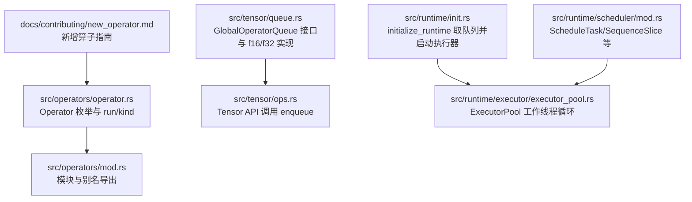
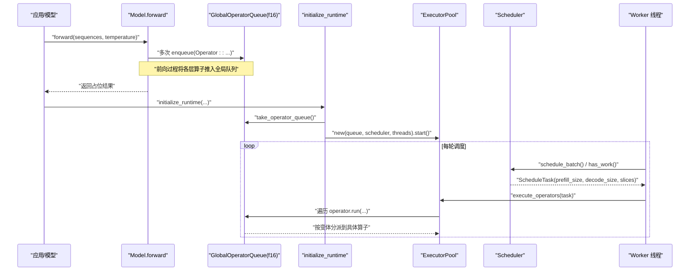
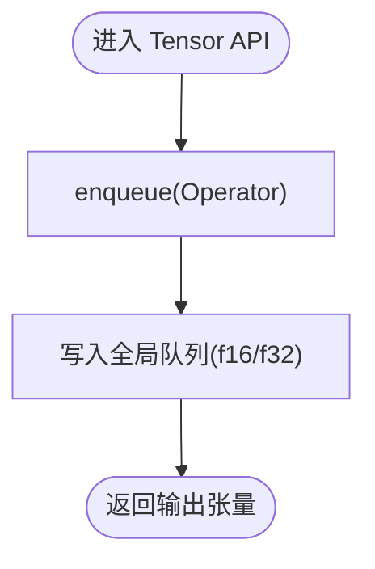
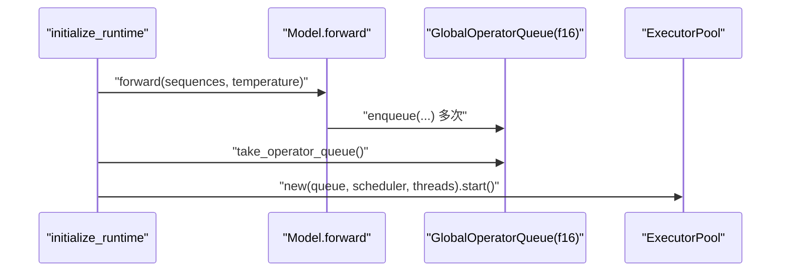
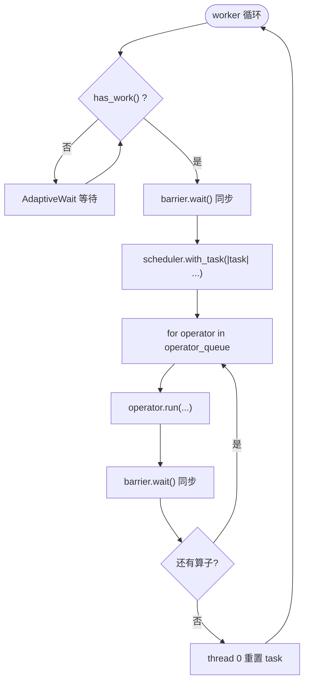
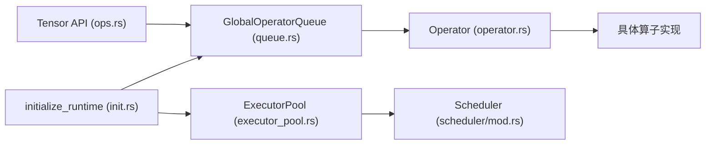

# 算子注册与集成

<cite>
**本文引用的文件**
- [src/operators/operator.rs](file://src/operators/operator.rs)
- [src/operators/mod.rs](file://src/operators/mod.rs)
- [src/tensor/queue.rs](file://src/tensor/queue.rs)
- [src/tensor/ops.rs](file://src/tensor/ops.rs)
- [src/runtime/executor/executor_pool.rs](file://src/runtime/executor/executor_pool.rs)
- [src/runtime/init.rs](file://src/runtime/init.rs)
- [src/runtime/scheduler/mod.rs](file://src/runtime/scheduler/mod.rs)
- [docs/contributing/new_operator.md](file://docs/contributing/new_operator.md)
</cite>

## 目录
1. [简介](#简介)
2. [项目结构](#项目结构)
3. [核心组件](#核心组件)
4. [架构总览](#架构总览)
5. [详细组件分析](#详细组件分析)
6. [依赖关系分析](#依赖关系分析)
7. [性能考量](#性能考量)
8. [故障排查指南](#故障排查指南)
9. [结论](#结论)
10. [附录：完整集成步骤](#附录完整集成步骤)

## 简介
本指南面向需要在系统中新增并集成自定义算子的开发者，围绕以下目标展开：
- 如何将新算子添加到 Operator<T> 枚举中（变体定义与匹配分支）
- 算子队列的构建过程与初始化服务资源时如何推入队列
- 算子在 ExecutorPool 中的执行机制与调度策略
- 从文件创建到系统集成的全流程指导
- 错误处理与调试技巧，确保新算子正确集成

## 项目结构
与算子注册与执行相关的关键路径如下：
- 算子枚举与分发：src/operators/operator.rs
- 算子模块组织与重导出：src/operators/mod.rs
- 全局算子队列接口与实现：src/tensor/queue.rs
- Tensor API 向队列推入算子：src/tensor/ops.rs
- 执行器池与工作线程调度：src/runtime/executor/executor_pool.rs
- 运行时初始化与取队列、启动执行器：src/runtime/init.rs
- 调度任务类型与切片信息：src/runtime/scheduler/mod.rs
- 贡献者文档（含示例流程）：docs/contributing/new_operator.md

图示来源
- [src/operators/operator.rs:32-224](file://src/operators/operator.rs#L32-L224)
- [src/operators/mod.rs:1-109](file://src/operators/mod.rs#L1-L109)
- [src/tensor/queue.rs:12-72](file://src/tensor/queue.rs#L12-L72)
- [src/tensor/ops.rs:13-165](file://src/tensor/ops.rs#L13-L165)
- [src/runtime/init.rs:34-135](file://src/runtime/init.rs#L34-L135)
- [src/runtime/executor/executor_pool.rs:10-149](file://src/runtime/executor/executor_pool.rs#L10-L149)
- [src/runtime/scheduler/mod.rs:1-8](file://src/runtime/scheduler/mod.rs#L1-L8)
- [docs/contributing/new_operator.md:1-143](file://docs/contributing/new_operator.md#L1-L143)

章节来源
- [src/operators/operator.rs:32-224](file://src/operators/operator.rs#L32-L224)
- [src/operators/mod.rs:1-109](file://src/operators/mod.rs#L1-L109)
- [src/tensor/queue.rs:12-72](file://src/tensor/queue.rs#L12-L72)
- [src/tensor/ops.rs:13-165](file://src/tensor/ops.rs#L13-L165)
- [src/runtime/init.rs:34-135](file://src/runtime/init.rs#L34-L135)
- [src/runtime/executor/executor_pool.rs:10-149](file://src/runtime/executor/executor_pool.rs#L10-L149)
- [src/runtime/scheduler/mod.rs:1-8](file://src/runtime/scheduler/mod.rs#L1-L8)
- [docs/contributing/new_operator.md:1-143](file://docs/contributing/new_operator.md#L1-L143)

## 核心组件
- Operator<T> 枚举：集中承载所有算子变体，并提供统一的 run 分发入口与 kind 标识。
- GlobalOperatorQueue：按数据类型（f16/f32）维护全局算子队列，提供 init/take/with 访问方法。
- Tensor API：在 ops.rs 中以便捷方法将具体算子实例推入全局队列。
- ExecutorPool：在工作线程中循环调度，每轮从 Scheduler 获取任务并按序执行队列中的每个算子。
- initialize_runtime：加载模型参数后，通过 forward 填充算子队列，再取出队列交给 ExecutorPool 执行。

章节来源
- [src/operators/operator.rs:32-224](file://src/operators/operator.rs#L32-L224)
- [src/tensor/queue.rs:12-72](file://src/tensor/queue.rs#L12-L72)
- [src/tensor/ops.rs:13-165](file://src/tensor/ops.rs#L13-L165)
- [src/runtime/executor/executor_pool.rs:10-149](file://src/runtime/executor/executor_pool.rs#L10-L149)
- [src/runtime/init.rs:34-135](file://src/runtime/init.rs#L34-L135)

## 架构总览
下图展示了“算子注册—队列构建—执行调度”的整体流程。

图示来源
- [src/tensor/ops.rs:13-165](file://src/tensor/ops.rs#L13-L165)
- [src/tensor/queue.rs:12-72](file://src/tensor/queue.rs#L12-L72)
- [src/runtime/init.rs:34-135](file://src/runtime/init.rs#L34-L135)
- [src/runtime/executor/executor_pool.rs:46-149](file://src/runtime/executor/executor_pool.rs#L46-L149)
- [src/runtime/scheduler/mod.rs:1-8](file://src/runtime/scheduler/mod.rs#L1-L8)

## 详细组件分析

### Operator<T> 枚举与分发
- 作用：统一封装所有算子变体，对外暴露 run 与 kind。
- 关键点：
  - 新增算子需在 enum 中添加对应变体
  - 在 run 的 match 分支中增加对应变体的调用
  - 在 kind 中返回唯一字符串标识（便于日志与调试）
- 并发安全：为 T 满足特定约束时，显式实现 Send/Sync，允许跨线程共享。

```mermaid
classDiagram
class Operator_T_ {
+run(prefill_size, decode_size, cpu_num, thread_id, prefill_list, decode_list, batch_list) void
+kind() string
}
class AddRMSZipMap_T_
class AddZipMap_T_
class Attention_T_
class ExpertsMatMulDown_T_
class ExpertsMatMulSilu_T_
class ExpertsMergeAdd_T_
class MatMulSigmoid_T_
class ExpertsSoftmaxNorm_T_
class ExpertsTopkNorm_T_
class LiftVector_T_
class LookupRMSMap_T_
class MatMul_T_
class MatMul3_T_
class MatMulAdd_T_
class MatMulTopK_T_
class RMSMap_T_
class SigmoidMap_T_
class FakeEcho
class SiluMulZipMap_T_
class TopKSoftmax_T_
Operator_T_ --> AddRMSZipMap_T_ : "变体"
Operator_T_ --> AddZipMap_T_ : "变体"
Operator_T_ --> Attention_T_ : "变体"
Operator_T_ --> ExpertsMatMulDown_T_ : "变体"
Operator_T_ --> ExpertsMatMulSilu_T_ : "变体"
Operator_T_ --> ExpertsMergeAdd_T_ : "变体"
Operator_T_ --> MatMulSigmoid_T_ : "变体"
Operator_T_ --> ExpertsSoftmaxNorm_T_ : "变体"
Operator_T_ --> ExpertsTopkNorm_T_ : "变体"
Operator_T_ --> LiftVector_T_ : "变体"
Operator_T_ --> LookupRMSMap_T_ : "变体"
Operator_T_ --> MatMul_T_ : "变体"
Operator_T_ --> MatMul3_T_ : "变体"
Operator_T_ --> MatMulAdd_T_ : "变体"
Operator_T_ --> MatMulTopK_T_ : "变体"
Operator_T_ --> RMSMap_T_ : "变体"
Operator_T_ --> SigmoidMap_T_ : "变体"
Operator_T_ --> FakeEcho : "变体"
Operator_T_ --> SiluMulZipMap_T_ : "变体"
Operator_T_ --> TopKSoftmax_T_ : "变体"
```

图示来源
- [src/operators/operator.rs:32-224](file://src/operators/operator.rs#L32-L224)

章节来源
- [src/operators/operator.rs:32-224](file://src/operators/operator.rs#L32-L224)

### 全局算子队列接口与实现
- 接口：GlobalOperatorQueue 提供 init_operator_queue、take_operator_queue、with_operator_queue。
- 实现：针对 f16 与 f32 分别维护静态全局队列，使用 Mutex 保护。
- 典型用法：
  - 测试或独立流程：init_operator_queue 清空队列
  - 运行期：take_operator_queue 一次性取走队列供执行器使用
  - 调试或扩展：with_operator_queue 以闭包方式访问队列

图示来源
- [src/tensor/ops.rs:13-165](file://src/tensor/ops.rs#L13-L165)
- [src/tensor/queue.rs:12-72](file://src/tensor/queue.rs#L12-L72)

章节来源
- [src/tensor/queue.rs:12-72](file://src/tensor/queue.rs#L12-L72)
- [src/tensor/ops.rs:13-165](file://src/tensor/ops.rs#L13-L165)

### 运行时初始化与队列注入
- initialize_runtime 流程要点：
  - 加载配置与权重
  - 构造 BatchSequence、SlotManager、Scheduler
  - 调用 model.forward 以触发各层算子构建并推入全局队列
  - 通过 f16::take_operator_queue 取出队列，构造 ExecutorPool 并启动
- 注意：若未调用 forward 或未初始化队列，则 ExecutorPool 拿到的队列为空。

图示来源
- [src/runtime/init.rs:34-135](file://src/runtime/init.rs#L34-L135)
- [src/tensor/queue.rs:47-72](file://src/tensor/queue.rs#L47-L72)

章节来源
- [src/runtime/init.rs:34-135](file://src/runtime/init.rs#L34-L135)

### ExecutorPool 执行机制与调度策略
- 工作线程：
  - 线程 0 负责尝试 schedule_batch；其他线程等待有工作项
  - 使用 SpinBarrier 保证所有线程在同一任务上同步
- 执行顺序：
  - 每次调度成功后，遍历 operator_queue，依次调用 operator.run(...)
  - 每个算子内部根据 thread_id 与 thread_num 进行并行划分
- 任务重置：
  - 一轮结束后由线程 0 重置 task，准备下一轮

图示来源
- [src/runtime/executor/executor_pool.rs:46-149](file://src/runtime/executor/executor_pool.rs#L46-L149)

章节来源
- [src/runtime/executor/executor_pool.rs:46-149](file://src/runtime/executor/executor_pool.rs#L46-L149)

### 调度任务与切片信息
- ScheduleTask 携带当前批次的预填充与解码切片信息，包括：
  - prefill_size、decode_size
  - prefilling_chunked_slices、slices
- SequenceSlice 描述每个序列片段的起止索引与长度等元数据
- 这些字段被传入每个算子的 run 方法，用于确定本次要处理的 token 范围

章节来源
- [src/runtime/scheduler/mod.rs:1-8](file://src/runtime/scheduler/mod.rs#L1-L8)

## 依赖关系分析
- 低耦合：算子仅依赖自身输入指针与任务切片信息，不直接持有全局状态
- 高内聚：Operator<T> 作为统一入口，屏蔽了具体算子差异
- 外部依赖：
  - 数值类型约束（Exp、Sqrt、Sigmoid、NegInfinity 等）
  - 内存池与张量存储（由 Tensor 与 mem_mgr 管理）
  - 调度器与执行器（Scheduler、ExecutorPool）

图示来源
- [src/tensor/ops.rs:13-165](file://src/tensor/ops.rs#L13-L165)
- [src/tensor/queue.rs:12-72](file://src/tensor/queue.rs#L12-L72)
- [src/operators/operator.rs:32-224](file://src/operators/operator.rs#L32-L224)
- [src/runtime/init.rs:34-135](file://src/runtime/init.rs#L34-L135)
- [src/runtime/executor/executor_pool.rs:46-149](file://src/runtime/executor/executor_pool.rs#L46-L149)
- [src/runtime/scheduler/mod.rs:1-8](file://src/runtime/scheduler/mod.rs#L1-L8)

章节来源
- [src/tensor/ops.rs:13-165](file://src/tensor/ops.rs#L13-L165)
- [src/tensor/queue.rs:12-72](file://src/tensor/queue.rs#L12-L72)
- [src/operators/operator.rs:32-224](file://src/operators/operator.rs#L32-L224)
- [src/runtime/init.rs:34-135](file://src/runtime/init.rs#L34-L135)
- [src/runtime/executor/executor_pool.rs:46-149](file://src/runtime/executor/executor_pool.rs#L46-L149)
- [src/runtime/scheduler/mod.rs:1-8](file://src/runtime/scheduler/mod.rs#L1-L8)

## 性能考量
- 算子应无请求级状态，可变状态置于 BatchSequence 与 SlotState 中，避免锁竞争
- 合理划分线程粒度：在算子 run 中使用 assign 或基于 thread_id/thread_num 的分片逻辑
- 减少不必要的拷贝：尽量使用指针与切片传递数据
- 利用 SIMD/内核优化：在 kernel 层实现热点路径，算子层只做调度与参数装配
- 控制队列规模：避免过多细粒度算子导致调度开销增大，必要时合并相邻操作

[本节为通用建议，无需代码引用]

## 故障排查指南
- 现象：ExecutorPool 启动后无工作
  - 检查是否在 initialize_runtime 之前调用了 take_operator_queue
  - 确认是否已调用 model.forward 以填充队列
- 现象：新增算子未被执行
  - 确认已在 Operator<T> 枚举中添加变体并在 run 的 match 分支中处理
  - 确认 kind 返回值唯一且与日志一致
- 现象：多线程结果不一致
  - 检查算子内部是否正确使用 thread_id 与 thread_num 划分任务
  - 验证 barrier 同步点是否正确放置
- 现象：内存越界或段错误
  - 核对输入/输出指针生命周期与对齐要求
  - 确认 SequenceSlice 的 token_start_index 与 length 计算正确

章节来源
- [src/runtime/init.rs:34-135](file://src/runtime/init.rs#L34-L135)
- [src/operators/operator.rs:32-224](file://src/operators/operator.rs#L32-L224)
- [src/runtime/executor/executor_pool.rs:46-149](file://src/runtime/executor/executor_pool.rs#L46-L149)

## 结论
通过将新算子纳入 Operator<T> 枚举、在 Tensor API 中将其推入全局队列、并在运行时由 ExecutorPool 统一调度执行，可实现“声明式构建、集中式执行”的算子体系。遵循本文的步骤与最佳实践，可快速、稳定地将新算子集成到系统中。

[本节为总结性内容，无需代码引用]

## 附录：完整集成步骤
以下为从零开始添加一个新算子的端到端流程（不含代码片段，仅提供路径指引）：

1. 新建算子文件
   - 在 src/operators/<category>/ 下创建 my_op.rs
   - 参考现有算子结构与命名规范
   - 参考：[docs/contributing/new_operator.md:25-59](file://docs/contributing/new_operator.md#L25-L59)

2. 在父模块中导出
   - 在对应 mod.rs 中 pub mod 与 pub use 暴露新算子
   - 参考：[src/operators/mod.rs:1-109](file://src/operators/mod.rs#L1-L109)

3. 注册到 Operator<T> 枚举
   - 在 src/operators/operator.rs 中添加变体
   - 在 run 的 match 分支中增加对应变体调用
   - 在 kind 中返回唯一标识
   - 参考：[src/operators/operator.rs:32-224](file://src/operators/operator.rs#L32-L224)

4. 将算子推入全局队列
   - 在合适的 Tensor API 或模型构建阶段，构造算子并通过 Self::enqueue 推入队列
   - 参考：[src/tensor/ops.rs:13-165](file://src/tensor/ops.rs#L13-L165)

5. 初始化与启动执行器
   - 在 initialize_runtime 中调用 model.forward 以填充队列
   - 使用 f16::take_operator_queue 取出队列并启动 ExecutorPool
   - 参考：[src/runtime/init.rs:34-135](file://src/runtime/init.rs#L34-L135)

6. 编写对齐测试
   - 生成 Python 参考输出（alignment/<op_name>/generate_data.py）
   - 编写 Rust 对齐二进制，比较输出
   - 参考：[docs/contributing/new_operator.md:98-124](file://docs/contributing/new_operator.md#L98-L124)

7. 命名与约定
   - 结构体 PascalCase，文件 snake_case.rs
   - alignment 目录与 .npy 命名遵循约定
   - 参考：[docs/contributing/new_operator.md:127-135](file://docs/contributing/new_operator.md#L127-L135)

章节来源
- [docs/contributing/new_operator.md:25-135](file://docs/contributing/new_operator.md#L25-L135)
- [src/operators/mod.rs:1-109](file://src/operators/mod.rs#L1-L109)
- [src/operators/operator.rs:32-224](file://src/operators/operator.rs#L32-L224)
- [src/tensor/ops.rs:13-165](file://src/tensor/ops.rs#L13-L165)
- [src/runtime/init.rs:34-135](file://src/runtime/init.rs#L34-L135)