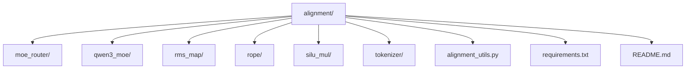
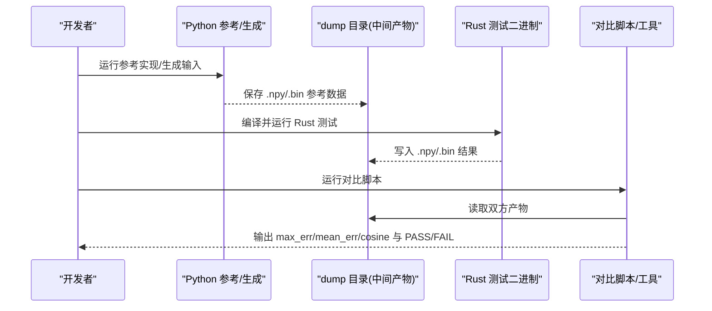
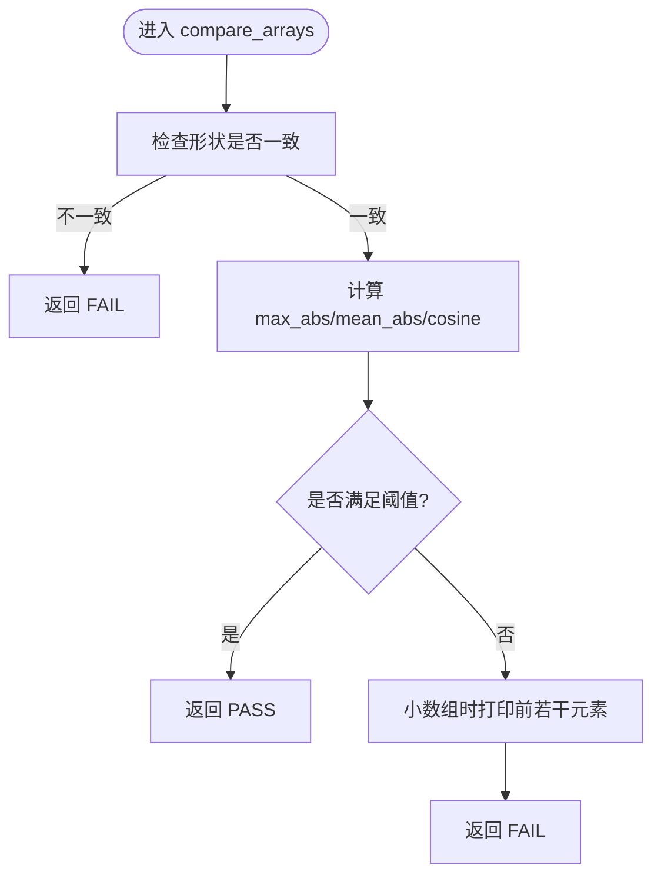
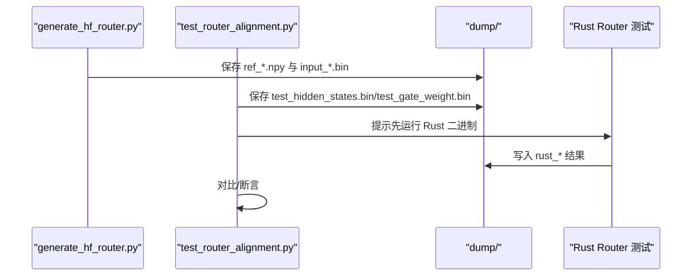
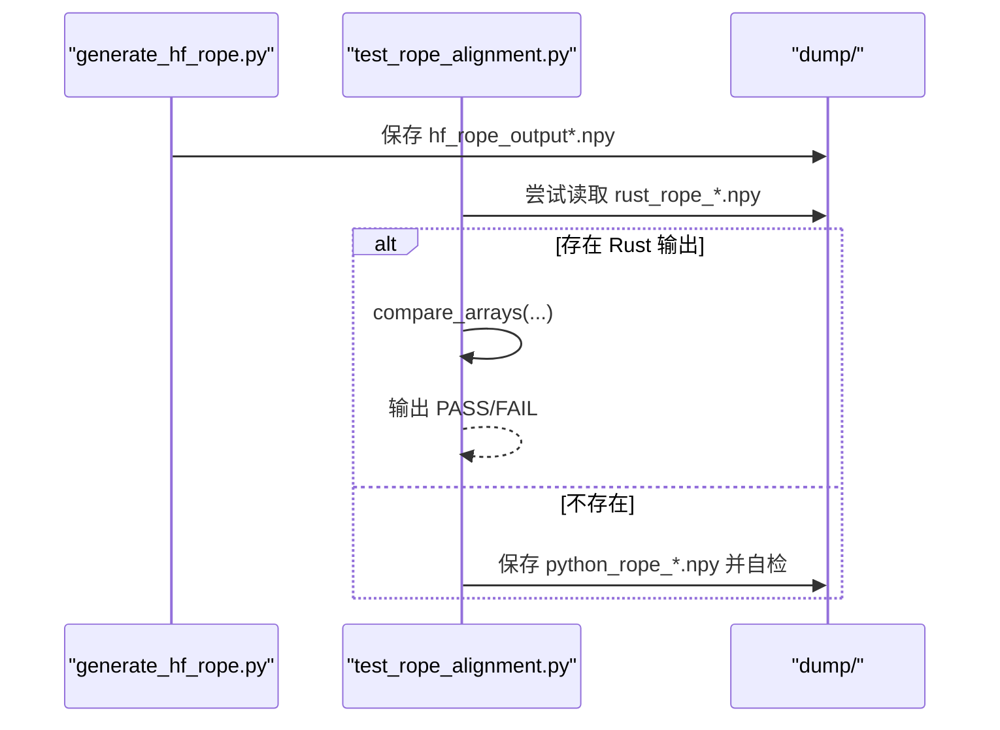
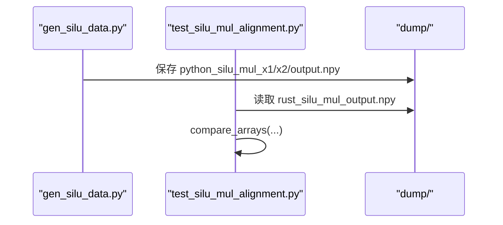
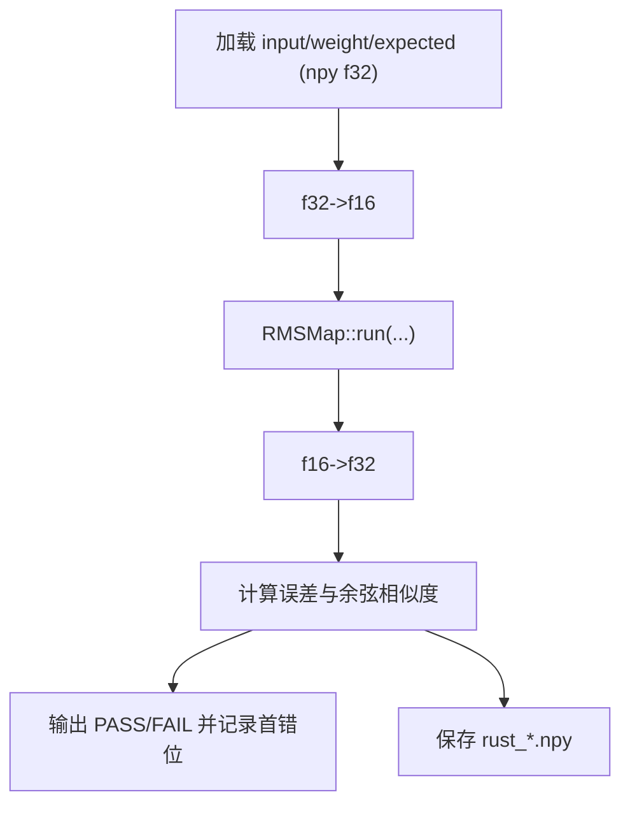
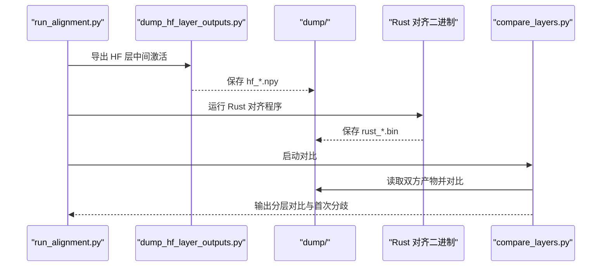
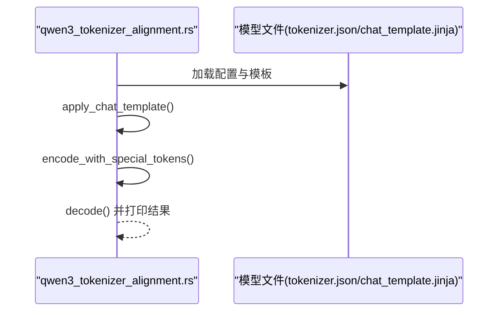
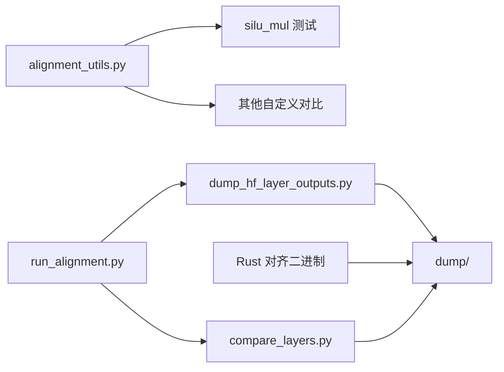

# 对齐测试框架

<cite>
**本文引用的文件**   
- [alignment/README.md](file://alignment/README.md)
- [alignment/requirements.txt](file://alignment/requirements.txt)
- [alignment/alignment_utils.py](file://alignment/alignment_utils.py)
- [alignment/moe_router/test_router_alignment.py](file://alignment/moe_router/test_router_alignment.py)
- [alignment/moe_router/generate_hf_router.py](file://alignment/moe_router/generate_hf_router.py)
- [alignment/qwen3_moe/run_alignment.py](file://alignment/qwen3_moe/run_alignment.py)
- [alignment/rope/test_rope_alignment.py](file://alignment/rope/test_rope_alignment.py)
- [alignment/rope/generate_hf_rope.py](file://alignment/rope/generate_hf_rope.py)
- [alignment/silu_mul/test_silu_mul_alignment.py](file://alignment/silu_mul/test_silu_mul_alignment.py)
- [alignment/silu_mul/gen_silu_data.py](file://alignment/silu_mul/gen_silu_data.py)
- [alignment/rms_map/rms_map_alignment.rs](file://alignment/rms_map/rms_map_alignment.rs)
- [alignment/tokenizer/dump_hf_layer_outputs.py](file://alignment/tokenizer/dump_hf_layer_outputs.py)
- [alignment/tokenizer/compare_layers.py](file://alignment/tokenizer/compare_layers.py)
- [alignment/tokenizer/multi_batch_alignment.rs](file://alignment/tokenizer/multi_batch_alignment.rs)
- [alignment/tokenizer/qwen3_tokenizer_alignment.rs](file://alignment/tokenizer/qwen3_tokenizer_alignment.rs)
</cite>

## 目录
1. [简介](#简介)
2. [项目结构](#项目结构)
3. [核心组件](#核心组件)
4. [架构总览](#架构总览)
5. [详细组件分析](#详细组件分析)
6. [依赖关系分析](#依赖关系分析)
7. [性能与精度考量](#性能与精度考量)
8. [故障排查指南](#故障排查指南)
9. [结论](#结论)
10. [附录：端到端测试流程](#附录端到端测试流程)

## 简介
本文件系统化梳理 eLLM 项目的“对齐测试框架”，聚焦于 Python 参考实现与 Rust 实现的对比验证机制。文档覆盖以下要点：
- 共享工具函数 alignment_utils.py 的接口与用法（如 compare_arrays、load_npy、save_npy、get_dump_dir）
- 测试环境设置与依赖安装
- 测试目录组织方式与各算子/模块的对齐测试入口
- 从生成参考输出到结果对比的完整流程
- 错误处理与调试技巧，帮助快速定位差异来源

## 项目结构
对齐测试位于 alignment 目录下，按功能/算子划分独立子目录，每个子目录包含：
- Python 参考实现或数据生成脚本
- Python 对比/编排脚本
- Rust 测试二进制（可选）
- dump 目录用于存放中间产物（npy/bin）

图表来源
- [alignment/README.md:12-37](file://alignment/README.md#L12-L37)

章节来源
- [alignment/README.md:1-37](file://alignment/README.md#L1-L37)

## 核心组件
- 共享工具库 alignment_utils.py
  - compare_arrays(a, b, name, verbose=True): 计算最大绝对误差、平均绝对误差与余弦相似度，并给出 PASS/FAIL 判定
  - load_npy(filepath)/save_npy(filepath, data): npy 读写封装
  - get_dump_dir(script_file): 基于调用脚本路径解析 dump 目录
- 各算子/模块的 Python 参考与 Rust 测试对
  - MoE Router: generate_hf_router.py + test_router_alignment.py
  - RoPE: generate_hf_rope.py + test_rope_alignment.py
  - SiluMul: gen_silu_data.py + test_silu_mul_alignment.py
  - RMSMap: rms_map_alignment.rs（Rust 侧直接加载 npy 并比较）
  - Qwen3 全链路对齐: run_alignment.py 编排 HF 层输出导出、Rust 运行与逐层对比
  - Tokenizer 对齐: qwen3_tokenizer_alignment.rs / multi_batch_alignment.rs 与 compare_layers.py

章节来源
- [alignment/alignment_utils.py:5-53](file://alignment/alignment_utils.py#L5-L53)
- [alignment/alignment_utils.py:56-91](file://alignment/alignment_utils.py#L56-L91)
- [alignment/moe_router/generate_hf_router.py:28-73](file://alignment/moe_router/generate_hf_router.py#L28-L73)
- [alignment/moe_router/test_router_alignment.py:28-104](file://alignment/moe_router/test_router_alignment.py#L28-L104)
- [alignment/rope/generate_hf_rope.py:15-41](file://alignment/rope/generate_hf_rope.py#L15-L41)
- [alignment/rope/test_rope_alignment.py:179-255](file://alignment/rope/test_rope_alignment.py#L179-L255)
- [alignment/silu_mul/gen_silu_data.py:1-29](file://alignment/silu_mul/gen_silu_data.py#L1-L29)
- [alignment/silu_mul/test_silu_mul_alignment.py:9-39](file://alignment/silu_mul/test_silu_mul_alignment.py#L9-L39)
- [alignment/rms_map/rms_map_alignment.rs:29-110](file://alignment/rms_map/rms_map_alignment.rs#L29-L110)
- [alignment/qwen3_moe/run_alignment.py:34-91](file://alignment/qwen3_moe/run_alignment.py#L34-L91)
- [alignment/tokenizer/dump_hf_layer_outputs.py:29-145](file://alignment/tokenizer/dump_hf_layer_outputs.py#L29-L145)
- [alignment/tokenizer/compare_layers.py:49-171](file://alignment/tokenizer/compare_layers.py#L49-L171)
- [alignment/tokenizer/qwen3_tokenizer_alignment.rs:5-32](file://alignment/tokenizer/qwen3_tokenizer_alignment.rs#L5-L32)
- [alignment/tokenizer/multi_batch_alignment.rs:13-37](file://alignment/tokenizer/multi_batch_alignment.rs#L13-L37)

## 架构总览
整体对齐流程由“Python 参考生成/编排”和“Rust 实现执行”两部分组成，通过 dump 目录中的中间文件进行解耦与比对。

图表来源
- [alignment/qwen3_moe/run_alignment.py:54-86](file://alignment/qwen3_moe/run_alignment.py#L54-L86)
- [alignment/tokenizer/dump_hf_layer_outputs.py:119-141](file://alignment/tokenizer/dump_hf_layer_outputs.py#L119-L141)
- [alignment/tokenizer/compare_layers.py:49-171](file://alignment/tokenizer/compare_layers.py#L49-L171)
- [alignment/rms_map/rms_map_alignment.rs:112-185](file://alignment/rms_map/rms_map_alignment.rs#L112-L185)

## 详细组件分析

### 共享工具：alignment_utils.py
- compare_arrays
  - 指标：最大绝对误差、平均绝对误差、余弦相似度
  - 阈值：max_abs < 1e-5、mean_abs < 1e-6、cosine > 0.999999
  - 失败时打印前若干元素便于定位
- load_npy/save_npy
  - 统一 npy 读写，避免重复样板代码
- get_dump_dir
  - 以调用脚本所在目录为基准构造 dump 路径，提升可移植性

图表来源
- [alignment/alignment_utils.py:5-53](file://alignment/alignment_utils.py#L5-L53)

章节来源
- [alignment/alignment_utils.py:5-53](file://alignment/alignment_utils.py#L5-L53)
- [alignment/alignment_utils.py:56-91](file://alignment/alignment_utils.py#L56-L91)

### MoE Router 对齐
- 参考实现
  - generate_hf_router.py：使用 torch 生成 hidden_states 与 gate_weight，计算 router_logits/probs/topk/norm_topk_values，并保存 npy 与 f32 二进制
  - test_router_alignment.py：生成测试数据、保存输入供 Rust 读取，并校验权重归一化与降序性质
- 典型流程
  - 生成参考 -> 保存输入/参考 -> Rust 读取输入 -> Rust 输出 -> 对比

图表来源
- [alignment/moe_router/generate_hf_router.py:28-73](file://alignment/moe_router/generate_hf_router.py#L28-L73)
- [alignment/moe_router/test_router_alignment.py:28-104](file://alignment/moe_router/test_router_alignment.py#L28-L104)

章节来源
- [alignment/moe_router/generate_hf_router.py:28-73](file://alignment/moe_router/generate_hf_router.py#L28-L73)
- [alignment/moe_router/test_router_alignment.py:28-104](file://alignment/moe_router/test_router_alignment.py#L28-L104)

### RoPE 对齐
- 参考实现
  - generate_hf_rope.py：按 head_dim/rotary_dim/max_sequence_length/theta 生成 cos/sin 序列，支持部分旋转与 Yarn 缩放
  - test_rope_alignment.py：内置纯 Python 参考类，支持 Yarn；若存在 Rust 输出则自动对比
- 关键特性
  - 支持 partial rotary 与 yarn scaling
  - 当缺失 Rust 输出时，仅做逻辑自检并保存参考 npy

图表来源
- [alignment/rope/generate_hf_rope.py:15-41](file://alignment/rope/generate_hf_rope.py#L15-L41)
- [alignment/rope/test_rope_alignment.py:179-255](file://alignment/rope/test_rope_alignment.py#L179-L255)

章节来源
- [alignment/rope/generate_hf_rope.py:15-41](file://alignment/rope/generate_hf_rope.py#L15-L41)
- [alignment/rope/test_rope_alignment.py:179-255](file://alignment/rope/test_rope_alignment.py#L179-L255)

### SiluMul 对齐
- 参考实现
  - gen_silu_data.py：随机生成 x1/x2，计算 silu(x1)*x2，保存 npy
  - test_silu_mul_alignment.py：加载参考输出，若存在 Rust 输出则用 compare_arrays 对比
- 特点
  - 简单算子级对齐，适合快速回归验证

图表来源
- [alignment/silu_mul/gen_silu_data.py:1-29](file://alignment/silu_mul/gen_silu_data.py#L1-L29)
- [alignment/silu_mul/test_silu_mul_alignment.py:9-39](file://alignment/silu_mul/test_silu_mul_alignment.py#L9-L39)

章节来源
- [alignment/silu_mul/gen_silu_data.py:1-29](file://alignment/silu_mul/gen_silu_data.py#L1-L29)
- [alignment/silu_mul/test_silu_mul_alignment.py:9-39](file://alignment/silu_mul/test_silu_mul_alignment.py#L9-L39)

### RMSMap 对齐（Rust 主导）
- 流程
  - 从 dump 目录加载 f32 npy 作为输入与期望
  - 将 f32 转为 f16 后调用 RMSMap 算子
  - 将 f16 转回 f32 并与期望对比，同时写回 rust_*.npy
- 关键点
  - 支持 decode-only 模式（单行）
  - 内部统计 max_err/mean_err/cosine 并报告首个不匹配位置

图表来源
- [alignment/rms_map/rms_map_alignment.rs:29-110](file://alignment/rms_map/rms_map_alignment.rs#L29-L110)
- [alignment/rms_map/rms_map_alignment.rs:112-185](file://alignment/rms_map/rms_map_alignment.rs#L112-L185)

章节来源
- [alignment/rms_map/rms_map_alignment.rs:29-110](file://alignment/rms_map/rms_map_alignment.rs#L29-L110)
- [alignment/rms_map/rms_map_alignment.rs:112-185](file://alignment/rms_map/rms_map_alignment.rs#L112-L185)

### Qwen3 全链路对齐（HF 层输出 vs Rust）
- 编排脚本 run_alignment.py
  - 步骤：导出 HF 层中间激活 -> 运行 Rust 对应二进制 -> 逐层对比
  - 参数控制：跳过某阶段、dtype、debug 模式等
- HF 层导出 dump_hf_layer_outputs.py
  - 使用 hooks 捕获每层输入/输出、attn/mlp 输出、最终 norm 等，保存为 hf_*.npy
- 对比脚本 compare_layers.py
  - 读取 rust_layerXX_output.bin 与 hf_layerXX_output.npy
  - 计算误差与余弦相似度，定位首次分歧层并展开该层关键组件对比

图表来源
- [alignment/qwen3_moe/run_alignment.py:34-91](file://alignment/qwen3_moe/run_alignment.py#L34-L91)
- [alignment/tokenizer/dump_hf_layer_outputs.py:29-145](file://alignment/tokenizer/dump_hf_layer_outputs.py#L29-L145)
- [alignment/tokenizer/compare_layers.py:49-171](file://alignment/tokenizer/compare_layers.py#L49-L171)

章节来源
- [alignment/qwen3_moe/run_alignment.py:34-91](file://alignment/qwen3_moe/run_alignment.py#L34-L91)
- [alignment/tokenizer/dump_hf_layer_outputs.py:29-145](file://alignment/tokenizer/dump_hf_layer_outputs.py#L29-L145)
- [alignment/tokenizer/compare_layers.py:49-171](file://alignment/tokenizer/compare_layers.py#L49-L171)

### Tokenizer 对齐
- qwen3_tokenizer_alignment.rs
  - 加载 tokenizer.json 与 chat_template.jinja，应用模板并编码/解码，输出 token ids 与文本
- multi_batch_alignment.rs
  - 批量 prompts 示例，展示模板应用与编码流程
- 用途
  - 验证分词器与模板拼接行为的一致性

图表来源
- [alignment/tokenizer/qwen3_tokenizer_alignment.rs:5-32](file://alignment/tokenizer/qwen3_tokenizer_alignment.rs#L5-L32)
- [alignment/tokenizer/multi_batch_alignment.rs:13-37](file://alignment/tokenizer/multi_batch_alignment.rs#L13-L37)

章节来源
- [alignment/tokenizer/qwen3_tokenizer_alignment.rs:5-32](file://alignment/tokenizer/qwen3_tokenizer_alignment.rs#L5-L32)
- [alignment/tokenizer/multi_batch_alignment.rs:13-37](file://alignment/tokenizer/multi_batch_alignment.rs#L13-L37)

## 依赖关系分析
- Python 依赖
  - numpy>=1.21.0
  - torch>=1.13.0
- 主要耦合点
  - alignment_utils.py 被多个测试复用
  - dump 目录作为 Python/Rust 之间的契约载体（npy/bin）
  - run_alignment.py 串联 HF 导出、Rust 运行与对比

图表来源
- [alignment/requirements.txt:1-3](file://alignment/requirements.txt#L1-L3)
- [alignment/alignment_utils.py:5-91](file://alignment/alignment_utils.py#L5-L91)
- [alignment/qwen3_moe/run_alignment.py:54-86](file://alignment/qwen3_moe/run_alignment.py#L54-L86)
- [alignment/tokenizer/dump_hf_layer_outputs.py:119-141](file://alignment/tokenizer/dump_hf_layer_outputs.py#L119-L141)
- [alignment/tokenizer/compare_layers.py:49-171](file://alignment/tokenizer/compare_layers.py#L49-L171)

章节来源
- [alignment/requirements.txt:1-3](file://alignment/requirements.txt#L1-L3)
- [alignment/alignment_utils.py:5-91](file://alignment/alignment_utils.py#L5-L91)
- [alignment/qwen3_moe/run_alignment.py:54-86](file://alignment/qwen3_moe/run_alignment.py#L54-L86)
- [alignment/tokenizer/dump_hf_layer_outputs.py:119-141](file://alignment/tokenizer/dump_hf_layer_outputs.py#L119-L141)
- [alignment/tokenizer/compare_layers.py:49-171](file://alignment/tokenizer/compare_layers.py#L49-L171)

## 性能与精度考量
- 精度策略
  - 多数算子级测试在 FP32 下对比，降低数值噪声
  - 全链路对齐中可通过 --torch-dtype 选择 float16/bfloat16/float32
- 指标与阈值
  - compare_arrays 采用 max_abs/mean_abs/cosine 三重约束
  - compare_layers.py 侧重 cosine>0.9999 的稳定性判断
- 内存与 IO
  - 大张量建议优先使用 bin 格式减少存储体积（如 compare_layers.py 读 f16 bin）
  - 合理拆分 batch/token 维度，避免一次性加载超大数组

[本节为通用指导，无需特定文件引用]

## 故障排查指南
- 常见错误与定位
  - 形状不匹配：compare_arrays 会立即返回 FAIL，请核对输入/输出 shape
  - 缺少 Rust 输出：Python 测试会提示先运行对应 Rust 二进制
  - 首次分歧层定位：compare_layers.py 会在发现 FAIL 后打印该层关键组件对比
- 调试技巧
  - 开启 debug_rust 参数以非 release 模式运行 Rust，便于观察日志
  - 在小数组场景下，compare_arrays 会打印前若干元素，辅助肉眼比对
  - 针对 RoPE/Yarn 分支，确认 attention_scaling/factor 等参数是否与参考一致
- 数据一致性
  - 确保 Python 与 Rust 使用的 dtype 一致（f16/f32），必要时显式转换
  - 对于 bin 文件，注意字节序与 reshape 顺序

章节来源
- [alignment/alignment_utils.py:18-53](file://alignment/alignment_utils.py#L18-L53)
- [alignment/silu_mul/test_silu_mul_alignment.py:24-32](file://alignment/silu_mul/test_silu_mul_alignment.py#L24-L32)
- [alignment/tokenizer/compare_layers.py:107-166](file://alignment/tokenizer/compare_layers.py#L107-L166)
- [alignment/qwen3_moe/run_alignment.py:64-77](file://alignment/qwen3_moe/run_alignment.py#L64-L77)

## 结论
对齐测试框架通过“Python 参考 + Rust 实现 + dump 中间产物 + 标准化对比指标”的组合，实现了从算子级到模型级的多层次验证。借助统一的工具函数与清晰的目录组织，开发者可以快速扩展新算子对齐用例，并在出现偏差时高效定位问题。

[本节为总结性内容，无需特定文件引用]

## 附录：端到端测试流程
- 环境准备
  - 安装 Python 依赖：pip install -r alignment/requirements.txt
- 算子级对齐（以 SiluMul 为例）
  - 生成参考数据：python alignment/silu_mul/gen_silu_data.py
  - 运行 Rust 测试：cargo run --bin silu_mul_alignment_test
  - 执行对比：python alignment/silu_mul/test_silu_mul_alignment.py
- 全链路对齐（Qwen3）
  - 运行编排脚本：python alignment/qwen3_moe/run_alignment.py [model_dir] [--dump-dir ...] [--hf-dtype ...] [--debug-rust]
  - 查看分层对比结果与首次分歧信息

章节来源
- [alignment/README.md:5-10](file://alignment/README.md#L5-L10)
- [alignment/silu_mul/gen_silu_data.py:1-29](file://alignment/silu_mul/gen_silu_data.py#L1-L29)
- [alignment/silu_mul/test_silu_mul_alignment.py:9-39](file://alignment/silu_mul/test_silu_mul_alignment.py#L9-L39)
- [alignment/qwen3_moe/run_alignment.py:34-91](file://alignment/qwen3_moe/run_alignment.py#L34-L91)