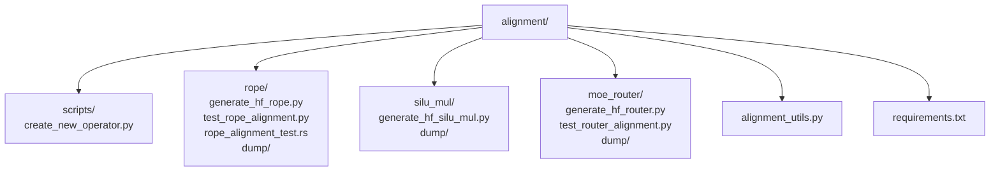
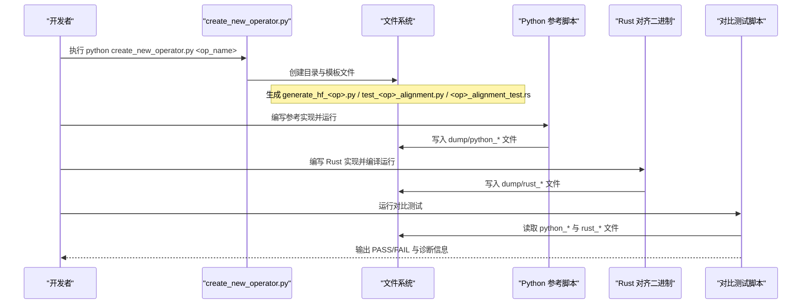
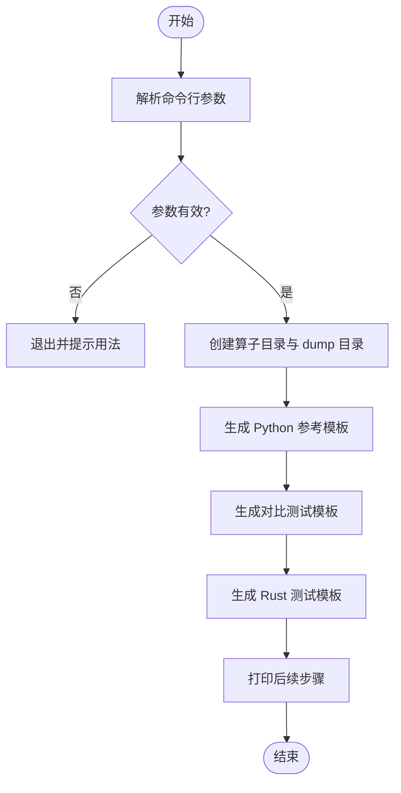
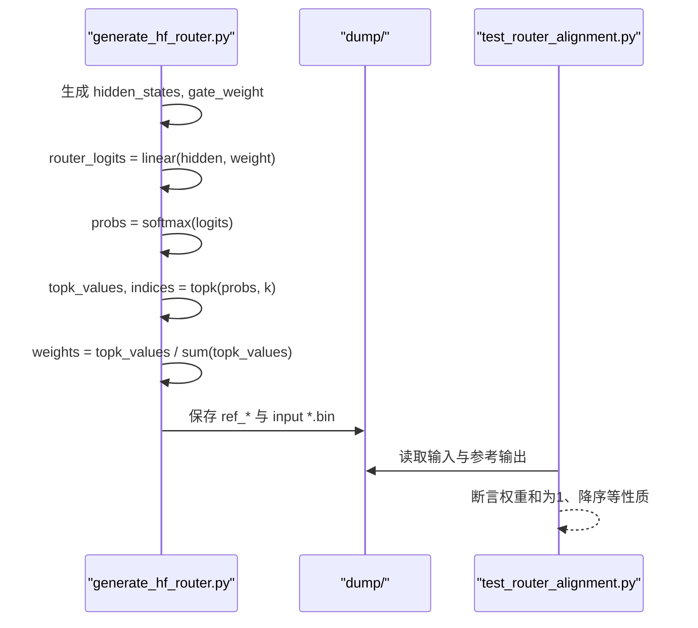
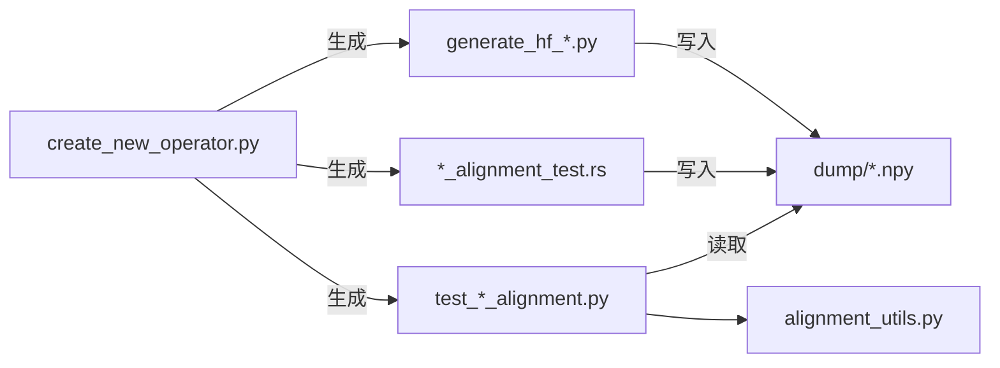

# 测试生成工具

<cite>
**本文引用的文件**   
- [alignment/scripts/create_new_operator.py](file://alignment/scripts/create_new_operator.py)
- [alignment/README.md](file://alignment/README.md)
- [alignment/requirements.txt](file://alignment/requirements.txt)
- [alignment/alignment_utils.py](file://alignment/alignment_utils.py)
- [alignment/rope/generate_hf_rope.py](file://alignment/rope/generate_hf_rope.py)
- [alignment/rope/test_rope_alignment.py](file://alignment/rope/test_rope_alignment.py)
- [alignment/rope/rope_alignment_test.rs](file://alignment/rope/rope_alignment_test.rs)
- [alignment/silu_mul/generate_hf_silu_mul.py](file://alignment/silu_mul/generate_hf_silu_mul.py)
- [alignment/moe_router/generate_hf_router.py](file://alignment/moe_router/generate_hf_router.py)
- [alignment/moe_router/test_router_alignment.py](file://alignment/moe_router/test_router_alignment.py)
- [docs/contributing/new_operator.md](file://docs/contributing/new_operator.md)
</cite>

## 目录
1. [简介](#简介)
2. [项目结构](#项目结构)
3. [核心组件](#核心组件)
4. [架构总览](#架构总览)
5. [详细组件分析](#详细组件分析)
6. [依赖关系分析](#依赖关系分析)
7. [性能与精度考量](#性能与精度考量)
8. [批量测试与自动化集成](#批量测试与自动化集成)
9. [故障排查指南](#故障排查指南)
10. [结论](#结论)

## 简介
本文件面向希望快速为新的算子构建对齐测试的开发者，聚焦于使用模板工具 create_new_operator.py 创建“Python 参考实现 + Rust 测试 + 对比脚本”的一体化测试框架。文档同时覆盖：
- 工具生成的文件结构与每个文件的用途
- 如何自定义模板以适配特定算子的测试需求
- 复杂模型组件（如 MoE 路由器）的测试方法
- 批量执行与 CI 集成的建议
- 常见问题与排障要点

## 项目结构
对齐测试位于 alignment 目录下，采用按算子分目录的组织方式。每个算子包含：
- Python 参考数据生成脚本（generate_hf_*.py）
- 对比测试脚本（test_*_alignment.py）
- Rust 对齐二进制（*_alignment_test.rs）
- dump 目录用于存放中间结果（.npy/.bin）

图示来源
- [alignment/README.md:12-37](file://alignment/README.md#L12-L37)
- [alignment/scripts/create_new_operator.py:1-180](file://alignment/scripts/create_new_operator.py#L1-L180)

章节来源
- [alignment/README.md:1-89](file://alignment/README.md#L1-L89)

## 核心组件
- 模板工具：alignment/scripts/create_new_operator.py
  - 作用：根据传入的算子名，自动创建目录、dump 占位、以及三类模板文件（Python 参考、Rust 测试、对比脚本）。
  - 输出产物：
    - generate_hf_<operator>.py：参考实现模板，负责生成输入/权重/输出并保存到 dump。
    - test_<operator>_alignment.py：对比脚本，加载 Python 与 Rust 的输出进行数值比较。
    - <operator>_alignment_test.rs：Rust 测试模板，调用具体算子并将结果写入 dump。
- 通用工具：alignment/alignment_utils.py
  - 提供 compare_arrays、load_npy、save_npy、get_dump_dir 等复用函数。
- 示例参考：
  - rope：展示完整参考实现与多场景（基础/部分旋转/Yarn 缩放）对齐流程。
  - silu_mul：展示元素级融合算子的参考实现与数据保存。
  - moe_router：展示复杂路由器的端到端参考计算与中间产物保存。

章节来源
- [alignment/scripts/create_new_operator.py:1-180](file://alignment/scripts/create_new_operator.py#L1-L180)
- [alignment/alignment_utils.py:1-91](file://alignment/alignment_utils.py#L1-L91)
- [alignment/rope/generate_hf_rope.py:1-110](file://alignment/rope/generate_hf_rope.py#L1-L110)
- [alignment/rope/test_rope_alignment.py:1-255](file://alignment/rope/test_rope_alignment.py#L1-L255)
- [alignment/rope/rope_alignment_test.rs:1-47](file://alignment/rope/rope_alignment_test.rs#L1-L47)
- [alignment/silu_mul/generate_hf_silu_mul.py:1-45](file://alignment/silu_mul/generate_hf_silu_mul.py#L1-L45)
- [alignment/moe_router/generate_hf_router.py:1-73](file://alignment/moe_router/generate_hf_router.py#L1-L73)
- [alignment/moe_router/test_router_alignment.py:1-104](file://alignment/moe_router/test_router_alignment.py#L1-L104)

## 架构总览
下图展示了“模板工具 → 生成文件 → 运行流程 → 对比验证”的整体链路。

图示来源
- [alignment/scripts/create_new_operator.py:1-180](file://alignment/scripts/create_new_operator.py#L1-L180)
- [alignment/rope/test_rope_alignment.py:1-255](file://alignment/rope/test_rope_alignment.py#L1-L255)
- [alignment/rope/rope_alignment_test.rs:1-47](file://alignment/rope/rope_alignment_test.rs#L1-L47)

## 详细组件分析

### 模板工具 create_new_operator.py
- 功能要点
  - 参数校验与提示用法
  - 基于 operator_name 推导类名与文件名
  - 创建目录与 .gitkeep
  - 生成三类模板文件内容并落盘
  - 打印后续步骤指引
- 关键行为路径
  - 入口 main() 解析参数
  - 构造路径与目录
  - 写入 generate_hf_{operator}.py
  - 写入 test_{operator}_alignment.py
  - 写入 {operator}_alignment_test.rs
  - 输出成功信息与下一步操作

图示来源
- [alignment/scripts/create_new_operator.py:1-180](file://alignment/scripts/create_new_operator.py#L1-L180)

章节来源
- [alignment/scripts/create_new_operator.py:1-180](file://alignment/scripts/create_new_operator.py#L1-L180)

### Python 参考实现模板（generate_hf_*.py）
- 职责
  - 生成符合算子语义的输入/权重/输出
  - 将结果以 npy 格式保存到 dump 目录
- 典型模式
  - 固定随机种子保证可复现
  - 使用 NumPy/Torch 完成参考计算
  - 输出形状与数据类型需与 Rust 侧一致
- 参考案例
  - RoPE：多场景（基础/部分旋转/Yarn）参考生成
  - SiLU-Mul：元素级融合参考实现

章节来源
- [alignment/rope/generate_hf_rope.py:1-110](file://alignment/rope/generate_hf_rope.py#L1-L110)
- [alignment/silu_mul/generate_hf_silu_mul.py:1-45](file://alignment/silu_mul/generate_hf_silu_mul.py#L1-L45)

### Rust 测试模板（*_alignment_test.rs）
- 职责
  - 加载相同输入，调用 Rust 算子实现
  - 将输出写入 dump 目录供 Python 对比
- 参考案例
  - RoPE：直接调用 RotaryEmbedding 并保存多个场景输出

章节来源
- [alignment/rope/rope_alignment_test.rs:1-47](file://alignment/rope/rope_alignment_test.rs#L1-L47)

### 对比测试脚本（test_*_alignment.py）
- 职责
  - 读取 Python 与 Rust 的输出文件
  - 进行形状与数值一致性检查
  - 输出诊断信息（最大绝对误差、平均绝对误差、余弦相似度）
- 阈值策略
  - 默认 max_abs < 1e-5、mean_abs < 1e-6、cosine > 0.999999
- 参考案例
  - RoPE：多场景对比与断言

章节来源
- [alignment/rope/test_rope_alignment.py:1-255](file://alignment/rope/test_rope_alignment.py#L1-L255)
- [alignment/alignment_utils.py:1-91](file://alignment/alignment_utils.py#L1-L91)

### 复杂组件测试：MoE 路由器
- 测试目标
  - 验证线性投影、全 Softmax、Top-K、归一化四步的数学等价性
- 参考实现
  - 使用 Torch 在 FP32 下生成 logits/probs/topk/weights
  - 保存中间产物便于逐步定位差异
- 数据格式
  - 除 npy 外，还提供 flat f32 二进制，便于 Rust 高效加载

图示来源
- [alignment/moe_router/generate_hf_router.py:1-73](file://alignment/moe_router/generate_hf_router.py#L1-L73)
- [alignment/moe_router/test_router_alignment.py:1-104](file://alignment/moe_router/test_router_alignment.py#L1-L104)

章节来源
- [alignment/moe_router/generate_hf_router.py:1-73](file://alignment/moe_router/generate_hf_router.py#L1-L73)
- [alignment/moe_router/test_router_alignment.py:1-104](file://alignment/moe_router/test_router_alignment.py#L1-L104)

## 依赖关系分析
- Python 依赖
  - numpy>=1.21.0
  - torch>=1.13.0
- 模块耦合
  - 模板工具不依赖外部库，仅使用标准库与 pathlib
  - 对比脚本依赖 numpy；可选依赖 alignment_utils 中的公共函数
  - Rust 测试依赖项目内部算子实现与 npy 序列化能力

图示来源
- [alignment/scripts/create_new_operator.py:1-180](file://alignment/scripts/create_new_operator.py#L1-L180)
- [alignment/alignment_utils.py:1-91](file://alignment/alignment_utils.py#L1-L91)

章节来源
- [alignment/requirements.txt:1-3](file://alignment/requirements.txt#L1-L3)

## 性能与精度考量
- 精度基准
  - 对比脚本默认使用严格阈值，建议在 FP32 下进行对齐验证
  - 对于涉及数值稳定性的算子（如 Softmax、TopK），优先在参考实现中显式处理溢出与归一化
- 性能建议
  - 参考实现可使用 Torch/NumPy 向量化加速
  - Rust 侧尽量复用内存布局，避免不必要的拷贝
  - 对大规模数据，考虑分批生成与增量对比

[本节为通用指导，无需列出具体文件来源]

## 批量测试与自动化集成
- 本地批量执行
  - 遍历 alignment 下各算子目录，依次执行：
    - Python 参考生成
    - Rust 对齐二进制运行
    - 对比测试脚本
- CI 集成建议
  - 安装 Python 依赖：pip install -r alignment/requirements.txt
  - 缓存第三方包与构建产物，提升重复执行效率
  - 为不同平台/编译器版本设置矩阵
  - 失败时保留 dump 产物以便离线分析
- 参考实践
  - 贡献指南中提供了添加新算子与对齐测试的标准流程

章节来源
- [docs/contributing/new_operator.md:98-124](file://docs/contributing/new_operator.md#L98-L124)
- [alignment/README.md:5-10](file://alignment/README.md#L5-L10)

## 故障排查指南
- 常见错误与修复
  - 未安装 Python 依赖：确保已安装 numpy 与 torch
  - 缺少 dump 文件或命名不一致：确认 Python/Rust 输出文件名与对比脚本期望一致
  - 形状不匹配：核对输入维度、数据类型与布局（行/列主序）
  - 数值差异过大：检查是否在同一精度（FP32）下计算，关注 Softmax/TopK 的数值稳定性
- 调试技巧
  - 先单独运行 Python 参考与 Rust 二进制，分别检查输出
  - 使用小尺寸输入快速定位问题
  - 借助 alignment_utils.compare_arrays 的详细诊断输出
- 参考路径
  - 对比逻辑与阈值定义见对比脚本与工具函数
  - 参考实现样例见 rope 与 silu_mul 目录

章节来源
- [alignment/rope/test_rope_alignment.py:145-176](file://alignment/rope/test_rope_alignment.py#L145-L176)
- [alignment/alignment_utils.py:5-53](file://alignment/alignment_utils.py#L5-L53)

## 结论
通过 create_new_operator.py 模板工具，开发者可以快速搭建“参考实现 + Rust 测试 + 对比脚本”的标准化对齐测试框架。结合 rope、silu_mul、moe_router 等示例，能够覆盖从简单元素级算子到复杂路由器的多种测试场景。配合批量执行与 CI 集成，可有效保障算子实现的正确性与稳定性。