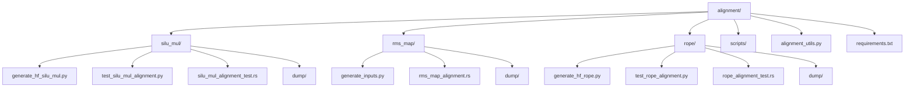
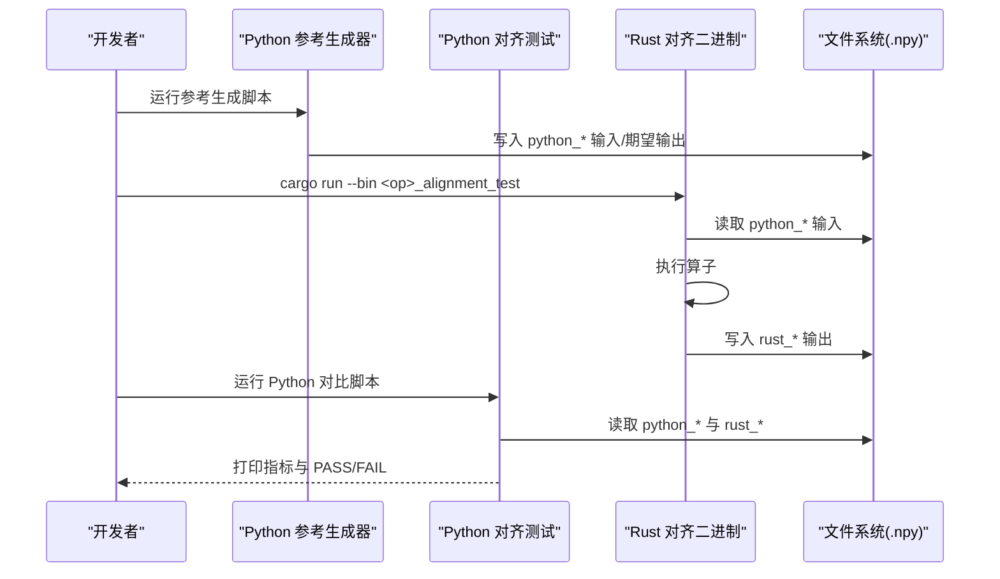
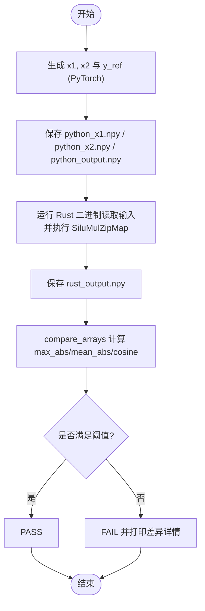
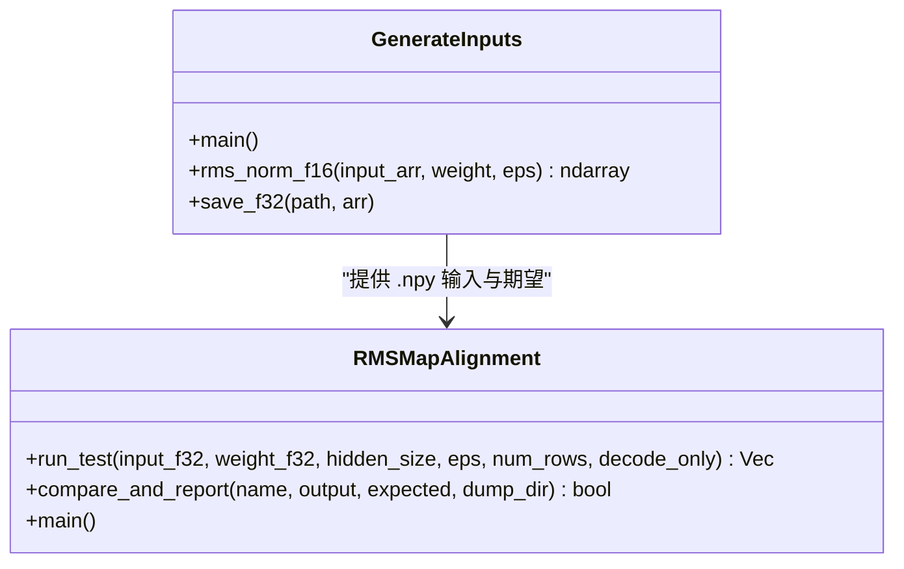
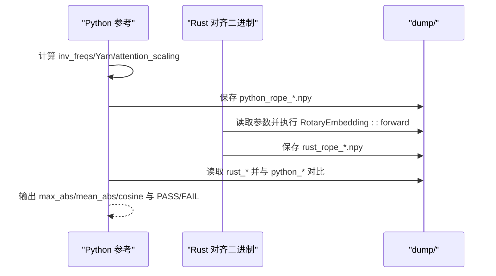
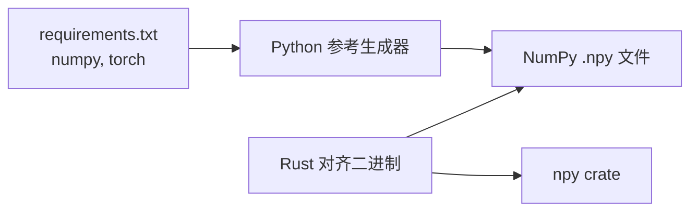

# 算子测试与验证

<cite>
**本文引用的文件**   
- [alignment/README.md](file://alignment/README.md)
- [alignment/requirements.txt](file://alignment/requirements.txt)
- [alignment/alignment_utils.py](file://alignment/alignment_utils.py)
- [alignment/silu_mul/test_silu_mul_alignment.py](file://alignment/silu_mul/test_silu_mul_alignment.py)
- [alignment/silu_mul/generate_hf_silu_mul.py](file://alignment/silu_mul/generate_hf_silu_mul.py)
- [alignment/silu_mul/silu_mul_alignment_test.rs](file://alignment/silu_mul/silu_mul_alignment_test.rs)
- [alignment/rms_map/generate_inputs.py](file://alignment/rms_map/generate_inputs.py)
- [alignment/rms_map/rms_map_alignment.rs](file://alignment/rms_map/rms_map_alignment.rs)
- [alignment/rope/test_rope_alignment.py](file://alignment/rope/test_rope_alignment.py)
- [alignment/rope/generate_hf_rope.py](file://alignment/rope/generate_hf_rope.py)
- [alignment/rope/rope_alignment_test.rs](file://alignment/rope/rope_alignment_test.rs)
- [skills/align-operators/SKILL.md](file://skills/align-operators/SKILL.md)
- [skills/align-operators/references/alignment-spec.md](file://skills/align-operators/references/alignment-spec.md)
- [docs/contributing/new_operator.md](file://docs/contributing/new_operator.md)
</cite>

## 目录
1. [简介](#简介)
2. [项目结构](#项目结构)
3. [核心组件](#核心组件)
4. [架构总览](#架构总览)
5. [详细组件分析](#详细组件分析)
6. [依赖关系分析](#依赖关系分析)
7. [性能考虑](#性能考虑)
8. [故障排查指南](#故障排查指南)
9. [结论](#结论)
10. [附录](#附录)

## 简介
本文件面向“算子对齐测试与验证”的完整工作流，覆盖从参考输出生成、Rust 二进制对比、误差容忍度设置到单测/集成/基准测试的组织方式。文档以仓库中已有的对齐脚本与 Rust 二进制为蓝本，提供可复用的模板与最佳实践，帮助开发者快速为新算子建立可靠的数值一致性保障。

## 项目结构
对齐测试位于 alignment 目录下，每个算子一个独立目录，包含：
- Python 参考实现与数据生成脚本（NumPy/PyTorch）
- 对齐测试脚本（Python）
- Rust 对齐二进制（读取 .npy 输入并导出 .npy 结果）
- dump 目录用于存放中间产物与对比文件

图示来源
- [alignment/README.md:12-37](file://alignment/README.md#L12-L37)

章节来源
- [alignment/README.md:1-37](file://alignment/README.md#L1-L37)

## 核心组件
- 共享工具库
  - compare_arrays：统一计算 max_abs、mean_abs、cosine similarity，并给出 PASS/FAIL 判定
  - load_npy/save_npy：NumPy I/O 封装
  - get_dump_dir：按脚本位置解析 dump 目录路径
- Python 参考生成器
  - 使用 NumPy/PyTorch 在 FP32 下生成确定性参考输出，保存为 .npy
- Rust 对齐二进制
  - 加载 .npy 输入，调用目标算子运行，将结果写回 .npy，并在内部或外部进行对比

章节来源
- [alignment/alignment_utils.py:5-53](file://alignment/alignment_utils.py#L5-L53)
- [alignment/alignment_utils.py:56-91](file://alignment/alignment_utils.py#L56-L91)
- [alignment/silu_mul/generate_hf_silu_mul.py:5-22](file://alignment/silu_mul/generate_hf_silu_mul.py#L5-L22)
- [alignment/silu_mul/silu_mul_alignment_test.rs:19-82](file://alignment/silu_mul/silu_mul_alignment_test.rs#L19-L82)

## 架构总览
对齐测试采用“Python 参考 + Rust 二进制 + .npy 中间产物”的解耦模式。典型流程如下：

图示来源
- [alignment/silu_mul/test_silu_mul_alignment.py:9-35](file://alignment/silu_mul/test_silu_mul_alignment.py#L9-L35)
- [alignment/silu_mul/silu_mul_alignment_test.rs:19-82](file://alignment/silu_mul/silu_mul_alignment_test.rs#L19-L82)
- [alignment/rms_map/rms_map_alignment.rs:112-185](file://alignment/rms_map/rms_map_alignment.rs#L112-L185)
- [alignment/rope/test_rope_alignment.py:179-250](file://alignment/rope/test_rope_alignment.py#L179-L250)

## 详细组件分析

### SiluMul 对齐示例（融合算子）
- 参考生成
  - 使用 PyTorch 的 silu 与逐元素乘法生成期望输出，固定随机种子保证可重复性
- 对比策略
  - Python 侧通过 compare_arrays 统一阈值判定；Rust 侧也可自行计算指标并输出 PASS/FAIL
- 关键要点
  - 融合算子在 Python 侧需拆分为顺序步骤生成参考
  - 形状与布局必须严格一致

图示来源
- [alignment/silu_mul/generate_hf_silu_mul.py:5-22](file://alignment/silu_mul/generate_hf_silu_mul.py#L5-L22)
- [alignment/silu_mul/test_silu_mul_alignment.py:9-35](file://alignment/silu_mul/test_silu_mul_alignment.py#L9-L35)
- [alignment/silu_mul/silu_mul_alignment_test.rs:19-82](file://alignment/silu_mul/silu_mul_alignment_test.rs#L19-L82)
- [alignment/alignment_utils.py:5-53](file://alignment/alignment_utils.py#L5-L53)

章节来源
- [alignment/silu_mul/generate_hf_silu_mul.py:1-45](file://alignment/silu_mul/generate_hf_silu_mul.py#L1-L45)
- [alignment/silu_mul/test_silu_mul_alignment.py:1-40](file://alignment/silu_mul/test_silu_mul_alignment.py#L1-L40)
- [alignment/silu_mul/silu_mul_alignment_test.rs:1-83](file://alignment/silu_mul/silu_mul_alignment_test.rs#L1-L83)
- [alignment/alignment_utils.py:1-91](file://alignment/alignment_utils.py#L1-L91)

### RMSMap 对齐示例（FP16 等价路径）
- 参考生成
  - 模拟 Rust 的 f16 等价路径：先 cast 到 f16，累加在 f32，再 cast 回 f16，最终保存为 float32 便于 npy crate 读取
- 测试场景
  - 序列值、全零、全一、随机输入、随机权重、decode-only 模式等
- 对比策略
  - Rust 侧直接比较并报告 max_err、mean_err、cosine，同时定位首个不匹配位置

图示来源
- [alignment/rms_map/generate_inputs.py:18-46](file://alignment/rms_map/generate_inputs.py#L18-L46)
- [alignment/rms_map/generate_inputs.py:49-91](file://alignment/rms_map/generate_inputs.py#L49-L91)
- [alignment/rms_map/rms_map_alignment.rs:29-110](file://alignment/rms_map/rms_map_alignment.rs#L29-L110)
- [alignment/rms_map/rms_map_alignment.rs:112-185](file://alignment/rms_map/rms_map_alignment.rs#L112-L185)

章节来源
- [alignment/rms_map/generate_inputs.py:1-92](file://alignment/rms_map/generate_inputs.py#L1-L92)
- [alignment/rms_map/rms_map_alignment.rs:1-186](file://alignment/rms_map/rms_map_alignment.rs#L1-L186)

### RoPE 对齐示例（含 Yarn Scaling）
- 参考生成
  - 纯 Python 实现 inv_freqs、Yarn scaling、attention_scaling，输出 cos/sin 交错排列
- 对比策略
  - 若存在 Rust 输出则直接对比；否则仅验证 Python 逻辑自洽并保存参考文件
- 关键点
  - 注意 rotary_dim 与 head_dim 的关系及尾部恒等填充

图示来源
- [alignment/rope/generate_hf_rope.py:15-40](file://alignment/rope/generate_hf_rope.py#L15-L40)
- [alignment/rope/test_rope_alignment.py:179-250](file://alignment/rope/test_rope_alignment.py#L179-L250)
- [alignment/rope/rope_alignment_test.rs:8-46](file://alignment/rope/rope_alignment_test.rs#L8-L46)

章节来源
- [alignment/rope/generate_hf_rope.py:1-110](file://alignment/rope/generate_hf_rope.py#L1-L110)
- [alignment/rope/test_rope_alignment.py:1-255](file://alignment/rope/test_rope_alignment.py#L1-L255)
- [alignment/rope/rope_alignment_test.rs:1-47](file://alignment/rope/rope_alignment_test.rs#L1-L47)

### 新增算子模板与规范
- 推荐工作流
  - 在 alignment/<op_name>/ 下创建 generate_hf_<op>.py 与 test_<op>_alignment.py
  - 编写 Rust 对齐二进制，注册为 Cargo bin，读取 .npy 输入并输出 .npy 结果
- 命名约定
  - 算子结构体 PascalCase，文件 snake_case.rs
  - 对齐目录 alignment/<op_name>/
  - 测试输入文件 python_<op_name>_<role>.npy

章节来源
- [docs/contributing/new_operator.md:98-137](file://docs/contributing/new_operator.md#L98-L137)
- [alignment/README.md:39-68](file://alignment/README.md#L39-L68)

## 依赖关系分析
- Python 依赖
  - numpy>=1.21.0
  - torch>=1.13.0
- Rust 依赖
  - npy crate 用于读写 .npy
  - serde_json（部分用例）
- 模块耦合
  - Python 参考生成器与测试脚本通过 .npy 文件解耦
  - Rust 二进制通过 .npy 与 Python 侧交换数据，避免直接耦合

图示来源
- [alignment/requirements.txt:1-3](file://alignment/requirements.txt#L1-L3)
- [alignment/silu_mul/silu_mul_alignment_test.rs:5-17](file://alignment/silu_mul/silu_mul_alignment_test.rs#L5-L17)
- [alignment/rms_map/rms_map_alignment.rs:7-19](file://alignment/rms_map/rms_map_alignment.rs#L7-L19)

章节来源
- [alignment/requirements.txt:1-3](file://alignment/requirements.txt#L1-L3)

## 性能考虑
- 对齐测试聚焦数值正确性，通常在小规模张量上运行，不应作为性能基准
- 如需性能评估，建议：
  - 使用更大 batch/seq_len 的独立基准程序
  - 关闭调试信息，启用优化编译
  - 多次运行取稳定统计（均值、方差、P95/P99）
- 对齐测试中的 I/O（.npy）开销应被忽略或单独测量

[本节为通用指导，无需具体文件引用]

## 故障排查指南
- 常见错误
  - 形状不一致：检查 reshape/transpose/layout 是否与参考一致
  - 精度问题：确认双方均使用 FP32；对 f16 路径需显式 cast
  - 数值稳定性：softmax/RMSNorm 的 epsilon 与减最大值顺序可能影响结果
  - 隐式 f64 累积：避免不必要的 double 精度中间变量
- 定位方法
  - 打印前若干元素的逐项差异
  - 记录首个不匹配索引，结合行/列坐标定位
  - 分别输出 max_abs、mean_abs、cosine 三项指标
- 参考阈值
  - max_abs < 1e-5
  - mean_abs < 1e-6
  - cosine > 0.999999

章节来源
- [alignment/alignment_utils.py:5-53](file://alignment/alignment_utils.py#L5-L53)
- [alignment/silu_mul/silu_mul_alignment_test.rs:54-79](file://alignment/silu_mul/silu_mul_alignment_test.rs#L54-L79)
- [alignment/rms_map/rms_map_alignment.rs:57-110](file://alignment/rms_map/rms_map_alignment.rs#L57-L110)
- [skills/align-operators/references/alignment-spec.md:164-190](file://skills/align-operators/references/alignment-spec.md#L164-L190)

## 结论
通过统一的 Python 参考生成与 Rust 二进制对比流程，配合严格的 FP32 阈值与清晰的日志输出，可以快速、可靠地验证算子实现的数值一致性。建议在新增算子时遵循模板与命名规范，并将对齐测试纳入日常开发流程。

[本节为总结性内容，无需具体文件引用]

## 附录

### 环境准备
- 安装 Python 依赖
  - pip install -r alignment/requirements.txt

章节来源
- [alignment/README.md:5-10](file://alignment/README.md#L5-L10)
- [alignment/requirements.txt:1-3](file://alignment/requirements.txt#L1-L3)

### 标准阈值与指标定义
- 指标
  - max_abs = max(|a - b|)
  - mean_abs = mean(|a - b|)
  - cosine = dot(a,b)/(||a||*||b||)
- 接受标准
  - max_abs < 1e-5
  - mean_abs < 1e-6
  - cosine > 0.999999

章节来源
- [skills/align-operators/references/alignment-spec.md:164-190](file://skills/align-operators/references/alignment-spec.md#L164-L190)
- [alignment/alignment_utils.py:28-43](file://alignment/alignment_utils.py#L28-L43)

### 测试类型与组织建议
- 单元测试
  - 针对单个算子，小批量、代表性形状，确保快速反馈
- 集成测试
  - 组合多个算子形成子图，验证端到端数学等价
- 性能基准测试
  - 独立于对齐测试，关注吞吐与时延，使用大规模输入与多轮统计

章节来源
- [skills/align-operators/SKILL.md:1-29](file://skills/align-operators/SKILL.md#L1-L29)
- [docs/contributing/new_operator.md:98-137](file://docs/contributing/new_operator.md#L98-L137)

### 常用命令模板
- 生成参考数据
  - python alignment/<op>/generate_hf_<op>.py
- 运行 Rust 对齐二进制
  - cargo run --bin <op>_alignment_test
- 运行 Python 对比脚本
  - python alignment/<op>/test_<op>_alignment.py

章节来源
- [docs/contributing/new_operator.md:118-123](file://docs/contributing/new_operator.md#L118-L123)
- [alignment/rope/test_rope_alignment.py:179-250](file://alignment/rope/test_rope_alignment.py#L179-L250)
- [alignment/silu_mul/test_silu_mul_alignment.py:9-35](file://alignment/silu_mul/test_silu_mul_alignment.py#L9-L35)