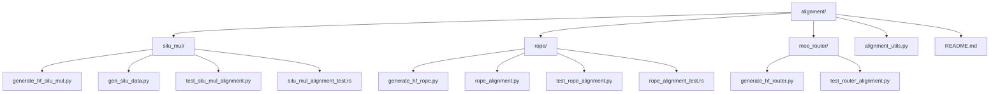
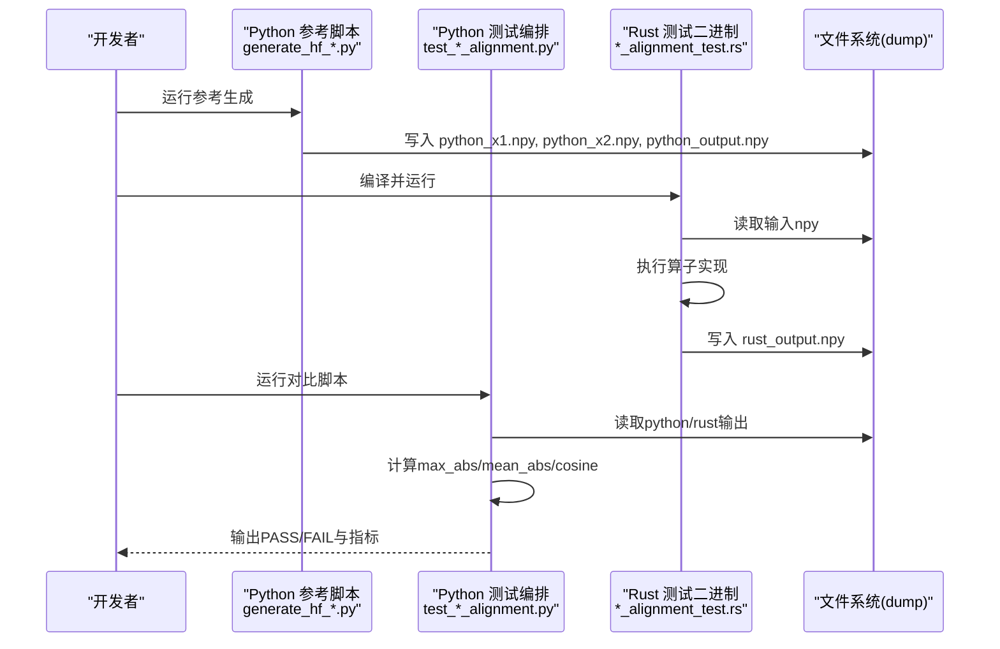
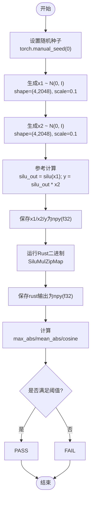
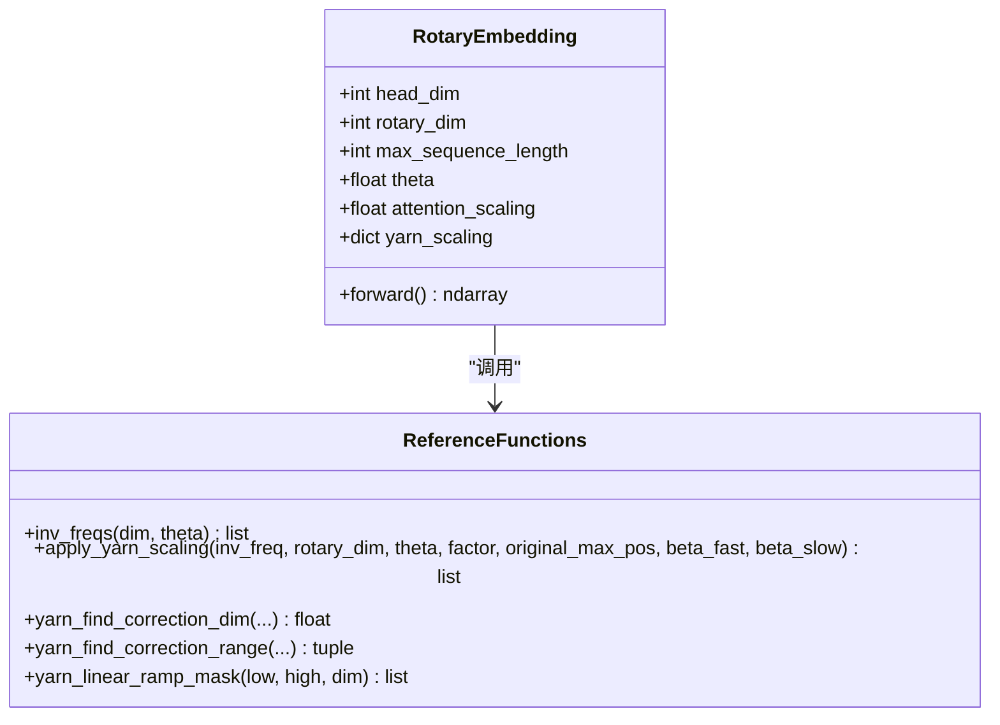
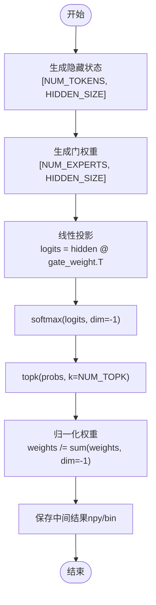
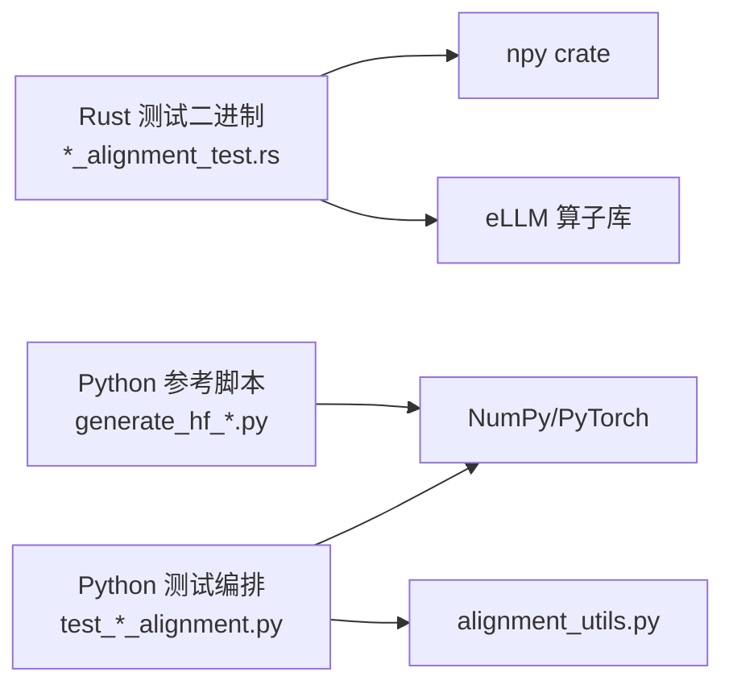

# 算子测试示例

<cite>
**本文引用的文件**   
- [alignment/README.md](file://alignment/README.md)
- [alignment/alignment_utils.py](file://alignment/alignment_utils.py)
- [alignment/silu_mul/generate_hf_silu_mul.py](file://alignment/silu_mul/generate_hf_silu_mul.py)
- [alignment/silu_mul/gen_silu_data.py](file://alignment/silu_mul/gen_silu_data.py)
- [alignment/silu_mul/test_silu_mul_alignment.py](file://alignment/silu_mul/test_silu_mul_alignment.py)
- [alignment/silu_mul/silu_mul_alignment_test.rs](file://alignment/silu_mul/silu_mul_alignment_test.rs)
- [alignment/rope/generate_hf_rope.py](file://alignment/rope/generate_hf_rope.py)
- [alignment/rope/rope_alignment.py](file://alignment/rope/rope_alignment.py)
- [alignment/rope/test_rope_alignment.py](file://alignment/rope/test_rope_alignment.py)
- [alignment/rope/rope_alignment_test.rs](file://alignment/rope/rope_alignment_test.rs)
- [alignment/moe_router/generate_hf_router.py](file://alignment/moe_router/generate_hf_router.py)
- [alignment/moe_router/test_router_alignment.py](file://alignment/moe_router/test_router_alignment.py)
- [skills/align-operators/SKILL.md](file://skills/align-operators/SKILL.md)
- [skills/align-operators/references/alignment-spec.md](file://skills/align-operators/references/alignment-spec.md)
</cite>

## 目录
1. [简介](#简介)
2. [项目结构](#项目结构)
3. [核心组件](#核心组件)
4. [架构总览](#架构总览)
5. [详细组件分析](#详细组件分析)
6. [依赖关系分析](#依赖关系分析)
7. [性能与数值稳定性考虑](#性能与数值稳定性考虑)
8. [故障排查指南](#故障排查指南)
9. [结论](#结论)
10. [附录：最佳实践与设计原则](#附录最佳实践与设计原则)

## 简介
本文件面向“算子对齐测试”的完整实现流程，通过两个典型算子案例（SiLU 乘法、RoPE 旋转位置编码）展示如何编写 Python 参考脚本生成 NumPy 参考输出，以及如何编写 Rust 测试二进制进行结果对比。文档同时覆盖测试数据生成策略、随机种子设置、边界条件处理，并给出不同算子类型的测试模式（逐元素操作、矩阵运算、注意力机制等），以及用例设计原则与最佳实践。

## 项目结构
对齐测试位于 alignment 目录下，每个算子一个独立目录，包含：
- dump：存放生成的输入/输出 npy 或二进制文件
- generate_hf_*.py：Python 参考实现，生成 NumPy 格式的参考输出
- test_*_alignment.py：Python 测试编排脚本，负责调用参考实现、加载 Rust 输出并进行比较
- *_alignment_test.rs：Rust 测试二进制，读取输入、执行算子、写出输出供对比

图表来源
- [alignment/README.md:1-89](file://alignment/README.md#L1-L89)

章节来源
- [alignment/README.md:1-89](file://alignment/README.md#L1-L89)

## 核心组件
- Python 参考实现脚本（generate_hf_*.py）：使用 PyTorch/Numpy 以 FP32 精确计算，固定随机种子，生成可复现的参考输出到 dump 目录。
- Rust 测试二进制（*_alignment_test.rs）：读取相同输入，运行 Rust 算子实现，将输出保存为 npy f32 数组。
- 对比工具（alignment_utils.py）：提供 compare_arrays、load_npy/save_npy 等通用函数，统一评估指标与阈值。
- 测试编排脚本（test_*_alignment.py）：串联参考生成与 Rust 输出对比，打印 PASS/FAIL 及详细指标。

章节来源
- [alignment/alignment_utils.py:1-91](file://alignment/alignment_utils.py#L1-L91)
- [alignment/silu_mul/test_silu_mul_alignment.py:1-40](file://alignment/silu_mul/test_silu_mul_alignment.py#L1-L40)
- [alignment/rope/test_rope_alignment.py:1-255](file://alignment/rope/test_rope_alignment.py#L1-L255)

## 架构总览
整体流程分为三步：
1) 生成参考：Python 参考脚本生成输入与期望输出；
2) 运行 Rust：Rust 测试二进制读取输入并执行算子，写出输出；
3) 对比判定：Python 测试脚本加载双方输出，计算误差与余弦相似度，判定是否通过。

图表来源
- [alignment/silu_mul/generate_hf_silu_mul.py:1-45](file://alignment/silu_mul/generate_hf_silu_mul.py#L1-L45)
- [alignment/silu_mul/silu_mul_alignment_test.rs:1-83](file://alignment/silu_mul/silu_mul_alignment_test.rs#L1-L83)
- [alignment/silu_mul/test_silu_mul_alignment.py:1-40](file://alignment/silu_mul/test_silu_mul_alignment.py#L1-L40)
- [alignment/rope/generate_hf_rope.py:1-110](file://alignment/rope/generate_hf_rope.py#L1-L110)
- [alignment/rope/rope_alignment_test.rs:1-47](file://alignment/rope/rope_alignment_test.rs#L1-L47)
- [alignment/rope/test_rope_alignment.py:1-255](file://alignment/rope/test_rope_alignment.py#L1-L255)

## 详细组件分析

### SiLU 乘法（逐元素融合算子）
SiLU 乘法是典型的逐元素融合算子：先对 x1 做 SiLU，再与 x2 逐元素相乘。Python 参考以 PyTorch 顺序实现，Rust 侧使用融合算子 SiluMulZipMap。

#### 关键实现要点
- 参考生成：固定 torch.manual_seed(0)，生成形状为 [batch_size=4, hidden_size=2048] 的浮点张量，乘以缩放因子 0.1 控制数值范围。
- 输出格式：ravel 展平后保存为 npy f32，便于 Rust 直接读取。
- Rust 测试：构造 SiluMulZipMap，传入 head_num/head_size/prefill_size 参数，运行后写出 rust_silu_mul_output.npy。
- 对比指标：max_abs < 1e-5，mean_abs < 1e-6，cosine > 0.999999。

图表来源
- [alignment/silu_mul/generate_hf_silu_mul.py:1-45](file://alignment/silu_mul/generate_hf_silu_mul.py#L1-L45)
- [alignment/silu_mul/silu_mul_alignment_test.rs:1-83](file://alignment/silu_mul/silu_mul_alignment_test.rs#L1-L83)
- [alignment/silu_mul/test_silu_mul_alignment.py:1-40](file://alignment/silu_mul/test_silu_mul_alignment.py#L1-L40)

章节来源
- [alignment/silu_mul/generate_hf_silu_mul.py:1-45](file://alignment/silu_mul/generate_hf_silu_mul.py#L1-L45)
- [alignment/silu_mul/gen_silu_data.py:1-29](file://alignment/silu_mul/gen_silu_data.py#L1-L29)
- [alignment/silu_mul/silu_mul_alignment_test.rs:1-83](file://alignment/silu_mul/silu_mul_alignment_test.rs#L1-L83)
- [alignment/silu_mul/test_silu_mul_alignment.py:1-40](file://alignment/silu_mul/test_silu_mul_alignment.py#L1-L40)

### RoPE 旋转位置编码（注意力机制相关）
RoPE 用于在注意力中注入位置信息，支持部分旋转维度与 Yarn 扩展长度策略。Python 参考实现与 Rust 实现需严格一致。

#### 关键实现要点
- inv_freqs：按 rotary_dim 步长 2 计算逆频率序列。
- 基本 RoPE：head_dim=rotary_dim，其余维度补恒等变换 (1, 0)。
- 部分旋转：rotary_dim < head_dim，尾部补恒等。
- Yarn 缩放：根据 factor、original_max_position_embeddings、beta_fast/beta_slow 调整逆频率，并对 attention_scaling 应用缩放。
- 输出布局：每位置输出 interleaved cos/sin 对，然后补齐剩余维度的恒等对。

图表来源
- [alignment/rope/rope_alignment.py:1-173](file://alignment/rope/rope_alignment.py#L1-L173)
- [alignment/rope/generate_hf_rope.py:1-110](file://alignment/rope/generate_hf_rope.py#L1-L110)
- [alignment/rope/rope_alignment_test.rs:1-47](file://alignment/rope/rope_alignment_test.rs#L1-L47)

章节来源
- [alignment/rope/generate_hf_rope.py:1-110](file://alignment/rope/generate_hf_rope.py#L1-L110)
- [alignment/rope/rope_alignment.py:1-173](file://alignment/rope/rope_alignment.py#L1-L173)
- [alignment/rope/test_rope_alignment.py:1-255](file://alignment/rope/test_rope_alignment.py#L1-L255)
- [alignment/rope/rope_alignment_test.rs:1-47](file://alignment/rope/rope_alignment_test.rs#L1-L47)

### MoE Router（Softmax + TopK + Normalize）
MoE Router 作为矩阵运算与选择归一化的组合，展示了更复杂的算子链对齐方式。

- 参考实现：线性投影 -> 全 softmax -> topk 选择 -> 归一化权重。
- 测试数据：隐藏状态与门权重采用真实配置规模（hidden_size=2048, num_experts=128, topk=8）。
- 输出：保存 logits、probs、indices、归一化权重等中间结果，便于逐步验证。

图表来源
- [alignment/moe_router/generate_hf_router.py:1-73](file://alignment/moe_router/generate_hf_router.py#L1-L73)
- [alignment/moe_router/test_router_alignment.py:1-45](file://alignment/moe_router/test_router_alignment.py#L1-L45)

章节来源
- [alignment/moe_router/generate_hf_router.py:1-73](file://alignment/moe_router/generate_hf_router.py#L1-L73)
- [alignment/moe_router/test_router_alignment.py:1-45](file://alignment/moe_router/test_router_alignment.py#L1-L45)

## 依赖关系分析
- Python 参考脚本依赖 PyTorch/Numpy，确保 FP32 精度与确定性。
- Rust 测试二进制依赖 eLLM 算子库（如 SiluMulZipMap、RotaryEmbedding），并通过 npy crate 读写数组。
- 对比工具 alignment_utils.py 被多个测试编排脚本复用，统一评估标准。

图表来源
- [alignment/alignment_utils.py:1-91](file://alignment/alignment_utils.py#L1-L91)
- [alignment/silu_mul/silu_mul_alignment_test.rs:1-83](file://alignment/silu_mul/silu_mul_alignment_test.rs#L1-L83)
- [alignment/rope/rope_alignment_test.rs:1-47](file://alignment/rope/rope_alignment_test.rs#L1-L47)

章节来源
- [alignment/alignment_utils.py:1-91](file://alignment/alignment_utils.py#L1-L91)
- [alignment/silu_mul/silu_mul_alignment_test.rs:1-83](file://alignment/silu_mul/silu_mul_alignment_test.rs#L1-L83)
- [alignment/rope/rope_alignment_test.rs:1-47](file://alignment/rope/rope_alignment_test.rs#L1-L47)

## 性能与数值稳定性考虑
- 精度一致性：所有参考与实现均使用 FP32，避免混合精度带来的不可控差异。
- 数值稳定：RoPE 的 attention_scaling 与 Yarn 缩放需与参考实现完全一致；softmax 与归一化需注意数值溢出与除零保护。
- 内存布局：确保输入/输出形状与展平顺序一致（例如 ravel 与 reshape 的顺序），避免 layout mismatch。
- 随机性控制：固定随机种子保证可重复性；必要时增加多组种子与边界用例提升鲁棒性。

## 故障排查指南
- 常见错误
  - 形状不匹配：检查 batch/seq/head_dim 等维度定义与 reshape 顺序。
  - 数据类型不一致：确保 npy 保存/读取均为 f32。
  - 路径问题：dump 目录不存在或相对路径解析错误。
  - 未生成 Rust 输出：Python 测试脚本会提示先运行 Rust 二进制。
- 定位方法
  - 打印前若干元素对比，快速定位差异位置。
  - 分阶段保存中间结果（如 logits、probs、indices），逐步缩小问题范围。
  - 使用 alignment_utils.compare_arrays 的 verbose 模式查看详细指标。

章节来源
- [alignment/silu_mul/test_silu_mul_alignment.py:1-40](file://alignment/silu_mul/test_silu_mul_alignment.py#L1-L40)
- [alignment/alignment_utils.py:1-91](file://alignment/alignment_utils.py#L1-L91)

## 结论
通过对 SiLU 乘法与 RoPE 的详细拆解，可以清晰掌握算子对齐测试的标准流程：用 Python 参考实现生成确定性的 FP32 输出，用 Rust 二进制执行目标算子并导出结果，最后以统一的误差与相似度指标判定是否通过。该模式可扩展至更多算子类型（逐元素、矩阵、注意力、MoE 路由等），形成稳定的质量保障体系。

## 附录：最佳实践与设计原则
- 设计原则
  - 数学等价优先：关注输入/输出的数学等价，不关心实现细节（融合 vs 非融合）。
  - 确定性：固定随机种子，严格 FP32，避免平台差异。
  - 代表性：使用接近真实模型配置的规模与形状，兼顾轻量与代表性。
- 测试模式
  - 逐元素操作：如 SiLU 乘法，注意逐元素广播与融合顺序。
  - 矩阵运算：如 MoE Router 的线性投影与 softmax/topk 组合。
  - 注意力机制：如 RoPE 的位置编码与缩放策略。
- 验收标准
  - max_abs < 1e-5
  - mean_abs < 1e-6
  - cosine > 0.999999

章节来源
- [skills/align-operators/SKILL.md:1-29](file://skills/align-operators/SKILL.md#L1-L29)
- [skills/align-operators/references/alignment-spec.md:148-227](file://skills/align-operators/references/alignment-spec.md#L148-L227)
- [alignment/README.md:1-89](file://alignment/README.md#L1-L89)