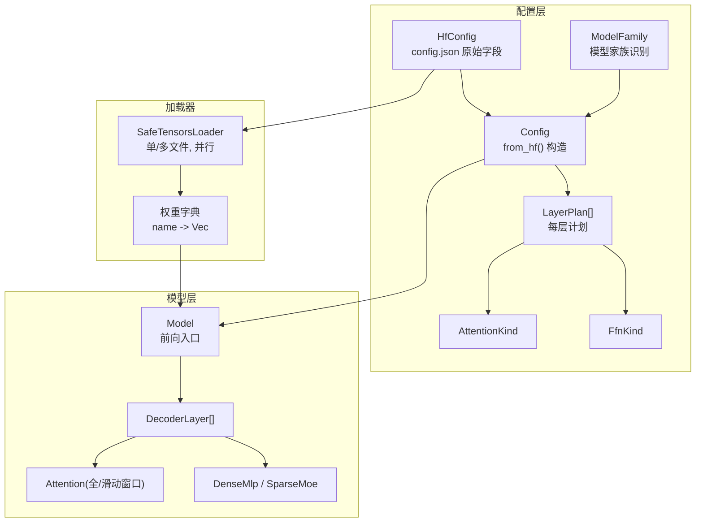
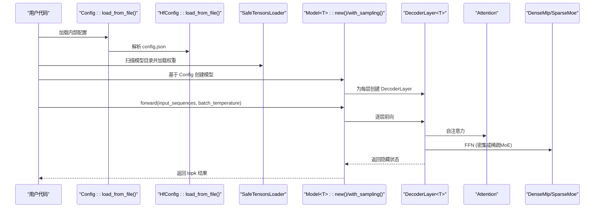
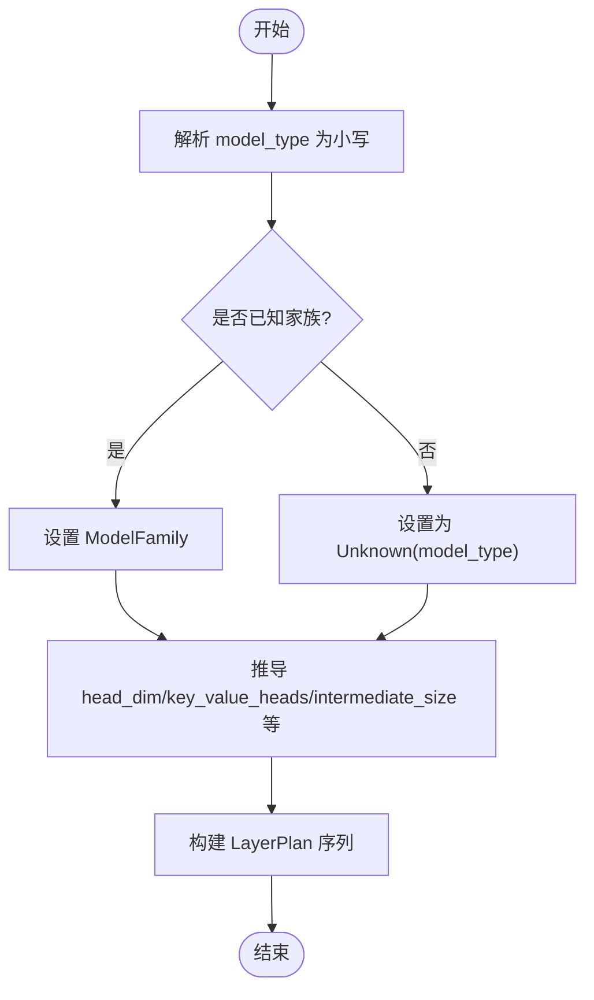
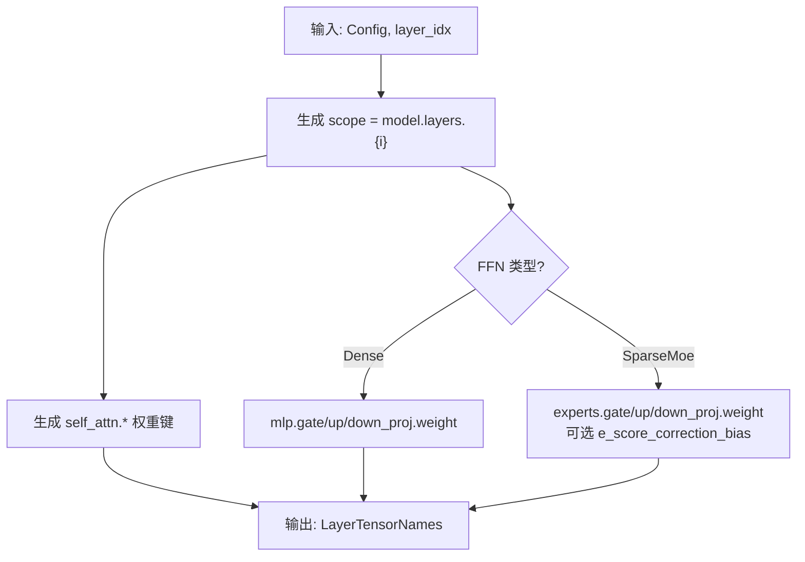
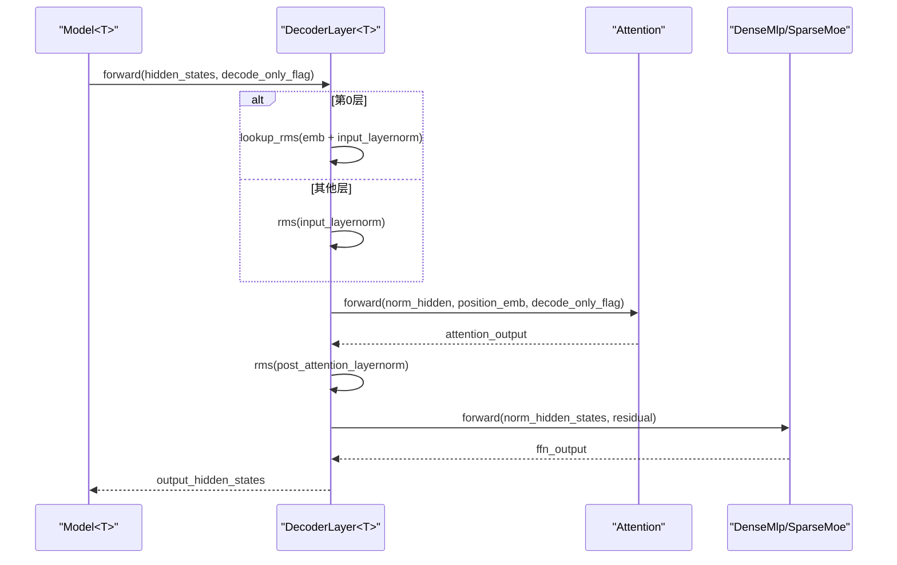
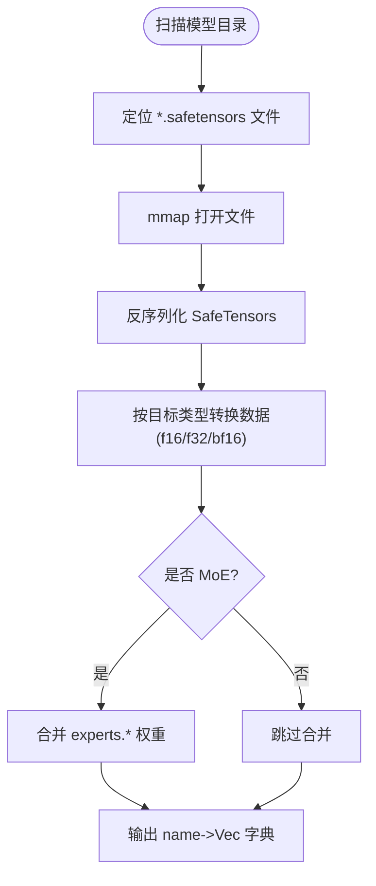
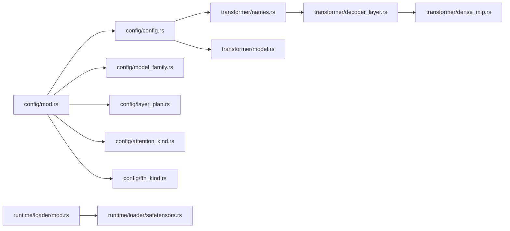

# 基础模型支持

<cite>
**本文引用的文件**   
- [src/transformer/config/mod.rs](file://src/transformer/config/mod.rs)
- [src/transformer/config/model_family.rs](file://src/transformer/config/model_family.rs)
- [src/transformer/config/config.rs](file://src/transformer/config/config.rs)
- [src/transformer/config/layer_plan.rs](file://src/transformer/config/layer_plan.rs)
- [src/transformer/config/attention_kind.rs](file://src/transformer/config/attention_kind.rs)
- [src/transformer/config/ffn_kind.rs](file://src/transformer/config/ffn_kind.rs)
- [src/transformer/names.rs](file://src/transformer/names.rs)
- [src/transformer/model.rs](file://src/transformer/model.rs)
- [src/transformer/decoder_layer.rs](file://src/transformer/decoder_layer.rs)
- [src/transformer/dense_mlp.rs](file://src/transformer/dense_mlp.rs)
- [src/runtime/loader/mod.rs](file://src/runtime/loader/mod.rs)
- [src/runtime/loader/safetensors.rs](file://src/runtime/loader/safetensors.rs)
- [src/config/huggingface_config.rs](file://src/config/huggingface_config.rs)
- [src/config/config_validator.rs](file://src/config/config_validator.rs)
- [docs/contributing/model/basic.md](file://docs/contributing/model/basic.md)
</cite>

## 目录
1. [简介](#简介)
2. [项目结构](#项目结构)
3. [核心组件](#核心组件)
4. [架构总览](#架构总览)
5. [详细组件分析](#详细组件分析)
6. [依赖关系分析](#依赖关系分析)
7. [性能与内存优化建议](#性能与内存优化建议)
8. [故障排查指南](#故障排查指南)
9. [结论](#结论)
10. [附录：新模型接入清单与模板](#附录新模型接入清单与模板)

## 简介
本文件面向希望为新语言模型添加“基础模型支持”的开发者，系统性说明如何完成以下工作：
- 定义并扩展模型配置结构（HuggingFace 到内部配置的映射）
- 支持权重格式与安全加载（safetensors、多文件分片、并行加载）
- 实现前向传播流程（Model → DecoderLayer → Attention/DenseMlp/SparseMoe）
- 建立模型家族分类与配置验证机制
- 提供完整的模型注册流程示例（含配置文件模板与参数定义）
- 解释权重加载器的扩展方法与数据格式转换
- 给出性能优化与内存使用最佳实践

## 项目结构
本项目采用分层组织方式：
- 配置层：解析 HuggingFace config.json，构建内部 Config、LayerPlan、FFN/Attention 类型等
- 模型层：Model 聚合各层，DecoderLayer 组合注意力与前馈网络
- 算子与张量：通过 Tensor 与 OperatorQueue 驱动计算图执行
- 运行时加载器：统一 safetensors 权重读取与合并（如 MoE 专家权重拼接）



图表来源
- [src/transformer/config/config.rs:40-116](file://src/transformer/config/config.rs#L40-L116)
- [src/transformer/config/layer_plan.rs:14-35](file://src/transformer/config/layer_plan.rs#L14-L35)
- [src/transformer/config/attention_kind.rs:10-35](file://src/transformer/config/attention_kind.rs#L10-L35)
- [src/transformer/config/ffn_kind.rs:30-58](file://src/transformer/config/ffn_kind.rs#L30-L58)
- [src/transformer/config/model_family.rs:13-25](file://src/transformer/config/model_family.rs#L13-L25)
- [src/transformer/model.rs:96-168](file://src/transformer/model.rs#L96-L168)
- [src/transformer/decoder_layer.rs:67-150](file://src/transformer/decoder_layer.rs#L67-L150)
- [src/runtime/loader/safetensors.rs:134-195](file://src/runtime/loader/safetensors.rs#L134-L195)

章节来源
- [src/transformer/config/mod.rs:1-15](file://src/transformer/config/mod.rs#L1-L15)
- [src/transformer/config/config.rs:40-116](file://src/transformer/config/config.rs#L40-L116)
- [src/transformer/config/layer_plan.rs:14-35](file://src/transformer/config/layer_plan.rs#L14-L35)
- [src/transformer/config/attention_kind.rs:10-35](file://src/transformer/config/attention_kind.rs#L10-L35)
- [src/transformer/config/ffn_kind.rs:30-58](file://src/transformer/config/ffn_kind.rs#L30-L58)
- [src/transformer/config/model_family.rs:13-25](file://src/transformer/config/model_family.rs#L13-L25)
- [src/transformer/model.rs:96-168](file://src/transformer/model.rs#L96-L168)
- [src/transformer/decoder_layer.rs:67-150](file://src/transformer/decoder_layer.rs#L67-L150)
- [src/runtime/loader/safetensors.rs:134-195](file://src/runtime/loader/safetensors.rs#L134-L195)

## 核心组件
- 模型家族与类型识别：根据 model_type 将模型归入 Qwen/Llama/Mixtral/MiniMax/MiniMaxM2 或 Unknown
- HuggingFace 配置映射：从 HfConfig 推导 head_dim、num_key_value_heads、intermediate_size、rope_theta 等，并生成 LayerPlan 序列
- 层计划与块选择：按 layer_types、use_sliding_window、max_window_layers 决定每层的 AttentionKind；按 mlp_only_layers、decoder_sparse_step、num_experts 等决定 FfnKind
- 名称映射：依据 ModelFamily 与层索引生成权重键名（如 embed_tokens、lm_head、q_proj/k_proj/v_proj/o_proj、mlp.gate/up/down 等）
- 模型实例化：Model 持有词表嵌入、位置编码、解码层、输出头与采样参数；DecoderLayer 组合 RMSNorm、Attention、FFN
- 权重加载：SafeTensorsLoader 支持单/多文件、并行加载，自动处理 f16/f32/bf16 转换，并提供 MoE 专家权重合并工具

章节来源
- [src/transformer/config/model_family.rs:13-25](file://src/transformer/config/model_family.rs#L13-L25)
- [src/transformer/config/config.rs:40-116](file://src/transformer/config/config.rs#L40-L116)
- [src/transformer/config/layer_plan.rs:14-35](file://src/transformer/config/layer_plan.rs#L14-L35)
- [src/transformer/config/attention_kind.rs:10-35](file://src/transformer/config/attention_kind.rs#L10-L35)
- [src/transformer/config/ffn_kind.rs:30-58](file://src/transformer/config/ffn_kind.rs#L30-L58)
- [src/transformer/names.rs:56-133](file://src/transformer/names.rs#L56-L133)
- [src/transformer/model.rs:96-168](file://src/transformer/model.rs#L96-L168)
- [src/transformer/decoder_layer.rs:67-150](file://src/transformer/decoder_layer.rs#L67-L150)
- [src/runtime/loader/safetensors.rs:134-195](file://src/runtime/loader/safetensors.rs#L134-L195)

## 架构总览
下图展示从配置到模型前向的关键调用链。



图表来源
- [src/transformer/config/config.rs:113-116](file://src/transformer/config/config.rs#L113-L116)
- [src/config/huggingface_config.rs:82-91](file://src/config/huggingface_config.rs#L82-L91)
- [src/runtime/loader/safetensors.rs:134-195](file://src/runtime/loader/safetensors.rs#L134-L195)
- [src/transformer/model.rs:96-168](file://src/transformer/model.rs#L96-L168)
- [src/transformer/decoder_layer.rs:152-230](file://src/transformer/decoder_layer.rs#L152-L230)
- [src/transformer/dense_mlp.rs:46-101](file://src/transformer/dense_mlp.rs#L46-L101)

## 详细组件分析

### 模型家族与配置验证
- 模型家族解析：根据 model_type 小写匹配，支持 qwen2/qwen2_moe/qwen3/qwen3_moe、llama、mixtral、minimax、minimax_m2/m2.5 等
- 配置校验：系统级配置（模型路径、调度器、服务端口等）在启动时进行一致性检查，避免运行期错误
- 关键默认值推导：head_dim、num_key_value_heads、intermediate_size、rope_theta、use_qk_norm、router_scoring、use_routing_bias 等由 HfConfig 推导



图表来源
- [src/transformer/config/model_family.rs:13-25](file://src/transformer/config/model_family.rs#L13-L25)
- [src/transformer/config/config.rs:40-116](file://src/transformer/config/config.rs#L40-L116)
- [src/config/config_validator.rs:74-190](file://src/config/config_validator.rs#L74-L190)

章节来源
- [src/transformer/config/model_family.rs:13-25](file://src/transformer/config/model_family.rs#L13-L25)
- [src/transformer/config/config.rs:40-116](file://src/transformer/config/config.rs#L40-L116)
- [src/config/config_validator.rs:74-190](file://src/config/config_validator.rs#L74-L190)

### 层计划与注意力/FFN 选择
- AttentionKind：支持 Full、SlidingWindow、Linear；优先按 layer_types 指定，其次按 use_sliding_window 与 max_window_layers 推断
- FfnKind：支持 Dense 与 SparseMoe；当 mlp_only_layers 包含当前层或 num_experts=0 时为 Dense；否则按 decoder_sparse_step 周期性插入 MoE

```mermaid
classDiagram
class LayerPlan {
+attention : AttentionKind
+ffn : FfnKind
}
class AttentionKind {
<<enum>>
Full
SlidingWindow
Linear
}
class FfnKind {
<<enum>>
Dense{intermediate_size}
SparseMoe{intermediate_size,num_experts,num_experts_per_tok,norm_topk_prob,router_scoring,use_routing_bias}
}
LayerPlan --> AttentionKind : "选择"
LayerPlan --> FfnKind : "选择"
```

图表来源
- [src/transformer/config/layer_plan.rs:7-35](file://src/transformer/config/layer_plan.rs#L7-L35)
- [src/transformer/config/attention_kind.rs:1-35](file://src/transformer/config/attention_kind.rs#L1-L35)
- [src/transformer/config/ffn_kind.rs:1-58](file://src/transformer/config/ffn_kind.rs#L1-L58)

章节来源
- [src/transformer/config/layer_plan.rs:14-35](file://src/transformer/config/layer_plan.rs#L14-L35)
- [src/transformer/config/attention_kind.rs:10-35](file://src/transformer/config/attention_kind.rs#L10-L35)
- [src/transformer/config/ffn_kind.rs:30-58](file://src/transformer/config/ffn_kind.rs#L30-L58)

### 权重命名与映射
- 模型级名称：token_embedding、position_embedding、lm_head、norm_weight，其中 lm_head 可能共享 token_embedding
- 层内名称：self_attn.q/k/v/o_proj.weight、q_norm/k_norm.weight、mlp.gate/up/down_proj.weight；MoE 下 experts.* 权重需合并
- 名称生成策略：依据 ModelFamily 与层索引动态拼接 scope



图表来源
- [src/transformer/names.rs:56-133](file://src/transformer/names.rs#L56-L133)

章节来源
- [src/transformer/names.rs:56-133](file://src/transformer/names.rs#L56-L133)

### 模型前向传播
- Model.forward：遍历 layers，依次调用 DecoderLayer.forward；最后对最后一层输出做 RMSNorm，再经 lm_head 与 TopK Softmax 得到候选 token
- DecoderLayer.forward：首层走 lookup_rms（embedding+RMS），其余层先 input_layernorm；随后注意力残差连接，post_attention_layernorm 后进入 FFN



图表来源
- [src/transformer/model.rs:174-251](file://src/transformer/model.rs#L174-L251)
- [src/transformer/decoder_layer.rs:152-230](file://src/transformer/decoder_layer.rs#L152-L230)
- [src/transformer/dense_mlp.rs:46-101](file://src/transformer/dense_mlp.rs#L46-L101)

章节来源
- [src/transformer/model.rs:174-251](file://src/transformer/model.rs#L174-L251)
- [src/transformer/decoder_layer.rs:152-230](file://src/transformer/decoder_layer.rs#L152-L230)
- [src/transformer/dense_mlp.rs:46-101](file://src/transformer/dense_mlp.rs#L46-L101)

### 权重加载器与数据格式转换
- SafeTensorsLoader：支持单文件与多分片，自动排序；提供 load_all_weights 与 load_all_weights_parallel（受 ELLM_LOAD_THREADS 控制）
- FromSafetensors：为 f16/f32/f64 实现 dtype 转换，支持 F16/F32/BF16 源格式
- MoE 合并：merge_moe 将 experts.{idx}.gate/up/down 按顺序拼接为 experts.gate/up/down，便于后续按连续布局访问



图表来源
- [src/runtime/loader/safetensors.rs:134-195](file://src/runtime/loader/safetensors.rs#L134-L195)
- [src/runtime/loader/safetensors.rs:197-240](file://src/runtime/loader/safetensors.rs#L197-L240)
- [src/runtime/loader/safetensors.rs:250-311](file://src/runtime/loader/safetensors.rs#L250-L311)

章节来源
- [src/runtime/loader/safetensors.rs:134-195](file://src/runtime/loader/safetensors.rs#L134-L195)
- [src/runtime/loader/safetensors.rs:197-240](file://src/runtime/loader/safetensors.rs#L197-L240)
- [src/runtime/loader/safetensors.rs:250-311](file://src/runtime/loader/safetensors.rs#L250-L311)

## 依赖关系分析
- 配置模块导出：mod.rs 集中暴露 Config、ModelFamily、LayerPlan、AttentionKind、FfnKind、RouterScoringKind
- 名称模块：names.rs 依赖 Config 与 ModelFamily，生成模型与层权重键名
- 模型模块：model.rs 依赖 names、Config、DecoderLayer、Tensor、MatMulParams 等
- 加载器模块：runtime/loader 提供 safetensors 通用加载能力，供上层组装权重



图表来源
- [src/transformer/config/mod.rs:1-15](file://src/transformer/config/mod.rs#L1-L15)
- [src/transformer/config/config.rs:1-136](file://src/transformer/config/config.rs#L1-L136)
- [src/transformer/names.rs:1-134](file://src/transformer/names.rs#L1-L134)
- [src/transformer/model.rs:1-168](file://src/transformer/model.rs#L1-L168)
- [src/transformer/decoder_layer.rs:1-150](file://src/transformer/decoder_layer.rs#L1-L150)
- [src/transformer/dense_mlp.rs:1-102](file://src/transformer/dense_mlp.rs#L1-L102)
- [src/runtime/loader/mod.rs:1-8](file://src/runtime/loader/mod.rs#L1-L8)
- [src/runtime/loader/safetensors.rs:1-195](file://src/runtime/loader/safetensors.rs#L1-L195)

章节来源
- [src/transformer/config/mod.rs:1-15](file://src/transformer/config/mod.rs#L1-L15)
- [src/transformer/config/config.rs:1-136](file://src/transformer/config/config.rs#L1-L136)
- [src/transformer/names.rs:1-134](file://src/transformer/names.rs#L1-L134)
- [src/transformer/model.rs:1-168](file://src/transformer/model.rs#L1-L168)
- [src/transformer/decoder_layer.rs:1-150](file://src/transformer/decoder_layer.rs#L1-L150)
- [src/transformer/dense_mlp.rs:1-102](file://src/transformer/dense_mlp.rs#L1-L102)
- [src/runtime/loader/mod.rs:1-8](file://src/runtime/loader/mod.rs#L1-L8)
- [src/runtime/loader/safetensors.rs:1-195](file://src/runtime/loader/safetensors.rs#L1-L195)

## 性能与内存优化建议
- 并行加载：通过环境变量 ELLM_LOAD_THREADS 控制 safetensors 并行加载线程数，结合 mmap 降低 IO 开销
- 数据类型选择：优先使用 f16 以节省显存/内存，必要时在加载阶段将 bf16/f32 转换为 f16
- 算子队列与批大小：合理设置 chunk_size、sequence_length、batch_size，使算子队列能充分并行化
- MoE 权重合并：提前 merge_moe 减少分散访问，提升缓存命中与访存连续性
- 注意力窗口：对长上下文启用 sliding window 可降低计算复杂度
- 线程数：根据 CPU 核数调整 thread_num，避免过度并行导致上下文切换开销

[本节为通用指导，不直接分析具体文件]

## 故障排查指南
- 配置缺失或不合法：检查 model.model、scheduler.max_num_seqs、serve.host/port 等必填项；参考配置校验错误类型
- 权重文件未找到：确认模型目录下存在 *.safetensors 或 model.safetensors/pytorch_model.safetensors
- dtype 不支持：若 safetensors 中 tensor dtype 不在 F16/F32/BF16 范围，会抛出异常
- MoE 权重键名不一致：确保 experts.{idx}.gate/up/down 键名符合预期，以便 merge_moe 正确合并
- 前向形状不匹配：核对 vocab_size、hidden_size、num_hidden_layers、head_dim 等是否与权重一致

章节来源
- [src/config/config_validator.rs:8-60](file://src/config/config_validator.rs#L8-L60)
- [src/config/config_validator.rs:74-190](file://src/config/config_validator.rs#L74-L190)
- [src/runtime/loader/safetensors.rs:134-195](file://src/runtime/loader/safetensors.rs#L134-L195)
- [src/runtime/loader/safetensors.rs:250-311](file://src/runtime/loader/safetensors.rs#L250-L311)

## 结论
通过统一的配置解析、层计划生成、名称映射与安全的权重加载机制，本项目为新增模型提供了清晰的扩展点。开发者只需补充模型家族识别、必要的配置字段与权重键名映射，即可快速接入新模型，并在现有前向与推理框架中获得一致的体验。

[本节为总结性内容，不直接分析具体文件]

## 附录：新模型接入清单与模板

### 步骤概览
- 识别模型家族与架构：在 ModelFamily 中添加新类型或复用现有分支
- 配置映射：在 HfConfig 中声明必要字段，并在 Config::from_hf 中推导默认值
- 层计划：按需扩展 AttentionKind/FfnKind 的选择逻辑
- 权重命名：在 names.rs 中为新架构补充键名映射
- 加载器：如需特殊权重布局，可在 SafeTensorsLoader 中增加预处理（如 merge_moe）
- 测试与文档：编写最小 smoke test，更新贡献文档

章节来源
- [docs/contributing/model/basic.md:1-18](file://docs/contributing/model/basic.md#L1-L18)

### 配置文件模板（HuggingFace config.json 关键字段）
以下为常见字段及其作用（仅列出与本系统相关的关键项）：
- model_type：用于模型家族识别
- hidden_size、num_attention_heads、num_key_value_heads、head_dim：注意力与维度
- num_hidden_layers、vocab_size、tie_word_embeddings：模型规模与词表
- rms_norm_eps、rope_theta、rotary_dim、rope_scaling：归一化与旋转位置编码
- intermediate_size、moe_intermediate_size、num_experts、num_experts_per_tok、norm_topk_prob、scoring_func、use_routing_bias：FFN 与 MoE 配置
- use_sliding_window、sliding_window、max_window_layers、layer_types：注意力窗口策略
- eos_token_id、mlp_only_layers、decoder_sparse_step、use_qk_norm、qkv_bias：生成与细节开关

章节来源
- [src/config/huggingface_config.rs:10-76](file://src/config/huggingface_config.rs#L10-L76)
- [src/transformer/config/config.rs:40-116](file://src/transformer/config/config.rs#L40-L116)

### 模型注册流程示例（文字版）
- 在 ModelFamily 中新增或映射 model_type
- 在 HfConfig 中声明所需字段（若已有则无需改动）
- 在 Config::from_hf 中补充默认值推导与边界处理
- 在 names.rs 中为该家族补充权重键名映射
- 在 safetensors.rs 中如有需要，增加权重预处理（如特定 MoE 布局合并）
- 编写最小用例：加载 config.json → 创建 SafeTensorsLoader → 加载权重 → 初始化 Model → 执行一次 forward

章节来源
- [src/transformer/config/model_family.rs:13-25](file://src/transformer/config/model_family.rs#L13-L25)
- [src/transformer/config/config.rs:40-116](file://src/transformer/config/config.rs#L40-L116)
- [src/transformer/names.rs:56-133](file://src/transformer/names.rs#L56-L133)
- [src/runtime/loader/safetensors.rs:134-195](file://src/runtime/loader/safetensors.rs#L134-L195)