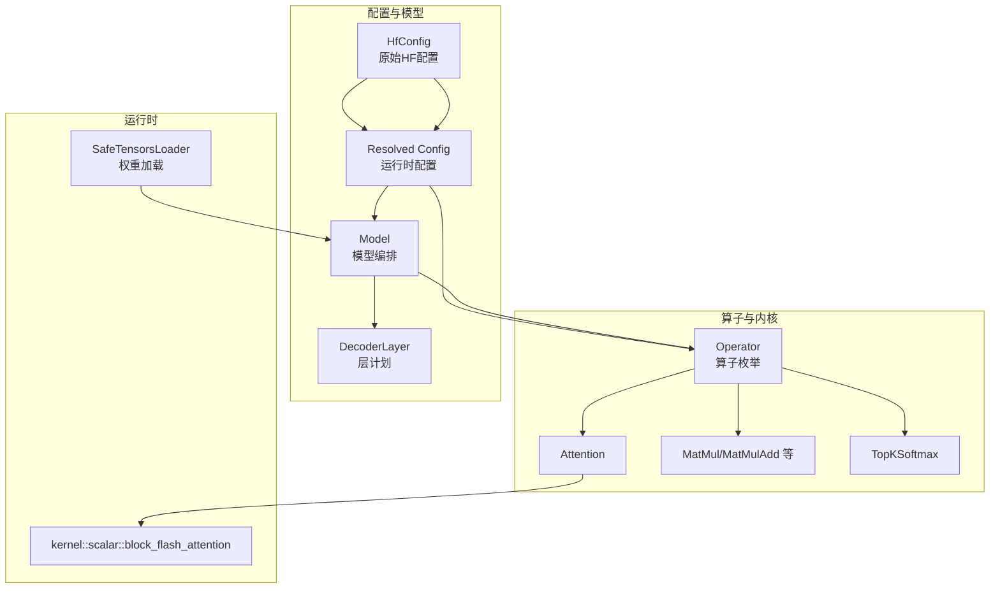
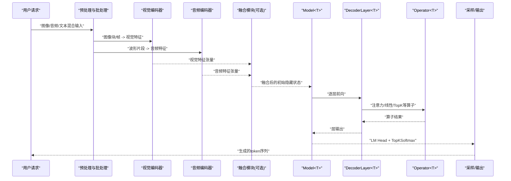
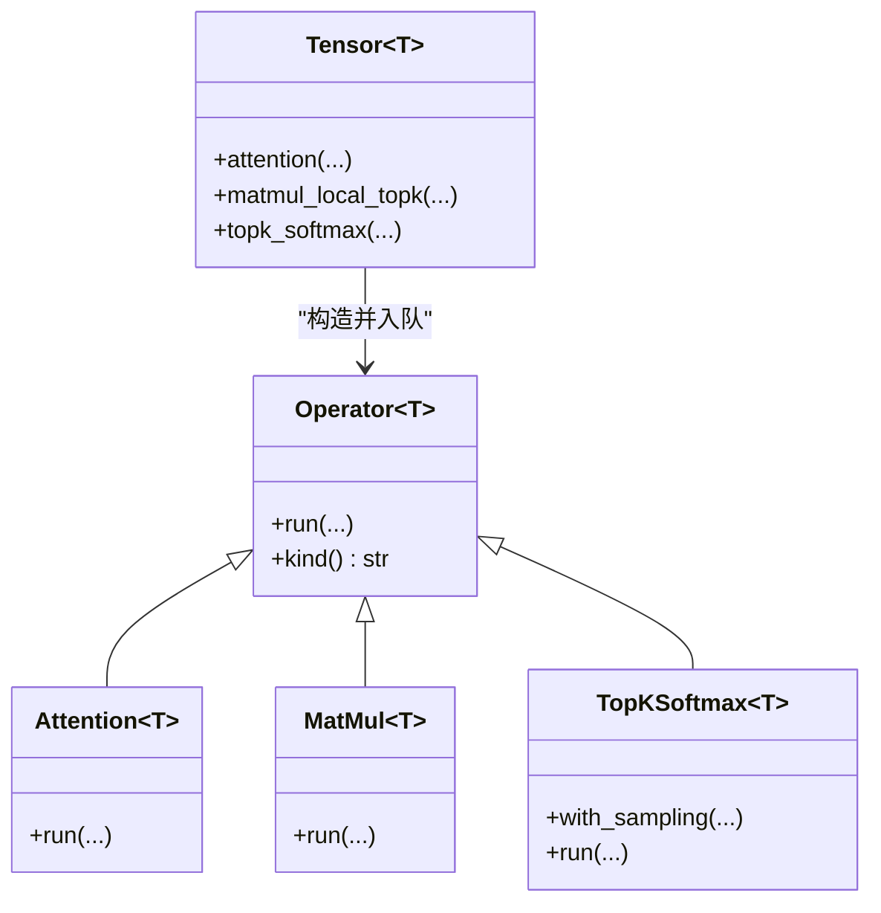
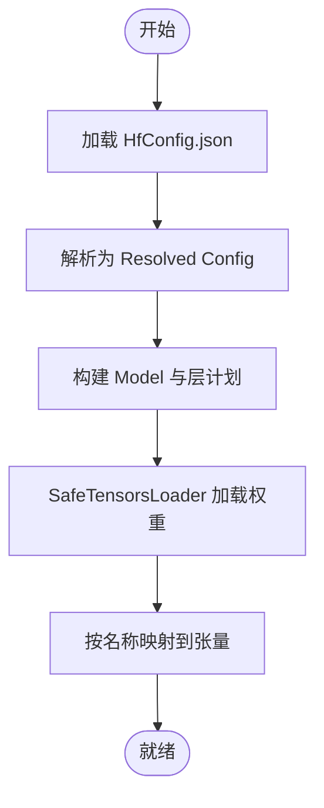
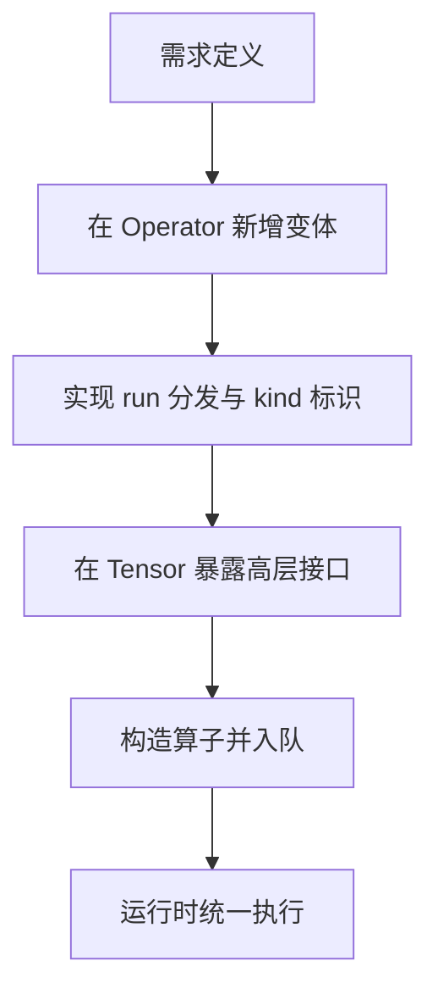
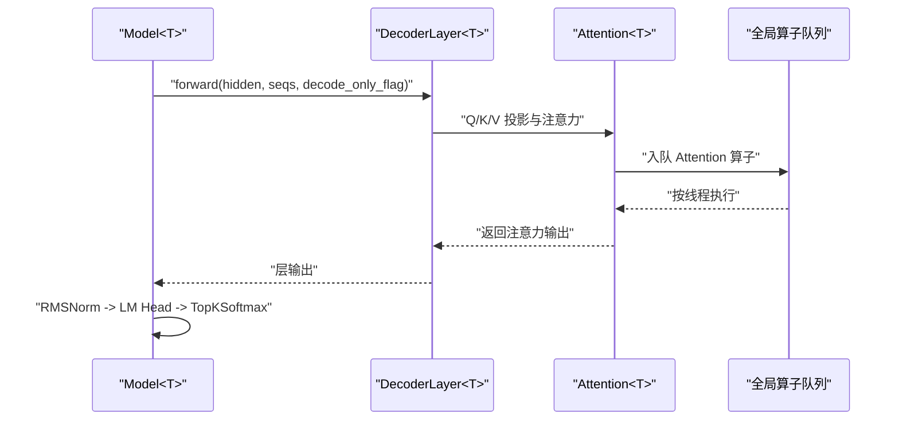
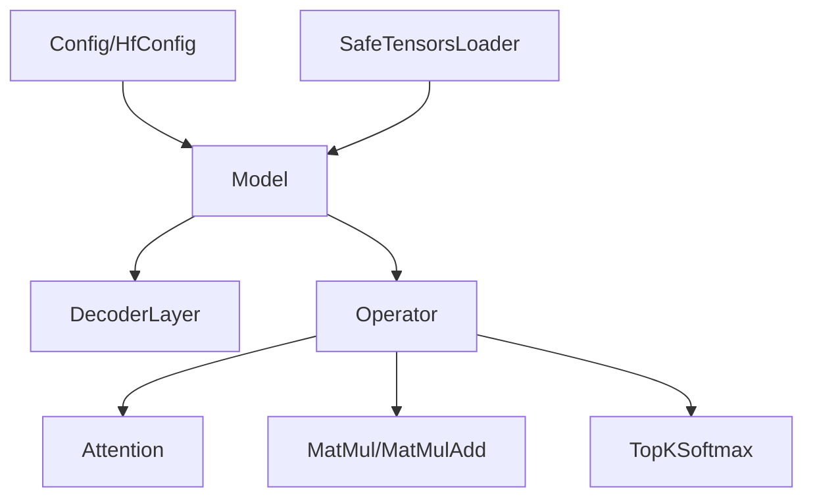

# 多模态模型支持

<cite>
**本文引用的文件**   
- [README.md](file://README.md)
- [multimodal.md](file://docs/contributing/model/multimodal.md)
- [huggingface_config.rs](file://src/config/huggingface_config.rs)
- [config.rs](file://src/transformer/config/config.rs)
- [model_family.rs](file://src/transformer/config/model_family.rs)
- [model.rs](file://src/transformer/model.rs)
- [attention.rs](file://src/transformer/attention.rs)
- [matmul.rs](file://src/tensor/matmul.rs)
- [operator.rs](file://src/operators/operator.rs)
- [attention.md](file://docs/design/operators/attention.md)
- [safetensors.rs](file://src/runtime/loader/safetensors.rs)
</cite>

## 目录
1. [简介](#简介)
2. [项目结构](#项目结构)
3. [核心组件](#核心组件)
4. [架构总览](#架构总览)
5. [详细组件分析](#详细组件分析)
6. [依赖关系分析](#依赖关系分析)
7. [性能考虑](#性能考虑)
8. [故障排查指南](#故障排查指南)
9. [结论](#结论)
10. [附录](#附录)

## 简介
本文件面向在 eLLM 中接入“视觉、音频等多模态输入”的开发者，提供从数据预处理、编码器集成、与文本主干融合、配置与权重管理、特殊算子开发到推理优化与测试的完整实践指南。eLLM 当前以纯 CPU 推理为核心，强调静态计算图、KV 缓存连续布局与头级并行等特性；在多模态扩展时，应遵循“将多模态逻辑与基础文本路径解耦”的原则，逐步引入编码器与融合模块，并通过现有算子与调度机制完成端到端推理。

## 项目结构
仓库采用分层组织：配置解析、Transformer 层与模型编排、算子与内核、运行时加载与执行、文档与设计说明。多模态相关的工作主要落在以下区域：
- 贡献指南中的多模态页面：明确新增工作项（编码器、预处理、批处理、特殊 token、测试）
- 配置层：HfConfig -> Resolved Config 的两层映射，便于为多模态模型增加字段并稳定化运行期参数
- 模型与层编排：Model/DecoderLayer 负责构建层计划与执行顺序
- 算子与内核：Operator 枚举与具体实现，用于承载多模态所需的融合或投影类算子
- 权重加载：SafeTensorsLoader 统一读取 safetensors 权重，可复用至多模态分支
- 设计文档：Attention 静态并行策略等可作为多模态融合时的参考

图表来源
- [huggingface_config.rs:1-92](file://src/config/huggingface_config.rs#L1-L92)
- [config.rs:1-136](file://src/transformer/config/config.rs#L1-L136)
- [model.rs:1-168](file://src/transformer/model.rs#L1-L168)
- [operator.rs:29-226](file://src/operators/operator.rs#L29-L226)
- [attention.md:1-390](file://docs/design/operators/attention.md#L1-L390)
- [safetensors.rs:130-190](file://src/runtime/loader/safetensors.rs#L130-L190)

章节来源
- [multimodal.md:1-16](file://docs/contributing/model/multimodal.md#L1-L16)
- [huggingface_config.rs:1-92](file://src/config/huggingface_config.rs#L1-L92)
- [config.rs:1-136](file://src/transformer/config/config.rs#L1-L136)
- [model.rs:1-168](file://src/transformer/model.rs#L1-L168)
- [operator.rs:29-226](file://src/operators/operator.rs#L29-L226)
- [attention.md:1-390](file://docs/design/operators/attention.md#L1-L390)
- [safetensors.rs:130-190](file://src/runtime/loader/safetensors.rs#L130-L190)

## 核心组件
- 配置层
  - HfConfig：忠实映射 HF JSON，保留 Option 字段，便于后续为多模态新增字段（如 vision/audio encoder 参数）。
  - Resolved Config：对 HfConfig 进行归一化与补全，输出稳定的运行时配置，包含层计划、RoPE、滑动窗口等。
- 模型与层
  - Model<T>：根据配置创建词表嵌入、位置编码、各层 DecoderLayer，并提供 forward 流程（RMSNorm -> LM Head -> TopK Softmax）。
  - DecoderLayer：按 LayerPlan 组装注意力、FFN/MoE、归一化等子模块。
- 算子系统
  - Operator<T>：集中声明所有算子变体（Attention、MatMul、TopKSoftmax 等），run 分发到具体实现。
  - Tensor 扩展：在 Tensor 上暴露 attention、matmul_local_topk、topk_softmax 等高层接口，内部构造 Operator 并入队执行。
- 权重加载
  - SafeTensorsLoader：扫描并加载 safetensors 权重，按名称映射到内存，供模型初始化使用。

章节来源
- [huggingface_config.rs:1-92](file://src/config/huggingface_config.rs#L1-L92)
- [config.rs:1-136](file://src/transformer/config/config.rs#L1-L136)
- [model.rs:1-168](file://src/transformer/model.rs#L1-L168)
- [operator.rs:29-226](file://src/operators/operator.rs#L29-L226)
- [matmul.rs:1-260](file://src/tensor/matmul.rs#L1-L260)
- [safetensors.rs:130-190](file://src/runtime/loader/safetensors.rs#L130-L190)

## 架构总览
下图展示多模态推理的整体数据流：多模态输入经各自编码器得到特征向量，再与文本 token 表示拼接或交叉注意力融合，进入文本主干（DecoderLayer 序列），最后通过 LM Head 与采样生成文本。

[此图为概念性流程图，不直接映射具体源码文件]

## 详细组件分析

### 多模态输入与编码器集成
- 目标
  - 在不侵入基础文本路径的前提下，接入视觉/音频编码器，产出与文本 hidden_size 对齐的特征向量。
- 建议做法
  - 在预处理阶段完成解码与分片，形成固定步长的批次。
  - 编码器输出形状建议为 [tokens, hidden_size]，以便与文本 token 表示拼接。
  - 若模型需要跨模态注意力，可在融合层后插入自定义算子（见“特殊算子”小节）。
- 与现有路径的关系
  - 文本侧仍由 Model<T> 驱动；多模态仅在“初始隐藏状态”或“中间层注入点”介入。

章节来源
- [multimodal.md:1-16](file://docs/contributing/model/multimodal.md#L1-L16)
- [model.rs:174-251](file://src/transformer/model.rs#L174-L251)

### 融合机制与算子扩展
- 融合方式
  - 简单拼接：将视觉/音频特征拼接到文本 token 序列首段，作为初始隐藏状态的一部分。
  - 交叉注意力：在特定层引入 cross-attention，使文本查询与多模态键值交互。
- 算子落地
  - 若需新算子，参照 Operator<T> 的注册模式，新增变体并在 run 中分发。
  - 对于矩阵乘/归一化等通用操作，可直接复用现有 MatMul/RMSMap 等算子。
- 示例路径
  - 在 Tensor 上暴露高层接口，内部构造 Operator 并入队执行，保持与 Attention/MatMul 一致的调度风格。

图表来源
- [operator.rs:29-226](file://src/operators/operator.rs#L29-L226)
- [matmul.rs:1-260](file://src/tensor/matmul.rs#L1-L260)

章节来源
- [operator.rs:29-226](file://src/operators/operator.rs#L29-L226)
- [matmul.rs:1-260](file://src/tensor/matmul.rs#L1-L260)

### 配置定义与权重管理
- 配置定义
  - HfConfig：建议在多模态模型下新增字段（如 encoder_type、vision/audio 超参），保持 Option 兼容。
  - Resolved Config：在 from_hf 中补齐默认值，并将多模态相关开关纳入稳定配置。
- 权重管理
  - 使用 SafeTensorsLoader 统一加载 safetensors 权重，按名称映射到对应张量。
  - 多模态权重可按命名空间区分（如 vision_encoder.*、audio_encoder.*），在加载后写入相应 Tensor。

图表来源
- [huggingface_config.rs:1-92](file://src/config/huggingface_config.rs#L1-L92)
- [config.rs:1-136](file://src/transformer/config/config.rs#L1-L136)
- [safetensors.rs:130-190](file://src/runtime/loader/safetensors.rs#L130-L190)

章节来源
- [huggingface_config.rs:1-92](file://src/config/huggingface_config.rs#L1-L92)
- [config.rs:1-136](file://src/transformer/config/config.rs#L1-L136)
- [safetensors.rs:130-190](file://src/runtime/loader/safetensors.rs#L130-L190)

### 特殊算子的开发与集成
- 开发要求
  - 在 Operator<T> 中新增变体，实现 run 分发逻辑与 kind 标识。
  - 若涉及复杂调度，参考 Attention 的静态并行策略，尽量保持无动态抢占与最小同步。
- 集成方法
  - 在 Tensor 上暴露高层 API，内部构造算子并加入全局队列，由运行时统一执行。
  - 针对短切片场景，优先采用“波次推进+连续分配”的思路，提高线程占用与缓存命中。

[此图为概念性流程图，不直接映射具体源码文件]

章节来源
- [operator.rs:29-226](file://src/operators/operator.rs#L29-L226)
- [attention.md:1-390](file://docs/design/operators/attention.md#L1-L390)

### 多模态推理流程与关键路径
- 整体流程
  - 预处理与批处理 -> 编码器 -> 融合 -> 文本主干 -> LM Head -> 采样
- 关键路径
  - Model.forward：循环调用 DecoderLayer，最终 RMSNorm -> LM Head -> TopKSoftmax。
  - Attention 静态并行：长切片按序列维度三角负载切分，短切片按 kv_head 波次推进。

图表来源
- [model.rs:174-251](file://src/transformer/model.rs#L174-L251)
- [attention.rs:284-319](file://src/transformer/attention.rs#L284-L319)
- [attention.md:1-390](file://docs/design/operators/attention.md#L1-L390)

章节来源
- [model.rs:174-251](file://src/transformer/model.rs#L174-L251)
- [attention.rs:284-319](file://src/transformer/attention.rs#L284-L319)
- [attention.md:1-390](file://docs/design/operators/attention.md#L1-L390)

### 多模态模型的配置定义与权重管理方案
- 配置定义
  - 在 HfConfig 中新增多模态字段（如 encoder_type、patch_size、sample_rate 等），保持向后兼容。
  - 在 Resolved Config 中补齐默认值，并决定是否启用多模态融合路径。
- 权重管理
  - 使用 SafeTensorsLoader 加载多模态权重，按命名空间映射到对应张量。
  - 建议为多模态权重建立独立的命名约定，避免与文本权重冲突。

章节来源
- [huggingface_config.rs:1-92](file://src/config/huggingface_config.rs#L1-L92)
- [config.rs:1-136](file://src/transformer/config/config.rs#L1-L136)
- [safetensors.rs:130-190](file://src/runtime/loader/safetensors.rs#L130-L190)

### 多模态推理的性能优化策略与内存管理技巧
- 性能优化
  - 利用 Attention 的静态并行策略：长切片按序列维度三角负载切分，短切片按 kv_head 波次推进，提升线程占用与缓存命中率。
  - 控制批次大小与切片长度，避免过小的 batch 导致瘦矩阵乘法效率下降。
- 内存管理
  - 使用全局内存池与对齐分配，减少频繁分配与碎片化。
  - 预分配 KV 缓存与中间张量，降低运行时开销。
- 参考
  - README 中对 CPU 推理优势与瓶颈的分析，有助于定位多模态路径的优化点。

章节来源
- [attention.md:1-390](file://docs/design/operators/attention.md#L1-L390)
- [README.md:157-182](file://README.md#L157-L182)

### 完整的多模态模型实现示例与测试用例
- 实现步骤
  - 在预处理阶段完成图像/音频编码，得到与 hidden_size 对齐的特征。
  - 在 Model 初始化时，将多模态特征拼接到初始隐藏状态或注入到指定层。
  - 复用现有算子与调度机制，确保与文本路径一致的执行语义。
- 测试用例
  - 文本-only 路径回归测试：验证未启用多模态时行为不变。
  - 多模态路径冒烟测试：小批量、短上下文，验证编码器输出与融合正确性。
  - 对齐测试：与参考实现对比数值一致性（可参考对齐工具链）。

章节来源
- [model.rs:308-450](file://src/transformer/model.rs#L308-L450)
- [multimodal.md:1-16](file://docs/contributing/model/multimodal.md#L1-L16)

## 依赖关系分析
- 组件耦合
  - Model<T> 依赖 Config 与 LayerPlan，间接依赖 Operator<T>。
  - Tensor 扩展通过 Operator 与 kernel 内核交互，形成“高层接口 -> 算子 -> 内核”的分层。
- 外部依赖
  - SafeTensorsLoader 依赖 safetensors 格式，用于权重加载。
- 潜在循环
  - 当前未见明显循环依赖；注意新增算子时避免反向引用 Model/Tensor。

图表来源
- [config.rs:1-136](file://src/transformer/config/config.rs#L1-L136)
- [model.rs:1-168](file://src/transformer/model.rs#L1-L168)
- [operator.rs:29-226](file://src/operators/operator.rs#L29-L226)
- [safetensors.rs:130-190](file://src/runtime/loader/safetensors.rs#L130-L190)

章节来源
- [config.rs:1-136](file://src/transformer/config/config.rs#L1-L136)
- [model.rs:1-168](file://src/transformer/model.rs#L1-L168)
- [operator.rs:29-226](file://src/operators/operator.rs#L29-L226)
- [safetensors.rs:130-190](file://src/runtime/loader/safetensors.rs#L130-L190)

## 性能考虑
- 长上下文 Prefill：利用 CPU 大内存与连续 KV 布局，减少重复加载与调度开销。
- 短上下文 Decode：关注小 batch 下的瘦矩阵乘法效率与 MoE 负载均衡。
- 注意力静态并行：长切片按序列维度三角负载切分，短切片按 kv_head 波次推进，提升线程占用与缓存命中率。
- 内存访问模式：避免分页 KV 导致的非连续访问，保持线性访问以提升硬件预取与缓存效率。

章节来源
- [README.md:157-182](file://README.md#L157-L182)
- [attention.md:1-390](file://docs/design/operators/attention.md#L1-L390)

## 故障排查指南
- 常见问题
  - 多模态权重未正确映射：检查 safetensors 名称与张量命名约定是否一致。
  - 融合后形状不匹配：确认编码器输出与 hidden_size 对齐，必要时添加投影层。
  - 性能退化：检查批次大小与切片长度，避免过小 batch 导致效率下降。
- 调试建议
  - 启用对齐跟踪变量，观察算子构建与执行路径。
  - 使用小批量、短上下文进行回归测试，逐步扩大规模。

章节来源
- [model.rs:187-251](file://src/transformer/model.rs#L187-L251)
- [attention.rs:284-319](file://src/transformer/attention.rs#L284-L319)

## 结论
在多模态扩展中，建议遵循“多模态逻辑与文本主干解耦”的原则，先在预处理与融合层引入编码器与融合模块，再通过现有算子与调度机制完成端到端推理。配置层采用 HfConfig -> Resolved Config 的两层映射，便于新增多模态字段并保持运行期稳定。结合 Attention 的静态并行策略与内存管理技巧，可在 CPU 服务器上实现高效的多模态推理。

## 附录
- 模型家族识别：ModelFamily 用于上游识别与分发，多模态模型可通过 model_type 映射到对应家族。
- 注意力设计文档：提供了静态并行与 GQA 语义的详细解释，可作为多模态融合时的参考。

章节来源
- [model_family.rs:1-26](file://src/transformer/config/model_family.rs#L1-L26)
- [attention.md:1-390](file://docs/design/operators/attention.md#L1-L390)