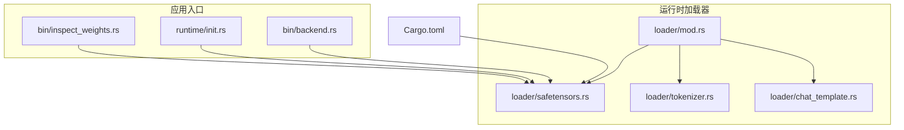
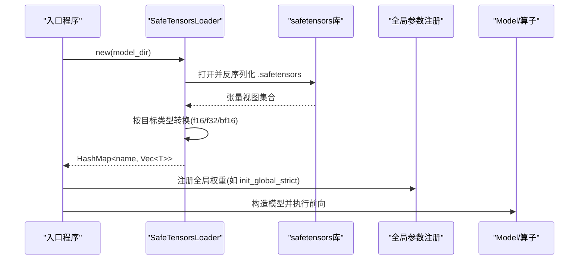
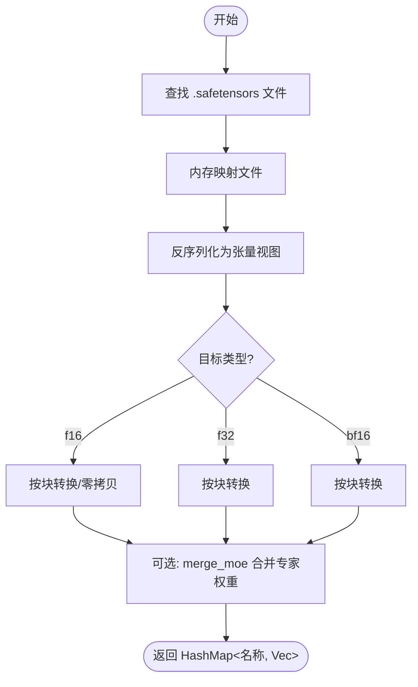
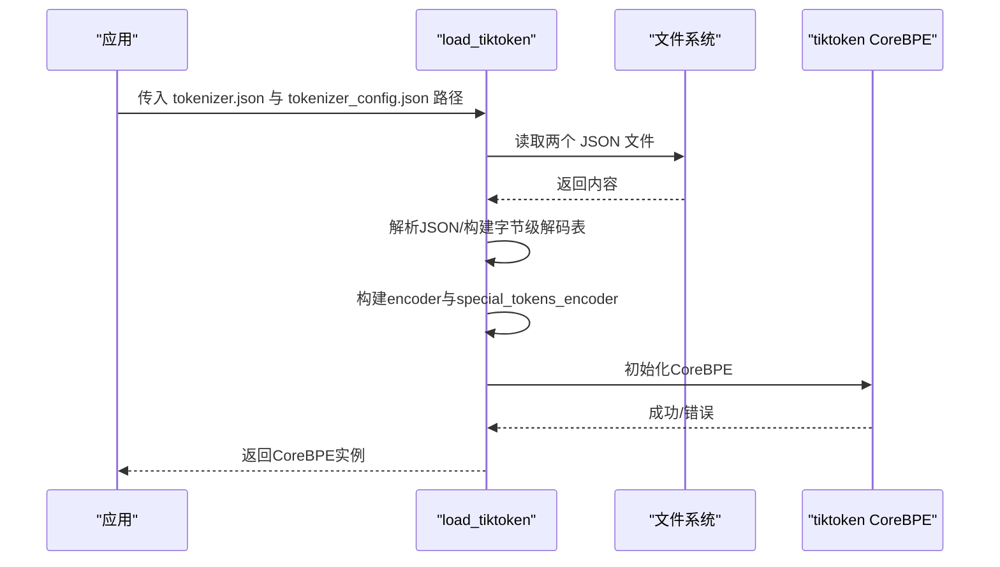
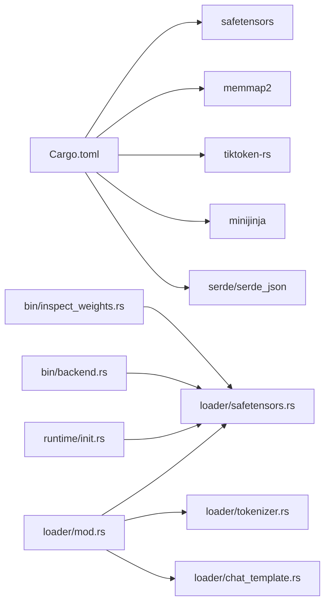

# 权重加载与格式转换

<cite>
**本文引用的文件**   
- [src/runtime/loader/safetensors.rs](file://src/runtime/loader/safetensors.rs)
- [src/runtime/loader/tokenizer.rs](file://src/runtime/loader/tokenizer.rs)
- [src/runtime/loader/chat_template.rs](file://src/runtime/loader/chat_template.rs)
- [src/runtime/loader/mod.rs](file://src/runtime/loader/mod.rs)
- [src/bin/inspect_weights.rs](file://src/bin/inspect_weights.rs)
- [src/runtime/init.rs](file://src/runtime/init.rs)
- [src/bin/backend.rs](file://src/bin/backend.rs)
- [Cargo.toml](file://Cargo.toml)
</cite>

## 目录
1. [简介](#简介)
2. [项目结构](#项目结构)
3. [核心组件](#核心组件)
4. [架构总览](#架构总览)
5. [详细组件分析](#详细组件分析)
6. [依赖分析](#依赖分析)
7. [性能考虑](#性能考虑)
8. [故障排查指南](#故障排查指南)
9. [结论](#结论)
10. [附录](#附录)

## 简介
本技术文档聚焦于权重加载与格式转换，覆盖以下主题：
- SafeTensors 格式的解析与加载流程
- 不同模型权重的格式转换与数据对齐方法
- 自定义权重加载器的开发指南与接口规范
- 分词器权重的加载与管理机制
- 权重文件的压缩与增量加载支持说明
- 权重验证、完整性检查与错误处理策略
- 权重格式转换的工具函数与优化建议

## 项目结构
与权重加载和格式转换相关的代码主要位于 runtime/loader 模块，以及若干二进制入口用于演示与工具化使用。

图表来源
- [src/runtime/loader/mod.rs:1-8](file://src/runtime/loader/mod.rs#L1-L8)
- [src/runtime/loader/safetensors.rs:1-352](file://src/runtime/loader/safetensors.rs#L1-L352)
- [src/runtime/loader/tokenizer.rs:1-284](file://src/runtime/loader/tokenizer.rs#L1-L284)
- [src/runtime/loader/chat_template.rs:1-224](file://src/runtime/loader/chat_template.rs#L1-L224)
- [src/bin/inspect_weights.rs:1-123](file://src/bin/inspect_weights.rs#L1-L123)
- [src/runtime/init.rs:1-136](file://src/runtime/init.rs#L1-L136)
- [src/bin/backend.rs:1-200](file://src/bin/backend.rs#L1-L200)
- [Cargo.toml:1-102](file://Cargo.toml#L1-L102)

章节来源
- [src/runtime/loader/mod.rs:1-8](file://src/runtime/loader/mod.rs#L1-L8)
- [src/runtime/loader/safetensors.rs:1-352](file://src/runtime/loader/safetensors.rs#L1-L352)
- [src/runtime/loader/tokenizer.rs:1-284](file://src/runtime/loader/tokenizer.rs#L1-L284)
- [src/runtime/loader/chat_template.rs:1-224](file://src/runtime/loader/chat_template.rs#L1-L224)
- [src/bin/inspect_weights.rs:1-123](file://src/bin/inspect_weights.rs#L1-L123)
- [src/runtime/init.rs:1-136](file://src/runtime/init.rs#L1-L136)
- [src/bin/backend.rs:1-200](file://src/bin/backend.rs#L1-L200)
- [Cargo.toml:1-102](file://Cargo.toml#L1-L102)

## 核心组件
- SafeTensorsLoader：负责发现并加载 .safetensors 权重文件，提供串行与并行加载接口，内置 f16/f32/bf16 到目标类型的转换，并提供 MoE 专家权重合并能力。
- FromSafetensors：类型转换trait，定义从 safetensors::TensorView 到具体数值类型的统一接口。
- Tiktoken 分词器加载器：读取 tokenizer.json 与 tokenizer_config.json，构建字节级编码器与特殊 token 映射。
- ChatTemplate：基于 Jinja 模板渲染对话提示，支持从独立文件或 tokenizer_config 中获取模板。
- inspect_weights：命令行工具，用于加载权重、统计张量数量、校验非有限值、生成指纹等。

章节来源
- [src/runtime/loader/safetensors.rs:1-352](file://src/runtime/loader/safetensors.rs#L1-L352)
- [src/runtime/loader/tokenizer.rs:1-284](file://src/runtime/loader/tokenizer.rs#L1-L284)
- [src/runtime/loader/chat_template.rs:1-224](file://src/runtime/loader/chat_template.rs#L1-L224)
- [src/bin/inspect_weights.rs:1-123](file://src/bin/inspect_weights.rs#L1-L123)

## 架构总览
下图展示了权重加载在系统启动与推理中的关键路径：入口程序通过 SafeTensorsLoader 加载权重，随后初始化全局内存与算子队列，进入调度与执行阶段。

图表来源
- [src/bin/backend.rs:86-91](file://src/bin/backend.rs#L86-L91)
- [src/runtime/init.rs:55-61](file://src/runtime/init.rs#L55-L61)
- [src/runtime/loader/safetensors.rs:134-240](file://src/runtime/loader/safetensors.rs#L134-L240)

## 详细组件分析

### SafeTensors 解析与加载流程
- 文件发现：优先匹配单文件命名（model.safetensors、pytorch_model.safetensors），否则扫描目录下所有 .safetensors 并按文件名排序。
- 内存映射：使用 memmap2 对文件进行内存映射，避免整文件拷贝。
- 反序列化：调用 safetensors 库将元数据与张量数据反序列化为 TensorView。
- 类型转换：实现 FromSafetensors trait，针对 f16/f32/bf16 进行逐块转换；小端平台对 f16 采用零拷贝直拷以提升性能。
- 并发加载：load_all_weights_parallel 根据环境变量或 CPU 并行度切分文件块，线程内 scope 并发加载后合并结果。
- MoE 合并：merge_moe 将分散的 experts.{idx}.xxx 键按层与后缀拼接为连续 experts.xxx 布局，便于后续算子访问。

图表来源
- [src/runtime/loader/safetensors.rs:134-171](file://src/runtime/loader/safetensors.rs#L134-L171)
- [src/runtime/loader/safetensors.rs:173-195](file://src/runtime/loader/safetensors.rs#L173-L195)
- [src/runtime/loader/safetensors.rs:197-240](file://src/runtime/loader/safetensors.rs#L197-L240)
- [src/runtime/loader/safetensors.rs:250-311](file://src/runtime/loader/safetensors.rs#L250-L311)

章节来源
- [src/runtime/loader/safetensors.rs:1-352](file://src/runtime/loader/safetensors.rs#L1-L352)

### 类型转换与数据对齐
- 支持的源数据类型：F16、F32、BF16。
- 目标类型：f16、f32、f64。
- 转换细节：
  - F16 到 f16：在小端平台上直接复制字节，避免额外转换开销；在大端平台逐块转换。
  - BF16 到 f16/f32：将 u16 位模式左移 16 位解释为 f32，再转为 f16 或直接作为 f32。
  - F32 到 f16/f32/f64：按 4 字节块解析为浮点数并进行精度提升或截断。
- 数据对齐：
  - 输入数据以连续字节数组形式存在，按元素大小分块解析。
  - 输出使用 Vec 预分配容量，减少扩容开销。
  - 对于 f16 零拷贝路径，要求目标平台为小端且长度可被 f16 大小整除。

章节来源
- [src/runtime/loader/safetensors.rs:13-128](file://src/runtime/loader/safetensors.rs#L13-L128)
- [src/runtime/loader/safetensors.rs:42-70](file://src/runtime/loader/safetensors.rs#L42-L70)

### 自定义权重加载器开发指南与接口规范
- 扩展点：实现 FromSafetensors trait，定义 from_tensor_view 方法，将 TensorView 转换为 Vec<Self>。
- 推荐实践：
  - 明确支持的数据类型分支，未支持类型应返回错误。
  - 对小端平台尽量使用零拷贝路径，避免不必要的中间对象。
  - 合理预估输出容量，减少 Vec 扩容。
  - 若需要并发加载，确保 Self 满足 Send 约束。
- 集成方式：
  - 使用 SafeTensorsLoader::new 发现权重文件。
  - 调用 load_all_weights::<T>() 或 load_all_weights_parallel::<T>() 获取权重字典。
  - 如需 MoE 合并，可在获取结果后调用 merge_moe。

章节来源
- [src/runtime/loader/safetensors.rs:9-12](file://src/runtime/loader/safetensors.rs#L9-L12)
- [src/runtime/loader/safetensors.rs:134-240](file://src/runtime/loader/safetensors.rs#L134-L240)
- [src/runtime/loader/safetensors.rs:250-311](file://src/runtime/loader/safetensors.rs#L250-L311)

### 分词器权重加载与管理机制
- 输入文件：tokenizer.json 与 tokenizer_config.json。
- 解析步骤：
  - 读取并解析 JSON，提取 vocab、added_tokens、pre_tokenizer 正则、special tokens 等。
  - 构建字节级解码表，将字符串 token 映射为字节序列。
  - 组装 tiktoken CoreBPE 所需的 encoder 与 special_tokens_encoder。
  - 从配置中补充 additional_special_tokens、eos_token、pad_token 等特殊标记。
- 生命周期管理：
  - 字节级解码表使用 OnceLock 缓存，避免重复构建。
  - 返回的 CoreBPE 实例由上层持有并在批处理中使用。

图表来源
- [src/runtime/loader/tokenizer.rs:100-242](file://src/runtime/loader/tokenizer.rs#L100-L242)

章节来源
- [src/runtime/loader/tokenizer.rs:1-284](file://src/runtime/loader/tokenizer.rs#L1-284)

### 权重验证、完整性检查与错误处理
- 非有限值校验：inspect_weights 工具遍历所有张量，统计非有限值（NaN/Inf）并报告最坏情况。
- 指纹生成：对张量名与数据进行 FNV-1a 哈希，便于快速比对权重一致性。
- 错误处理：
  - 文件不存在或无 .safetensors 文件时返回错误。
  - 类型不支持时返回错误信息。
  - 并行加载线程 panic 时捕获并包装为错误。
  - 分词器 JSON 解析失败或字段缺失时返回带上下文的错误。

章节来源
- [src/bin/inspect_weights.rs:94-118](file://src/bin/inspect_weights.rs#L94-L118)
- [src/runtime/loader/safetensors.rs:157-171](file://src/runtime/loader/safetensors.rs#L157-L171)
- [src/runtime/loader/safetensors.rs:197-240](file://src/runtime/loader/safetensors.rs#L197-L240)
- [src/runtime/loader/tokenizer.rs:104-145](file://src/runtime/loader/tokenizer.rs#L104-L145)

### 权重文件的压缩与增量加载支持
- 当前实现：
  - 未发现对 .safetensors.gz 或其他压缩格式的自动解压逻辑。
  - 未发现增量加载（仅加载新增/变更张量）的实现。
- 建议方案：
  - 在 loader 层增加压缩检测与解压管线（例如先尝试 gzip 解压，再交给 safetensors 反序列化）。
  - 引入版本/指纹元数据，对比上次已加载权重集合，按需增量加载。
  - 结合外部索引文件记录各分片权重指纹，加速差异计算。

[本节为概念性说明，不直接分析具体文件]

### 权重格式转换工具函数与优化建议
- 现有转换：
  - f16/f32/bf16 互转已在 FromSafetensors 中实现，覆盖常见场景。
  - 对齐测试脚本中存在 npy 读写与 f32/f16 互转示例，可用于离线转换与对齐验证。
- 优化建议：
  - 优先使用内存映射与零拷贝路径，减少内存带宽压力。
  - 批量预分配输出容器，降低分配与拷贝次数。
  - 利用环境变量控制并发线程数，平衡 I/O 与 CPU 负载。
  - 对大模型 MoE 权重，建议在加载后执行 merge_moe，使后续算子访问更友好。

章节来源
- [src/runtime/loader/safetensors.rs:13-128](file://src/runtime/loader/safetensors.rs#L13-L128)
- [src/runtime/loader/safetensors.rs:197-240](file://src/runtime/loader/safetensors.rs#L197-L240)
- [src/runtime/loader/safetensors.rs:250-311](file://src/runtime/loader/safetensors.rs#L250-L311)

## 依赖分析
- 外部依赖：
  - safetensors：权重文件格式解析。
  - memmap2：文件内存映射，提升加载效率。
  - tiktoken-rs：分词器编码与特殊 token 管理。
  - minijinja：聊天模板渲染。
  - serde/serde_json：JSON 解析。
- 内部耦合：
  - loader/mod.rs 聚合导出 safetensors、tokenizer、chat_template 模块。
  - 入口程序与运行时初始化均依赖 SafeTensorsLoader 完成权重加载。

图表来源
- [Cargo.toml:42-68](file://Cargo.toml#L42-L68)
- [src/runtime/loader/mod.rs:1-8](file://src/runtime/loader/mod.rs#L1-L8)
- [src/runtime/init.rs:19-61](file://src/runtime/init.rs#L19-L61)
- [src/bin/backend.rs:86-91](file://src/bin/backend.rs#L86-L91)
- [src/bin/inspect_weights.rs:75-83](file://src/bin/inspect_weights.rs#L75-L83)

章节来源
- [Cargo.toml:1-102](file://Cargo.toml#L1-L102)
- [src/runtime/loader/mod.rs:1-8](file://src/runtime/loader/mod.rs#L1-L8)
- [src/runtime/init.rs:1-136](file://src/runtime/init.rs#L1-L136)
- [src/bin/backend.rs:1-200](file://src/bin/backend.rs#L1-L200)
- [src/bin/inspect_weights.rs:1-123](file://src/bin/inspect_weights.rs#L1-L123)

## 性能考虑
- I/O 优化：
  - 使用内存映射避免整文件拷贝。
  - 并行加载多分片权重，依据 CPU 并行度与环境变量调整线程数。
- 计算优化：
  - 小端平台对 f16 使用零拷贝路径，减少转换开销。
  - 预分配输出向量容量，降低动态扩容成本。
- 存储布局：
  - MoE 权重合并为连续布局，有利于后续算子高效访问。
- 资源控制：
  - 通过环境变量限制并发，避免过度竞争磁盘与内存带宽。

[本节提供通用指导，不直接分析具体文件]

## 故障排查指南
- 常见问题与定位：
  - 找不到 .safetensors 文件：确认模型目录结构与命名是否符合预期。
  - 类型不支持：检查权重数据类型是否在 FromSafetensors 实现范围内。
  - 并行加载异常：查看线程 panic 信息，必要时降低并发线程数。
  - 分词器 JSON 解析失败：核对 tokenizer.json 与 tokenizer_config.json 字段是否完整。
- 诊断工具：
  - 使用 inspect_weights 工具进行权重完整性检查与非有限值统计。
  - 启用指纹输出，对比不同构建或数据集下的权重一致性。

章节来源
- [src/bin/inspect_weights.rs:16-49](file://src/bin/inspect_weights.rs#L16-L49)
- [src/bin/inspect_weights.rs:94-118](file://src/bin/inspect_weights.rs#L94-L118)
- [src/runtime/loader/safetensors.rs:157-171](file://src/runtime/loader/safetensors.rs#L157-L171)
- [src/runtime/loader/tokenizer.rs:104-145](file://src/runtime/loader/tokenizer.rs#L104-L145)

## 结论
本项目实现了高效的 SafeTensors 权重加载与类型转换，支持并行加载与 MoE 权重合并，具备完善的错误处理与诊断工具。分词器加载基于 tiktoken，能够正确构建字节级编码器与特殊 token 映射。当前未原生支持压缩与增量加载，但可通过扩展 loader 层实现。整体设计清晰、可扩展性强，适合大规模模型的部署与持续演进。

[本节为总结性内容，不直接分析具体文件]

## 附录
- 相关入口与集成点：
  - 运行时初始化：在初始化流程中加载权重并注册全局参数。
  - 后端服务：在启动时并行加载权重，构建模型与执行器池。
  - 工具程序：提供权重检查与指纹生成能力。

章节来源
- [src/runtime/init.rs:55-61](file://src/runtime/init.rs#L55-L61)
- [src/bin/backend.rs:86-91](file://src/bin/backend.rs#L86-L91)
- [src/bin/inspect_weights.rs:75-83](file://src/bin/inspect_weights.rs#L75-L83)