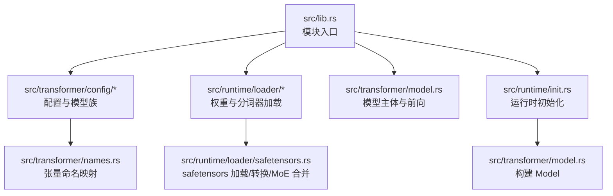
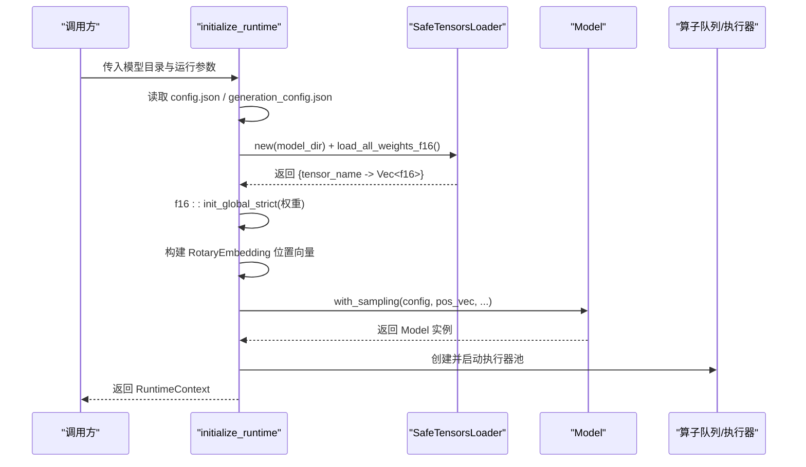
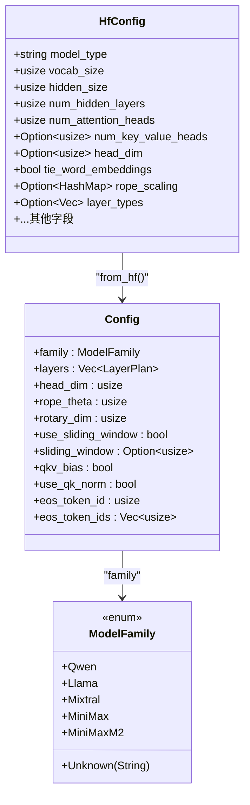
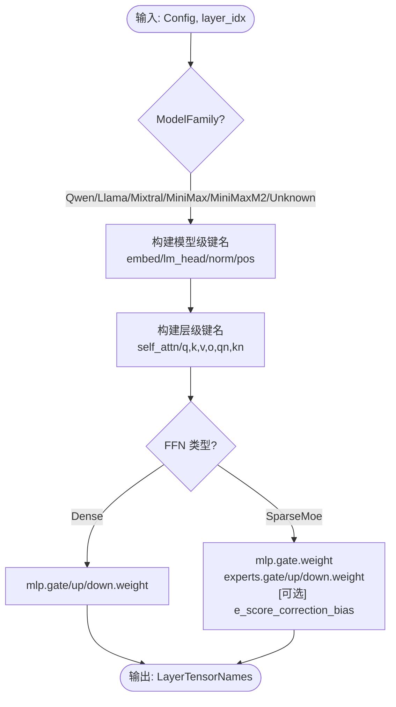
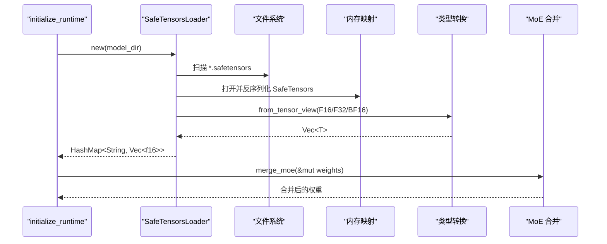
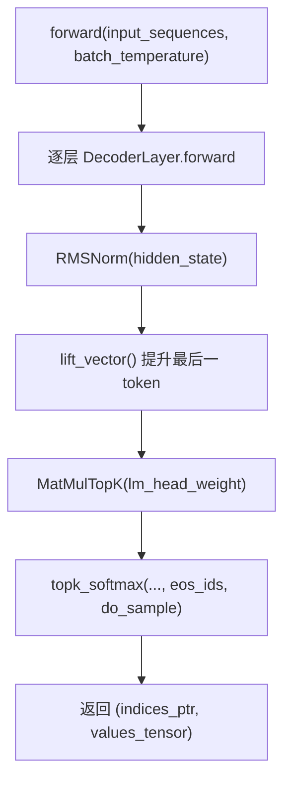
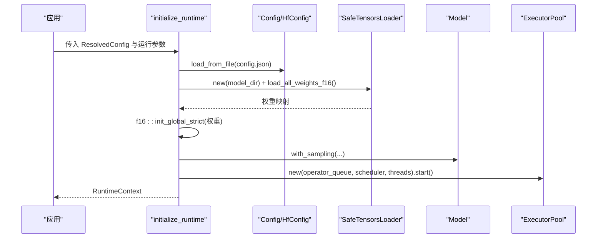
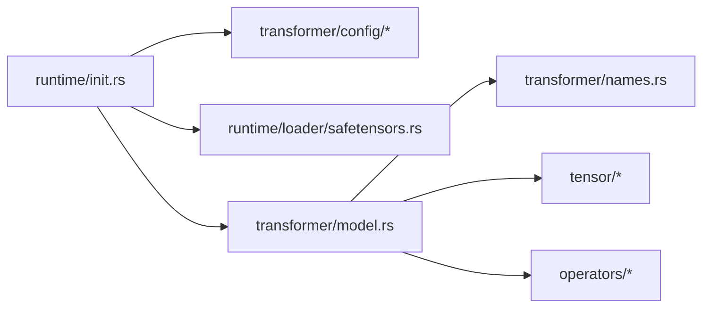

# 模型支持

<cite>
**本文引用的文件**
- [README.md](file://README.md)
- [src/lib.rs](file://src/lib.rs)
- [src/transformer/config/mod.rs](file://src/transformer/config/mod.rs)
- [src/transformer/config/config.rs](file://src/transformer/config/config.rs)
- [src/transformer/config/model_family.rs](file://src/transformer/config/model_family.rs)
- [src/transformer/names.rs](file://src/transformer/names.rs)
- [src/transformer/model.rs](file://src/transformer/model.rs)
- [src/runtime/loader/mod.rs](file://src/runtime/loader/mod.rs)
- [src/runtime/loader/safetensors.rs](file://src/runtime/loader/safetensors.rs)
- [src/runtime/init.rs](file://src/runtime/init.rs)
- [docs/contributing/model/basic.md](file://docs/contributing/model/basic.md)
- [docs/contributing/model/multimodal.md](file://docs/contributing/model/multimodal.md)
- [docs/contributing/model/tests.md](file://docs/contributing/model/tests.md)
</cite>

## 目录
1. [简介](#简介)
2. [项目结构](#项目结构)
3. [核心组件](#核心组件)
4. [架构总览](#架构总览)
5. [详细组件分析](#详细组件分析)
6. [依赖关系分析](#依赖关系分析)
7. [性能与内存优化建议](#性能与内存优化建议)
8. [故障排查指南](#故障排查指南)
9. [结论](#结论)
10. [附录：新模型接入清单](#附录新模型接入清单)

## 简介
本指南面向希望为 eLLM 新增模型支持的开发者，系统说明如何完成“架构适配—配置定义—权重加载—格式转换—多模态扩展—注册流程—验证与默认值管理—性能调优”的完整链路。eLLM 以 CPU 推理为核心目标，采用静态计算图、固定形状 KV 缓存、按头顺序注意力等设计，在长上下文场景具备显著优势。

## 项目结构
从仓库根目录看，模型相关能力主要分布在以下模块：
- 配置层：HuggingFace 原始配置解析、内部 Config 构建、模型家族识别、张量命名映射
- 运行时初始化：加载 config.json/generation_config.json、safetensors 权重、构建模型与执行器
- 模型主体：Model 构造、前向流程、采样与 TopK 选择
- 权重加载：SafeTensorsLoader 支持单/分片 safetensors、并行加载、MoE 权重合并
- 文档：贡献指南中的基础模型、多模态、测试指引

图表来源
- [src/lib.rs:1-16](file://src/lib.rs#L1-L16)
- [src/transformer/config/mod.rs:1-15](file://src/transformer/config/mod.rs#L1-L15)
- [src/runtime/loader/mod.rs:1-8](file://src/runtime/loader/mod.rs#L1-L8)
- [src/transformer/names.rs:1-134](file://src/transformer/names.rs#L1-L134)
- [src/runtime/loader/safetensors.rs:1-352](file://src/runtime/loader/safetensors.rs#L1-L352)
- [src/runtime/init.rs:1-136](file://src/runtime/init.rs#L1-L136)
- [src/transformer/model.rs:1-549](file://src/transformer/model.rs#L1-L549)

章节来源
- [src/lib.rs:1-16](file://src/lib.rs#L1-L16)
- [src/transformer/config/mod.rs:1-15](file://src/transformer/config/mod.rs#L1-L15)
- [src/runtime/loader/mod.rs:1-8](file://src/runtime/loader/mod.rs#L1-L8)

## 核心组件
- 配置体系
  - HfConfig：直接映射 config.json 字段（字符串/数值/可选），便于兼容不同模型发布格式
  - Config：由 HfConfig 推导内部统一配置，包含层计划、RoPE、滑动窗口、Q/K 归一化、路由评分等
  - ModelFamily：模型家族识别（如 Qwen/Llama/Mixtral/MiniMax 系列）
  - names：按模型族与层索引生成权重张量键名（含 MoE 分支）
- 权重加载
  - SafeTensorsLoader：发现并加载 safetensors（单文件或分片）、类型转换（F16/F32/BF16）、并行加载、MoE 专家权重合并
- 模型主体
  - Model：基于 Config 构建层序列、位置编码、RMSNorm、LM Head、TopK 采样；提供 forward 流水线
- 运行时初始化
  - initialize_runtime：读取 model_dir 下的 config.json/generation_config.json，加载权重到全局存储，构建 Model 与执行器池

章节来源
- [src/transformer/config/config.rs:1-136](file://src/transformer/config/config.rs#L1-L136)
- [src/transformer/config/model_family.rs:1-26](file://src/transformer/config/model_family.rs#L1-L26)
- [src/transformer/names.rs:1-134](file://src/transformer/names.rs#L1-L134)
- [src/runtime/loader/safetensors.rs:1-352](file://src/runtime/loader/safetensors.rs#L1-L352)
- [src/transformer/model.rs:1-549](file://src/transformer/model.rs#L1-L549)
- [src/runtime/init.rs:1-136](file://src/runtime/init.rs#L1-L136)

## 架构总览
下图展示从“模型目录”到“可执行模型”的关键路径：配置解析→权重加载→模型构建→算子队列与执行器启动。

图表来源
- [src/runtime/init.rs:34-136](file://src/runtime/init.rs#L34-L136)
- [src/runtime/loader/safetensors.rs:130-248](file://src/runtime/loader/safetensors.rs#L130-L248)
- [src/transformer/model.rs:96-168](file://src/transformer/model.rs#L96-L168)

## 详细组件分析

### 配置与模型家族
- HfConfig 负责“原样”接收 config.json 字段，避免强约束导致不兼容
- Config::from_hf 将 HfConfig 转换为内部 Config：
  - 自动推导 head_dim、num_key_value_heads、intermediate_size、max_window_layers 等
  - 根据 family 与字段决定 use_qk_norm、use_routing_bias、router_scoring 等
  - 通过 LayerPlan 构建每层的 FFN 类型（Dense/SparseMoe）与是否使用滑动窗口
- ModelFamily::parse 将 model_type 映射到具体家族，用于后续张量命名与行为差异处理

图表来源
- [src/transformer/config/config.rs:13-116](file://src/transformer/config/config.rs#L13-L116)
- [src/transformer/config/model_family.rs:1-26](file://src/transformer/config/model_family.rs#L1-L26)

章节来源
- [src/transformer/config/config.rs:1-136](file://src/transformer/config/config.rs#L1-L136)
- [src/transformer/config/model_family.rs:1-26](file://src/transformer/config/model_family.rs#L1-L26)

### 权重张量命名映射
- names 模块根据 Config.family 与层索引生成统一的张量键名，包括：
  - 模型级：token_embedding、position_embedding、lm_head、norm_weight
  - 层级：attention 投影、FFN（Dense 或 SparseMoe）、输入/输出归一化权重
- 对 MoE 分支，支持可选 router_bias 键名

图表来源
- [src/transformer/names.rs:56-134](file://src/transformer/names.rs#L56-L134)

章节来源
- [src/transformer/names.rs:1-134](file://src/transformer/names.rs#L1-L134)

### 权重加载与格式转换
- SafeTensorsLoader
  - 自动发现单文件或分片 safetensors
  - 支持 F16/F32/BF16 互转，小端序高效拷贝
  - 并行加载：按线程数切分文件块，聚合结果
  - MoE 合并：将 experts.{i}.gate/up/down 合并为 experts.gate/up/down，便于后续按块访问
- 集成点
  - initialize_runtime 中调用 load_all_weights_f16()，并将结果写入全局存储供算子使用

图表来源
- [src/runtime/loader/safetensors.rs:130-312](file://src/runtime/loader/safetensors.rs#L130-L312)
- [src/runtime/init.rs:56-61](file://src/runtime/init.rs#L56-L61)

章节来源
- [src/runtime/loader/safetensors.rs:1-352](file://src/runtime/loader/safetensors.rs#L1-L352)
- [src/runtime/init.rs:34-136](file://src/runtime/init.rs#L34-L136)

### 模型主体与前向流程
- Model 构造
  - 依据 Config 构建 layers、位置编码、RMSNorm、LM Head 等
  - 支持 top_k/top_p/min_p/do_sample/eos_ids 等采样参数
- forward 流程
  - 逐层 DecoderLayer 前向
  - 最终 RMSNorm → LM Head 矩阵乘 → TopK Softmax 采样
  - 返回 token 索引指针与对应分数张量

图表来源
- [src/transformer/model.rs:174-251](file://src/transformer/model.rs#L174-L251)

章节来源
- [src/transformer/model.rs:1-549](file://src/transformer/model.rs#L1-L549)

### 运行时初始化与执行
- initialize_runtime 职责
  - 读取 model_dir/config.json 与 generation_config.json
  - 加载 safetensors 权重并写入全局存储
  - 构建 RotaryEmbedding 位置向量
  - 构建 Model 实例并设置线程数
  - 构建 BatchSequence、SlotManager、Scheduler、ExecutorPool 并启动
- 关键参数
  - batch_size、sequence_length、chunk_size、session_mode、slot_reuse_timeout_ms

图表来源
- [src/runtime/init.rs:34-136](file://src/runtime/init.rs#L34-L136)

章节来源
- [src/runtime/init.rs:1-136](file://src/runtime/init.rs#L1-L136)

### 多模态模型支持方法
- 文档要求
  - 视觉/音频编码器集成
  - 输入预处理与批处理
  - 特殊 token 或提示词格式化
  - 文本-only 与多模态路径的独立测试
- 实现建议
  - 将多模态逻辑与基础文本模型路径解耦，保持评审与回归测试清晰
  - 在配置层增加模态开关与预处理参数，并在运行时按需启用

章节来源
- [docs/contributing/model/multimodal.md:1-16](file://docs/contributing/model/multimodal.md#L1-L16)

### 模型注册流程与示例
- 最小路径
  - 确定模型家族与架构
  - 复用或新增 tokenizer 与配置映射
  - 接入加载路径（config.json + safetensors）
  - 验证前向与生成路径
- 参考步骤
  - 在 ModelFamily 中添加新的 model_type 映射
  - 在 names 中补充该家族的张量键名规则
  - 若存在 MoE，确保 merge_moe 能正确合并专家权重
  - 在 initialize_runtime 中确认能从 model_dir 加载权重并构建 Model
  - 编写冒烟测试，覆盖基本前向与生成

章节来源
- [docs/contributing/model/basic.md:1-18](file://docs/contributing/model/basic.md#L1-L18)
- [src/transformer/config/model_family.rs:13-25](file://src/transformer/config/model_family.rs#L13-L25)
- [src/transformer/names.rs:56-134](file://src/transformer/names.rs#L56-L134)
- [src/runtime/loader/safetensors.rs:250-312](file://src/runtime/loader/safetensors.rs#L250-L312)
- [src/runtime/init.rs:44-108](file://src/runtime/init.rs#L44-L108)

### 配置验证与默认值管理
- 默认值策略
  - HfConfig 大量使用 serde default，保证缺失字段时仍可用
  - Config::from_hf 对 head_dim、num_key_value_heads、intermediate_size、max_window_layers、rope_theta、rotary_dim 等进行合理推导
  - 针对特定家族（如 MiniMaxM2）或模型类型（如 qwen3*）启用 use_qk_norm、use_routing_bias 等特性
- 验证建议
  - 在 from_hf 阶段进行一致性检查（如 num_key_value_heads ≤ num_attention_heads）
  - 对滑动窗口与 max_window_layers 做边界校验
  - 对 rope_scaling 的结构进行必要校验

章节来源
- [src/transformer/config/config.rs:39-116](file://src/transformer/config/config.rs#L39-L116)
- [src/transformer/config/model_family.rs:13-25](file://src/transformer/config/model_family.rs#L13-L25)

## 依赖关系分析
- 模块耦合
  - runtime/init 依赖 transformer/config 与 loader/safetensors，再组合出 Model
  - transformer/model 依赖 names 与 config，以及底层 tensor/operator 抽象
  - loader/safetensors 仅依赖 safetensors 库与标准库，低耦合
- 外部依赖
  - safetensors 文件格式
  - x86 AMX/AVX512FP16 等硬件特性（由顶层 feature 开启）

图表来源
- [src/runtime/init.rs:1-136](file://src/runtime/init.rs#L1-L136)
- [src/transformer/model.rs:1-549](file://src/transformer/model.rs#L1-L549)
- [src/transformer/names.rs:1-134](file://src/transformer/names.rs#L1-L134)
- [src/runtime/loader/safetensors.rs:1-352](file://src/runtime/loader/safetensors.rs#L1-L352)

章节来源
- [src/runtime/init.rs:1-136](file://src/runtime/init.rs#L1-L136)
- [src/transformer/model.rs:1-549](file://src/transformer/model.rs#L1-L549)

## 性能与内存优化建议
- 权重加载
  - 优先使用并行加载（load_all_weights_parallel），并通过环境变量控制线程数
  - 对超大模型，考虑先映射后按需转换，减少峰值内存
- 内存布局
  - 利用全局内存池与对齐分配，降低碎片与分配开销
  - 固定形状 KV 缓存避免动态扩容带来的重分配与拷贝
- 计算路径
  - 按头顺序注意力有利于 CPU 缓存命中，尽量保持连续访问
  - 对小批量/瘦矩阵乘法，CPU 通常更稳定，注意线程数与 SIMD 宽度匹配
- 采样与 TopK
  - 合理设置 top_k/top_p/min_p，避免极端采样导致的额外开销
  - 对 EOS 列表进行预置，减少判断分支

章节来源
- [src/runtime/loader/safetensors.rs:197-240](file://src/runtime/loader/safetensors.rs#L197-L240)
- [src/transformer/model.rs:174-251](file://src/transformer/model.rs#L174-L251)

## 故障排查指南
- 常见错误
  - 未找到 safetensors 文件：检查模型目录结构与文件名
  - 不支持的数据类型：确认 safetensors 为 F16/F32/BF16
  - 字节长度非法：F16 数据长度需为偶数
  - 缺少 config.json 或 generation_config.json：确保模型目录包含必要配置文件
- 定位手段
  - 打印加载的权重数量与 key 集合，核对 names 映射是否一致
  - 对 MoE 模型，检查 merge_moe 后 experts.* 键是否存在且连续
  - 使用对齐追踪环境变量辅助定位前向构建阶段问题

章节来源
- [src/runtime/loader/safetensors.rs:130-171](file://src/runtime/loader/safetensors.rs#L130-L171)
- [src/runtime/loader/safetensors.rs:318-334](file://src/runtime/loader/safetensors.rs#L318-L334)
- [src/runtime/init.rs:44-61](file://src/runtime/init.rs#L44-L61)

## 结论
通过“配置解析—权重加载—模型构建—执行器启动”的标准化路径，eLLM 为新模型提供了清晰的接入方式。建议在新增模型时严格遵循家族识别、张量命名、MoE 合并与配置默认值推导的规则，并结合多模态与测试规范完善端到端验证。

## 附录：新模型接入清单
- 配置
  - 在 HfConfig 中确保所有必要字段可被解析
  - 在 Config::from_hf 中补充缺失字段的推导与默认值
  - 在 ModelFamily 中新增 model_type 映射
- 权重
  - 在 names 中为该家族定义模型级与层级键名
  - 若为 MoE，确保 merge_moe 能正确合并专家权重
- 运行时
  - 在 initialize_runtime 中确认可从 model_dir 加载权重并构建 Model
  - 设置合理的线程数与采样参数
- 测试
  - 编写冒烟测试，覆盖基本前向与生成路径
  - 多模态模型需分别测试文本-only 与多模态路径

章节来源
- [docs/contributing/model/tests.md:1-5](file://docs/contributing/model/tests.md#L1-L5)
- [docs/contributing/model/basic.md:1-18](file://docs/contributing/model/basic.md#L1-L18)
- [docs/contributing/model/multimodal.md:1-16](file://docs/contributing/model/multimodal.md#L1-L16)