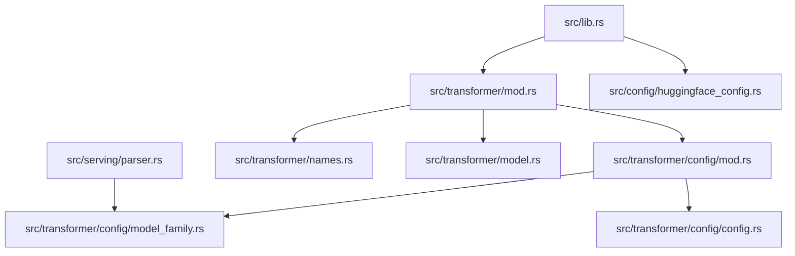
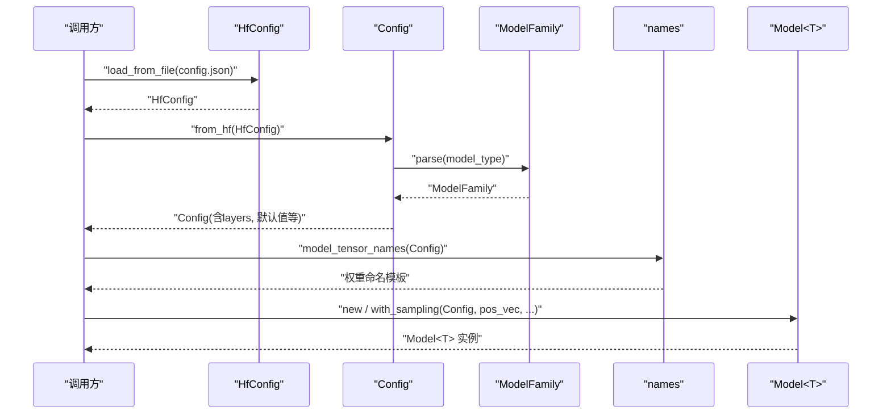
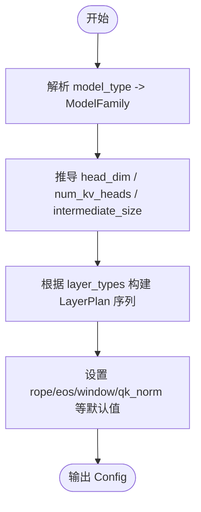
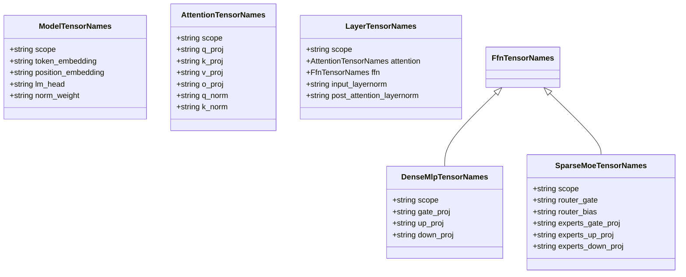
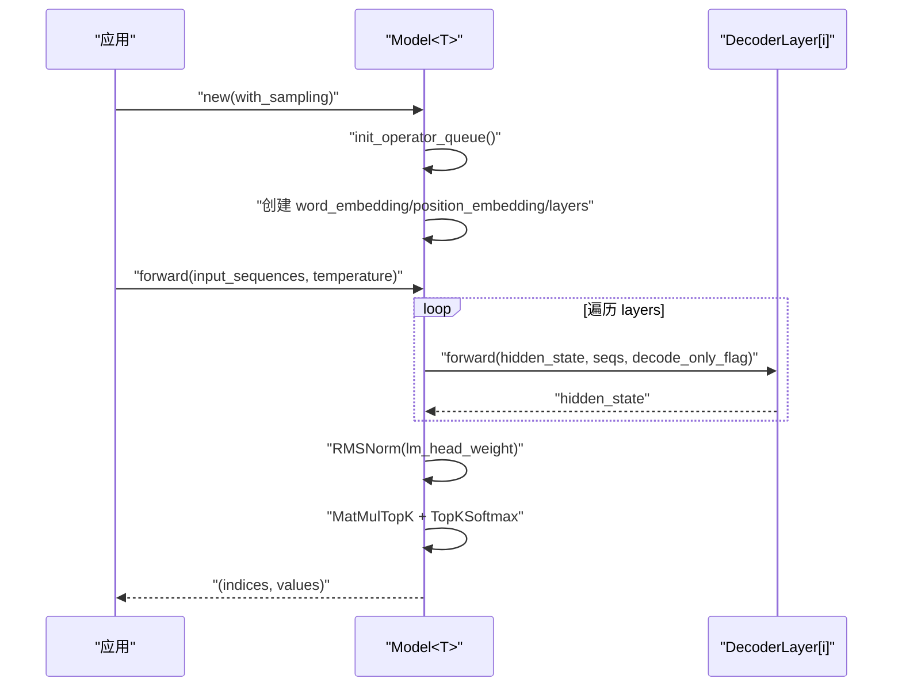
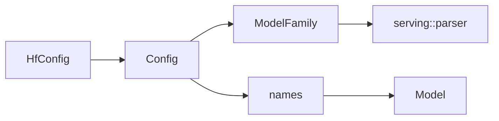

# 模型注册系统

<cite>
**本文引用的文件**   
- [src/lib.rs](file://src/lib.rs)
- [src/transformer/mod.rs](file://src/transformer/mod.rs)
- [src/transformer/config/mod.rs](file://src/transformer/config/mod.rs)
- [src/transformer/config/model_family.rs](file://src/transformer/config/model_family.rs)
- [src/transformer/config/config.rs](file://src/transformer/config/config.rs)
- [src/transformer/names.rs](file://src/transformer/names.rs)
- [src/transformer/model.rs](file://src/transformer/model.rs)
- [src/config/huggingface_config.rs](file://src/config/huggingface_config.rs)
- [src/serving/parser.rs](file://src/serving/parser.rs)
</cite>

## 目录
1. [简介](#简介)
2. [项目结构](#项目结构)
3. [核心组件](#核心组件)
4. [架构总览](#架构总览)
5. [详细组件分析](#详细组件分析)
6. [依赖关系分析](#依赖关系分析)
7. [性能考量](#性能考量)
8. [故障排查指南](#故障排查指南)
9. [结论](#结论)
10. [附录](#附录)

## 简介
本技术文档围绕“模型注册系统”展开，聚焦于该仓库中用于识别、解析与装配不同模型家族（如 Qwen、Llama、Mixtral、MiniMax 等）的机制。当前代码库并未实现基于字符串键的动态工厂或运行时插件式注册表，而是通过“配置驱动 + 家族枚举 + 名称映射”的方式完成模型的“静态注册”。其核心思想是：
- 以 Hugging Face 风格的 config.json 为输入源，解析出原始配置；
- 将原始配置归一化为内部 Config，并推断模型家族；
- 根据家族与层计划生成权重张量命名模板；
- 在模型构建时按命名模板加载权重并组装推理图。

因此，“模型注册”在当前实现中体现为“模型家族识别与配置装配”，而非动态可插拔的工厂模式。后续章节将从架构、数据流、API 接口、版本兼容、优先级规则、热重载支持现状以及最佳实践等方面进行全面说明。

## 项目结构
与模型注册相关的关键模块位于 transformer 与 config 子系统中，主要职责如下：
- 顶层模块导出 transformer 与 config 子系统；
- transformer::config 负责从 HF 配置到内部配置的转换、模型家族识别、层计划构建；
- transformer::names 提供按家族与层索引生成的权重张量命名模板；
- transformer::model 使用上述信息构造具体模型实例并执行前向计算；
- serving::parser 依据模型家族选择对话模板解析器。

图示来源
- [src/lib.rs:1-16](file://src/lib.rs#L1-L16)
- [src/transformer/mod.rs:1-9](file://src/transformer/mod.rs#L1-L9)
- [src/transformer/config/mod.rs:1-15](file://src/transformer/config/mod.rs#L1-L15)
- [src/transformer/config/model_family.rs:1-26](file://src/transformer/config/model_family.rs#L1-L26)
- [src/transformer/config/config.rs:1-136](file://src/transformer/config/config.rs#L1-L136)
- [src/transformer/names.rs:1-134](file://src/transformer/names.rs#L1-L134)
- [src/transformer/model.rs:1-549](file://src/transformer/model.rs#L1-L549)
- [src/config/huggingface_config.rs:1-92](file://src/config/huggingface_config.rs#L1-L92)
- [src/serving/parser.rs:1-200](file://src/serving/parser.rs#L1-L200)

章节来源
- [src/lib.rs:1-16](file://src/lib.rs#L1-L16)
- [src/transformer/mod.rs:1-9](file://src/transformer/mod.rs#L1-L9)

## 核心组件
本节概述模型注册相关的核心数据结构与流程：
- HfConfig：直接映射 config.json 的原始字段，包含 model_type、num_hidden_layers、rope_theta、sliding_window、layer_types 等；
- ModelFamily：对 model_type 进行归一化识别，返回 Qwen/Llama/Mixtral/MiniMax/MiniMaxM2/Unknown；
- Config：由 HfConfig 推导而来，填充默认值、计算 head_dim、num_key_value_heads、intermediate_size、构建 LayerPlan 序列等；
- names 模块：根据 Config.family 与层索引生成权重张量命名模板，供权重加载器使用；
- Model<T>：基于 Config 与位置编码向量构建模型实例，组织 layers、norm、lm_head 等，并提供 forward 接口。

章节来源
- [src/config/huggingface_config.rs:1-92](file://src/config/huggingface_config.rs#L1-L92)
- [src/transformer/config/model_family.rs:1-26](file://src/transformer/config/model_family.rs#L1-L26)
- [src/transformer/config/config.rs:1-136](file://src/transformer/config/config.rs#L1-L136)
- [src/transformer/names.rs:1-134](file://src/transformer/names.rs#L1-L134)
- [src/transformer/model.rs:1-549](file://src/transformer/model.rs#L1-L549)

## 架构总览
下图展示了从配置文件到模型实例的核心数据流，体现了“配置驱动”的模型装配路径。

图示来源
- [src/config/huggingface_config.rs:82-92](file://src/config/huggingface_config.rs#L82-L92)
- [src/transformer/config/config.rs:39-116](file://src/transformer/config/config.rs#L39-L116)
- [src/transformer/config/model_family.rs:13-25](file://src/transformer/config/model_family.rs#L13-L25)
- [src/transformer/names.rs:56-80](file://src/transformer/names.rs#L56-L80)
- [src/transformer/model.rs:69-168](file://src/transformer/model.rs#L69-L168)

## 详细组件分析

### 模型家族识别与配置装配
- 模型家族识别：
  - 入口：ModelFamily::parse，将 model_type 小写后匹配已知族名，未知则回退为 Unknown；
  - 影响范围：决定后续权重命名策略、路由评分函数默认值、是否启用 qk_norm 等。
- 配置装配：
  - 入口：Config::from_hf，负责：
    - 计算 head_dim、num_key_value_heads、intermediate_size；
    - 根据 layer_types 与 ffn 参数构建 LayerPlan 序列；
    - 设置 rope_theta、rotary_dim、eos_token_id(s)、滑动窗口等；
    - 根据 family 与 hf 字段推导 use_qk_norm、use_routing_bias 等。

图示来源
- [src/transformer/config/model_family.rs:13-25](file://src/transformer/config/model_family.rs#L13-L25)
- [src/transformer/config/config.rs:39-116](file://src/transformer/config/config.rs#L39-L116)

章节来源
- [src/transformer/config/model_family.rs:1-26](file://src/transformer/config/model_family.rs#L1-L26)
- [src/transformer/config/config.rs:1-136](file://src/transformer/config/config.rs#L1-L136)

### 权重命名模板与多架构适配
- 模型级命名：
  - 统一 scope 为 "model"；
  - token_embedding 固定为 "model.embed_tokens.weight"；
  - lm_head 根据 tie_word_embeddings 决定是否复用 embedding；
  - position_embedding 与 norm_weight 采用固定命名。
- 层内命名：
  - attention 子模块包含 q/k/v/o_proj 及可选 q_norm/k_norm；
  - ffn 分支 Dense/SparseMoe，后者支持 router_gate/router_bias/experts.*；
  - input/post_attention layernorm 权重命名固定。

图示来源
- [src/transformer/names.rs:1-134](file://src/transformer/names.rs#L1-L134)

章节来源
- [src/transformer/names.rs:1-134](file://src/transformer/names.rs#L1-L134)

### 模型实例构建与前向流程
- 构造：
  - Model::new / with_sampling 接收 Config、位置编码向量与采样参数；
  - 初始化全局算子队列，创建词嵌入、位置编码、各层 DecoderLayer；
  - 设置 batch/sequence/chunk/topk 等运行期参数。
- 前向：
  - 逐层调用 DecoderLayer.forward；
  - 最终 RMSNorm + LM Head TopK + Softmax 采样得到 token。

图示来源
- [src/transformer/model.rs:69-168](file://src/transformer/model.rs#L69-L168)
- [src/transformer/model.rs:174-251](file://src/transformer/model.rs#L174-L251)

章节来源
- [src/transformer/model.rs:1-549](file://src/transformer/model.rs#L1-L549)

### 服务侧模板选择（与模型家族联动）
- serving::parser 根据 ModelFamily 选择对话模板解析器，例如 Qwen 使用 hermes，Llama 使用 llama3_json 等；
- 这体现了“家族识别 -> 行为选择”的注册式思维，尽管并非动态工厂。

章节来源
- [src/serving/parser.rs:158-165](file://src/serving/parser.rs#L158-L165)
- [src/transformer/config/model_family.rs:13-25](file://src/transformer/config/model_family.rs#L13-L25)

## 依赖关系分析
- 低耦合点：
  - ModelFamily 仅依赖字符串匹配，无外部状态；
  - names 模块仅依赖 Config 与 FfnKind，纯函数式生成命名；
  - Config::from_hf 集中处理默认值与推导逻辑，屏蔽底层差异。
- 关键依赖链：
  - HfConfig -> Config -> ModelFamily -> names -> Model<T>；
  - serving::parser 依赖 ModelFamily 做模板选择。

图示来源
- [src/config/huggingface_config.rs:82-92](file://src/config/huggingface_config.rs#L82-L92)
- [src/transformer/config/config.rs:39-116](file://src/transformer/config/config.rs#L39-L116)
- [src/transformer/config/model_family.rs:13-25](file://src/transformer/config/model_family.rs#L13-L25)
- [src/transformer/names.rs:56-80](file://src/transformer/names.rs#L56-L80)
- [src/transformer/model.rs:69-168](file://src/transformer/model.rs#L69-L168)
- [src/serving/parser.rs:158-165](file://src/serving/parser.rs#L158-L165)

## 性能考量
- 配置推导阶段：
  - 头维度、KV 头数、中间层维度等均为 O(1) 算术推导；
  - LayerPlan 构建复杂度与层数线性相关。
- 模型构建阶段：
  - 初始化全局算子队列与张量占位，时间复杂度与层数线性相关；
  - 前向过程逐层执行，整体复杂度与层数、序列长度、batch 规模相关。
- 建议：
  - 合理设置 chunk_size、topk_simd_size 与线程数，以匹配硬件特性；
  - 避免频繁重建 Model 实例，尽量复用已构建对象。

[本节为通用性能讨论，不直接分析具体文件]

## 故障排查指南
- 配置缺失或类型不匹配：
  - 现象：加载 HfConfig 失败或推导异常；
  - 排查：检查 config.json 是否存在必要字段（如 model_type、vocab_size、num_hidden_layers 等），确认数值类型正确。
- 模型家族识别错误：
  - 现象：权重命名不匹配导致加载失败；
  - 排查：确认 model_type 是否为已知值，必要时扩展 ModelFamily::parse 的匹配分支。
- 层计划不一致：
  - 现象：layers 数量与 num_hidden_layers 不一致；
  - 排查：检查 layer_types 与 ffn 参数是否正确，确保 LayerPlan::build_stack 能生成预期序列。
- 采样与 EOS 问题：
  - 现象：提前终止或无法停止；
  - 排查：确认 eos_token_id(s) 设置与 topk_softmax 采样参数一致。

章节来源
- [src/config/huggingface_config.rs:1-92](file://src/config/huggingface_config.rs#L1-L92)
- [src/transformer/config/config.rs:113-116](file://src/transformer/config/config.rs#L113-L116)
- [src/transformer/config/config.rs:118-135](file://src/transformer/config/config.rs#L118-L135)

## 结论
当前仓库中的“模型注册系统”以配置驱动为核心，通过模型家族识别与权重命名模板实现多架构的统一装配。其优势在于：
- 清晰的数据流与职责划分；
- 易于扩展新家族（仅需在 ModelFamily 与 names 中添加分支）；
- 与 Hugging Face 生态良好对接。

不足在于：
- 未实现基于字符串键的动态工厂或运行时插件式注册；
- 新增模型需修改源码分支，难以做到零侵入式扩展。

若未来需要更灵活的“动态加载/热更新”，可在现有基础上引入注册表与工厂抽象，详见附录建议。

[本节为总结性内容，不直接分析具体文件]

## 附录

### API 与使用示例（路径指引）
- 加载配置：
  - HfConfig::load_from_file -> Config::load_from_file -> Config::from_hf
  - 参考路径：[src/config/huggingface_config.rs:82-92](file://src/config/huggingface_config.rs#L82-L92)、[src/transformer/config/config.rs:113-116](file://src/transformer/config/config.rs#L113-L116)
- 构建模型：
  - Model::new / Model::with_sampling
  - 参考路径：[src/transformer/model.rs:69-168](file://src/transformer/model.rs#L69-L168)
- 前向推理：
  - Model::forward
  - 参考路径：[src/transformer/model.rs:174-251](file://src/transformer/model.rs#L174-L251)
- 命名模板：
  - model_tensor_names / layer_tensor_names
  - 参考路径：[src/transformer/names.rs:56-134](file://src/transformer/names.rs#L56-L134)

### 版本管理与兼容性检查
- 当前未见显式的版本字段校验逻辑；
- 建议在 HfConfig 中增加 transformers_version 字段的使用与断言，或在 Config::from_hf 中加入最小版本要求检查，以避免不兼容配置进入运行期。

[本节为概念性建议，不直接分析具体文件]

### 配置优先级与默认值处理
- 优先级规则（从高到低）：
  - HfConfig 显式字段 > 推导默认值（如 head_dim、num_kv_heads、intermediate_size）> 硬编码默认（如 rope_theta=10000）。
- 典型默认值来源：
  - head_dim = hidden_size / num_attention_heads（当 head_dim 未提供）；
  - num_key_value_heads = num_attention_heads（当未提供）；
  - intermediate_size = moe_intermediate_size 或 hidden_size（当未提供）。
- 参考路径：[src/transformer/config/config.rs:39-116](file://src/transformer/config/config.rs#L39-L116)

章节来源
- [src/transformer/config/config.rs:39-116](file://src/transformer/config/config.rs#L39-L116)

### 热重载与动态更新支持现状与建议
- 现状：
  - 未发现运行时热重载或动态替换模型实例的代码；
  - 模型实例构建依赖全局算子队列与内存池，切换模型需谨慎管理资源。
- 建议方案：
  - 引入“模型注册表”：维护一个从字符串键到“模型构建器”的映射；
  - 工厂方法：根据键选择构建器，返回 Model<T>；
  - 热更新：在安全边界内销毁旧实例、重建新实例，并原子替换引用；
  - 并发控制：使用读写锁保护注册表与实例指针，避免竞态。

[本节为概念性建议，不直接分析具体文件]

### 最佳实践与常见陷阱
- 最佳实践：
  - 保持 config.json 字段完整且类型正确；
  - 为新模型优先复用已有命名模板，仅在必要时扩展；
  - 在测试中覆盖 from_file 与 from_hf 两条路径。
- 常见陷阱：
  - 忽略 tie_word_embeddings 导致 lm_head 权重名不匹配；
  - 未设置 eos_token_id(s) 导致生成无法终止；
  - 层计划与 num_hidden_layers 不一致导致越界访问。

[本节为通用指导，不直接分析具体文件]