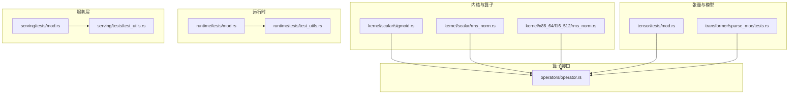
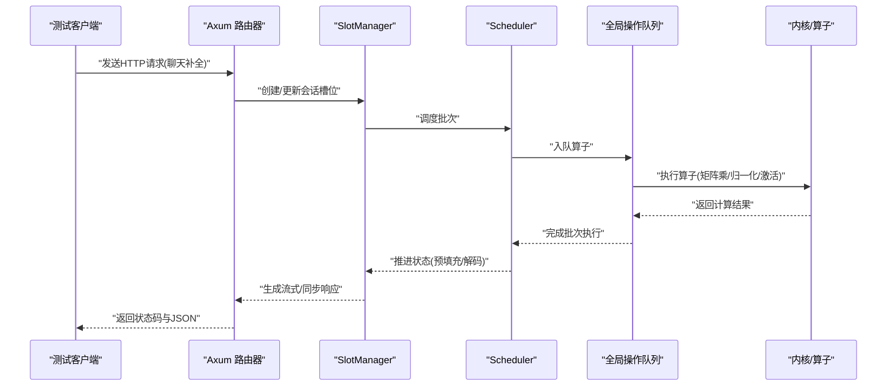
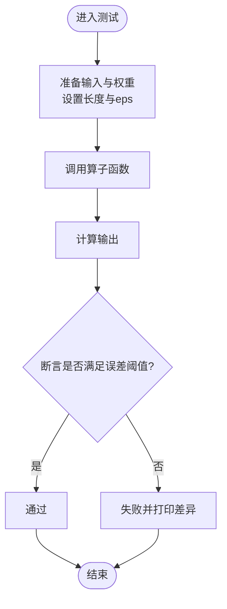
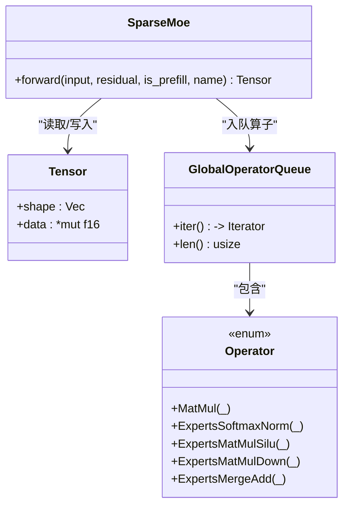
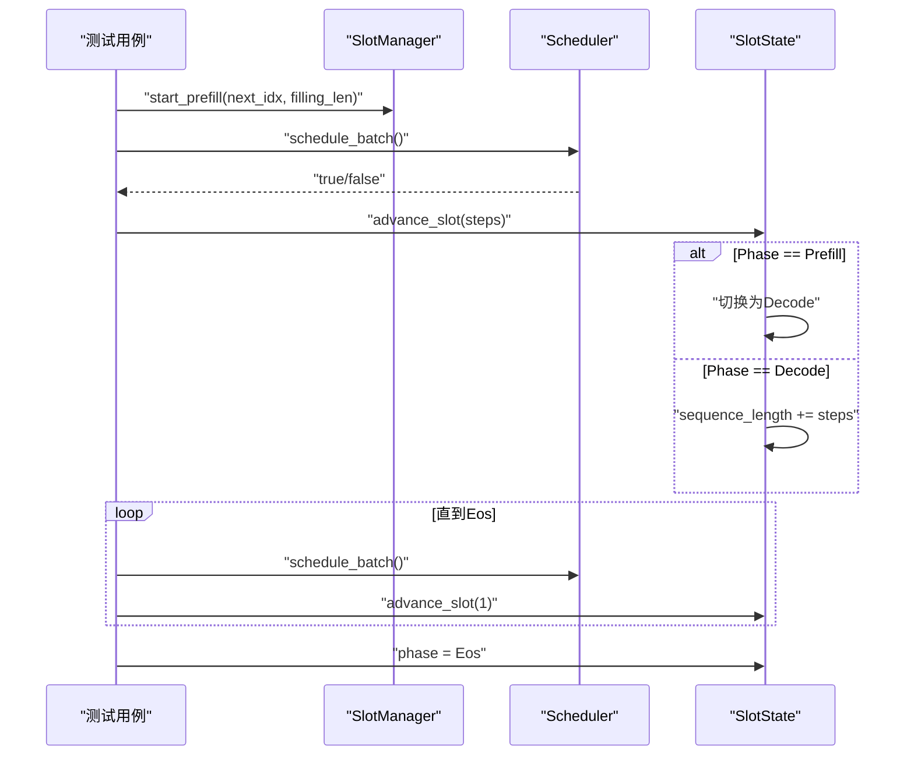
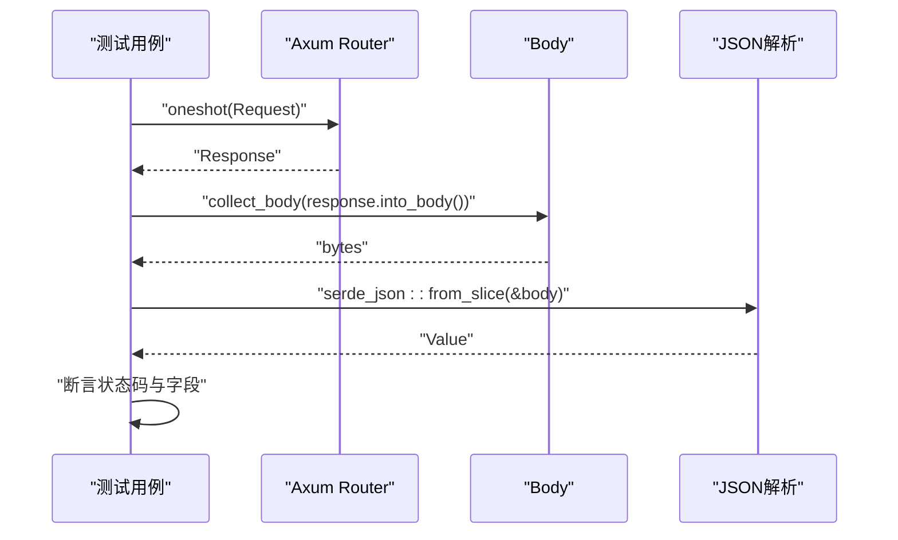
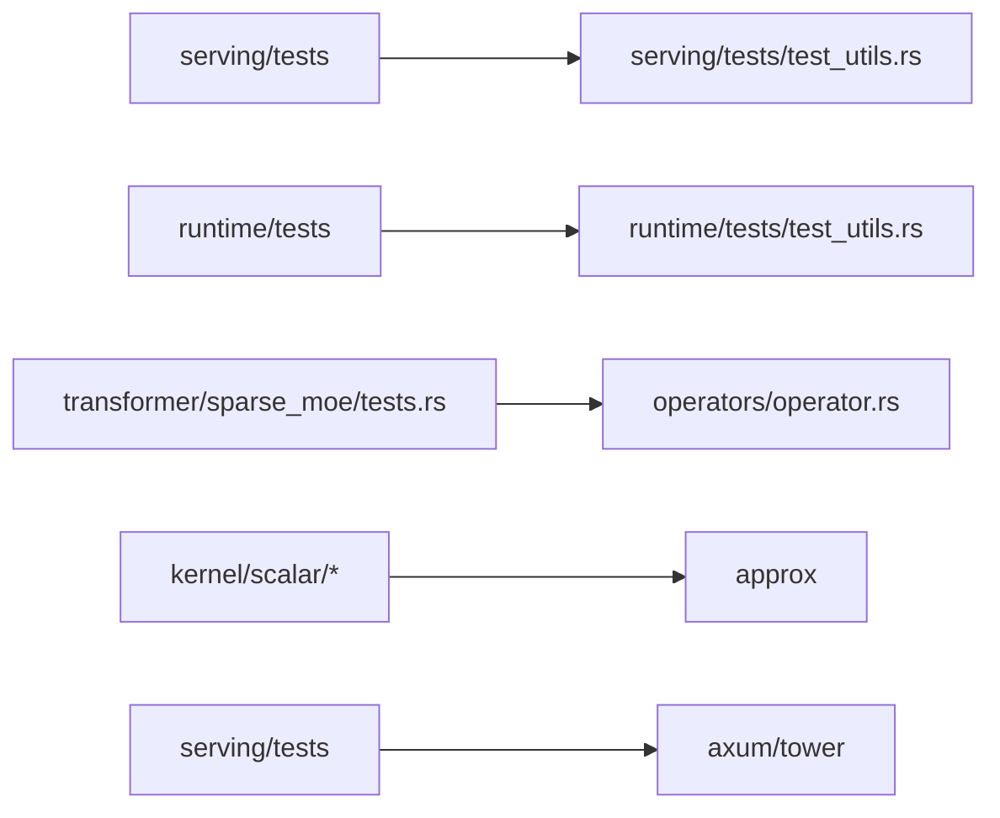

# 单元测试

<cite>
**本文引用的文件**   
- [src/runtime/tests/mod.rs](file://src/runtime/tests/mod.rs)
- [src/runtime/tests/test_utils.rs](file://src/runtime/tests/test_utils.rs)
- [src/serving/tests/mod.rs](file://src/serving/tests/mod.rs)
- [src/serving/tests/test_utils.rs](file://src/serving/tests/test_utils.rs)
- [src/tensor/tests/mod.rs](file://src/tensor/tests/mod.rs)
- [src/transformer/sparse_moe/tests.rs](file://src/transformer/sparse_moe/tests.rs)
- [src/kernel/scalar/sigmoid.rs](file://src/kernel/scalar/sigmoid.rs)
- [src/kernel/scalar/rms_norm.rs](file://src/kernel/scalar/rms_norm.rs)
- [src/kernel/x86_64/f16_512/rms_norm.rs](file://src/kernel/x86_64/f16_512/rms_norm.rs)
- [src/operators/operator.rs](file://src/operators/operator.rs)
</cite>

## 目录
1. [简介](#简介)
2. [项目结构](#项目结构)
3. [核心组件](#核心组件)
4. [架构总览](#架构总览)
5. [详细组件分析](#详细组件分析)
6. [依赖分析](#依赖分析)
7. [性能考虑](#性能考虑)
8. [故障排查指南](#故障排查指南)
9. [结论](#结论)
10. [附录](#附录) 

## 简介
本指南面向 eLLM 项目的 Rust 单元测试编写，覆盖运行时组件、张量与算子、以及服务层的测试规范与最佳实践。文档基于仓库中现有测试代码与工具模块进行归纳总结，提供可操作的用例组织方式、模拟对象使用策略、断言方法选择、异步与并发测试要点、错误处理与边界条件测试建议，并给出覆盖率要求与分析方法。

## 项目结构
eLLM 的测试按功能域分层组织：
- 内核与算子层：在各自源文件中以 #[cfg(test)] 模块内聚测试，便于快速定位与最小化运行范围。
- 张量与模型层：集中放在 src/tensor/tests 与 src/transformer/sparse_moe/tests.rs，复用公共测试工具。
- 运行时层：集中在 src/runtime/tests，包含会话生命周期、调度集成、场景与批增量等测试。
- 服务层：集中在 src/serving/tests，使用 axum 的 ServiceExt 对路由进行端到端验证。

图示来源 
- [src/kernel/scalar/sigmoid.rs:1-37](file://src/kernel/scalar/sigmoid.rs#L1-L37)
- [src/kernel/scalar/rms_norm.rs:52-151](file://src/kernel/scalar/rms_norm.rs#L52-L151)
- [src/kernel/x86_64/f16_512/rms_norm.rs:168-206](file://src/kernel/x86_64/f16_512/rms_norm.rs#L168-L206)
- [src/operators/operator.rs:1457-1494](file://src/operators/operator.rs#L1457-L1494)
- [src/tensor/tests/mod.rs:1-25](file://src/tensor/tests/mod.rs#L1-L25)
- [src/transformer/sparse_moe/tests.rs:1-216](file://src/transformer/sparse_moe/tests.rs#L1-L216)
- [src/runtime/tests/mod.rs:1-6](file://src/runtime/tests/mod.rs#L1-L6)
- [src/runtime/tests/test_utils.rs:1-129](file://src/runtime/tests/test_utils.rs#L1-L129)
- [src/serving/tests/mod.rs:1-68](file://src/serving/tests/mod.rs#L1-L68)
- [src/serving/tests/test_utils.rs:1-134](file://src/serving/tests/test_utils.rs#L1-L134)

章节来源
- [src/runtime/tests/mod.rs:1-6](file://src/runtime/tests/mod.rs#L1-L6)
- [src/serving/tests/mod.rs:1-68](file://src/serving/tests/mod.rs#L1-L68)
- [src/tensor/tests/mod.rs:1-25](file://src/tensor/tests/mod.rs#L1-L25)

## 核心组件
- 内核与算子测试
  - 使用近似断言库（如 approx）进行浮点比较，优先采用 ULP 或相对误差断言，避免直接相等比较。
  - 针对 SIMD/平台特定实现，保留独立测试用例，确保不同后端行为一致。
- 张量与模型测试
  - 通过内存池与全局操作队列初始化环境，构造 Tensor 输入与残差，执行 forward 后校验输出位级一致性或数值精度。
  - 对比单线程与多线程执行结果，保证并行路径正确性。
- 运行时测试
  - 使用 test_utils 提供的 SlotManager、Scheduler、BatchSequence 等构造器，模拟预填充与解码阶段的状态推进。
  - 使用 tokio::test 驱动异步流程，验证会话生命周期、调度与批增量逻辑。
- 服务层测试
  - 使用 axum 的 Router 与 ServiceExt 发起 HTTP 请求，断言状态码与响应体字段，覆盖无效 JSON、缺失字段等异常路径。

章节来源
- [src/kernel/scalar/sigmoid.rs:21-37](file://src/kernel/scalar/sigmoid.rs#L21-L37)
- [src/kernel/scalar/rms_norm.rs:73-151](file://src/kernel/scalar/rms_norm.rs#L73-L151)
- [src/kernel/x86_64/f16_512/rms_norm.rs:168-206](file://src/kernel/x86_64/f16_512/rms_norm.rs#L168-L206)
- [src/transformer/sparse_moe/tests.rs:92-216](file://src/transformer/sparse_moe/tests.rs#L92-L216)
- [src/runtime/tests/test_utils.rs:1-129](file://src/runtime/tests/test_utils.rs#L1-L129)
- [src/serving/tests/mod.rs:11-68](file://src/serving/tests/mod.rs#L11-L68)

## 架构总览
下图展示从服务层到运行时、再到算子与内核的调用链，以及测试如何介入各层进行验证。

图示来源 
- [src/serving/tests/mod.rs:11-68](file://src/serving/tests/mod.rs#L11-L68)
- [src/serving/tests/test_utils.rs:71-75](file://src/serving/tests/test_utils.rs#L71-L75)
- [src/runtime/tests/test_utils.rs:101-129](file://src/runtime/tests/test_utils.rs#L101-L129)
- [src/transformer/sparse_moe/tests.rs:42-50](file://src/transformer/sparse_moe/tests.rs#L42-L50)
- [src/operators/operator.rs:1457-1494](file://src/operators/operator.rs#L1457-L1494)

## 详细组件分析

### 内核与算子层测试规范
- 断言方法
  - 使用 ULP 断言（如 assert_ulps_eq!）评估浮点误差，适用于大多数标量与归一化算子。
  - 使用绝对误差或相对误差断言（如 assert_abs_diff_eq!/assert_relative_eq!）用于矩阵乘法等大规模数值计算。
- 典型场景
  - 标量激活函数：输入小数组，逐元素验证期望值。
  - RMSNorm：分别测试纯归一化与加和后再归一化的组合路径。
  - 平台特定实现：为 f16_512 路径单独准备对齐内存与长度参数，确保 SIMD 路径稳定。
- 最佳实践
  - 将测试数据尽量固定或使用确定性种子，避免随机性导致不稳定。
  - 对指针与 unsafe 访问，仅在必要处使用，并在测试中明确长度与对齐约束。

图示来源 
- [src/kernel/scalar/sigmoid.rs:21-37](file://src/kernel/scalar/sigmoid.rs#L21-L37)
- [src/kernel/scalar/rms_norm.rs:73-151](file://src/kernel/scalar/rms_norm.rs#L73-L151)
- [src/kernel/x86_64/f16_512/rms_norm.rs:168-206](file://src/kernel/x86_64/f16_512/rms_norm.rs#L168-L206)

章节来源
- [src/kernel/scalar/sigmoid.rs:21-37](file://src/kernel/scalar/sigmoid.rs#L21-L37)
- [src/kernel/scalar/rms_norm.rs:73-151](file://src/kernel/scalar/rms_norm.rs#L73-L151)
- [src/kernel/x86_64/f16_512/rms_norm.rs:168-206](file://src/kernel/x86_64/f16_512/rms_norm.rs#L168-L206)

### 张量与模型层测试规范
- 环境初始化
  - 使用全局内存池与操作队列初始化，确保算子执行上下文可用。
- 构建用例
  - 通过 build_case 构造 SparseMoe 实例与输入/残差张量，指定序列长度、批大小、隐藏维度、专家数与路由评分策略。
- 执行与验证
  - 调用 forward 后检查操作队列结构与类型顺序；对比单线程与多线程执行结果的位级一致性；在零权重情况下验证输出等于残差。
- 并发与稳定性
  - 使用 run_queue 遍历队列并按线程号执行，确保并行路径无竞争且结果确定。

图示来源 
- [src/transformer/sparse_moe/tests.rs:52-90](file://src/transformer/sparse_moe/tests.rs#L52-L90)
- [src/transformer/sparse_moe/tests.rs:92-127](file://src/transformer/sparse_moe/tests.rs#L92-L127)
- [src/transformer/sparse_moe/tests.rs:166-186](file://src/transformer/sparse_moe/tests.rs#L166-L186)
- [src/transformer/sparse_moe/tests.rs:188-216](file://src/transformer/sparse_moe/tests.rs#L188-L216)

章节来源
- [src/transformer/sparse_moe/tests.rs:92-216](file://src/transformer/sparse_moe/tests.rs#L92-L216)

### 运行时层测试规范
- 工具与构造器
  - test_utils 提供 create_test_manager、run_prefill_and_decode、advance_slot 等辅助函数，简化会话槽位与调度器的构造与推进。
- 异步测试
  - 使用 #[tokio::test] 标记异步测试，结合 sleep 与 notify 模拟真实时序。
- 关键流程
  - 预填充阶段：设置 filling_length 与 next_sequence_index，调度后推进至 Decode。
  - 解码阶段：循环调度与推进，直至 Eos。
- 常见模式
  - 批量增量测试：验证 batch delta 的正确性与边界条件。
  - 场景测试：覆盖多轮对话、工具调用、超时与资源回收。

图示来源 
- [src/runtime/tests/test_utils.rs:12-26](file://src/runtime/tests/test_utils.rs#L12-L26)
- [src/runtime/tests/test_utils.rs:101-129](file://src/runtime/tests/test_utils.rs#L101-L129)

章节来源
- [src/runtime/tests/test_utils.rs:1-129](file://src/runtime/tests/test_utils.rs#L1-L129)

### 服务层测试规范
- 路由与请求
  - 使用 create_test_router 构建测试路由器与 SlotManager，借助 axum 的 Request/Body 构造请求。
- 断言要点
  - 状态码断言：如 OK、BAD_REQUEST、UNPROCESSABLE_ENTITY。
  - 响应体断言：解析 JSON 并检查关键字段（status、mode、info）。
- 异常路径
  - 非法 JSON、缺失必填字段、空体等场景需覆盖。

图示来源 
- [src/serving/tests/mod.rs:11-31](file://src/serving/tests/mod.rs#L11-L31)
- [src/serving/tests/mod.rs:33-68](file://src/serving/tests/mod.rs#L33-L68)
- [src/serving/tests/test_utils.rs:71-75](file://src/serving/tests/test_utils.rs#L71-L75)

章节来源
- [src/serving/tests/mod.rs:11-68](file://src/serving/tests/mod.rs#L11-L68)
- [src/serving/tests/test_utils.rs:71-75](file://src/serving/tests/test_utils.rs#L71-L75)

## 依赖分析
- 测试间耦合
  - 运行时与服务层测试共享 test_utils 中的构造器，降低重复代码，提高一致性。
  - 张量与模型测试依赖 operators/operator 枚举类型，确保队列结构断言准确。
- 外部依赖
  - approx 库用于浮点断言；axum 与 tower 用于服务层测试；tiktoken_rs 用于分词器构造。
- 潜在风险
  - 全局状态（内存池、操作队列）需在测试前初始化，避免跨测试污染。
  - 并发测试需小心共享可变状态，建议使用 Arc<SharedMut> 与 notify 机制。

图示来源 
- [src/serving/tests/mod.rs:1-68](file://src/serving/tests/mod.rs#L1-L68)
- [src/serving/tests/test_utils.rs:1-134](file://src/serving/tests/test_utils.rs#L1-L134)
- [src/runtime/tests/mod.rs:1-6](file://src/runtime/tests/mod.rs#L1-L6)
- [src/runtime/tests/test_utils.rs:1-129](file://src/runtime/tests/test_utils.rs#L1-L129)
- [src/transformer/sparse_moe/tests.rs:1-216](file://src/transformer/sparse_moe/tests.rs#L1-L216)
- [src/operators/operator.rs:1457-1494](file://src/operators/operator.rs#L1457-L1494)
- [src/kernel/scalar/sigmoid.rs:21-37](file://src/kernel/scalar/sigmoid.rs#L21-L37)

章节来源
- [src/serving/tests/mod.rs:1-68](file://src/serving/tests/mod.rs#L1-L68)
- [src/runtime/tests/mod.rs:1-6](file://src/runtime/tests/mod.rs#L1-L6)
- [src/transformer/sparse_moe/tests.rs:1-216](file://src/transformer/sparse_moe/tests.rs#L1-L216)

## 性能考虑
- 基准与回归
  - 对热点算子（如 matmul、softmax、RMSNorm）添加小型基准测试，记录执行时间与内存分配，防止退化。
- 并行路径
  - 对比单线程与多线程执行结果，确保并行路径不引入非确定性误差。
- 缓存与内存
  - 使用内存池减少分配开销；在测试中关注大张量场景下的内存占用与碎片情况。

[本节为通用指导，无需具体文件引用]

## 故障排查指南
- 常见问题
  - 浮点误差过大：调整断言阈值（ULP/epsilon），确认参考实现与目标实现的数值约定一致。
  - 异步竞态：增加等待与通知机制，确保状态推进顺序正确。
  - 全局状态污染：在每个测试前重新初始化内存池与操作队列。
- 调试技巧
  - 打印中间状态（如队列长度、算子类型、槽位相位），缩小问题范围。
  - 使用最小复现用例隔离问题，逐步替换真实数据为确定性数据。

章节来源
- [src/runtime/tests/test_utils.rs:12-26](file://src/runtime/tests/test_utils.rs#L12-L26)
- [src/serving/tests/mod.rs:33-68](file://src/serving/tests/mod.rs#L33-L68)

## 结论
通过在各个层次建立清晰的测试规范与工具链，eLLM 能够在内核、张量、运行时与服务层形成闭环的质量保障。遵循本文的组织结构、断言方法与异步/并发测试策略，可有效提升代码稳定性与可维护性。

[本节为总结，无需具体文件引用]

## 附录
- 覆盖率要求与分析方法
  - 建议目标：行覆盖率 ≥ 80%，分支覆盖率 ≥ 70%。
  - 分析方法：使用 cargo-tarpaulin 或 llvm-cov 生成报告，重点关注未覆盖的关键路径（如错误分支、边界条件、异步回调）。
  - 持续集成：在 CI 中自动运行覆盖率任务，并对低于阈值的变更进行阻断。

[本节为通用指导，无需具体文件引用]