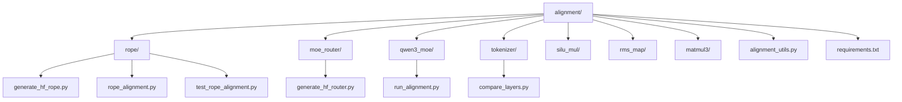
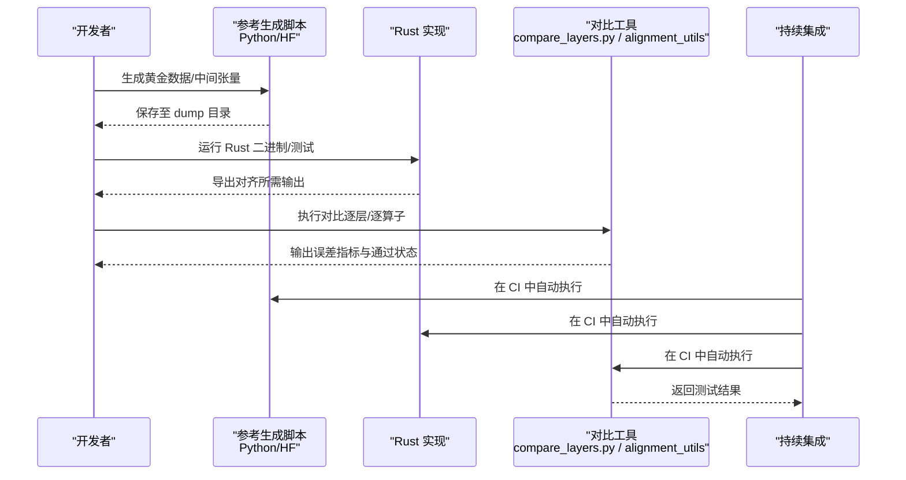
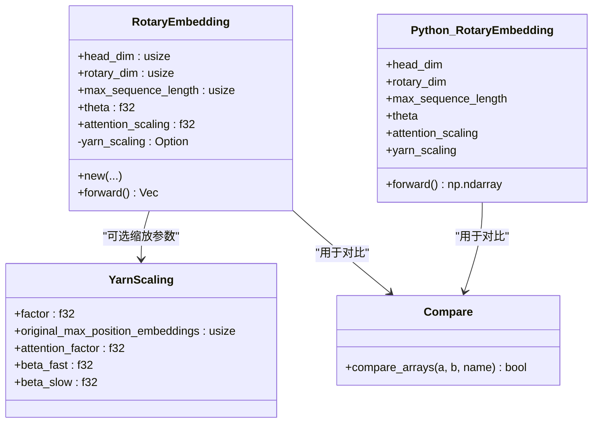
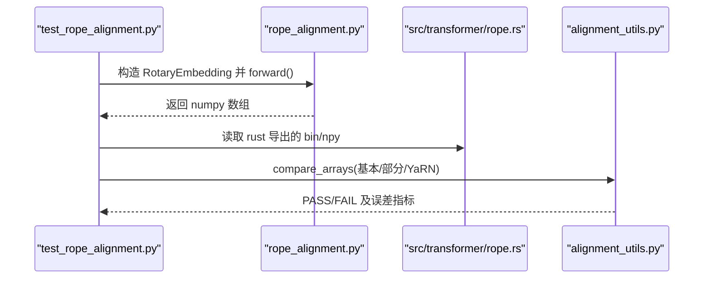
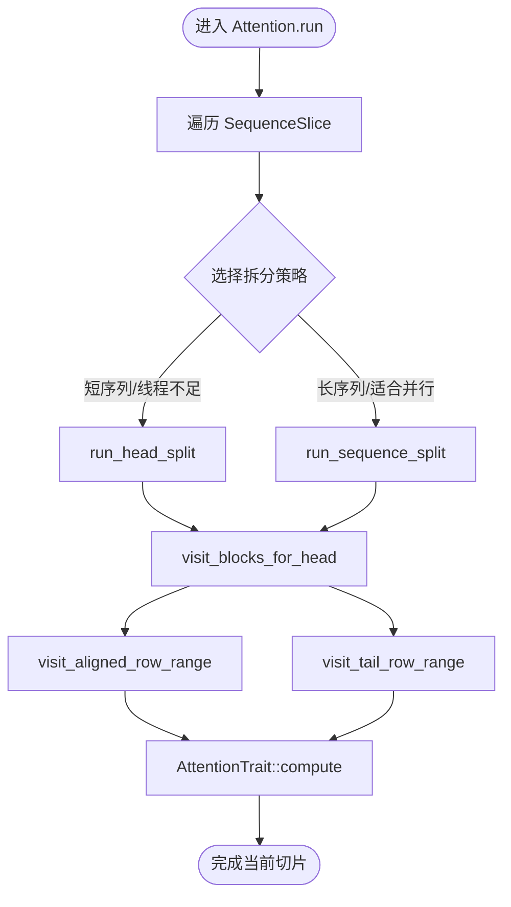
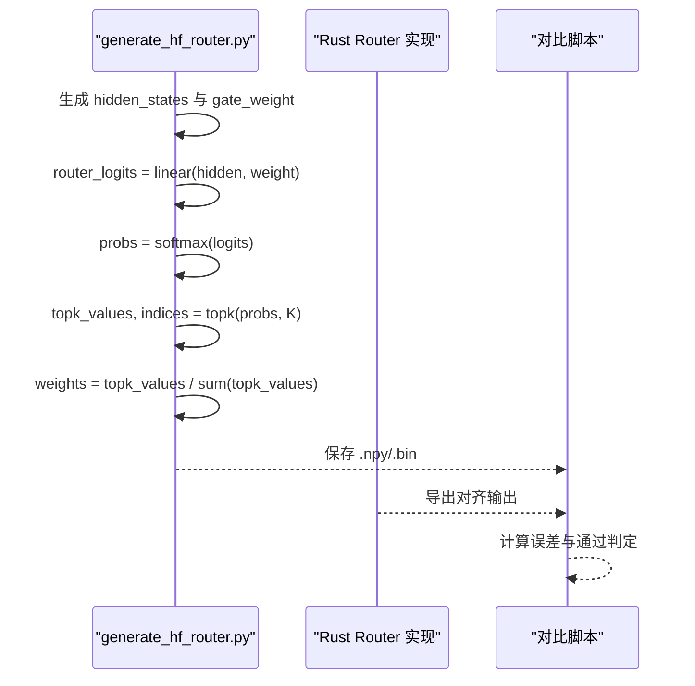
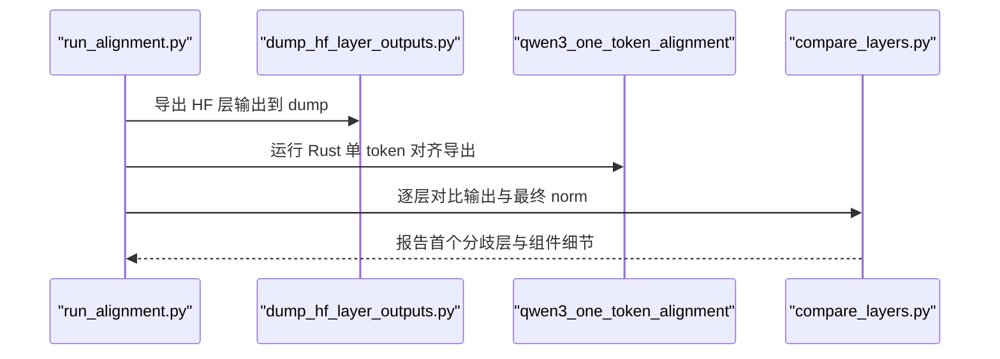
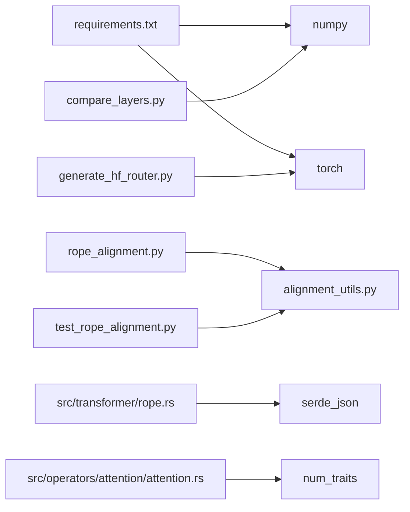

# 对齐测试

<cite>
**本文引用的文件**   
- [alignment/README.md](file://alignment/README.md)
- [alignment/requirements.txt](file://alignment/requirements.txt)
- [alignment/alignment_utils.py](file://alignment/alignment_utils.py)
- [alignment/rope/generate_hf_rope.py](file://alignment/rope/generate_hf_rope.py)
- [alignment/rope/rope_alignment.py](file://alignment/rope/rope_alignment.py)
- [alignment/rope/test_rope_alignment.py](file://alignment/rope/test_rope_alignment.py)
- [src/transformer/rope.rs](file://src/transformer/rope.rs)
- [docs/contributing/hf_alignment.md](file://docs/contributing/hf_alignment.md)
- [alignment/moe_router/generate_hf_router.py](file://alignment/moe_router/generate_hf_router.py)
- [alignment/qwen3_moe/run_alignment.py](file://alignment/qwen3_moe/run_alignment.py)
- [alignment/tokenizer/compare_layers.py](file://alignment/tokenizer/compare_layers.py)
- [src/operators/attention/attention.rs](file://src/operators/attention/attention.rs)
</cite>

## 目录
1. [简介](#简介)
2. [项目结构](#项目结构)
3. [核心组件](#核心组件)
4. [架构总览](#架构总览)
5. [详细组件分析](#详细组件分析)
6. [依赖关系分析](#依赖关系分析)
7. [性能与数值精度考量](#性能与数值精度考量)
8. [故障排查指南](#故障排查指南)
9. [结论](#结论)
10. [附录：脚本使用与CI自动化](#附录脚本使用与ci自动化)

## 简介
本指南面向需要在 Rust 实现与 HuggingFace 风格 Python 参考之间进行“对齐测试”的开发者，覆盖以下目标：
- 如何生成黄金测试用例（Golden Cases）
- 如何执行对比测试并验证数值精度
- RoPE、注意力机制等关键组件的对齐测试实现要点
- 具体脚本使用方法与问题排查技巧
- 对齐测试在持续集成中的作用与自动化配置建议
- 如何处理数值差异与浮点数精度问题

## 项目结构
对齐测试位于 alignment 目录下，按算子/模块划分。每个算子通常包含：
- 参考实现（Python/HF）
- 数据生成脚本（生成输入或黄金输出）
- 对比测试脚本（比较 Python 与 Rust 输出）
- dump 目录（存放中间结果与黄金文件）

图表来源
- [alignment/README.md:1-89](file://alignment/README.md#L1-L89)
- [alignment/requirements.txt:1-3](file://alignment/requirements.txt#L1-L3)

章节来源
- [alignment/README.md:1-89](file://alignment/README.md#L1-L89)
- [alignment/requirements.txt:1-3](file://alignment/requirements.txt#L1-L3)

## 核心组件
- 通用工具
  - compare_arrays：基于绝对误差、平均误差与余弦相似度判定是否通过
  - load_npy/save_npy：Numpy 数组读写
  - get_dump_dir：定位各算子下的 dump 目录
- 参考实现与测试
  - RoPE：Python 参考实现与测试脚本，支持基础 RoPE、部分旋转与 YaRN 缩放
  - MoE Router：基于 PyTorch 的 Qwen3MoE 路由参考流程
  - 层输出对比：将 HF 层输出与 Rust 每层输出逐层比对
- Rust 实现
  - RoPE：频率生成、YaRN 缩放解析与应用、身份尾通道处理
  - Attention：分块访问、行/头拆分策略、掩码与稳定 softmax

章节来源
- [alignment/alignment_utils.py:1-91](file://alignment/alignment_utils.py#L1-L91)
- [alignment/rope/rope_alignment.py:1-173](file://alignment/rope/rope_alignment.py#L1-L173)
- [alignment/rope/test_rope_alignment.py:1-255](file://alignment/rope/test_rope_alignment.py#L1-L255)
- [alignment/moe_router/generate_hf_router.py:1-73](file://alignment/moe_router/generate_hf_router.py#L1-L73)
- [alignment/tokenizer/compare_layers.py:1-171](file://alignment/tokenizer/compare_layers.py#L1-L171)
- [src/transformer/rope.rs:1-305](file://src/transformer/rope.rs#L1-L305)
- [src/operators/attention/attention.rs:1-704](file://src/operators/attention/attention.rs#L1-L704)

## 架构总览
对齐测试的整体流程如下：
- 使用 Python/HF 参考生成黄金数据或中间张量
- 运行 Rust 实现产生对应输出
- 使用对比工具计算误差指标并判定通过/失败
- 对首次出现偏差的层进行细粒度组件拆解对比

图表来源
- [docs/contributing/hf_alignment.md:1-53](file://docs/contributing/hf_alignment.md#L1-L53)
- [alignment/qwen3_moe/run_alignment.py:1-91](file://alignment/qwen3_moe/run_alignment.py#L1-L91)
- [alignment/tokenizer/compare_layers.py:1-171](file://alignment/tokenizer/compare_layers.py#L1-L171)

## 详细组件分析

### RoPE 对齐测试
RoPE 对齐涵盖基础频率生成、部分旋转（identity tail）、以及 YaRN 缩放（含 attention scaling）。

图表来源
- [src/transformer/rope.rs:170-231](file://src/transformer/rope.rs#L170-L231)
- [src/transformer/rope.rs:19-77](file://src/transformer/rope.rs#L19-L77)
- [alignment/rope/rope_alignment.py:63-133](file://alignment/rope/rope_alignment.py#L63-L133)
- [alignment/alignment_utils.py:5-53](file://alignment/alignment_utils.py#L5-L53)

RoPE 对齐流程（序列图）

图表来源
- [alignment/rope/test_rope_alignment.py:179-255](file://alignment/rope/test_rope_alignment.py#L179-L255)
- [alignment/rope/rope_alignment.py:136-173](file://alignment/rope/rope_alignment.py#L136-L173)
- [src/transformer/rope.rs:199-231](file://src/transformer/rope.rs#L199-L231)
- [alignment/alignment_utils.py:5-53](file://alignment/alignment_utils.py#L5-L53)

章节来源
- [src/transformer/rope.rs:1-305](file://src/transformer/rope.rs#L1-L305)
- [alignment/rope/rope_alignment.py:1-173](file://alignment/rope/rope_alignment.py#L1-L173)
- [alignment/rope/test_rope_alignment.py:1-255](file://alignment/rope/test_rope_alignment.py#L1-L255)
- [alignment/alignment_utils.py:1-91](file://alignment/alignment_utils.py#L1-L91)

### 注意力机制对齐测试
注意力对齐关注：
- 行/列分块访问与掩码
- 多头与 KV 头映射
- 稳定 softmax 与数值稳定性

图表来源
- [src/operators/attention/attention.rs:439-505](file://src/operators/attention/attention.rs#L439-L505)
- [src/operators/attention/attention.rs:273-311](file://src/operators/attention/attention.rs#L273-L311)
- [src/operators/attention/attention.rs:157-215](file://src/operators/attention/attention.rs#L157-L215)
- [src/operators/attention/attention.rs:217-270](file://src/operators/attention/attention.rs#L217-L270)

章节来源
- [src/operators/attention/attention.rs:1-704](file://src/operators/attention/attention.rs#L1-L704)

### MoE Router 对齐测试
Qwen3MoE 路由参考流程：线性投影 → 全专家 softmax → Top-K → 归一化。

图表来源
- [alignment/moe_router/generate_hf_router.py:28-73](file://alignment/moe_router/generate_hf_router.py#L28-L73)

章节来源
- [alignment/moe_router/generate_hf_router.py:1-73](file://alignment/moe_router/generate_hf_router.py#L1-L73)

### 层输出对齐（端到端）
从模型配置与 HF 层输出到 Rust 层输出的逐层对比，并在首次分歧处展开组件级对比。

图表来源
- [alignment/qwen3_moe/run_alignment.py:34-91](file://alignment/qwen3_moe/run_alignment.py#L34-L91)
- [alignment/tokenizer/compare_layers.py:49-171](file://alignment/tokenizer/compare_layers.py#L49-L171)

章节来源
- [alignment/qwen3_moe/run_alignment.py:1-91](file://alignment/qwen3_moe/run_alignment.py#L1-L91)
- [alignment/tokenizer/compare_layers.py:1-171](file://alignment/tokenizer/compare_layers.py#L1-L171)

## 依赖关系分析
- Python 侧依赖
  - numpy、torch（用于参考实现与数据生成）
- Rust 侧依赖
  - serde_json（解析 rope_scaling）
  - 自定义 num_traits（类型转换与数学运算）
- 对齐工具
  - alignment_utils.py 提供统一的 compare_arrays 接口
  - compare_layers.py 负责逐层对比与诊断

图表来源
- [alignment/requirements.txt:1-3](file://alignment/requirements.txt#L1-L3)
- [alignment/alignment_utils.py:1-91](file://alignment/alignment_utils.py#L1-L91)
- [alignment/rope/rope_alignment.py:1-173](file://alignment/rope/rope_alignment.py#L1-L173)
- [alignment/rope/test_rope_alignment.py:1-255](file://alignment/rope/test_rope_alignment.py#L1-L255)
- [alignment/moe_router/generate_hf_router.py:1-73](file://alignment/moe_router/generate_hf_router.py#L1-L73)
- [alignment/tokenizer/compare_layers.py:1-171](file://alignment/tokenizer/compare_layers.py#L1-L171)
- [src/transformer/rope.rs:1-305](file://src/transformer/rope.rs#L1-L305)
- [src/operators/attention/attention.rs:1-704](file://src/operators/attention/attention.rs#L1-L704)

章节来源
- [alignment/requirements.txt:1-3](file://alignment/requirements.txt#L1-L3)
- [alignment/alignment_utils.py:1-91](file://alignment/alignment_utils.py#L1-L91)
- [src/transformer/rope.rs:1-305](file://src/transformer/rope.rs#L1-L305)
- [src/operators/attention/attention.rs:1-704](file://src/operators/attention/attention.rs#L1-L704)

## 性能与数值精度考量
- 数值稳定性
  - 注意力 softmax 采用先减去最大值再 exp 的稳定形式，避免溢出
  - RoPE 的 attention_scaling 由 YaRN 配置决定，需与参考一致
- 精度阈值
  - compare_arrays 默认使用 max_abs < 1e-5、mean_abs < 1e-6、cosine > 0.999999
  - compare_layers.py 使用 cosine > 0.9999 作为层输出通过标准
- 数据类型
  - 参考实现建议使用 FP32 以减小随机性；Rust 侧可能使用 FP16/FP32 混合，需注意转换误差
- 并行与分块
  - Attention 的行/头拆分与分块访问会影响累加顺序，可能导致微小差异

[本节为通用指导，不直接分析具体文件]

## 故障排查指南
- 常见问题
  - 形状不一致：检查输入维度与 head_dim/rotary_dim 配置
  - 首次分歧层定位：使用 compare_layers.py 的输出，查看该层前后组件（post_input_norm、attn_residual、post_attn_norm、mlp_output）
  - YaRN 缩放未生效：确认 rope_scaling 字段名与值（如 attention_factor/attn_factor）
- 调试步骤
  - 单独运行参考生成脚本，确认黄金数据正确
  - 单独运行 Rust 导出，确认输出路径与格式
  - 降低对比阈值临时放宽，逐步收紧定位问题范围
  - 打印前若干元素对比，快速定位异常位置

章节来源
- [alignment/tokenizer/compare_layers.py:107-171](file://alignment/tokenizer/compare_layers.py#L107-L171)
- [src/transformer/rope.rs:27-77](file://src/transformer/rope.rs#L27-L77)
- [alignment/rope/test_rope_alignment.py:145-177](file://alignment/rope/test_rope_alignment.py#L145-L177)

## 结论
通过对齐测试，可以在算子与层级别确保 Rust 实现与 HuggingFace 风格参考的一致性。RoPE 与注意力是重点对齐点，配合逐层对比与组件级诊断，可高效定位数值差异与实现偏差。建议在 CI 中固化对齐流程，保证每次变更的可复现性与回归保护。

[本节为总结，不直接分析具体文件]

## 附录：脚本使用与CI自动化

### 环境准备
- 安装 Python 依赖
  - 使用 requirements.txt 安装 numpy 与 torch

章节来源
- [alignment/README.md:5-10](file://alignment/README.md#L5-L10)
- [alignment/requirements.txt:1-3](file://alignment/requirements.txt#L1-L3)

### 生成黄金测试用例
- RoPE
  - 运行 generate_hf_rope.py 生成 hf_rope_output*.npy
  - 或使用 rope_alignment.py 生成 hf_rope_basic/partial/yarn.npy
- MoE Router
  - 运行 generate_hf_router.py 生成 ref_hidden_states/ref_gate_weight/ref_router_* 等文件
- 层输出
  - 使用 run_alignment.py 调用 dump_hf_layer_outputs.py 导出 HF 层输出

章节来源
- [alignment/rope/generate_hf_rope.py:43-110](file://alignment/rope/generate_hf_rope.py#L43-L110)
- [alignment/rope/rope_alignment.py:136-173](file://alignment/rope/rope_alignment.py#L136-L173)
- [alignment/moe_router/generate_hf_router.py:28-73](file://alignment/moe_router/generate_hf_router.py#L28-L73)
- [alignment/qwen3_moe/run_alignment.py:54-62](file://alignment/qwen3_moe/run_alignment.py#L54-L62)

### 执行对比测试
- RoPE
  - 运行 test_rope_alignment.py，自动加载 Python 与 Rust 输出并对比
- 层输出
  - 运行 compare_layers.py，逐层对比并报告首个分歧层与组件细节

章节来源
- [alignment/rope/test_rope_alignment.py:179-255](file://alignment/rope/test_rope_alignment.py#L179-L255)
- [alignment/tokenizer/compare_layers.py:49-171](file://alignment/tokenizer/compare_layers.py#L49-L171)

### 处理数值差异与浮点精度
- 调整阈值：在 compare_arrays 或 compare_layers.py 中适当放宽/收紧误差标准
- 统一数据类型：参考实现尽量使用 FP32，Rust 侧注意 f16/f32 转换
- 固定随机种子：参考生成脚本中设置 seed，保证可复现

章节来源
- [alignment/alignment_utils.py:43-53](file://alignment/alignment_utils.py#L43-L53)
- [alignment/tokenizer/compare_layers.py:23-33](file://alignment/tokenizer/compare_layers.py#L23-L33)
- [alignment/moe_router/generate_hf_router.py:29-35](file://alignment/moe_router/generate_hf_router.py#L29-L35)

### 在持续集成中的作用与自动化配置
- 作用
  - 在每次提交/合并请求时自动运行对齐测试，防止回归
  - 缓存黄金数据与依赖，提升构建速度
- 建议步骤
  - 在 CI 中安装 Python 依赖
  - 执行参考生成脚本（必要时跳过已有黄金数据）
  - 编译并运行 Rust 对齐二进制/测试
  - 执行对比脚本并收集日志与错误信息
  - 失败时保留 dump 目录以便人工排查

章节来源
- [docs/contributing/hf_alignment.md:1-53](file://docs/contributing/hf_alignment.md#L1-L53)
- [alignment/qwen3_moe/run_alignment.py:34-91](file://alignment/qwen3_moe/run_alignment.py#L34-L91)