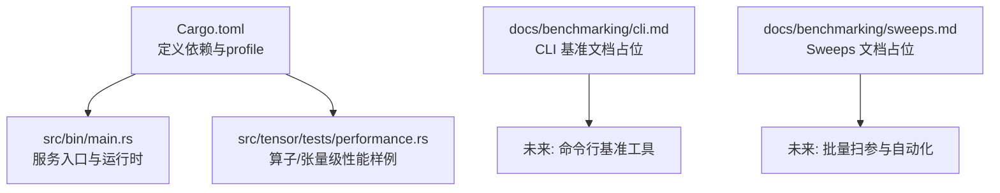
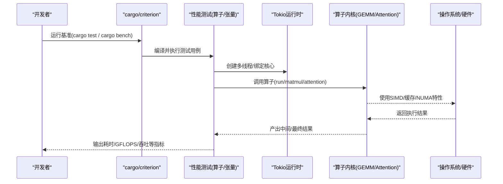
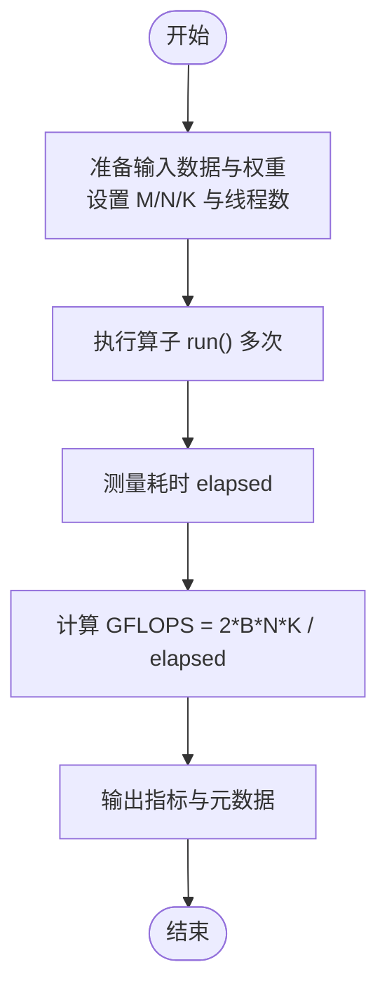
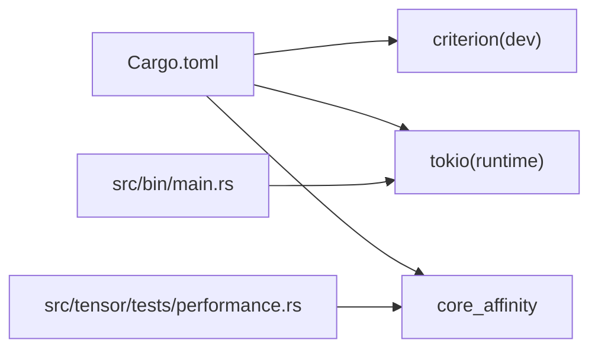

# 性能基准测试

<cite>
**本文引用的文件**   
- [README.md](file://README.md)
- [Cargo.toml](file://Cargo.toml)
- [src/bin/main.rs](file://src/bin/main.rs)
- [src/tensor/tests/performance.rs](file://src/tensor/tests/performance.rs)
- [docs/benchmarking/cli.md](file://docs/benchmarking/cli.md)
- [docs/benchmarking/sweeps.md](file://docs/benchmarking/sweeps.md)
</cite>

## 目录
1. [简介](#简介)
2. [项目结构](#项目结构)
3. [核心组件](#核心组件)
4. [架构总览](#架构总览)
5. [详细组件分析](#详细组件分析)
6. [依赖分析](#依赖分析)
7. [性能考量](#性能考量)
8. [故障排查指南](#故障排查指南)
9. [结论](#结论)
10. [附录](#附录)

## 简介
本指南面向希望在 eLLM 上开展系统化性能基准测试的工程师与研究者，覆盖以下目标：
- 如何编写有意义的基准用例（算子级、张量级、端到端）
- 如何执行基准并收集关键指标（延迟、吞吐、内存、CPU 利用率）
- 如何设计回归检测策略与解读报告
- 如何在不同硬件平台上进行对比与调优

eLLM 专注于 CPU 推理场景，强调低延迟、高吞吐与长上下文能力。其设计在 Prefill/Decode 阶段具有不同的瓶颈特征，基准设计需据此分层展开。

## 项目结构
仓库中与基准相关的关键位置包括：
- 配置与构建：Cargo.toml 中定义了 release/dev profile 与 dev-dependencies（含 criterion），以及二进制入口 main.rs
- 基准示例：src/tensor/tests/performance.rs 包含一个可忽略的性能测试样例，演示了并行执行与 GFLOPS 统计
- 文档占位：docs/benchmarking/cli.md 与 docs/benchmarking/sweeps.md 为后续 CLI 与自动化扫描的预留文档

图表来源
- [Cargo.toml:69-102](file://Cargo.toml#L69-L102)
- [src/bin/main.rs:1-41](file://src/bin/main.rs#L1-L41)
- [src/tensor/tests/performance.rs:307-388](file://src/tensor/tests/performance.rs#L307-L388)
- [docs/benchmarking/cli.md:1-5](file://docs/benchmarking/cli.md#L1-L5)
- [docs/benchmarking/sweeps.md:1-5](file://docs/benchmarking/sweeps.md#L1-L5)

章节来源
- [Cargo.toml:69-102](file://Cargo.toml#L69-L102)
- [src/bin/main.rs:1-41](file://src/bin/main.rs#L1-L41)
- [src/tensor/tests/performance.rs:307-388](file://src/tensor/tests/performance.rs#L307-L388)
- [docs/benchmarking/cli.md:1-5](file://docs/benchmarking/cli.md#L1-L5)
- [docs/benchmarking/sweeps.md:1-5](file://docs/benchmarking/sweeps.md#L1-L5)

## 核心组件
- 构建与运行环境
  - release profile 开启 LTO、单 codegen unit、strip 等优化，适合发布与基准
  - dev-dependencies 引入 criterion，可用于生成 HTML 报告
- 服务入口
  - main.rs 解析 CLI、初始化运行时与调度资源，启动 tokio 多线程运行时
- 性能样例
  - performance.rs 中的忽略测试展示了：
    - 基于 core_affinity 的线程绑定
    - 算子并行执行
    - GFLOPS 计算与打印

章节来源
- [Cargo.toml:69-102](file://Cargo.toml#L69-L102)
- [src/bin/main.rs:1-41](file://src/bin/main.rs#L1-L41)
- [src/tensor/tests/performance.rs:307-388](file://src/tensor/tests/performance.rs#L307-L388)

## 架构总览
下图展示从“基准驱动”到“内核执行”的主要路径，便于理解在不同层级采集指标的切入点。

图表来源
- [src/bin/main.rs:1-41](file://src/bin/main.rs#L1-L41)
- [src/tensor/tests/performance.rs:307-388](file://src/tensor/tests/performance.rs#L307-L388)
- [Cargo.toml:69-102](file://Cargo.toml#L69-L102)

## 详细组件分析

### 算子级基准（GEMM 为例）
- 目标
  - 评估矩阵乘在内核层面的峰值算力与扩展性
  - 验证并行度选择与 tile/block 参数对吞吐的影响
- 参考实现
  - 参见 src/tensor/tests/performance.rs 中的忽略测试，演示了：
    - 线程数选择与 panel_threads 的关系
    - GFLOPS 计算公式：2 × batch × N × K / elapsed
- 建议实践
  - 固定输入规模（M/N/K）与数据类型（f16/f32）
  - 多次重复取中位数/分位数，避免抖动
  - 记录线程数、core affinity、NUMA 节点信息
  - 结合 perf/pmu 或系统监控观察缓存命中率与带宽占用

图表来源
- [src/tensor/tests/performance.rs:307-388](file://src/tensor/tests/performance.rs#L307-L388)

章节来源
- [src/tensor/tests/performance.rs:307-388](file://src/tensor/tests/performance.rs#L307-L388)

### 张量级基准（Tensor.matmul）
- 目标
  - 在更贴近上层 API 的层面评估端到端算子链路与内存复用效果
- 参考实现
  - 同上性能样例，通过 Tensor.matmul 构造 Operator 队列并执行
- 建议实践
  - 关注内存池分配与复用（减少碎片与分配开销）
  - 对比不同 batch 与 sequence chunk size 下的吞吐变化
  - 记录队列长度与算子类型，确保路径正确

章节来源
- [src/tensor/tests/performance.rs:307-388](file://src/tensor/tests/performance.rs#L307-L388)

### 端到端基准（Prefill/Decode）
- 目标
  - 评估真实工作负载下的 TTFT（首 token 时延）、TPOT（每 token 时延）、QPS/吞吐
- 方法
  - 短上下文 Decode：固定 prompt_len，逐步增大以观察线性增长趋势
  - 长上下文 Prefill：大序列一次性处理，关注参数与 KV 加载、调度同步成本
- 参考背景
  - README 中对短/长上下文实验设计与结论有详细说明，可作为指标口径与基线参考

章节来源
- [README.md:92-129](file://README.md#L92-L129)
- [README.md:130-183](file://README.md#L130-L183)

### 命令行为基准（CLI）与 Sweeps
- 现状
  - docs/benchmarking/cli.md 与 docs/benchmarking/sweeps.md 为占位文档，尚未提供具体命令
- 规划建议
  - CLI：封装常用场景（短/长上下文、不同 batch/seq len、不同线程数）
  - Sweeps：参数网格搜索 + 自动记录指标 + 生成报告

章节来源
- [docs/benchmarking/cli.md:1-5](file://docs/benchmarking/cli.md#L1-L5)
- [docs/benchmarking/sweeps.md:1-5](file://docs/benchmarking/sweeps.md#L1-L5)

## 依赖分析
- 构建与基准工具
  - criterion（dev-dependencies）用于生成 HTML 报告
  - release profile 启用 fat LTO、单 codegen unit、strip 等，利于获得稳定且高性能的基准结果
- 运行时
  - tokio 多线程运行时由 main.rs 创建，worker_threads 与 blocking_threads 可调
- 外部库
  - core_affinity 用于线程绑核，有助于降低跨 NUMA/跨核迁移带来的抖动

图表来源
- [Cargo.toml:69-102](file://Cargo.toml#L69-L102)
- [src/bin/main.rs:1-41](file://src/bin/main.rs#L1-L41)
- [src/tensor/tests/performance.rs:307-388](file://src/tensor/tests/performance.rs#L307-L388)

章节来源
- [Cargo.toml:69-102](file://Cargo.toml#L69-L102)
- [src/bin/main.rs:1-41](file://src/bin/main.rs#L1-L41)
- [src/tensor/tests/performance.rs:307-388](file://src/tensor/tests/performance.rs#L307-L388)

## 性能考量
- 指标体系
  - 延迟：TTFT、TPOT、P50/P95/P99
  - 吞吐：QPS、tokens/s、GFLOPS
  - 资源：CPU 利用率、内存峰值/常驻、缓存命中率、内存带宽
- 平台差异
  - CPU 型号与 SIMD 支持（如 AVX512FP16）显著影响算子性能
  - NUMA 拓扑与线程绑核会影响跨节点访问与缓存局部性
- 调优方向
  - 合理选择线程数与 panel_threads，避免过度并行导致争用
  - 保持连续访存与块化（tiling）以提升缓存命中
  - 复用中间缓冲与 KV 缓存，减少分配与碎片

[本节为通用指导，不直接分析具体文件]

## 故障排查指南
- 常见现象
  - 基准结果波动大：检查是否未固定线程数/未绑核；确认 release profile
  - 无法复现峰值：确认 SIMD 特性可用（如 AVX512FP16）
  - 内存泄漏/峰值异常：关注内存池与临时张量复用
- 定位手段
  - 使用 criterion 生成 HTML 报告，比较分布与方差
  - 结合系统工具（perf、top、htop、numastat、vmstat）观察 CPU/内存/NUMA
  - 在关键路径插入轻量日志（仅调试模式），避免污染基准

章节来源
- [Cargo.toml:69-102](file://Cargo.toml#L69-L102)
- [src/tensor/tests/performance.rs:307-388](file://src/tensor/tests/performance.rs#L307-L388)

## 结论
- 建议在算子、张量、端到端三层分别建立基准，形成可追溯的指标体系
- 利用现有样例作为起点，逐步完善 CLI 与 Sweeps 工具链
- 结合硬件特性（SIMD、NUMA、缓存）进行针对性调优，并以回归检测保障稳定性

[本节为总结，不直接分析具体文件]

## 附录

### 基准执行清单（建议）
- 环境准备
  - 使用 release profile 构建
  - 固定线程数与绑核策略
  - 预热与多次重复采样
- 指标采集
  - 延迟：TTFT、TPOT、P50/P95/P99
  - 吞吐：QPS、tokens/s、GFLOPS
  - 资源：CPU%、内存峰值、缓存命中率、带宽
- 报告与回归
  - 使用 criterion 生成 HTML 报告
  - 设定阈值（如 P95 延迟上升 > X%）触发告警
  - 保存元数据（模型、批大小、序列长度、线程数、NUMA、SIMD 特性）

[本节为操作建议，不直接分析具体文件]