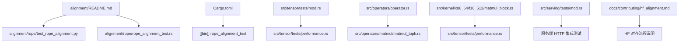
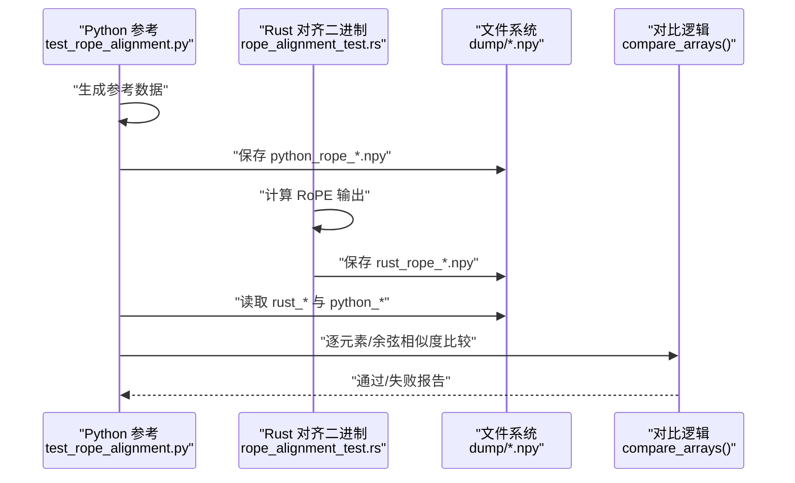
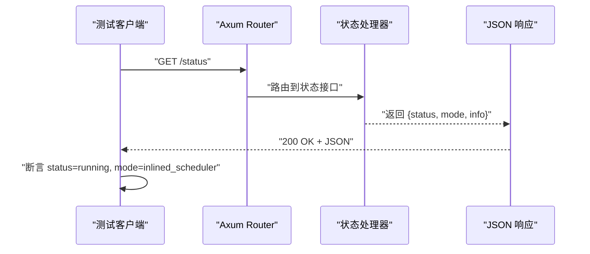
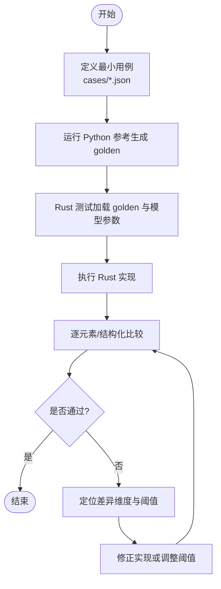
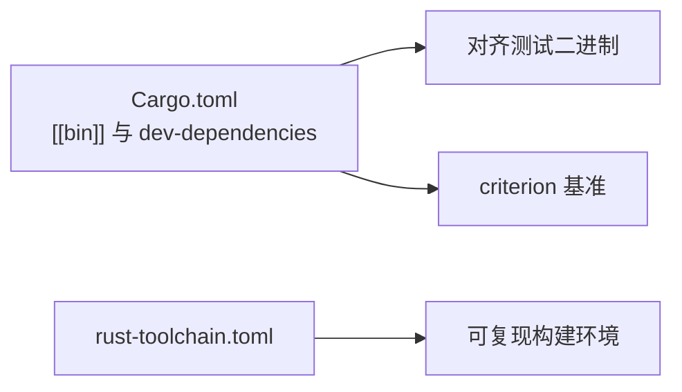

# 测试与验证

<cite>
**本文引用的文件**   
- [alignment/README.md](file://alignment/README.md)
- [alignment/requirements.txt](file://alignment/requirements.txt)
- [alignment/rope/test_rope_alignment.py](file://alignment/rope/test_rope_alignment.py)
- [alignment/rope/rope_alignment_test.rs](file://alignment/rope/rope_alignment_test.rs)
- [Cargo.toml](file://Cargo.toml)
- [docs/contributing/hf_alignment.md](file://docs/contributing/hf_alignment.md)
- [src/tensor/tests/mod.rs](file://src/tensor/tests/mod.rs)
- [src/tensor/tests/performance.rs](file://src/tensor/tests/performance.rs)
- [src/operators/operator.rs](file://src/operators/operator.rs)
- [src/operators/matmul/matmul_topk.rs](file://src/operators/matmul/matmul_topk.rs)
- [src/kernel/x86_64/f16_512/matmul_block.rs](file://src/kernel/x86_64/f16_512/matmul_block.rs)
- [src/serving/tests/mod.rs](file://src/serving/tests/mod.rs)
- [src/rust-toolchain.toml](file://rust-toolchain.toml)
</cite>

## 目录
1. [简介](#简介)
2. [项目结构](#项目结构)
3. [核心组件](#核心组件)
4. [架构总览](#架构总览)
5. [详细组件分析](#详细组件分析)
6. [依赖分析](#依赖分析)
7. [性能考虑](#性能考虑)
8. [故障排查指南](#故障排查指南)
9. [结论](#结论)
10. [附录](#附录)

## 简介
本指南面向贡献者与使用者，系统化说明 eLLM 的测试与验证体系，包括：
- 单元测试编写规范与最佳实践
- 集成测试的设计与实现方法
- 与 HuggingFace 对齐的测试框架与流程
- 性能基准测试的编写与执行
- 错误处理与异常场景的覆盖策略
- 持续集成中的自动化测试配置与结果分析建议

目标是帮助读者快速建立可维护、可复现、可扩展的测试体系，确保算子、运行时与服务端行为正确且高效。

## 项目结构
仓库采用“按功能域组织”的结构，测试代码分布在多个模块中：
- alignment：算子对齐测试（Python 参考 + Rust 二进制输出对比）
- src/**/tests：Rust 单元测试与集成测试
- docs：文档与贡献指南（含 HF 对齐说明与 CI 说明）
- Cargo.toml：定义对齐测试二进制目标与 dev-dependencies（如 criterion）

图表来源
- [alignment/README.md:1-89](file://alignment/README.md#L1-L89)
- [alignment/rope/test_rope_alignment.py:1-255](file://alignment/rope/test_rope_alignment.py#L1-L255)
- [alignment/rope/rope_alignment_test.rs:1-47](file://alignment/rope/rope_alignment_test.rs#L1-L47)
- [Cargo.toml:10-41](file://Cargo.toml#L10-L41)
- [src/tensor/tests/mod.rs:1-25](file://src/tensor/tests/mod.rs#L1-L25)
- [src/tensor/tests/performance.rs:1-388](file://src/tensor/tests/performance.rs#L1-L388)
- [src/operators/operator.rs:1417-1749](file://src/operators/operator.rs#L1417-L1749)
- [src/operators/matmul/matmul_topk.rs:810-858](file://src/operators/matmul/matmul_topk.rs#L810-L858)
- [src/kernel/x86_64/f16_512/matmul_block.rs:213-235](file://src/kernel/x86_64/f16_512/matmul_block.rs#L213-L235)
- [src/serving/tests/mod.rs:1-50](file://src/serving/tests/mod.rs#L1-L50)
- [docs/contributing/hf_alignment.md:1-53](file://docs/contributing/hf_alignment.md#L1-L53)

章节来源
- [alignment/README.md:1-89](file://alignment/README.md#L1-L89)
- [Cargo.toml:10-41](file://Cargo.toml#L10-L41)
- [src/tensor/tests/mod.rs:1-25](file://src/tensor/tests/mod.rs#L1-L25)

## 核心组件
- 算子对齐测试（RoPE 示例）
  - Python 参考实现生成 golden 数据；Rust 二进制输出对应结果；脚本进行数值比较与报告。
  - 关键路径：
    - Python 参考与对比：[alignment/rope/test_rope_alignment.py:1-255](file://alignment/rope/test_rope_alignment.py#L1-L255)
    - Rust 对齐二进制：[alignment/rope/rope_alignment_test.rs:1-47](file://alignment/rope/rope_alignment_test.rs#L1-L47)
    - 构建目标声明：[Cargo.toml:10-41](file://Cargo.toml#L10-L41)
- 单元测试与集成测试
  - tensor 层：矩阵乘、TopK Softmax、专家路由等单元与性能用例。
  - operators 层：算子接口与具体实现的断言与边界条件。
  - serving 层：HTTP 接口状态与错误处理。
- 性能基准
  - 使用 criterion 作为基准框架（dev-dependencies），并在 tensor 性能用例中提供并行执行与 GFLOPs 统计示例。

章节来源
- [alignment/rope/test_rope_alignment.py:1-255](file://alignment/rope/test_rope_alignment.py#L1-L255)
- [alignment/rope/rope_alignment_test.rs:1-47](file://alignment/rope/rope_alignment_test.rs#L1-L47)
- [Cargo.toml:85-92](file://Cargo.toml#L85-L92)
- [src/tensor/tests/performance.rs:1-388](file://src/tensor/tests/performance.rs#L1-L388)
- [src/operators/operator.rs:1417-1749](file://src/operators/operator.rs#L1417-L1749)
- [src/serving/tests/mod.rs:1-50](file://src/serving/tests/mod.rs#L1-L50)

## 架构总览
下图展示“Python 参考 → Rust 实现 → 对比脚本”的对齐闭环，以及 Rust 内部测试与基准的层次关系。

图表来源
- [alignment/rope/test_rope_alignment.py:145-176](file://alignment/rope/test_rope_alignment.py#L145-L176)
- [alignment/rope/rope_alignment_test.rs:8-46](file://alignment/rope/rope_alignment_test.rs#L8-L46)

## 详细组件分析

### 单元测试编写规范与最佳实践
- 命名与组织
  - 将测试置于模块内 #[cfg(test)] 或 tests 子模块，保持高内聚。
  - 使用具名测试函数，描述输入与期望行为。
- 断言策略
  - 浮点比较优先使用 ULP/相对误差断言，避免绝对误差导致的平台差异。
  - 对 TopK/Softmax 等数值敏感算子，需显式构造“易判定的输入模式”，便于定位偏差。
- 硬件特性开关
  - 针对 AVX512FP16 等特性，使用运行时检测并跳过不满足条件的用例，保证跨平台稳定。
- 并发与线程
  - 多线程算子测试应覆盖不同 thread_num/thread_id 组合，验证幂等性与一致性。
- 资源管理
  - 大对象使用内存池或临时文件清理，避免污染后续用例。

章节来源
- [src/tensor/tests/mod.rs:1-25](file://src/tensor/tests/mod.rs#L1-L25)
- [src/operators/operator.rs:1417-1749](file://src/operators/operator.rs#L1417-L1749)
- [src/operators/matmul/matmul_topk.rs:810-858](file://src/operators/matmul/matmul_topk.rs#L810-L858)
- [src/kernel/x86_64/f16_512/matmul_block.rs:213-235](file://src/kernel/x86_64/f16_512/matmul_block.rs#L213-L235)

### 集成测试设计与实现
- 运行时与调度器
  - 在 runtime/tests 下组织会话生命周期、调度器集成、批处理增量等端到端场景。
- 服务层 HTTP 集成
  - 使用异步请求模拟客户端，校验状态码、响应体字段与错误分支。
- 典型流程（以 /status 为例）
  - 启动测试路由器 → 发送 GET /status → 断言 200 与 JSON 字段。

图表来源
- [src/serving/tests/mod.rs:11-31](file://src/serving/tests/mod.rs#L11-L31)

章节来源
- [src/serving/tests/mod.rs:1-50](file://src/serving/tests/mod.rs#L1-L50)

### 与 HuggingFace 的对齐测试框架与验证流程
- 目标
  - 以 Python 参考为“金标准”，生成小样本 golden 数据，Rust 侧加载相同输入并比对输出。
- 推荐顺序
  - 在 cases 中描述最小用例 → 用 Python 参考生成 golden → Rust 测试加载并比较。
- 当前 RoPE 参考
  - 频率生成、部分旋转尾部、YaRN 缩放解析与注意力缩放均与 Python 参考一致。
- 输出格式
  - JSON 包含 head_dim、rotary_dim、max_sequence_length、theta、attention_scaling、values 等字段。
- 生成 golden 文件
  - 提供 PowerShell 脚本或直接调用 Python 参考脚本生成。

图表来源
- [docs/contributing/hf_alignment.md:1-53](file://docs/contributing/hf_alignment.md#L1-L53)

章节来源
- [docs/contributing/hf_alignment.md:1-53](file://docs/contributing/hf_alignment.md#L1-L53)

### 性能基准测试的编写与执行
- 框架选择
  - 使用 criterion（dev-dependencies）进行基准测试，支持 HTML 报告。
- 编写要点
  - 固定输入规模与随机种子，隔离外部 IO。
  - 多核并行时记录线程数与面板线程数，统计 GFLOPs。
  - 使用 ignore 标记长耗时用例，按需启用。
- 执行方式
  - 使用 cargo bench 运行基准；结合 --bench 指定目标。
  - 在本地开启 feature 或 target-feature 以评估特定优化路径。

章节来源
- [Cargo.toml:85-92](file://Cargo.toml#L85-L92)
- [src/tensor/tests/performance.rs:308-388](file://src/tensor/tests/performance.rs#L308-L388)

### 错误处理与异常情况的测试覆盖
- 常见场景
  - 非法 JSON 请求 → 返回 400 Bad Request。
  - 缺失必填字段 → 返回明确错误信息。
  - 内存池严格模式尺寸不匹配 → 触发 panic 或错误返回（依实现）。
- 设计建议
  - 为每个错误分支编写最小用例，断言状态码与消息关键字。
  - 对数值溢出/无穷大/NaN 等边界值进行覆盖。

章节来源
- [src/serving/tests/mod.rs:33-47](file://src/serving/tests/mod.rs#L33-L47)

## 依赖分析
- 构建与运行
  - 对齐测试二进制由 Cargo.toml 的 [[bin]] 声明驱动。
  - 开发期依赖 criterion、approx、tempfile、tower、hyper 等用于测试与基准。
- 工具链
  - rust-toolchain.toml 锁定工具链版本，保障可复现性。

图表来源
- [Cargo.toml:10-41](file://Cargo.toml#L10-L41)
- [Cargo.toml:85-92](file://Cargo.toml#L85-L92)
- [rust-toolchain.toml](file://rust-toolchain.toml)

章节来源
- [Cargo.toml:10-41](file://Cargo.toml#L10-L41)
- [Cargo.toml:85-92](file://Cargo.toml#L85-L92)
- [rust-toolchain.toml](file://rust-toolchain.toml)

## 性能考虑
- 算子级
  - 针对 MatMul/TopK/Softmax 等热点路径，优先使用 ULP/相对误差断言，避免过度严格的绝对误差导致误报。
  - 利用 panel_threads 与可用 CPU 数动态决定并行度，避免超分。
- 系统级
  - 基准测试应关闭无关后台进程，固定电源计划与 CPU 频率。
  - 多次运行取中位数，减少抖动影响。
- 可观测性
  - 打印 GFLOPs、线程数、延迟分布，便于回归分析。

## 故障排查指南
- 对齐测试失败
  - 检查 Python 参考与 Rust 输出的形状与数据类型是否一致。
  - 逐步缩小输入规模，定位差异维度。
  - 确认 attention_scaling 与 YaRN 参数解析是否与参考一致。
- 基准不稳定
  - 增加 warmup 轮次，排除冷启动影响。
  - 固定线程亲和与 NUMA 拓扑，减少缓存抖动。
- 服务层错误
  - 捕获请求体解析失败的日志，核对 Content-Type 与 JSON 结构。
  - 对缺失字段返回明确的错误码与提示。

章节来源
- [alignment/rope/test_rope_alignment.py:145-176](file://alignment/rope/test_rope_alignment.py#L145-L176)
- [src/serving/tests/mod.rs:33-47](file://src/serving/tests/mod.rs#L33-L47)

## 结论
eLLM 的测试与验证体系围绕“算子对齐 + 单元/集成测试 + 基准”三层展开。通过 Python 参考与 Rust 实现的端到端对齐、完善的数值断言与硬件特性开关、以及基于 criterion 的性能基准，能够保障正确性与性能的可控演进。建议在 CI 中固化这些步骤，形成自动化的质量门禁。

## 附录
- 快速上手
  - 安装 Python 依赖：见 requirements.txt。
  - 运行 RoPE 对齐测试：先执行 Rust 对齐二进制生成 dump，再运行 Python 对比脚本。
- 相关文档
  - HF 对齐参考：docs/contributing/hf_alignment.md
  - CI 说明：docs/contributing/ci/index.md（占位，待完善）

章节来源
- [alignment/requirements.txt:1-3](file://alignment/requirements.txt#L1-L3)
- [alignment/rope/test_rope_alignment.py:179-255](file://alignment/rope/test_rope_alignment.py#L179-L255)
- [docs/contributing/hf_alignment.md:1-53](file://docs/contributing/hf_alignment.md#L1-L53)