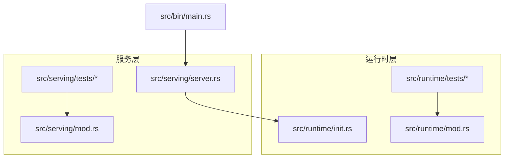
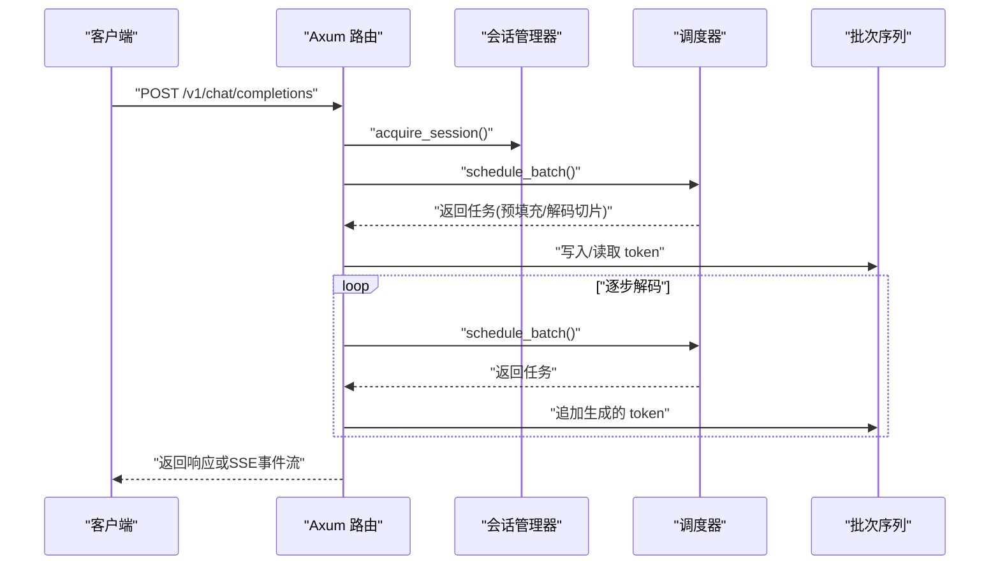
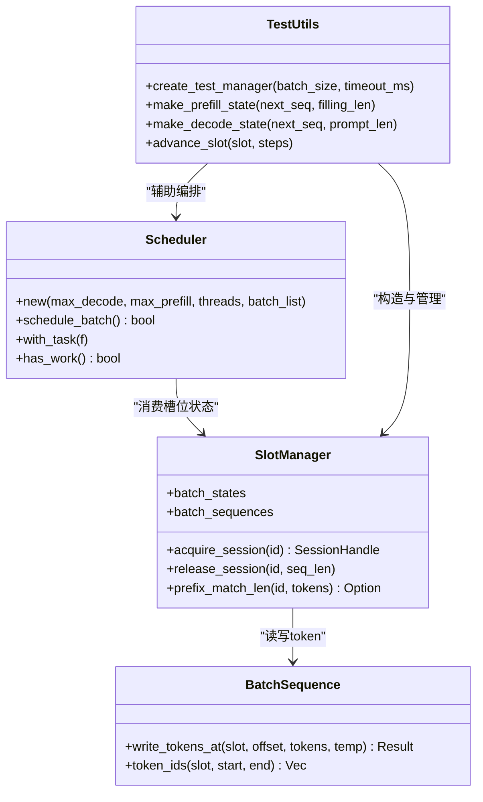
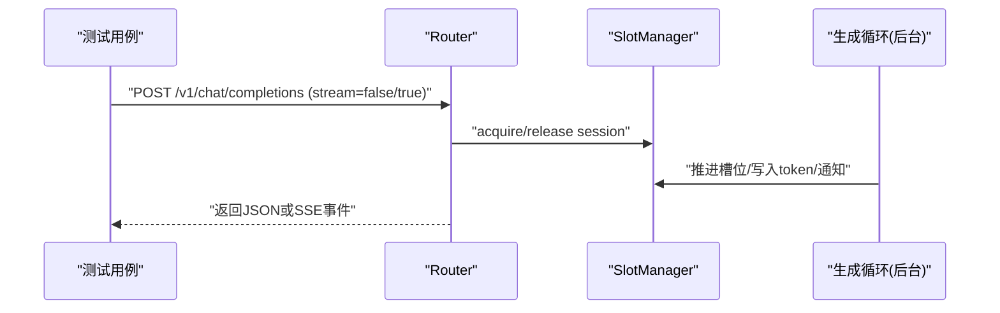
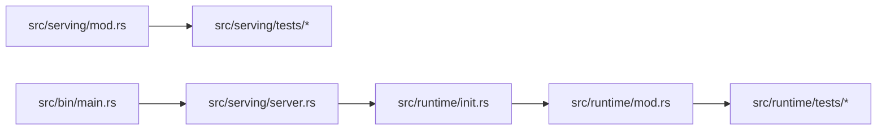

# 集成测试

<cite>
**本文引用的文件**   
- [src/runtime/tests/mod.rs](file://src/runtime/tests/mod.rs)
- [src/runtime/tests/test_utils.rs](file://src/runtime/tests/test_utils.rs)
- [src/runtime/tests/session_lifecycle_tests.rs](file://src/runtime/tests/session_lifecycle_tests.rs)
- [src/runtime/tests/scheduler_integration_tests.rs](file://src/runtime/tests/scheduler_integration_tests.rs)
- [src/runtime/tests/batch_delta_tests.rs](file://src/runtime/tests/batch_delta_tests.rs)
- [src/runtime/tests/scenario_tests.rs](file://src/runtime/tests/scenario_tests.rs)
- [src/serving/tests/mod.rs](file://src/serving/tests/mod.rs)
- [src/serving/tests/test_utils.rs](file://src/serving/tests/test_utils.rs)
- [src/serving/tests/syn_flow_test.rs](file://src/serving/tests/syn_flow_test.rs)
- [src/serving/tests/stream_flow_test.rs](file://src/serving/tests/stream_flow_test.rs)
- [src/runtime/mod.rs](file://src/runtime/mod.rs)
- [src/serving/mod.rs](file://src/serving/mod.rs)
- [src/bin/main.rs](file://src/bin/main.rs)
- [src/runtime/init.rs](file://src/runtime/init.rs)
- [src/serving/server.rs](file://src/serving/server.rs)
</cite>

## 目录
1. [简介](#简介)
2. [项目结构](#项目结构)
3. [核心组件](#核心组件)
4. [架构总览](#架构总览)
5. [详细组件分析](#详细组件分析)
6. [依赖关系分析](#依赖关系分析)
7. [性能与资源管理](#性能与资源管理)
8. [故障排查指南](#故障排查指南)
9. [结论](#结论)
10. [附录：执行策略与验证方法](#附录执行策略与验证方法)

## 简介
本指南面向希望为 eLLM 构建端到端（E2E）集成测试的工程师，覆盖推理流程、会话生命周期与调度器行为的完整测试设计与实现。文档基于仓库内现有测试模块与工具，提供环境搭建、测试数据准备、场景设计、并发与批处理示例、结果验证方法与执行策略，帮助读者快速建立稳定可靠的集成测试体系。

## 项目结构
eLLM 的集成测试主要分布在两个子系统中：
- 运行时层（runtime）：围绕会话管理器、调度器、批次序列等核心对象进行端到端编排与断言
- 服务层（serving）：基于 axum 的 HTTP API 请求/响应流式与非流式路径验证

图表来源
- [src/runtime/mod.rs:1-23](file://src/runtime/mod.rs#L1-L23)
- [src/serving/mod.rs:1-16](file://src/serving/mod.rs#L1-L16)
- [src/bin/main.rs:1-40](file://src/bin/main.rs#L1-L40)
- [src/runtime/init.rs:34-135](file://src/runtime/init.rs#L34-L135)
- [src/serving/server.rs:45-82](file://src/serving/server.rs#L45-L82)

章节来源
- [src/runtime/tests/mod.rs:1-6](file://src/runtime/tests/mod.rs#L1-L6)
- [src/serving/tests/mod.rs:1-68](file://src/serving/tests/mod.rs#L1-L68)

## 核心组件
- 会话管理器（SlotManager）：负责会话获取/释放、槽位复用、超时回收、模式控制（可复用/不可复用）
- 调度器（Scheduler）：将活跃会话组织成任务，产出预填充与解码切片，驱动执行
- 批次序列（BatchSequence）：以连续内存布局存储 token 序列，支持按偏移写入与读取
- 服务路由（Axum Router）：对外暴露 OpenAI 兼容接口，统一解析请求并调用运行时

章节来源
- [src/runtime/tests/test_utils.rs:64-99](file://src/runtime/tests/test_utils.rs#L64-L99)
- [src/runtime/tests/scheduler_integration_tests.rs:1-388](file://src/runtime/tests/scheduler_integration_tests.rs#L1-L388)
- [src/runtime/tests/batch_delta_tests.rs:1-273](file://src/runtime/tests/batch_delta_tests.rs#L1-L273)
- [src/serving/tests/test_utils.rs:34-75](file://src/serving/tests/test_utils.rs#L34-L75)

## 架构总览
下图展示了从 HTTP 请求到运行时调度的关键交互路径，以及测试如何模拟生成过程与状态推进。

图表来源
- [src/serving/tests/syn_flow_test.rs:1-46](file://src/serving/tests/syn_flow_test.rs#L1-L46)
- [src/serving/tests/stream_flow_test.rs:1-45](file://src/serving/tests/stream_flow_test.rs#L1-L45)
- [src/serving/tests/test_utils.rs:83-124](file://src/serving/tests/test_utils.rs#L83-L124)
- [src/runtime/tests/scheduler_integration_tests.rs:1-388](file://src/runtime/tests/scheduler_integration_tests.rs#L1-L388)
- [src/runtime/tests/batch_delta_tests.rs:1-273](file://src/runtime/tests/batch_delta_tests.rs#L1-L273)

## 详细组件分析

### 运行时集成测试套件
- 入口与组织：通过 mod.rs 聚合测试模块，便于集中运行与维护
- 测试工具：提供创建会话管理器、构造预填充/解码状态、推进槽位、构造 tokenizer 与模板等通用能力
- 会话生命周期：覆盖获取/释放、复用、超时回收、并发获取、动态用户到达与离开、与调度器协作的全流程
- 调度器行为：空批次、仅预填充、仅解码、混合阶段、分块预填充、全局索引查找、切片布局、工作标志跟踪等
- 批次序列与增量前缀匹配：写入/读取边界、列长度限制、部分/无/精确匹配、零长度与不存在会话等

图表来源
- [src/runtime/tests/test_utils.rs:64-99](file://src/runtime/tests/test_utils.rs#L64-L99)
- [src/runtime/tests/test_utils.rs:12-26](file://src/runtime/tests/test_utils.rs#L12-L26)
- [src/runtime/tests/scheduler_integration_tests.rs:1-388](file://src/runtime/tests/scheduler_integration_tests.rs#L1-L388)
- [src/runtime/tests/batch_delta_tests.rs:1-273](file://src/runtime/tests/batch_delta_tests.rs#L1-L273)

章节来源
- [src/runtime/tests/mod.rs:1-6](file://src/runtime/tests/mod.rs#L1-L6)
- [src/runtime/tests/test_utils.rs:1-129](file://src/runtime/tests/test_utils.rs#L1-L129)
- [src/runtime/tests/session_lifecycle_tests.rs:1-244](file://src/runtime/tests/session_lifecycle_tests.rs#L1-L244)
- [src/runtime/tests/scheduler_integration_tests.rs:1-388](file://src/runtime/tests/scheduler_integration_tests.rs#L1-L388)
- [src/runtime/tests/batch_delta_tests.rs:1-273](file://src/runtime/tests/batch_delta_tests.rs#L1-L273)
- [src/runtime/tests/scenario_tests.rs:1-287](file://src/runtime/tests/scenario_tests.rs#L1-L287)

### 服务层集成测试套件
- 路由与请求校验：状态端点、非法 JSON、缺失字段等错误路径
- 同步与流式完整流程：构造最小化生成循环，验证响应结构与 SSE 事件流
- 测试工具：创建路由器、启动后台生成循环、收集响应体、查找活跃槽位

图表来源
- [src/serving/tests/mod.rs:1-68](file://src/serving/tests/mod.rs#L1-L68)
- [src/serving/tests/syn_flow_test.rs:1-46](file://src/serving/tests/syn_flow_test.rs#L1-L46)
- [src/serving/tests/stream_flow_test.rs:1-45](file://src/serving/tests/stream_flow_test.rs#L1-L45)
- [src/serving/tests/test_utils.rs:71-134](file://src/serving/tests/test_utils.rs#L71-L134)

章节来源
- [src/serving/tests/mod.rs:1-68](file://src/serving/tests/mod.rs#L1-L68)
- [src/serving/tests/syn_flow_test.rs:1-46](file://src/serving/tests/syn_flow_test.rs#L1-L46)
- [src/serving/tests/stream_flow_test.rs:1-45](file://src/serving/tests/stream_flow_test.rs#L1-L45)
- [src/serving/tests/test_utils.rs:1-134](file://src/serving/tests/test_utils.rs#L1-L134)

### 复杂交互场景示例
- 多轮对话与 KV 缓存复用：同一会话在多轮中复用槽位，逐步推进预填充与解码，最终标记结束
- 并发多用户聊天：多个用户同时进入，分别预填充后并行解码，逐步结束并释放
- 增量预填充与前缀匹配：先写入一轮 token，再计算新请求与前序的前缀长度，仅增量写入剩余部分
- 混合可复用与不可复用会话：对比两种模式下的槽位分配与释放行为
- 全槽满时的驱逐与回收：等待超时后重新分配，确保系统健壮性

章节来源
- [src/runtime/tests/scenario_tests.rs:1-287](file://src/runtime/tests/scenario_tests.rs#L1-L287)
- [src/runtime/tests/batch_delta_tests.rs:97-210](file://src/runtime/tests/batch_delta_tests.rs#L97-L210)
- [src/runtime/tests/session_lifecycle_tests.rs:10-167](file://src/runtime/tests/session_lifecycle_tests.rs#L10-L167)

## 依赖关系分析
- 运行时模块导出公共类型与函数，供测试与服务层使用
- 服务层初始化时调用运行时初始化，组装会话管理器、调度器与工作池
- 测试工具封装了会话管理器与批次序列的构造，屏蔽底层细节，聚焦业务逻辑验证

图表来源
- [src/runtime/mod.rs:1-23](file://src/runtime/mod.rs#L1-L23)
- [src/serving/mod.rs:1-16](file://src/serving/mod.rs#L1-L16)
- [src/bin/main.rs:1-40](file://src/bin/main.rs#L1-L40)
- [src/serving/server.rs:45-82](file://src/serving/server.rs#L45-L82)
- [src/runtime/init.rs:34-135](file://src/runtime/init.rs#L34-L135)

章节来源
- [src/runtime/mod.rs:1-23](file://src/runtime/mod.rs#L1-L23)
- [src/serving/mod.rs:1-16](file://src/serving/mod.rs#L1-L16)
- [src/bin/main.rs:1-40](file://src/bin/main.rs#L1-L40)
- [src/serving/server.rs:45-82](file://src/serving/server.rs#L45-L82)
- [src/runtime/init.rs:34-135](file://src/runtime/init.rs#L34-L135)

## 性能与资源管理
- 静态形状 KV 缓存：避免分页带来的地址映射与碎片开销，提升访问局部性与吞吐
- 头对头注意力执行：在 CPU 上保持单头 KV 驻留，减少重复加载，降低 TTFT
- 批量与分块策略：合理设置最大解码数、最大预填充长度与线程数，平衡延迟与吞吐
- 会话复用与超时：根据业务需求选择可复用/不可复用模式，配置合适的超时时间，避免长期占用

章节来源
- [src/runtime/tests/scheduler_integration_tests.rs:83-114](file://src/runtime/tests/scheduler_integration_tests.rs#L83-L114)
- [src/runtime/tests/session_lifecycle_tests.rs:54-86](file://src/runtime/tests/session_lifecycle_tests.rs#L54-L86)
- [src/runtime/tests/scenario_tests.rs:194-212](file://src/runtime/tests/scenario_tests.rs#L194-L212)

## 故障排查指南
- 会话未释放导致槽位耗尽：检查 release_session 是否被正确调用，确认超时回收是否生效
- 预填充未完成即进入解码：验证 advance_slot 与 filling_length 的使用是否正确
- 批次越界写入：确认 col_size 限制与 token_ids 区间合法性
- 前缀匹配失败：检查会话是否存在、序列长度是否为 0、新请求是否短于历史
- 服务层请求异常：校验 JSON 格式与必填字段，关注状态码与错误信息

章节来源
- [src/runtime/tests/session_lifecycle_tests.rs:117-122](file://src/runtime/tests/session_lifecycle_tests.rs#L117-L122)
- [src/runtime/tests/batch_delta_tests.rs:78-95](file://src/runtime/tests/batch_delta_tests.rs#L78-L95)
- [src/runtime/tests/batch_delta_tests.rs:193-210](file://src/runtime/tests/batch_delta_tests.rs#L193-L210)
- [src/serving/tests/mod.rs:33-67](file://src/serving/tests/mod.rs#L33-L67)

## 结论
通过运行时与服务层的协同测试，可以全面覆盖 eLLM 的端到端推理流程、会话生命周期与调度器行为。借助统一的测试工具与丰富的场景用例，能够快速定位问题、验证优化效果，并为生产部署提供稳定性保障。

## 附录：执行策略与验证方法
- 环境搭建
  - 安装 Rust 工具链并构建发布版本
  - 准备模型目录（config.json、generation_config.json、model.safetensors、tokenizer.json）
  - 设置环境变量（如 ELLM_BATCH_SIZE、ELLM_SEQUENCE_LENGTH、ELLM_CHUNK_SIZE、ELLM_SCHEDULE_TIMEOUT_MS）
- 测试数据准备
  - 使用测试工具构造会话与批次序列，设定合理的温度与提示长度
  - 对于增量场景，先写入历史 token，再计算前缀匹配长度，仅写入增量部分
- 测试场景设计
  - 基础路径：空批次、仅预填充、仅解码、混合阶段
  - 进阶路径：分块预填充、全局索引跨切片查找、槽位复用与重置
  - 并发与批处理：多用户并发进入、逐步结束、资源回收
  - 服务层：同步与流式完整流程、错误输入与缺失字段
- 结果验证方法
  - 断言调度任务的 decode_size/prefill_size 与切片数量
  - 校验 token 写入与读取一致性、温度参数传播
  - 验证会话槽位复用与超时回收行为
  - 检查服务层响应结构与内容类型（text/event-stream）
- 执行策略
  - 单元测试与集成测试分离，优先保证核心路径稳定
  - 针对长上下文与高并发场景增加压力测试用例
  - 结合 CI 定期回归，监控关键指标（TTFT、TPOT、QPS）

章节来源
- [README.md:1-207](file://README.md#L1-L207)
- [src/runtime/tests/test_utils.rs:101-128](file://src/runtime/tests/test_utils.rs#L101-L128)
- [src/serving/tests/test_utils.rs:83-124](file://src/serving/tests/test_utils.rs#L83-L124)
- [src/serving/tests/mod.rs:11-31](file://src/serving/tests/mod.rs#L11-L31)