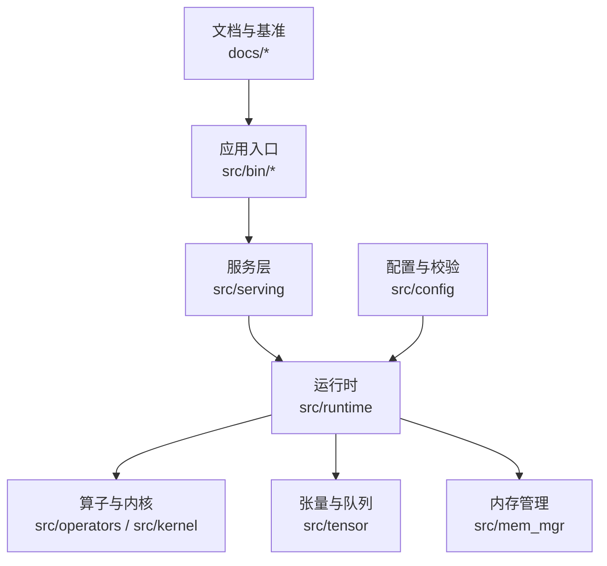
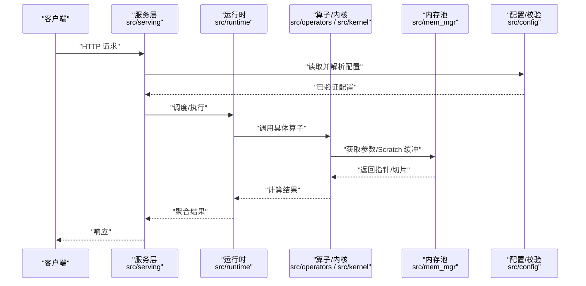
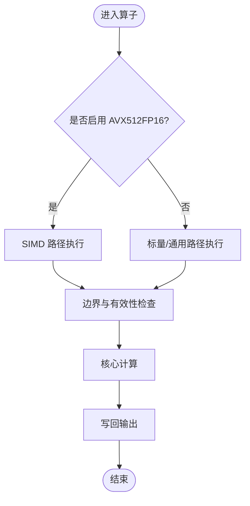
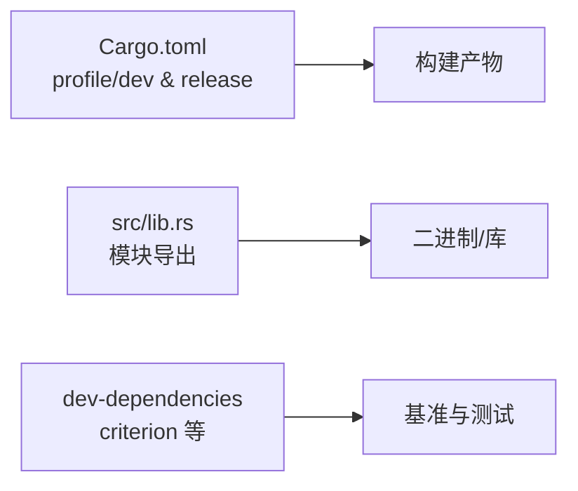

# 调试与性能分析

<cite>
**本文引用的文件**   
- [README.md](file://README.md)
- [Cargo.toml](file://Cargo.toml)
- [lib.rs](file://src/lib.rs)
- [allocator.rs](file://src/mem_mgr/allocator.rs)
- [mem_pool.rs](file://src/mem_mgr/mem_pool.rs)
- [mod.rs](file://src/tensor/mod.rs)
- [topk_softmax.rs](file://src/operators/softmax/topk_softmax.rs)
- [rms_map.rs](file://src/operators/normalization/rms_map.rs)
- [error.rs](file://src/serving/error.rs)
- [command_line_interface.rs](file://src/config/command_line_interface.rs)
- [huggingface_config.rs](file://src/config/huggingface_config.rs)
- [config_validator.rs](file://src/config/config_validator.rs)
- [safety_session_management.md](file://docs/design/runtime/session_management.md)
- [optimization.md](file://docs/configuration/optimization.md)
</cite>

## 目录
1. [简介](#简介)
2. [项目结构](#项目结构)
3. [核心组件](#核心组件)
4. [架构总览](#架构总览)
5. [详细组件分析](#详细组件分析)
6. [依赖关系分析](#依赖关系分析)
7. [性能考量](#性能考量)
8. [故障排查指南](#故障排查指南)
9. [结论](#结论)
10. [附录](#附录)

## 简介
本指南面向在 eLLM（纯 CPU 推理框架）上进行问题定位、内存与性能分析的工程师。内容覆盖：
- Rust 调试工具链使用与技巧
- 内存泄漏检测与内存池行为验证
- 性能瓶颈分析方法与关键路径剖析
- 日志记录与监控指标的配置与实践
- 常见问题排查流程与解决方案
- 性能分析输出解读与优化建议
- 生产环境调试最佳实践与注意事项

## 项目结构
eLLM 采用模块化分层组织，核心模块包括配置、运行时、算子、张量、服务层与内核实现。调试与性能分析贯穿各层，尤其是内存管理、算子执行与服务入口。



图表来源
- [lib.rs:1-15](file://src/lib.rs#L1-L15)
- [optimization.md:62-95](file://docs/configuration/optimization.md#L62-L95)

章节来源
- [lib.rs:1-15](file://src/lib.rs#L1-L15)
- [optimization.md:62-95](file://docs/configuration/optimization.md#L62-L95)

## 核心组件
- 内存分配器与内存池
  - 对齐分配器：提供 64B 对齐的堆分配，便于 SIMD/AMX 指令高效访问。
  - 全局参数与临时缓冲池：按名称复用块，支持严格模式校验权重形状，减少重复分配与碎片。
- 算子与内核
  - TopK Softmax、RMSNorm 等算子在 AVX512FP16 路径与非 AVX512FP16 路径间切换，便于在不同硬件上对比与回归。
- 配置与命令行
  - 命令行参数映射到配置对象，包含模型、调度与服务相关选项；配置校验确保一致性。
- 错误处理
  - 服务层统一错误类型，便于对外返回一致状态码与消息。

章节来源
- [allocator.rs:1-156](file://src/mem_mgr/allocator.rs#L1-L156)
- [mem_pool.rs:1-543](file://src/mem_mgr/mem_pool.rs#L1-L543)
- [topk_softmax.rs:420-460](file://src/operators/softmax/topk_softmax.rs#L420-L460)
- [rms_map.rs:55-97](file://src/operators/normalization/rms_map.rs#L55-L97)
- [command_line_interface.rs:734-786](file://src/config/command_line_interface.rs#L734-L786)
- [config_validator.rs:1-43](file://src/config/config_validator.rs#L1-43)
- [error.rs:1-87](file://src/serving/error.rs#L1-L87)

## 架构总览
下图展示从请求进入服务层到算子执行与内存分配的典型调用链，以及配置加载与校验的作用点。



图表来源
- [command_line_interface.rs:734-786](file://src/config/command_line_interface.rs#L734-L786)
- [config_validator.rs:1-43](file://src/config/config_validator.rs#L1-L43)
- [topk_softmax.rs:420-460](file://src/operators/softmax/topk_softmax.rs#L420-L460)
- [rms_map.rs:55-97](file://src/operators/normalization/rms_map.rs#L55-L97)
- [mem_pool.rs:1-543](file://src/mem_mgr/mem_pool.rs#L1-L543)

## 详细组件分析

### 内存管理与泄漏检测
- 对齐分配器 AlignedBox
  - 固定 64B 对齐，适合 SIMD/AMX 数据通路；提供初始化、拷贝、Deref/DerefMut、Drop 语义。
  - 调试要点：检查长度断言、偏移越界断言、Drop 中析构顺序与释放是否匹配。
- 全局内存池 MemPool 与 ScratchPool
  - 通过名称键将参数与中间缓冲纳入池化，避免频繁分配；支持严格模式校验权重形状缺失或不匹配。
  - MoE 专家权重拼接为连续块，并以子块视图暴露，利于缓存局部性与批量访存。
  - 调试要点：严格模式下缺失或尺寸不匹配的权重会触发 panic；非严格模式会按需分配零填充缓冲。

```mermaid
classDiagram
class AlignedBox~T~ {
+allocate(length) Self
+allocate_init(length, value) Self
+as_ptr() *const T
+as_mut_ptr() *mut T
+len() usize
+is_empty() bool
+as_slice() &[T]
+as_mut_slice() &mut [T]
+as_ptr_offset(offset) *const T
+as_mut_ptr_offset(offset) *mut T
}
class MemoryBlock~T~ {
<<enum>>
Full(Arc<AlignedBox<T>>)
Sub{parent : Arc<AlignedBox<T>>, offset : usize, size : usize}
+as_ptr() *const T
+as_mut_ptr() *mut T
+len() usize
+as_slice() &[T]
+as_mut_slice() &mut [T]
}
class MemPool~T~ {
-blocks : HashMap<String, MemoryBlock<T>>
-parameters : HashMap<String, Vec<T>>
-strict_weights : bool
+new(parameters) Self
+new_strict(parameters) Self
+get(name, shape) *mut T
+get_scratch(name, len, value) *mut T
}
class ScratchPool~T~ {
-blocks : HashMap<String, AlignedBox<T>>
+new() Self
+get_init(name, len, value) *mut T
}
MemPool~T~ --> MemoryBlock~T~ : "持有"
MemoryBlock~T~ --> AlignedBox~T~ : "引用/子视图"
ScratchPool~T~ --> AlignedBox~T~ : "持有"
```

图表来源
- [allocator.rs:1-156](file://src/mem_mgr/allocator.rs#L1-L156)
- [mem_pool.rs:1-543](file://src/mem_mgr/mem_pool.rs#L1-L543)

章节来源
- [allocator.rs:1-156](file://src/mem_mgr/allocator.rs#L1-L156)
- [mem_pool.rs:1-543](file://src/mem_mgr/mem_pool.rs#L1-L543)

### 算子执行路径与性能热点
- TopK Softmax
  - 在具备 AVX512FP16 时走 SIMD 路径，否则回退到通用堆实现；温度缩放与线程并行维度由上层传入。
  - 调试要点：比较两种路径数值一致性；关注输入值有限性检查与 top_k 边界条件。
- RMSNorm Map
  - 根据目标特性选择 x86_64 f16_512 专用实现或标量实现；eps 与权重参与归一化。
  - 调试要点：确认 target_feature 分支是否正确编译；核对 eps 与权重形状。



图表来源
- [topk_softmax.rs:420-460](file://src/operators/softmax/topk_softmax.rs#L420-L460)
- [rms_map.rs:55-97](file://src/operators/normalization/rms_map.rs#L55-L97)

章节来源
- [topk_softmax.rs:420-460](file://src/operators/softmax/topk_softmax.rs#L420-L460)
- [rms_map.rs:55-97](file://src/operators/normalization/rms_map.rs#L55-L97)

### 配置与命令行参数
- 命令行参数映射至配置对象，涵盖模型、调度与服务相关项；部分参数影响采样、注意力策略与滑动窗口等。
- 配置校验器对必填字段、取值范围与一致性进行约束，失败时返回明确错误信息。

章节来源
- [command_line_interface.rs:734-786](file://src/config/command_line_interface.rs#L734-L786)
- [config_validator.rs:1-43](file://src/config/config_validator.rs#L1-L43)
- [huggingface_config.rs:1-41](file://src/config/huggingface_config.rs#L1-L41)

### 服务层错误处理
- 统一错误类型 ApiError，包含 Tokenization、Slot 不可用与内部错误三类；转换为 HTTP 响应时附带状态码与消息。
- 便于在生产环境中快速识别错误类别与定位来源。

章节来源
- [error.rs:1-87](file://src/serving/error.rs#L1-L87)

## 依赖关系分析
- 构建与特性
  - Cargo profile.release 开启 LTO、strip、panic=abort 等，有利于生产二进制体积与崩溃行为可控。
  - dev-dependencies 引入 criterion 用于基准测试与 HTML 报告生成。
- 模块导出
  - lib.rs 集中导出核心模块，便于外部 crate 或二进制入口按需使用。



图表来源
- [Cargo.toml:69-102](file://Cargo.toml#L69-L102)
- [lib.rs:1-15](file://src/lib.rs#L1-L15)

章节来源
- [Cargo.toml:69-102](file://Cargo.toml#L69-L102)
- [lib.rs:1-15](file://src/lib.rs#L1-L15)

## 性能考量
- 短上下文 Decode 阶段
  - 主要开销来自调度、KV 缓存管理、中间张量管理与服务框架/运行时开销。静态图与轻量执行路径可降低控制面成本。
- 长上下文 Prefill 阶段
  - 大内存容量允许整段 Prefill，减少分段带来的重复 I/O 与控制同步开销；头内顺序计算提升 KV 驻留率与缓存命中率。
- 长上下文 Decode 阶段
  - 小 batch 下 GPU 带宽优势难以发挥；CPU 在小批、低维与不规则矩阵运算更稳定，配合大 L3 缓存可提升整体效率。

章节来源
- [README.md:120-182](file://README.md#L120-L182)

## 故障排查指南

### 常见错误与定位
- 配置错误
  - 现象：启动时报错提示模型名、最大长度、下载目录、revision 等无效或缺失。
  - 定位：查看配置校验器错误枚举与消息；核对命令行参数与环境变量。
- 权重缺失或形状不匹配（严格模式）
  - 现象：严格模式下缺失权重或尺寸不符直接 panic。
  - 定位：检查 MemPool 严格模式分支与断言信息；确认参数加载与形状推导一致。
- 服务层错误
  - 现象：Tokenization 失败、Slot 不可用、内部错误返回 500。
  - 定位：捕获 ApiError 并打印详细信息；结合上游日志与请求上下文。

章节来源
- [config_validator.rs:1-43](file://src/config/config_validator.rs#L1-L43)
- [mem_pool.rs:387-427](file://src/mem_mgr/mem_pool.rs#L387-L427)
- [error.rs:1-87](file://src/serving/error.rs#L1-L87)

### 内存泄漏与碎片排查
- 对齐分配器
  - 检查长度与偏移断言；确认 Drop 中析构顺序正确；避免悬垂指针与重复释放。
- 内存池
  - 严格模式可尽早发现缺失权重；非严格模式下注意未初始化缓冲的写入风险。
  - MoE 专家子块视图需保证父块生命周期覆盖所有子块引用。
- 工具建议
  - 使用 AddressSanitizer（ASan）、LeakSanitizer（LSan）在开发/测试构建中启用，定位越界与泄漏。
  - 使用 Valgrind 或系统级工具（perf、bpftrace）观察分配热点与碎片分布。

章节来源
- [allocator.rs:1-156](file://src/mem_mgr/allocator.rs#L1-L156)
- [mem_pool.rs:1-543](file://src/mem_mgr/mem_pool.rs#L1-L543)

### 性能瓶颈分析与优化建议
- 热点识别
  - 使用 perf record/report 定位热点函数；结合火焰图分析调用栈深度与时间占比。
  - 针对算子路径（TopK Softmax、RMSNorm）分别评估 SIMD 与标量路径差异。
- 内存与缓存
  - 利用 MemPool 复用大块参数与 scratch 缓冲，减少分配与碎片；保持连续布局以提升预取与缓存命中。
  - 关注 KV 缓存布局与访问模式，尽量顺序访问以降低 TLB miss 与 cache miss。
- 调度与并发
  - 参考会话管理与槽位设计，缩短锁持有时间，分离活跃列表，提高并发吞吐。

章节来源
- [topk_softmax.rs:420-460](file://src/operators/softmax/topk_softmax.rs#L420-L460)
- [rms_map.rs:55-97](file://src/operators/normalization/rms_map.rs#L55-L97)
- [safety_session_management.md:480-518](file://docs/design/runtime/session_management.md#L480-L518)

### 日志记录与监控指标
- 日志
  - 服务层错误统一打印到标准错误流，便于收集与分析；建议在关键路径增加结构化日志（如请求 ID、批次大小、序列长度）。
- 指标
  - 建议采集 TTFT、TPOT、QPS、KV 缓存命中率、算子耗时分布、内存占用峰值与碎片率。
  - 结合 Prometheus/Grafana 或时序数据库进行长期观测与告警。

章节来源
- [error.rs:1-87](file://src/serving/error.rs#L1-L87)

### 生产环境调试最佳实践
- 构建与运行
  - 使用 release profile，开启 LTO、strip、panic=abort；保留必要符号以便崩溃回溯。
  - 在 CI 与预发环境启用 ASan/LSan 与 perf 采集，形成基线。
- 安全与稳定性
  - 严格模式加载权重，尽早发现不一致；限制 max_logprobs 防止 OOM。
  - 合理设置并发与批大小，避免过小导致调度开销放大。
- 可观测性
  - 统一错误类型与响应格式；接入分布式追踪与指标上报；建立异常自动告警与回滚机制。

章节来源
- [Cargo.toml:69-102](file://Cargo.toml#L69-L102)
- [command_line_interface.rs:734-786](file://src/config/command_line_interface.rs#L734-L786)

## 结论
eLLM 在 CPU 服务器上通过静态图、连续 KV 缓存与头内顺序计算等设计，显著降低控制面与访存开销，尤其在长上下文 Prefill 场景具备端到端优势。调试与性能分析应围绕内存池行为、算子路径与调度链路展开，结合工具链与指标体系，持续优化延迟与吞吐。

## 附录
- 术语
  - TTFT：首 token 时间
  - TPOT：每输出 token 时间
  - KV 缓存：自回归解码中的历史键值状态
- 参考
  - 项目主页与论文链接见 README 说明