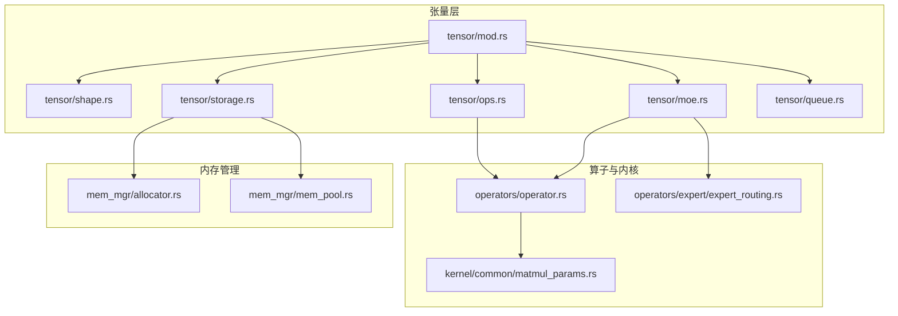
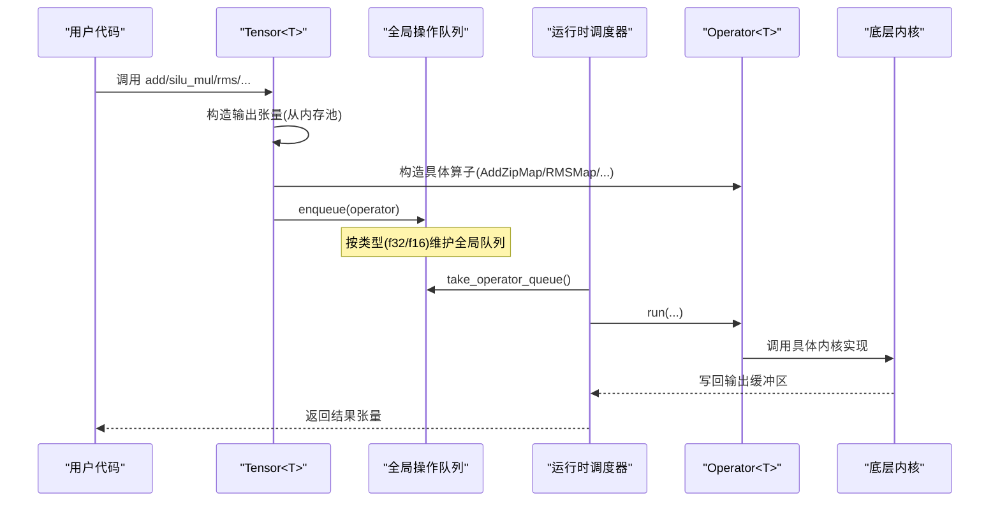
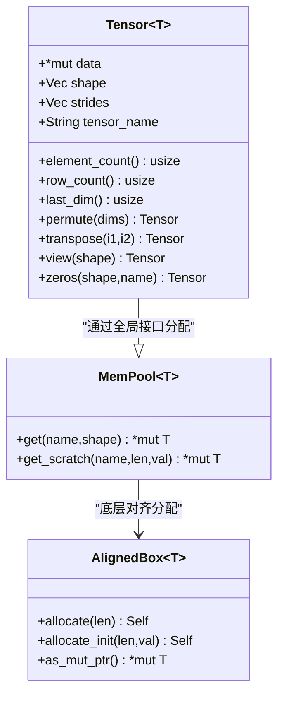
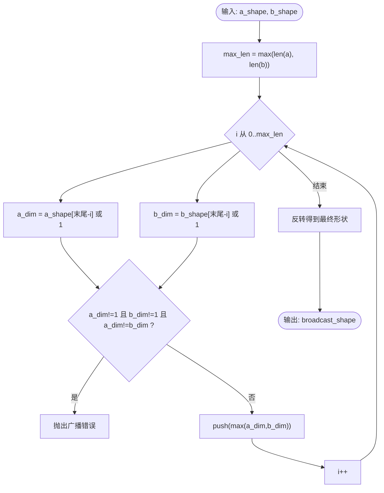
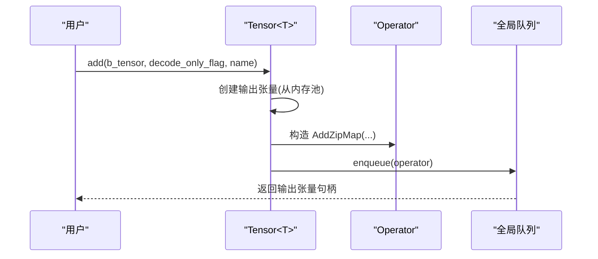
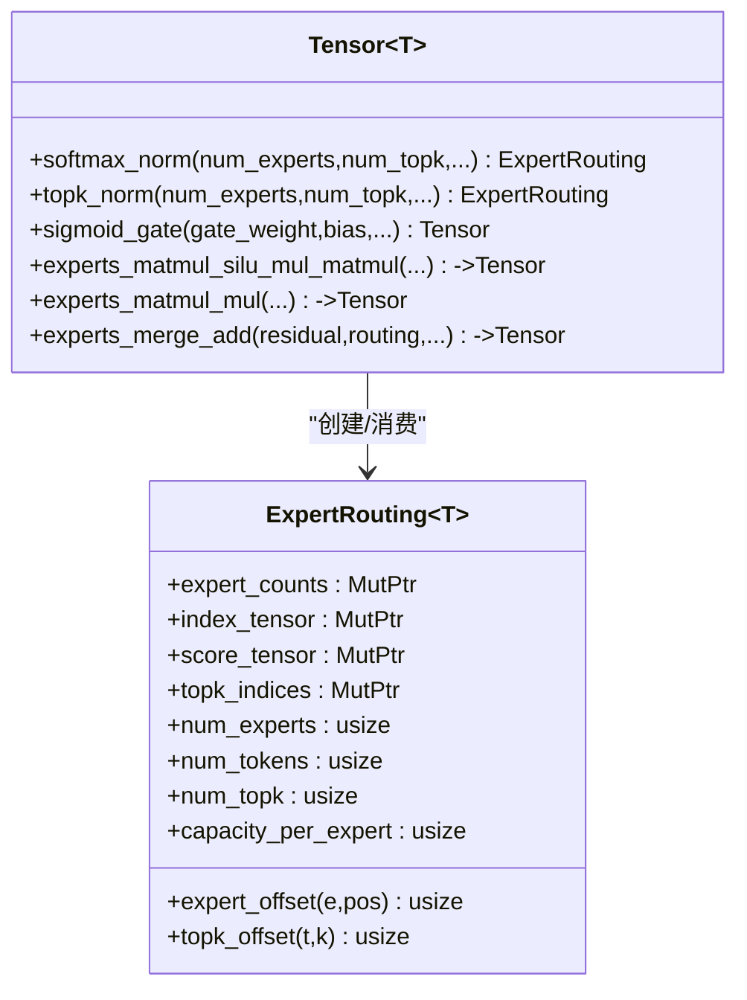
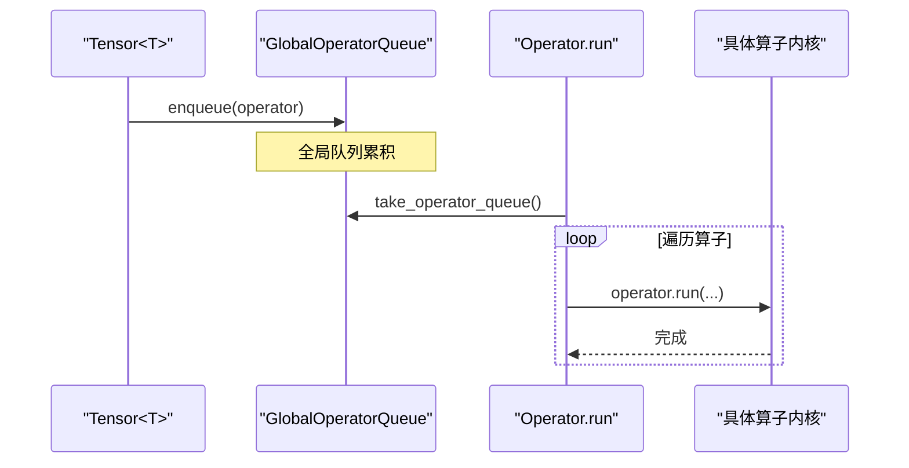
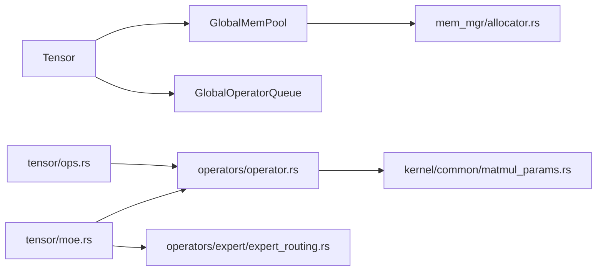

# 张量操作

<cite>
**本文引用的文件**   
- [src/tensor/mod.rs](file://src/tensor/mod.rs)
- [src/tensor/shape.rs](file://src/tensor/shape.rs)
- [src/tensor/storage.rs](file://src/tensor/storage.rs)
- [src/tensor/ops.rs](file://src/tensor/ops.rs)
- [src/tensor/moe.rs](file://src/tensor/moe.rs)
- [src/tensor/queue.rs](file://src/tensor/queue.rs)
- [src/operators/operator.rs](file://src/operators/operator.rs)
- [src/mem_mgr/allocator.rs](file://src/mem_mgr/allocator.rs)
- [src/mem_mgr/mem_pool.rs](file://src/mem_mgr/mem_pool.rs)
- [src/kernel/common/matmul_params.rs](file://src/kernel/common/matmul_params.rs)
- [src/operators/expert/expert_routing.rs](file://src/operators/expert/expert_routing.rs)
</cite>

## 目录
1. [简介](#简介)
2. [项目结构](#项目结构)
3. [核心组件](#核心组件)
4. [架构总览](#架构总览)
5. [详细组件分析](#详细组件分析)
6. [依赖关系分析](#依赖关系分析)
7. [性能考虑](#性能考虑)
8. [故障排查指南](#故障排查指南)
9. [结论](#结论)
10. [附录](#附录)

## 简介
本技术文档围绕张量操作系统的实现，系统阐述以下方面：
- 张量数据结构设计与内存布局策略（形状、步幅、对齐与池化）
- 形状与步幅计算算法（广播机制、维度变换）
- 张量操作实现（基本算术、归一化、索引与切片语义）
- MoE 相关张量操作（专家选择、路由、合并与加权求和）
- 操作队列的管理与执行机制（全局队列、调度与线程安全）
- 性能优化技巧与内存使用模式（SIMD友好对齐、块复用、稀疏路由）
- 自定义张量操作的扩展指南（如何新增算子并接入运行期）
- 张量与算子之间的数据传递与转换机制（指针、视图、零拷贝）

## 项目结构
张量子系统位于 src/tensor 下，包含形状与步幅计算、存储与视图、操作封装以及 MoE 专用接口；内存管理在 src/mem_mgr；算子枚举与执行入口在 src/operators/operator.rs。

图示来源
- [src/tensor/mod.rs:1-14](file://src/tensor/mod.rs#L1-L14)
- [src/tensor/shape.rs:1-182](file://src/tensor/shape.rs#L1-L182)
- [src/tensor/storage.rs:1-154](file://src/tensor/storage.rs#L1-L154)
- [src/tensor/ops.rs:1-166](file://src/tensor/ops.rs#L1-L166)
- [src/tensor/moe.rs:1-332](file://src/tensor/moe.rs#L1-L332)
- [src/tensor/queue.rs:1-73](file://src/tensor/queue.rs#L1-L73)
- [src/operators/operator.rs:1-224](file://src/operators/operator.rs#L1-L224)
- [src/kernel/common/matmul_params.rs:1-36](file://src/kernel/common/matmul_params.rs#L1-L36)
- [src/operators/expert/expert_routing.rs:1-168](file://src/operators/expert/expert_routing.rs#L1-L168)
- [src/mem_mgr/allocator.rs:1-156](file://src/mem_mgr/allocator.rs#L1-L156)
- [src/mem_mgr/mem_pool.rs:1-543](file://src/mem_mgr/mem_pool.rs#L1-L543)

章节来源
- [src/tensor/mod.rs:1-14](file://src/tensor/mod.rs#L1-L14)

## 核心组件
- Tensor<T>：张量抽象，持有原始数据指针、形状、步幅与名称；提供视图、转置、元素计数等元信息方法，并通过全局内存池分配输出缓冲。
- 形状与步幅：提供连续行主序步幅计算、广播形状推导与对齐步幅计算。
- 操作封装：Tensor 上的 add/silu_mul/rms/sigmoid 等方法将具体算子构造为 Operator 并推入全局队列。
- MoE 接口：softmax_norm/topk_norm/sigmoid_gate/experts_matmul_* / experts_merge_add 等，负责路由构建与专家计算。
- 全局操作队列：按数据类型维护全局队列，支持初始化、取走与闭包访问。
- 内存管理：64字节对齐的 AlignedBox 与基于名称正则匹配的 MemPool，支持参数共享与子块映射。

章节来源
- [src/tensor/storage.rs:1-154](file://src/tensor/storage.rs#L1-L154)
- [src/tensor/shape.rs:1-182](file://src/tensor/shape.rs#L1-L182)
- [src/tensor/ops.rs:1-166](file://src/tensor/ops.rs#L1-L166)
- [src/tensor/moe.rs:1-332](file://src/tensor/moe.rs#L1-L332)
- [src/tensor/queue.rs:1-73](file://src/tensor/queue.rs#L1-L73)
- [src/mem_mgr/allocator.rs:1-156](file://src/mem_mgr/allocator.rs#L1-L156)
- [src/mem_mgr/mem_pool.rs:1-543](file://src/mem_mgr/mem_pool.rs#L1-L543)

## 架构总览
张量 API 通过 Tensor 暴露高层语义，内部将计算描述为 Operator 枚举实例，并写入全局队列。运行时从队列取出并按批调度执行，算子内部调用底层内核（如 x86_64 特定实现）。

图示来源
- [src/tensor/ops.rs:31-166](file://src/tensor/ops.rs#L31-L166)
- [src/tensor/queue.rs:12-73](file://src/tensor/queue.rs#L12-L73)
- [src/operators/operator.rs:79-224](file://src/operators/operator.rs#L79-L224)

## 详细组件分析

### 张量数据结构与内存布局
- 字段设计：data 指向连续内存首地址；shape 表示逻辑形状；strides 表示每维步幅；tensor_name 用于内存池命名与复用。
- 内存分配：from_mem_pool/from_vec 通过全局内存池获取或复制数据；leaked_aligned_ptr 用于需要绕过 RAII 的场景（如 MoE 路由中间缓冲）。
- 视图与变换：permute/transposer/view/_view 仅修改 shape/strides，不移动数据，实现零拷贝视图。
- 元信息：element_count/row_count/last_dim 便于快速推导矩阵形态。

图示来源
- [src/tensor/storage.rs:11-154](file://src/tensor/storage.rs#L11-L154)
- [src/mem_mgr/mem_pool.rs:88-128](file://src/mem_mgr/mem_pool.rs#L88-L128)
- [src/mem_mgr/allocator.rs:5-128](file://src/mem_mgr/allocator.rs#L5-L128)

章节来源
- [src/tensor/storage.rs:1-154](file://src/tensor/storage.rs#L1-L154)
- [src/mem_mgr/allocator.rs:1-156](file://src/mem_mgr/allocator.rs#L1-L156)
- [src/mem_mgr/mem_pool.rs:1-543](file://src/mem_mgr/mem_pool.rs#L1-L543)

### 形状与步幅计算（含广播与维度变换）
- get_strides：按行主序计算连续布局步幅，最后一维步幅为 1，其余为后续维度乘积。
- get_broadcast_shape：从后向前对齐两形状，若冲突则报错；返回可广播到的目标形状。
- get_aligned_strides：将原形状的步幅映射到广播后的形状上，对需广播的维度设置步幅为 0，表示“原地重复”。

图示来源
- [src/tensor/shape.rs:44-72](file://src/tensor/shape.rs#L44-L72)

章节来源
- [src/tensor/shape.rs:1-182](file://src/tensor/shape.rs#L1-L182)

### 张量操作实现（算术、归一化、索引与切片语义）
- 算术与激活：add/silu_mul/sigmoid 等通过构造对应 Operator 并入队；部分算子根据 last_dim/head_num/head_size 推断并行粒度。
- 归一化：rms/add_rms/lookup_rms 等封装 RMS 相关算子，支持 decode_only_flag 以适配解码阶段优化路径。
- 索引与切片：当前 Tensor 未直接暴露 slice 方法，但通过 view/permute 可实现零拷贝重排；LookupRMSMap 接受序列索引指针进行按位置读取。

图示来源
- [src/tensor/ops.rs:31-103](file://src/tensor/ops.rs#L31-L103)
- [src/tensor/queue.rs:12-45](file://src/tensor/queue.rs#L12-L45)

章节来源
- [src/tensor/ops.rs:1-166](file://src/tensor/ops.rs#L1-L166)

### MoE 相关张量操作（专家选择与合并）
- 路由生成：softmax_norm/topk_norm 生成 ExpertRouting，内含每个专家的 token 计数、紧凑 index/score 缓冲与 topk_indices。
- 门控与评分：sigmoid_gate 对输入与门控权重做线性变换并应用 sigmoid，可选 bias。
- 专家前向：experts_matmul_silu_mul_matmul 与 experts_matmul_mul 分别实现 gate/up/down 阶段的融合与 down 投影。
- 合并：experts_merge_add 将各专家输出按路由权重聚合并与残差相加。

图示来源
- [src/operators/expert/expert_routing.rs:43-65](file://src/operators/expert/expert_routing.rs#L43-L65)
- [src/tensor/moe.rs:155-332](file://src/tensor/moe.rs#L155-L332)

章节来源
- [src/tensor/moe.rs:1-332](file://src/tensor/moe.rs#L1-L332)
- [src/operators/expert/expert_routing.rs:1-168](file://src/operators/expert/expert_routing.rs#L1-L168)

### 操作队列管理与执行机制
- 全局队列：按 f32/f16 维护独立的全局 Vec<Operator<T>>，支持 init/clear、take 与 with 访问。
- 入队：Tensor 方法中通过 enqueue 将 Operator 推入队列，避免立即执行。
- 执行：Operator::run 分发到具体算子实现，支持 prefill/decode 两种阶段与多线程调度。

图示来源
- [src/tensor/queue.rs:12-73](file://src/tensor/queue.rs#L12-L73)
- [src/operators/operator.rs:79-224](file://src/operators/operator.rs#L79-L224)

章节来源
- [src/tensor/queue.rs:1-73](file://src/tensor/queue.rs#L1-L73)
- [src/operators/operator.rs:1-224](file://src/operators/operator.rs#L1-L224)

### 张量与算子的数据传递与转换
- 零拷贝视图：permute/view/_view 仅更新 shape/strides，保持 data 不变，降低内存拷贝。
- 指针直传：算子构造时直接传入 data 指针，避免额外包装；MoE 路由使用原子计数与紧凑缓冲减少冗余。
- 内存池复用：输出张量统一从内存池按名称申请，命中则复用，未命中则分配；参数权重按名称正则匹配复用。

章节来源
- [src/tensor/storage.rs:100-149](file://src/tensor/storage.rs#L100-L149)
- [src/mem_mgr/mem_pool.rs:309-427](file://src/mem_mgr/mem_pool.rs#L309-L427)

## 依赖关系分析
- Tensor 依赖 GlobalMemPool 与 GlobalOperatorQueue，间接依赖 AlignedBox 与 MemPool。
- ops/moe 模块依赖 operators/operator 枚举与具体算子实现。
- MoE 路由依赖 expert_routing 结构与原子计数。
- MatMul 相关内核通过 MatMulParams 控制分块宏/微步长。

图示来源
- [src/tensor/storage.rs:1-154](file://src/tensor/storage.rs#L1-L154)
- [src/tensor/ops.rs:1-166](file://src/tensor/ops.rs#L1-L166)
- [src/tensor/moe.rs:1-332](file://src/tensor/moe.rs#L1-L332)
- [src/operators/operator.rs:1-224](file://src/operators/operator.rs#L1-L224)
- [src/operators/expert/expert_routing.rs:1-168](file://src/operators/expert/expert_routing.rs#L1-L168)
- [src/kernel/common/matmul_params.rs:1-36](file://src/kernel/common/matmul_params.rs#L1-L36)
- [src/mem_mgr/allocator.rs:1-156](file://src/mem_mgr/allocator.rs#L1-L156)

章节来源
- [src/tensor/mod.rs:1-14](file://src/tensor/mod.rs#L1-L14)

## 性能考虑
- SIMD 友好对齐：AlignedBox 使用 64 字节对齐，利于 AVX512/FMA 等向量指令。
- 零拷贝视图：permute/view 不改数据布局，避免不必要拷贝。
- 内存池复用：按名称复用大块内存，减少分配开销；专家权重拼接为父块，子块仅偏移引用。
- 稀疏路由：ExpertRouting 采用紧凑 buffer 与原子计数，减少无效计算与内存占用。
- 分块参数：MatMulParams 提供宏/微步长，便于针对不同硬件调优。

章节来源
- [src/mem_mgr/allocator.rs:1-156](file://src/mem_mgr/allocator.rs#L1-L156)
- [src/mem_mgr/mem_pool.rs:249-307](file://src/mem_mgr/mem_pool.rs#L249-L307)
- [src/operators/expert/expert_routing.rs:43-65](file://src/operators/expert/expert_routing.rs#L43-L65)
- [src/kernel/common/matmul_params.rs:1-36](file://src/kernel/common/matmul_params.rs#L1-L36)

## 故障排查指南
- 广播形状不兼容：当两形状对应维均不为 1 且不相等时，会触发广播错误。检查 get_broadcast_shape 的输入形状。
- 严格权重加载失败：开启严格模式时，缺失或尺寸不匹配的权重会 panic。确认参数名与形状一致。
- 队列未初始化：若未初始化全局内存池或队列，with_global/with_operator_queue 可能 panic。确保在启动阶段正确初始化。
- 视图形状不一致：view 要求元素总数相等，否则断言失败。检查源张量与目标形状的元素数。

章节来源
- [src/tensor/shape.rs:60-66](file://src/tensor/shape.rs#L60-L66)
- [src/mem_mgr/mem_pool.rs:388-407](file://src/mem_mgr/mem_pool.rs#L388-L407)
- [src/tensor/storage.rs:126-136](file://src/tensor/storage.rs#L126-L136)

## 结论
该张量系统以轻量、零拷贝与高性能为目标，通过统一的 Tensor 抽象、全局操作队列与内存池，结合 MoE 稀疏路由与 SIMD 友好的内存布局，实现了可扩展、易用的张量操作体系。建议在新增算子时遵循现有模式：定义 Operator 变体、在 Tensor 上暴露便捷方法、利用内存池与对齐分配，并在必要时引入分块参数以提升吞吐。

## 附录

### 自定义张量操作扩展指南
- 步骤概览
  - 在 operators/operator.rs 中添加新的 Operator 变体，并实现 run 分支。
  - 在 tensor/ops.rs 或 tensor/moe.rs 中为 Tensor<T> 添加便捷方法，构造新算子并 enqueue。
  - 如需新内存块，使用 MemPool 的 get/get_scratch 或 AlignedBox 分配。
  - 若涉及分块计算，参考 MatMulParams 配置宏/微步长。
- 注意事项
  - 确保输入/输出指针有效且对齐。
  - 注意多线程安全：共享状态应使用原子或线程局部缓冲。
  - 测试覆盖：为新算子编写单元测试，验证单/多线程一致性。

章节来源
- [src/operators/operator.rs:31-224](file://src/operators/operator.rs#L31-L224)
- [src/tensor/ops.rs:1-166](file://src/tensor/ops.rs#L1-L166)
- [src/kernel/common/matmul_params.rs:1-36](file://src/kernel/common/matmul_params.rs#L1-L36)