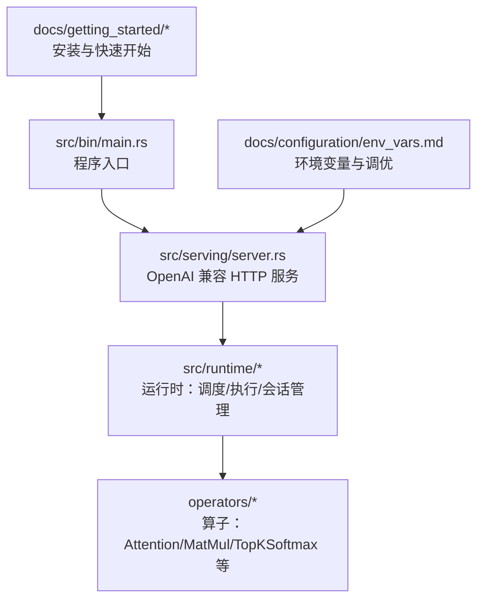
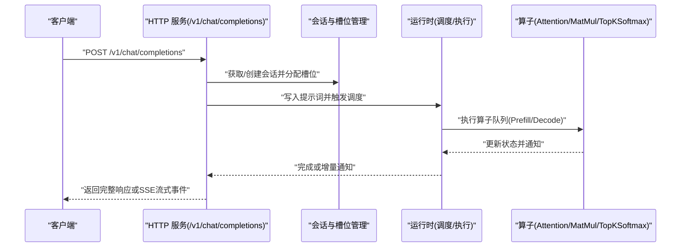
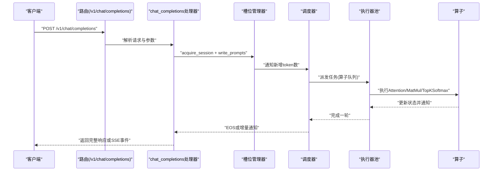
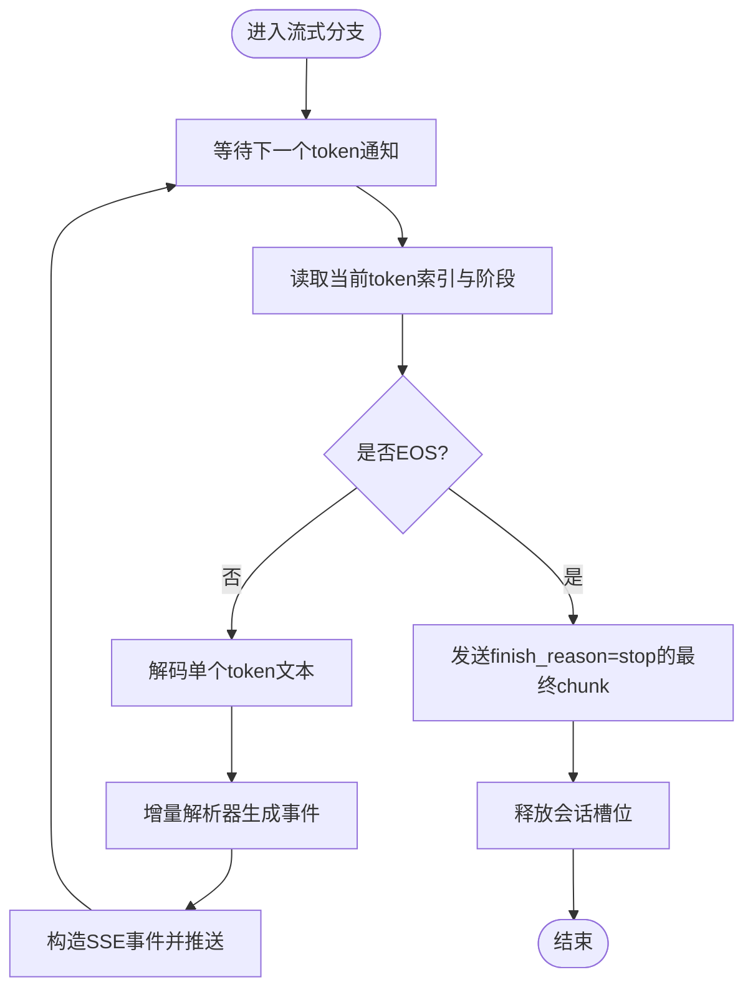
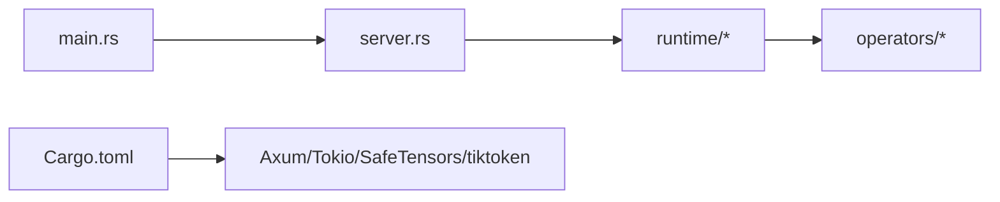

# 快速开始

<cite>
**本文引用的文件**   
- [README.md](file://README.md)
- [Cargo.toml](file://Cargo.toml)
- [src/bin/main.rs](file://src/bin/main.rs)
- [src/serving/server.rs](file://src/serving/server.rs)
- [docs/getting_started/quickstart.md](file://docs/getting_started/quickstart.md)
- [docs/getting_started/installation.md](file://docs/getting_started/installation.md)
- [docs/configuration/env_vars.md](file://docs/configuration/env_vars.md)
- [docs/design/runtime/overview.md](file://docs/design/runtime/overview.md)
- [test_request.json](file://test_request.json)
</cite>

## 目录
1. [简介](#简介)
2. [项目结构](#项目结构)
3. [核心组件](#核心组件)
4. [架构总览](#架构总览)
5. [详细组件分析](#详细组件分析)
6. [依赖关系分析](#依赖关系分析)
7. [性能与特性](#性能与特性)
8. [常见问题与故障排查](#常见问题与故障排查)
9. [结论](#结论)
10. [附录](#附录)

## 简介
eLLM 是一个专为 CPU 服务器（Intel Xeon/EPYC）设计的 LLM 推理框架，具备以下核心价值与优势：
- 纯 CPU 推理：无需 GPU/NPU，在服务器级 CPU 上运行
- OpenAI API 兼容：提供 /v1/chat/completions 接口，便于接入现有生态
- 长上下文支持：通过静态 KV 缓存与维度优先布局，有效利用大内存优势，实现超长上下文的 Prefill 一次性处理
- 低延迟、高吞吐：Prefill 阶段按头顺序计算注意力，充分利用 CPU 大缓存，降低重复访存与控制开销
- 更低能耗与成本：参数仅加载一次，减少重复内存访问；硬件与单用户推理成本显著低于 GPU 方案

这些特性使 eLLM 在“以 Prefill 为主”的长上下文工作负载中具备端到端优势。

章节来源
- [README.md:15-31](file://README.md#L15-L31)

## 项目结构
仓库采用 Rust 工程组织，核心入口位于 src/bin/main.rs，HTTP 服务封装于 src/serving/server.rs，运行时调度与执行位于 src/runtime/*，配置与环境变量文档位于 docs/configuration/*，入门指南位于 docs/getting_started/*。

图表来源
- [src/bin/main.rs:26-40](file://src/bin/main.rs#L26-L40)
- [src/serving/server.rs:25-43](file://src/serving/server.rs#L25-L43)
- [docs/design/runtime/overview.md:28-55](file://docs/design/runtime/overview.md#L28-L55)

章节来源
- [src/bin/main.rs:26-40](file://src/bin/main.rs#L26-L40)
- [src/serving/server.rs:25-43](file://src/serving/server.rs#L25-L43)
- [docs/getting_started/installation.md:16-31](file://docs/getting_started/installation.md#L16-L31)

## 核心组件
- 程序入口与运行时初始化
  - main 解析 CLI 参数，构建配置，初始化服务资源并启动 Tokio 多线程运行时，随后调用服务模块 run() 启动 HTTP 服务
- OpenAI 兼容服务层
  - 暴露 POST /v1/chat/completions 与 GET /status，负责请求路由、槽位分配、等待推理完成、返回非流式或 SSE 流式响应
- 运行时调度与执行
  - 将用户请求转换为可执行任务切片，协调多线程执行算子队列，管理会话与槽位生命周期
- 算子层
  - 包含 Attention、MatMul、TopKSoftmax 等算子，由执行器并行执行

章节来源
- [src/bin/main.rs:26-40](file://src/bin/main.rs#L26-L40)
- [src/serving/server.rs:25-43](file://src/serving/server.rs#L25-L43)
- [docs/design/runtime/overview.md:15-24](file://docs/design/runtime/overview.md#L15-L24)

## 架构总览
下图展示了从客户端请求到模型执行的端到端流程，以及关键组件间的交互关系。

图表来源
- [src/serving/server.rs:100-176](file://src/serving/server.rs#L100-L176)
- [docs/design/runtime/overview.md:183-221](file://docs/design/runtime/overview.md#L183-L221)

## 详细组件分析

### 环境搭建与安装
- 硬件要求
  - CPU：x86-64，建议带 AVX-512（AVX2 标量回退可用），推荐 Intel Xeon 4代及以上
  - 内存：至少 8GB，随模型大小线性增长
- 软件依赖
  - Rust 工具链 1.78+
  - Linux 或 Windows（已在 Ubuntu 22.04 与 Windows 11 测试）
- 构建步骤
  - 克隆仓库后，使用 cargo build 或 cargo build --release 进行构建
- 下载模型
  - 将 HuggingFace 兼容模型目录放置于 models/<model-name>/，需包含 config.json、generation_config.json、model.safetensors，以及 tokenizer.json（用于服务路径）
- 环境变量
  - 通过 ELLM_BATCH_SIZE、ELLM_SEQUENCE_LENGTH、ELLM_CHUNK_SIZE、ELLM_SCHEDULE_TIMEOUT_MS 控制批大小、序列长度、分块大小与调度超时

章节来源
- [docs/getting_started/installation.md:3-13](file://docs/getting_started/installation.md#L3-L13)
- [docs/getting_started/installation.md:16-31](file://docs/getting_started/installation.md#L16-L31)
- [docs/getting_started/installation.md:34-56](file://docs/getting_started/installation.md#L34-L56)
- [docs/configuration/env_vars.md:9-26](file://docs/configuration/env_vars.md#L9-L26)

### 启动服务与发送请求
- 启动服务
  - 使用 cargo run --release --bin main -- --model models/Qwen3-0.6B 启动服务，默认监听 0.0.0.0:8000
- 健康检查
  - curl http://localhost:8000/status 返回运行状态 JSON
- 聊天补全请求
  - POST /v1/chat/completions，JSON 体包含 model、messages、可选 stream、temperature、max_tokens 等字段
- 流式响应
  - 设置 stream=true 可获得 SSE 事件，每个 token 对应一个 chunk，最终携带 finish_reason="stop"

章节来源
- [docs/getting_started/quickstart.md:8-28](file://docs/getting_started/quickstart.md#L8-L28)
- [docs/getting_started/quickstart.md:32-63](file://docs/getting_started/quickstart.md#L32-L63)
- [docs/getting_started/quickstart.md:67-83](file://docs/getting_started/quickstart.md#L67-L83)
- [docs/getting_started/quickstart.md:86-104](file://docs/getting_started/quickstart.md#L86-L104)
- [src/serving/server.rs:84-98](file://src/serving/server.rs#L84-L98)

### 基本概念：Prefill 与 Decode
- Prefill（预填充）
  - 一次性处理整个提示词，生成初始隐藏状态与 KV 缓存；eLLM 采用“按头顺序”的注意力计算，最大化缓存命中，降低重复访存
- Decode（解码）
  - 逐 token 生成，维护历史 KV 缓存；eLLM 的静态 KV 布局与连续访问模式提升缓存局部性，减少元数据与动态分配开销
- 为什么 CPU 能高性能推理
  - 大内存支持超长上下文的一次性 Prefill，避免分块带来的重复加载与同步开销
  - 大缓存配合按头顺序执行，显著提升 KV 驻留率与复用效率
  - 函数调用式执行路径避免内核启动与调度开销，在小批量场景更稳定

章节来源
- [README.md:25-31](file://README.md#L25-L31)
- [README.md:47-58](file://README.md#L47-L58)
- [docs/design/runtime/overview.md:15-24](file://docs/design/runtime/overview.md#L15-L24)

### 服务请求时序图（OpenAI 兼容）

图表来源
- [src/serving/server.rs:100-176](file://src/serving/server.rs#L100-L176)
- [docs/design/runtime/overview.md:183-221](file://docs/design/runtime/overview.md#L183-L221)

### 流式响应处理流程

图表来源
- [src/serving/server.rs:178-311](file://src/serving/server.rs#L178-L311)

## 依赖关系分析
- 外部依赖
  - Axum 提供 HTTP 服务与路由
  - Tokio 提供异步运行时与并发原语
  - safetensors 加载模型权重
  - tiktoken-rs 用于分词器
  - serde/serde_json 用于序列化
- 内部模块耦合
  - main 依赖配置与服务初始化
  - serving 依赖 runtime 的调度与执行能力
  - runtime 依赖 operators 的具体实现

图表来源
- [Cargo.toml:42-67](file://Cargo.toml#L42-L67)
- [src/bin/main.rs:26-40](file://src/bin/main.rs#L26-L40)
- [src/serving/server.rs:25-43](file://src/serving/server.rs#L25-L43)

章节来源
- [Cargo.toml:42-67](file://Cargo.toml#L42-L67)
- [src/bin/main.rs:26-40](file://src/bin/main.rs#L26-L40)
- [src/serving/server.rs:25-43](file://src/serving/server.rs#L25-L43)

## 性能与特性
- 低延迟：Prefill 端到端与按头顺序注意力计算，显著降低首 token 时间
- 高吞吐：较低的单实例并发仍可通过更低端到端延迟获得更高真实 QPS
- 长上下文：大内存支持近无限上下文窗口，适合 RAG、深度研究、代码助手等场景
- 更低能耗与成本：参数仅加载一次，减少重复内存访问；硬件与单用户推理成本更低

章节来源
- [README.md:25-31](file://README.md#L25-L31)

## 常见问题与故障排查
- 无法连接服务
  - 确认服务已绑定 0.0.0.0:8000，且防火墙允许该端口
  - 使用 GET /status 验证服务健康状态
- 请求返回错误或空结果
  - 检查模型目录结构与必需文件是否存在（config.json、generation_config.json、model.safetensors、tokenizer.json）
  - 确认请求体字段 model、messages 正确，stream 与 temperature 等参数符合预期
- 流式响应不生效
  - 确保请求中包含 stream=true，并使用 SSE 客户端消费事件
- 性能不佳或延迟较高
  - 调整环境变量：减小 ELLM_CHUNK_SIZE 以降低延迟，增大 ELLM_BATCH_SIZE 与 ELLM_CHUNK_SIZE 以提升吞吐，增大 ELLM_SEQUENCE_LENGTH 以支持更长上下文
  - 根据负载特征调整 ELLM_SCHEDULE_TIMEOUT_MS，保障低流量下的调度及时性

章节来源
- [docs/getting_started/quickstart.md:8-28](file://docs/getting_started/quickstart.md#L8-L28)
- [docs/getting_started/installation.md:34-56](file://docs/getting_started/installation.md#L34-L56)
- [docs/configuration/env_vars.md:9-26](file://docs/configuration/env_vars.md#L9-L26)

## 结论
eLLM 通过纯 CPU 推理、OpenAI API 兼容与长上下文优化，为以 Prefill 为主的长上下文工作负载提供了高性价比的解决方案。借助静态计算图、静态 KV 缓存与按头顺序注意力计算，eLLM 在 CPU 服务器上实现了低延迟与高吞吐的推理体验，尤其适用于 RAG、代码助手、深度研究与交互式 Agent 等场景。

## 附录
- 示例请求体（可用于本地测试）
  - 参考 test_request.json 中的 messages、stream、temperature 等字段
- 下一步学习
  - 阅读服务概览与运行时设计文档，了解完整的请求生命周期与调度策略
  - 参考配置与环境变量文档，进行参数调优与部署实践

章节来源
- [test_request.json:1-9](file://test_request.json#L1-L9)
- [docs/design/runtime/overview.md:15-24](file://docs/design/runtime/overview.md#L15-L24)
- [docs/configuration/env_vars.md:9-26](file://docs/configuration/env_vars.md#L9-L26)