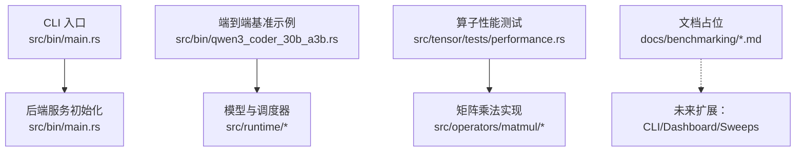
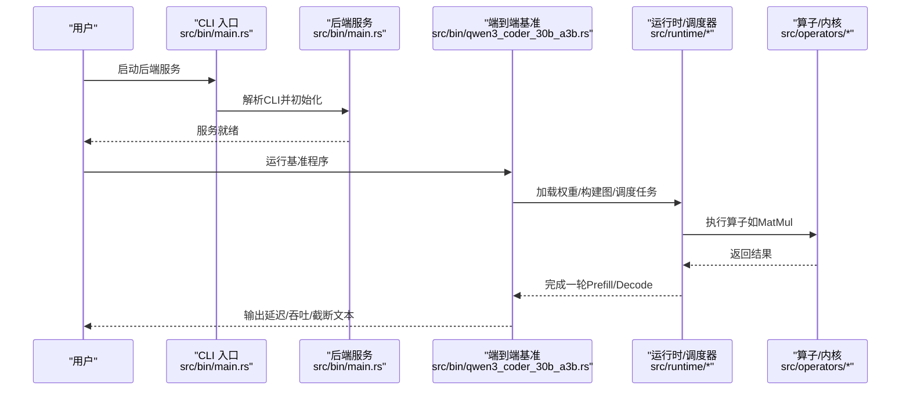
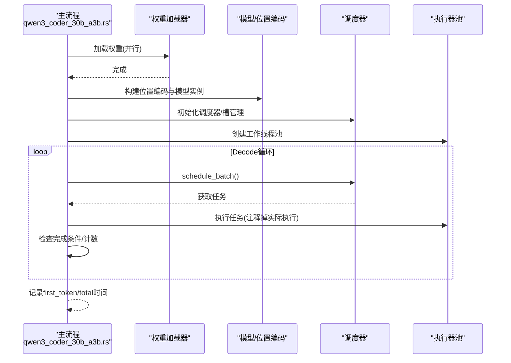
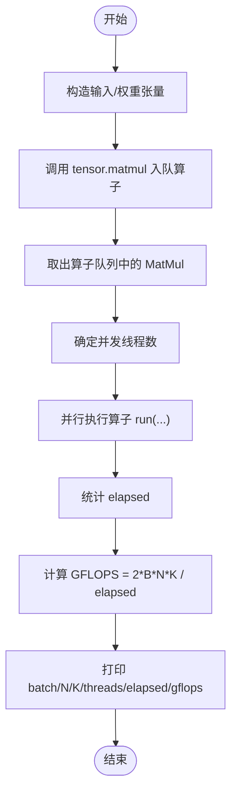
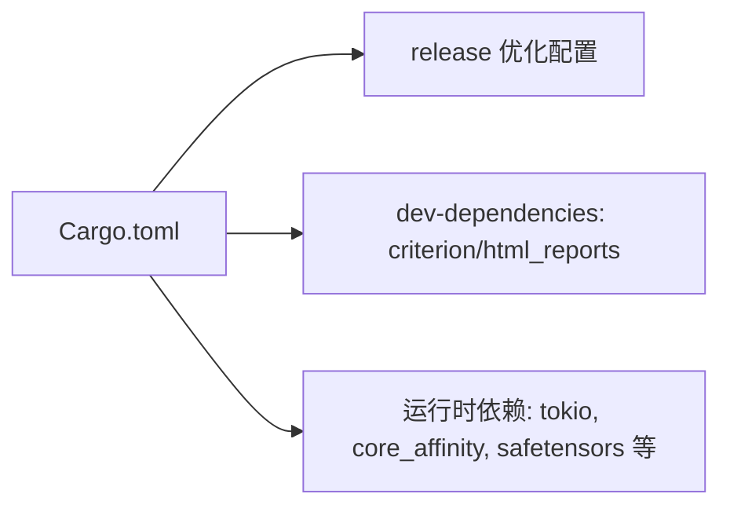

# 性能基准测试

<cite>
**本文引用的文件**   
- [src/bin/qwen3_coder_30b_a3b.rs](file://src/bin/qwen3_coder_30b_a3b.rs)
- [src/bin/backend.rs](file://src/bin/backend.rs)
- [src/bin/main.rs](file://src/bin/main.rs)
- [src/tensor/tests/performance.rs](file://src/tensor/tests/performance.rs)
- [Cargo.toml](file://Cargo.toml)
- [README.md](file://README.md)
- [README.zh-CN.md](file://README.zh-CN.md)
- [docs/benchmarking/cli.md](file://docs/benchmarking/cli.md)
- [docs/benchmarking/dashboard.md](file://docs/benchmarking/dashboard.md)
- [docs/benchmarking/sweeps.md](file://docs/benchmarking/sweeps.md)
- [docs/cli/bench/index.md](file://docs/cli/bench/index.md)
</cite>

## 目录
1. [简介](#简介)
2. [项目结构](#项目结构)
3. [核心组件](#核心组件)
4. [架构总览](#架构总览)
5. [详细组件分析](#详细组件分析)
6. [依赖分析](#依赖分析)
7. [性能考量](#性能考量)
8. [故障排查指南](#故障排查指南)
9. [结论](#结论)
10. [附录](#附录)

## 简介
本文件面向eLLM项目的性能基准测试体系，系统性说明：
- 基准测试框架设计与用例组织
- 性能指标（吞吐、延迟、内存）的收集与计算方法
- 命令行基准工具的使用方法与参数配置
- 性能仪表板可视化与数据分析能力现状与建议
- 不同场景下的基准模板与最佳实践
- 性能回归检测与自动化流程建议
- 瓶颈分析与优化建议
- 与其他推理框架的性能对比方法
- 测试结果解释与报告生成

## 项目结构
当前仓库中“基准测试”相关文档多为占位符，但代码层面已具备可复用的基准能力：
- 端到端推理基准示例：qwen3_coder_30b_a3b 二进制程序，提供加载权重、构建图、Prefill/Decode循环、计时与输出截断等完整流程
- 算子级性能测试：tensor.matmul 的并行执行与GFLOPS统计
- CLI入口与后端服务：main.rs 解析CLI并启动服务；backend.rs 提供最小化运行路径
- 文档占位：docs/benchmarking/* 与 docs/cli/bench/index.md 为后续扩展预留

图表来源
- [src/bin/main.rs:1-41](file://src/bin/main.rs#L1-L41)
- [src/bin/qwen3_coder_30b_a3b.rs:108-349](file://src/bin/qwen3_coder_30b_a3b.rs#L108-L349)
- [src/tensor/tests/performance.rs:307-388](file://src/tensor/tests/performance.rs#L307-L388)
- [docs/benchmarking/cli.md:1-5](file://docs/benchmarking/cli.md#L1-L5)
- [docs/benchmarking/dashboard.md:1-5](file://docs/benchmarking/dashboard.md#L1-L5)
- [docs/benchmarking/sweeps.md:1-5](file://docs/benchmarking/sweeps.md#L1-L5)

章节来源
- [src/bin/main.rs:1-41](file://src/bin/main.rs#L1-L41)
- [src/bin/qwen3_coder_30b_a3b.rs:108-349](file://src/bin/qwen3_coder_30b_a3b.rs#L108-L349)
- [src/tensor/tests/performance.rs:307-388](file://src/tensor/tests/performance.rs#L307-L388)
- [docs/benchmarking/cli.md:1-5](file://docs/benchmarking/cli.md#L1-L5)
- [docs/benchmarking/dashboard.md:1-5](file://docs/benchmarking/dashboard.md#L1-L5)
- [docs/benchmarking/sweeps.md:1-5](file://docs/benchmarking/sweeps.md#L1-L5)
- [docs/cli/bench/index.md:1-10](file://docs/cli/bench/index.md#L1-L10)

## 核心组件
- 端到端基准程序（qwen3_coder_30b_a3b）
  - 功能：加载权重、构建计算图、Prefill/Decode循环、首token与总耗时记录、强制最大输出长度截断
  - 关键特性：环境变量驱动批大小、线程数、最大输出token；进程锁避免重复启动；日志带时间戳
- 算子级性能测试（tensor.matmul perf）
  - 功能：构造输入/权重张量，调用matmul，统计执行时间与GFLOPS
  - 关键特性：按可用线程并行执行，打印batch/N/K/threads/elapsed/gflops
- CLI与服务入口（main.rs）
  - 功能：解析CLI、初始化运行时、创建Tokio多核runtime并运行服务
- 最小化后端示例（backend.rs）
  - 功能：展示最小运行路径（加载配置、初始化模型、调度器等）

章节来源
- [src/bin/qwen3_coder_30b_a3b.rs:108-349](file://src/bin/qwen3_coder_30b_a3b.rs#L108-L349)
- [src/tensor/tests/performance.rs:307-388](file://src/tensor/tests/performance.rs#L307-L388)
- [src/bin/main.rs:1-41](file://src/bin/main.rs#L1-L41)
- [src/bin/backend.rs:1-41](file://src/bin/backend.rs#L1-L41)

## 架构总览
下图展示了从CLI到运行时与算子的整体交互，以及基准测试在其中的落点。

图表来源
- [src/bin/main.rs:1-41](file://src/bin/main.rs#L1-L41)
- [src/bin/qwen3_coder_30b_a3b.rs:108-349](file://src/bin/qwen3_coder_30b_a3b.rs#L108-L349)

## 详细组件分析

### 端到端基准程序（qwen3_coder_30b_a3b）
- 设计要点
  - 环境变量控制：ELLM_BATCH、ELLM_MAX_OUTPUT_TOKENS、ELLM_THREAD_NUM、ELLM_ALLOW_LOGICAL_THREADS、ELLM_PROMPT
  - 进程锁：防止重复启动导致资源竞争
  - 计时点：load_weights、build_graph、first_token、total、generate
  - 输出截断：强制生成至max_output_tokens后停止，便于稳定度量
- 数据流
  - 读取模型配置与tokenizer/chat_template
  - 并行加载权重并初始化全局内存池
  - 构建BatchSequence与SlotState，进入调度循环
  - Prefill完成后进入Decode循环，直至EOS或达到最大输出长度
- 时序图

图表来源
- [src/bin/qwen3_coder_30b_a3b.rs:108-349](file://src/bin/qwen3_coder_30b_a3b.rs#L108-L349)

章节来源
- [src/bin/qwen3_coder_30b_a3b.rs:108-349](file://src/bin/qwen3_coder_30b_a3b.rs#L108-L349)

### 算子级性能测试（tensor.matmul perf）
- 设计要点
  - 构造随机输入与权重，调用Tensor.matmul
  - 取算子队列中的MatMul算子，按panel_threads限制并发度
  - 使用Instant统计执行时间，计算GFLOPS = 2*B*N*K / elapsed
- 流程图

图表来源
- [src/tensor/tests/performance.rs:307-388](file://src/tensor/tests/performance.rs#L307-L388)

章节来源
- [src/tensor/tests/performance.rs:307-388](file://src/tensor/tests/performance.rs#L307-L388)

### CLI与服务入口（main.rs）
- 功能
  - 解析CLI参数，构建RuntimeContext，初始化服务资源
  - 创建Tokio多核runtime并异步运行服务
- 适用场景
  - 作为服务端基线，配合外部压测工具进行吞吐/延迟评估

章节来源
- [src/bin/main.rs:1-41](file://src/bin/main.rs#L1-L41)

### 最小化后端示例（backend.rs）
- 功能
  - 展示最小运行路径：加载配置、初始化模型、准备调度器与槽管理
- 适用场景
  - 快速验证环境、定位问题、搭建轻量基准

章节来源
- [src/bin/backend.rs:1-41](file://src/bin/backend.rs#L1-L41)

## 依赖分析
- 构建与发布配置
  - release profile开启LTO、strip、panic=abort等优化，适合基准测试
  - dev-dependencies包含criterion（HTML报告），可用于后续引入Criterion基准套件
- 运行时依赖
  - tokio用于异步运行时
  - core_affinity用于线程亲和性设置
  - safetensors/npy用于权重与中间数据读写

图表来源
- [Cargo.toml:69-102](file://Cargo.toml#L69-L102)

章节来源
- [Cargo.toml:69-102](file://Cargo.toml#L69-L102)

## 性能考量
- 指标定义与采集
  - 延迟
    - TTFT（首token时延）：从Prefill开始到首个token输出的时间
    - TPOT（每输出token时延）：Decode阶段平均每个token的时间
    - 端到端延迟：从请求到达至全部输出完成的总时长
  - 吞吐
    - QPS：单位时间内处理的请求数
    - Token吞吐：每秒生成的token数量
  - 内存
    - 峰值内存占用：通过系统工具或进程内探针采集
    - KV Cache占用：随序列长度线性增长，需关注碎片与复用
- 采集方式
  - 程序内计时：使用Instant记录关键阶段（load_weights/build_graph/first_token/total）
  - 算子级统计：基于执行时间与FLOPs估算GFLOPS
  - 外部观测：结合系统监控（CPU利用率、内存、I/O）
- 稳定性与可比性
  - 固定随机种子与输入分布
  - 预热轮次与剔除异常值
  - 控制线程数与亲和性，避免超线程干扰
- 参考实验说明
  - README中给出短/长上下文实验思路与硬件对比，可作为基准场景设计的参考

章节来源
- [src/bin/qwen3_coder_30b_a3b.rs:108-349](file://src/bin/qwen3_coder_30b_a3b.rs#L108-L349)
- [src/tensor/tests/performance.rs:307-388](file://src/tensor/tests/performance.rs#L307-L388)
- [README.md:64-182](file://README.md#L64-L182)
- [README.zh-CN.md:64-187](file://README.zh-CN.md#L64-L187)

## 故障排查指南
- 重复启动冲突
  - 现象：提示已有进程在运行，拒绝重复启动
  - 处理：检查临时锁文件与对应进程状态，清理残留锁
- 线程数与物理核不匹配
  - 现象：逻辑线程过多导致抖动
  - 处理：通过环境变量限制线程数，或使用物理核亲和性
- 权重加载失败
  - 现象：找不到模型目录或配置文件
  - 处理：确认模型路径与文件名，确保safetensors格式正确
- 输出截断不符合预期
  - 现象：生成token数量超过设定
  - 处理：检查EOS策略与最大输出长度参数

章节来源
- [src/bin/qwen3_coder_30b_a3b.rs:108-349](file://src/bin/qwen3_coder_30b_a3b.rs#L108-L349)

## 结论
- 当前仓库已具备端到端与算子级的基准能力，可通过环境变量灵活配置批大小、线程数与输出长度
- 文档层面对CLI、Dashboard、Sweeps仍为占位，建议在此基础上完善
- 建议在CI中集成回归检测与报告生成，形成闭环

## 附录

### 命令行基准工具使用方法与参数配置
- 端到端基准程序（qwen3_coder_30b_a3b）
  - 环境变量
    - ELLM_BATCH：批大小（默认3）
    - ELLM_MAX_OUTPUT_TOKENS：最大输出token数（默认128）
    - ELLM_THREAD_NUM：线程数（默认物理核数）
    - ELLLM_ALLOW_LOGICAL_THREADS：是否允许逻辑线程
    - ELLM_PROMPT：自定义提示词（可选）
  - 行为
    - 自动加载权重与tokenizer/chat_template
    - 记录各阶段耗时并输出截断后的生成文本
- 后端服务（main.rs）
  - 通过CLI参数启动服务，供外部压测工具访问
- 文档入口
  - docs/cli/bench/index.md 为基准命令入口页，建议补充latency/throughput/serve benchmark说明

章节来源
- [src/bin/qwen3_coder_30b_a3b.rs:108-349](file://src/bin/qwen3_coder_30b_a3b.rs#L108-L349)
- [src/bin/main.rs:1-41](file://src/bin/main.rs#L1-L41)
- [docs/cli/bench/index.md:1-10](file://docs/cli/bench/index.md#L1-L10)

### 性能仪表板的可视化与数据分析
- 现状
  - docs/benchmarking/dashboard.md 为占位文档
- 建议
  - 将程序内计时与GFLOPS输出持久化为JSON/CSV
  - 使用Grafana/Prometheus或自研看板聚合指标
  - 支持按场景（短/长上下文）、硬件、线程数筛选与对比

章节来源
- [docs/benchmarking/dashboard.md:1-5](file://docs/benchmarking/dashboard.md#L1-L5)

### 基准扫描与自动化（Sweeps）
- 现状
  - docs/benchmarking/sweeps.md 为占位文档
- 建议
  - 以YAML/JSON定义扫描矩阵（批大小、序列长度、线程数、采样策略）
  - 批量执行并汇总结果，生成趋势图与差异报告

章节来源
- [docs/benchmarking/sweeps.md:1-5](file://docs/benchmarking/sweeps.md#L1-L5)

### 基准测试模板与最佳实践
- 模板
  - 短上下文：小prompt、中等batch、关注TTFT与QPS
  - 长上下文：大prompt、受限chunk size、关注KV Cache与访存模式
  - 算子级：固定N/K/M，测量GFLOPS与缩放曲线
- 最佳实践
  - 预热与剔除异常值
  - 固定随机种子与输入分布
  - 控制线程亲和性与NUMA拓扑
  - 多次重复取中位数/分位数

[本节为通用指导，无需源码引用]

### 性能回归检测与自动化测试流程
- 建议
  - 在CI中运行关键场景（短/长上下文、典型batch）
  - 与基线版本比较TTFT/TPOT/QPS/GFLOPS，超过阈值告警
  - 使用criterion生成HTML报告并归档
- 依赖
  - dev-dependencies已包含criterion与html_reports

章节来源
- [Cargo.toml:85-92](file://Cargo.toml#L85-L92)

### 性能瓶颈分析与优化建议
- 常见瓶颈
  - 调度开销：频繁continuous batching与token级路由
  - KV Cache管理：分配/回收/地址映射的高频元数据操作
  - 中间张量管理：临时tensor频繁分配释放导致碎片与带宽压力
  - 服务框架/运行时开销：API生命周期、streaming调度、上下文切换
- 优化方向
  - 减少分段与同步点，提升连续流水线效率
  - 优化KV存储布局与访问模式，提高缓存命中率
  - 复用中间buffer，降低分配频率
  - 合理设置线程数与亲和性，避免超线程抖动

章节来源
- [README.md:123-182](file://README.md#L123-L182)
- [README.zh-CN.md:127-187](file://README.zh-CN.md#L127-L187)

### 与其他推理框架的性能对比方法
- 基线选择
  - CPU基线：SGLang CPU endpoint
  - GPU基线：SGLang GPU endpoint v0.5.9（多卡节点）
- 指标对齐
  - Prefill：TTFT（ms）
  - Decode：TPOT（ms/token）
- 实验设置
  - 统一模型、硬件、输入分布与批大小
  - 控制chunk size与序列长度，保证公平对比
- 结果解读
  - 关注带宽、并行度、访存模式对性能的影响

章节来源
- [README.md:64-182](file://README.md#L64-L182)
- [README.zh-CN.md:64-187](file://README.zh-CN.md#L64-L187)

### 测试结果的解释与报告生成
- 解释要点
  - 区分TTFT与TPOT的不同驱动因素
  - 结合硬件特性（带宽、缓存、并行度）分析差距
  - 关注小batch与瘦矩阵乘法的效率问题
- 报告生成
  - 程序内计时输出到标准错误流，附带时间戳
  - 算子级GFLOPS输出到标准输出，便于抓取
  - 建议使用脚本将结果转为结构化数据并生成图表

章节来源
- [src/bin/qwen3_coder_30b_a3b.rs:108-349](file://src/bin/qwen3_coder_30b_a3b.rs#L108-L349)
- [src/tensor/tests/performance.rs:307-388](file://src/tensor/tests/performance.rs#L307-L388)