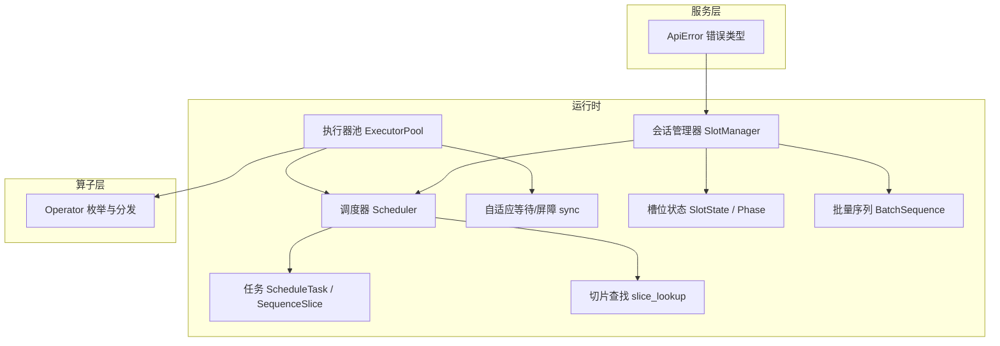
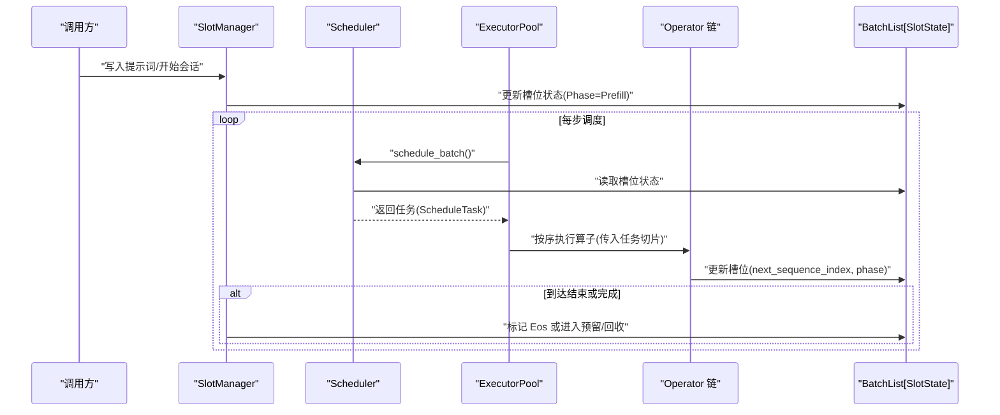
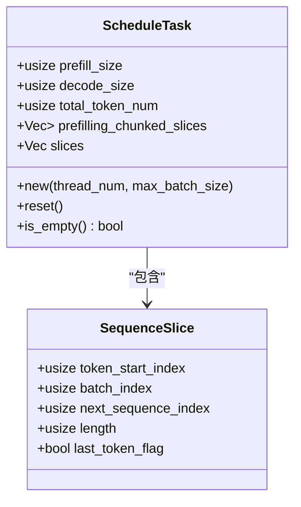
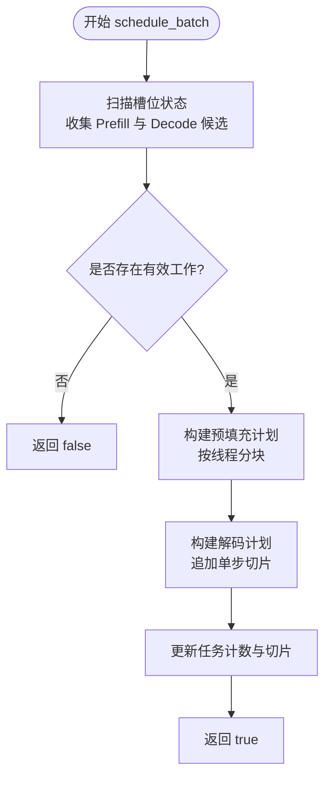
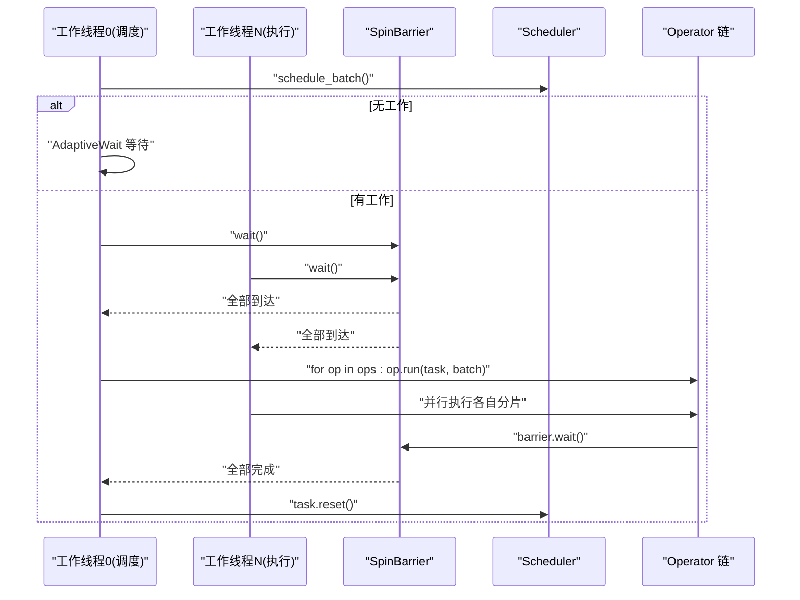
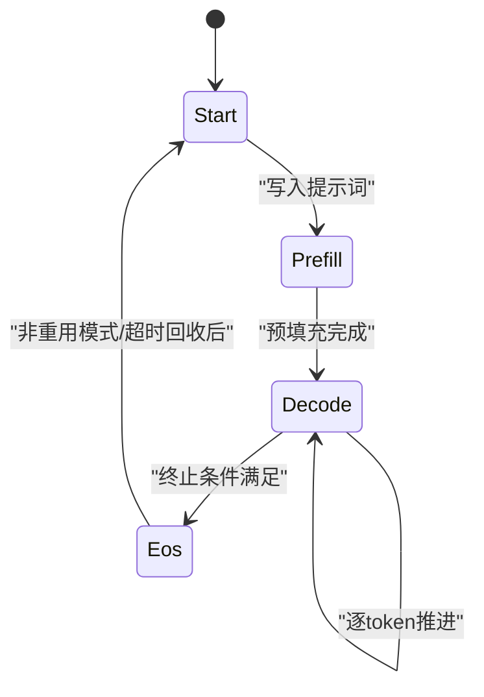
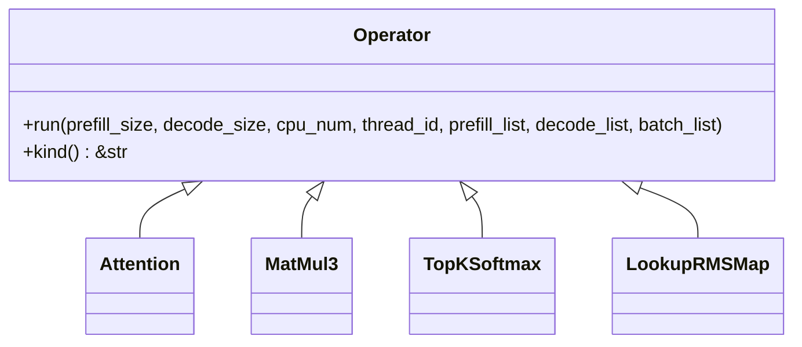
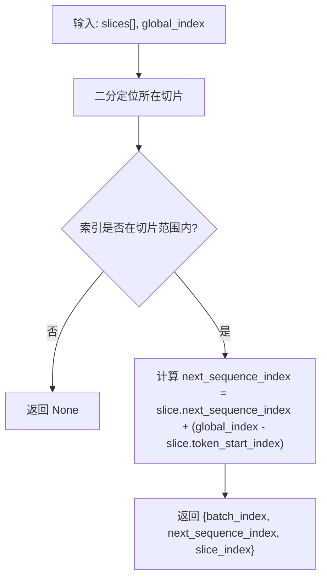
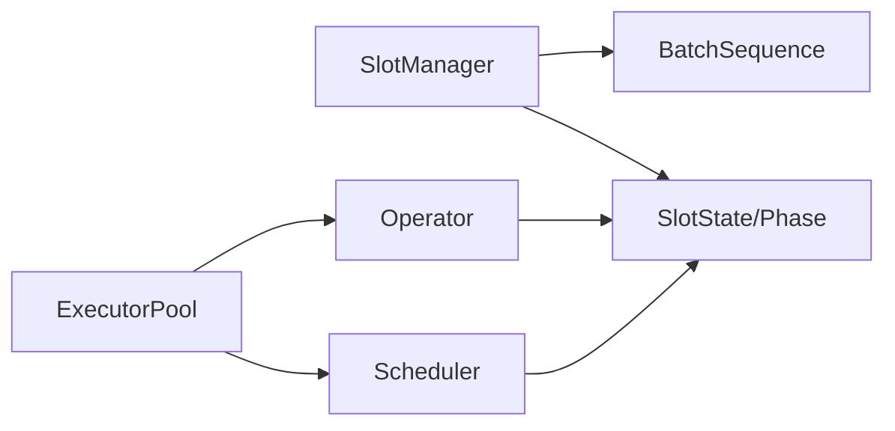

# 任务管理

<cite>
**本文引用的文件**   
- [src/runtime/scheduler/task.rs](file://src/runtime/scheduler/task.rs)
- [src/runtime/scheduler/scheduler.rs](file://src/runtime/scheduler/scheduler.rs)
- [src/runtime/scheduler/mod.rs](file://src/runtime/scheduler/mod.rs)
- [src/runtime/scheduler/slice_lookup.rs](file://src/runtime/scheduler/slice_lookup.rs)
- [src/runtime/executor/mod.rs](file://src/runtime/executor/mod.rs)
- [src/runtime/executor/executor_pool.rs](file://src/runtime/executor/executor_pool.rs)
- [src/runtime/executor/sync.rs](file://src/runtime/executor/sync.rs)
- [src/operators/operator.rs](file://src/operators/operator.rs)
- [src/runtime/session/slot.rs](file://src/runtime/session/slot.rs)
- [src/runtime/session/sequence.rs](file://src/runtime/session/sequence.rs)
- [src/runtime/session/manager.rs](file://src/runtime/session/manager.rs)
- [src/serving/error.rs](file://src/serving/error.rs)
</cite>

## 目录
1. [简介](#简介)
2. [项目结构](#项目结构)
3. [核心组件](#核心组件)
4. [架构总览](#架构总览)
5. [详细组件分析](#详细组件分析)
6. [依赖关系分析](#依赖关系分析)
7. [性能考量](#性能考量)
8. [故障排查指南](#故障排查指南)
9. [结论](#结论)
10. [附录](#附录)

## 简介
本文件围绕“任务管理系统”展开，聚焦以下目标：
- 任务的定义、生命周期与状态转换机制
- 任务队列的实现原理（入队、出队、优先级）
- 任务依赖关系与执行条件检查
- 任务取消、重试与超时处理
- 任务监控与调试工具使用方法
- 任务性能指标收集与统计信息

该系统以连续批调度为核心，将“预填充（Prefill）”和“解码（Decode）”两类工作统一抽象为可并行执行的切片（Slice），并通过调度器生成每步的任务计划，由线程池中的算子流水线执行。

## 项目结构
与任务管理相关的核心模块位于 runtime 层，包括调度器、执行器、会话槽位管理与序列缓冲等；算子层提供具体计算实现；服务层提供错误类型与对外接口。

图表来源
- [src/runtime/scheduler/scheduler.rs:15-82](file://src/runtime/scheduler/scheduler.rs#L15-L82)
- [src/runtime/scheduler/task.rs:1-49](file://src/runtime/scheduler/task.rs#L1-L49)
- [src/runtime/scheduler/slice_lookup.rs:10-71](file://src/runtime/scheduler/slice_lookup.rs#L10-L71)
- [src/runtime/executor/executor_pool.rs:10-148](file://src/runtime/executor/executor_pool.rs#L10-L148)
- [src/runtime/executor/sync.rs:33-83](file://src/runtime/executor/sync.rs#L33-L83)
- [src/runtime/session/manager.rs:17-133](file://src/runtime/session/manager.rs#L17-L133)
- [src/runtime/session/slot.rs:7-64](file://src/runtime/session/slot.rs#L7-L64)
- [src/runtime/session/sequence.rs:10-152](file://src/runtime/session/sequence.rs#L10-L152)
- [src/operators/operator.rs:31-198](file://src/operators/operator.rs#L31-L198)
- [src/serving/error.rs:6-58](file://src/serving/error.rs#L6-L58)

章节来源
- [src/runtime/scheduler/mod.rs:1-8](file://src/runtime/scheduler/mod.rs#L1-L8)
- [src/runtime/executor/mod.rs:1-6](file://src/runtime/executor/mod.rs#L1-L6)

## 核心组件
- 任务与切片
  - ScheduleTask：记录当前批的预填充与解码规模、切片列表及分片到各线程的预填充块。
  - SequenceSlice：描述一段连续的 token 范围及其在批次中的映射关系。
- 调度器
  - Scheduler：从槽位状态集合中扫描并构建任务计划，支持 Prefill 分块与 Decode 单步推进。
- 执行器池
  - ExecutorPool：启动固定数量的工作线程，循环拉取任务并顺序执行算子链。
- 同步原语
  - SpinBarrier/AdaptiveWait：用于多核低延迟协作与忙等退避。
- 会话与槽位
  - SlotManager：维护会话到槽位的映射、LRU 回收、预留槽位与超时清理。
  - SlotState/Phase：表示每个槽的生命周期阶段与进度指针。
- 算子
  - Operator：统一的算子枚举与分发入口，接收任务切片与批次状态进行计算。

章节来源
- [src/runtime/scheduler/task.rs:1-49](file://src/runtime/scheduler/task.rs#L1-L49)
- [src/runtime/scheduler/scheduler.rs:15-131](file://src/runtime/scheduler/scheduler.rs#L15-L131)
- [src/runtime/executor/executor_pool.rs:10-148](file://src/runtime/executor/executor_pool.rs#L10-L148)
- [src/runtime/executor/sync.rs:33-83](file://src/runtime/executor/sync.rs#L33-L83)
- [src/runtime/session/manager.rs:17-133](file://src/runtime/session/manager.rs#L17-L133)
- [src/runtime/session/slot.rs:7-64](file://src/runtime/session/slot.rs#L7-L64)
- [src/operators/operator.rs:31-198](file://src/operators/operator.rs#L31-L198)

## 架构总览
下图展示了从会话写入到算子执行的关键流程，以及任务在各阶段的流转。

图表来源
- [src/runtime/session/manager.rs:137-182](file://src/runtime/session/manager.rs#L137-L182)
- [src/runtime/scheduler/scheduler.rs:66-131](file://src/runtime/scheduler/scheduler.rs#L66-L131)
- [src/runtime/executor/executor_pool.rs:72-148](file://src/runtime/executor/executor_pool.rs#L72-L148)
- [src/operators/operator.rs:79-198](file://src/operators/operator.rs#L79-L198)
- [src/runtime/session/slot.rs:26-64](file://src/runtime/session/slot.rs#L26-L64)

## 详细组件分析

### 任务模型与切片
- 任务结构
  - prefill_size/decode_size：本次批次的预填充与解码 token 数量。
  - slices：全局 token 索引上的连续片段，用于算子访问。
  - prefilling_chunked_slices：按线程划分的预填充块，便于多线程并行。
- 切片语义
  - batch_index/next_sequence_index：定位到具体序列与位置。
  - token_start_index/length：在全局 token 空间中的区间。
  - last_token_flag：标识是否为一个序列的最后 token。

图表来源
- [src/runtime/scheduler/task.rs:1-49](file://src/runtime/scheduler/task.rs#L1-L49)

章节来源
- [src/runtime/scheduler/task.rs:1-49](file://src/runtime/scheduler/task.rs#L1-L49)

### 调度器与任务队列
- 入队/出队
  - 无显式队列：调度器直接扫描槽位状态，按需构建任务并置入内部共享任务对象。
  - has_work：基于任务是否为空判断是否有待执行工作。
- 优先级策略
  - 优先选择处于 Prefill 的槽位，直到达到最大预填充配额；随后补充 Decode 的单步推进。
  - 当存在新请求的 Prefill 时，会优先安排其分块，避免饥饿。
- 分块与并行
  - 预填充按线程数均分，形成 per-thread 的预填充块列表，供算子并行消费。
  - Decode 每次仅推进一个 token，确保自回归一致性。

图表来源
- [src/runtime/scheduler/scheduler.rs:66-131](file://src/runtime/scheduler/scheduler.rs#L66-L131)

章节来源
- [src/runtime/scheduler/scheduler.rs:66-223](file://src/runtime/scheduler/scheduler.rs#L66-L223)

### 执行器与工作线程
- 线程模型
  - 固定数量工作线程，使用自适应等待与自旋屏障协调。
  - 主线程负责调度，其余线程等待任务就绪后参与执行。
- 执行流程
  - 获取任务后，遍历算子队列，依次调用 operator.run(...)。
  - 每个算子根据任务切片与批次状态进行读写。

图表来源
- [src/runtime/executor/executor_pool.rs:72-148](file://src/runtime/executor/executor_pool.rs#L72-L148)
- [src/runtime/executor/sync.rs:33-83](file://src/runtime/executor/sync.rs#L33-L83)

章节来源
- [src/runtime/executor/executor_pool.rs:10-148](file://src/runtime/executor/executor_pool.rs#L10-L148)
- [src/runtime/executor/sync.rs:1-83](file://src/runtime/executor/sync.rs#L1-L83)

### 会话、槽位与生命周期
- 阶段定义
  - Start/Prefill/Decode/Eos：表示槽位所处阶段。
- 生命周期
  - acquire_session：分配或复用槽位，重置状态。
  - write_prompts：写入提示词，设置 Phase=Prefill 与长度。
  - release_session：根据模式决定是否立即释放或进入预留+超时回收。
- 超时与取消
  - 预留槽位在超时后被回收并复位；若期间被重新获取则取消回收。

图表来源
- [src/runtime/session/slot.rs:7-64](file://src/runtime/session/slot.rs#L7-L64)
- [src/runtime/session/manager.rs:84-133](file://src/runtime/session/manager.rs#L84-L133)

章节来源
- [src/runtime/session/slot.rs:7-64](file://src/runtime/session/slot.rs#L7-L64)
- [src/runtime/session/manager.rs:48-133](file://src/runtime/session/manager.rs#L48-L133)

### 算子与依赖/条件
- 算子统一入口
  - Operator::run 根据变体分发到具体实现，接收任务切片与批次状态。
- 依赖与条件
  - 某些算子需要读取批次状态（如 TopKSoftmax 写回下一 token 并推进阶段）。
  - 通过 last_token_flag 与 next_sequence_index 保证数据依赖正确性。

图表来源
- [src/operators/operator.rs:31-198](file://src/operators/operator.rs#L31-L198)

章节来源
- [src/operators/operator.rs:79-198](file://src/operators/operator.rs#L79-L198)

### 切片查找与全局索引
- 功能
  - lookup_global_index：将全局 token 索引映射到具体切片与序列位置。
  - walk_global_range：按范围遍历切片，回调给出 (global_index, batch_index, sequence_index)。
- 用途
  - 算子在随机访问或跨切片聚合时使用。

图表来源
- [src/runtime/scheduler/slice_lookup.rs:14-30](file://src/runtime/scheduler/slice_lookup.rs#L14-L30)

章节来源
- [src/runtime/scheduler/slice_lookup.rs:10-71](file://src/runtime/scheduler/slice_lookup.rs#L10-L71)

## 依赖关系分析
- 组件耦合
  - Scheduler 依赖 SlotState 与 SharedMut<Vec<SlotState>>，不持有持久队列，降低锁竞争。
  - ExecutorPool 依赖 Scheduler 与 Operator 链，通过 SpinBarrier 保证步骤级同步。
  - SlotManager 管理 Session 与槽位，驱动 Phase 变化，间接影响调度结果。
- 外部依赖
  - tokio::sync::Notify 用于异步通知。
  - tiktoken_rs 用于分词。

图表来源
- [src/runtime/session/manager.rs:17-133](file://src/runtime/session/manager.rs#L17-L133)
- [src/runtime/scheduler/scheduler.rs:15-82](file://src/runtime/scheduler/scheduler.rs#L15-L82)
- [src/runtime/executor/executor_pool.rs:10-148](file://src/runtime/executor/executor_pool.rs#L10-L148)
- [src/operators/operator.rs:31-198](file://src/operators/operator.rs#L31-L198)

章节来源
- [src/runtime/session/manager.rs:17-133](file://src/runtime/session/manager.rs#L17-L133)
- [src/runtime/scheduler/scheduler.rs:15-82](file://src/runtime/scheduler/scheduler.rs#L15-L82)
- [src/runtime/executor/executor_pool.rs:10-148](file://src/runtime/executor/executor_pool.rs#L10-L148)
- [src/operators/operator.rs:31-198](file://src/operators/operator.rs#L31-L198)

## 性能考量
- 调度开销
  - 每步需扫描槽位并构建任务，建议合理设置 max_prefill_size 与 max_decode_size 以平衡吞吐与延迟。
- KV Cache 管理
  - 频繁读写历史 KV，应关注内存布局与访存局部性。
- 中间张量复用
  - 算子内部尽量复用线程私有缓冲区，减少分配与拷贝。
- 并行度与分块
  - 预填充按线程分块，提升 CPU 利用率；注意避免过度切分导致同步成本上升。
- 自适应等待
  - 使用自适应自旋/休眠策略，在高负载下降低上下文切换开销。

[本节为通用指导，无需特定文件引用]

## 故障排查指南
- 常见问题
  - 无工作产出：检查槽位是否全部处于 Eos 或空闲；确认调度阈值配置。
  - 阶段异常：核对 write_prompts/release_session 对 Phase 的更新逻辑。
  - 超时未回收：检查预留槽位是否被重新获取而取消回收。
- 诊断要点
  - 打印任务规模（prefill_size/decode_size）与切片数量。
  - 观察槽位 next_sequence_index 与 prompt_length 的变化。
  - 使用测试用例路径验证关键路径行为。

章节来源
- [src/runtime/tests/scheduler_integration_tests.rs:1-387](file://src/runtime/tests/scheduler_integration_tests.rs#L1-L387)
- [src/runtime/tests/session_lifecycle_tests.rs:47-93](file://src/runtime/tests/session_lifecycle_tests.rs#L47-L93)
- [src/serving/error.rs:6-58](file://src/serving/error.rs#L6-L58)

## 结论
该任务管理系统以“无显式队列、按需调度”的方式，结合连续批与分块策略，实现了高效的 CPU 推理流水线。通过清晰的阶段划分、切片化任务模型与线程级并行，系统在吞吐与延迟之间取得良好平衡。未来可在监控与统计方面进一步增强，以便更精细地优化参数与瓶颈定位。

[本节为总结，无需特定文件引用]

## 附录

### 任务定义与字段说明
- ScheduleTask
  - prefill_size：本次预填充 token 总数。
  - decode_size：本次解码 token 数（通常为活跃序列数）。
  - total_token_num：两者之和。
  - prefilling_chunked_slices：按线程划分的预填充块。
  - slices：全局 token 切片列表。
- SequenceSlice
  - token_start_index/batch_index/next_sequence_index/length/last_token_flag

章节来源
- [src/runtime/scheduler/task.rs:1-49](file://src/runtime/scheduler/task.rs#L1-L49)

### 任务队列实现要点
- 入队：调度器直接构建任务至共享对象，无需额外队列。
- 出队：工作线程通过 with_task 读取任务并在完成后 reset。
- 优先级：Prefill 优先于 Decode；长文本分块均衡线程负载。

章节来源
- [src/runtime/scheduler/scheduler.rs:66-131](file://src/runtime/scheduler/scheduler.rs#L66-L131)
- [src/runtime/executor/executor_pool.rs:72-148](file://src/runtime/executor/executor_pool.rs#L72-L148)

### 依赖关系与执行条件
- 依赖：算子依赖批次状态与任务切片；TopKSoftmax 会写回下一 token 并推进阶段。
- 条件：last_token_flag 与 next_sequence_index 保障数据一致性与顺序。

章节来源
- [src/operators/operator.rs:79-198](file://src/operators/operator.rs#L79-L198)
- [src/runtime/scheduler/slice_lookup.rs:14-30](file://src/runtime/scheduler/slice_lookup.rs#L14-L30)

### 取消、重试与超时
- 取消：预留槽位在被重新获取时通过 AtomicBool 取消回收。
- 重试：当前未见自动重试机制；上层可按需重试。
- 超时：release_session 支持超时后回收槽位并复位。

章节来源
- [src/runtime/session/manager.rs:84-133](file://src/runtime/session/manager.rs#L84-L133)

### 监控与调试
- 监控点
  - 任务规模：prefill_size/decode_size/total_token_num。
  - 切片数量与分布：slices.len() 与 per-thread 块大小。
  - 槽位阶段与进度：Phase 与 next_sequence_index/prompt_length。
- 调试方法
  - 使用集成测试用例复现场景，断言关键不变式。
  - 在关键路径添加日志输出（例如写入提示词后的长度与温度）。

章节来源
- [src/runtime/tests/scheduler_integration_tests.rs:1-387](file://src/runtime/tests/scheduler_integration_tests.rs#L1-L387)
- [src/runtime/session/sequence.rs:53-81](file://src/runtime/session/sequence.rs#L53-L81)

### 性能指标与统计
- 建议采集
  - 每步调度耗时、算子执行耗时、KV Cache 命中率、线程利用率。
  - 预填充分块均衡度（各线程块大小方差）。
- 统计方式
  - 在 ExecutorPool 与 Operator 入口/出口埋点，汇总到集中存储或仪表盘。

[本节为通用指导，无需特定文件引用]