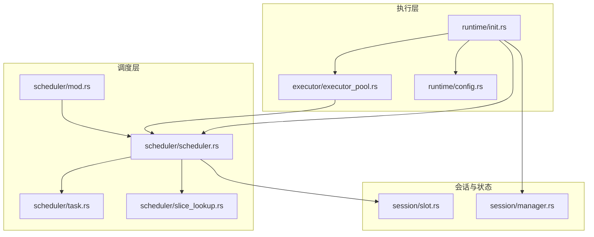
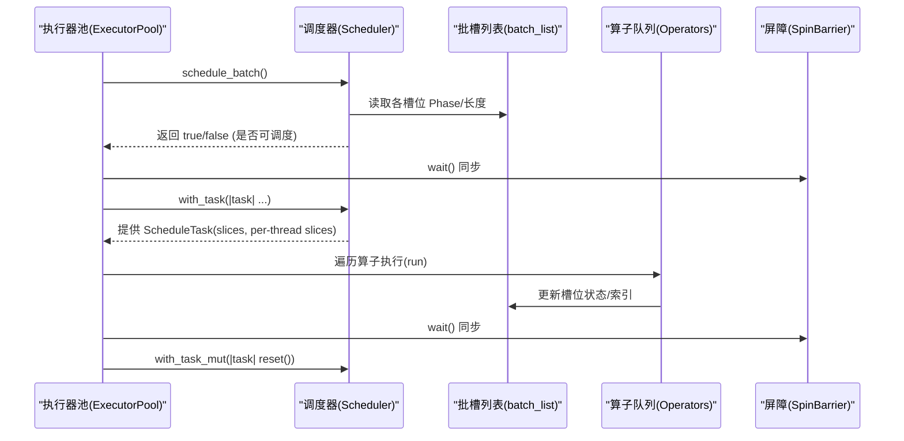
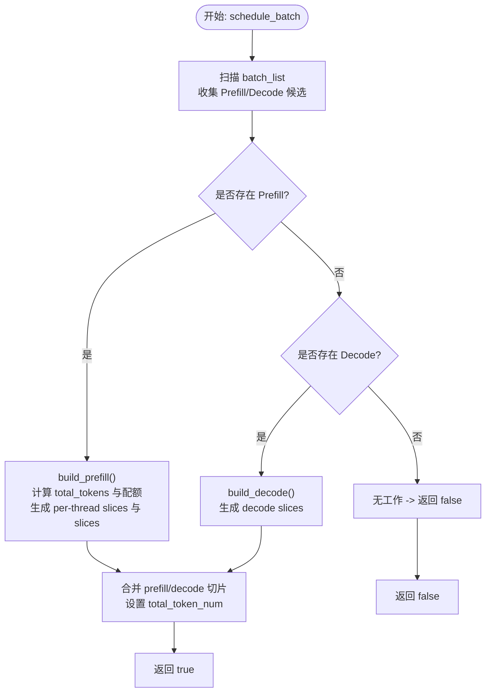
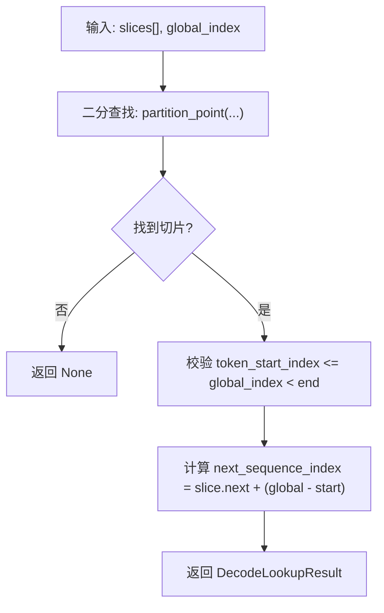
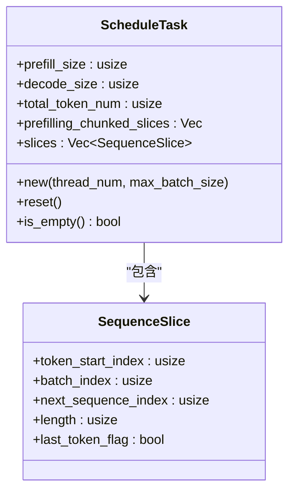
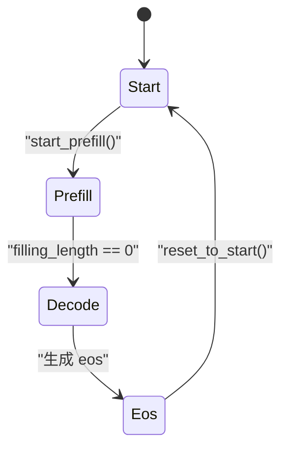
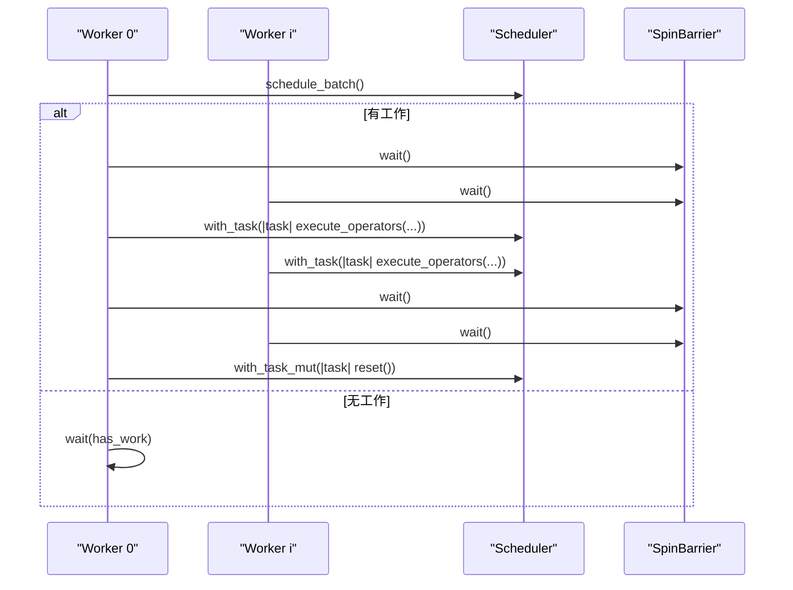
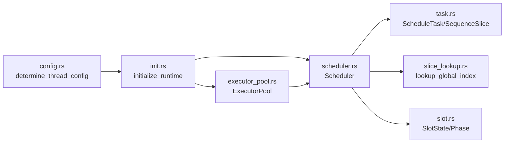

# 任务调度

<cite>
**本文引用的文件**   
- [src/runtime/scheduler/mod.rs](file://src/runtime/scheduler/mod.rs)
- [src/runtime/scheduler/scheduler.rs](file://src/runtime/scheduler/scheduler.rs)
- [src/runtime/scheduler/task.rs](file://src/runtime/scheduler/task.rs)
- [src/runtime/scheduler/slice_lookup.rs](file://src/runtime/scheduler/slice_lookup.rs)
- [src/runtime/session/slot.rs](file://src/runtime/session/slot.rs)
- [src/runtime/config.rs](file://src/runtime/config.rs)
- [src/runtime/init.rs](file://src/runtime/init.rs)
- [src/runtime/executor/executor_pool.rs](file://src/runtime/executor/executor_pool.rs)
- [src/runtime/session/manager.rs](file://src/runtime/session/manager.rs)
- [docs/design/runtime/schedule.md](file://docs/design/runtime/schedule.md)
- [docs/configuration/optimization.md](file://docs/configuration/optimization.md)
</cite>

## 目录
1. [简介](#简介)
2. [项目结构](#项目结构)
3. [核心组件](#核心组件)
4. [架构总览](#架构总览)
5. [详细组件分析](#详细组件分析)
6. [依赖关系分析](#依赖关系分析)
7. [性能与调优](#性能与调优)
8. [故障排查指南](#故障排查指南)
9. [结论](#结论)
10. [附录](#附录)

## 简介
本文件面向 eLLM 推理引擎中的“任务调度系统”，围绕以下目标展开：
- 深入解释调度算法的设计与实现，包括任务优先级、负载均衡与延迟优化。
- 阐述任务队列管理与执行策略（Prefill/Decode 混合批处理）。
- 说明切片查找与全局索引映射的实现机制。
- 提供调度器配置参数与性能调优指南。
- 给出调度策略的选择依据与实际效果分析。

## 项目结构
调度相关代码集中在 runtime 子模块中，关键文件如下：
- 调度入口与导出：mod.rs
- 调度器主逻辑：scheduler.rs
- 任务与切片数据结构：task.rs
- 全局索引到切片映射：slice_lookup.rs
- 会话槽位状态机：session/slot.rs
- 线程与生成参数配置：config.rs
- 运行时初始化与执行器池：init.rs、executor/executor_pool.rs
- 会话与槽位管理：session/manager.rs
- 设计文档与优化配置：docs/design/runtime/schedule.md、docs/configuration/optimization.md

图表来源
- [src/runtime/scheduler/mod.rs:1-8](file://src/runtime/scheduler/mod.rs#L1-L8)
- [src/runtime/scheduler/scheduler.rs:1-80](file://src/runtime/scheduler/scheduler.rs#L1-L80)
- [src/runtime/scheduler/task.rs:1-49](file://src/runtime/scheduler/task.rs#L1-L49)
- [src/runtime/scheduler/slice_lookup.rs:1-72](file://src/runtime/scheduler/slice_lookup.rs#L1-L72)
- [src/runtime/session/slot.rs:1-64](file://src/runtime/session/slot.rs#L1-L64)
- [src/runtime/session/manager.rs:1-44](file://src/runtime/session/manager.rs#L1-L44)
- [src/runtime/executor/executor_pool.rs:1-70](file://src/runtime/executor/executor_pool.rs#L1-L70)
- [src/runtime/init.rs:1-80](file://src/runtime/init.rs#L1-L80)
- [src/runtime/config.rs:1-40](file://src/runtime/config.rs#L1-L40)

章节来源
- [src/runtime/scheduler/mod.rs:1-8](file://src/runtime/scheduler/mod.rs#L1-L8)
- [src/runtime/scheduler/scheduler.rs:1-80](file://src/runtime/scheduler/scheduler.rs#L1-L80)
- [src/runtime/scheduler/task.rs:1-49](file://src/runtime/scheduler/task.rs#L1-L49)
- [src/runtime/scheduler/slice_lookup.rs:1-72](file://src/runtime/scheduler/slice_lookup.rs#L1-L72)
- [src/runtime/session/slot.rs:1-64](file://src/runtime/session/slot.rs#L1-L64)
- [src/runtime/session/manager.rs:1-44](file://src/runtime/session/manager.rs#L1-L44)
- [src/runtime/executor/executor_pool.rs:1-70](file://src/runtime/executor/executor_pool.rs#L1-L70)
- [src/runtime/init.rs:1-80](file://src/runtime/init.rs#L1-L80)
- [src/runtime/config.rs:1-40](file://src/runtime/config.rs#L1-L40)

## 核心组件
- Scheduler：负责扫描 batch_list，决定当前轮次是 Prefill、Decode 或空闲；构建 ScheduleTask（包含 slices 与 per-thread 的 prefilling_chunked_slices），并暴露 has_work/schedule_batch 等接口。
- ScheduleTask/SequenceSlice：描述一次调度任务的元数据与切片集合，支持按线程分片以进行并行执行。
- slice_lookup：提供从“全局 token 索引”到具体 SequenceSlice 的映射工具，用于算子访问 KV 和位置信息。
- SlotState/Phase：表示每个序列槽的状态机（Start/Prefill/Decode/Eos）及辅助方法。
- ExecutorPool：工作线程池，协调调度与算子执行，使用屏障同步多核并行。
- SlotManager：会话生命周期、槽位分配与回收、提示词写入与解码辅助。
- 配置与初始化：根据环境/模型配置确定线程数、chunk_size、batch_size 等，并组装运行时上下文。

章节来源
- [src/runtime/scheduler/scheduler.rs:15-82](file://src/runtime/scheduler/scheduler.rs#L15-L82)
- [src/runtime/scheduler/task.rs:1-49](file://src/runtime/scheduler/task.rs#L1-L49)
- [src/runtime/scheduler/slice_lookup.rs:1-72](file://src/runtime/scheduler/slice_lookup.rs#L1-L72)
- [src/runtime/session/slot.rs:1-64](file://src/runtime/session/slot.rs#L1-L64)
- [src/runtime/executor/executor_pool.rs:10-149](file://src/runtime/executor/executor_pool.rs#L10-L149)
- [src/runtime/session/manager.rs:17-82](file://src/runtime/session/manager.rs#L17-L82)
- [src/runtime/config.rs:62-105](file://src/runtime/config.rs#L62-L105)
- [src/runtime/init.rs:70-124](file://src/runtime/init.rs#L70-L124)

## 架构总览
调度系统采用“事件驱动 + 静态图 + 连续批处理”的组合模式：
- 调度器在每轮开始前扫描所有槽位状态，优先选择 Prefill，其次 Decode，最后 Idle。
- 将 Prefill 切分为多个 SequenceSlice，并按线程配额分配到 per-thread 列表，便于多线程并行执行。
- 通过全局索引映射，算子可在统一的全局 token 布局下定位任意位置的批次与序列坐标。
- 执行器池在多核上并行执行算子，并通过屏障保证一致性推进。

图表来源
- [src/runtime/executor/executor_pool.rs:72-149](file://src/runtime/executor/executor_pool.rs#L72-L149)
- [src/runtime/scheduler/scheduler.rs:66-131](file://src/runtime/scheduler/scheduler.rs#L66-L131)
- [src/runtime/scheduler/task.rs:11-49](file://src/runtime/scheduler/task.rs#L11-L49)

## 详细组件分析

### 调度器与任务构建
- 优先级策略：若存在任何 Phase::Prefill 的序列，则优先执行 Prefill；否则执行 Decode；若无待处理序列则进入空闲。
- 预填充（Prefill）构建：
  - 计算候选总 token 数，受 max_prefill_size 限制。
  - 基于 thread_num 做平均配额分配（base_quota + extra），将长序列切分为多个 SequenceSlice，并写入 per-thread 列表。
  - 同时为这些切片生成统一的 slices 列表，记录全局 token_start_index 与 last_token_flag。
- 解码（Decode）构建：
  - 选取最多 max_decode_size 个处于 Decode 阶段的槽位，每个生成长度为 1 的 Slice。
- 任务重置与复用：
  - 每轮结束后由执行器池调用 reset，清空计数与切片，避免重复分配。

图表来源
- [src/runtime/scheduler/scheduler.rs:84-131](file://src/runtime/scheduler/scheduler.rs#L84-L131)
- [src/runtime/scheduler/scheduler.rs:133-222](file://src/runtime/scheduler/scheduler.rs#L133-L222)

章节来源
- [src/runtime/scheduler/scheduler.rs:66-131](file://src/runtime/scheduler/scheduler.rs#L66-L131)
- [src/runtime/scheduler/scheduler.rs:133-222](file://src/runtime/scheduler/scheduler.rs#L133-L222)
- [src/runtime/scheduler/task.rs:19-49](file://src/runtime/scheduler/task.rs#L19-L49)

### 切片查找与全局索引映射
- 目标：给定全局 token 索引，快速定位其所属 SequenceSlice，并计算对应的 batch_index 与 next_sequence_index。
- 实现要点：
  - 使用 partition_point 二分查找首个满足“token_start_index + length > global_index”的切片。
  - 校验边界后，返回 DecodeLookupResult，其中 next_sequence_index = slice.next_sequence_index + (global_index - slice.token_start_index)。
  - walk_global_range 支持按范围迭代访问，便于批量访问一段全局区间。

图表来源
- [src/runtime/scheduler/slice_lookup.rs:14-30](file://src/runtime/scheduler/slice_lookup.rs#L14-L30)
- [src/runtime/scheduler/slice_lookup.rs:32-71](file://src/runtime/scheduler/slice_lookup.rs#L32-L71)

章节来源
- [src/runtime/scheduler/slice_lookup.rs:10-71](file://src/runtime/scheduler/slice_lookup.rs#L10-L71)

### 任务数据结构与生命周期
- SequenceSlice：描述一个连续的 token 片段，包含其在 batch 中的位置、在全局布局中的起始索引、长度以及是否为最后一个 token 的标志。
- ScheduleTask：聚合一轮调度的统计信息与切片集合，支持 per-thread 的 prefilling_chunked_slices 与统一的 slices。
- 生命周期：new -> reset -> is_empty -> 被 executor 消费 -> reset 复用。

图表来源
- [src/runtime/scheduler/task.rs:1-49](file://src/runtime/scheduler/task.rs#L1-L49)

章节来源
- [src/runtime/scheduler/task.rs:1-49](file://src/runtime/scheduler/task.rs#L1-L49)

### 会话槽位状态机
- Phase：Start、Prefill、Decode、Eos。
- SlotState：维护 next_sequence_index、prompt_length、phase、sequence_length 等字段，并提供 idle/start_prefill/start_decode/is_available/reset_to_start 等辅助方法。
- 状态转换：
  - Prefill 完成后自动转入 Decode。
  - Decode 遇到 EOS 转入 Eos。
  - 支持重置回 Start。

图表来源
- [src/runtime/session/slot.rs:7-64](file://src/runtime/session/slot.rs#L7-L64)

章节来源
- [src/runtime/session/slot.rs:1-64](file://src/runtime/session/slot.rs#L1-L64)

### 执行器与工作线程
- ExecutorPool 启动固定数量的工作线程，使用 SpinBarrier 同步。
- 工作循环：
  - 仅线程 0 尝试 schedule_batch，其他线程等待 has_work 信号。
  - 到达屏障后，读取 ScheduleTask 并遍历算子队列执行。
  - 再次同步后，线程 0 重置任务，准备下一轮。

图表来源
- [src/runtime/executor/executor_pool.rs:72-149](file://src/runtime/executor/executor_pool.rs#L72-L149)

章节来源
- [src/runtime/executor/executor_pool.rs:46-149](file://src/runtime/executor/executor_pool.rs#L46-L149)

### 会话与槽位管理
- SlotManager 负责：
  - 会话获取与释放（Reusable/NonReusable 两种模式）。
  - 提示词写入与 prefix 匹配（重用已有缓存）。
  - 解码辅助方法与 EOS 检测。
- 与调度器的协作：
  - 写入提示词后，将槽位置为 Prefill，调度器即可在下轮将其纳入计划。
  - 解码阶段，调度器根据槽位的 Phase 与 next_sequence_index 生成 slices。

章节来源
- [src/runtime/session/manager.rs:17-182](file://src/runtime/session/manager.rs#L17-L182)

## 依赖关系分析
- 调度器依赖：
  - Session 槽位状态（SlotState/Phase）用于决策。
  - Task 数据结构用于承载调度结果。
  - slice_lookup 用于算子侧全局索引解析。
- 执行器依赖：
  - 调度器提供的 ScheduleTask。
  - 算子队列与屏障同步。
- 初始化与配置：
  - determine_thread_config 决定 api_threads/blocking_threads/total_threads。
  - initialize_runtime 组装 Scheduler、SlotManager、ExecutorPool 等。

图表来源
- [src/runtime/config.rs:62-105](file://src/runtime/config.rs#L62-L105)
- [src/runtime/init.rs:70-124](file://src/runtime/init.rs#L70-L124)
- [src/runtime/scheduler/scheduler.rs:15-82](file://src/runtime/scheduler/scheduler.rs#L15-L82)
- [src/runtime/scheduler/task.rs:1-49](file://src/runtime/scheduler/task.rs#L1-L49)
- [src/runtime/scheduler/slice_lookup.rs:1-72](file://src/runtime/scheduler/slice_lookup.rs#L1-L72)
- [src/runtime/session/slot.rs:1-64](file://src/runtime/session/slot.rs#L1-L64)
- [src/runtime/executor/executor_pool.rs:10-70](file://src/runtime/executor/executor_pool.rs#L10-L70)

章节来源
- [src/runtime/config.rs:62-105](file://src/runtime/config.rs#L62-L105)
- [src/runtime/init.rs:70-124](file://src/runtime/init.rs#L70-L124)
- [src/runtime/scheduler/scheduler.rs:15-82](file://src/runtime/scheduler/scheduler.rs#L15-L82)
- [src/runtime/scheduler/task.rs:1-49](file://src/runtime/scheduler/task.rs#L1-L49)
- [src/runtime/scheduler/slice_lookup.rs:1-72](file://src/runtime/scheduler/slice_lookup.rs#L1-L72)
- [src/runtime/session/slot.rs:1-64](file://src/runtime/session/slot.rs#L1-L64)
- [src/runtime/executor/executor_pool.rs:10-70](file://src/runtime/executor/executor_pool.rs#L10-L70)

## 性能与调优
- 可调参数与环境变量（来自优化配置文档）：
  - ELLM_BATCH_SIZE：最大并发请求数（槽位数）。
  - ELLM_SEQUENCE_LENGTH：单槽最大序列长度。
  - ELLM_CHUNK_SIZE：每轮 Prefill 的最大 token 数，也用作阈值。
  - ELLM_SCHEDULE_TIMEOUT_MS：触发调度的超时窗口（毫秒）。
- 调优建议：
  - 低延迟场景：减小 chunk_size，缩短每轮 Prefill 的 token 量，提升响应性。
  - 高吞吐场景：增大 chunk_size 与 batch_size，提高批内效率。
  - 长上下文：增大 sequence_length（内存线性增长需权衡）。
  - 流量波动：减小 schedule_timeout_ms，保障低负载下的调度延迟。
  - 计算密集：runner_count 由 determine_thread_config 自动设置为物理核心数减去异步线程数。
- 线程与并行：
  - 线程数影响 prefilling_chunked_slices 的分配粒度与负载均衡。
  - 均衡分配策略：base_quota + extra，确保前 extra 个线程多分配 1 个 token。

章节来源
- [docs/configuration/optimization.md:1-38](file://docs/configuration/optimization.md#L1-L38)
- [src/runtime/config.rs:62-105](file://src/runtime/config.rs#L62-L105)
- [src/runtime/scheduler/scheduler.rs:133-202](file://src/runtime/scheduler/scheduler.rs#L133-L202)

## 故障排查指南
- 常见问题与定位：
  - 无工作：检查 batch_list 是否全为 Eos 或 Start，确认 has_work 与 task.is_empty。
  - 调度不生效：确认 ExecutorPool 的 worker 是否在等待 has_work 信号，或 barrier 是否阻塞。
  - 全局索引越界：使用 lookup_global_index 时校验 global_index 是否在 [0, total_sequence_length) 范围内。
  - Prefill 未结束：检查 filling_length 是否为 0，确认状态机是否已转入 Decode。
- 调试建议：
  - 打印 ScheduleTask 的 prefill_size/decode_size/total_token_num 与各 slices 的 token_start_index/length。
  - 验证 per-thread 的 prefilling_chunked_slices 总 token 数等于 prefill_size。
  - 使用 walk_global_range 遍历全局区间，核对 batch_index 与 next_sequence_index 的一致性。

章节来源
- [src/runtime/scheduler/scheduler.rs:61-82](file://src/runtime/scheduler/scheduler.rs#L61-L82)
- [src/runtime/scheduler/task.rs:34-49](file://src/runtime/scheduler/task.rs#L34-L49)
- [src/runtime/scheduler/slice_lookup.rs:10-71](file://src/runtime/scheduler/slice_lookup.rs#L10-L71)
- [src/runtime/session/slot.rs:37-64](file://src/runtime/session/slot.rs#L37-L64)

## 结论
eLLM 的任务调度系统以“Prefill 优先、Decode 补充”的策略为核心，结合线程级负载均衡与全局索引映射，实现了高效稳定的连续批处理。通过合理的 chunk_size 与 batch_size 配置，可在不同负载与上下文长度下取得良好的延迟与吞吐平衡。执行器池与屏障同步确保了多核并行的一致性与稳定性。

## 附录
- 设计参考：
  - 调度流程、状态机与广播分发等设计细节参见设计文档。
- 实际实现差异说明：
  - 设计文档中提及的策略模式与广播分发在实际代码中以更简化的方式落地，但核心思想一致。

章节来源
- [docs/design/runtime/schedule.md:1-212](file://docs/design/runtime/schedule.md#L1-L212)