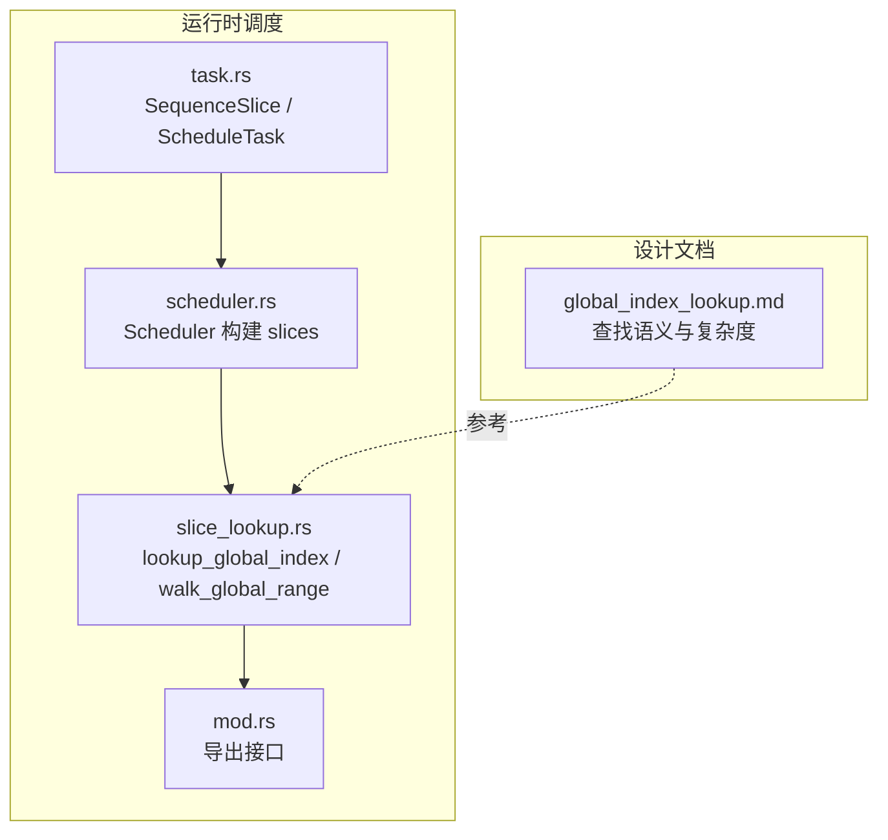
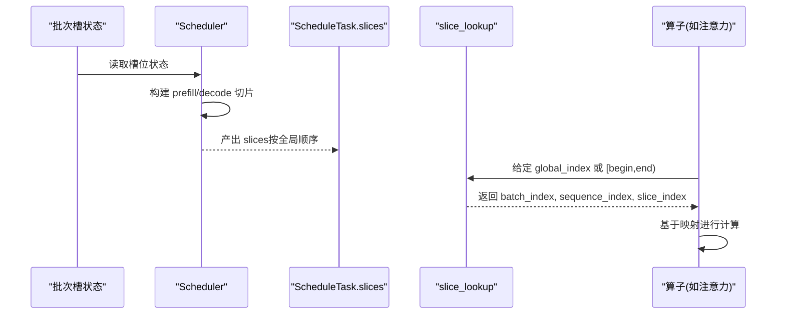
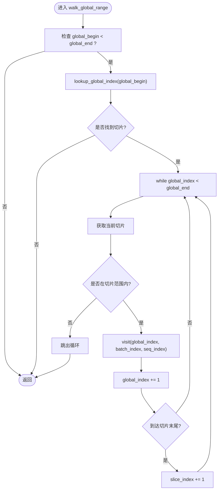
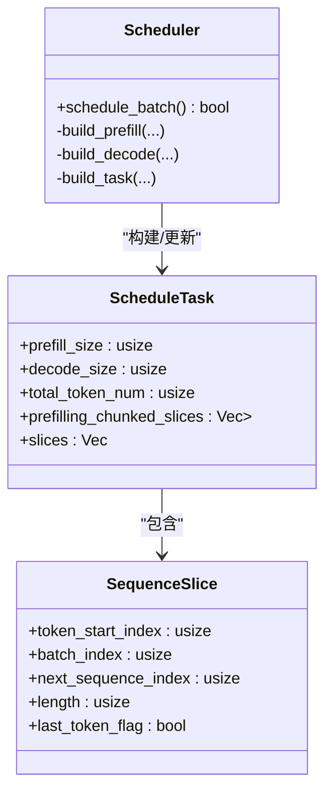
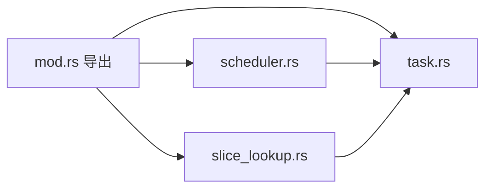
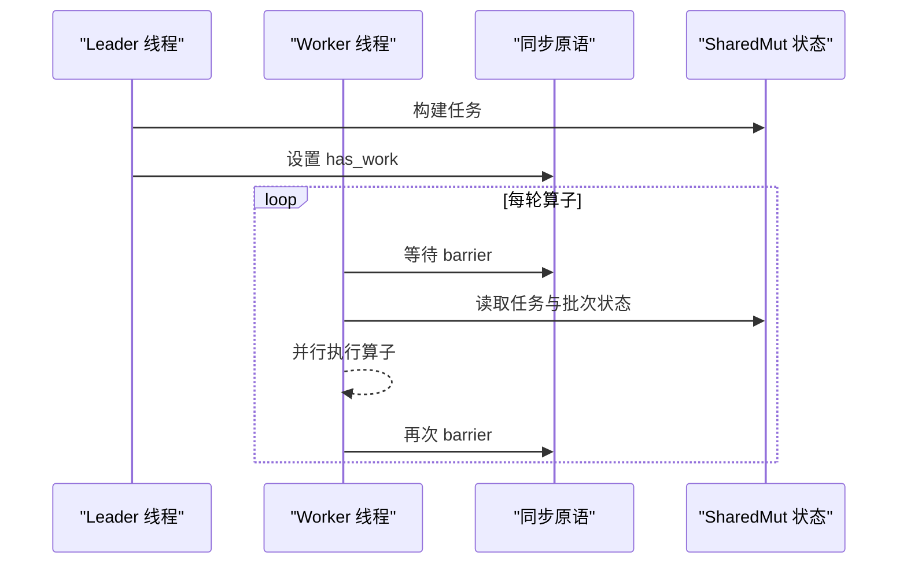

# 切片查找

<cite>
**本文引用的文件**   
- [src/runtime/scheduler/slice_lookup.rs](file://src/runtime/scheduler/slice_lookup.rs)
- [src/runtime/scheduler/task.rs](file://src/runtime/scheduler/task.rs)
- [src/runtime/scheduler/scheduler.rs](file://src/runtime/scheduler/scheduler.rs)
- [src/runtime/scheduler/mod.rs](file://src/runtime/scheduler/mod.rs)
- [docs/design/operators/global_index_lookup.md](file://docs/design/operators/global_index_lookup.md)
- [docs/configuration/optimization.md](file://docs/configuration/optimization.md)
- [src/mem_mgr/allocator.rs](file://src/mem_mgr/allocator.rs)
- [src/mem_mgr/mem_pool.rs](file://src/mem_mgr/mem_pool.rs)
- [src/runtime/executor/sync.rs](file://src/runtime/executor/sync.rs)
- [docs/design/runtime/executor.md](file://docs/design/runtime/executor.md)
- [docs/design/runtime/session_management.md](file://docs/design/runtime/session_management.md)
- [README.md](file://README.md)
</cite>

## 目录
1. [简介](#简介)
2. [项目结构](#项目结构)
3. [核心组件](#核心组件)
4. [架构总览](#架构总览)
5. [详细组件分析](#详细组件分析)
6. [依赖关系分析](#依赖关系分析)
7. [性能与内存布局优化](#性能与内存布局优化)
8. [并发访问与一致性](#并发访问与一致性)
9. [配置选项与调优](#配置选项与调优)
10. [基准测试与分析](#基准测试与分析)
11. [故障排查指南](#故障排查指南)
12. [结论](#结论)

## 简介
本文件围绕“切片查找系统”展开，聚焦全局索引映射与切片定位算法的实现原理、内存布局与缓存友好的数据访问模式、并发访问下的数据一致性与锁机制、以及性能优化与调优方法。该系统以调度器产出的 SequenceSlice 列表为输入，将当前轮次的“全局 token 位置”反向映射到具体序列的批次槽位与序列内位置，从而支撑注意力等算子在多核 CPU 上的高效执行。

## 项目结构
切片查找相关代码位于运行时调度子系统中，包含任务数据结构、调度器构建逻辑、以及全局索引查找工具函数；配套的设计文档对查找语义与复杂度进行了说明。

图表来源
- [src/runtime/scheduler/task.rs:1-73](file://src/runtime/scheduler/task.rs#L1-L73)
- [src/runtime/scheduler/scheduler.rs:1-223](file://src/runtime/scheduler/scheduler.rs#L1-L223)
- [src/runtime/scheduler/slice_lookup.rs:1-230](file://src/runtime/scheduler/slice_lookup.rs#L1-L230)
- [src/runtime/scheduler/mod.rs:1-7](file://src/runtime/scheduler/mod.rs#L1-L7)
- [docs/design/operators/global_index_lookup.md:1-270](file://docs/design/operators/global_index_lookup.md#L1-L270)

章节来源
- [src/runtime/scheduler/mod.rs:1-7](file://src/runtime/scheduler/mod.rs#L1-L7)
- [src/runtime/scheduler/task.rs:1-73](file://src/runtime/scheduler/task.rs#L1-L73)
- [src/runtime/scheduler/scheduler.rs:1-223](file://src/runtime/scheduler/scheduler.rs#L1-L223)
- [src/runtime/scheduler/slice_lookup.rs:1-230](file://src/runtime/scheduler/slice_lookup.rs#L1-L230)
- [docs/design/operators/global_index_lookup.md:1-270](file://docs/design/operators/global_index_lookup.md#L1-L270)

## 核心组件
- SequenceSlice：描述一个连续的全局 token 区间，包含其在全局空间中的起始位置、所属批次槽位、在目标序列内的起始位置、长度以及是否为本轮最后一个 token 的标志。
- ScheduleTask：承载一次调度批次的任务信息，包括 prefill/decode 规模、按线程分片的预填充切片集合、以及本轮参与计算的 slices 列表。
- Scheduler：从批次槽状态中构建 ScheduleTask，生成 slices 并维护 per-thread 的预填充分片。
- 全局索引查找：提供单点查询与连续范围遍历两种能力，用于将全局 token 位置映射回批次槽与序列内位置。

章节来源
- [src/runtime/scheduler/task.rs:1-73](file://src/runtime/scheduler/task.rs#L1-L73)
- [src/runtime/scheduler/scheduler.rs:1-223](file://src/runtime/scheduler/scheduler.rs#L1-L223)
- [src/runtime/scheduler/slice_lookup.rs:1-230](file://src/runtime/scheduler/slice_lookup.rs#L1-L230)

## 架构总览
下图展示了从调度器构建 slices 到全局索引查找再到算子执行的端到端流程。

图表来源
- [src/runtime/scheduler/scheduler.rs:84-223](file://src/runtime/scheduler/scheduler.rs#L84-L223)
- [src/runtime/scheduler/slice_lookup.rs:14-71](file://src/runtime/scheduler/slice_lookup.rs#L14-L71)
- [docs/design/operators/global_index_lookup.md:105-176](file://docs/design/operators/global_index_lookup.md#L105-L176)

## 详细组件分析

### 数据结构与职责
- SequenceSlice
  - 字段含义：token_start_index（全局起始）、batch_index（批次槽）、next_sequence_index（序列内起始）、length（长度）、last_token_flag（是否为该序列在本轮的最后一个 token）。
  - 用途：作为“全局 token 区间表”的最小单元，保证按全局位置有序且无重叠。
- ScheduleTask
  - 字段含义：prefill_size、decode_size、total_token_num、prefilling_chunked_slices（每线程的分片）、slices（本轮参与计算的切片列表）。
  - 用途：聚合一次调度批次的全部切片信息，供后续算子消费。

章节来源
- [src/runtime/scheduler/task.rs:1-73](file://src/runtime/scheduler/task.rs#L1-L73)

### 全局索引查找算法
- 单点查询 lookup_global_index
  - 输入：有序的 slices 数组与待查 global_index。
  - 思路：利用 partition_point 找到第一个右边界大于等于 global_index 的候选切片，再校验左边界，若命中则计算序列内偏移。
  - 输出：DecodeLookupResult（包含 batch_index、next_sequence_index、slice_index）。
- 连续范围遍历 walk_global_range
  - 输入：[global_begin, global_end)。
  - 思路：先定位起点所在切片，随后在当前切片内顺序推进，跨切片时递增 slice_index，直至覆盖整个范围。
  - 适用场景：多线程下每个线程负责一段连续全局区间，避免重复定位。

图表来源
- [src/runtime/scheduler/slice_lookup.rs:32-71](file://src/runtime/scheduler/slice_lookup.rs#L32-L71)
- [docs/design/operators/global_index_lookup.md:136-176](file://docs/design/operators/global_index_lookup.md#L136-L176)

章节来源
- [src/runtime/scheduler/slice_lookup.rs:14-71](file://src/runtime/scheduler/slice_lookup.rs#L14-L71)
- [docs/design/operators/global_index_lookup.md:105-176](file://docs/design/operators/global_index_lookup.md#L105-L176)

### 调度器构建 slices 的流程
- build_prefill
  - 统计可调度预填充 token 总量，按线程配额切分为 per-thread 的 prefilling_chunked_slices，同时向 slices 追加代表完整预填充区间的条目。
- build_decode
  - 扫描处于 decode 阶段的槽位，为每个槽位生成 length=1 的切片，并按全局顺序写入 slices。
- 混合模式
  - 当同一轮既有 prefill 又有 decode 时，prefill 切片在前，decode 切片在后，保持全局索引严格递增。

图表来源
- [src/runtime/scheduler/scheduler.rs:84-223](file://src/runtime/scheduler/scheduler.rs#L84-L223)
- [src/runtime/scheduler/task.rs:1-73](file://src/runtime/scheduler/task.rs#L1-L73)

章节来源
- [src/runtime/scheduler/scheduler.rs:84-223](file://src/runtime/scheduler/scheduler.rs#L84-L223)

## 依赖关系分析
- 模块导出
  - mod.rs 统一导出 SequenceSlice、ScheduleTask、Scheduler 及查找函数，便于上层使用。
- 调用链
  - 后端入口构造 Scheduler，传入批次槽状态；Scheduler 生成 ScheduleTask.slices；算子通过 slice_lookup 完成全局索引到批次/序列位置的映射。

图表来源
- [src/runtime/scheduler/mod.rs:1-7](file://src/runtime/scheduler/mod.rs#L1-L7)
- [src/runtime/scheduler/task.rs:1-73](file://src/runtime/scheduler/task.rs#L1-L73)
- [src/runtime/scheduler/scheduler.rs:1-223](file://src/runtime/scheduler/scheduler.rs#L1-L223)
- [src/runtime/scheduler/slice_lookup.rs:1-230](file://src/runtime/scheduler/slice_lookup.rs#L1-L230)

章节来源
- [src/runtime/scheduler/mod.rs:1-7](file://src/runtime/scheduler/mod.rs#L1-L7)

## 性能与内存布局优化
- 维度优先与静态 KV 布局
  - 采用固定形状、维度优先的 KV 张量布局，直接按坐标访问，减少元数据与动态分配开销，提升 TLB 与缓存命中率。
- 逐 head 顺序计算
  - Prefill 阶段按 attention head 顺序处理，使单个 head 的 KV 数据尽可能驻留于 CPU 缓存，提高时间局部性与空间局部性。
- 连续访问路径
  - 切片列表按全局位置有序，walk_global_range 实现“一次定位、顺序推进”，降低重复定位成本。
- 对齐与 SIMD
  - 使用 64 字节对齐的内存分配器，利于 AVX512 等向量指令；内存池支持共享与子视图，减少拷贝与碎片。

章节来源
- [README.md:47-182](file://README.md#L47-L182)
- [src/mem_mgr/allocator.rs:1-56](file://src/mem_mgr/allocator.rs#L1-L56)
- [src/mem_mgr/mem_pool.rs:1-49](file://src/mem_mgr/mem_pool.rs#L1-L49)
- [src/runtime/scheduler/slice_lookup.rs:32-71](file://src/runtime/scheduler/slice_lookup.rs#L32-L71)

## 并发访问与一致性
- 调度器与任务
  - 使用共享可变包装器保护批次槽状态与任务对象，确保多线程安全访问。
- 执行模型
  - 采用 leader-follower 模型：仅 leader 线程负责调度与写入任务，其余 worker 线程消费不可变任务视图，减少竞争。
- 同步原语
  - 自适应自旋等待与屏障，结合指数退避策略，平衡低延迟与 CPU 占用。
- 会话管理
  - 会话槽分配与释放通过互斥锁保护，LRU 管理与可用槽池提升分配效率。

图表来源
- [docs/design/runtime/executor.md:189-248](file://docs/design/runtime/executor.md#L189-L248)
- [src/runtime/executor/sync.rs:1-55](file://src/runtime/executor/sync.rs#L1-L55)
- [docs/design/runtime/session_management.md:480-518](file://docs/design/runtime/session_management.md#L480-L518)

章节来源
- [docs/design/runtime/executor.md:189-248](file://docs/design/runtime/executor.md#L189-L248)
- [src/runtime/executor/sync.rs:1-55](file://src/runtime/executor/sync.rs#L1-L55)
- [docs/design/runtime/session_management.md:480-518](file://docs/design/runtime/session_management.md#L480-L518)

## 配置选项与调优
- 关键环境变量
  - ELLM_BATCH_SIZE：最大并发请求数（批次槽数量）。
  - ELLM_SEQUENCE_LENGTH：每槽最大 token 序列长度。
  - ELLM_CHUNK_SIZE：每轮预填充的最大 token 数，也用作 token_threshold。
  - ELLM_SCHEDULE_TIMEOUT_MS：触发调度的超时窗口（毫秒）。
- 调优建议
  - 低延迟：减小 chunk_size，缩短每轮预填充 token 数，提升响应速度。
  - 高吞吐：增大 chunk_size 与 batch_size，提高批次效率。
  - 长上下文：增大 sequence_length，注意内存线性增长。
  - 流量波动：减小 schedule_timeout_ms，保障低负载下的调度延迟。
  - 计算密集：runner_count 自动设置为 CPU 核心数减 2（异步线程），由 determine_thread_config 决定。

章节来源
- [docs/configuration/optimization.md:1-95](file://docs/configuration/optimization.md#L1-L95)

## 基准测试与分析
- 现有基准
  - 张量矩阵乘性能测试提供了并行执行与 GFLOPS 打印示例，可作为整体性能评估参考。
- 切片查找复杂度
  - 单点查询：O(log N)，N 为 slices 长度。
  - 连续范围查询：O(K + S)，K 为实际处理的 token 数，S 为跨越的切片数。
- 建议的基准方向
  - 针对 lookup_global_index 与 walk_global_range 在不同 N、K、S 组合下的耗时测量。
  - 对比不同 chunk_size、batch_size 对 slices 规模与查找开销的影响。
  - 结合注意力算子的端到端 TTFT 与解码吞吐，评估切片查找在整体流水线中的占比。

章节来源
- [src/tensor/tests/performance.rs:307-388](file://src/tensor/tests/performance.rs#L307-L388)
- [docs/design/operators/global_index_lookup.md:232-256](file://docs/design/operators/global_index_lookup.md#L232-L256)

## 故障排查指南
- 常见错误与定位
  - 越界与空范围：当 global_index 不在任何切片范围内或范围为空时，查找返回 None。需检查调度器是否正确生成 slices 以及全局索引是否越界。
  - 非单调切片：确保 slices 的 token_start_index 严格递增，否则二分定位可能失效。
  - 并发写冲突：确认只有 leader 线程写入任务与批次状态，worker 线程只读。
- 调试手段
  - 打印 slices 列表与 total_sequence_length，验证全局索引连续性。
  - 在 walk_global_range 的 visit 回调中记录 (global_index, batch_index, sequence_index) 三元组，核对映射正确性。
  - 使用自适应等待与屏障日志，观察同步点是否存在异常阻塞。

章节来源
- [src/runtime/scheduler/slice_lookup.rs:14-71](file://src/runtime/scheduler/slice_lookup.rs#L14-L71)
- [src/runtime/scheduler/scheduler.rs:84-223](file://src/runtime/scheduler/scheduler.rs#L84-L223)
- [src/runtime/executor/sync.rs:1-55](file://src/runtime/executor/sync.rs#L1-L55)

## 结论
切片查找系统以有序切片表为核心，通过单点定位与连续范围遍历相结合的策略，实现了高效的全局索引到批次/序列位置的映射。配合维度优先的 KV 布局、逐 head 的顺序计算与对齐内存分配，系统在 CPU 服务器上获得了良好的缓存友好性与执行稳定性。通过合理的配置与调优，可在低延迟与高吞吐之间取得平衡。未来可进一步引入更细粒度的基准测试与监控指标，持续优化查找与调度路径的性能表现。