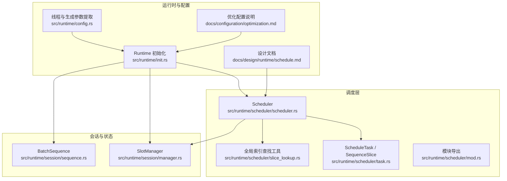
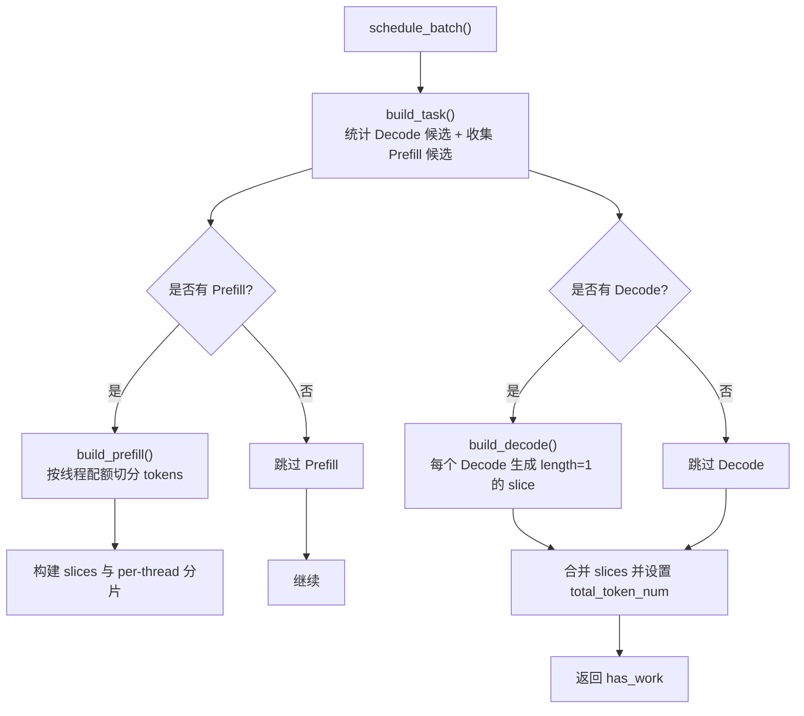
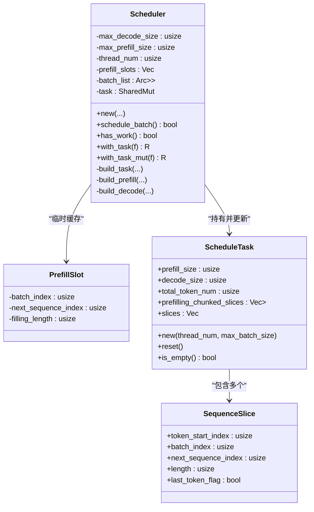
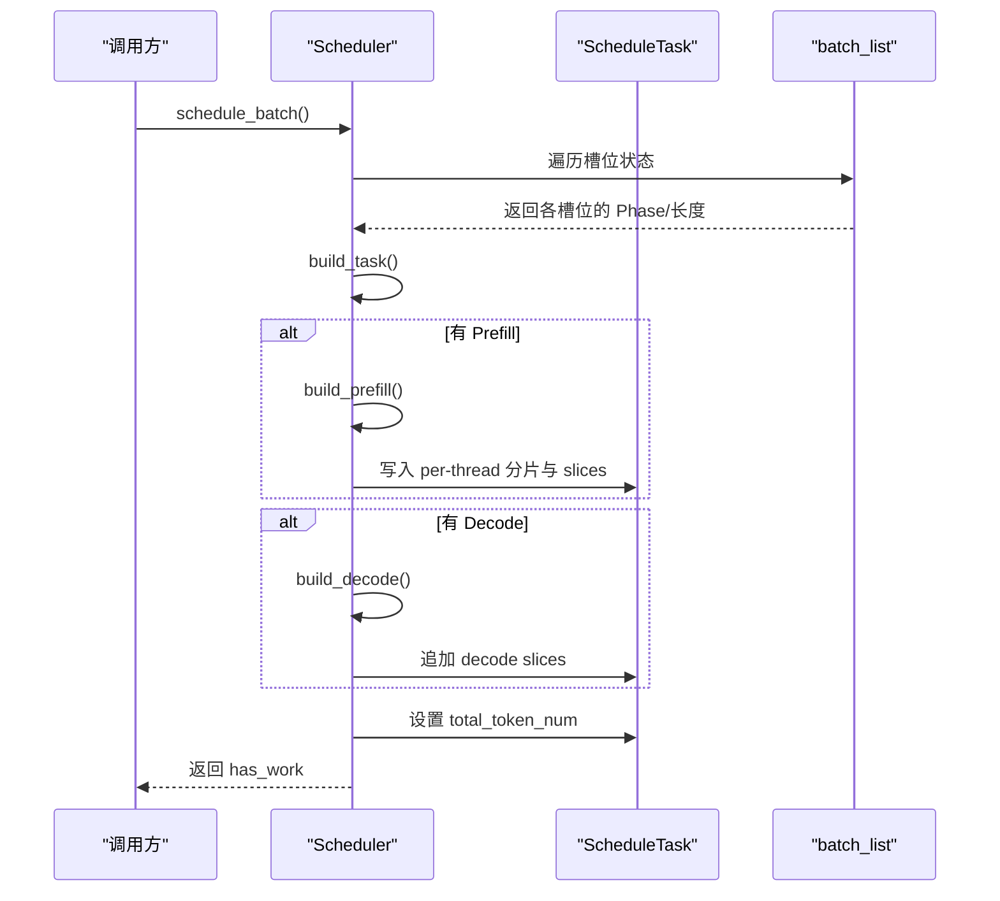
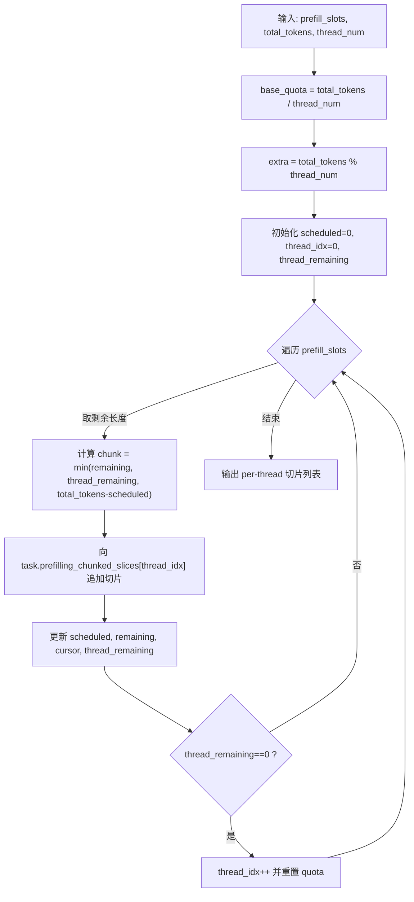
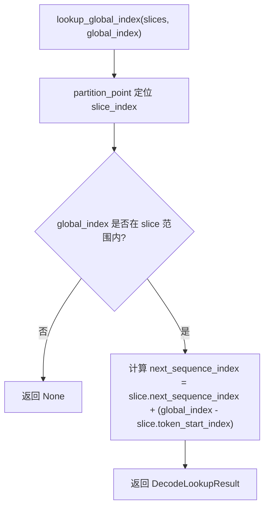
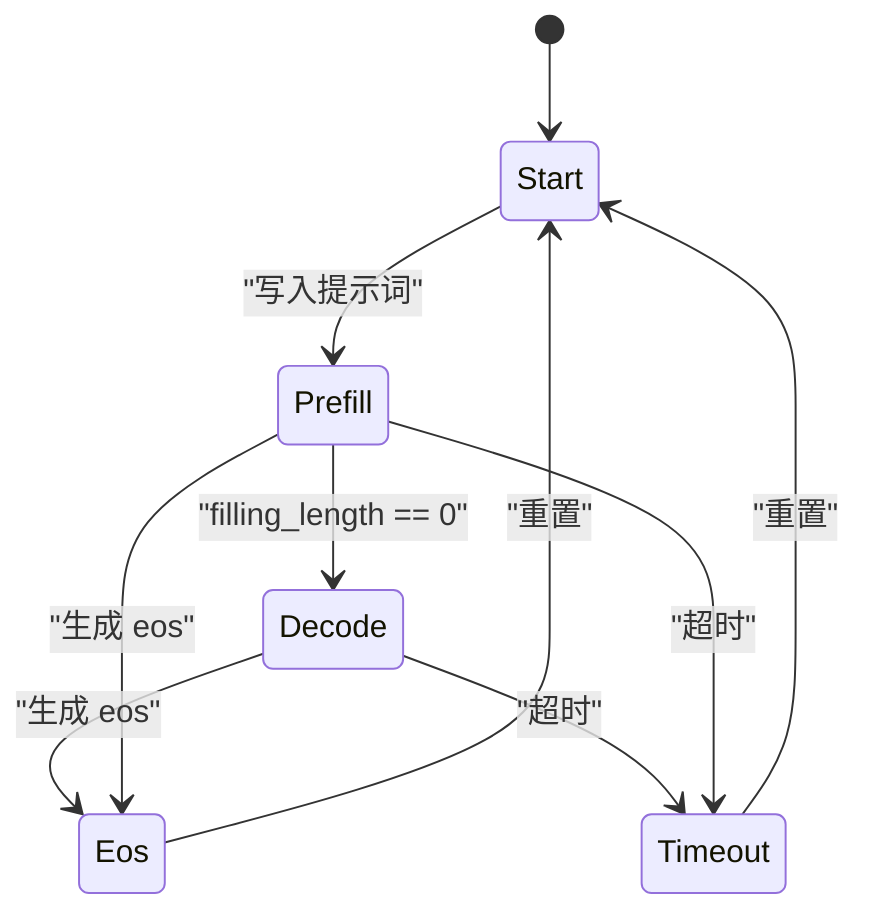
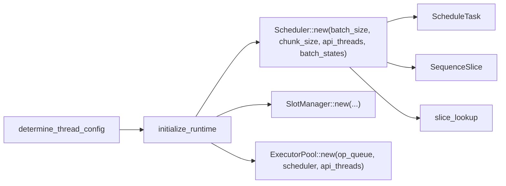

# 调度算法

<cite>
**本文引用的文件**   
- [src/runtime/scheduler/mod.rs](file://src/runtime/scheduler/mod.rs)
- [src/runtime/scheduler/scheduler.rs](file://src/runtime/scheduler/scheduler.rs)
- [src/runtime/scheduler/task.rs](file://src/runtime/scheduler/task.rs)
- [src/runtime/scheduler/slice_lookup.rs](file://src/runtime/scheduler/slice_lookup.rs)
- [src/runtime/config.rs](file://src/runtime/config.rs)
- [src/runtime/init.rs](file://src/runtime/init.rs)
- [src/runtime/session/manager.rs](file://src/runtime/session/manager.rs)
- [src/runtime/session/sequence.rs](file://src/runtime/session/sequence.rs)
- [docs/design/runtime/schedule.md](file://docs/design/runtime/schedule.md)
- [docs/configuration/optimization.md](file://docs/configuration/optimization.md)
</cite>

## 目录
1. [简介](#简介)
2. [项目结构](#项目结构)
3. [核心组件](#核心组件)
4. [架构总览](#架构总览)
5. [详细组件分析](#详细组件分析)
6. [依赖关系分析](#依赖关系分析)
7. [性能与复杂度分析](#性能与复杂度分析)
8. [配置与调优指南](#配置与调优指南)
9. [故障排查](#故障排查)
10. [结论](#结论)

## 简介
本文件系统性阐述 eLLM 推理引擎中的任务调度策略，重点覆盖：
- 优先级队列与任务选择（Prefill 优先于 Decode）
- 负载均衡算法（按线程配额切分 Prefill Token）
- 延迟优化机制（事件驱动触发、超时兜底、广播分发）
- 调度器核心决策逻辑（任务构建、资源分配、执行顺序）
- 不同策略的适用场景与性能特征
- 调度参数配置与调优建议
- 时间/空间复杂度分析

## 项目结构
调度相关代码位于 runtime/scheduler 模块，配合 session 管理、运行时初始化与配置模块共同工作。

图表来源
- [src/runtime/scheduler/scheduler.rs:1-223](file://src/runtime/scheduler/scheduler.rs#L1-L223)
- [src/runtime/scheduler/task.rs:1-73](file://src/runtime/scheduler/task.rs#L1-L73)
- [src/runtime/scheduler/slice_lookup.rs:1-230](file://src/runtime/scheduler/slice_lookup.rs#L1-L230)
- [src/runtime/scheduler/mod.rs:1-8](file://src/runtime/scheduler/mod.rs#L1-L8)
- [src/runtime/session/manager.rs:1-284](file://src/runtime/session/manager.rs#L1-L284)
- [src/runtime/session/sequence.rs:1-182](file://src/runtime/session/sequence.rs#L1-L182)
- [src/runtime/init.rs:1-136](file://src/runtime/init.rs#L1-L136)
- [src/runtime/config.rs:1-105](file://src/runtime/config.rs#L1-L105)
- [docs/design/runtime/schedule.md:1-678](file://docs/design/runtime/schedule.md#L1-L678)
- [docs/configuration/optimization.md:1-38](file://docs/configuration/optimization.md#L1-L38)

章节来源
- [src/runtime/scheduler/mod.rs:1-8](file://src/runtime/scheduler/mod.rs#L1-L8)
- [src/runtime/scheduler/scheduler.rs:1-223](file://src/runtime/scheduler/scheduler.rs#L1-L223)
- [src/runtime/scheduler/task.rs:1-73](file://src/runtime/scheduler/task.rs#L1-L73)
- [src/runtime/scheduler/slice_lookup.rs:1-230](file://src/runtime/scheduler/slice_lookup.rs#L1-L230)
- [src/runtime/session/manager.rs:1-284](file://src/runtime/session/manager.rs#L1-L284)
- [src/runtime/session/sequence.rs:1-182](file://src/runtime/session/sequence.rs#L1-L182)
- [src/runtime/init.rs:1-136](file://src/runtime/init.rs#L1-L136)
- [src/runtime/config.rs:1-105](file://src/runtime/config.rs#L1-L105)
- [docs/design/runtime/schedule.md:1-678](file://docs/design/runtime/schedule.md#L1-L678)
- [docs/configuration/optimization.md:1-38](file://docs/configuration/optimization.md#L1-L38)

## 核心组件
- Scheduler：负责扫描批处理槽位状态，决定当前轮次执行模式（Prefill/Decode/Mixed），并构建 ScheduleTask。
- ScheduleTask：承载一次调度任务的元数据与切片列表，包括预填充与解码切片、每线程分片等。
- SequenceSlice：描述一个“序列切片”的全局偏移、所属批次索引、在序列中的起始位置、长度及是否最后一个 token。
- SliceLookup：提供基于 slices 的全局索引到具体 batch_index 和 next_sequence_index 的反查工具。
- SlotManager/Session：维护槽位生命周期、LRU 回收、KV 缓存写入与读取，为调度器提供 Phase 信息。
- Runtime 初始化与配置：根据硬件与请求负载确定线程数、batch_size、chunk_size 等关键调度参数。

章节来源
- [src/runtime/scheduler/scheduler.rs:15-223](file://src/runtime/scheduler/scheduler.rs#L15-L223)
- [src/runtime/scheduler/task.rs:1-73](file://src/runtime/scheduler/task.rs#L1-L73)
- [src/runtime/scheduler/slice_lookup.rs:1-230](file://src/runtime/scheduler/slice_lookup.rs#L1-L230)
- [src/runtime/session/manager.rs:1-284](file://src/runtime/session/manager.rs#L1-L284)
- [src/runtime/init.rs:70-124](file://src/runtime/init.rs#L70-L124)
- [src/runtime/config.rs:62-105](file://src/runtime/config.rs#L62-L105)

## 架构总览
调度流程由 Scheduler 统一入口 schedule_batch 驱动，内部通过 build_task 完成：
- 统计可执行的 Decode 数量（受 max_decode_size 限制）
- 收集所有处于 Prefill 阶段的槽位，计算待处理的总 token 数（受 max_prefill_size 限制）
- 若存在 Prefill，则调用 build_prefill 进行跨线程切分；否则跳过
- 若存在 Decode，则调用 build_decode 构造长度为 1 的 decode 切片
- 最终将 prefill 与 decode 切片合并为统一的 slices 列表，并按 prefill 在前、decode 在后的顺序排列

图表来源
- [src/runtime/scheduler/scheduler.rs:66-131](file://src/runtime/scheduler/scheduler.rs#L66-L131)
- [src/runtime/scheduler/scheduler.rs:133-222](file://src/runtime/scheduler/scheduler.rs#L133-L222)

章节来源
- [src/runtime/scheduler/scheduler.rs:66-131](file://src/runtime/scheduler/scheduler.rs#L66-L131)
- [src/runtime/scheduler/scheduler.rs:133-222](file://src/runtime/scheduler/scheduler.rs#L133-L222)

## 详细组件分析

### 调度器类与数据结构

图表来源
- [src/runtime/scheduler/scheduler.rs:15-223](file://src/runtime/scheduler/scheduler.rs#L15-L223)
- [src/runtime/scheduler/task.rs:1-73](file://src/runtime/scheduler/task.rs#L1-L73)

章节来源
- [src/runtime/scheduler/scheduler.rs:15-223](file://src/runtime/scheduler/scheduler.rs#L15-L223)
- [src/runtime/scheduler/task.rs:1-73](file://src/runtime/scheduler/task.rs#L1-L73)

### 任务构建与执行顺序
- 任务选择与优先级：当存在任何 Prefill 时，优先执行 Prefill；若无 Prefill 但有 Decode，则执行 Decode；否则空闲。
- 执行顺序：同一轮次的 slices 列表中，Prefill 切片在前，Decode 切片在后，确保 KV 缓存先被填充再被读取。
- 混合模式：允许在同一轮中同时包含 Prefill 与 Decode，但 Prefill 总量受 max_prefill_size 约束，Decode 数量受 max_decode_size 约束。

图表来源
- [src/runtime/scheduler/scheduler.rs:66-131](file://src/runtime/scheduler/scheduler.rs#L66-L131)
- [src/runtime/scheduler/scheduler.rs:133-222](file://src/runtime/scheduler/scheduler.rs#L133-L222)

章节来源
- [src/runtime/scheduler/scheduler.rs:66-131](file://src/runtime/scheduler/scheduler.rs#L66-L131)
- [src/runtime/scheduler/scheduler.rs:133-222](file://src/runtime/scheduler/scheduler.rs#L133-L222)

### 负载均衡算法（Prefill 跨线程切分）
- 目标：将一轮内要处理的总 token 数均匀分配到 thread_num 个线程上，避免热点。
- 方法：
  - 计算 base_quota = total_tokens / thread_num，extra = total_tokens % thread_num
  - 前 extra 个线程获得 base_quota+1，其余获得 base_quota
  - 按顺序遍历 Prefill 候选，将剩余未分配的 token 按线程配额切分为 SequenceSlice，记录 token_start_index 以维持全局连续布局
- 结果：prefilling_chunked_slices[thread_idx] 保存该线程负责的切片序列，保证整体 token 流连续且无重叠。

图表来源
- [src/runtime/scheduler/scheduler.rs:133-202](file://src/runtime/scheduler/scheduler.rs#L133-L202)

章节来源
- [src/runtime/scheduler/scheduler.rs:133-202](file://src/runtime/scheduler/scheduler.rs#L133-L202)

### 全局索引查找与范围遍历
- lookup_global_index：给定全局 token 索引，二分定位其所在 slice，并返回对应的 batch_index 与 next_sequence_index。
- walk_global_range：按全局区间遍历，对每个 token 回调访问者，便于算子侧高效读取。

图表来源
- [src/runtime/scheduler/slice_lookup.rs:14-30](file://src/runtime/scheduler/slice_lookup.rs#L14-L30)

章节来源
- [src/runtime/scheduler/slice_lookup.rs:14-30](file://src/runtime/scheduler/slice_lookup.rs#L14-L30)
- [src/runtime/scheduler/slice_lookup.rs:32-71](file://src/runtime/scheduler/slice_lookup.rs#L32-L71)

### 会话与槽位状态（Phase 驱动）
- SlotState 的 phase 字段驱动调度：Start/Prefill/Decode/Eos/Timeout。
- SlotManager 负责：
  - 新请求写入 prompt 并进入 Prefill
  - 自动推进 sequence_index 与 filling_length，当 filling_length 归零时转入 Decode
  - 生成 eos 后进入 Eos，随后释放或保留（Reusable 模式）

图表来源
- [src/runtime/session/manager.rs:1-284](file://src/runtime/session/manager.rs#L1-L284)

章节来源
- [src/runtime/session/manager.rs:1-284](file://src/runtime/session/manager.rs#L1-L284)

## 依赖关系分析
- Scheduler 依赖：
  - batch_list（Arc<SharedMut<Vec<SlotState>>>）用于读取槽位状态
  - ScheduleTask（SharedMut）用于写入调度计划
  - 线程数 thread_num 来自运行时配置
- Session 层依赖：
  - BatchSequence 负责 token 写入与解码
  - SlotManager 维护 LRU 与预留槽位，控制复用与回收
- 初始化流程：
  - determine_thread_config 根据 CPU 核心数与 API 线程数计算 runner_count
  - initialize_runtime 组装 Scheduler、SlotManager、ExecutorPool 并启动

图表来源
- [src/runtime/config.rs:62-105](file://src/runtime/config.rs#L62-L105)
- [src/runtime/init.rs:70-124](file://src/runtime/init.rs#L70-L124)
- [src/runtime/scheduler/scheduler.rs:27-43](file://src/runtime/scheduler/scheduler.rs#L27-L43)

章节来源
- [src/runtime/config.rs:62-105](file://src/runtime/config.rs#L62-L105)
- [src/runtime/init.rs:70-124](file://src/runtime/init.rs#L70-L124)
- [src/runtime/scheduler/scheduler.rs:27-43](file://src/runtime/scheduler/scheduler.rs#L27-L43)

## 性能与复杂度分析
- 时间复杂度
  - schedule_batch：O(N)，N 为 batch_list 长度，主要开销在于遍历槽位与构建 slices
  - build_prefill：O(P + T)，P 为 Prefill 候选数，T 为线程数，主要是按配额切分与追加切片
  - build_decode：O(D)，D 为 Decode 候选数，固定长度 1 的切片追加
  - lookup_global_index：O(log S)，S 为 slices 数量，使用 partition_point 二分定位
  - walk_global_range：O(K)，K 为遍历的 token 总数
- 空间复杂度
  - ScheduleTask.slices：O(S)，S 为 slices 数量（Prefill + Decode）
  - prefilling_chunked_slices：O(S)，按线程维度存储切片副本
  - prefill_slots：O(P)，临时缓存 Prefill 候选
- 吞吐与延迟权衡
  - 增大 max_prefill_size（chunk_size）提升批内并行度，降低首 token 延迟波动，但可能增加单轮耗时
  - 增大 max_decode_size 提高并发解码吞吐，但需关注显存与 KV 缓存压力
  - 合理设置 thread_num 使每线程配额均衡，减少长尾

章节来源
- [src/runtime/scheduler/scheduler.rs:66-222](file://src/runtime/scheduler/scheduler.rs#L66-L222)
- [src/runtime/scheduler/slice_lookup.rs:14-71](file://src/runtime/scheduler/slice_lookup.rs#L14-L71)

## 配置与调优指南
- 可调参数（环境变量）
  - ELLM_BATCH_SIZE：最大并发请求数（槽位数）
  - ELLM_SEQUENCE_LENGTH：每槽最大 token 序列长度
  - ELLM_CHUNK_SIZE：每轮 Prefill 的最大 token 数，也作为 token_threshold
  - ELLM_SCHEDULE_TIMEOUT_MS：调度超时窗口（毫秒），低流量下保障延迟
- 推荐策略
  - 低延迟：减小 chunk_size，缩短单轮 Prefill 时长
  - 高吞吐：增大 chunk_size 与 batch_size，提升批内并行
  - 长上下文：增大 sequence_length，注意内存线性增长
  - 流量波动：减小 schedule_timeout_ms，保证低负载下的及时调度
- 线程与运行环境
  - 线程数由 determine_thread_config 自动推导，通常等于物理核心数减去异步线程
  - 可通过 GenerationConfig.thread_num 指定上限，实际受物理核心限制

章节来源
- [docs/configuration/optimization.md:1-38](file://docs/configuration/optimization.md#L1-L38)
- [src/runtime/config.rs:62-105](file://src/runtime/config.rs#L62-L105)
- [docs/design/runtime/schedule.md:401-502](file://docs/design/runtime/schedule.md#L401-L502)

## 故障排查
- 常见问题
  - 调度无任务：检查 batch_list 是否为空或全部处于 Eos/Timeout
  - Prefill 不推进：确认 filling_length 是否正确递减，phase 是否从 Prefill 转为 Decode
  - Decode 数量受限：核对 max_decode_size 与实际 Decode 候选数
  - 全局索引越界：校验 slices 的 token_start_index 与 length 连续性
- 调试建议
  - 打印 ScheduleTask 的 prefill_size、decode_size、total_token_num
  - 验证 prefilling_chunked_slices 的 token 总和与 total_token_num 一致
  - 使用 lookup_global_index 随机采样验证映射正确性

章节来源
- [src/runtime/scheduler/scheduler.rs:225-735](file://src/runtime/scheduler/scheduler.rs#L225-L735)
- [src/runtime/scheduler/slice_lookup.rs:73-229](file://src/runtime/scheduler/slice_lookup.rs#L73-L229)

## 结论
eLLM 的调度器采用“Prefill 优先、Decode 补充”的策略，结合按线程配额切分的负载均衡与事件驱动的触发机制，在保证低延迟的同时最大化吞吐。通过合理的 chunk_size、batch_size 与线程数配置，可在不同负载场景下取得良好平衡。全局索引查找工具为上层算子提供了高效的随机访问能力，进一步提升了整体执行效率。