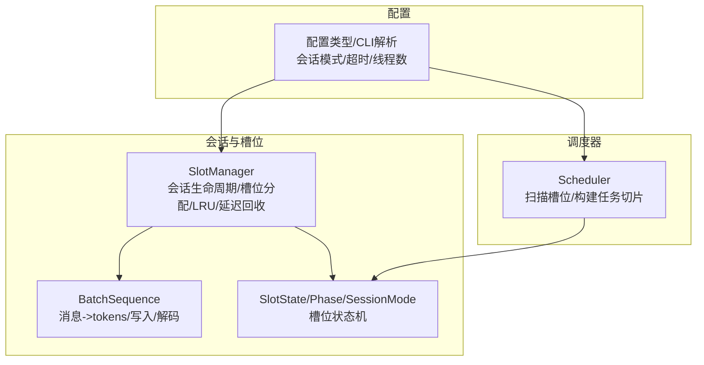
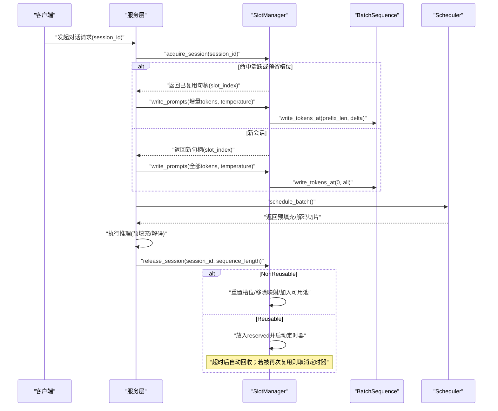
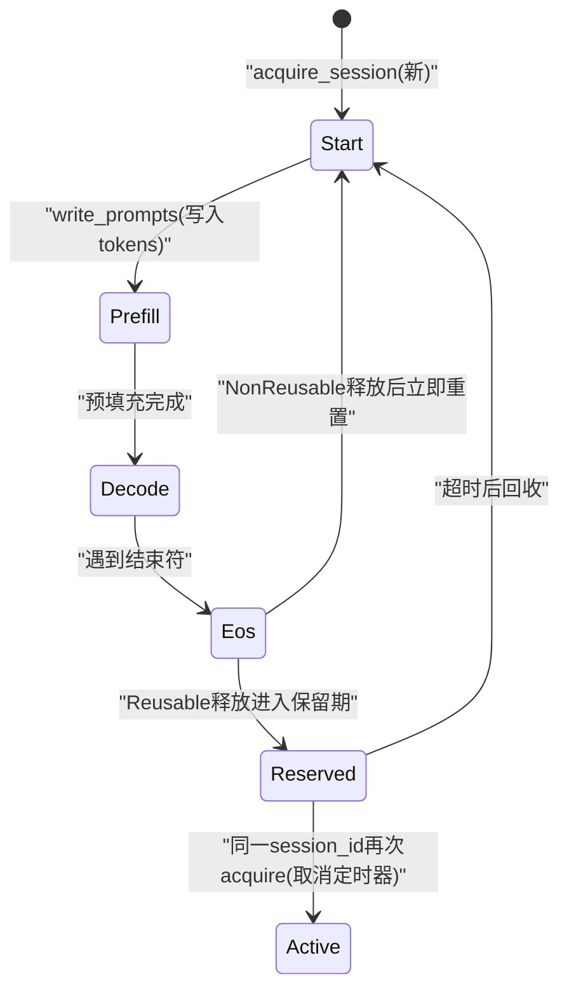
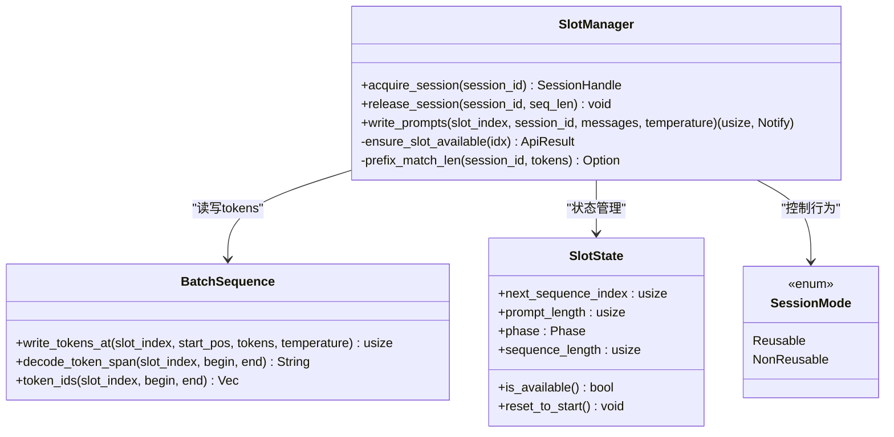
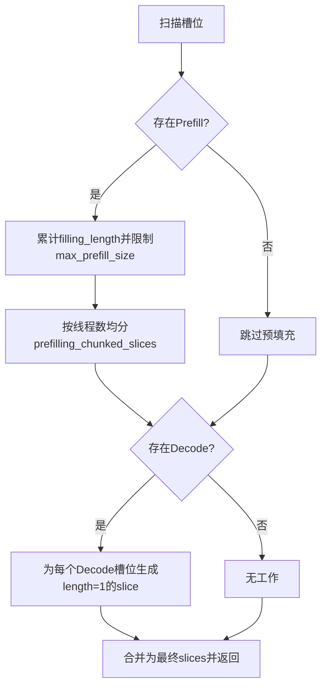
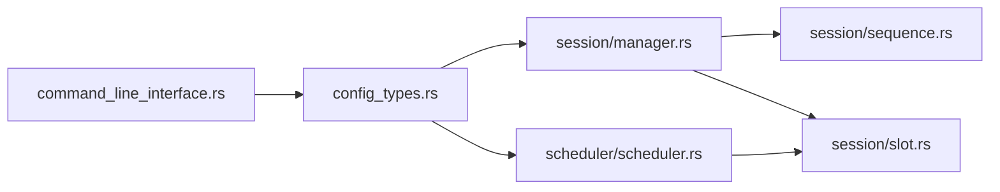

# 会话管理

<cite>
**本文引用的文件**   
- [manager.rs](file://src/runtime/session/manager.rs)
- [sequence.rs](file://src/runtime/session/sequence.rs)
- [slot.rs](file://src/runtime/session/slot.rs)
- [mod.rs](file://src/runtime/session/mod.rs)
- [scheduler.rs](file://src/runtime/scheduler/scheduler.rs)
- [config_types.rs](file://src/config/config_types.rs)
- [command_line_interface.rs](file://src/config/command_line_interface.rs)
- [session_management.md](file://docs/design/runtime/session_management.md)
- [session_lifecycle_tests.rs](file://src/runtime/tests/session_lifecycle_tests.rs)
</cite>

## 目录
1. [简介](#简介)
2. [项目结构](#项目结构)
3. [核心组件](#核心组件)
4. [架构总览](#架构总览)
5. [详细组件分析](#详细组件分析)
6. [依赖关系分析](#依赖关系分析)
7. [性能与优化建议](#性能与优化建议)
8. [故障排查指南](#故障排查指南)
9. [结论](#结论)
10. [附录](#附录)

## 简介
本文件围绕会话管理系统，系统性阐述以下主题：
- 会话生命周期：创建、更新（预填充/解码推进）、销毁的完整流程
- 槽位管理机制：槽位分配、状态跟踪、LRU淘汰、延迟回收与独占保留
- 序列管理与批处理构建：消息到token的转换、写入策略、调度切片组织
- 配置选项与性能调优：会话模式、超时、线程与批大小等
- 并发安全与资源管理最佳实践：锁粒度、原子信号、异步任务取消

## 项目结构
会话管理位于运行时子系统中，核心模块如下：
- session：会话与槽位管理、序列缓冲与分词、槽位状态机
- scheduler：根据槽位状态生成可执行的预填充与解码切片
- config：命令行与配置文件解析，映射为运行时参数

图表来源
- [manager.rs:1-284](file://src/runtime/session/manager.rs#L1-L284)
- [sequence.rs:1-182](file://src/runtime/session/sequence.rs#L1-L182)
- [slot.rs:1-90](file://src/runtime/session/slot.rs#L1-L90)
- [scheduler.rs:1-736](file://src/runtime/scheduler/scheduler.rs#L1-L736)
- [config_types.rs:150-349](file://src/config/config_types.rs#L150-L349)
- [command_line_interface.rs:150-349](file://src/config/command_line_interface.rs#L150-L349)

章节来源
- [mod.rs:1-8](file://src/runtime/session/mod.rs#L1-L8)
- [session_management.md:1-614](file://docs/design/runtime/session_management.md#L1-L614)

## 核心组件
- SlotManager：统一会话与槽位管理，负责会话获取/释放、LRU淘汰、预留槽位的延迟回收、提示词写入与增量前缀匹配。
- BatchSequence：维护批量序列缓冲区与温度数组，提供消息渲染、编码、按位置写入、片段解码能力。
- SlotState/Phase/SessionMode：槽位状态机与运行模式，驱动预填充/解码/EOS阶段流转。
- Scheduler：基于槽位状态扫描并构建预填充与解码切片，支持分片与多线程均衡。

章节来源
- [manager.rs:1-284](file://src/runtime/session/manager.rs#L1-L284)
- [sequence.rs:1-182](file://src/runtime/session/sequence.rs#L1-L182)
- [slot.rs:1-90](file://src/runtime/session/slot.rs#L1-L90)
- [scheduler.rs:1-736](file://src/runtime/scheduler/scheduler.rs#L1-L736)

## 架构总览
下图展示从请求进入、会话获取、提示词写入、调度执行到会话释放的端到端流程。

图表来源
- [manager.rs:48-133](file://src/runtime/session/manager.rs#L48-L133)
- [manager.rs:137-182](file://src/runtime/session/manager.rs#L137-L182)
- [scheduler.rs:66-131](file://src/runtime/scheduler/scheduler.rs#L66-L131)
- [sequence.rs:130-151](file://src/runtime/session/sequence.rs#L130-L151)

## 详细组件分析

### 会话生命周期管理
- 创建（acquire_session）
  - 优先检查活跃映射；其次检查预留表；最后从LRU尾部淘汰一个槽位并建立新映射。
  - 将对应槽位状态置为空闲，返回会话句柄。
- 更新（write_prompts）
  - 在可重用模式下进行前缀匹配，仅写入增量tokens；设置phase为Prefill，记录prompt长度与next_sequence_index。
  - 校验槽位可用性，确保处于Start或Eos阶段。
- 销毁（release_session）
  - NonReusable：立即重置槽位、移除映射、放回LRU前端。
  - Reusable：从映射中移除，放入reserved_slots并启动异步定时器；若超时未复用则重置并放回LRU前端；若在超时前再次acquire则取消定时器并恢复映射。

图表来源
- [slot.rs:17-64](file://src/runtime/session/slot.rs#L17-L64)
- [manager.rs:48-133](file://src/runtime/session/manager.rs#L48-L133)
- [manager.rs:137-182](file://src/runtime/session/manager.rs#L137-L182)

章节来源
- [manager.rs:48-133](file://src/runtime/session/manager.rs#L48-L133)
- [manager.rs:137-182](file://src/runtime/session/manager.rs#L137-L182)
- [slot.rs:17-64](file://src/runtime/session/slot.rs#L17-L64)

### 槽位管理机制
- 槽位分配
  - LRU列表用于快速淘汰最近最少使用的槽位；session_map维护session_id到slot_index的映射；reserved_slots保存“保留中”的槽位及取消标志。
- 状态跟踪
  - SlotState包含next_sequence_index、prompt_length、phase、sequence_length以及Notify通知对象，驱动调度器识别待处理工作。
- 资源回收
  - Reusable模式下采用异步定时器+AtomicBool实现“延迟回收”，保证保留期内该槽位对原session_id独占；非重用模式立即回收。

图表来源
- [manager.rs:17-284](file://src/runtime/session/manager.rs#L17-L284)
- [sequence.rs:10-151](file://src/runtime/session/sequence.rs#L10-L151)
- [slot.rs:17-72](file://src/runtime/session/slot.rs#L17-L72)

章节来源
- [manager.rs:17-284](file://src/runtime/session/manager.rs#L17-L284)
- [sequence.rs:10-151](file://src/runtime/session/sequence.rs#L10-L151)
- [slot.rs:17-72](file://src/runtime/session/slot.rs#L17-L72)

### 序列管理与批处理构建
- 序列管理
  - BatchSequence封装了底层连续内存缓冲区，提供按槽位偏移写入、区间读取与解码接口；同时维护每槽位的temperature。
  - write_tokens_at支持从任意start_pos写入，配合前缀匹配实现增量预填充。
- 批处理构建
  - Scheduler扫描所有槽位，收集Phase=Prefill与Decode的槽位，分别构建预填充与解码切片；支持最大token配额与线程均衡切分。
  - 输出统一的slices与prefilling_chunked_slices，供执行器并行消费。

图表来源
- [scheduler.rs:84-222](file://src/runtime/scheduler/scheduler.rs#L84-L222)
- [sequence.rs:130-151](file://src/runtime/session/sequence.rs#L130-L151)

章节来源
- [sequence.rs:10-151](file://src/runtime/session/sequence.rs#L10-L151)
- [scheduler.rs:84-222](file://src/runtime/scheduler/scheduler.rs#L84-L222)

### 并发安全与资源管理
- 并发安全
  - session_map与reserved_slots使用异步互斥保护；LRU列表使用同步互斥；槽位状态通过SharedMut访问；异步定时器通过AtomicBool实现无锁取消。
- 资源管理
  - 预留槽位在超时时才真正释放，避免频繁分配/释放开销；重用路径直接取消定时器，防止泄漏。
  - 非重用模式立即重置并回池，适合短请求或高吞吐场景。

章节来源
- [manager.rs:48-133](file://src/runtime/session/manager.rs#L48-L133)
- [manager.rs:137-182](file://src/runtime/session/manager.rs#L137-L182)
- [slot.rs:17-64](file://src/runtime/session/slot.rs#L17-L64)

## 依赖关系分析
- 模块内聚与耦合
  - session模块内部高度内聚：SlotManager协调BatchSequence与SlotState；对外暴露会话与槽位操作。
  - scheduler依赖slot状态以决定工作负载，不直接持有会话映射，降低耦合。
- 外部依赖
  - 分词与模板加载由BatchSequence负责，集中管理tokenizer与chat_template。
  - 配置项来自config_types与command_line_interface，影响会话模式与超时。

图表来源
- [command_line_interface.rs:150-349](file://src/config/command_line_interface.rs#L150-L349)
- [config_types.rs:150-349](file://src/config/config_types.rs#L150-L349)
- [manager.rs:1-284](file://src/runtime/session/manager.rs#L1-L284)
- [scheduler.rs:1-736](file://src/runtime/scheduler/scheduler.rs#L1-L736)
- [sequence.rs:1-182](file://src/runtime/session/sequence.rs#L1-L182)
- [slot.rs:1-90](file://src/runtime/session/slot.rs#L1-L90)

章节来源
- [command_line_interface.rs:150-349](file://src/config/command_line_interface.rs#L150-L349)
- [config_types.rs:150-349](file://src/config/config_types.rs#L150-L349)

## 性能与优化建议
- 会话模式选择
  - 短对话/高并发：优先NonReusable，减少保留占用，提高槽位周转率。
  - 长对话/重复前缀多：使用Reusable，最大化前缀命中，减少重复预填充。
- 超时配置
  - 默认30秒，可根据业务对话时长调整；短时高频场景适当缩短，长时稳定会话适当延长。
- 批大小与线程
  - max_decode_size与max_prefill_size需结合模型上下文长度与硬件能力平衡；thread_num影响预填充切片的并行度。
- 前缀匹配
  - 在Reusable模式下，前缀匹配能显著降低预填充成本；建议保持合理的reuse_timeout以维持命中率。
- 内存布局
  - BatchSequence使用连续内存并按槽位行主序存储，有利于向量化与缓存局部性；注意col_size与batch_size乘积不要超过可用内存。

[本节为通用指导，无需特定文件引用]

## 故障排查指南
- 常见问题
  - 槽位不可用：尝试在非Start/Eos阶段写入提示词会报错，需等待阶段切换或重新获取会话。
  - 会话未复用：确认是否处于Reusable模式且未超时；检查reserved_slots是否存在对应条目。
  - 定时器未释放：若会话被复用，应触发取消标志；若仍出现异常，检查异步任务退出逻辑。
- 定位方法
  - 查看槽位phase与next_sequence_index，确认调度器是否正确推进。
  - 打印BatchSequence写入长度与前缀匹配结果，验证增量写入是否生效。
  - 使用测试用例覆盖典型场景，如生命周期、并发获取、超时回收等。

章节来源
- [manager.rs:229-239](file://src/runtime/session/manager.rs#L229-L239)
- [manager.rs:256-282](file://src/runtime/session/manager.rs#L256-L282)
- [session_lifecycle_tests.rs:1-244](file://src/runtime/tests/session_lifecycle_tests.rs#L1-L244)

## 结论
本会话管理系统通过统一的SlotManager整合会话与槽位管理，结合LRU与延迟回收机制，在保证并发安全的前提下显著提升复用效率。配合Scheduler的切片化批处理与BatchSequence的高效写入，系统能够在不同负载下灵活权衡吞吐与延迟。合理配置会话模式与超时参数，并结合前缀匹配与线程均衡，可获得更优的性能表现。

[本节为总结，无需特定文件引用]

## 附录

### 配置选项速查
- 会话模式
  - dialogue_cache_enabled：true/false，控制SessionMode::Reusable/NonReusable
- 超时
  - slot_reuse_timeout_ms：毫秒，控制预留槽位的保留时间
- 线程与批大小
  - thread_num：影响预填充切分的线程数
  - max_decode_size/max_prefill_size：限制单轮解码数量与预填充token总量

章节来源
- [config_types.rs:150-349](file://src/config/config_types.rs#L150-L349)
- [command_line_interface.rs:150-349](file://src/config/command_line_interface.rs#L150-L349)
- [scheduler.rs:27-43](file://src/runtime/scheduler/scheduler.rs#L27-L43)