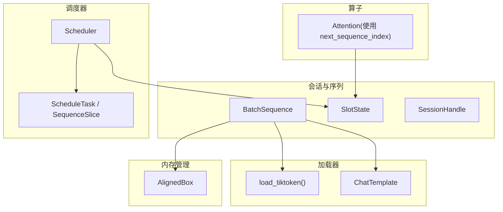
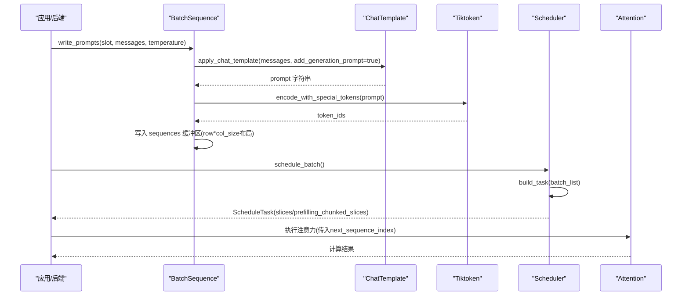
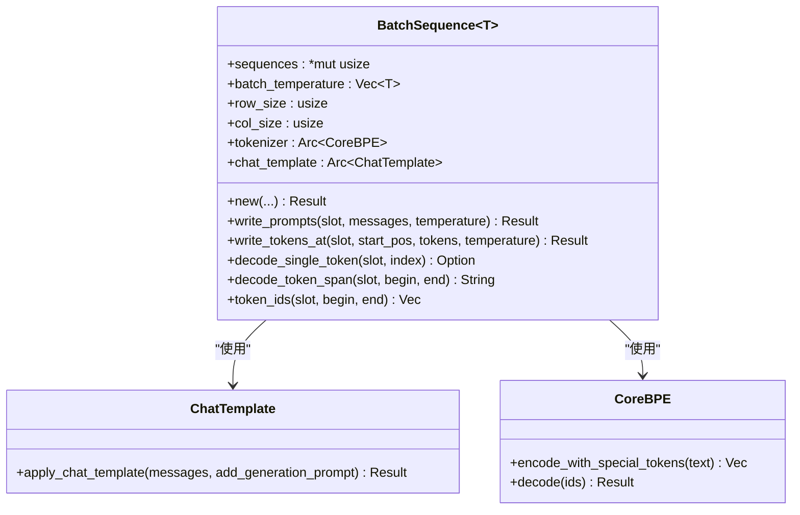
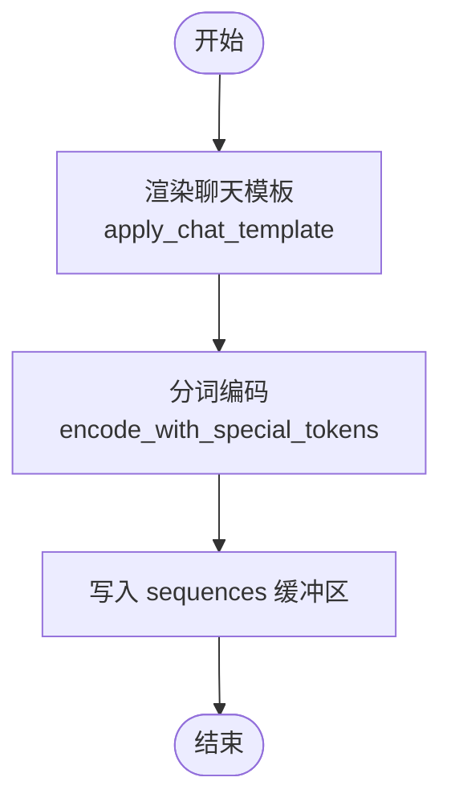
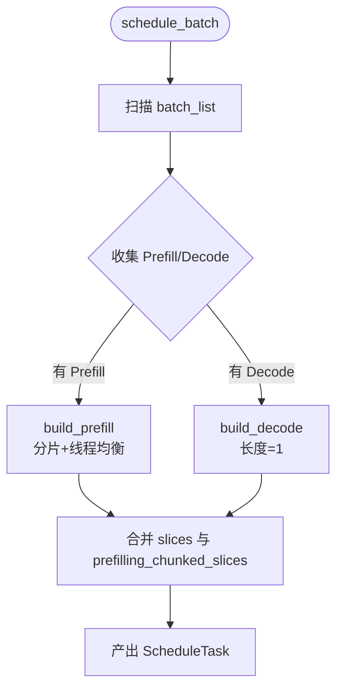
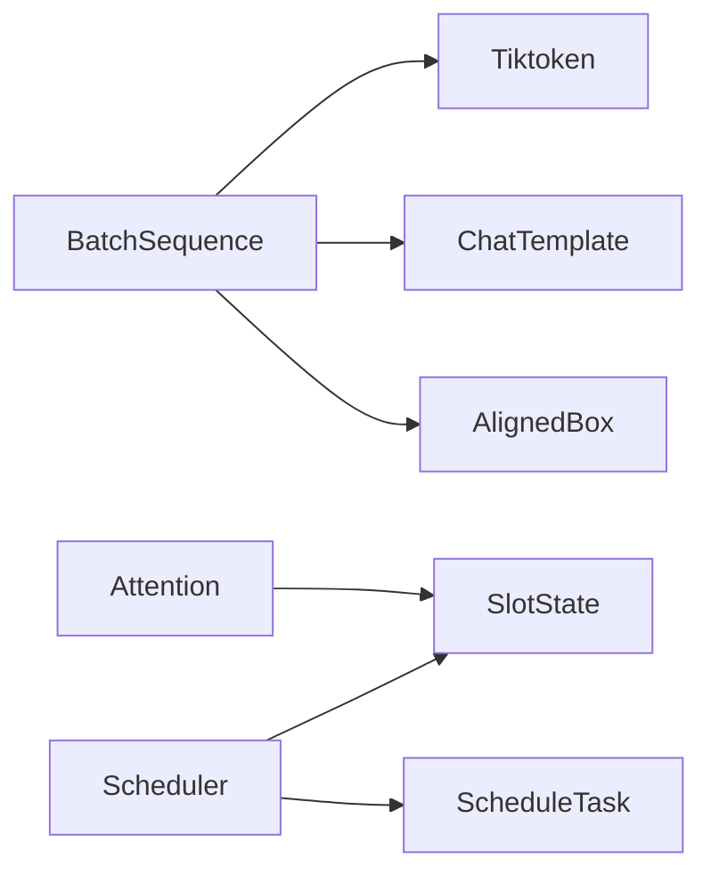

# 序列管理

<cite>
**本文引用的文件**
- [sequence.rs](file://src/runtime/session/sequence.rs)
- [slot.rs](file://src/runtime/session/slot.rs)
- [tokenizer.rs](file://src/runtime/loader/tokenizer.rs)
- [chat_template.rs](file://src/runtime/loader/chat_template.rs)
- [scheduler.rs](file://src/runtime/scheduler/scheduler.rs)
- [task.rs](file://src/runtime/scheduler/task.rs)
- [allocator.rs](file://src/mem_mgr/allocator.rs)
- [attention.rs](file://src/operators/attention/attention.rs)
- [backend.rs](file://src/bin/backend.rs)
</cite>

## 目录
1. [简介](#简介)
2. [项目结构](#项目结构)
3. [核心组件](#核心组件)
4. [架构总览](#架构总览)
5. [详细组件分析](#详细组件分析)
6. [依赖关系分析](#依赖关系分析)
7. [性能考量](#性能考量)
8. [故障排查指南](#故障排查指南)
9. [结论](#结论)
10. [附录](#附录)

## 简介
本文件围绕“序列管理系统”展开，重点解释 BatchSequence 的设计与实现、消息分词流程（ChatMessage 到 token）、调度与批处理构建、以及内存管理与性能优化要点。同时给出序列操作的 API 接口说明与使用示例路径，帮助读者快速理解并正确使用该子系统。

## 项目结构
序列管理相关代码主要分布在运行时会话层、加载器（分词与模板）、调度器与算子层：
- 会话与序列：BatchSequence、SlotState、SessionHandle
- 加载器：Tiktoken 分词器初始化、聊天模板渲染
- 调度器：Prefill/Decode 任务构建与切片组织
- 内存管理：对齐分配器 AlignedBox
- 算子侧：注意力访问模式对 next_sequence_index 的使用

图表来源
- [sequence.rs:10-181](file://src/runtime/session/sequence.rs#L10-L181)
- [slot.rs:1-90](file://src/runtime/session/slot.rs#L1-L90)
- [tokenizer.rs:100-242](file://src/runtime/loader/tokenizer.rs#L100-L242)
- [chat_template.rs:16-95](file://src/runtime/loader/chat_template.rs#L16-L95)
- [scheduler.rs:15-223](file://src/runtime/scheduler/scheduler.rs#L15-L223)
- [task.rs:1-49](file://src/runtime/scheduler/task.rs#L1-L49)
- [allocator.rs:1-156](file://src/mem_mgr/allocator.rs#L1-L156)
- [attention.rs:205-247](file://src/operators/attention/attention.rs#L205-L247)

章节来源
- [sequence.rs:10-181](file://src/runtime/session/sequence.rs#L10-L181)
- [slot.rs:1-90](file://src/runtime/session/slot.rs#L1-L90)
- [tokenizer.rs:100-242](file://src/runtime/loader/tokenizer.rs#L100-L242)
- [chat_template.rs:16-95](file://src/runtime/loader/chat_template.rs#L16-L95)
- [scheduler.rs:15-223](file://src/runtime/scheduler/scheduler.rs#L15-L223)
- [task.rs:1-49](file://src/runtime/scheduler/task.rs#L1-L49)
- [allocator.rs:1-156](file://src/mem_mgr/allocator.rs#L1-L156)
- [attention.rs:205-247](file://src/operators/attention/attention.rs#L205-L247)

## 核心组件
- BatchSequence<T>：承载批量序列的连续缓冲区、温度向量、分词器与聊天模板；提供写入提示、解码片段、按槽位读取 token 等能力。
- SlotState：描述每个槽位的阶段（Start/Prefill/Decode/Eos）、当前进度与通知机制。
- Scheduler：将 SlotState 集合编排为 ScheduleTask，生成用于 Prefill 和 Decode 的 SequenceSlice 列表，支持分片与多线程切分。
- load_tiktoken()/ChatTemplate：从模型目录加载 Tiktoken 分词器与 Jinja 聊天模板，完成文本到 token 的转换。
- AlignedBox：64 字节对齐的内存分配器，适合 SIMD 友好访问。

章节来源
- [sequence.rs:10-181](file://src/runtime/session/sequence.rs#L10-L181)
- [slot.rs:1-90](file://src/runtime/session/slot.rs#L1-L90)
- [scheduler.rs:15-223](file://src/runtime/scheduler/scheduler.rs#L15-L223)
- [task.rs:1-49](file://src/runtime/scheduler/task.rs#L1-L49)
- [tokenizer.rs:100-242](file://src/runtime/loader/tokenizer.rs#L100-L242)
- [chat_template.rs:16-95](file://src/runtime/loader/chat_template.rs#L16-L95)
- [allocator.rs:1-156](file://src/mem_mgr/allocator.rs#L1-L156)

## 架构总览
下图展示了从用户消息到 token 写入 BatchSequence，再到调度器构建任务、算子执行的关键数据流与控制流。

图表来源
- [sequence.rs:53-81](file://src/runtime/session/sequence.rs#L53-L81)
- [chat_template.rs:75-95](file://src/runtime/loader/chat_template.rs#L75-L95)
- [tokenizer.rs:100-242](file://src/runtime/loader/tokenizer.rs#L100-L242)
- [scheduler.rs:66-131](file://src/runtime/scheduler/scheduler.rs#L66-L131)
- [attention.rs:205-247](file://src/operators/attention/attention.rs#L205-L247)

## 详细组件分析

### BatchSequence 设计与 API
- 数据结构
  - sequences: 指向 batch×sequence_length 的 usize 缓冲区（存储 token id）
  - batch_temperature: 每行一个采样温度
  - tokenizer/chat_template: 共享的分词器与模板实例
- 关键方法
  - new/build_batch_sequence：构造 BatchSequence，加载分词器与模板，分配对齐缓冲区
  - write_prompts：渲染模板→分词→写入 sequences，更新对应 slot 的温度
  - write_tokens_at：在指定位置追加 tokens，边界保护
  - decode_single_token/decode_token_span/token_ids：按槽位与区间解码或提取 token ids
- 线程安全
  - 通过 Send/Sync 标记，配合 SharedMut 在跨线程场景下使用

图表来源
- [sequence.rs:10-152](file://src/runtime/session/sequence.rs#L10-L152)
- [chat_template.rs:16-95](file://src/runtime/loader/chat_template.rs#L16-L95)
- [tokenizer.rs:100-242](file://src/runtime/loader/tokenizer.rs#L100-L242)

章节来源
- [sequence.rs:10-181](file://src/runtime/session/sequence.rs#L10-L181)

### 消息分词流程（ChatMessage → Token）
- 步骤
  1) 调用 ChatTemplate.apply_chat_template 将 messages 渲染为 prompt 字符串
  2) 使用 tiktoken_rs::CoreBPE.encode_with_special_tokens 将 prompt 编码为 token ids
  3) 将 token ids 写入 BatchSequence 的 sequences 缓冲区
- 错误处理
  - 模板渲染失败、分词器初始化失败均返回错误信息，便于上层捕获与重试

图表来源
- [sequence.rs:53-81](file://src/runtime/session/sequence.rs#L53-L81)
- [chat_template.rs:75-95](file://src/runtime/loader/chat_template.rs#L75-L95)
- [tokenizer.rs:100-242](file://src/runtime/loader/tokenizer.rs#L100-L242)

章节来源
- [sequence.rs:53-81](file://src/runtime/session/sequence.rs#L53-L81)
- [chat_template.rs:75-95](file://src/runtime/loader/chat_template.rs#L75-L95)
- [tokenizer.rs:100-242](file://src/runtime/loader/tokenizer.rs#L100-L242)

### 调度与批处理构建（Prefill/Decode）
- SlotState 维护每个槽位的阶段与进度，Scheduler 扫描 batch_list 构建 ScheduleTask
- Prefill 支持分片（prefilling_chunked_slices），按线程数均匀切分，保证全局 token_start_index 严格递增
- Decode 每次为每个可解码槽位生成长度为 1 的 slice，last_token_flag 置真

图表来源
- [scheduler.rs:66-223](file://src/runtime/scheduler/scheduler.rs#L66-L223)
- [task.rs:1-49](file://src/runtime/scheduler/task.rs#L1-L49)

章节来源
- [scheduler.rs:66-223](file://src/runtime/scheduler/scheduler.rs#L66-L223)
- [task.rs:1-49](file://src/runtime/scheduler/task.rs#L1-L49)

### 前缀匹配与上下文复用/缓存优化
- 当前仓库未提供显式的“前缀匹配算法”实现。但系统通过以下机制间接支持上下文复用与 KV 缓存优化：
  - SlotState.next_sequence_index：记录每个槽位已处理的 token 偏移，避免重复计算
  - Attention 中基于 next_sequence_index 的可见范围裁剪，减少无效计算
  - 文档指出采用维度优先的 KV 布局与逐 head 顺序执行策略，提升 CPU L3 缓存命中率与驻留时间
- 建议扩展方向（概念性）
  - 在写提示时，比较新请求与已有槽位的前缀相似度，命中则复用 KV 并调整 next_sequence_index
  - 引入前缀哈希索引，加速候选槽位查找

章节来源
- [slot.rs:17-64](file://src/runtime/session/slot.rs#L17-L64)
- [attention.rs:205-247](file://src/operators/attention/attention.rs#L205-L247)

### 序列操作 API 与使用示例
- 创建与写入
  - 使用 build_batch_sequence 或 BatchSequence::new 构造实例，分配对齐缓冲区
  - 使用 write_prompts 将多轮消息渲染后写入指定槽位，并设置 temperature
- 解码与查询
  - decode_single_token/decode_token_span 用于调试与输出
  - token_ids 用于获取某槽位某区间的 token ids
- 参考用法路径
  - 后端示例：[backend.rs](file://src/bin/backend.rs) 中演示了构造 BatchSequence 并写入固定提示的流程

章节来源
- [sequence.rs:157-181](file://src/runtime/session/sequence.rs#L157-L181)
- [backend.rs:93-109](file://src/bin/backend.rs#L93-L109)

## 依赖关系分析
- BatchSequence 依赖 Tiktoken 与 ChatTemplate 完成文本到 token 的转换
- Scheduler 依赖 SlotState 状态机，产出 ScheduleTask 供上层执行
- Attention 依赖 next_sequence_index 控制可见窗口，避免越界与冗余计算
- 内存由 AlignedBox 统一分配，确保 64 字节对齐，利于 SIMD 向量化

图表来源
- [sequence.rs:10-181](file://src/runtime/session/sequence.rs#L10-L181)
- [scheduler.rs:15-223](file://src/runtime/scheduler/scheduler.rs#L15-L223)
- [task.rs:1-49](file://src/runtime/scheduler/task.rs#L1-L49)
- [attention.rs:205-247](file://src/operators/attention/attention.rs#L205-L247)
- [allocator.rs:1-156](file://src/mem_mgr/allocator.rs#L1-L156)

章节来源
- [sequence.rs:10-181](file://src/runtime/session/sequence.rs#L10-L181)
- [scheduler.rs:15-223](file://src/runtime/scheduler/scheduler.rs#L15-L223)
- [task.rs:1-49](file://src/runtime/scheduler/task.rs#L1-L49)
- [attention.rs:205-247](file://src/operators/attention/attention.rs#L205-L247)
- [allocator.rs:1-156](file://src/mem_mgr/allocator.rs#L1-L156)

## 性能考量
- 内存布局与对齐
  - sequences 采用 row-major 连续布局（batch × sequence_length），AlignedBox 保证 64 字节对齐，有利于 SIMD 与缓存局部性
- 调度与分片
  - Prefill 分片按线程数均衡分配，减少热点与负载不均
  - Decode 单步推进，保持低延迟
- 注意力访问模式
  - 使用 next_sequence_index 限制可见范围，避免无效计算
  - 结合维度优先 KV 布局与逐 head 顺序执行，提升 CPU L3 缓存命中率与驻留时间
- 分词与模板
  - Tiktoken 与 ChatTemplate 以 Arc 共享，避免重复初始化开销

章节来源
- [allocator.rs:1-156](file://src/mem_mgr/allocator.rs#L1-L156)
- [scheduler.rs:133-223](file://src/runtime/scheduler/scheduler.rs#L133-L223)
- [attention.rs:205-247](file://src/operators/attention/attention.rs#L205-L247)

## 故障排查指南
- 模板渲染失败
  - 现象：apply_chat_template 报错
  - 排查：确认 chat_template.jinja 或 tokenizer_config.json 中的模板字段存在且语法正确
- 分词器初始化失败
  - 现象：load_tiktoken 无法解析 tokenizer.json/config
  - 排查：检查 JSON 结构、正则 pattern、特殊 token 映射是否完整
- 越界写入
  - 现象：write_tokens_at 或 write_prompts 截断写入
  - 排查：确认 col_size 足够容纳输入，start_pos 不越界
- 调度无工作
  - 现象：schedule_batch 返回 false
  - 排查：检查 SlotState 阶段是否为 Prefill/Decode，是否存在 Eos 导致终止

章节来源
- [chat_template.rs:75-95](file://src/runtime/loader/chat_template.rs#L75-L95)
- [tokenizer.rs:100-242](file://src/runtime/loader/tokenizer.rs#L100-L242)
- [sequence.rs:53-151](file://src/runtime/session/sequence.rs#L53-L151)
- [scheduler.rs:66-131](file://src/runtime/scheduler/scheduler.rs#L66-L131)

## 结论
序列管理系统以 BatchSequence 为核心，结合 ChatTemplate 与 Tiktoken 完成高效的消息分词与 token 写入；Scheduler 将多槽位状态编排为可执行的 ScheduleTask，支持 Prefill 分片与 Decode 单步推进；Attention 借助 next_sequence_index 进行可见范围裁剪，配合维度优先 KV 布局与逐 head 顺序执行，显著提升 CPU 缓存利用率与整体吞吐。建议在后续迭代中引入前缀匹配与 KV 复用机制，进一步降低重复计算与内存搬运成本。

## 附录
- 术语
  - Prefill：一次性处理长提示的阶段
  - Decode：逐 token 生成的阶段
  - next_sequence_index：槽位当前已处理的 token 偏移
  - SequenceSlice：调度任务中的序列切片，包含全局索引、批次索引、长度与标志位