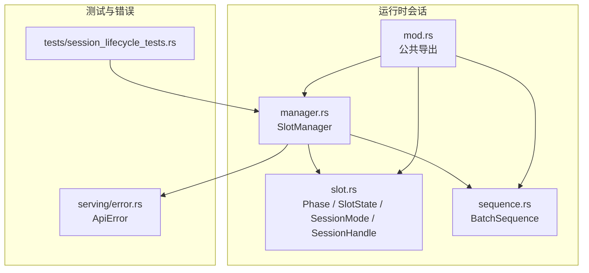
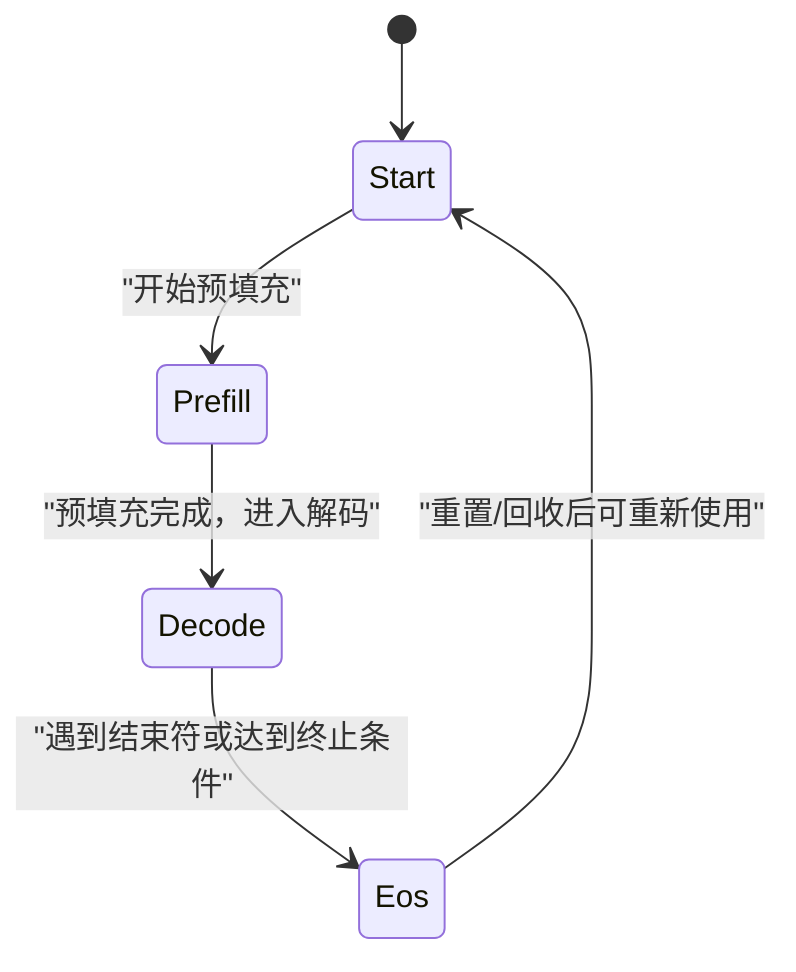
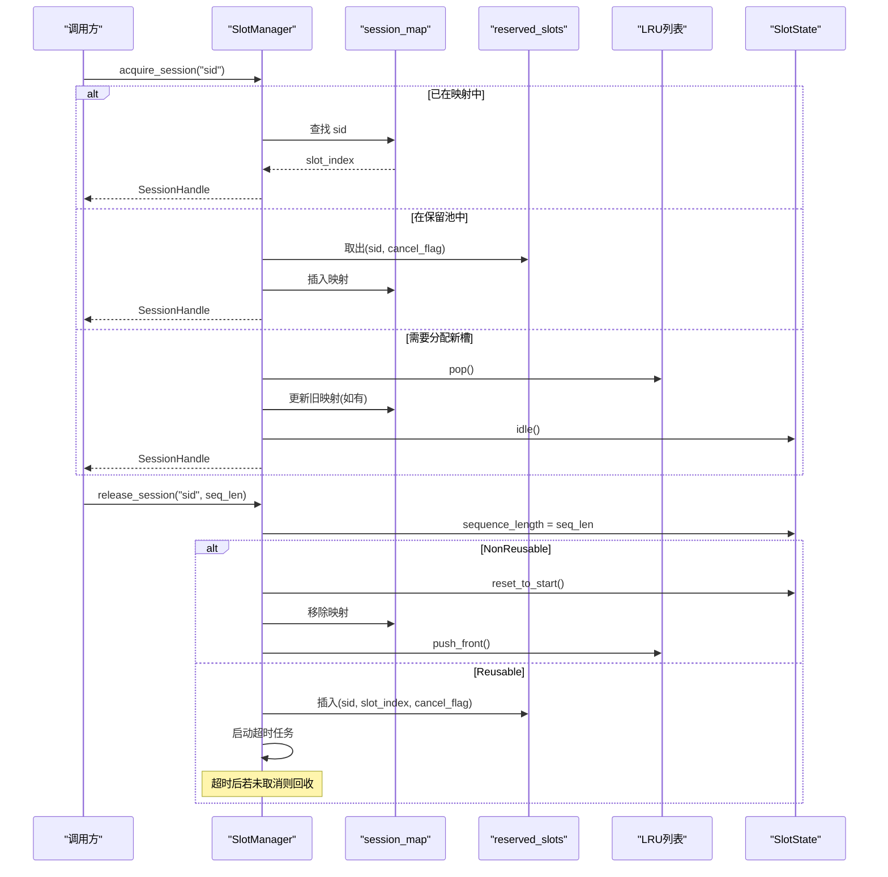
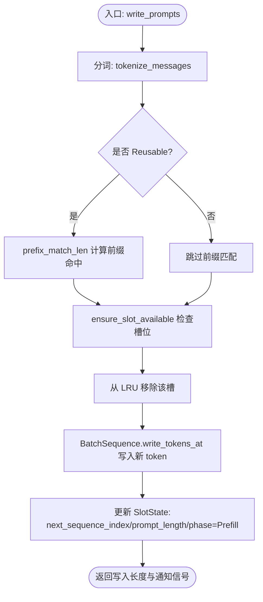
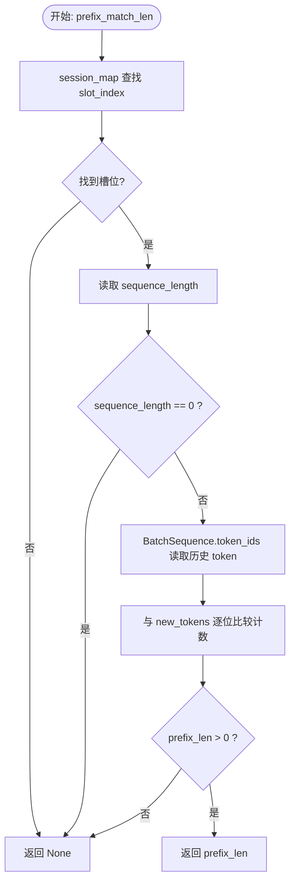
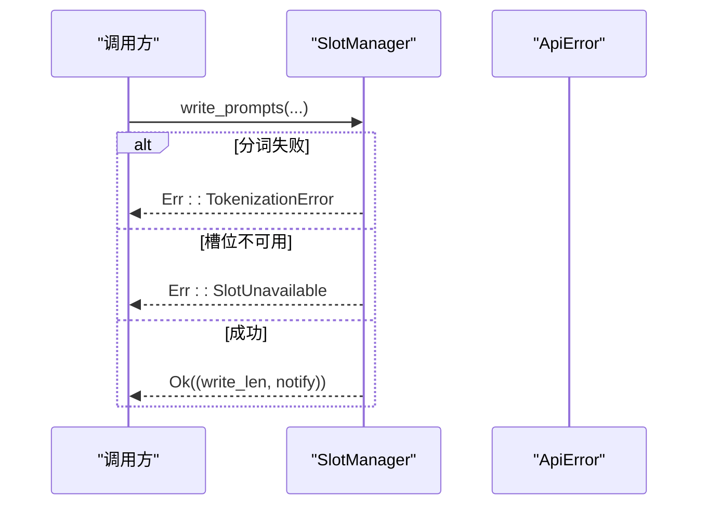
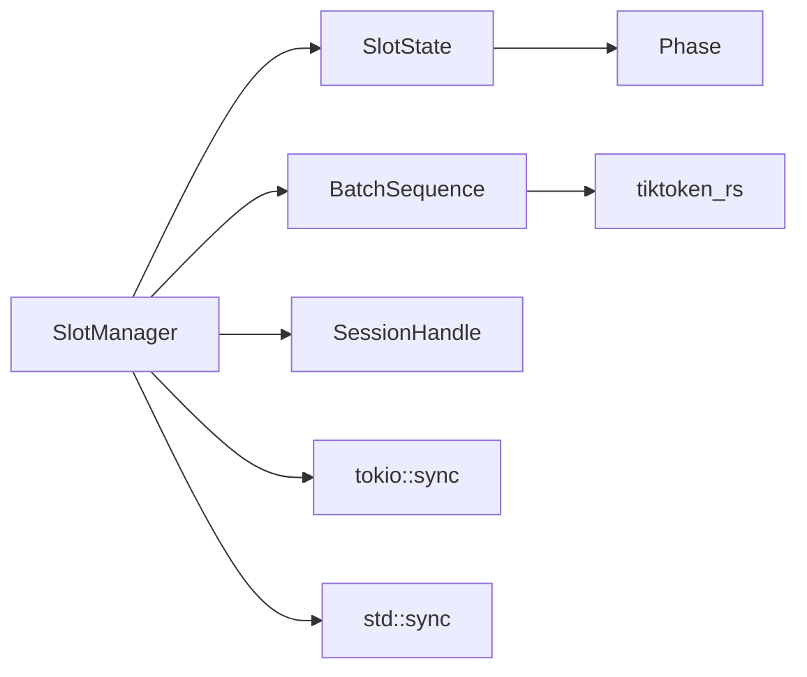

# 槽位状态管理

<cite>
**本文引用的文件**   
- [slot.rs](file://src/runtime/session/slot.rs)
- [manager.rs](file://src/runtime/session/manager.rs)
- [sequence.rs](file://src/runtime/session/sequence.rs)
- [mod.rs](file://src/runtime/session/mod.rs)
- [session_lifecycle_tests.rs](file://src/runtime/tests/session_lifecycle_tests.rs)
- [error.rs](file://src/serving/error.rs)
</cite>

## 目录
1. [简介](#简介)
2. [项目结构](#项目结构)
3. [核心组件](#核心组件)
4. [架构总览](#架构总览)
5. [详细组件分析](#详细组件分析)
6. [依赖关系分析](#依赖关系分析)
7. [性能考量](#性能考量)
8. [故障排查指南](#故障排查指南)
9. [结论](#结论)
10. [附录](#附录)

## 简介
本文件聚焦于推理运行时中的“槽位状态管理”，围绕以下目标展开：
- 解释 SlotState 数据结构的设计与关键属性（序列长度、提示长度、阶段标记等）
- 说明 Phase 枚举的定义与状态转换规则（Start、Prefill、Decode、Eos）
- 阐述 SessionHandle 的生命周期管理（会话获取、释放、资源清理）
- 提供槽位状态监控与调试方法
- 给出并发访问控制与错误处理的最佳实践

## 项目结构
与槽位状态管理直接相关的代码位于 runtime/session 模块下，包含：
- slot.rs：定义 Phase、SlotState、SessionMode、SessionHandle
- manager.rs：实现 SlotManager，负责会话生命周期、槽位分配与回收、预填充与解码辅助
- sequence.rs：BatchSequence 封装批量 token 缓冲区与分词器，供写入与读取
- mod.rs：统一导出公共类型
- tests/session_lifecycle_tests.rs：覆盖会话获取/释放/复用/超时回收等场景
- serving/error.rs：统一的 API 错误类型，用于上层错误传播



图表来源
- [slot.rs:1-90](file://src/runtime/session/slot.rs#L1-L90)
- [manager.rs:1-284](file://src/runtime/session/manager.rs#L1-L284)
- [sequence.rs:1-182](file://src/runtime/session/sequence.rs#L1-L182)
- [mod.rs:1-8](file://src/runtime/session/mod.rs#L1-L8)
- [session_lifecycle_tests.rs:1-244](file://src/runtime/tests/session_lifecycle_tests.rs#L1-L244)
- [error.rs:1-88](file://src/serving/error.rs#L1-L88)

章节来源
- [slot.rs:1-90](file://src/runtime/session/slot.rs#L1-L90)
- [manager.rs:1-284](file://src/runtime/session/manager.rs#L1-L284)
- [sequence.rs:1-182](file://src/runtime/session/sequence.rs#L1-L182)
- [mod.rs:1-8](file://src/runtime/session/mod.rs#L1-L8)

## 核心组件
本节从数据模型、状态机与会话句柄三个维度进行概览。

- Phase 枚举
  - 含义：表示一个槽位的当前阶段
  - 取值：Start、Prefill、Decode、Eos
  - 用途：驱动调度与执行逻辑，决定下一步操作（如是否可写提示、是否继续解码）

- SlotState 结构体
  - next_sequence_index：下一个待生成的位置索引（即已生成 token 的末尾）
  - prompt_length：提示总长度（包括前缀命中与本次写入的新 token）
  - phase：当前阶段（Phase）
  - sequence_length：缓存的总序列长度（用于前缀匹配与复用）
  - notify：通知信号（用于等待预填充完成或阶段切换）

- SessionHandle 句柄
  - session_id：会话标识
  - slot_index：绑定的物理槽位索引
  - 作用：作为上层对底层槽位的轻量引用，便于跨调用传递

- SessionMode 模式
  - Reusable：支持会话复用，释放后进入保留池，超时未复用则回收
  - NonReusable：非复用模式，释放后立即重置并回到 LRU 头部

章节来源
- [slot.rs:7-64](file://src/runtime/session/slot.rs#L7-L64)
- [slot.rs:74-90](file://src/runtime/session/slot.rs#L74-L90)
- [slot.rs:66-73](file://src/runtime/session/slot.rs#L66-L73)

## 架构总览
SlotManager 是槽位状态管理的核心编排者，协调会话映射、LRU 列表、保留池与 BatchSequence 的读写。

```mermaid
classDiagram
class SlotManager {
+acquire_session(session_id) SessionHandle
+release_session(session_id, sequence_length) void
+write_prompts(slot_index, session_id, messages, temperature) ApiResult<(usize, Notify)>
+decode_single_token(slot_index, token_index) String
+decode_token_span(slot_index, begin, end) String
+decode_generated_text(slot_index) String
+is_eos(slot_index) bool
+get_next_sequence_index(slot_index) usize
+get_prompt_length(slot_index) usize
-ensure_slot_available(slot_index) ApiResult~void~
-lru_remove(idx) void
-lru_remove_and_push_front(idx) void
-prefix_match_len(session_id, new_tokens) Option<usize>
-batch_states : SharedMut<Vec<SlotState>>
-batch_sequences : SharedMut<BatchSequence<T>>
-lru : Vec<usize>
-session_map : HashMap<String, usize>
-reserved_slots : HashMap<String, (usize, AtomicBool)>
-mode : SessionMode
-reuse_timeout : Duration
}
class SlotState {
+next_sequence_index : usize
+prompt_length : usize
+phase : Phase
+sequence_length : usize
+idle() Self
+start_prefill(start_index, filling_length) void
+start_decode(next_sequence_index, prompt_length) void
+is_available() bool
+filling_length() usize
+reset_to_start() void
}
class BatchSequence {
+tokenize_messages(messages) Result<Vec<u32>, String>
+write_tokens_at(slot_index, start_pos, tokens, temperature) Result<usize, String>
+decode_single_token(slot_index, token_index) Option<String>
+decode_token_span(slot_index, begin, end) String
+token_ids(slot_index, begin, end) Vec<u32>
}
class SessionHandle {
+session_id : String
+slot_index : usize
}
class Phase {
<<enum>>
Start
Prefill
Decode
Eos
}
SlotManager --> SlotState : "维护"
SlotManager --> BatchSequence : "读写"
SlotManager --> SessionHandle : "返回"
SlotState --> Phase : "使用"
```

图表来源
- [manager.rs:17-284](file://src/runtime/session/manager.rs#L17-L284)
- [slot.rs:17-64](file://src/runtime/session/slot.rs#L17-L64)
- [sequence.rs:10-152](file://src/runtime/session/sequence.rs#L10-L152)
- [slot.rs:74-90](file://src/runtime/session/slot.rs#L74-L90)
- [slot.rs:7-14](file://src/runtime/session/slot.rs#L7-L14)

## 详细组件分析

### Phase 与 SlotState 设计
- Phase 状态机
  - Start：空闲/初始态，可接受新的提示写入
  - Prefill：预填充阶段，正在写入提示 token
  - Decode：解码阶段，逐 token 生成
  - Eos：结束态，可用于再次分配或清理
- SlotState 关键字段
  - next_sequence_index：指向下一个待生成位置，随解码推进
  - prompt_length：提示总长度，用于界定“生成部分”的起止范围
  - sequence_length：历史累计长度，用于前缀匹配与复用
  - notify：用于异步等待阶段完成或状态变更
- 可用性判定
  - is_available：仅当 phase 为 Start 或 Eos 时可用
  - filling_length：计算尚未写入的提示剩余长度



图表来源
- [slot.rs:7-14](file://src/runtime/session/slot.rs#L7-L14)
- [slot.rs:17-64](file://src/runtime/session/slot.rs#L17-L64)

章节来源
- [slot.rs:7-64](file://src/runtime/session/slot.rs#L7-L64)

### SessionHandle 生命周期管理
- 会话获取 acquire_session
  - 若 session_id 已在 session_map，直接复用已有 slot_index
  - 否则尝试从 reserved_slots 恢复（取消超时回收）
  - 若仍无可用，从 LRU 尾部淘汰一个槽位，更新映射并重置状态
- 会话释放 release_session
  - 记录当前 sequence_length，以便后续前缀匹配
  - NonReusable：立即 reset_to_start，移除映射，插入 LRU 头部
  - Reusable：放入 reserved_slots，启动定时器；若在超时前再次 acquire，则取消定时回收
- 超时回收
  - 定时器到期后，若未被 cancel_flag 取消，则 reset_to_start 并放回 LRU 头部



图表来源
- [manager.rs:48-133](file://src/runtime/session/manager.rs#L48-L133)
- [manager.rs:241-254](file://src/runtime/session/manager.rs#L241-L254)

章节来源
- [manager.rs:48-133](file://src/runtime/session/manager.rs#L48-L133)
- [manager.rs:241-254](file://src/runtime/session/manager.rs#L241-L254)

### 预填充与解码流程
- write_prompts
  - 将消息渲染为文本并通过分词器编码为新 token 序列
  - 在 Reusable 模式下尝试 prefix_match_len 以复用历史前缀
  - 确保槽位可用并从 LRU 中移除
  - 写入 BatchSequence，更新 SlotState 的 next_sequence_index、prompt_length、phase=Prefill
  - 返回写入长度与通知信号
- decode 相关
  - get_next_sequence_index/get_prompt_length：读取状态
  - decode_generated_text：根据 prompt_length 与 next_sequence_index 截取生成片段
  - is_eos：判断是否到达结束阶段



图表来源
- [manager.rs:137-182](file://src/runtime/session/manager.rs#L137-L182)
- [sequence.rs:130-152](file://src/runtime/session/sequence.rs#L130-L152)
- [sequence.rs:121-128](file://src/runtime/session/sequence.rs#L121-L128)

章节来源
- [manager.rs:137-182](file://src/runtime/session/manager.rs#L137-L182)
- [sequence.rs:121-152](file://src/runtime/session/sequence.rs#L121-L152)

### 前缀匹配与复用策略
- prefix_match_len
  - 通过 session_map 定位到对应 slot_index
  - 读取 SlotState.sequence_length 得到历史缓存长度
  - 从 BatchSequence 中读取历史 token 与新 token 序列进行逐位比较，统计最长公共前缀长度
  - 若命中长度大于 0，则返回该长度，减少重复写入



图表来源
- [manager.rs:256-282](file://src/runtime/session/manager.rs#L256-L282)
- [sequence.rs:106-119](file://src/runtime/session/sequence.rs#L106-L119)

章节来源
- [manager.rs:256-282](file://src/runtime/session/manager.rs#L256-L282)
- [sequence.rs:106-119](file://src/runtime/session/sequence.rs#L106-L119)

### 并发访问控制与错误处理
- 并发控制
  - session_map 与 reserved_slots 使用 TokioMutex 保护，避免异步竞争
  - lru 使用标准库 Mutex 保护，保证线程安全
  - batch_states 与 batch_sequences 通过 SharedMut 包装，提供 with/with_mut 原子访问
- 错误处理
  - write_prompts 可能因分词失败或槽位不可用而返回 ApiError
  - ApiError 统一转换为 HTTP 响应，便于上层服务捕获与日志记录



图表来源
- [manager.rs:137-182](file://src/runtime/session/manager.rs#L137-L182)
- [error.rs:1-58](file://src/serving/error.rs#L1-L58)

章节来源
- [manager.rs:229-239](file://src/runtime/session/manager.rs#L229-L239)
- [error.rs:1-58](file://src/serving/error.rs#L1-L58)

## 依赖关系分析
- 内部依赖
  - SlotManager 依赖 SlotState、BatchSequence、SessionHandle、Phase
  - BatchSequence 依赖分词器与聊天模板加载（由外部 loader 提供）
- 外部依赖
  - tokio::sync::{Mutex, Notify}：异步互斥与通知
  - std::sync::{Mutex, Arc, AtomicBool}：同步互斥与原子标志
  - tiktoken_rs：分词与解码
- 耦合与内聚
  - SlotManager 集中管理状态与资源，内聚性高
  - BatchSequence 专注于 token 缓冲与分词，职责清晰
  - 通过 SharedMut 降低共享可变状态的锁粒度与复杂度



图表来源
- [manager.rs:1-284](file://src/runtime/session/manager.rs#L1-L284)
- [slot.rs:1-90](file://src/runtime/session/slot.rs#L1-L90)
- [sequence.rs:1-182](file://src/runtime/session/sequence.rs#L1-L182)

章节来源
- [manager.rs:1-284](file://src/runtime/session/manager.rs#L1-L284)
- [slot.rs:1-90](file://src/runtime/session/slot.rs#L1-L90)
- [sequence.rs:1-182](file://src/runtime/session/sequence.rs#L1-L182)

## 性能考量
- 前缀匹配复用
  - 在 Reusable 模式下，通过 prefix_match_len 减少重复写入，提升吞吐
- LRU 淘汰策略
  - 从尾部淘汰，释放后插入头部，平衡热点会话与冷数据回收
- 异步与锁粒度
  - 使用 TokioMutex 保护高频读写的映射表，减少阻塞
  - SharedMut 提供细粒度的 with/with_mut 访问，避免整块数据加锁
- 内存布局
  - BatchSequence 使用连续缓冲区存储 token，利于向量化与缓存友好

[本节为通用指导，不直接分析具体文件]

## 故障排查指南
- 常见问题
  - 槽位不可用：write_prompts 返回 SlotUnavailable，需检查 ensure_slot_available 与 is_available 逻辑
  - 分词失败：返回 TokenizationError，检查 chat_template 与 tokenizer 配置
  - 会话未释放导致泄漏：确认 release_session 路径是否被调用，以及 NonReusable/Reusable 行为是否符合预期
- 调试建议
  - 打印/记录 SlotState 的关键字段（phase、next_sequence_index、prompt_length、sequence_length）
  - 观察 LRU 变化与 reserved_slots 的进出情况
  - 使用 decode_generated_text 与 decode_token_span 验证生成内容
- 测试用例参考
  - 会话获取/释放/复用/超时回收等行为可在 session_lifecycle_tests.rs 中找到覆盖

章节来源
- [manager.rs:229-239](file://src/runtime/session/manager.rs#L229-L239)
- [session_lifecycle_tests.rs:1-244](file://src/runtime/tests/session_lifecycle_tests.rs#L1-L244)
- [error.rs:1-58](file://src/serving/error.rs#L1-L58)

## 结论
槽位状态管理通过清晰的 Phase 状态机与 SlotState 数据结构，结合 SlotManager 的会话生命周期与前缀复用策略，实现了高效、可控的推理资源调度。配合完善的并发控制与错误处理机制，能够在多会话并发场景下保持稳定性与性能。

[本节为总结性内容，不直接分析具体文件]

## 附录
- 最佳实践
  - 始终在 release_session 中传入正确的 sequence_length，以保证前缀匹配准确
  - 在 Reusable 模式下合理设置 reuse_timeout，平衡复用收益与资源占用
  - 对频繁调用的 write_prompts 进行批量化与重试策略优化
  - 使用 is_eos 与 get_next_sequence_index 协同判断生成终止条件

[本节为通用指导，不直接分析具体文件]