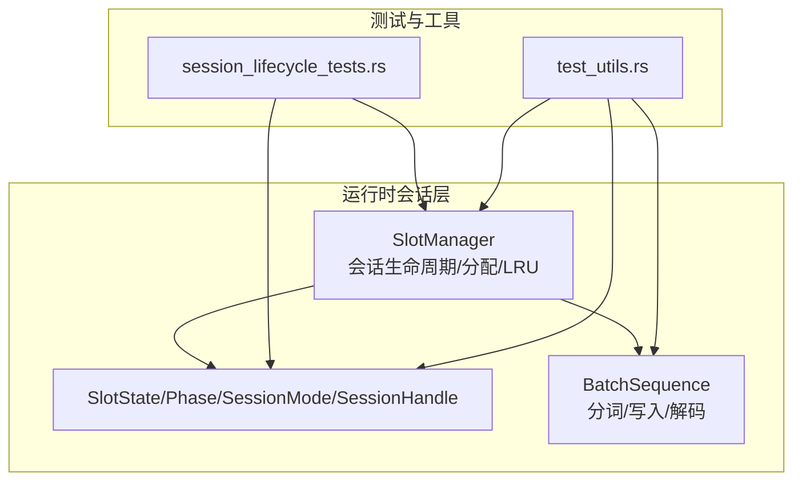
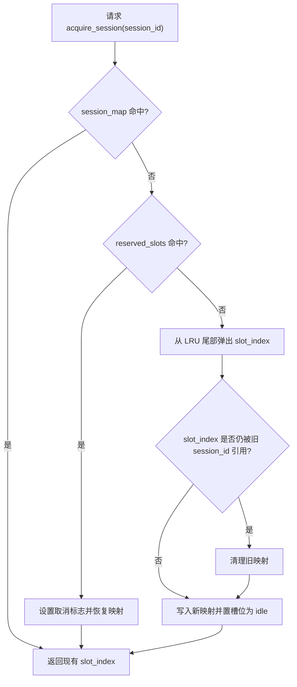
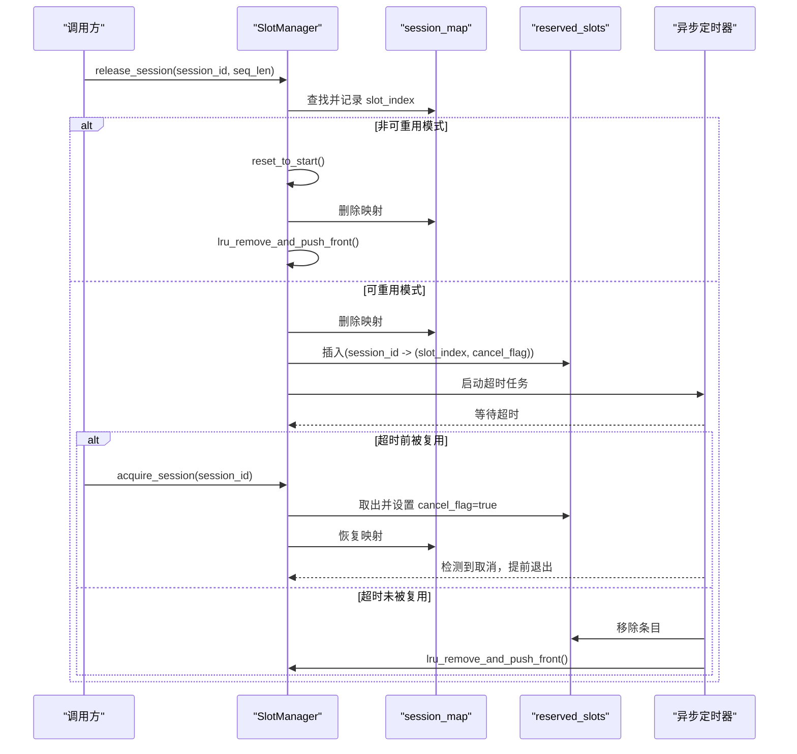
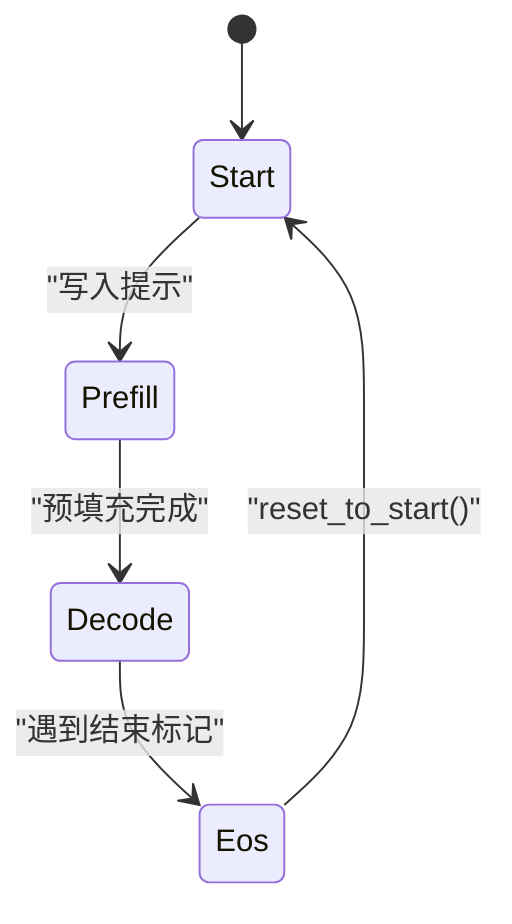
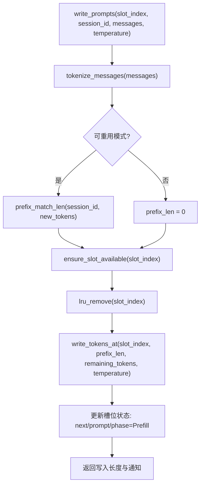
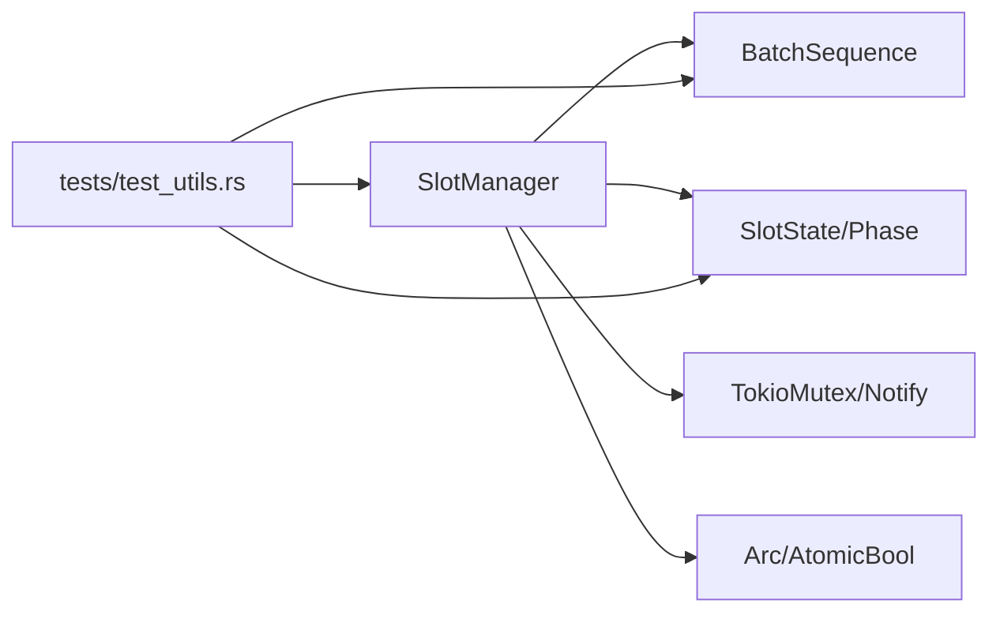

# 槽位管理器

<cite>
**本文引用的文件**
- [src/runtime/session/manager.rs](file://src/runtime/session/manager.rs)
- [src/runtime/session/slot.rs](file://src/runtime/session/slot.rs)
- [src/runtime/session/sequence.rs](file://src/runtime/session/sequence.rs)
- [src/runtime/tests/session_lifecycle_tests.rs](file://src/runtime/tests/session_lifecycle_tests.rs)
- [src/runtime/tests/test_utils.rs](file://src/runtime/tests/test_utils.rs)
</cite>

## 目录
1. [简介](#简介)
2. [项目结构](#项目结构)
3. [核心组件](#核心组件)
4. [架构总览](#架构总览)
5. [详细组件分析](#详细组件分析)
6. [依赖关系分析](#依赖关系分析)
7. [性能考量](#性能考量)
8. [故障排查指南](#故障排查指南)
9. [结论](#结论)
10. [附录](#附录)

## 简介
本文件围绕 SlotManager 的槽位管理子系统，系统性阐述其核心功能与实现细节，包括：
- 槽位分配策略与 LRU 淘汰算法
- 会话映射机制与可重用/非可重用模式差异
- 槽位状态机（空闲、预填充、解码、结束）及其转换
- 并发安全与内存管理要点
- 生命周期最佳实践与性能优化建议

## 项目结构
与槽位管理相关的核心代码位于 runtime/session 模块中，包含会话与槽位状态、批处理序列以及测试用例。



图表来源
- [src/runtime/session/manager.rs:1-284](file://src/runtime/session/manager.rs#L1-L284)
- [src/runtime/session/slot.rs:1-90](file://src/runtime/session/slot.rs#L1-L90)
- [src/runtime/session/sequence.rs:1-182](file://src/runtime/session/sequence.rs#L1-L182)
- [src/runtime/tests/session_lifecycle_tests.rs:1-244](file://src/runtime/tests/session_lifecycle_tests.rs#L1-L244)
- [src/runtime/tests/test_utils.rs:1-129](file://src/runtime/tests/test_utils.rs#L1-L129)

章节来源
- [src/runtime/session/manager.rs:1-284](file://src/runtime/session/manager.rs#L1-L284)
- [src/runtime/session/slot.rs:1-90](file://src/runtime/session/slot.rs#L1-L90)
- [src/runtime/session/sequence.rs:1-182](file://src/runtime/session/sequence.rs#L1-L182)
- [src/runtime/tests/session_lifecycle_tests.rs:1-244](file://src/runtime/tests/session_lifecycle_tests.rs#L1-L244)
- [src/runtime/tests/test_utils.rs:1-129](file://src/runtime/tests/test_utils.rs#L1-L129)

## 核心组件
- SlotManager：负责会话获取/释放、槽位分配与回收、LRU 维护、预留槽位与超时回收、提示写入与解码辅助方法。
- SlotState/Phase：表示单个槽位的运行阶段与索引信息，提供可用性与重置能力。
- SessionMode：控制“可重用”和“非可重用”两种行为模式。
- SessionHandle：返回给调用方的句柄，携带 session_id 与 slot_index。
- BatchSequence：承载批量 token 数据、温度参数，并提供分词、写入、解码等能力。

章节来源
- [src/runtime/session/manager.rs:17-44](file://src/runtime/session/manager.rs#L17-L44)
- [src/runtime/session/slot.rs:7-72](file://src/runtime/session/slot.rs#L7-L72)
- [src/runtime/session/sequence.rs:10-51](file://src/runtime/session/sequence.rs#L10-L51)

## 架构总览
SlotManager 通过以下关键数据结构协作完成槽位管理：
- session_map：session_id -> slot_index 的活跃映射
- reserved_slots：session_id -> (slot_index, cancel_flag) 的预留映射
- lru：按最近使用顺序维护的槽位索引列表（用于分配与淘汰）
- batch_states：共享的槽位状态数组
- batch_sequences：共享的批量序列缓冲区与分词器

```mermaid
classDiagram
class SlotManager {
+new(num_slots, batch_sequences, batch_states, mode, reuse_timeout_ms)
+acquire_session(session_id) SessionHandle
+release_session(session_id, sequence_length) void
+write_prompts(slot_index, session_id, messages, temperature) ApiResult<(usize, Notify)>
+decode_single_token(slot_index, token_index) String
+decode_token_span(slot_index, begin, end) String
+decode_generated_text(slot_index) String
+is_eos(slot_index) bool
+get_next_sequence_index(slot_index) usize
+get_prompt_length(slot_index) usize
-ensure_slot_available(slot_index) ApiResult~void~
-lru_remove(idx) void
-lru_remove_and_push_front(idx) void
-prefix_match_len(session_id, new_tokens) Option<usize>
-batch_states : SharedMut<Vec<SlotState>>
-batch_sequences : SharedMut<BatchSequence<T>>
-lru : Vec<usize>
-session_map : HashMap<String, usize>
-reserved_slots : HashMap<String, (usize, AtomicBool)>
-mode : SessionMode
-reuse_timeout : Duration
}
class SlotState {
+next_sequence_index : usize
+prompt_length : usize
+phase : Phase
+sequence_length : usize
+idle() SlotState
+start_prefill(start_index, filling_length) void
+start_decode(next_sequence_index, prompt_length) void
+is_available() bool
+filling_length() usize
+reset_to_start() void
}
class Phase {
<<enum>>
Start
Prefill
Decode
Eos
}
class SessionMode {
<<enum>>
Reusable
NonReusable
}
class SessionHandle {
+session_id : String
+slot_index : usize
+new(session_id, slot_index) SessionHandle
}
class BatchSequence {
+token_ids(slot_index, begin, end) Vec<u32>
+write_tokens_at(slot_index, start_pos, tokens, temperature) Result<usize, String>
+decode_token_span(slot_index, begin, end) String
+tokenize_messages(messages) Result<Vec<u32>, String>
}
SlotManager --> SlotState : "读写状态"
SlotManager --> BatchSequence : "写入/读取tokens"
SlotManager --> SessionHandle : "返回句柄"
SlotState --> Phase : "当前阶段"
```

图表来源
- [src/runtime/session/manager.rs:17-284](file://src/runtime/session/manager.rs#L17-L284)
- [src/runtime/session/slot.rs:7-90](file://src/runtime/session/slot.rs#L7-L90)
- [src/runtime/session/sequence.rs:10-152](file://src/runtime/session/sequence.rs#L10-L152)

## 详细组件分析

### 槽位分配策略与 LRU 淘汰
- 分配流程
  - 优先检查 session_map 是否已有活跃映射；若有直接复用。
  - 其次检查 reserved_slots 是否存在该 session_id 的预留槽位；若存在则取消异步回收并恢复映射。
  - 否则从 lru 尾部弹出槽位作为候选；若该槽位仍被旧 session_id 引用，需清理旧映射。
  - 将新 session_id 写入 session_map，并将对应槽位状态置为 idle。
- LRU 维护
  - 使用一个受互斥锁保护的 Vec<usize> 维护槽位访问顺序。
  - 分配时从尾部弹出（最久未使用），在写提示前移除该槽位并从头部插入（最近使用）。
  - 释放时根据模式决定是否立即加入 LRU 前端或进入预留期。



图表来源
- [src/runtime/session/manager.rs:48-82](file://src/runtime/session/manager.rs#L48-L82)
- [src/runtime/session/manager.rs:241-254](file://src/runtime/session/manager.rs#L241-L254)

章节来源
- [src/runtime/session/manager.rs:48-82](file://src/runtime/session/manager.rs#L48-L82)
- [src/runtime/session/manager.rs:241-254](file://src/runtime/session/manager.rs#L241-L254)

### 会话映射与预留回收机制
- 会话映射
  - session_map 保存活跃会话到槽位的映射，保证同一 session_id 多次获取返回相同槽位。
- 预留与超时回收
  - 在可重用模式下，release_session 会将 session_id 从 session_map 移除并放入 reserved_slots，同时启动异步定时器。
  - 若在超时前再次 acquire_session 命中 reserved_slots，则设置取消标志并恢复映射，定时器随后退出。
  - 若超时后仍未被复用，则从 reserved_slots 移除并将槽位重新加入 LRU 前端，供后续分配。



图表来源
- [src/runtime/session/manager.rs:84-133](file://src/runtime/session/manager.rs#L84-L133)
- [src/runtime/session/manager.rs:56-61](file://src/runtime/session/manager.rs#L56-L61)

章节来源
- [src/runtime/session/manager.rs:84-133](file://src/runtime/session/manager.rs#L84-L133)

### 槽位状态管理与转换
- 状态定义
  - Phase 枚举包含 Start、Prefill、Decode、Eos 四个阶段。
  - SlotState 维护 next_sequence_index、prompt_length、phase、sequence_length 等字段，并提供 idle/start_prefill/start_decode/reset_to_start/is_available/filling_length 等方法。
- 转换规则
  - 初始为 Start；写入提示后进入 Prefill；当预填充完成后进入 Decode；生成结束标记后进入 Eos。
  - is_available 允许在 Start 或 Eos 阶段进行新的写入操作。
  - reset_to_start 将状态恢复到 Start，清空长度信息。



图表来源
- [src/runtime/session/slot.rs:7-64](file://src/runtime/session/slot.rs#L7-L64)

章节来源
- [src/runtime/session/slot.rs:7-64](file://src/runtime/session/slot.rs#L7-L64)

### 提示写入与增量匹配（可重用模式）
- 提示写入流程
  - 将消息对转换为 token 序列，计算可重用模式下的前缀匹配长度。
  - 确保槽位处于可用状态，更新 LRU，仅写入新增 token 片段。
  - 更新槽位状态：next_sequence_index、prompt_length、phase=Prefill，并返回通知对象。
- 前缀匹配
  - 在可重用模式下，读取上次缓存的 token 数量，与本次新 token 序列逐位比较，得到公共前缀长度，从而避免重复预填充。



图表来源
- [src/runtime/session/manager.rs:137-182](file://src/runtime/session/manager.rs#L137-L182)
- [src/runtime/session/manager.rs:256-282](file://src/runtime/session/manager.rs#L256-L282)
- [src/runtime/session/sequence.rs:121-151](file://src/runtime/session/sequence.rs#L121-L151)

章节来源
- [src/runtime/session/manager.rs:137-182](file://src/runtime/session/manager.rs#L137-L182)
- [src/runtime/session/manager.rs:256-282](file://src/runtime/session/manager.rs#L256-L282)
- [src/runtime/session/sequence.rs:121-151](file://src/runtime/session/sequence.rs#L121-L151)

### 解码辅助与结束判断
- 解码辅助
  - decode_single_token：基于 token_ids 区间解码单个 token。
  - decode_token_span：解码指定区间的 token 序列。
  - decode_generated_text：根据 prompt_length 与 next_sequence_index 范围解码生成的文本。
- 结束判断
  - is_eos：检查槽位 phase 是否为 Eos。
  - get_next_sequence_index/get_prompt_length：获取当前进度与提示长度。

章节来源
- [src/runtime/session/manager.rs:186-225](file://src/runtime/session/manager.rs#L186-L225)
- [src/runtime/session/sequence.rs:83-119](file://src/runtime/session/sequence.rs#L83-L119)

### 可重用与非可重用模式的差异
- 可重用模式
  - 释放后进入 reserved_slots，支持超时回收；同一 session_id 可在保留期内复用同一槽位，减少重复预填充开销。
- 非可重用模式
  - 释放后立即 reset_to_start，并从 session_map 移除，将槽位放回 LRU 前端，供其他会话分配。

章节来源
- [src/runtime/session/manager.rs:84-133](file://src/runtime/session/manager.rs#L84-L133)
- [src/runtime/session/slot.rs:66-72](file://src/runtime/session/slot.rs#L66-L72)

## 依赖关系分析
- SlotManager 依赖：
  - BatchSequence：用于分词、写入 token、解码文本。
  - SlotState/Phase：用于槽位状态管理与阶段判定。
  - TokioMutex/Notify：用于异步并发与唤醒。
  - Arc/AtomicBool：用于跨任务共享与无锁取消信号。
- 测试依赖：
  - test_utils 提供创建测试管理器、模拟调度与推进状态的辅助函数。



图表来源
- [src/runtime/session/manager.rs:1-284](file://src/runtime/session/manager.rs#L1-L284)
- [src/runtime/session/sequence.rs:1-182](file://src/runtime/session/sequence.rs#L1-L182)
- [src/runtime/tests/test_utils.rs:1-129](file://src/runtime/tests/test_utils.rs#L1-L129)

章节来源
- [src/runtime/session/manager.rs:1-284](file://src/runtime/session/manager.rs#L1-L284)
- [src/runtime/session/sequence.rs:1-182](file://src/runtime/session/sequence.rs#L1-L182)
- [src/runtime/tests/test_utils.rs:1-129](file://src/runtime/tests/test_utils.rs#L1-L129)

## 性能考量
- 分配与淘汰
  - LRU 使用 Vec 维护顺序，pop 与 insert(0) 的时间复杂度分别为 O(1) 与 O(n)。在高并发场景下，可通过改用双向链表或分段池降低移动成本。
- 锁粒度
  - session_map 与 reserved_slots 使用 TokioMutex，lru 使用标准库 Mutex。尽量缩短持锁时间，避免在锁内执行耗时操作（如分词、IO）。
- 异步回收
  - 可重用模式下的异步定时器需要谨慎配置超时时间，避免过多后台任务导致资源占用。
- 前缀匹配
  - 可重用模式的前缀匹配可减少重复预填充，但需权衡比较成本与收益；对于短对话或低命中率场景，可能得不偿失。
- 内存布局
  - BatchSequence 使用原始指针访问连续内存，注意边界检查与越界风险；测试中通过 AlignedBox 管理内存生命周期。

[本节为通用性能讨论，不直接分析具体文件]

## 故障排查指南
- 常见问题
  - 槽位不可用：ensure_slot_available 在非 Start/Eos 阶段会报错，检查是否误在 Prefill/Decode 阶段写入提示。
  - 会话未释放：release_session 对不存在 session_id 的操作应幂等，确认调用路径是否正确。
  - 超时回收异常：检查 cancel_flag 的设置时机与异步任务退出逻辑，确保复用能正确取消定时器。
- 调试建议
  - 打印 session_map/reserved_slots/lru 的状态快照，定位分配与回收路径。
  - 使用测试工具 run_prefill_and_decode 复现完整生命周期，验证状态转换是否符合预期。

章节来源
- [src/runtime/session/manager.rs:229-239](file://src/runtime/session/manager.rs#L229-L239)
- [src/runtime/tests/test_utils.rs:101-129](file://src/runtime/tests/test_utils.rs#L101-L129)

## 结论
SlotManager 提供了统一的槽位与会话管理能力，结合 LRU 淘汰、预留回收与前缀匹配，有效提升了可重用场景下的推理效率。通过合理的模式选择与超时配置，可以在吞吐与延迟之间取得平衡。建议在部署时依据对话长度与并发特征调整 reuse_timeout，并关注锁粒度与内存布局带来的性能影响。

[本节为总结性内容，不直接分析具体文件]

## 附录

### 并发安全与内存管理要点
- 并发安全
  - session_map 与 reserved_slots 使用 TokioMutex 保护，避免竞争条件。
  - cancel_flag 使用 AtomicBool 实现无锁取消信号，确保定时器与复用路径的一致性。
  - lru 使用标准库 Mutex 保护，保证槽位顺序一致性。
- 内存管理
  - BatchSequence 持有原始指针指向连续内存，由外部容器（AlignedBox）负责生命周期。
  - SlotState 与 SessionHandle 均为轻量结构体，便于跨线程传递。

章节来源
- [src/runtime/session/manager.rs:1-44](file://src/runtime/session/manager.rs#L1-L44)
- [src/runtime/session/sequence.rs:157-182](file://src/runtime/session/sequence.rs#L157-L182)

### 测试覆盖与行为验证
- 会话获取与释放
  - 可重用模式：同一 session_id 释放后再次获取应复用同一槽位。
  - 非可重用模式：释放后立即重置并归还 LRU，后续分配可能复用该槽位但不保持映射。
- 超时回收
  - 超过超时时间后，预留槽位应被回收并加入 LRU；若在超时前复用，则取消定时器。
- 并发获取
  - 多用户并发获取应分配到不同槽位，且不会发生冲突。

章节来源
- [src/runtime/tests/session_lifecycle_tests.rs:10-174](file://src/runtime/tests/session_lifecycle_tests.rs#L10-L174)
- [src/runtime/tests/session_lifecycle_tests.rs:176-244](file://src/runtime/tests/session_lifecycle_tests.rs#L176-L244)