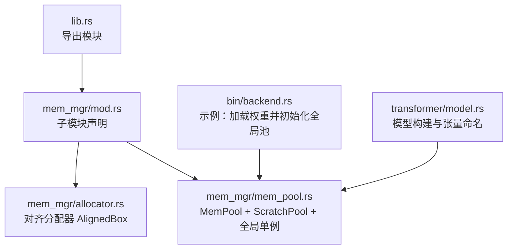
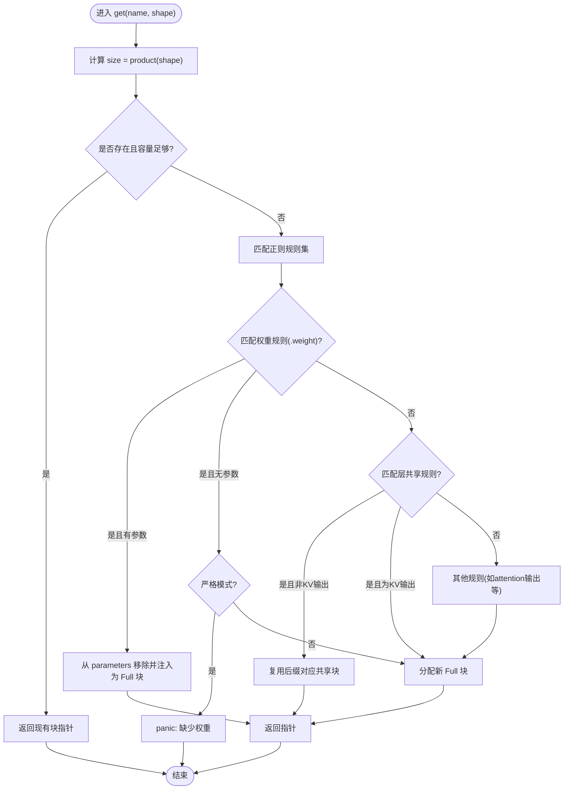
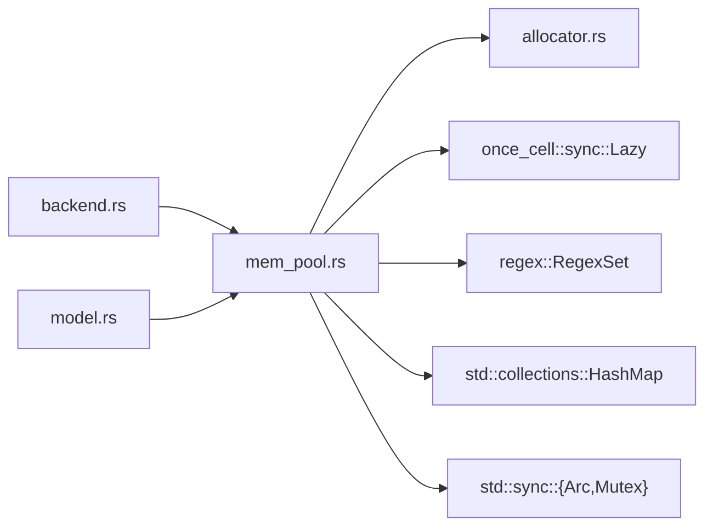

# 内存池管理

<cite>
**本文引用的文件**   
- [src/mem_mgr/mod.rs](file://src/mem_mgr/mod.rs)
- [src/mem_mgr/allocator.rs](file://src/mem_mgr/allocator.rs)
- [src/mem_mgr/mem_pool.rs](file://src/mem_mgr/mem_pool.rs)
- [src/lib.rs](file://src/lib.rs)
- [src/bin/backend.rs](file://src/bin/backend.rs)
- [src/transformer/model.rs](file://src/transformer/model.rs)
</cite>

## 目录
1. [简介](#简介)
2. [项目结构](#项目结构)
3. [核心组件](#核心组件)
4. [架构总览](#架构总览)
5. [详细组件分析](#详细组件分析)
6. [依赖关系分析](#依赖关系分析)
7. [性能与调优](#性能与调优)
8. [故障排查指南](#故障排查指南)
9. [结论](#结论)
10. [附录：使用模式与最佳实践](#附录使用模式与最佳实践)

## 简介
本文件系统性地梳理并文档化仓库中的“内存池管理系统”，覆盖整体架构、池化策略、对象复用机制与生命周期管理；详细说明初始化配置（池大小、增长策略、容量限制）、分配/回收/清理流程、空闲对象管理与垃圾回收机制；提供多线程并发安全说明、监控与性能调优方法，以及常见问题的排查思路。

## 项目结构
内存池相关代码集中在 src/mem_mgr 模块下，包含对齐分配器与两类池：参数/权重池 MemPool 与临时缓冲池 ScratchPool。顶层 lib.rs 将 mem_mgr 作为公共模块暴露给上层组件（如 transformer、operators、runtime）。



图表来源
- [src/lib.rs:7-15](file://src/lib.rs#L7-L15)
- [src/mem_mgr/mod.rs:1-3](file://src/mem_mgr/mod.rs#L1-L3)
- [src/mem_mgr/allocator.rs:1-156](file://src/mem_mgr/allocator.rs#L1-L156)
- [src/mem_mgr/mem_pool.rs:1-543](file://src/mem_mgr/mem_pool.rs#L1-L543)
- [src/bin/backend.rs:87-96](file://src/bin/backend.rs#L87-L96)
- [src/transformer/model.rs:109-167](file://src/transformer/model.rs#L109-L167)

章节来源
- [src/lib.rs:7-15](file://src/lib.rs#L7-L15)
- [src/mem_mgr/mod.rs:1-3](file://src/mem_mgr/mod.rs#L1-L3)

## 核心组件
- 对齐分配器 AlignedBox：基于系统分配器实现固定对齐（64字节）的连续内存块，支持按元素初始化、切片访问、偏移指针、Drop 释放等。
- 参数/权重池 MemPool：以名称为键的内存块映射，支持从预置参数哈希表注入权重、按正则规则进行共享与复用、严格模式校验形状一致性。
- 临时缓冲池 ScratchPool：按名称缓存已分配的缓冲区，按需扩容并在复用前填充初始值，避免重复分配。
- 全局单例接口：通过类型特化的 GlobalMemPool 与 GlobalScratchPool 提供进程级全局池的初始化与访问。

章节来源
- [src/mem_mgr/allocator.rs:1-156](file://src/mem_mgr/allocator.rs#L1-L156)
- [src/mem_mgr/mem_pool.rs:88-128](file://src/mem_mgr/mem_pool.rs#L88-L128)
- [src/mem_mgr/mem_pool.rs:208-235](file://src/mem_mgr/mem_pool.rs#L208-L235)
- [src/mem_mgr/mem_pool.rs:111-206](file://src/mem_mgr/mem_pool.rs#L111-L206)

## 架构总览
内存池采用“名称到内存块”的映射策略，结合正则匹配实现“按层共享”和“专家权重拼接”等高级复用。底层由 64 字节对齐的分配器保证 SIMD 友好布局。全局单例简化跨模块访问，但需注意线程同步开销。

```mermaid
classDiagram
class AlignedBox~T~ {
+allocate(length)
+allocate_init(length, value)
+as_ptr()
+as_mut_ptr()
+len()
+as_slice()
+as_mut_slice()
+as_ptr_offset(offset)
+as_mut_ptr_offset(offset)
}
class MemoryBlock~T~ {
<<enum>>
Full(Arc<AlignedBox<T>>)
Sub{parent : Arc<AlignedBox<T>>, offset : usize, size : usize}
+as_ptr()
+as_mut_ptr()
+len()
+as_slice()
+as_mut_slice()
}
class MemPool~T~ {
-blocks : HashMap<String, MemoryBlock<T>>
-parameters : HashMap<String, Vec<T>>
-strict_weights : bool
+new(parameters)
+new_strict(parameters)
+get(name, shape)
+get_scratch(name, len, value)
-build(parameters, strict)
-get_block(name, shape)
-get_or_allocate_full(name, size, init)
-insert_full_from_vec(name, data)
-block_has_capacity(block, size)
-get_existing_if_valid(name, size)
}
class ScratchPool~T~ {
-blocks : HashMap<String, AlignedBox<T>>
+new()
+get_init(name, len, value)
}
class GlobalMemPool {
<<trait>>
+init_global(parameters)
+init_global_strict(parameters)
+with_global(f)
}
class GlobalScratchPool {
<<trait>>
+with_scratch_pool(f)
}
MemPool~T~ --> AlignedBox~T~ : "创建/持有"
MemPool~T~ --> MemoryBlock~T~ : "管理"
ScratchPool~T~ --> AlignedBox~T~ : "持有"
f32 ..|> GlobalMemPool
f16 ..|> GlobalMemPool
bool ..|> GlobalScratchPool
usize ..|> GlobalScratchPool
```

图表来源
- [src/mem_mgr/allocator.rs:1-156](file://src/mem_mgr/allocator.rs#L1-L156)
- [src/mem_mgr/mem_pool.rs:24-93](file://src/mem_mgr/mem_pool.rs#L24-L93)
- [src/mem_mgr/mem_pool.rs:88-128](file://src/mem_mgr/mem_pool.rs#L88-L128)
- [src/mem_mgr/mem_pool.rs:111-206](file://src/mem_mgr/mem_pool.rs#L111-L206)
- [src/mem_mgr/mem_pool.rs:208-235](file://src/mem_mgr/mem_pool.rs#L208-L235)

## 详细组件分析

### 对齐分配器 AlignedBox
- 设计要点
  - 固定 64 字节对齐，适合 AVX512/F16 等 SIMD 路径。
  - 提供 allocate/allocate_init、切片视图、偏移指针、Clone/Drop 语义。
  - Send/Sync 标记用于跨线程传递。
- 复杂度
  - 分配/释放 O(1)。
  - 拷贝 Clone O(n)，仅用于测试或特殊场景。
- 注意事项
  - 长度必须大于 0，否则断言失败。
  - 偏移越界会触发断言。

章节来源
- [src/mem_mgr/allocator.rs:1-156](file://src/mem_mgr/allocator.rs#L1-L156)

### 内存块 MemoryBlock
- 两种形态
  - Full：直接持有完整 AlignedBox。
  - Sub：指向父块的某段切片（parent+offset..offset+size），零拷贝复用。
- 用途
  - 在专家权重拼接时，将多个 experts.* 权重合并到一个大数组，并以 Sub 形式暴露各专家视图。
  - 在层间共享时，不同层的同名张量可共享同一块内存。

章节来源
- [src/mem_mgr/mem_pool.rs:24-86](file://src/mem_mgr/mem_pool.rs#L24-L86)

### 参数/权重池 MemPool
- 数据结构
  - blocks：名称到 MemoryBlock 的映射。
  - parameters：外部注入的参数名到数据向量映射（构建期消费）。
  - strict_weights：是否开启严格模式（缺失或形状不匹配即报错）。
- 构建阶段 build
  - 扫描 parameters 中所有 “experts.*.proj.weight” 键，按 base_key 分组并按 expert_idx 排序，拼接为一个连续的大数组，再插入 Full 基块，并为每个专家 key 插入 Sub 视图。
- 运行时 get/get_scratch
  - get：根据 name 与 shape 计算 size，优先命中已有且容量足够的块；否则走正则匹配分支决定是复用、注入参数还是新分配。
  - get_scratch：按名称获取或分配足够大小的缓冲区，若存在则用给定值填充前 len 个元素。
- 正则匹配与复用策略
  - 权重匹配：name 以 .weight 结尾且存在于 parameters 时，直接注入；严格模式下要求长度与 shape 一致。
  - 层共享：对形如 model.layers.{i}.xxx 的名称，若后缀不是每层独立的 KV 输出，则复用该后缀对应的共享块。
  - 其他特定模式：如 attention 的 K/V 位置/投影输出等，按规则独立分配或复用。
- 严格模式
  - 缺失权重或形状不一致时 panic，便于在训练/验证阶段尽早发现问题。
- 容量与增长
  - 当前实现无动态扩容；当请求 size 超过现有块容量时会重新分配新块。
  - 可通过预先构造更大容量的块或合理命名来减少重分配。



图表来源
- [src/mem_mgr/mem_pool.rs:309-427](file://src/mem_mgr/mem_pool.rs#L309-L427)
- [src/mem_mgr/mem_pool.rs:249-307](file://src/mem_mgr/mem_pool.rs#L249-L307)

章节来源
- [src/mem_mgr/mem_pool.rs:237-428](file://src/mem_mgr/mem_pool.rs#L237-L428)

### 临时缓冲池 ScratchPool
- 设计要点
  - 按名称缓存 AlignedBox，首次分配后复用；每次使用前用指定值填充前 len 个元素。
  - 提供 with_scratch_pool 全局访问入口。
- 适用场景
  - 算子中间结果、归约中间态等短生命周期缓冲。

章节来源
- [src/mem_mgr/mem_pool.rs:208-235](file://src/mem_mgr/mem_pool.rs#L208-L235)
- [src/mem_mgr/mem_pool.rs:188-206](file://src/mem_mgr/mem_pool.rs#L188-L206)

### 全局单例与线程安全
- 全局池
  - f32/f16 的全局 MemPool 通过 Lazy + Mutex<Option<...>> 实现延迟初始化与互斥访问。
  - 提供 init_global/init_global_strict 与 with_global 闭包式访问。
- 全局 ScratchPool
  - bool/usize 的全局 ScratchPool 同样通过 Lazy + Mutex 保护。
- 并发安全
  - 全局池内部使用 Mutex 串行访问，确保线程安全。
  - 注意：频繁加锁可能成为热点瓶颈，建议批量操作或在调用侧做最小化临界区。

章节来源
- [src/mem_mgr/mem_pool.rs:104-206](file://src/mem_mgr/mem_pool.rs#L104-L206)

### 生命周期管理
- 所有权与释放
  - AlignedBox 负责底层内存分配与释放（Drop）。
  - MemoryBlock::Full 持有 Arc<AlignedBox<T>>，多引用计数共享；Sub 不额外持有底层内存，随父块释放而释放。
  - MemPool/ScratchPool 析构时，其内部 HashMap 被销毁，进而释放所有 AlignedBox。
- 参数注入
  - 构建期从 parameters 移入数据，避免二次拷贝；严格模式下校验形状。
- 复用与失效
  - 复用基于名称与容量判断；若后续请求尺寸变大，将重新分配新块，旧块可能被丢弃（若无其他引用）。

章节来源
- [src/mem_mgr/allocator.rs:104-118](file://src/mem_mgr/allocator.rs#L104-L118)
- [src/mem_mgr/mem_pool.rs:249-307](file://src/mem_mgr/mem_pool.rs#L249-L307)
- [src/mem_mgr/mem_pool.rs:348-368](file://src/mem_mgr/mem_pool.rs#L348-L368)

## 依赖关系分析
- 模块依赖
  - mem_pool 依赖 allocator 提供的 AlignedBox。
  - 上层（如 transformer/model、bin/backend）通过 GlobalMemPool 初始化并使用全局池。
- 外部依赖
  - once_cell::sync::Lazy：惰性初始化全局变量。
  - regex/regex::RegexSet：高性能正则匹配集合。
  - std::collections::HashMap：名称到内存块的映射。
  - std::sync::{Arc, Mutex}：共享所有权与互斥访问。



图表来源
- [src/mem_mgr/mem_pool.rs:1-7](file://src/mem_mgr/mem_pool.rs#L1-L7)
- [src/mem_mgr/allocator.rs:1-3](file://src/mem_mgr/allocator.rs#L1-L3)
- [src/bin/backend.rs:3-10](file://src/bin/backend.rs#L3-L10)
- [src/transformer/model.rs:17-25](file://src/transformer/model.rs#L17-L25)

章节来源
- [src/mem_mgr/mem_pool.rs:1-7](file://src/mem_mgr/mem_pool.rs#L1-L7)
- [src/mem_mgr/allocator.rs:1-3](file://src/mem_mgr/allocator.rs#L1-L3)

## 性能与调优
- 分配与复用
  - 优先复用：相同名称与尺寸的请求直接复用，避免分配与拷贝。
  - 专家权重拼接：将分散的 experts.* 权重合并为连续大块，提升访存局部性。
  - 层共享：同层不同实例共享后缀相同的张量，降低峰值内存。
- 对齐与SIMD
  - 64 字节对齐有利于 AVX512/F16 内核吞吐。
- 严格模式
  - 在开发/验证阶段启用严格模式，尽早发现权重缺失或形状不匹配问题。
- 全局锁优化
  - 减少 with_global/with_scratch_pool 的调用频率，尽量批量化访问。
  - 可在应用层维护本地句柄以减少锁竞争。
- 容量规划
  - 预估最大序列长度与 batch_size，提前分配足够大的 scratch 缓冲，避免运行期扩容。
  - 对于 KV cache 等逐层独立增长的缓冲，预留上限以避免频繁扩容。

[本节为通用指导，无需源码引用]

## 故障排查指南
- 严格模式报错
  - 现象：启动或首次访问某权重时 panic，提示缺失或形状不匹配。
  - 排查：检查参数加载是否正确、shape 是否与模型定义一致。
- 未初始化全局池
  - 现象：调用 with_global 时 panic，提示全局池未初始化。
  - 排查：确认在模型构建前已调用 init_global/init_global_strict。
- 空长度分配
  - 现象：分配长度为 0 时断言失败。
  - 排查：确保传入的长度 > 0。
- 越界访问
  - 现象：偏移越界断言失败。
  - 排查：检查 offset 与 size 边界。
- 正则未命中
  - 现象：未知名称导致 panic。
  - 排查：核对张量命名是否符合预期，必要时扩展正则规则。

章节来源
- [src/mem_mgr/mem_pool.rs:387-427](file://src/mem_mgr/mem_pool.rs#L387-L427)
- [src/mem_mgr/mem_pool.rs:145-185](file://src/mem_mgr/mem_pool.rs#L145-L185)
- [src/mem_mgr/allocator.rs:13-28](file://src/mem_mgr/allocator.rs#L13-L28)
- [src/mem_mgr/allocator.rs:76-85](file://src/mem_mgr/allocator.rs#L76-L85)

## 结论
该内存池系统通过对齐分配、名称映射、正则复用与严格校验，实现了高效、可控的权重与临时缓冲管理。全局单例简化了跨模块使用，但在高并发场景需关注锁开销。通过合理的容量规划与复用策略，可显著降低分配次数与内存碎片，提升推理吞吐。

[本节为总结性内容，无需源码引用]

## 附录：使用模式与最佳实践

### 初始化与配置
- 加载权重并初始化全局池
  - 使用 SafeTensorsLoader 加载权重为 HashMap<String, Vec<T>>。
  - 调用 T::init_global_strict(params) 或 T::init_global(params) 完成初始化。
- 示例参考
  - backend 示例中先加载权重，再调用 f16::init_global_strict(params)。

章节来源
- [src/bin/backend.rs:87-96](file://src/bin/backend.rs#L87-L96)
- [src/mem_mgr/mem_pool.rs:130-186](file://src/mem_mgr/mem_pool.rs#L130-L186)

### 分配与回收流程
- 参数/权重分配
  - 通过 Tensor 或算子内部以名称与 shape 向 MemPool 申请，自动命中/注入/复用。
- 临时缓冲分配
  - 使用 ScratchPool.get_init(name, len, value) 获取可写指针，下次同名请求复用并重置。
- 回收与清理
  - 池析构时统一释放；也可在业务层面显式重建池以清空状态。

章节来源
- [src/mem_mgr/mem_pool.rs:309-368](file://src/mem_mgr/mem_pool.rs#L309-L368)
- [src/mem_mgr/mem_pool.rs:218-235](file://src/mem_mgr/mem_pool.rs#L218-L235)

### 预分配与动态扩容处理
- 预分配
  - 估算最大序列长度与 batch_size，提前准备足够大的 scratch 缓冲。
- 动态扩容
  - 当请求尺寸超过现有块容量时，将重新分配新块；建议在上层控制最大尺寸，避免频繁扩容。

章节来源
- [src/mem_mgr/mem_pool.rs:348-368](file://src/mem_mgr/mem_pool.rs#L348-L368)

### 多线程环境下的并发安全
- 全局池通过 Mutex 保护，确保线程安全。
- 建议：
  - 减少临界区范围，批量化访问。
  - 在可能的情况下，将池句柄下推到线程局部或任务上下文，降低锁竞争。

章节来源
- [src/mem_mgr/mem_pool.rs:104-206](file://src/mem_mgr/mem_pool.rs#L104-L206)

### 内存使用监控与性能调优
- 监控指标
  - 分配次数、复用命中率、平均块大小、峰值内存占用。
- 调优方向
  - 调整正则规则与命名规范，提高复用率。
  - 合并小对象为大块，减少分配开销。
  - 针对热点路径禁用严格模式以提升性能（仅在受控环境）。

[本节为通用指导，无需源码引用]