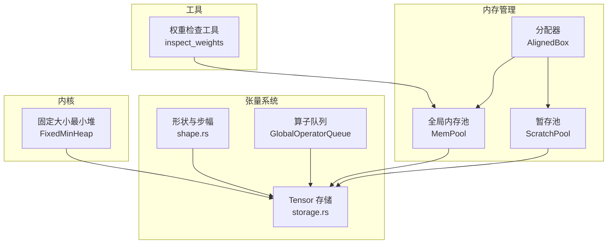
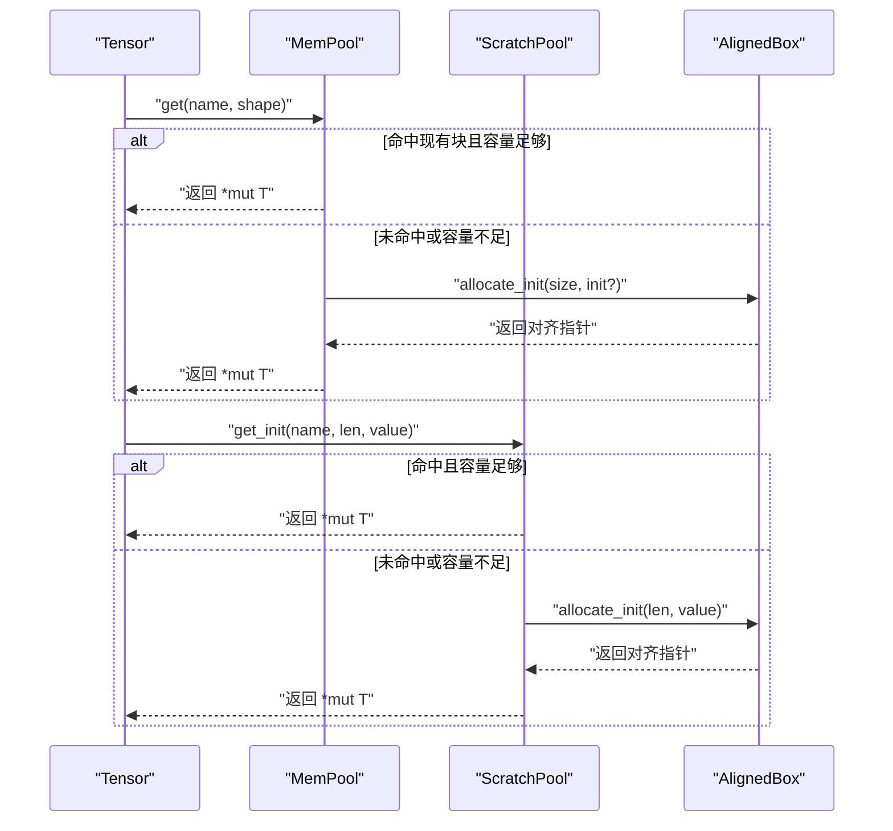
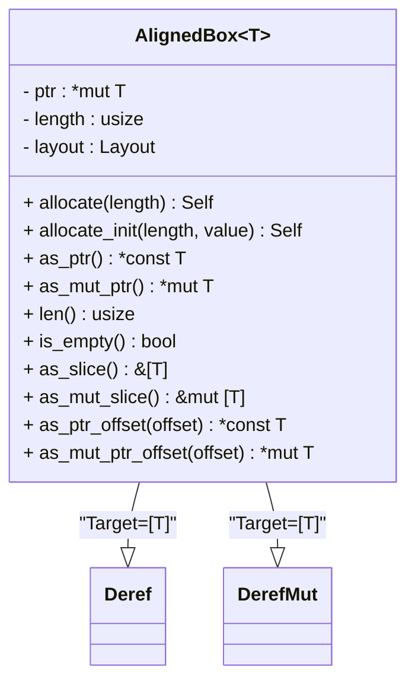
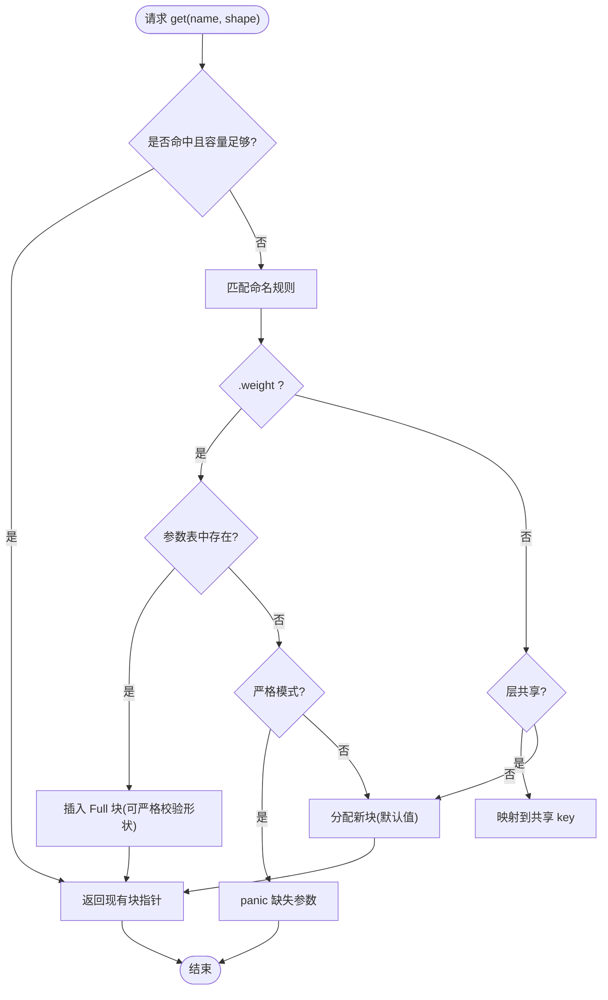
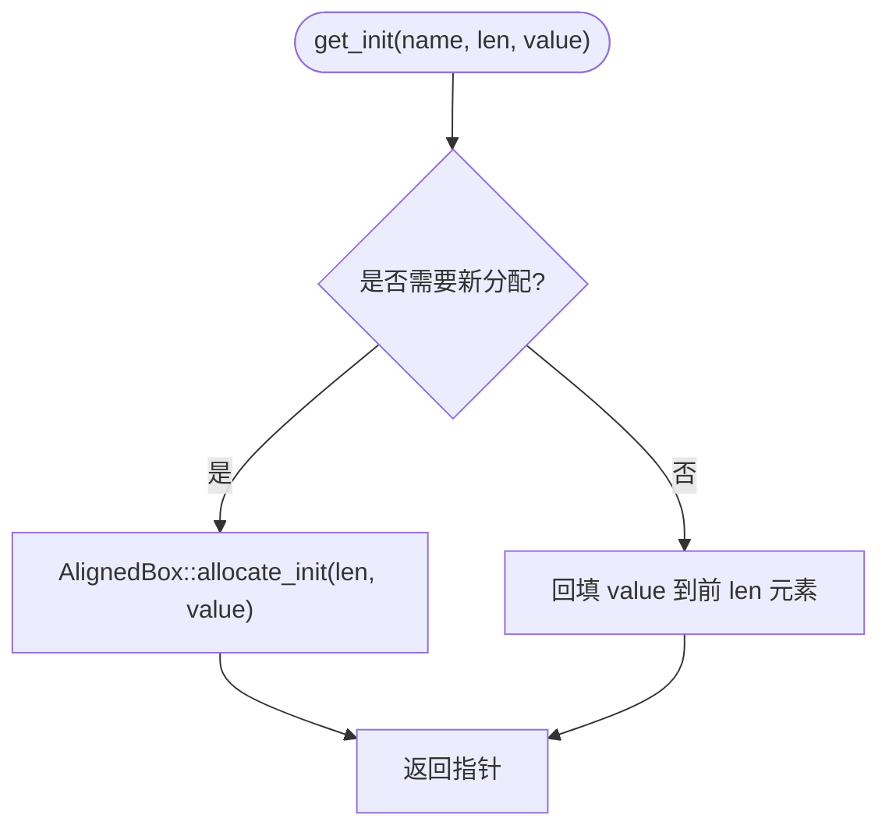
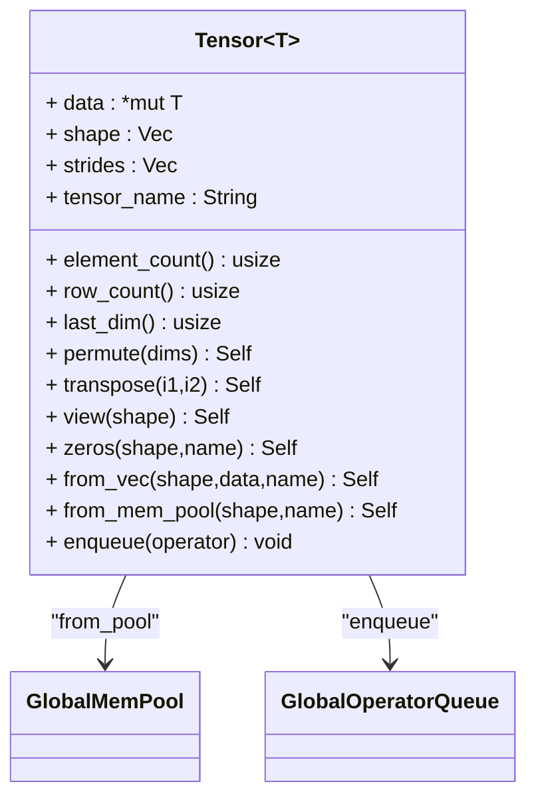
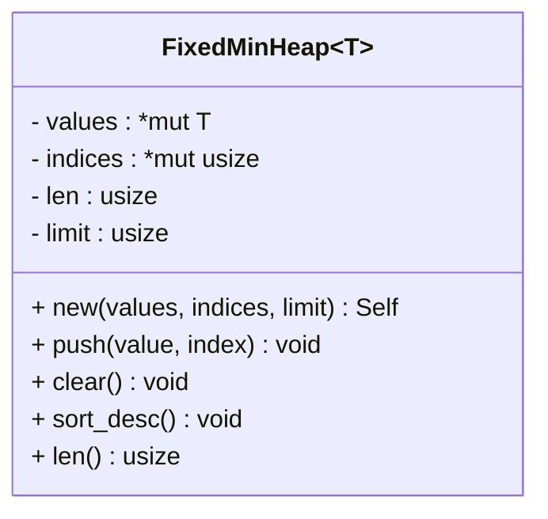
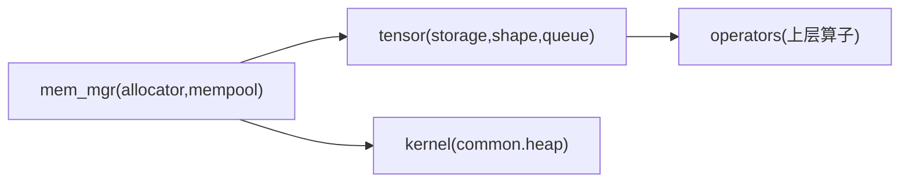

# 内存管理

<cite>
**本文引用的文件**   
- [src/mem_mgr/mod.rs](file://src/mem_mgr/mod.rs)
- [src/mem_mgr/allocator.rs](file://src/mem_mgr/allocator.rs)
- [src/mem_mgr/mem_pool.rs](file://src/mem_mgr/mem_pool.rs)
- [src/tensor/storage.rs](file://src/tensor/storage.rs)
- [src/tensor/shape.rs](file://src/tensor/shape.rs)
- [src/tensor/queue.rs](file://src/tensor/queue.rs)
- [src/kernel/common/heap.rs](file://src/kernel/common/heap.rs)
- [src/bin/inspect_weights.rs](file://src/bin/inspect_weights.rs)
</cite>

## 目录
1. [简介](#简介)
2. [项目结构](#项目结构)
3. [核心组件](#核心组件)
4. [架构总览](#架构总览)
5. [详细组件分析](#详细组件分析)
6. [依赖关系分析](#依赖关系分析)
7. [性能考量](#性能考量)
8. [故障排查指南](#故障排查指南)
9. [结论](#结论)
10. [附录](#附录)

## 简介
本文件系统性梳理 eLLM 的内存管理系统，重点覆盖：
- 64 字节对齐分配器设计与实现
- 全局内存池与暂存池（Scratch）的管理机制、复用策略与“类垃圾回收”行为
- 张量存储布局与访问优化（步幅计算、广播、视图/转置零拷贝）
- 内存使用监控与调试工具使用方法
- 内存泄漏检测与性能优化的最佳实践

## 项目结构
内存管理相关代码集中在以下模块：
- 分配器与内存池：src/mem_mgr
- 张量与形状：src/tensor
- 内核常用数据结构（用于 TopK 等算子）：src/kernel/common
- 权重检查工具：src/bin/inspect_weights.rs

图示来源
- [src/mem_mgr/allocator.rs:1-156](file://src/mem_mgr/allocator.rs#L1-L156)
- [src/mem_mgr/mem_pool.rs:1-543](file://src/mem_mgr/mem_pool.rs#L1-L543)
- [src/tensor/storage.rs:1-154](file://src/tensor/storage.rs#L1-L154)
- [src/tensor/shape.rs:1-182](file://src/tensor/shape.rs#L1-L182)
- [src/tensor/queue.rs:1-73](file://src/tensor/queue.rs#L1-L73)
- [src/kernel/common/heap.rs:1-257](file://src/kernel/common/heap.rs#L1-L257)
- [src/bin/inspect_weights.rs:1-123](file://src/bin/inspect_weights.rs#L1-L123)

章节来源
- [src/mem_mgr/mod.rs:1-3](file://src/mem_mgr/mod.rs#L1-L3)

## 核心组件
- 64 字节对齐分配器 AlignedBox：基于系统分配器，提供 64 字节对齐的连续内存块，支持初始化、切片访问、克隆与自动释放。
- 全局内存池 MemPool：按名称索引并复用已分配的内存块；支持严格模式校验参数形状；对 MoE 专家权重进行拼接与子块映射；为 KV 缓存与中间结果提供稳定复用。
- 暂存池 ScratchPool：按名称缓存对齐缓冲区，避免重复分配，适合临时中间结果。
- Tensor 存储：从全局池获取数据指针，维护 shape/strides/name；提供 view/transpose/permute 等零拷贝视图操作。
- 形状与步幅：提供行主序步幅计算、广播形状推导与对齐步幅计算。
- 算子队列 GlobalOperatorQueue：类型化的全局队列，配合 Tensor 完成延迟执行或批量调度（由上层编排）。
- 固定大小最小堆 FixedMinHeap：TopK 等算子的原地小顶堆实现，减少额外分配。
- 权重检查工具 inspect_weights：加载权重、统计非有限值、生成指纹，辅助验证与定位异常。

章节来源
- [src/mem_mgr/allocator.rs:1-156](file://src/mem_mgr/allocator.rs#L1-L156)
- [src/mem_mgr/mem_pool.rs:1-543](file://src/mem_mgr/mem_pool.rs#L1-L543)
- [src/tensor/storage.rs:1-154](file://src/tensor/storage.rs#L1-L154)
- [src/tensor/shape.rs:1-182](file://src/tensor/shape.rs#L1-L182)
- [src/tensor/queue.rs:1-73](file://src/tensor/queue.rs#L1-L73)
- [src/kernel/common/heap.rs:1-257](file://src/kernel/common/heap.rs#L1-L257)
- [src/bin/inspect_weights.rs:1-123](file://src/bin/inspect_weights.rs#L1-L123)

## 架构总览
整体内存管理采用“静态预分配 + 命名复用 + 视图零拷贝”的策略：
- 所有大块内存通过 AlignedBox 以 64 字节对齐分配，满足 SIMD 友好性。
- MemPool 将模型参数、KV 缓存与中间结果统一纳入命名空间，按名称命中已有块或按需分配。
- ScratchPool 为短生命周期中间缓冲提供按名复用。
- Tensor 仅持有指针与元信息，通过 shape/strides 表达多维视图，避免数据搬运。
- 算子层在需要时从池中取指针，直接就地计算，降低分配与复制开销。

图示来源
- [src/mem_mgr/mem_pool.rs:237-428](file://src/mem_mgr/mem_pool.rs#L237-L428)
- [src/mem_mgr/allocator.rs:12-43](file://src/mem_mgr/allocator.rs#L12-L43)
- [src/tensor/storage.rs:41-50](file://src/tensor/storage.rs#L41-L50)

## 详细组件分析

### 64 字节对齐分配器 AlignedBox
- 设计要点
  - 使用系统分配器按 64 字节对齐分配连续内存，适配 SIMD512 等向量化路径。
  - 提供 allocate/allocate_init、as_slice/as_mut_slice、Deref/DerefMut、Drop、Clone 等能力。
  - Drop 中负责元素析构与内存释放，确保 RAII 语义。
- 复杂度与特性
  - 分配/释放 O(1)，拷贝 O(n)。
  - 线程安全：Send/Sync 由用户保证类型 T 的语义。
- 典型用途
  - 作为 MemPool/ScratchPool 的底层存储单元。
  - 作为 Kernel 输入输出缓冲，避免额外拷贝。

图示来源
- [src/mem_mgr/allocator.rs:1-156](file://src/mem_mgr/allocator.rs#L1-L156)

章节来源
- [src/mem_mgr/allocator.rs:1-156](file://src/mem_mgr/allocator.rs#L1-L156)

### 全局内存池 MemPool
- 设计要点
  - 以 HashMap<String, MemoryBlock<T>> 维护命名块；MemoryBlock 支持 Full 与 Sub（父块偏移子视图）。
  - 构建阶段：
    - 解析参数键，识别 MoE 专家权重，将 experts.*.weight 拼接为基块，并为每个专家创建子块视图。
    - 其他参数按名称插入 Full 块。
  - 查询 get(name, shape)：
    - 若命中且容量足够则复用；否则根据正则规则决定是新建、从参数表迁移还是严格模式下报错。
    - 特殊处理：
      - .weight 参数：优先从参数表迁移到池；严格模式下要求形状一致。
      - 层共享参数：如 input_layernorm 在不同层间共享同一块。
      - K/V 投影输出：每层独立，不跨层共享。
- 复用与“垃圾回收”
  - 复用：按名称命中即复用，避免重复分配。
  - “GC”：当程序结束或池被替换时，Arc 引用计数归零触发释放；也可通过重新初始化覆盖旧池。
- 严格模式
  - strict_weights=true 时，缺失参数或形状不匹配会 panic，便于训练/对齐阶段快速发现问题。

图示来源
- [src/mem_mgr/mem_pool.rs:237-428](file://src/mem_mgr/mem_pool.rs#L237-L428)

章节来源
- [src/mem_mgr/mem_pool.rs:1-543](file://src/mem_mgr/mem_pool.rs#L1-L543)

### 暂存池 ScratchPool
- 设计要点
  - 按名称缓存 AlignedBox，get_init 在容量不足时重新分配并填充初始值，命中时复用并回填初始值。
  - 适用于注意力中间态、softmax 归一化等频繁分配/释放的临时缓冲。
- 复用机制
  - 名称相同且长度足够即复用，避免碎片与分配抖动。

图示来源
- [src/mem_mgr/mem_pool.rs:208-235](file://src/mem_mgr/mem_pool.rs#L208-L235)

章节来源
- [src/mem_mgr/mem_pool.rs:208-235](file://src/mem_mgr/mem_pool.rs#L208-L235)

### 张量存储与访问优化
- 存储布局
  - Tensor 仅保存 data 指针、shape、strides、tensor_name；数据来自全局池或向量拷贝。
  - strides 由 shape 计算得到，遵循行主序（最后一维步幅为 1）。
- 访问优化
  - view/transpose/permute 均为零拷贝，仅更新 shape/strides。
  - 广播形状与对齐步幅计算支持高效逐元素运算。
- 与池集成
  - from_mem_pool/from_pool 通过 GlobalMemPool 接口从全局池获取数据指针。
  - enqueue 将算子推入全局队列，供上层统一调度执行。

图示来源
- [src/tensor/storage.rs:1-154](file://src/tensor/storage.rs#L1-L154)
- [src/tensor/queue.rs:1-73](file://src/tensor/queue.rs#L1-L73)

章节来源
- [src/tensor/storage.rs:1-154](file://src/tensor/storage.rs#L1-L154)
- [src/tensor/shape.rs:1-182](file://src/tensor/shape.rs#L1-L182)
- [src/tensor/queue.rs:1-73](file://src/tensor/queue.rs#L1-L73)

### 内核常用数据结构：固定大小最小堆
- 用途
  - TopK 等算子需要维持固定大小的最小堆，原地维护 values 与 indices 数组，避免额外分配。
- 复杂度
  - push/sift_up/sift_down 均摊 O(log k)，k 为堆上限。
- 特点
  - 无动态分配，适合高频调用与低延迟场景。

图示来源
- [src/kernel/common/heap.rs:1-257](file://src/kernel/common/heap.rs#L1-L257)

章节来源
- [src/kernel/common/heap.rs:1-257](file://src/kernel/common/heap.rs#L1-L257)

## 依赖关系分析
- 模块耦合
  - mem_mgr 提供底层分配与池化能力，被 tensor 与 kernel 共同依赖。
  - tensor 依赖 mem_mgr 的全局池与队列，向上暴露高层 API。
  - kernel 使用 mem_mgr 提供的对齐缓冲与 Heap 结构。
- 外部依赖
  - 标准库分配器与 once_cell/Mutex 等同步原语。
- 潜在循环依赖
  - 当前未见循环导入；mem_mgr 不反向依赖 tensor。

图示来源
- [src/mem_mgr/mod.rs:1-3](file://src/mem_mgr/mod.rs#L1-L3)
- [src/tensor/mod.rs:1-14](file://src/tensor/mod.rs#L1-L14)

章节来源
- [src/mem_mgr/mod.rs:1-3](file://src/mem_mgr/mod.rs#L1-L3)
- [src/tensor/mod.rs:1-14](file://src/tensor/mod.rs#L1-L14)

## 性能考量
- 对齐与向量化
  - 64 字节对齐有利于 AVX-512/FMA 等指令集发挥吞吐优势，减少未对齐访存惩罚。
- 复用与碎片控制
  - MemPool/ScratchPool 按名复用，显著降低分配/释放频率与碎片风险。
- 零拷贝视图
  - Tensor 的 view/transpose/permute 仅修改元信息，避免数据移动。
- 局部性与缓存友好
  - 行主序与连续 KV 布局提升 L3 命中率；逐头顺序计算有助于延长 KV 驻留时间。
- 算子内原地结构
  - FixedMinHeap 原地维护堆，避免 TopK 过程中的额外分配。

[本节为通用指导，无需列出具体文件来源]

## 故障排查指南
- 权重加载与完整性
  - 使用 inspect_weights 工具：
    - 串行/并行加载权重
    - 统计非有限值数量与最坏张量
    - 生成指纹用于一致性比对
  - 建议流程：
    - 先串行加载并开启 validate，确认无 NaN/Inf
    - 再对比指纹，确保不同环境/版本下权重一致
- 严格模式问题
  - 若启用严格模式，缺失参数或形状不匹配会 panic，需核对参数键与形状定义。
- 内存泄漏检测
  - 观察 AlignedBox 的 Drop 是否被调用（RAII 语义），避免忘记释放的裸指针持有。
  - 对于 leaked_aligned_ptr 的使用需谨慎，仅在明确生命周期管理时使用。
- 性能回归定位
  - 结合日志打印线程配置与关键路径耗时，关注分配热点与锁竞争点。

章节来源
- [src/bin/inspect_weights.rs:1-123](file://src/bin/inspect_weights.rs#L1-L123)
- [src/mem_mgr/allocator.rs:104-115](file://src/mem_mgr/allocator.rs#L104-L115)
- [src/tensor/storage.rs:22-27](file://src/tensor/storage.rs#L22-L27)

## 结论
eLLM 的内存管理围绕“对齐分配 + 命名复用 + 零拷贝视图”展开，有效降低了运行时分配与复制成本，提升了 CPU 上的稳定性与效率。通过严格模式与权重检查工具，可在开发期尽早发现数据与形状问题；在生产期借助池化与视图优化，获得更稳定的端到端延迟表现。

[本节为总结性内容，无需列出具体文件来源]

## 附录
- 术语
  - 对齐分配：按指定字节边界分配内存，利于向量化与硬件预取。
  - 视图：不复制数据的逻辑重排，仅改变 shape/strides。
  - 严格模式：在参数加载时强制形状与存在性校验。
- 最佳实践
  - 尽量复用池中的命名块，避免频繁构造新名称导致无法命中。
  - 对大张量优先使用视图操作，减少拷贝。
  - 在高频路径中使用 ScratchPool 管理临时缓冲。
  - 使用严格模式进行开发与对齐，生产环境谨慎切换。

[本节为概念性内容，无需列出具体文件来源]