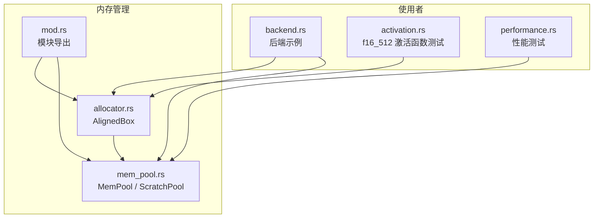
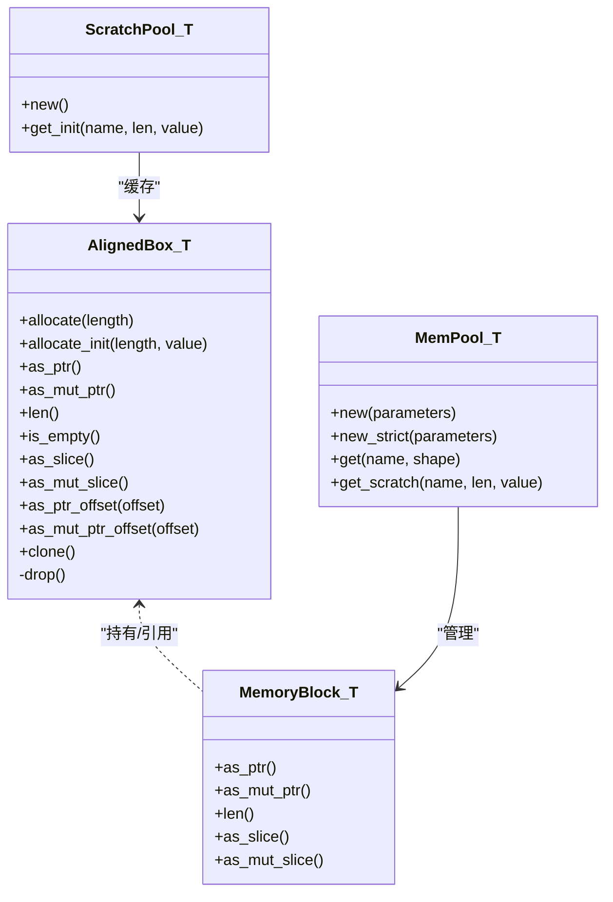
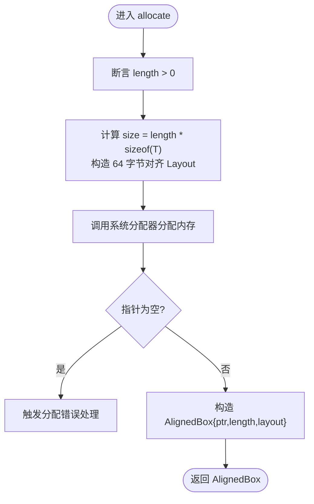
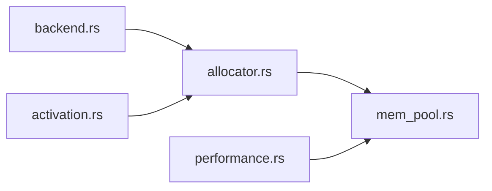

# 对齐内存分配器

<cite>
**本文引用的文件**
- [src/mem_mgr/allocator.rs](file://src/mem_mgr/allocator.rs)
- [src/mem_mgr/mod.rs](file://src/mem_mgr/mod.rs)
- [src/mem_mgr/mem_pool.rs](file://src/mem_mgr/mem_pool.rs)
- [src/bin/backend.rs](file://src/bin/backend.rs)
- [src/kernel/x86_64/f16_512/activation.rs](file://src/kernel/x86_64/f16_512/activation.rs)
- [src/tensor/tests/performance.rs](file://src/tensor/tests/performance.rs)
</cite>

## 目录
1. [简介](#简介)
2. [项目结构](#项目结构)
3. [核心组件](#核心组件)
4. [架构总览](#架构总览)
5. [详细组件分析](#详细组件分析)
6. [依赖关系分析](#依赖关系分析)
7. [性能考量](#性能考量)
8. [故障排查指南](#故障排查指南)
9. [结论](#结论)
10. [附录](#附录)

## 简介
本文件聚焦于对齐内存分配器的设计与实现，围绕 AlignedBox<T> 的 64 字节对齐策略、SIMD512 操作的性能优化、完整的内存分配/初始化/释放流程、指针与切片访问的安全机制、Send/Sync 特性与 Drop 自动资源管理，以及性能测试与对齐验证方法展开。AlignedBox<T> 为上层算子（如 f16_512 SIMD 内核）提供稳定、可复用且具备强对齐保证的连续内存视图，从而最大化 AVX-512 向量指令吞吐并降低访存开销。

## 项目结构
对齐内存相关代码位于 mem_mgr 模块中，包含：
- allocator：定义 AlignedBox<T> 及其生命周期与访问语义
- mem_pool：基于 AlignedBox<T> 构建参数池与临时缓冲池，支持全局单例与共享子块
- 使用方：后端入口、f16_512 内核测试等



图示来源
- [src/mem_mgr/allocator.rs:1-156](file://src/mem_mgr/allocator.rs#L1-L156)
- [src/mem_mgr/mem_pool.rs:1-543](file://src/mem_mgr/mem_pool.rs#L1-L543)
- [src/mem_mgr/mod.rs:1-3](file://src/mem_mgr/mod.rs#L1-L3)
- [src/bin/backend.rs:1-200](file://src/bin/backend.rs#L1-L200)
- [src/kernel/x86_64/f16_512/activation.rs:115-238](file://src/kernel/x86_64/f16_512/activation.rs#L115-L238)
- [src/tensor/tests/performance.rs:1-388](file://src/tensor/tests/performance.rs#L1-L388)

章节来源
- [src/mem_mgr/mod.rs:1-3](file://src/mem_mgr/mod.rs#L1-L3)

## 核心组件
- AlignedBox<T>：封装原始指针、长度与布局，提供 64 字节对齐的连续内存分配、初始化、切片访问、偏移指针、克隆、Drop 释放、Send/Sync 安全标注。
- MemPool<T>：以名称索引的内存块集合，支持从参数表加载权重、按正则匹配共享层权重、专家权重拼接为父块并提供子块视图；内部使用 AlignedBox<T> 确保对齐。
- ScratchPool<T>：轻量级“命名缓冲区”缓存，按需分配或重用，返回可直接写入的指针。

章节来源
- [src/mem_mgr/allocator.rs:1-156](file://src/mem_mgr/allocator.rs#L1-L156)
- [src/mem_mgr/mem_pool.rs:1-543](file://src/mem_mgr/mem_pool.rs#L1-L543)

## 架构总览
AlignedBox<T> 作为底层对齐内存原语，被 MemPool<T>/ScratchPool<T> 组合使用，向上暴露安全的 API；上层算子与后端通过池或直接分配获得 64 字节对齐的连续内存，配合 x86_64 f16_512 内核进行高性能计算。



图示来源
- [src/mem_mgr/allocator.rs:1-156](file://src/mem_mgr/allocator.rs#L1-L156)
- [src/mem_mgr/mem_pool.rs:1-543](file://src/mem_mgr/mem_pool.rs#L1-L543)

## 详细组件分析

### AlignedBox<T> 设计与实现
- 设计理念
  - 64 字节对齐：满足 AVX-512 向量寄存器宽度与多数硬件预取/缓存行边界要求，利于 _mm512_* 系列指令高效加载/存储。
  - 零拷贝视图：提供 as_slice/as_mut_slice 与 Deref/DerefMut，使上层以 Rust 安全切片方式访问对齐内存。
  - 明确生命周期：Drop 负责析构元素与释放底层内存；Clone 执行深拷贝；Send/Sync 在 T 满足条件时安全传播。
- 关键流程
  - 分配：根据 length 与 size_of::<T>() 计算总字节数，构造 64 字节对齐 Layout，调用系统分配器分配，空指针则触发错误处理。
  - 初始化：逐元素 ptr::write 写入初始值，适用于 Copy 类型。
  - 访问：as_ptr/as_mut_ptr 暴露原始指针；as_slice/as_mut_slice 构造切片；as_ptr_offset/as_mut_ptr_offset 带越界断言的偏移指针。
  - 克隆：分配新内存并使用非重叠拷贝复制数据。
  - 释放：若 T 需要 drop，逐个析构元素，再按原 Layout 释放内存。
- 安全机制
  - 长度断言与越界检查：分配前断言 length > 0；偏移访问断言 offset < length。
  - 所有权与借用：Deref/DerefMut 将 AlignedBox 视作切片，遵循借用规则；原始指针仅在必要处暴露。
  - Send/Sync：当 T: Send/Sync 时，显式 unsafe impl 标记，表明该类型可在多线程间安全传递与共享。
- 复杂度
  - allocate/allocate_init：O(1)/O(n)
  - clone：O(n)
  - drop：O(n)（仅当 T 需要析构）
  - 空间：额外保存 layout 与 length，无额外堆对象



图示来源
- [src/mem_mgr/allocator.rs:13-28](file://src/mem_mgr/allocator.rs#L13-L28)

章节来源
- [src/mem_mgr/allocator.rs:1-156](file://src/mem_mgr/allocator.rs#L1-L156)

### MemPool<T> 与 ScratchPool<T>
- MemPool<T>
  - 目标：统一管理模型参数与中间缓冲，减少重复分配，提升复用率与局部性。
  - 能力：
    - 从参数表加载权重，必要时严格校验形状。
    - 按名称正则匹配共享层权重（例如不同层的相同结构共享同一块内存）。
    - 专家权重拼接：将 experts.* 的多段权重合并为一个父块，并以子块形式暴露各专家片段，避免重复拷贝。
    - get/get_scratch：按名称获取或按需分配，返回可直接写入的指针。
  - 线程安全：对全局实例加锁，实现跨线程访问。
- ScratchPool<T>
  - 目标：为频繁分配的短生命周期缓冲提供命名缓存，避免反复分配/释放。
  - 行为：若已有同名块容量不足则扩容并填充初始值；否则复用现有块并覆盖所需范围。

```mermaid
sequenceDiagram
participant Caller as "调用者"
participant Pool as "MemPool<T>"
participant Block as "MemoryBlock<T>"
participant Box as "AlignedBox<T>"
Caller->>Pool : get("name", shape)
Pool->>Pool : 计算 size=product(shape)
alt 命中已存在且容量足够
Pool-->>Caller : 返回对应块指针
else 未命中或容量不足
Pool->>Pool : 正则匹配/参数查找/专家拼接
alt 来自参数表
Pool->>Box : allocate(len)
Box-->>Pool : 对齐内存
Pool->>Block : 包装为 Full(Arc<Box>)
else 临时缓冲
Pool->>Box : allocate_init(size, default)
Box-->>Pool : 对齐内存
Pool->>Block : 包装为 Full(Arc<Box>)
end
Pool-->>Caller : 返回块指针
end
```

图示来源
- [src/mem_mgr/mem_pool.rs:237-428](file://src/mem_mgr/mem_pool.rs#L237-L428)
- [src/mem_mgr/allocator.rs:13-43](file://src/mem_mgr/allocator.rs#L13-L43)

章节来源
- [src/mem_mgr/mem_pool.rs:1-543](file://src/mem_mgr/mem_pool.rs#L1-L543)

### 使用示例与常见用法
- 基本分配与初始化
  - 使用 allocate_init 创建长度为 N 的对齐内存，并用指定值初始化。
  - 参考路径：[src/bin/backend.rs:94-96](file://src/bin/backend.rs#L94-L96)、[src/kernel/x86_64/f16_512/activation.rs:130-140](file://src/kernel/x86_64/f16_512/activation.rs#L130-L140)
- 指针与切片访问
  - 通过 as_mut_ptr()/as_ptr() 获取原始指针供 SIMD 内核读取/写入。
  - 通过 as_slice()/as_mut_slice() 以切片方式读写。
  - 参考路径：[src/kernel/x86_64/f16_512/activation.rs:134-141](file://src/kernel/x86_64/f16_512/activation.rs#L134-L141)
- 克隆操作
  - 调用 clone() 完成深拷贝，保持 64 字节对齐。
  - 参考路径：[src/mem_mgr/allocator.rs:120-128](file://src/mem_mgr/allocator.rs#L120-L128)
- 池化使用
  - 通过 MemPool::get/get_scratch 获取或分配命名缓冲，减少分配次数。
  - 参考路径：[src/mem_mgr/mem_pool.rs:309-368](file://src/mem_mgr/mem_pool.rs#L309-L368)

章节来源
- [src/bin/backend.rs:94-96](file://src/bin/backend.rs#L94-L96)
- [src/kernel/x86_64/f16_512/activation.rs:130-141](file://src/kernel/x86_64/f16_512/activation.rs#L130-L141)
- [src/mem_mgr/allocator.rs:120-128](file://src/mem_mgr/allocator.rs#L120-L128)
- [src/mem_mgr/mem_pool.rs:309-368](file://src/mem_mgr/mem_pool.rs#L309-L368)

### Send/Sync 与 Drop 自动资源管理
- Send/Sync
  - 当 T: Send 时，AlignedBox<T> 实现 Send；当 T: Sync 时，实现 Sync。这允许在对齐内存上承载可在线程间安全传递的类型。
  - 参考路径：[src/mem_mgr/allocator.rs:117-118](file://src/mem_mgr/allocator.rs#L117-L118)
- Drop
  - 若 T 需要析构，则在释放前逐个调用 drop_in_place，然后按原 Layout 释放内存，确保无泄漏。
  - 参考路径：[src/mem_mgr/allocator.rs:104-115](file://src/mem_mgr/allocator.rs#L104-L115)

章节来源
- [src/mem_mgr/allocator.rs:104-118](file://src/mem_mgr/allocator.rs#L104-L118)

## 依赖关系分析
- 直接依赖
  - std::alloc::{self, Layout}：用于对齐分配与释放
  - std::{mem, ops, ptr, slice}：用于尺寸计算、Deref/DerefMut、指针运算、切片构造
- 间接依赖
  - MemPool/ScratchPool 依赖 AlignedBox 提供对齐内存
  - f16_512 内核依赖 64 字节对齐输入输出以启用 _mm512_* 指令
  - 后端示例演示了端到端的使用场景



图示来源
- [src/mem_mgr/allocator.rs:1-156](file://src/mem_mgr/allocator.rs#L1-L156)
- [src/mem_mgr/mem_pool.rs:1-543](file://src/mem_mgr/mem_pool.rs#L1-L543)
- [src/bin/backend.rs:1-200](file://src/bin/backend.rs#L1-L200)
- [src/kernel/x86_64/f16_512/activation.rs:115-238](file://src/kernel/x86_64/f16_512/activation.rs#L115-L238)
- [src/tensor/tests/performance.rs:1-388](file://src/tensor/tests/performance.rs#L1-L388)

章节来源
- [src/mem_mgr/allocator.rs:1-156](file://src/mem_mgr/allocator.rs#L1-L156)
- [src/mem_mgr/mem_pool.rs:1-543](file://src/mem_mgr/mem_pool.rs#L1-L543)

## 性能考量
- 64 字节对齐与 SIMD512
  - 64 字节对齐契合 AVX-512 向量宽度，有利于 _mm512_load_ph/_mm512_store_ph 等指令的高效执行，减少未对齐导致的拆分与回退路径。
  - 连续内存布局提升缓存命中率与预取效率，降低 TLB miss 概率。
- 池化与复用
  - MemPool/ScratchPool 减少频繁分配/释放带来的系统调用与碎片化，提高整体吞吐与稳定性。
- 并行与线程亲和
  - 性能测试展示了多核并行执行算子的方式，结合面板线程划分与核心亲和设置，有助于充分利用 CPU 资源。
- 基准与评估
  - 可通过性能测试用例测量 GFLOPS、延迟与带宽利用率，对比对齐与非对齐路径的差异。

章节来源
- [src/tensor/tests/performance.rs:308-387](file://src/tensor/tests/performance.rs#L308-L387)

## 故障排查指南
- 分配失败
  - 现象：allocate 返回空指针后触发错误处理。
  - 排查：确认系统可用内存与进程限制；检查 length 是否过大。
  - 参考路径：[src/mem_mgr/allocator.rs:13-28](file://src/mem_mgr/allocator.rs#L13-L28)
- 越界访问
  - 现象：as_ptr_offset/as_mut_ptr_offset 断言失败。
  - 排查：确认 offset < length；核对切片长度与业务逻辑一致。
  - 参考路径：[src/mem_mgr/allocator.rs:76-85](file://src/mem_mgr/allocator.rs#L76-L85)
- 严格模式缺失参数
  - 现象：MemPool 严格模式下找不到权重或形状不匹配会 panic。
  - 排查：检查参数键名与形状；确认 strict 模式开关。
  - 参考路径：[src/mem_mgr/mem_pool.rs:387-407](file://src/mem_mgr/mem_pool.rs#L387-L407)
- 对齐验证失败
  - 现象：SIMD 内核加载/存储出现异常或结果偏差。
  - 排查：验证地址 % 64 == 0；确认使用 AlignedBox 而非普通 Vec 作为输入。
  - 参考路径：[src/mem_mgr/allocator.rs:136-144](file://src/mem_mgr/allocator.rs#L136-L144)

章节来源
- [src/mem_mgr/allocator.rs:13-28](file://src/mem_mgr/allocator.rs#L13-L28)
- [src/mem_mgr/allocator.rs:76-85](file://src/mem_mgr/allocator.rs#L76-L85)
- [src/mem_mgr/mem_pool.rs:387-407](file://src/mem_mgr/mem_pool.rs#L387-L407)
- [src/mem_mgr/allocator.rs:136-144](file://src/mem_mgr/allocator.rs#L136-L144)

## 结论
AlignedBox<T> 以 64 字节对齐为核心，为 SIMD512 算子提供了低开销、高吞吐的内存基础。配合 MemPool/ScratchPool 的池化管理，进一步降低了分配成本并提升了数据局部性。其清晰的 API、完善的安全机制与自动资源管理，使得上层开发既简洁又稳健。建议在所有面向 f16_512 的路径统一使用该对齐分配器，以获得最佳性能与一致性。

## 附录

### 内存分配、初始化与释放完整流程
- 分配
  - 计算 size = length * sizeof(T)，构造 64 字节对齐 Layout，调用系统分配器分配，空指针则错误处理。
  - 参考路径：[src/mem_mgr/allocator.rs:13-28](file://src/mem_mgr/allocator.rs#L13-L28)
- 初始化
  - 遍历 length，使用 ptr::write 写入初始值，适用于 Copy 类型。
  - 参考路径：[src/mem_mgr/allocator.rs:30-43](file://src/mem_mgr/allocator.rs#L30-L43)
- 释放
  - 若 T 需要析构，逐个 drop_in_place，再按原 Layout 释放内存。
  - 参考路径：[src/mem_mgr/allocator.rs:104-115](file://src/mem_mgr/allocator.rs#L104-L115)

章节来源
- [src/mem_mgr/allocator.rs:13-43](file://src/mem_mgr/allocator.rs#L13-L43)
- [src/mem_mgr/allocator.rs:104-115](file://src/mem_mgr/allocator.rs#L104-L115)

### 指针操作、切片访问与偏移计算的安全机制
- 指针访问
  - as_ptr/as_mut_ptr 暴露原始指针，需由调用方保证生命周期与并发安全。
  - 参考路径：[src/mem_mgr/allocator.rs:45-53](file://src/mem_mgr/allocator.rs#L45-L53)
- 切片访问
  - as_slice/as_mut_slice 构造切片，遵循借用规则，避免悬垂指针。
  - 参考路径：[src/mem_mgr/allocator.rs:66-73](file://src/mem_mgr/allocator.rs#L66-L73)
- 偏移计算
  - as_ptr_offset/as_mut_ptr_offset 带越界断言，防止越界访问。
  - 参考路径：[src/mem_mgr/allocator.rs:76-85](file://src/mem_mgr/allocator.rs#L76-L85)

章节来源
- [src/mem_mgr/allocator.rs:45-85](file://src/mem_mgr/allocator.rs#L45-L85)

### 性能测试与内存对齐验证方法
- 对齐验证
  - 断言首地址 % 64 == 0，确保 64 字节对齐。
  - 参考路径：[src/mem_mgr/allocator.rs:136-144](file://src/mem_mgr/allocator.rs#L136-L144)
- SIMD 内核测试
  - 使用 AlignedBox 准备输入输出，调用 _mm512_load_ph/_mm512_store_ph 进行加载/存储，并与标量参考实现比较误差。
  - 参考路径：[src/kernel/x86_64/f16_512/activation.rs:126-165](file://src/kernel/x86_64/f16_512/activation.rs#L126-L165)
- 性能基准
  - 多核并行执行算子，统计耗时与 GFLOPS，评估对齐与池化的收益。
  - 参考路径：[src/tensor/tests/performance.rs:308-387](file://src/tensor/tests/performance.rs#L308-L387)

章节来源
- [src/mem_mgr/allocator.rs:136-144](file://src/mem_mgr/allocator.rs#L136-L144)
- [src/kernel/x86_64/f16_512/activation.rs:126-165](file://src/kernel/x86_64/f16_512/activation.rs#L126-L165)
- [src/tensor/tests/performance.rs:308-387](file://src/tensor/tests/performance.rs#L308-L387)