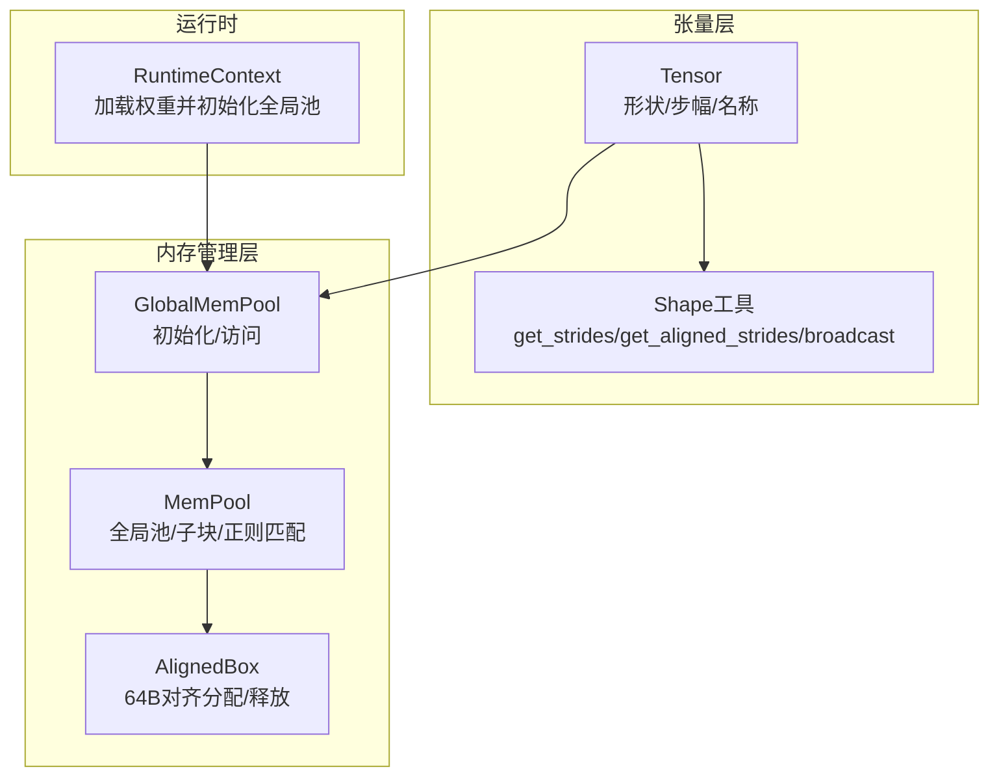
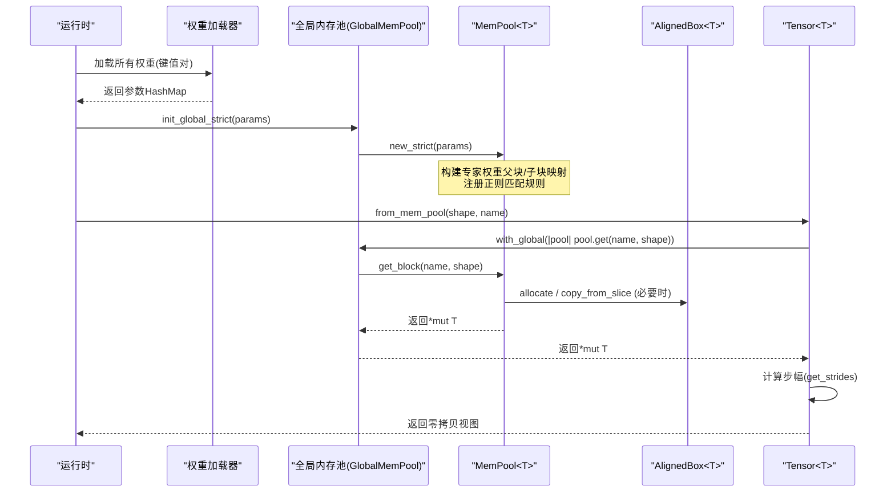
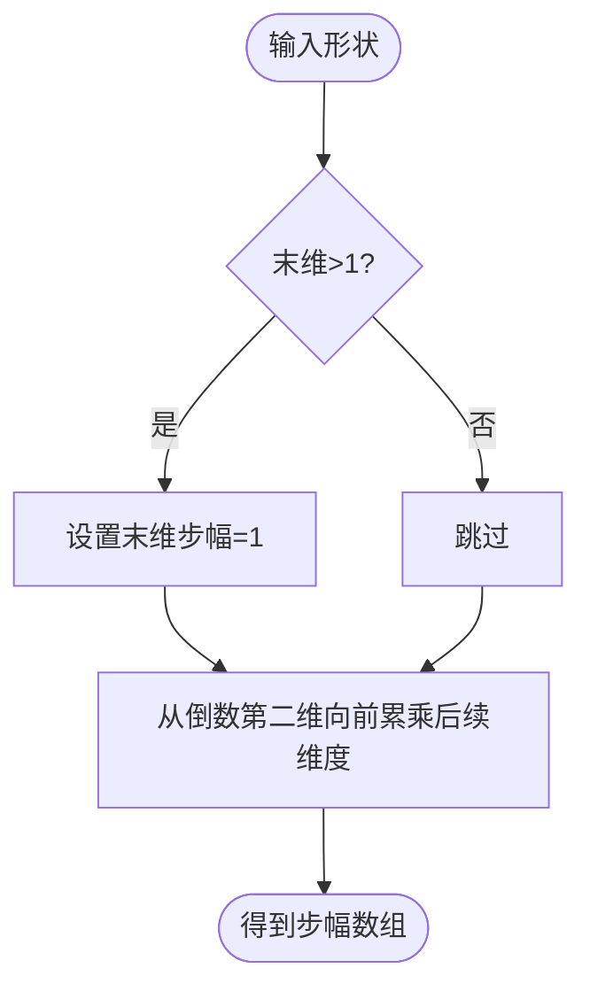
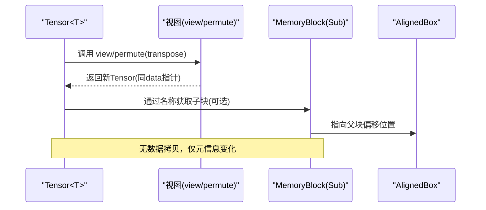
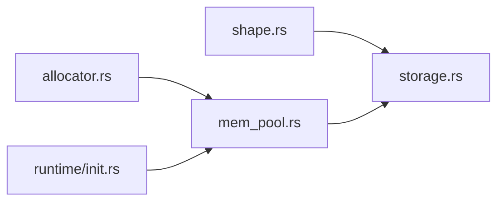

# 张量存储管理

<cite>
**本文引用的文件**   
- [src/tensor/storage.rs](file://src/tensor/storage.rs)
- [src/tensor/shape.rs](file://src/tensor/shape.rs)
- [src/mem_mgr/mod.rs](file://src/mem_mgr/mod.rs)
- [src/mem_mgr/allocator.rs](file://src/mem_mgr/allocator.rs)
- [src/mem_mgr/mem_pool.rs](file://src/mem_mgr/mem_pool.rs)
- [src/runtime/init.rs](file://src/runtime/init.rs)
</cite>

## 目录
1. [简介](#简介)
2. [项目结构](#项目结构)
3. [核心组件](#核心组件)
4. [架构总览](#架构总览)
5. [详细组件分析](#详细组件分析)
6. [依赖关系分析](#依赖关系分析)
7. [性能考量](#性能考量)
8. [故障排查指南](#故障排查指南)
9. [结论](#结论)
10. [附录](#附录)

## 简介
本文件围绕“张量存储管理”展开，系统性阐述内存布局设计、生命周期管理、零拷贝技术实现、数据类型优化策略（f16/f32），以及与内存分配器与内存池的集成方式。同时提供性能分析与优化实践建议，帮助读者在保持正确性的前提下获得更好的吞吐与延迟表现。

## 项目结构
与张量存储相关的核心代码位于 tensor 与 mem_mgr 两个模块：
- tensor 层负责张量的逻辑视图（形状、步幅、命名）以及零拷贝变换（view/permute/transposed）。
- mem_mgr 层提供对齐分配器与全局内存池，支撑参数权重复用、KV缓存共享、临时缓冲区复用等。



图表来源
- [src/tensor/storage.rs:11-50](file://src/tensor/storage.rs#L11-L50)
- [src/tensor/shape.rs:1-42](file://src/tensor/shape.rs#L1-L42)
- [src/mem_mgr/allocator.rs:12-128](file://src/mem_mgr/allocator.rs#L12-L128)
- [src/mem_mgr/mem_pool.rs:88-128](file://src/mem_mgr/mem_pool.rs#L88-L128)
- [src/runtime/init.rs:56-62](file://src/runtime/init.rs#L56-L62)

章节来源
- [src/tensor/storage.rs:11-50](file://src/tensor/storage.rs#L11-L50)
- [src/tensor/shape.rs:1-42](file://src/tensor/shape.rs#L1-L42)
- [src/mem_mgr/allocator.rs:12-128](file://src/mem_mgr/allocator.rs#L12-L128)
- [src/mem_mgr/mem_pool.rs:88-128](file://src/mem_mgr/mem_pool.rs#L88-L128)
- [src/runtime/init.rs:56-62](file://src/runtime/init.rs#L56-L62)

## 核心组件
- Tensor<T>：持有原始数据指针、形状、步幅与张量名；提供 view/permute/transposed 等零拷贝视图操作。
- AlignedBox<T>：64字节对齐的连续内存块，支持分配、初始化、切片、克隆与自动释放。
- MemPool<T>：基于名称的全局内存池，支持权重参数注入、按正则规则共享、专家权重拼接为父块+子块映射。
- GlobalMemPool<f32/f16>：类型化的全局池单例接口，用于统一初始化与访问。
- ScratchPool<T>：按名称复用的小对象缓冲池，避免频繁分配。

章节来源
- [src/tensor/storage.rs:11-50](file://src/tensor/storage.rs#L11-L50)
- [src/mem_mgr/allocator.rs:12-128](file://src/mem_mgr/allocator.rs#L12-L128)
- [src/mem_mgr/mem_pool.rs:88-128](file://src/mem_mgr/mem_pool.rs#L88-L128)
- [src/mem_mgr/mem_pool.rs:110-128](file://src/mem_mgr/mem_pool.rs#L110-L128)

## 架构总览
下图展示了从运行时加载权重到张量视图创建的端到端流程，包括全局池初始化、参数注入、按名称获取内存块、计算步幅与构建零拷贝视图。



图表来源
- [src/runtime/init.rs:56-62](file://src/runtime/init.rs#L56-L62)
- [src/mem_mgr/mem_pool.rs:241-307](file://src/mem_mgr/mem_pool.rs#L241-L307)
- [src/mem_mgr/mem_pool.rs:309-427](file://src/mem_mgr/mem_pool.rs#L309-L427)
- [src/mem_mgr/allocator.rs:12-43](file://src/mem_mgr/allocator.rs#L12-L43)
- [src/tensor/storage.rs:41-50](file://src/tensor/storage.rs#L41-L50)
- [src/tensor/shape.rs:1-15](file://src/tensor/shape.rs#L1-L15)

## 详细组件分析

### 内存布局设计与访问模式优化
- 连续内存分配：底层通过 64 字节对齐分配器保证 SIMD 友好布局，减少跨缓存行访问开销。
- 数据排列与步幅：采用行主序（C-order）步幅计算，最后维度步幅为 1，便于顺序遍历与向量化。
- 广播与对齐步幅：提供广播形状计算与对齐步幅工具，便于不同形状的张量进行元素级运算。



图表来源
- [src/tensor/shape.rs:1-15](file://src/tensor/shape.rs#L1-L15)
- [src/tensor/shape.rs:18-42](file://src/tensor/shape.rs#L18-L42)
- [src/tensor/shape.rs:44-72](file://src/tensor/shape.rs#L44-L72)

章节来源
- [src/mem_mgr/allocator.rs:12-43](file://src/mem_mgr/allocator.rs#L12-L43)
- [src/tensor/shape.rs:1-42](file://src/tensor/shape.rs#L1-L42)
- [src/tensor/shape.rs:44-72](file://src/tensor/shape.rs#L44-L72)

### 存储生命周期管理（创建、共享、引用计数、释放）
- 创建：Tensor 通过全局池按名称与形状获取内存块指针，随后计算步幅构造视图。
- 共享：
  - 权重共享：相同名称或符合正则规则的键共享同一内存块。
  - 专家权重拼接：将 experts.* 权重合并为一个大块，并以子块形式暴露各专家索引视图。
  - KV 缓存：特定输出键（如 k_proj.output/v_proj.output）按层独立分配，避免跨层共享导致状态污染。
- 引用计数：使用 Arc<AlignedBox<T>> 作为父块容器，子块仅保存偏移与长度，父块由多个子块共享，析构时统一释放。
- 释放：AlignedBox 在 Drop 中执行 dealloc；当最后一个 Arc 被销毁时，底层内存释放。

```mermaid
classDiagram
class AlignedBox~T~ {
+allocate(length)
+allocate_init(length, value)
+as_ptr()
+as_mut_ptr()
+len()
+as_slice()
+as_mut_slice()
+Drop()
}
class MemoryBlock~T~ {
<<enum>>
Full(Arc<AlignedBox<T>>)
Sub{parent : Arc<AlignedBox<T>>, offset : usize, size : usize}
+as_ptr()
+as_mut_ptr()
+len()
+as_slice()
+as_mut_slice()
}
class MemPool~T~ {
-blocks : HashMap<String, MemoryBlock<T>>
-parameters : HashMap<String, Vec<T>>
-strict_weights : bool
+new(parameters)
+new_strict(parameters)
+get(name, shape) *mut T
+get_scratch(name, len, value) *mut T
-get_block(name, shape) &MemoryBlock<T>
}
class Tensor~T~ {
+data : *mut T
+shape : Vec<usize>
+strides : Vec<usize>
+tensor_name : String
+from_mem_pool(shape, name) Self
+view(shape) Self
+permute(dims) Self
+transpose(i,j) Self
}
MemPool~T~ --> MemoryBlock~T~ : "管理"
MemoryBlock~T~ --> AlignedBox~T~ : "引用计数共享"
Tensor~T~ --> MemPool~T~ : "按名称获取"
```

图表来源
- [src/mem_mgr/allocator.rs:12-128](file://src/mem_mgr/allocator.rs#L12-L128)
- [src/mem_mgr/mem_pool.rs:24-86](file://src/mem_mgr/mem_pool.rs#L24-L86)
- [src/mem_mgr/mem_pool.rs:88-128](file://src/mem_mgr/mem_pool.rs#L88-L128)
- [src/mem_mgr/mem_pool.rs:241-307](file://src/mem_mgr/mem_pool.rs#L241-L307)
- [src/mem_mgr/mem_pool.rs:309-427](file://src/mem_mgr/mem_pool.rs#L309-L427)
- [src/tensor/storage.rs:11-50](file://src/tensor/storage.rs#L11-L50)

章节来源
- [src/mem_mgr/mem_pool.rs:241-307](file://src/mem_mgr/mem_pool.rs#L241-L307)
- [src/mem_mgr/mem_pool.rs:309-427](file://src/mem_mgr/mem_pool.rs#L309-L427)
- [src/mem_mgr/allocator.rs:104-128](file://src/mem_mgr/allocator.rs#L104-L128)
- [src/tensor/storage.rs:41-50](file://src/tensor/storage.rs#L41-L50)

### 零拷贝技术（视图、切片、共享内存）
- 视图与转置：view/permute/transposed 不复制数据，仅更新 shape/strides，实现 O(1) 复杂度。
- 切片与子块：MemoryBlock::Sub 以 parent+offset+size 表示子区域，避免额外拷贝。
- 共享内存：Arc 确保多视图共享同一物理内存，直到最后一个所有者释放。



图表来源
- [src/tensor/storage.rs:100-149](file://src/tensor/storage.rs#L100-L149)
- [src/mem_mgr/mem_pool.rs:24-86](file://src/mem_mgr/mem_pool.rs#L24-L86)

章节来源
- [src/tensor/storage.rs:100-149](file://src/tensor/storage.rs#L100-L149)
- [src/mem_mgr/mem_pool.rs:24-86](file://src/mem_mgr/mem_pool.rs#L24-L86)

### 数据类型优化策略（f16/f32）
- f16：推理阶段常用，显存占用减半，配合 64B 对齐分配器可充分利用 AVX512/FMA 等指令集。
- f32：训练或高精度场景使用；全局池分别维护 f16/f32 实例，互不干扰。
- 严格模式：strict 模式下缺失或尺寸不匹配的权重会触发断言/panic，有助于尽早发现模型加载问题。

章节来源
- [src/mem_mgr/mem_pool.rs:130-186](file://src/mem_mgr/mem_pool.rs#L130-L186)
- [src/runtime/init.rs:56-62](file://src/runtime/init.rs#L56-L62)

### 与内存分配器和内存池的集成
- 分配器：AlignedBox 封装系统分配，保证 64B 对齐，适合 SIMD 内核直接读取。
- 内存池：MemPool 根据张量名称与形状决定复用或新建，支持正则匹配与专家权重拼接。
- 全局入口：GlobalMemPool 提供类型化全局单例，运行时统一初始化与访问。

章节来源
- [src/mem_mgr/allocator.rs:12-43](file://src/mem_mgr/allocator.rs#L12-L43)
- [src/mem_mgr/mem_pool.rs:88-128](file://src/mem_mgr/mem_pool.rs#L88-L128)
- [src/mem_mgr/mem_pool.rs:241-307](file://src/mem_mgr/mem_pool.rs#L241-L307)
- [src/runtime/init.rs:56-62](file://src/runtime/init.rs#L56-L62)

## 依赖关系分析
- Tensor 依赖 shape 工具计算步幅，依赖 GlobalMemPool 获取内存。
- MemPool 依赖 AlignedBox 完成实际分配，并通过 Arc 实现共享。
- 运行时在启动时加载权重并初始化全局池，随后所有张量创建均走池路径。



图表来源
- [src/tensor/shape.rs:1-42](file://src/tensor/shape.rs#L1-L42)
- [src/tensor/storage.rs:1-50](file://src/tensor/storage.rs#L1-L50)
- [src/mem_mgr/allocator.rs:12-43](file://src/mem_mgr/allocator.rs#L12-L43)
- [src/mem_mgr/mem_pool.rs:88-128](file://src/mem_mgr/mem_pool.rs#L88-L128)
- [src/runtime/init.rs:56-62](file://src/runtime/init.rs#L56-L62)

章节来源
- [src/tensor/shape.rs:1-42](file://src/tensor/shape.rs#L1-L42)
- [src/tensor/storage.rs:1-50](file://src/tensor/storage.rs#L1-L50)
- [src/mem_mgr/allocator.rs:12-43](file://src/mem_mgr/allocator.rs#L12-L43)
- [src/mem_mgr/mem_pool.rs:88-128](file://src/mem_mgr/mem_pool.rs#L88-L128)
- [src/runtime/init.rs:56-62](file://src/runtime/init.rs#L56-L62)

## 性能考量
- 对齐与连续内存：64B 对齐提升 SIMD 吞吐，减少未对齐访存惩罚。
- 零拷贝视图：view/permute/transposed 避免数据移动，降低延迟与带宽压力。
- 权重复用与专家拼接：减少重复分配与碎片，提高缓存局部性。
- 严格模式：在开发期尽早捕获权重缺失/尺寸不匹配，避免运行期异常导致的回退路径。
- 批处理与分块：结合调度器与算子队列，尽量让内核以大块连续内存工作，提升并行度与流水线效率。

[本节为通用指导，无需列出具体文件来源]

## 故障排查指南
- 严格模式缺失权重：当 strict 模式下找不到对应权重或尺寸不匹配时会 panic，检查模型权重文件名与键名是否一致。
- 视图越界：view/permute 要求元素总数一致且维度合法，否则断言失败；核对 shape 与 strides 的计算。
- 共享冲突：注意 KV 缓存输出键按层独立分配，避免误用共享导致状态污染。
- 内存泄漏风险：若手动 forget 分配器对象，需确保外部生命周期接管；优先使用池与 RAII 语义。

章节来源
- [src/mem_mgr/mem_pool.rs:387-427](file://src/mem_mgr/mem_pool.rs#L387-L427)
- [src/tensor/storage.rs:126-136](file://src/tensor/storage.rs#L126-L136)
- [src/mem_mgr/mem_pool.rs:409-421](file://src/mem_mgr/mem_pool.rs#L409-L421)

## 结论
该存储管理体系通过对齐分配、全局池与零拷贝视图的组合，实现了高效、可扩展的张量内存管理。通过严格的权重校验与灵活的共享策略，既保证了正确性与可调试性，又兼顾了推理阶段的性能需求。建议在工程中遵循命名规范、合理使用视图与池，并结合严格模式进行早期验证。

[本节为总结性内容，无需列出具体文件来源]

## 附录
- 最佳实践清单
  - 使用 from_mem_pool 与全局池创建张量，避免重复分配。
  - 优先使用 view/permute/transposed 进行形状变换，避免拷贝。
  - 在开发阶段启用 strict 模式，尽早发现权重问题。
  - 关注 KV 缓存键的独立性，避免跨层共享造成状态污染。
  - 利用 ScratchPool 管理小对象临时缓冲，减少分配抖动。

[本节为通用指导，无需列出具体文件来源]