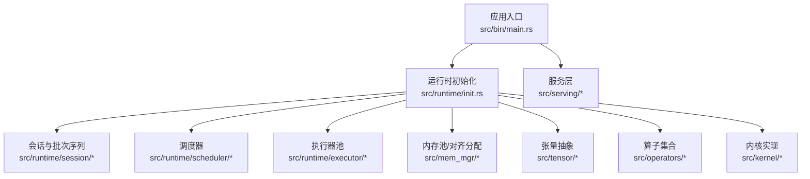
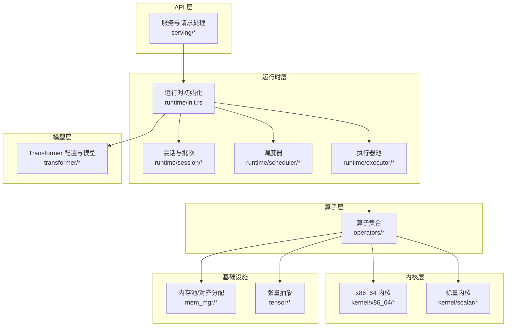
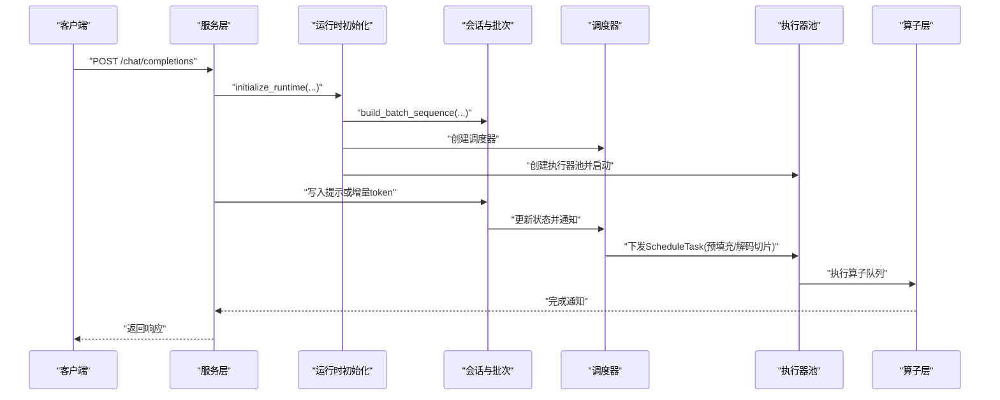
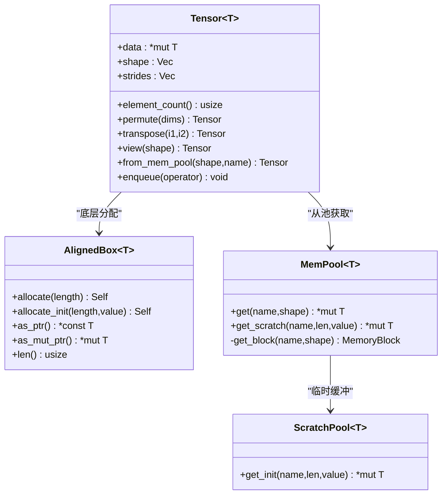
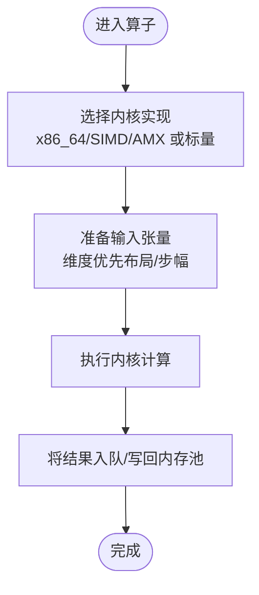
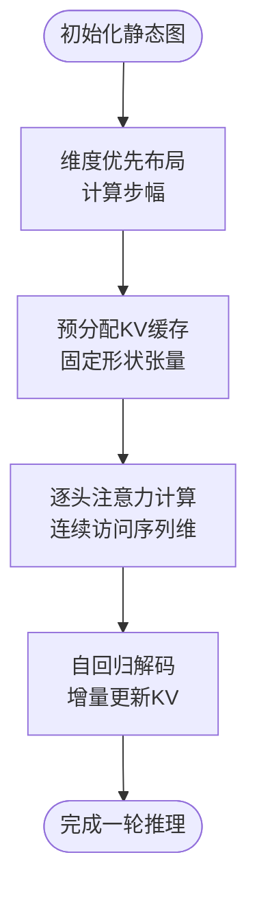
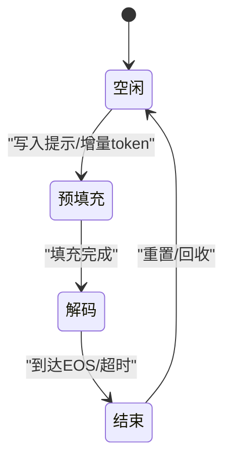
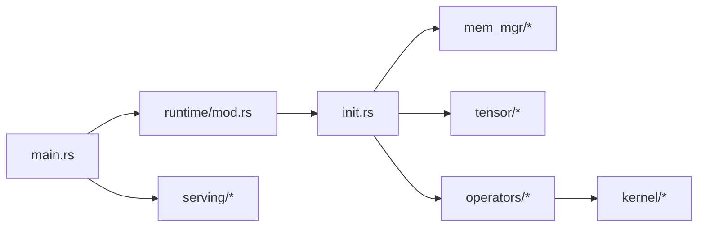

# 架构概览

<cite>
**本文引用的文件**
- [README.md](file://README.md)
- [Cargo.toml](file://Cargo.toml)
- [src/lib.rs](file://src/lib.rs)
- [src/bin/main.rs](file://src/bin/main.rs)
- [src/runtime/mod.rs](file://src/runtime/mod.rs)
- [src/runtime/init.rs](file://src/runtime/init.rs)
- [src/tensor/mod.rs](file://src/tensor/mod.rs)
- [src/tensor/storage.rs](file://src/tensor/storage.rs)
- [src/operators/mod.rs](file://src/operators/mod.rs)
- [src/kernel/mod.rs](file://src/kernel/mod.rs)
- [src/mem_mgr/mod.rs](file://src/mem_mgr/mod.rs)
- [src/mem_mgr/allocator.rs](file://src/mem_mgr/allocator.rs)
- [src/mem_mgr/mem_pool.rs](file://src/mem_mgr/mem_pool.rs)
- [docs/design/runtime/overview.md](file://docs/design/runtime/overview.md)
</cite>

## 目录
1. [简介](#简介)
2. [项目结构](#项目结构)
3. [核心组件](#核心组件)
4. [架构总览](#架构总览)
5. [详细组件分析](#详细组件分析)
6. [依赖关系分析](#依赖关系分析)
7. [性能考量](#性能考量)
8. [故障排查指南](#故障排查指南)
9. [结论](#结论)
10. [附录](#附录)

## 简介
eLLM 是面向 CPU 服务器的 LLM 推理框架，强调“以存储换计算”的设计哲学：通过弹性静态计算图、维度优先的张量布局、静态形状 KV 缓存预分配与头级注意力执行策略，在长上下文场景下显著降低端到端延迟并提升吞吐。系统采用领导者-工作者并发模型，结合任务调度与批处理策略，配合内存池、对齐分配与零拷贝技术，构建低开销、可预测的执行路径。

## 项目结构
仓库采用分层组织方式，顶层模块按职责划分：配置、内核、内存管理、算子、运行时、服务、张量与 Transformer 等。入口程序负责解析 CLI、初始化运行时上下文、启动 Tokio 多线程运行时并拉起服务。

图表来源
- [src/bin/main.rs:1-41](file://src/bin/main.rs#L1-L41)
- [src/runtime/init.rs:1-136](file://src/runtime/init.rs#L1-L136)
- [src/mem_mgr/mod.rs:1-3](file://src/mem_mgr/mod.rs#L1-L3)
- [src/tensor/mod.rs:1-14](file://src/tensor/mod.rs#L1-L14)
- [src/operators/mod.rs:1-109](file://src/operators/mod.rs#L1-L109)
- [src/kernel/mod.rs:1-4](file://src/kernel/mod.rs#L1-L4)

章节来源
- [src/bin/main.rs:1-41](file://src/bin/main.rs#L1-L41)
- [src/lib.rs:1-16](file://src/lib.rs#L1-L16)
- [Cargo.toml:1-102](file://Cargo.toml#L1-L102)

## 核心组件
- API 层：提供 OpenAI 兼容接口与服务编排（由服务模块承担）。
- 运行时层：负责输入准备、批调度、线程执行与会话管理，驱动整个推理流程。
- 模型层：基于 Transformer 配置与模型实例，封装前向与采样逻辑。
- 算子层：注意力、矩阵乘、归一化、路由与专家融合等算子集合。
- 内核层：针对 x86_64 的 SIMD/AMX 优化内核与通用标量内核。
- 内存管理层：对齐分配、全局内存池与临时缓冲池，支撑零拷贝与复用。
- 张量层：维度优先布局、视图/转置、步幅计算与操作队列集成。

章节来源
- [docs/design/runtime/overview.md:1-284](file://docs/design/runtime/overview.md#L1-L284)
- [src/runtime/mod.rs:1-23](file://src/runtime/mod.rs#L1-L23)
- [src/operators/mod.rs:1-109](file://src/operators/mod.rs#L1-L109)
- [src/kernel/mod.rs:1-4](file://src/kernel/mod.rs#L1-L4)
- [src/mem_mgr/mod.rs:1-3](file://src/mem_mgr/mod.rs#L1-L3)
- [src/tensor/mod.rs:1-14](file://src/tensor/mod.rs#L1-L14)

## 架构总览
eLLM 的整体架构遵循“API -> 运行时 -> 模型 -> 算子 -> 内核”的分层设计，并通过内存管理与张量抽象贯穿各层，确保数据访问模式与硬件特性匹配。

图表来源
- [src/bin/main.rs:1-41](file://src/bin/main.rs#L1-L41)
- [src/runtime/init.rs:1-136](file://src/runtime/init.rs#L1-L136)
- [src/operators/mod.rs:1-109](file://src/operators/mod.rs#L1-L109)
- [src/kernel/mod.rs:1-4](file://src/kernel/mod.rs#L1-L4)
- [src/mem_mgr/mod.rs:1-3](file://src/mem_mgr/mod.rs#L1-L3)
- [src/tensor/mod.rs:1-14](file://src/tensor/mod.rs#L1-L14)

## 详细组件分析

### 运行时与调度子系统
- 职责：将用户请求转换为可执行的计算任务，协调多线程并行执行，管理会话生命周期与槽位复用。
- 关键流程：
  - 输入准备：渲染对话模板、编码为 token。
  - 批调度：根据优先级规则生成当前轮次的切片，构造计划并分发到工作线程。
  - 线程执行：使用执行器池与同步屏障，按算子队列顺序执行。
  - 会话管理：统一会话生命周期，支持可重用与非重用模式，延迟回收槽位。

图表来源
- [docs/design/runtime/overview.md:183-221](file://docs/design/runtime/overview.md#L183-L221)
- [src/runtime/init.rs:34-136](file://src/runtime/init.rs#L34-L136)
- [src/runtime/mod.rs:11-23](file://src/runtime/mod.rs#L11-L23)

章节来源
- [docs/design/runtime/overview.md:1-284](file://docs/design/runtime/overview.md#L1-L284)
- [src/runtime/init.rs:1-136](file://src/runtime/init.rs#L1-L136)
- [src/runtime/mod.rs:1-23](file://src/runtime/mod.rs#L1-L23)

### 张量与内存管理
- 张量抽象：
  - 维度优先布局：通过步幅计算与视图/转置操作，保持同一逻辑坐标映射到连续内存区域，便于硬件预取与缓存命中。
  - 操作队列：算子结果通过全局操作队列异步执行，减少中间对象创建与拷贝。
- 内存管理：
  - 对齐分配：64字节对齐，适配 SIMD512 指令集，避免未对齐访问带来的性能损失。
  - 全局内存池：按名称与正则模式复用参数与中间缓冲区；支持严格模式校验权重形状；对 MoE 专家权重进行拼接与子块映射，减少碎片与重复分配。
  - 临时缓冲池：按名称缓存已分配块，按需扩容与初始化，避免频繁分配。

图表来源
- [src/tensor/storage.rs:1-154](file://src/tensor/storage.rs#L1-L154)
- [src/mem_mgr/allocator.rs:1-156](file://src/mem_mgr/allocator.rs#L1-L156)
- [src/mem_mgr/mem_pool.rs:1-543](file://src/mem_mgr/mem_pool.rs#L1-L543)

章节来源
- [src/tensor/storage.rs:1-154](file://src/tensor/storage.rs#L1-L154)
- [src/mem_mgr/allocator.rs:1-156](file://src/mem_mgr/allocator.rs#L1-L156)
- [src/mem_mgr/mem_pool.rs:1-543](file://src/mem_mgr/mem_pool.rs#L1-L543)

### 算子与内核
- 算子集合：包含注意力、矩阵乘（含 fused 变体）、归一化、TopKSoftmax、专家路由与融合等。
- 内核实现：
  - x86_64 专用内核：利用 AVX512/F16 与 AMX 指令加速矩阵乘、激活、排序与注意力等。
  - 标量内核：通用参考实现，用于对齐与验证。

图表来源
- [src/operators/mod.rs:1-109](file://src/operators/mod.rs#L1-L109)
- [src/kernel/mod.rs:1-4](file://src/kernel/mod.rs#L1-L4)

章节来源
- [src/operators/mod.rs:1-109](file://src/operators/mod.rs#L1-L109)
- [src/kernel/mod.rs:1-4](file://src/kernel/mod.rs#L1-L4)

### 静态计算图与 KV 缓存
- 静态计算图：构建全局唯一的静态图，结合维度优先布局，使相同逻辑坐标映射到相同内存位置，从而在不重建图的情况下支持不同输入长度。
- KV 缓存：采用固定形状的 KV 张量，直接按坐标读写，沿序列维度连续访问，减少元数据与动态分配开销，降低 TLB 与缓存缺失。
- 头级注意力：Prefill 阶段按头逐个计算，最大化单头 KV 数据驻留于缓存的时间窗口，提高时空局部性。

图表来源
- [README.md:48-58](file://README.md#L48-L58)

章节来源
- [README.md:48-58](file://README.md#L48-L58)

### 并发模型与批处理策略
- 领导者-工作者：主线程负责请求接入、输入准备与调度，工作线程并行执行算子队列。
- 任务调度：依据优先级与切片粒度生成预填充与解码任务，广播至工作线程。
- 批处理：通过 BatchSequence 与 SlotManager 管理批次与槽位，支持会话复用与延迟回收。

图表来源
- [docs/design/runtime/overview.md:225-238](file://docs/design/runtime/overview.md#L225-L238)

章节来源
- [docs/design/runtime/overview.md:1-284](file://docs/design/runtime/overview.md#L1-L284)

## 依赖关系分析
- 模块耦合：
  - 运行时依赖张量、内存池、算子与内核；服务层依赖运行时提供的调度与会话能力。
  - 算子依赖张量与内存池，调用内核实现。
- 外部依赖：
  - Tokio 异步运行时、Axum HTTP 框架、SafeTensors 权重加载、TikToken 分词器等。

图表来源
- [src/bin/main.rs:1-41](file://src/bin/main.rs#L1-L41)
- [src/runtime/mod.rs:1-23](file://src/runtime/mod.rs#L1-L23)
- [src/mem_mgr/mod.rs:1-3](file://src/mem_mgr/mod.rs#L1-L3)
- [src/tensor/mod.rs:1-14](file://src/tensor/mod.rs#L1-L14)
- [src/operators/mod.rs:1-109](file://src/operators/mod.rs#L1-L109)
- [src/kernel/mod.rs:1-4](file://src/kernel/mod.rs#L1-L4)

章节来源
- [Cargo.toml:1-102](file://Cargo.toml#L1-L102)
- [src/lib.rs:1-16](file://src/lib.rs#L1-L16)

## 性能考量
- 长上下文优势：CPU 大内存支持一次性 Prefill，减少分块与重复加载；大 L3 缓存配合头级注意力显著提升 KV 驻留率。
- 短上下文解码：控制路径与调度开销占比高，eLLM 通过静态图与精简执行路径降低动态成本。
- 小批量与瘦矩阵：CPU 对小批量与不规则矩阵更友好，MoE 负载不均衡问题在单机上得到缓解。
- 内存访问效率：静态连续 KV 张量与坐标直访形成线性访问模式，充分利用硬件预取与缓存。
- 内核启动开销：函数调用路径无内核启动成本，在小批量低并行场景更稳定。

章节来源
- [README.md:120-183](file://README.md#L120-L183)

## 故障排查指南
- 权重加载失败：检查 SafeTensorsLoader 是否成功加载所有权重，严格模式下缺失或形状不匹配会触发断言。
- 内存池未初始化：Tensor 从全局池获取数据时若未初始化将 panic，确认初始化流程已调用。
- 会话与槽位状态异常：检查会话模式与槽位回收策略，确保状态机转换合法。
- 算子执行错误：核对算子输入形状与步幅一致性，确认操作队列中任务顺序正确。

章节来源
- [src/runtime/init.rs:34-136](file://src/runtime/init.rs#L34-L136)
- [src/mem_mgr/mem_pool.rs:370-427](file://src/mem_mgr/mem_pool.rs#L370-L427)
- [docs/design/runtime/overview.md:225-238](file://docs/design/runtime/overview.md#L225-L238)

## 结论
eLLM 通过静态计算图、维度优先布局、静态 KV 缓存与头级注意力执行策略，在 CPU 服务器上实现了高效、可预测的长上下文推理路径。结合领导者-工作者并发模型、批处理与内存池/对齐分配/零拷贝等技术，系统在长上下文场景具备显著优势，并在短上下文解码中通过降低控制路径开销获得稳定收益。

## 附录
- 术语表：参见文档参考中的术语定义。
- 贡献指南：新增算子与模型注册的规范与测试要求。