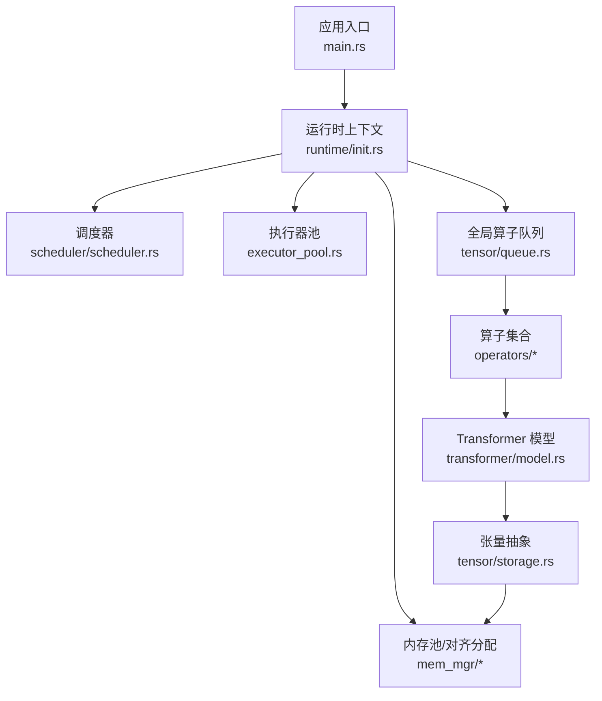
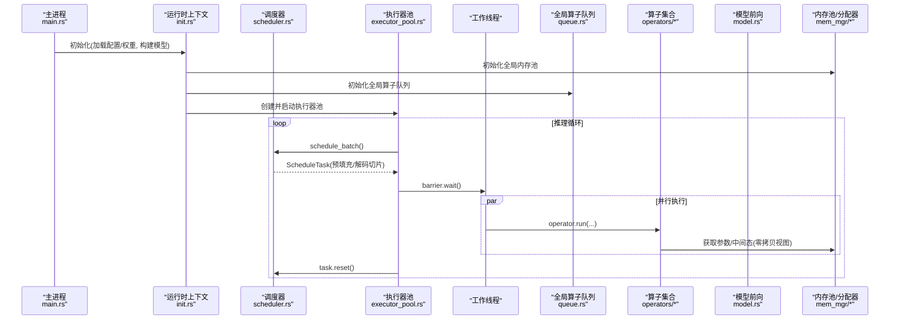
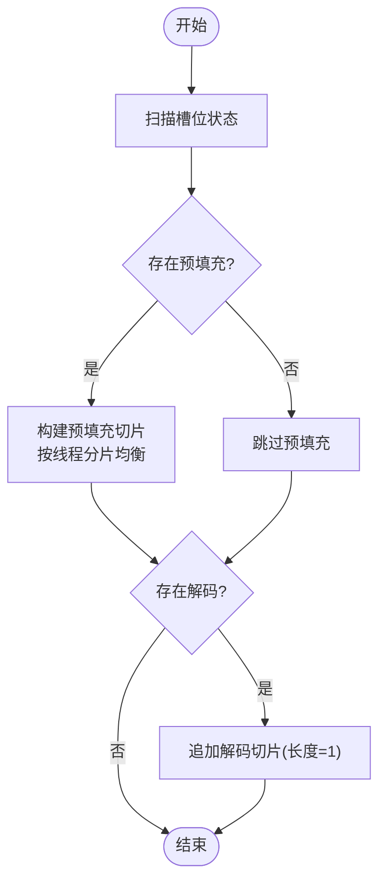
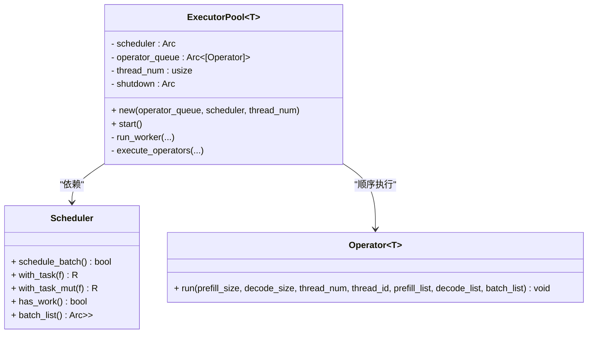
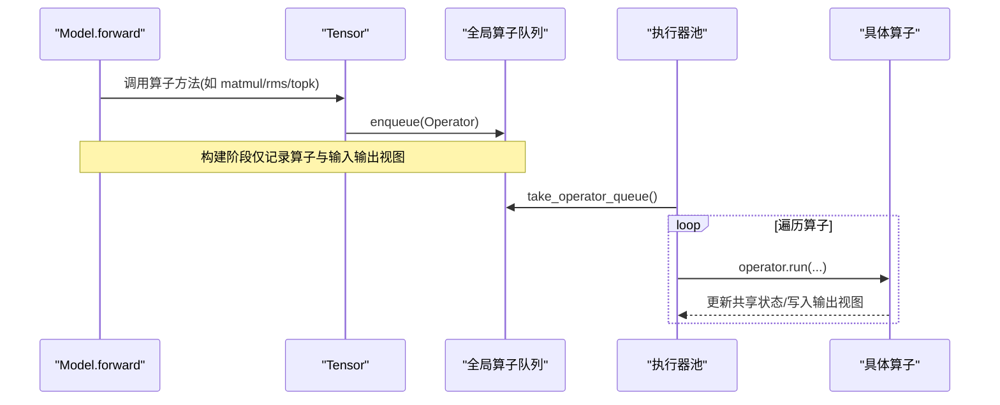
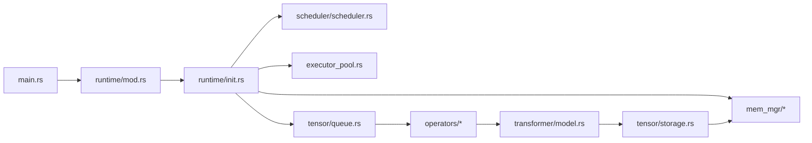

# 系统设计

<cite>
**本文引用的文件**   
- [src/lib.rs](file://src/lib.rs)
- [src/bin/main.rs](file://src/bin/main.rs)
- [src/runtime/mod.rs](file://src/runtime/mod.rs)
- [src/runtime/init.rs](file://src/runtime/init.rs)
- [src/runtime/scheduler/mod.rs](file://src/runtime/scheduler/mod.rs)
- [src/runtime/scheduler/scheduler.rs](file://src/runtime/scheduler/scheduler.rs)
- [src/mem_mgr/mod.rs](file://src/mem_mgr/mod.rs)
- [src/mem_mgr/allocator.rs](file://src/mem_mgr/allocator.rs)
- [src/mem_mgr/mem_pool.rs](file://src/mem_mgr/mem_pool.rs)
- [src/tensor/mod.rs](file://src/tensor/mod.rs)
- [src/tensor/storage.rs](file://src/tensor/storage.rs)
- [src/tensor/queue.rs](file://src/tensor/queue.rs)
- [src/operators/mod.rs](file://src/operators/mod.rs)
- [src/transformer/model.rs](file://src/transformer/model.rs)
</cite>

## 目录
1. [引言](#引言)
2. [项目结构](#项目结构)
3. [核心组件](#核心组件)
4. [架构总览](#架构总览)
5. [详细组件分析](#详细组件分析)
6. [依赖关系分析](#依赖关系分析)
7. [性能考量](#性能考量)
8. [故障排查指南](#故障排查指南)
9. [结论](#结论)
10. [附录](#附录)

## 引言
本设计文档面向 eLLM 推理系统，系统性阐述其分层架构、静态计算图与算子队列、维度优先的张量布局策略、领导者-工作者并发模型、任务调度与批处理策略、内存管理（对齐分配、内存池、零拷贝）等关键设计。同时提供组件交互图与数据处理流程图，帮助开发者理解从请求进入、构建静态图、调度执行到结果落盘的完整推理流程，并给出性能优化策略与技术权衡说明。

## 项目结构
eLLM 采用按功能域划分的模块组织方式：
- 运行时与调度：runtime（初始化、会话、调度器、执行器池）
- 内存管理：mem_mgr（对齐分配器、全局内存池、暂存池）
- 张量与算子：tensor（Tensor、形状与步长、全局算子队列）、operators（线性、注意力、归一化、专家路由等）
- 模型与层：transformer（模型装配、解码层、RoPE、MoE 等）
- 服务入口：bin/main.rs（CLI、Tokio 运行时、服务启动）
- 顶层模块聚合：lib.rs



图表来源
- [src/bin/main.rs:1-41](file://src/bin/main.rs#L1-L41)
- [src/runtime/init.rs:1-136](file://src/runtime/init.rs#L1-L136)
- [src/runtime/scheduler/scheduler.rs:1-736](file://src/runtime/scheduler/scheduler.rs#L1-L736)
- [src/runtime/executor/executor_pool.rs:1-260](file://src/runtime/executor/executor_pool.rs#L1-L260)
- [src/mem_mgr/allocator.rs:1-156](file://src/mem_mgr/allocator.rs#L1-L156)
- [src/mem_mgr/mem_pool.rs:1-543](file://src/mem_mgr/mem_pool.rs#L1-L543)
- [src/tensor/queue.rs:1-73](file://src/tensor/queue.rs#L1-L73)
- [src/operators/mod.rs:1-109](file://src/operators/mod.rs#L1-L109)
- [src/transformer/model.rs:1-549](file://src/transformer/model.rs#L1-L549)
- [src/tensor/storage.rs:1-154](file://src/tensor/storage.rs#L1-L154)

章节来源
- [src/lib.rs:1-16](file://src/lib.rs#L1-L16)
- [src/bin/main.rs:1-41](file://src/bin/main.rs#L1-L41)
- [src/runtime/mod.rs:1-23](file://src/runtime/mod.rs#L1-L23)

## 核心组件
- 运行时上下文 RuntimeContext：封装批次序列、调度器、槽位管理器、线程配置、会话模式等，作为系统启动后共享的核心状态。
- 调度器 Scheduler：负责将活跃槽位转换为可执行的 ScheduleTask（预填充切片与解码切片），支持分片与多线程均衡。
- 执行器池 ExecutorPool：领导者-工作者模型，工作线程同步执行算子；主线程负责调度与任务重置。
- 内存池 MemPool/ScratchPool：基于正则匹配与专家权重拼接的全局参数池，支持严格与非严格模式；对齐分配器保证 SIMD 友好。
- 张量 Tensor：以指针+形状+步长的轻量视图，配合全局算子队列实现延迟执行与零拷贝视图。
- 算子与模型：算子通过 Operator 接口注册到全局队列；Model 组装各层，生成静态计算图并驱动执行。

章节来源
- [src/runtime/init.rs:21-136](file://src/runtime/init.rs#L21-L136)
- [src/runtime/scheduler/scheduler.rs:15-223](file://src/runtime/scheduler/scheduler.rs#L15-L223)
- [src/runtime/executor/executor_pool.rs:10-149](file://src/runtime/executor/executor_pool.rs#L10-L149)
- [src/mem_mgr/allocator.rs:1-156](file://src/mem_mgr/allocator.rs#L1-L156)
- [src/mem_mgr/mem_pool.rs:88-428](file://src/mem_mgr/mem_pool.rs#L88-L428)
- [src/tensor/storage.rs:11-154](file://src/tensor/storage.rs#L11-L154)
- [src/tensor/queue.rs:1-73](file://src/tensor/queue.rs#L1-L73)
- [src/operators/mod.rs:1-109](file://src/operators/mod.rs#L1-L109)
- [src/transformer/model.rs:28-252](file://src/transformer/model.rs#L28-L252)

## 架构总览
eLLM 采用“分层 + 静态计算图 + 领导者-工作者”的混合架构：
- 控制面（Leader）：主线程或指定工作线程负责调度，读取活跃槽位，产出 ScheduleTask。
- 数据面（Workers）：多工作线程在屏障处同步，依次执行全局算子队列中的每个算子，对同一任务进行并行分片计算。
- 内存面：全局内存池与对齐分配器为参数与中间态提供低开销、SIMD 友好的存储；张量以视图形式零拷贝复用。
- 执行面：算子通过 Operator 接口描述，统一由执行器池分发执行。



图表来源
- [src/bin/main.rs:20-41](file://src/bin/main.rs#L20-L41)
- [src/runtime/init.rs:34-136](file://src/runtime/init.rs#L34-L136)
- [src/runtime/scheduler/scheduler.rs:66-223](file://src/runtime/scheduler/scheduler.rs#L66-L223)
- [src/runtime/executor/executor_pool.rs:46-149](file://src/runtime/executor/executor_pool.rs#L46-L149)
- [src/tensor/queue.rs:12-73](file://src/tensor/queue.rs#L12-L73)
- [src/operators/mod.rs:1-109](file://src/operators/mod.rs#L1-L109)
- [src/transformer/model.rs:174-252](file://src/transformer/model.rs#L174-L252)
- [src/mem_mgr/mem_pool.rs:237-428](file://src/mem_mgr/mem_pool.rs#L237-L428)

## 详细组件分析

### 运行时上下文与初始化
- 职责：加载模型配置与权重，构建位置编码，实例化 Model，准备批次序列与槽位状态，初始化全局内存池与算子队列，启动执行器池。
- 关键点：
  - 使用 SafeTensorsLoader 加载 f16 权重，并通过全局内存池注册。
  - 根据生成配置与 API 线程数确定线程配置。
  - 预热一次 forward 以触发算子图构建与队列填充。
  - 启动 ExecutorPool 后，工作线程开始消费任务。

章节来源
- [src/runtime/init.rs:34-136](file://src/runtime/init.rs#L34-L136)
- [src/bin/main.rs:26-41](file://src/bin/main.rs#L26-L41)

### 调度器与任务构建
- 职责：扫描 Batch 槽位，区分 Prefill 与 Decode，生成统一的 ScheduleTask，包含：
  - slices：全局连续的 token 切片列表（Prefill 在前，Decode 在后）。
  - prefilling_chunked_slices：按线程切分的预填充分片，用于多线程均衡。
- 策略：
  - 最大解码数量与最大预填充 token 数限制。
  - 预填充分片按线程数均摊，确保负载均衡。
  - 混合模式下，保持 slices 的 token_start_index 单调递增，便于后续索引查找。



图表来源
- [src/runtime/scheduler/scheduler.rs:84-223](file://src/runtime/scheduler/scheduler.rs#L84-L223)

章节来源
- [src/runtime/scheduler/scheduler.rs:15-223](file://src/runtime/scheduler/scheduler.rs#L15-L223)

### 领导者-工作者执行器池
- 职责：维护固定数量的工作线程，主线程（thread_id=0）负责调度与任务重置，所有线程在屏障处同步，逐算子执行。
- 特点：
  - 自适应等待与自旋屏障减少忙等与唤醒开销。
  - 每轮迭代中，遍历全局算子队列，调用 operator.run(prefill_size, decode_size, thread_num, thread_id, ...)。
  - 通过 SharedMut 访问共享的 batch_list，避免额外拷贝。



图表来源
- [src/runtime/executor/executor_pool.rs:10-149](file://src/runtime/executor/executor_pool.rs#L10-L149)
- [src/runtime/scheduler/scheduler.rs:15-83](file://src/runtime/scheduler/scheduler.rs#L15-L83)
- [src/operators/mod.rs:1-109](file://src/operators/mod.rs#L1-L109)

章节来源
- [src/runtime/executor/executor_pool.rs:46-149](file://src/runtime/executor/executor_pool.rs#L46-L149)

### 内存管理系统（对齐分配、内存池、零拷贝）
- 对齐分配器 AlignedBox：
  - 64 字节对齐，适配 AVX512/SIMD 宽向量操作。
  - 提供 allocate/allocate_init、as_ptr/as_mut_ptr、slice 视图、Clone 等能力。
- 全局内存池 MemPool：
  - 基于名称正则匹配，将参数映射到连续内存块；支持严格模式校验形状与缺失键。
  - 特殊处理 MoE 专家权重：将 experts.* 合并为基块，并以子块形式暴露，实现零拷贝访问。
  - ScratchPool 用于临时中间态缓存，按名称复用，避免重复分配。
- 零拷贝视图：
  - Tensor 仅持有 data 指针、shape、strides，通过 permute/view/transposed 等操作生成新视图，不复制数据。
  - 结合 GlobalMemPool.with_global 直接取回已分配内存指针，避免拷贝。

```mermaid
classDiagram
class AlignedBox~T~ {
- ptr : *mut T
- length : usize
- layout : Layout
+ allocate(length) Self
+ allocate_init(length, value) Self
+ as_ptr() *const T
+ as_mut_ptr() *mut T
+ as_slice() &[T]
+ as_mut_slice() &mut[T]
}
class MemPool~T~ {
- blocks : HashMap<String, MemoryBlock<T>>
- parameters : HashMap<String, Vec<T>>
- strict_weights : bool
+ new(parameters)
+ new_strict(parameters)
+ get(name, shape) *mut T
+ get_scratch(name, len, value) *mut T
}
class MemoryBlock~T~ {
<<enum>>
Full(Arc<AlignedBox<T>>)
Sub{parent : Arc<AlignedBox<T>>, offset : usize, size : usize}
}
class Tensor~T~ {
+ data : *mut T
+ shape : Vec<usize>
+ strides : Vec<usize>
+ tensor_name : String
+ from_mem_pool(shape, name) Self
+ permute(dims) Self
+ view(shape) Self
+ transpose(i1,i2) Self
}
MemPool --> AlignedBox : "分配底层内存"
MemoryBlock --> AlignedBox : "引用/子块"
Tensor --> MemPool : "通过全局接口获取指针"
```

图表来源
- [src/mem_mgr/allocator.rs:1-156](file://src/mem_mgr/allocator.rs#L1-L156)
- [src/mem_mgr/mem_pool.rs:88-428](file://src/mem_mgr/mem_pool.rs#L88-L428)
- [src/tensor/storage.rs:11-154](file://src/tensor/storage.rs#L11-L154)

章节来源
- [src/mem_mgr/allocator.rs:1-156](file://src/mem_mgr/allocator.rs#L1-L156)
- [src/mem_mgr/mem_pool.rs:1-543](file://src/mem_mgr/mem_pool.rs#L1-L543)
- [src/tensor/storage.rs:1-154](file://src/tensor/storage.rs#L1-L154)

### 静态计算图与算子队列
- 设计要点：
  - 模型前向过程中，各层与算子通过 Tensor 的辅助方法将 Operator 推入全局队列，形成“静态计算图”。
  - 执行阶段，ExecutorPool 顺序遍历该队列，按任务切片与线程 ID 分发执行。
- 优势：
  - 解耦“图构建”和“图执行”，便于调试与对齐验证。
  - 统一算子接口，简化执行路径与资源管理。



图表来源
- [src/transformer/model.rs:174-252](file://src/transformer/model.rs#L174-L252)
- [src/tensor/storage.rs:41-55](file://src/tensor/storage.rs#L41-L55)
- [src/tensor/queue.rs:12-73](file://src/tensor/queue.rs#L12-L73)
- [src/runtime/executor/executor_pool.rs:117-149](file://src/runtime/executor/executor_pool.rs#L117-L149)

章节来源
- [src/operators/mod.rs:1-109](file://src/operators/mod.rs#L1-L109)
- [src/tensor/queue.rs:1-73](file://src/tensor/queue.rs#L1-L73)
- [src/tensor/storage.rs:41-55](file://src/tensor/storage.rs#L41-L55)
- [src/transformer/model.rs:174-252](file://src/transformer/model.rs#L174-L252)

### 维度优先的张量布局策略
- 设计理念：
  - 以“行优先”的连续内存布局为主，结合 stride 表达非连续视图，最大化 SIMD 向量化与缓存局部性。
  - 通过 permute/view/transposed 生成不同维度的视图，避免数据重排带来的拷贝成本。
- 实践体现：
  - Tensor::permute 仅交换 shape/strides，data 不变。
  - 算子内部按宏/微块划分（如 MatMulParams 的行/列步长）适配硬件特性。
  - 内存池按名称与正则规则合并/共享内存，进一步降低碎片与拷贝。

章节来源
- [src/tensor/storage.rs:100-149](file://src/tensor/storage.rs#L100-L149)
- [src/transformer/model.rs:221-233](file://src/transformer/model.rs#L221-L233)
- [src/mem_mgr/mem_pool.rs:237-428](file://src/mem_mgr/mem_pool.rs#L237-L428)

## 依赖关系分析
- 模块耦合：
  - runtime 依赖 mem_mgr、tensor、operators、transformer。
  - operators 依赖 kernel 与 num_traits，被 model 与 tensor 间接使用。
  - mem_mgr 独立于上层逻辑，提供通用内存能力。
- 外部依赖：
  - Tokio 运行时用于异步服务。
  - x86_64 特定 intrinsics（f16、AVX512、AMX）用于内核加速。



图表来源
- [src/bin/main.rs:1-41](file://src/bin/main.rs#L1-L41)
- [src/runtime/mod.rs:1-23](file://src/runtime/mod.rs#L1-L23)
- [src/runtime/init.rs:1-136](file://src/runtime/init.rs#L1-L136)
- [src/runtime/scheduler/scheduler.rs:1-736](file://src/runtime/scheduler/scheduler.rs#L1-L736)
- [src/runtime/executor/executor_pool.rs:1-260](file://src/runtime/executor/executor_pool.rs#L1-L260)
- [src/mem_mgr/mod.rs:1-3](file://src/mem_mgr/mod.rs#L1-L3)
- [src/tensor/mod.rs:1-14](file://src/tensor/mod.rs#L1-L14)
- [src/operators/mod.rs:1-109](file://src/operators/mod.rs#L1-L109)
- [src/transformer/model.rs:1-549](file://src/transformer/model.rs#L1-L549)

章节来源
- [src/lib.rs:1-16](file://src/lib.rs#L1-L16)
- [src/runtime/mod.rs:1-23](file://src/runtime/mod.rs#L1-L23)

## 性能考量
- 静态计算图：
  - 优点：执行期无分支决策，利于流水线与并行；便于对齐与基准测试。
  - 权衡：图构建阶段需遍历层与算子，但仅发生一次；适合离线/热启动场景。
- 维度优先布局：
  - 优点：提升 SIMD 吞吐与缓存命中率；减少数据移动。
  - 权衡：复杂视图可能带来 stride 计算开销，需在算子内做块级优化。
- 领导者-工作者模型：
  - 优点：调度集中、执行并行；屏障同步减少竞争。
  - 权衡：单点调度可能成为瓶颈，可通过更细粒度任务拆分缓解。
- 内存池与对齐分配：
  - 优点：减少分配/释放开销；专家权重合并降低碎片；零拷贝视图避免复制。
  - 权衡：严格模式会提高健壮性但增加断言成本；大对象长期驻留需关注内存峰值。
- 批处理策略：
  - 预填充分片均衡：按线程数均摊，避免热点线程。
  - 解码与预填充混合：统一 slices 布局，便于一次性拉取与并行执行。

[本节为通用指导，无需列出具体文件来源]

## 故障排查指南
- 严格模式权重缺失或形状不匹配：
  - 现象：初始化或首次访问时 panic。
  - 定位：检查 MemPool.new_strict 与 get 的形状断言。
- 算子未执行或输出异常：
  - 现象：forward 返回后无结果或中间态未更新。
  - 定位：确认全局算子队列是否被正确取走并在执行器池中遍历执行。
- 调度无任务：
  - 现象：schedule_batch 返回 false，工作线程空闲。
  - 定位：检查槽位状态是否为 Decode/Prefill，以及 max_decode/max_prefill 阈值设置。
- 内存越界或对齐问题：
  - 现象：SIMD 指令崩溃或性能骤降。
  - 定位：确认 AlignedBox 分配对齐为 64 字节，且访问范围不超过 length。

章节来源
- [src/mem_mgr/mem_pool.rs:387-427](file://src/mem_mgr/mem_pool.rs#L387-L427)
- [src/runtime/executor/executor_pool.rs:82-115](file://src/runtime/executor/executor_pool.rs#L82-L115)
- [src/runtime/scheduler/scheduler.rs:66-83](file://src/runtime/scheduler/scheduler.rs#L66-L83)
- [src/mem_mgr/allocator.rs:13-28](file://src/mem_mgr/allocator.rs#L13-L28)

## 结论
eLLM 通过分层架构、静态计算图、维度优先布局与领导者-工作者并发模型，实现了高效可扩展的推理系统。内存池与对齐分配显著降低分配与拷贝开销，调度器的分片与均衡策略提升了吞吐与稳定性。建议在大规模部署中结合硬件特性调优算子块大小与线程数，并根据负载特征调整批处理上限与超时策略。

[本节为总结性内容，无需列出具体文件来源]

## 附录
- 术语
  - Prefill：预填充阶段，批量处理提示词 tokens。
  - Decode：解码阶段，逐 token 生成。
  - 静态计算图：在构建阶段收集算子与视图，在执行阶段顺序运行。
  - 零拷贝视图：通过指针与步长表达不同布局，不复制数据。

[本节为概念性内容，无需列出具体文件来源]