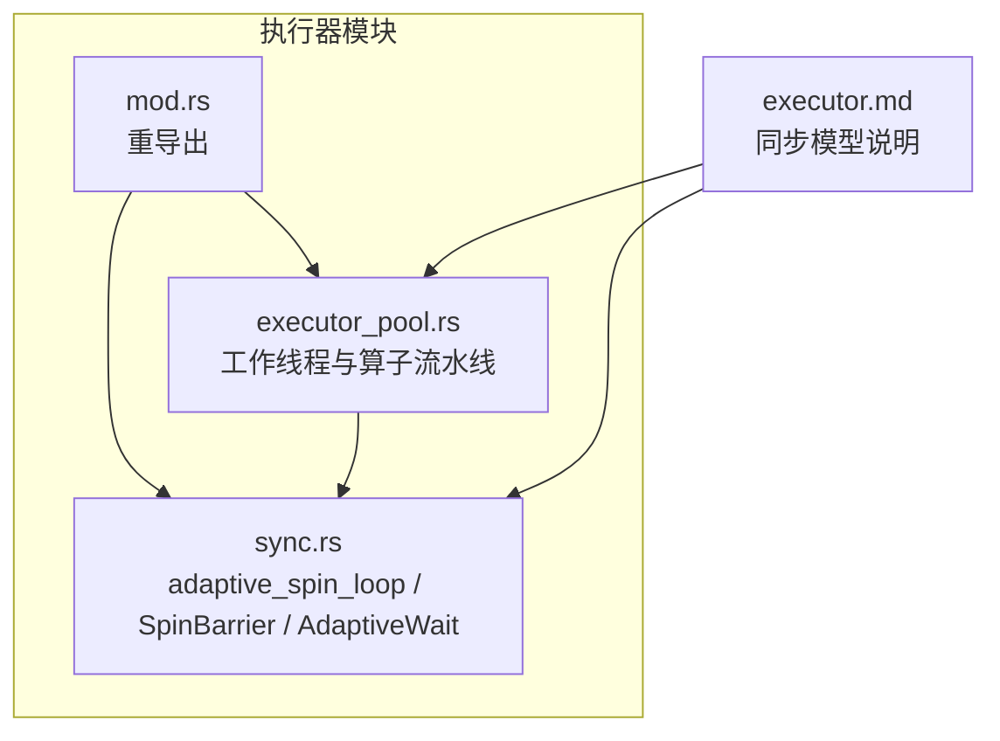
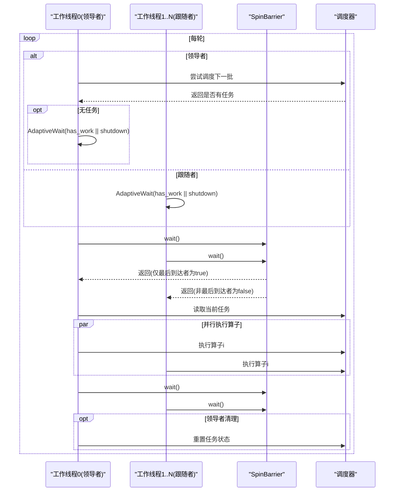
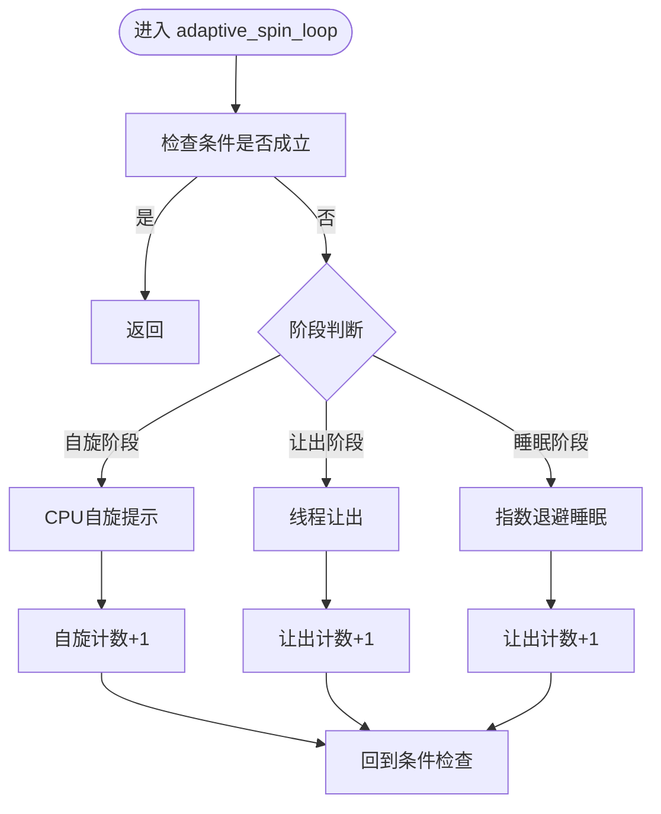
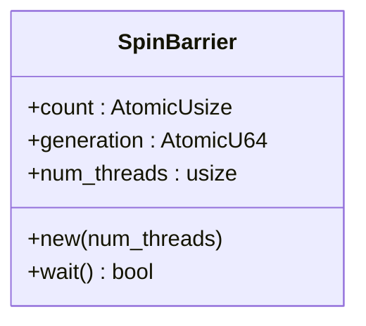
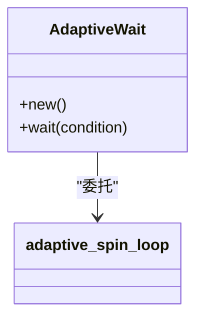
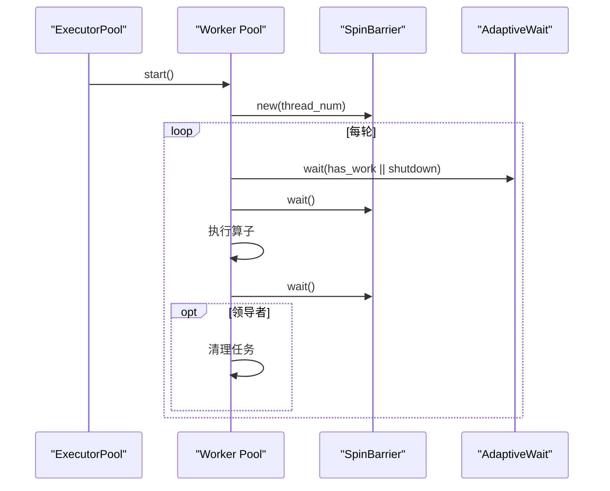
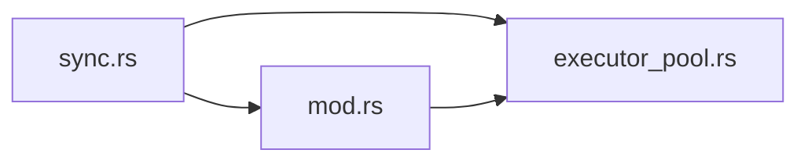

# 同步机制

<cite>
**本文引用的文件**
- [src/runtime/executor/sync.rs](file://src/runtime/executor/sync.rs)
- [src/runtime/executor/mod.rs](file://src/runtime/executor/mod.rs)
- [src/runtime/executor/executor_pool.rs](file://src/runtime/executor/executor_pool.rs)
- [docs/design/runtime/executor.md](file://docs/design/runtime/executor.md)
- [docs/configuration/optimization.md](file://docs/configuration/optimization.md)
</cite>

## 目录
1. [简介](#简介)
2. [项目结构](#项目结构)
3. [核心组件](#核心组件)
4. [架构总览](#架构总览)
5. [详细组件分析](#详细组件分析)
6. [依赖关系分析](#依赖关系分析)
7. [性能考量](#性能考量)
8. [故障排查指南](#故障排查指南)
9. [结论](#结论)
10. [附录](#附录)

## 简介
本文件聚焦于运行时执行层的同步机制，系统性阐述以下要点：
- 自适应自旋循环 adaptive_spin_loop 的实现原理与优化策略
- 自适应等待 AdaptiveWait 的设计与适用场景
- 自旋屏障 SpinBarrier 的工作原理与性能优势
- 不同同步原语的选择标准与性能权衡
- 同步机制的配置参数与调优指南
- 并发安全保证与死锁避免策略的实现细节

## 项目结构
同步相关代码集中在运行时的执行器模块中，并通过模块入口对外暴露。关键位置如下：
- 同步原语定义与实现：src/runtime/executor/sync.rs
- 模块重导出：src/runtime/executor/mod.rs
- 执行器池使用同步原语：src/runtime/executor/executor_pool.rs
- 设计文档对同步模型的解释：docs/design/runtime/executor.md

图表来源
- [src/runtime/executor/mod.rs:1-6](file://src/runtime/executor/mod.rs#L1-L6)
- [src/runtime/executor/sync.rs:1-83](file://src/runtime/executor/sync.rs#L1-L83)
- [src/runtime/executor/executor_pool.rs:46-148](file://src/runtime/executor/executor_pool.rs#L46-L148)
- [docs/design/runtime/executor.md:154-198](file://docs/design/runtime/executor.md#L154-L198)

章节来源
- [src/runtime/executor/mod.rs:1-6](file://src/runtime/executor/mod.rs#L1-L6)
- [src/runtime/executor/sync.rs:1-83](file://src/runtime/executor/sync.rs#L1-L83)
- [src/runtime/executor/executor_pool.rs:46-148](file://src/runtime/executor/executor_pool.rs#L46-L148)
- [docs/design/runtime/executor.md:154-198](file://docs/design/runtime/executor.md#L154-L198)

## 核心组件
- 自适应自旋循环 adaptive_spin_loop：提供“自旋→让出→指数退避睡眠”的三阶段等待策略，用于在条件未满足时高效轮询。
- 自旋屏障 SpinBarrier：基于代际（generation）计数器的无锁屏障，所有参与者到达后由最后一个进入者重置并推进代际，其余线程通过检测代际变化退出等待。
- 自适应等待 AdaptiveWait：封装了 adaptive_spin_loop 的可复用等待对象，便于在需要条件轮询的场景中统一行为。

章节来源
- [src/runtime/executor/sync.rs:7-31](file://src/runtime/executor/sync.rs#L7-L31)
- [src/runtime/executor/sync.rs:33-65](file://src/runtime/executor/sync.rs#L33-L65)
- [src/runtime/executor/sync.rs:67-83](file://src/runtime/executor/sync.rs#L67-L83)

## 架构总览
执行器采用“单领导者+多跟随者”的模型：
- 工作线程 0 负责调度下一批任务；其他工作线程等待“有工作”信号。
- 每个算子执行前后均通过 SpinBarrier 对齐，确保所有线程在同一算子边界上同步。
- 当没有可调度任务时，工作线程使用 AdaptiveWait 进行自适应等待，避免忙等导致 CPU 浪费。

图表来源
- [src/runtime/executor/executor_pool.rs:72-148](file://src/runtime/executor/executor_pool.rs#L72-L148)
- [src/runtime/executor/sync.rs:51-65](file://src/runtime/executor/sync.rs#L51-L65)
- [docs/design/runtime/executor.md:110-151](file://docs/design/runtime/executor.md#L110-L151)

## 详细组件分析

### 自适应自旋循环 adaptive_spin_loop
- 目标：在短临界区或快速变化的共享标志上，以最小开销等待条件成立。
- 策略：
  - 前 SPIN_LIMIT 次迭代调用 CPU 提示自旋指令，减少上下文切换成本。
  - 随后 YIELD_LIMIT 次迭代让出 CPU，降低竞争下的忙等压力。
  - 超过阈值后进入指数退避睡眠，sleep_us 随等待次数增长，上限受 min(6) 限制，避免过长休眠。
- 复杂度与性能：
  - 时间复杂度：O(k)，k 为直到条件成立的迭代次数。
  - 空间复杂度：O(1)。
  - 优点：低延迟、低开销；缺点：长时间忙等会消耗 CPU，因此引入让出与睡眠。
- 适用场景：
  - 短临界区、高命中率条件变量、热点路径上的轻量级等待。
  - 配合原子标志位与内存序，避免不必要的系统调用。

图表来源
- [src/runtime/executor/sync.rs:7-31](file://src/runtime/executor/sync.rs#L7-L31)

章节来源
- [src/runtime/executor/sync.rs:7-31](file://src/runtime/executor/sync.rs#L7-L31)

### 自旋屏障 SpinBarrier
- 数据结构：
  - count：参与到达的线程数计数器（原子）。
  - generation：代际号，每次完成一轮同步递增。
  - num_threads：预期参与的线程总数。
- 工作原理：
  - 每个线程进入 wait() 时加载当前代际 gen，并以 AcqRel 语义原子增加计数。
  - 若 prev == num_threads - 1，表示该线程是最后一个到达者：将计数归零，并释放地推进代际（Release），然后返回 true。
  - 否则，使用 adaptive_spin_loop 持续观察 generation 是否发生变化（Acquire 语义），一旦变化则退出等待，返回 false。
- 正确性与可见性：
  - 使用 Acquire/Release 内存序保证：最后到达者的写操作对其他线程可见，从而形成跨线程的 happens-before 关系。
  - 代际号递增避免了 ABA 问题，确保每轮同步独立。
- 性能优势：
  - 无锁、无系统调用（除自适应等待内部可能触发 sleep），适合高频同步点。
  - 在短临界区和高频同步下显著优于传统互斥量或条件变量。

图表来源
- [src/runtime/executor/sync.rs:33-65](file://src/runtime/executor/sync.rs#L33-L65)

章节来源
- [src/runtime/executor/sync.rs:33-65](file://src/runtime/executor/sync.rs#L33-L65)

### 自适应等待 AdaptiveWait
- 设计：
  - 包装 adaptive_spin_loop，提供可复用的等待对象。
  - 通过闭包传入条件函数，支持任意共享状态的轮询。
- 适用场景：
  - 等待外部事件（如调度器 has_work 标志）、资源就绪、或简单状态机转换。
  - 作为“轻量级条件变量”的替代方案，避免引入更复杂的内核态交互。

图表来源
- [src/runtime/executor/sync.rs:67-83](file://src/runtime/executor/sync.rs#L67-L83)
- [src/runtime/executor/sync.rs:7-31](file://src/runtime/executor/sync.rs#L7-L31)

章节来源
- [src/runtime/executor/sync.rs:67-83](file://src/runtime/executor/sync.rs#L67-L83)

### 执行器中的同步使用模式
- 启动阶段：
  - ExecutorPool::start 创建 SpinBarrier，并为每个工作线程生成任务。
- 工作循环：
  - 领导者线程负责调度；若无任务，使用 AdaptiveWait 等待 has_work 或 shutdown。
  - 跟随者线程同样使用 AdaptiveWait 等待 has_work 或 shutdown。
  - 进入执行阶段前，所有线程在 barrier.wait() 处对齐。
  - 每个算子执行前后再次 barrier.wait()，确保算子级同步。
  - 完成后，领导者线程清理任务状态。

图表来源
- [src/runtime/executor/executor_pool.rs:46-148](file://src/runtime/executor/executor_pool.rs#L46-L148)
- [src/runtime/executor/sync.rs:51-65](file://src/runtime/executor/sync.rs#L51-L65)

章节来源
- [src/runtime/executor/executor_pool.rs:46-148](file://src/runtime/executor/executor_pool.rs#L46-L148)
- [docs/design/runtime/executor.md:110-151](file://docs/design/runtime/executor.md#L110-L151)

## 依赖关系分析
- 模块内聚与耦合：
  - sync.rs 提供基础同步原语，被 executor_pool.rs 直接依赖。
  - mod.rs 仅做重导出，保持接口清晰。
- 外部依赖：
  - 使用 std::sync::atomic 的原子类型与内存序。
  - 使用 std::thread 的 yield_now 和 sleep。
- 潜在风险：
  - 自旋与睡眠阈值为硬编码常量，缺乏运行时可调性。
  - 长期空闲时，跟随者线程仍可能因忙等造成 CPU 占用（尽管已引入让出与睡眠）。

图表来源
- [src/runtime/executor/mod.rs:1-6](file://src/runtime/executor/mod.rs#L1-L6)
- [src/runtime/executor/sync.rs:1-83](file://src/runtime/executor/sync.rs#L1-L83)
- [src/runtime/executor/executor_pool.rs:1-10](file://src/runtime/executor/executor_pool.rs#L1-L10)

章节来源
- [src/runtime/executor/mod.rs:1-6](file://src/runtime/executor/mod.rs#L1-L6)
- [src/runtime/executor/sync.rs:1-83](file://src/runtime/executor/sync.rs#L1-L83)
- [src/runtime/executor/executor_pool.rs:1-10](file://src/runtime/executor/executor_pool.rs#L1-L10)

## 性能考量
- 自适应自旋循环：
  - 短临界区与高命中率条件下，自旋能显著降低延迟。
  - 长临界区或低命中率条件下，应增大让出与睡眠阈值，避免 CPU 浪费。
- 自旋屏障：
  - 高频同步点（每个算子前后）使用 SpinBarrier 可减少锁开销。
  - 需确保 num_threads 与实际工作线程数一致，否则会导致死等。
- 自适应等待：
  - 在空闲期能有效降低 CPU 占用；但在高负载下，频繁条件检查仍需注意条件函数的开销。
- 内存序选择：
  - Acquire/Release 足以保证屏障的可见性与顺序性；在复杂数据共享场景中应避免不必要的强序（如 SeqCst）以提升性能。

[本节为通用性能讨论，不直接分析具体文件]

## 故障排查指南
- 常见症状与定位：
  - 线程卡住或无法推进：检查 SpinBarrier 的 num_threads 是否与 spawn 的工作线程数一致。
  - 饥饿或高 CPU：检查 AdaptiveWait 的条件函数是否过于昂贵，或 SPIN_LIMIT/YIELD_LIMIT 是否合理。
  - 数据竞争或乱序：确认共享状态读写是否遵循 Acquire/Release 语义，并在屏障后进行必要的数据访问。
- 调试建议：
  - 在工作线程入口与关键同步点添加日志，记录 barrier 返回结果与代际号变化。
  - 使用轻量级指标统计 adaptive_spin_loop 各阶段的占比，评估是否需要调整阈值。
  - 针对空闲期，验证 has_work 标志的更新路径是否正确触发唤醒。

章节来源
- [src/runtime/executor/sync.rs:51-65](file://src/runtime/executor/sync.rs#L51-L65)
- [src/runtime/executor/executor_pool.rs:72-148](file://src/runtime/executor/executor_pool.rs#L72-L148)

## 结论
本项目在执行器层实现了高效的同步机制：
- adaptive_spin_loop 提供了从自旋到让出再到指数退避睡眠的平滑过渡，兼顾低延迟与资源友好。
- SpinBarrier 以代际计数器实现无锁屏障，适用于高频、短临界区的同步需求。
- AdaptiveWait 将自适应等待封装为可复用对象，简化了条件轮询的使用。
- 结合执行器的领导者-跟随者模型与算子级屏障，整体实现了高性能、低开销的多线程执行流水线。

[本节为总结性内容，不直接分析具体文件]

## 附录

### 配置参数与调优指南
- 环境变量与默认值：
  - ELLM_BATCH_SIZE：最大并发请求数（批槽数量）
  - ELLM_SEQUENCE_LENGTH：每槽最大序列长度
  - ELLM_CHUNK_SIZE：预填充轮次的最大 token 数，也用作 token_threshold
  - ELLM_SCHEDULE_TIMEOUT_MS：触发调度的超时窗口（毫秒）
- 调优策略：
  - 低延迟：减小 ELLM_CHUNK_SIZE，提升响应速度。
  - 高吞吐：增大 ELLM_CHUNK_SIZE 与 ELLM_BATCH_SIZE，提高批处理效率。
  - 长上下文：增大 ELLM_SEQUENCE_LENGTH，注意内存线性增长。
  - 流量波动：设置较小的 ELLM_SCHEDULE_TIMEOUT_MS，保障低负载下的调度延迟。
  - 计算密集：runner_count 自动设置为 CPU 核数减 2（异步线程）。

章节来源
- [docs/configuration/optimization.md:14-38](file://docs/configuration/optimization.md#L14-L38)

### 并发安全与死锁避免策略
- 原子与内存序：
  - 使用 AtomicBool/AtomicUsize/AtomicU64 与 Acquire/Release 语义保证可见性与顺序性。
  - 屏障的最后到达者在 Release 语义下推进代际，其他线程在 Acquire 语义下观察变化。
- 无锁设计与 ABA 防护：
  - 代际号递增避免 ABA 问题，确保每轮同步独立。
- 死锁避免：
  - 所有工作线程在相同屏障点同步，避免部分线程提前推进导致的错位。
  - 领导者线程仅在屏障后写入任务，并在完成后清理，防止重复调度。
- 安全边界：
  - unsafe 仅用于将共享批列表指针转换为可变引用，且受屏障保护与分区访问约束。

章节来源
- [src/runtime/executor/sync.rs:51-65](file://src/runtime/executor/sync.rs#L51-L65)
- [docs/design/runtime/executor.md:239-269](file://docs/design/runtime/executor.md#L239-L269)