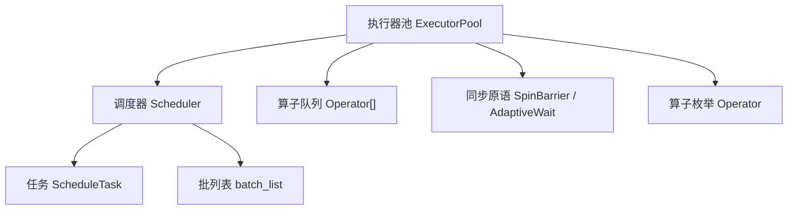
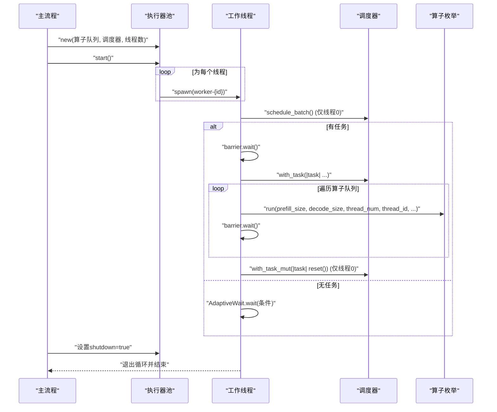
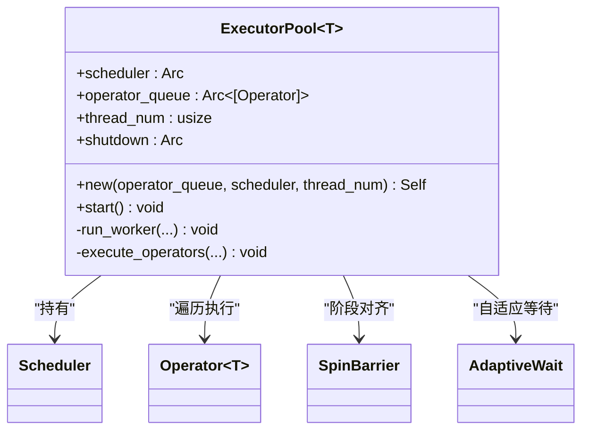
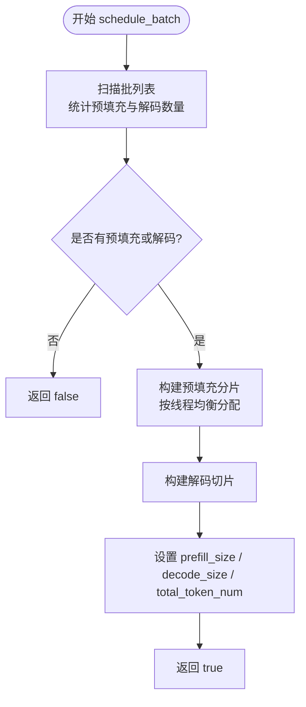
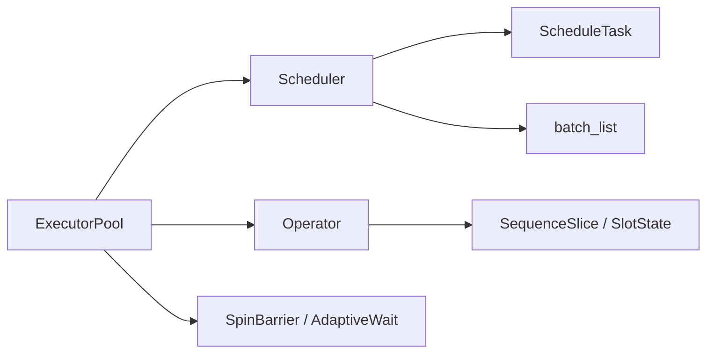

# 执行器池

<cite>
**本文引用的文件**   
- [executor_pool.rs](file://src/runtime/executor/executor_pool.rs)
- [sync.rs](file://src/runtime/executor/sync.rs)
- [mod.rs（执行器模块）](file://src/runtime/executor/mod.rs)
- [scheduler.rs](file://src/runtime/scheduler/scheduler.rs)
- [task.rs](file://src/runtime/scheduler/task.rs)
- [operator.rs](file://src/operators/operator.rs)
- [config.rs](file://src/runtime/config.rs)
- [mod.rs（运行时模块）](file://src/runtime/mod.rs)
</cite>

## 目录
1. [简介](#简介)
2. [项目结构](#项目结构)
3. [核心组件](#核心组件)
4. [架构总览](#架构总览)
5. [详细组件分析](#详细组件分析)
6. [依赖关系分析](#依赖关系分析)
7. [性能考虑](#性能考虑)
8. [故障排查指南](#故障排查指南)
9. [结论](#结论)
10. [附录](#附录)

## 简介
本文件围绕执行器池的设计与实现进行深入解析，涵盖线程池的创建、管理与销毁机制；任务分发算法与负载均衡策略；执行器的生命周期管理；以及错误处理、异常恢复和资源泄漏防护。文档同时提供性能调优配置选项与最佳实践建议，帮助读者在真实场景中高效部署和调优推理执行管线。

## 项目结构
执行器池位于运行时子系统内，与调度器、算子枚举、同步原语等紧密协作：
- 执行器池负责创建工作线程、协调调度批次、按算子序列驱动计算。
- 调度器负责从会话槽位状态中构建每批次的任务切片，并实现预填充分片与解码任务的均衡分配。
- 算子枚举统一封装各类算子的并行执行入口，供执行器池遍历调用。
- 同步原语提供自旋屏障与自适应等待，用于多工作线程间的阶段对齐与忙等优化。

图表来源
- [executor_pool.rs:10-149](file://src/runtime/executor/executor_pool.rs#L10-L149)
- [scheduler.rs:15-223](file://src/runtime/scheduler/scheduler.rs#L15-L223)
- [task.rs:1-49](file://src/runtime/scheduler/task.rs#L1-L49)
- [operator.rs:31-224](file://src/operators/operator.rs#L31-L224)
- [sync.rs:33-83](file://src/runtime/executor/sync.rs#L33-L83)

章节来源
- [executor_pool.rs:10-149](file://src/runtime/executor/executor_pool.rs#L10-L149)
- [scheduler.rs:15-223](file://src/runtime/scheduler/scheduler.rs#L15-L223)
- [task.rs:1-49](file://src/runtime/scheduler/task.rs#L1-L49)
- [operator.rs:31-224](file://src/operators/operator.rs#L31-L224)
- [sync.rs:33-83](file://src/runtime/executor/sync.rs#L33-L83)

## 核心组件
- 执行器池 ExecutorPool：维护共享调度器、算子队列、工作线程数与关闭标志；负责启动工作线程、协调调度与执行。
- 调度器 Scheduler：从批列表中读取活跃槽位，构建包含预填充与解码切片的任务，支持按线程均衡分片。
- 任务 ScheduleTask：承载每批次的元数据与切片集合，包括预填充分片与解码切片。
- 算子枚举 Operator<T>：统一封装多种算子类型，并提供 run 方法以接受调度上下文参数进行执行。
- 同步原语：SpinBarrier 用于多工作线程阶段对齐；AdaptiveWait 与自适应自旋循环用于低开销忙等。

章节来源
- [executor_pool.rs:10-149](file://src/runtime/executor/executor_pool.rs#L10-L149)
- [scheduler.rs:15-223](file://src/runtime/scheduler/scheduler.rs#L15-L223)
- [task.rs:1-49](file://src/runtime/scheduler/task.rs#L1-L49)
- [operator.rs:31-224](file://src/operators/operator.rs#L31-L224)
- [sync.rs:33-83](file://src/runtime/executor/sync.rs#L33-L83)

## 架构总览
执行器池采用“调度-执行”分离模式：
- 调度器集中负责将活跃请求转换为可执行的切片计划，并按线程维度对预填充任务进行分片。
- 执行器池中的每个工作线程在屏障处对齐，依次遍历算子队列，针对当前任务切片执行相应算子。
- 通过原子关闭标志与自适应等待，实现优雅退出与低延迟唤醒。

图表来源
- [executor_pool.rs:46-115](file://src/runtime/executor/executor_pool.rs#L46-L115)
- [scheduler.rs:66-82](file://src/runtime/scheduler/scheduler.rs#L66-L82)
- [operator.rs:79-198](file://src/operators/operator.rs#L79-L198)
- [sync.rs:7-31](file://src/runtime/executor/sync.rs#L7-L31)

## 详细组件分析

### 执行器池 ExecutorPool
- 构造与启动
  - new：保存调度器、算子队列、线程数（至少为1）、关闭标志。
  - start：基于线程数创建 SpinBarrier，并为每个线程 spawn 工作协程，传递共享资源。
- 工作线程主循环
  - 线程0负责尝试 schedule_batch；若无任务则进入自适应等待。
  - 所有线程在 barrier.wait 处对齐，随后获取任务并执行算子。
  - 每完成一个算子后再次 barrier.wait，确保所有线程在同一阶段点。
  - 线程0负责重置任务，避免脏数据影响下一轮。
- 关闭机制
  - 使用 AtomicBool 作为 shutdown 标志，工作线程在每次循环检查并安全退出。

图表来源
- [executor_pool.rs:10-149](file://src/runtime/executor/executor_pool.rs#L10-L149)
- [sync.rs:33-83](file://src/runtime/executor/sync.rs#L33-L83)

章节来源
- [executor_pool.rs:10-149](file://src/runtime/executor/executor_pool.rs#L10-L149)

### 调度器 Scheduler 与任务 ScheduleTask
- 任务构建
  - schedule_batch：扫描批列表，统计预填充与解码数量，构建任务。
  - build_prefill：根据 max_prefill_size 与 thread_num 计算配额，将预填充 token 均匀分配到各线程的分片列表 prefilling_chunked_slices。
  - build_decode：收集解码槽位，生成单 token 切片 slices。
- 任务数据结构
  - ScheduleTask：包含 prefill_size、decode_size、total_token_num、prefilling_chunked_slices、slices。
  - SequenceSlice：描述每个切片的起始索引、所属批次、序列位置、长度与是否最后一个 token。
- 负载均衡
  - 预填充分片采用“基础配额+余量分配”，保证线程间负载近似均衡。
  - 解码任务按顺序追加到 slices，便于后续算子按全局索引访问。

图表来源
- [scheduler.rs:66-131](file://src/runtime/scheduler/scheduler.rs#L66-L131)
- [scheduler.rs:133-222](file://src/runtime/scheduler/scheduler.rs#L133-L222)
- [task.rs:1-49](file://src/runtime/scheduler/task.rs#L1-L49)

章节来源
- [scheduler.rs:66-222](file://src/runtime/scheduler/scheduler.rs#L66-L222)
- [task.rs:1-49](file://src/runtime/scheduler/task.rs#L1-L49)

### 算子枚举 Operator<T>
- 统一执行接口
  - run：接收预填充大小、解码大小、线程总数与当前线程ID、预填充分片列表、解码切片列表、批列表等上下文，分派到具体算子实现。
- 扩展性
  - 新增算子只需在枚举中添加变体并在 run 中增加分支，即可被执行器池自动发现与执行。
- 线程安全
  - 通过 Send/Sync 标记，允许跨线程共享与并发访问（前提是内部缓冲区按线程分区或使用原子保护）。

章节来源
- [operator.rs:31-224](file://src/operators/operator.rs#L31-L224)

### 同步原语 SpinBarrier 与 AdaptiveWait
- SpinBarrier
  - 基于原子计数与代际号实现轻量级屏障，减少锁开销。
  - 最后一个到达的线程更新代际号并复位计数，其他线程自旋等待代际变化。
- AdaptiveWait
  - 结合 spin_loop、yield_now 与指数退避 sleep，适应不同负载场景下的等待策略。

章节来源
- [sync.rs:7-31](file://src/runtime/executor/sync.rs#L7-L31)
- [sync.rs:33-83](file://src/runtime/executor/sync.rs#L33-L83)

## 依赖关系分析
- 执行器池依赖调度器与算子枚举，并通过同步原语协调工作线程。
- 调度器依赖任务结构与批列表，负责将高层请求映射为底层算子可消费的切片。
- 算子枚举依赖运行时提供的切片与批列表信息，以便按线程与全局索引访问数据。

图表来源
- [executor_pool.rs:10-149](file://src/runtime/executor/executor_pool.rs#L10-L149)
- [scheduler.rs:15-223](file://src/runtime/scheduler/scheduler.rs#L15-L223)
- [operator.rs:31-224](file://src/operators/operator.rs#L31-L224)
- [task.rs:1-49](file://src/runtime/scheduler/task.rs#L1-L49)

章节来源
- [executor_pool.rs:10-149](file://src/runtime/executor/executor_pool.rs#L10-L149)
- [scheduler.rs:15-223](file://src/runtime/scheduler/scheduler.rs#L15-L223)
- [operator.rs:31-224](file://src/operators/operator.rs#L31-L224)
- [task.rs:1-49](file://src/runtime/scheduler/task.rs#L1-L49)

## 性能考虑
- 线程数选择
  - 可通过配置决定总线程数、API线程数与阻塞线程数，推荐依据物理核心数与负载特征调整。
- 预填充分片粒度
  - 合理设置 max_prefill_size 与 thread_num，使预填充任务在各线程间均衡，避免热点线程。
- 自适应等待
  - 在无任务时采用自适应等待，降低 CPU 空转；在高负载下优先自旋，缩短唤醒延迟。
- 屏障开销
  - 使用 SpinBarrier 替代传统互斥屏障，减少锁竞争；但需关注高核数下的自旋成本。
- 算子并行度
  - 算子内部应充分利用线程 ID 与分片列表进行并行化，避免不必要的同步。

章节来源
- [config.rs:62-104](file://src/runtime/config.rs#L62-L104)
- [executor_pool.rs:46-115](file://src/runtime/executor/executor_pool.rs#L46-L115)
- [sync.rs:7-31](file://src/runtime/executor/sync.rs#L7-L31)

## 故障排查指南
- 线程未退出
  - 检查 shutdown 标志是否正确设置，并确保工作线程在循环中检查该标志。
- 死锁或长时间等待
  - 确认 barrier.wait 的线程数与 spawn 的线程数一致；核对任务是否在每轮结束后被正确 reset。
- 任务未调度
  - 验证 schedule_batch 返回值与 has_work 状态；检查批列表是否为空或槽位状态不正确。
- 内存泄漏风险
  - 确保任务切片与临时缓冲在每轮结束后清理；避免持有过长的引用导致资源无法释放。
- 算子执行异常
  - 在算子 run 分支中捕获潜在错误并记录日志；必要时回滚批列表状态以避免不一致。

章节来源
- [executor_pool.rs:46-115](file://src/runtime/executor/executor_pool.rs#L46-L115)
- [scheduler.rs:66-82](file://src/runtime/scheduler/scheduler.rs#L66-L82)
- [task.rs:34-49](file://src/runtime/scheduler/task.rs#L34-L49)

## 结论
执行器池通过“调度-执行”分离与轻量级同步原语，实现了高效的并行推理执行管线。调度器负责将请求转化为均衡的任务切片，执行器池在多工作线程上按算子序列驱动计算，配合自适应等待与屏障对齐，兼顾吞吐与延迟。合理的线程配置与分片策略是获得高性能的关键。

## 附录
- 配置项参考
  - ThreadingConfig：包含 api_threads、blocking_threads、total_threads，用于控制线程划分。
  - determine_thread_config：根据可用并行度与物理核心数推导线程配置。

章节来源
- [config.rs:14-19](file://src/runtime/config.rs#L14-L19)
- [config.rs:62-104](file://src/runtime/config.rs#L62-L104)