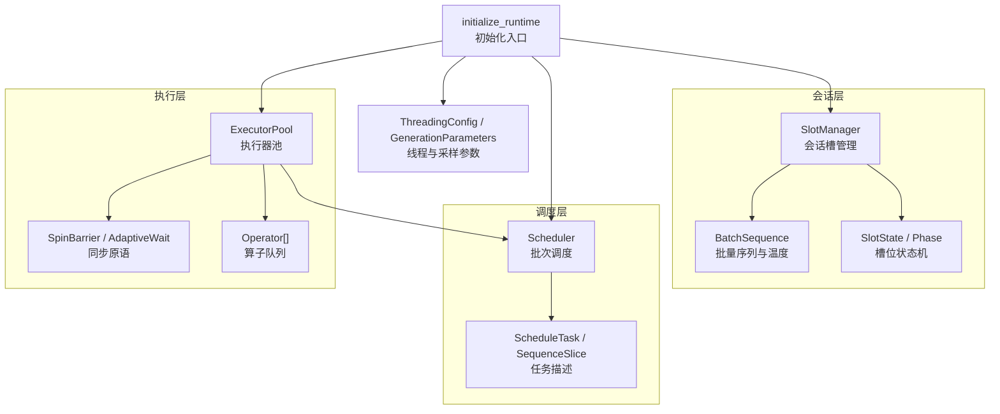
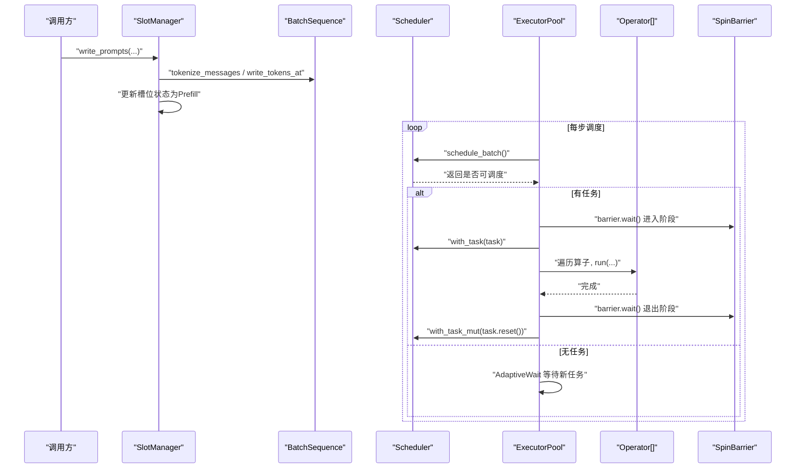
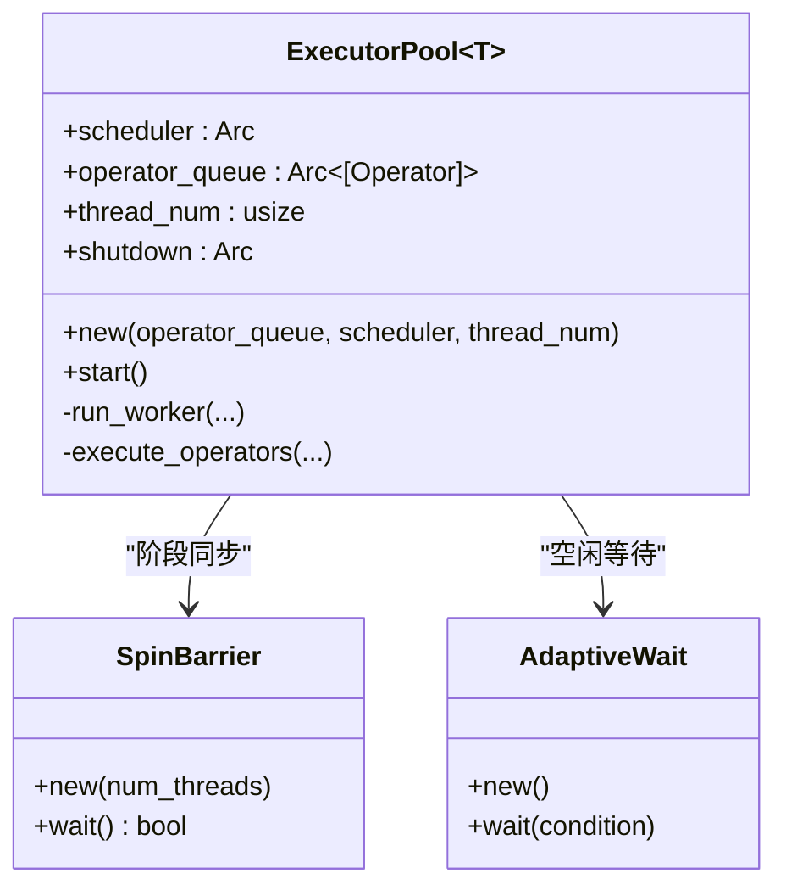
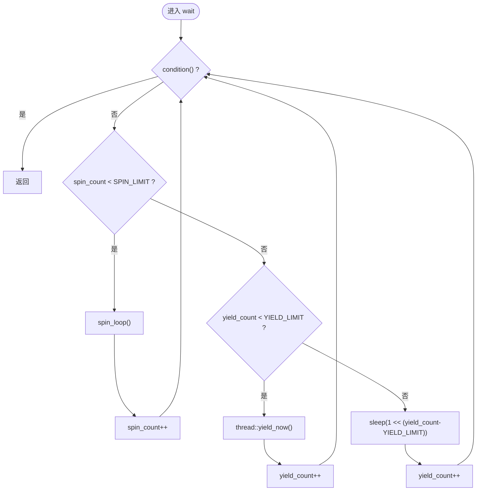
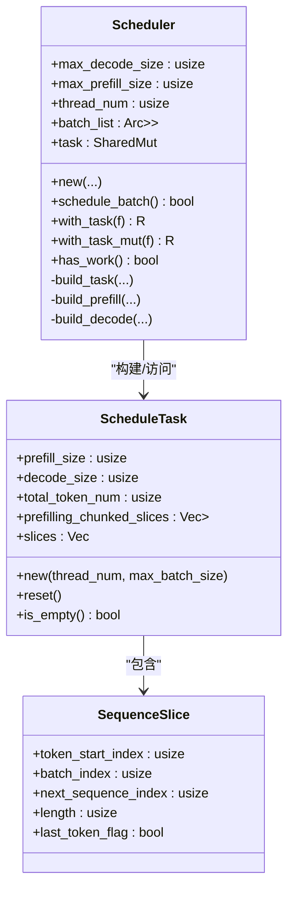
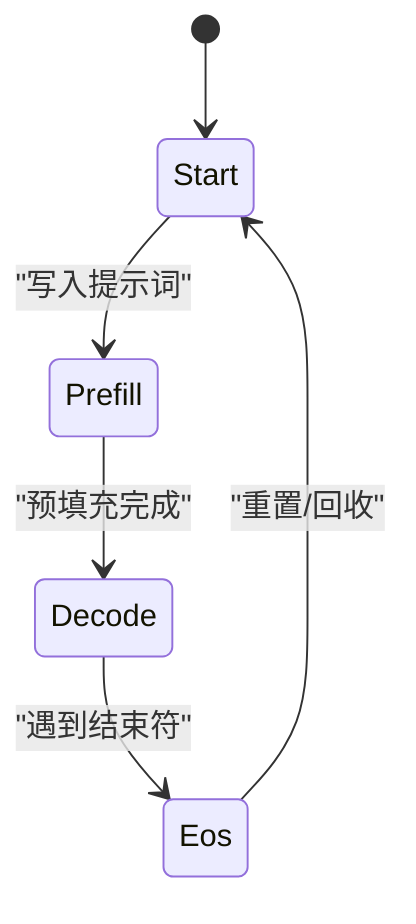
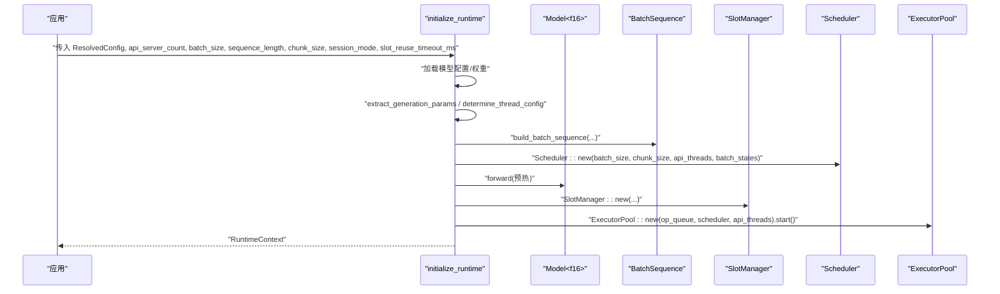
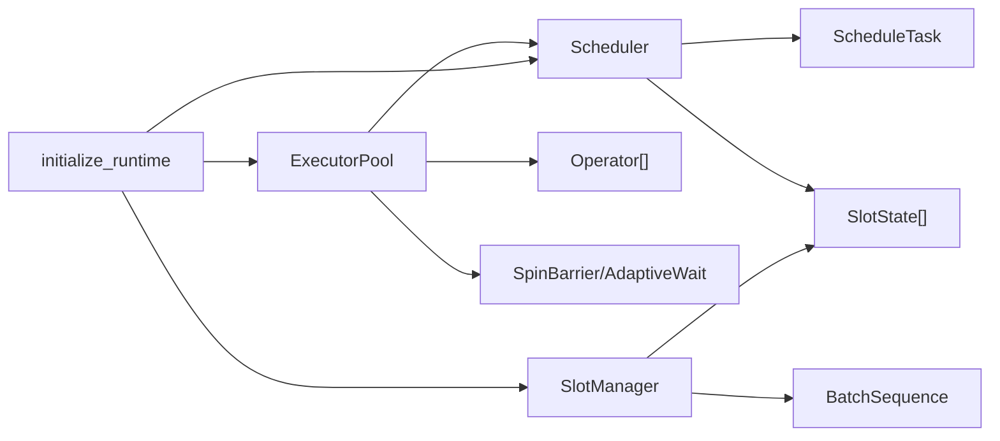

# 运行时架构

<cite>
**本文引用的文件**   
- [src/runtime/executor/executor_pool.rs](file://src/runtime/executor/executor_pool.rs)
- [src/runtime/executor/sync.rs](file://src/runtime/executor/sync.rs)
- [src/runtime/executor/mod.rs](file://src/runtime/executor/mod.rs)
- [src/runtime/scheduler/scheduler.rs](file://src/runtime/scheduler/scheduler.rs)
- [src/runtime/scheduler/task.rs](file://src/runtime/scheduler/task.rs)
- [src/runtime/session/manager.rs](file://src/runtime/session/manager.rs)
- [src/runtime/session/slot.rs](file://src/runtime/session/slot.rs)
- [src/runtime/session/sequence.rs](file://src/runtime/session/sequence.rs)
- [src/runtime/init.rs](file://src/runtime/init.rs)
- [src/runtime/config.rs](file://src/runtime/config.rs)
- [src/config/generation_config.rs](file://src/config/generation_config.rs)
</cite>

## 目录
1. [简介](#简介)
2. [项目结构](#项目结构)
3. [核心组件](#核心组件)
4. [架构总览](#架构总览)
5. [详细组件分析](#详细组件分析)
6. [依赖关系分析](#依赖关系分析)
7. [性能考量与调优](#性能考量与调优)
8. [故障排查指南](#故障排查指南)
9. [结论](#结论)

## 简介
本文件聚焦于eLLM运行时的执行器池设计与实现，系统阐述线程池管理、任务分发机制、同步原语的使用，以及执行器的生命周期管理（从创建到销毁）。同时说明异步执行模型与同步机制的结合方式，给出执行器配置选项与性能调优建议，并总结错误处理与异常恢复策略的实现细节。

## 项目结构
运行时模块围绕“会话状态 -> 调度器 -> 执行器池 -> 算子队列”的流水线组织：
- 会话层维护批内序列与槽位状态，负责写入提示词、推进解码进度。
- 调度器根据槽位状态生成每步的任务切片，将预填充与解码片段统一编排为连续的全局token布局。
- 执行器池启动固定数量的工作线程，循环拉取任务并驱动算子执行。
- 初始化流程完成模型权重加载、位置编码构建、线程配置计算与执行器池启动。

图表来源
- [src/runtime/init.rs:34-136](file://src/runtime/init.rs#L34-L136)
- [src/runtime/session/manager.rs:17-133](file://src/runtime/session/manager.rs#L17-L133)
- [src/runtime/session/slot.rs:7-64](file://src/runtime/session/slot.rs#L7-L64)
- [src/runtime/session/sequence.rs:10-152](file://src/runtime/session/sequence.rs#L10-L152)
- [src/runtime/scheduler/scheduler.rs:15-82](file://src/runtime/scheduler/scheduler.rs#L15-L82)
- [src/runtime/scheduler/task.rs:1-49](file://src/runtime/scheduler/task.rs#L1-L49)
- [src/runtime/executor/executor_pool.rs:10-149](file://src/runtime/executor/executor_pool.rs#L10-L149)
- [src/runtime/executor/sync.rs:33-83](file://src/runtime/executor/sync.rs#L33-L83)
- [src/runtime/config.rs:14-104](file://src/runtime/config.rs#L14-L104)

章节来源
- [src/runtime/init.rs:34-136](file://src/runtime/init.rs#L34-L136)
- [src/runtime/session/manager.rs:17-133](file://src/runtime/session/manager.rs#L17-L133)
- [src/runtime/session/slot.rs:7-64](file://src/runtime/session/slot.rs#L7-L64)
- [src/runtime/session/sequence.rs:10-152](file://src/runtime/session/sequence.rs#L10-L152)
- [src/runtime/scheduler/scheduler.rs:15-82](file://src/runtime/scheduler/scheduler.rs#L15-L82)
- [src/runtime/scheduler/task.rs:1-49](file://src/runtime/scheduler/task.rs#L1-L49)
- [src/runtime/executor/executor_pool.rs:10-149](file://src/runtime/executor/executor_pool.rs#L10-L149)
- [src/runtime/executor/sync.rs:33-83](file://src/runtime/executor/sync.rs#L33-L83)
- [src/runtime/config.rs:14-104](file://src/runtime/config.rs#L14-L104)

## 核心组件
- 执行器池 ExecutorPool：持有共享调度器与算子队列，按配置的线程数创建工作线程，循环等待调度结果并驱动算子执行。
- 同步原语 SpinBarrier 与 AdaptiveWait：自旋+yield+短睡眠自适应等待，用于多阶段屏障与无锁忙等。
- 调度器 Scheduler：扫描槽位状态，构造 ScheduleTask，包含预填充分片与解码切片，提供 with_task/with_task_mut 访问接口。
- 会话管理器 SlotManager：维护槽位分配、LRU回收、可重用模式下的保留与超时释放；封装提示词写入与解码文本读取。
- 批量序列 BatchSequence：集中存放token ID矩阵与温度向量，提供读写与解码辅助方法。
- 初始化 initialize_runtime：加载模型权重、构建位置编码、计算线程配置、创建调度器与会话管理器、启动执行器池。

章节来源
- [src/runtime/executor/executor_pool.rs:10-149](file://src/runtime/executor/executor_pool.rs#L10-L149)
- [src/runtime/executor/sync.rs:33-83](file://src/runtime/executor/sync.rs#L33-L83)
- [src/runtime/scheduler/scheduler.rs:15-82](file://src/runtime/scheduler/scheduler.rs#L15-L82)
- [src/runtime/session/manager.rs:17-133](file://src/runtime/session/manager.rs#L17-L133)
- [src/runtime/session/sequence.rs:10-152](file://src/runtime/session/sequence.rs#L10-L152)
- [src/runtime/init.rs:34-136](file://src/runtime/init.rs#L34-L136)

## 架构总览
下图展示一次推理步骤中，从会话写入到执行器执行的端到端数据流与控制流。

图表来源
- [src/runtime/session/manager.rs:137-182](file://src/runtime/session/manager.rs#L137-L182)
- [src/runtime/scheduler/scheduler.rs:66-82](file://src/runtime/scheduler/scheduler.rs#L66-L82)
- [src/runtime/executor/executor_pool.rs:72-149](file://src/runtime/executor/executor_pool.rs#L72-L149)
- [src/runtime/executor/sync.rs:33-83](file://src/runtime/executor/sync.rs#L33-L83)

## 详细组件分析

### 执行器池 ExecutorPool
- 设计要点
  - 线程池大小由 ThreadingConfig.api_threads 决定，最小为1。
  - 每个工作线程独立循环：优先由线程0尝试 schedule_batch，若无任务则使用 AdaptiveWait 等待；否则所有线程在 SpinBarrier 处对齐，随后通过 scheduler.with_task 获取当前任务并执行算子队列。
  - 每轮算子执行后再次 barrier 同步，确保所有线程在同一任务边界上推进。
  - 线程0负责重置任务状态，避免并发修改。
- 关键数据结构
  - operator_queue: 全局算子列表，按顺序执行。
  - scheduler: 共享调度器，提供任务构建与访问。
  - shutdown: 原子标志，控制优雅退出。
- 复杂度与行为
  - 每步调度 O(槽位数)，任务构建时预填充分片按线程均摊，保证负载均衡。
  - 算子执行阶段采用屏障同步，避免跨阶段竞争。

图表来源
- [src/runtime/executor/executor_pool.rs:10-149](file://src/runtime/executor/executor_pool.rs#L10-L149)
- [src/runtime/executor/sync.rs:33-83](file://src/runtime/executor/sync.rs#L33-L83)

章节来源
- [src/runtime/executor/executor_pool.rs:10-149](file://src/runtime/executor/executor_pool.rs#L10-L149)

### 同步原语 SpinBarrier 与 AdaptiveWait
- SpinBarrier
  - 基于 AtomicUsize 计数与 AtomicU64 代数的轻量级屏障。
  - 最后一个到达的线程复位计数并递增代数，其余线程自旋等待代数变化。
- AdaptiveWait
  - 内部使用 adaptive_spin_loop，先自旋，再yield，最后指数退避微秒级sleep，兼顾低延迟与CPU占用。

图表来源
- [src/runtime/executor/sync.rs:7-31](file://src/runtime/executor/sync.rs#L7-L31)

章节来源
- [src/runtime/executor/sync.rs:7-83](file://src/runtime/executor/sync.rs#L7-L83)

### 调度器 Scheduler 与任务 ScheduleTask
- 调度策略
  - 扫描槽位状态，统计可调度 Decode 数量与待预填充 Token 总量。
  - 若存在预填充，按 max_prefill_size 限制并按线程数均摊到 prefilling_chunked_slices，保证各线程负载均衡。
  - 将预填充与解码切片合并为统一的 slices，保持 token_start_index 严格递增，便于后续算子按全局索引查找。
- 任务结构
  - ScheduleTask 包含 prefill_size、decode_size、total_token_num、prefilling_chunked_slices、slices。
  - reset 清空所有字段与切片，is_empty 判断是否有待处理任务。
- 线程安全
  - 通过 SharedMut 包装任务与批列表，提供 with_task/with_task_mut 访问，避免外部直接竞争。

图表来源
- [src/runtime/scheduler/scheduler.rs:15-223](file://src/runtime/scheduler/scheduler.rs#L15-L223)
- [src/runtime/scheduler/task.rs:1-49](file://src/runtime/scheduler/task.rs#L1-L49)

章节来源
- [src/runtime/scheduler/scheduler.rs:15-223](file://src/runtime/scheduler/scheduler.rs#L15-L223)
- [src/runtime/scheduler/task.rs:1-49](file://src/runtime/scheduler/task.rs#L1-L49)

### 会话管理 SlotManager 与状态机
- 槽位状态机
  - Phase: Start -> Prefill -> Decode -> Eos。
  - SlotState 记录 next_sequence_index、prompt_length、phase、sequence_length 及 Notify。
- 会话生命周期
  - acquire_session：复用已分配槽位或从 LRU 尾部淘汰旧会话，必要时取消预留。
  - release_session：非可重用模式立即重置并回LRU；可重用模式放入 reserved_slots，超时后自动清理。
- 提示词写入
  - tokenize_messages 应用聊天模板并编码，prefix_match_len 支持可重用模式的前缀匹配加速。
  - write_tokens_at 将剩余tokens写入对应槽位，并设置 phase=Prefill。
- 解码辅助
  - decode_single_token、decode_token_span、decode_generated_text 提供便捷解码接口。

图表来源
- [src/runtime/session/slot.rs:7-64](file://src/runtime/session/slot.rs#L7-L64)
- [src/runtime/session/manager.rs:48-133](file://src/runtime/session/manager.rs#L48-L133)

章节来源
- [src/runtime/session/slot.rs:7-64](file://src/runtime/session/slot.rs#L7-L64)
- [src/runtime/session/manager.rs:48-133](file://src/runtime/session/manager.rs#L48-L133)

### 初始化流程 initialize_runtime
- 加载模型配置与权重，构建 RotaryEmbedding 位置编码。
- 提取采样参数与线程配置，创建 BatchSequence、SlotManager、Scheduler。
- 构建 Operator 队列并启动 ExecutorPool。
- 返回 RuntimeContext，暴露 batch_sequences、scheduler、slot_manager、thread_config 等供上层使用。

图表来源
- [src/runtime/init.rs:34-136](file://src/runtime/init.rs#L34-L136)
- [src/runtime/config.rs:62-104](file://src/runtime/config.rs#L62-L104)
- [src/runtime/session/sequence.rs:157-182](file://src/runtime/session/sequence.rs#L157-L182)

章节来源
- [src/runtime/init.rs:34-136](file://src/runtime/init.rs#L34-L136)
- [src/runtime/config.rs:62-104](file://src/runtime/config.rs#L62-L104)
- [src/runtime/session/sequence.rs:157-182](file://src/runtime/session/sequence.rs#L157-L182)

## 依赖关系分析
- 组件耦合
  - ExecutorPool 强依赖 Scheduler 与 Operator 队列，并通过 SpinBarrier/AdaptiveWait 进行同步。
  - Scheduler 依赖 Session 的槽位状态与任务结构，不直接访问算子。
  - SlotManager 依赖 BatchSequence 与槽位状态，对上层提供会话语义。
- 外部依赖
  - tokio::sync::Notify 用于会话通知。
  - tiktoken_rs 用于分词与解码。
  - core_affinity 用于物理核亲和性估算。
- 潜在环路与风险
  - 通过 Arc 与 SharedMut 解耦，避免直接循环引用。
  - 注意 unsafe 块仅用于高性能内存访问，需配合严格的不变式约束。

图表来源
- [src/runtime/executor/executor_pool.rs:10-149](file://src/runtime/executor/executor_pool.rs#L10-L149)
- [src/runtime/scheduler/scheduler.rs:15-82](file://src/runtime/scheduler/scheduler.rs#L15-L82)
- [src/runtime/session/manager.rs:17-133](file://src/runtime/session/manager.rs#L17-L133)
- [src/runtime/init.rs:34-136](file://src/runtime/init.rs#L34-L136)

章节来源
- [src/runtime/executor/executor_pool.rs:10-149](file://src/runtime/executor/executor_pool.rs#L10-L149)
- [src/runtime/scheduler/scheduler.rs:15-82](file://src/runtime/scheduler/scheduler.rs#L15-L82)
- [src/runtime/session/manager.rs:17-133](file://src/runtime/session/manager.rs#L17-L133)
- [src/runtime/init.rs:34-136](file://src/runtime/init.rs#L34-L136)

## 性能考量与调优
- 线程配置
  - 通过 determine_thread_config 结合可用并行度与API服务器数量，合理划分阻塞线程与API线程，避免上下文切换开销过大。
  - 参考路径：[src/runtime/config.rs:62-104](file://src/runtime/config.rs#L62-L104)
- 预填充分片
  - 按线程数均摊预填充Token，减少长尾效应，提升吞吐。
  - 参考路径：[src/runtime/scheduler/scheduler.rs:133-202](file://src/runtime/scheduler/scheduler.rs#L133-L202)
- 同步策略
  - 使用 SpinBarrier 替代重型互斥，降低阶段同步开销；AdaptiveWait 在空闲期自适应退避，平衡延迟与CPU占用。
  - 参考路径：[src/runtime/executor/sync.rs:7-83](file://src/runtime/executor/sync.rs#L7-L83)
- 采样参数
  - top_k/top_p/do_sample/eos_token_id_list 影响生成质量与终止条件，可通过 GenerationConfig 调整。
  - 参考路径：[src/config/generation_config.rs:6-79](file://src/config/generation_config.rs#L6-L79), [src/runtime/config.rs:21-60](file://src/runtime/config.rs#L21-L60)
- 内存与缓存
  - BatchSequence 使用对齐内存块存储token矩阵，减少分配抖动；可重用模式下前缀匹配减少重复编码。
  - 参考路径：[src/runtime/session/sequence.rs:10-152](file://src/runtime/session/sequence.rs#L10-L152), [src/runtime/session/manager.rs:256-282](file://src/runtime/session/manager.rs#L256-L282)

[本节为通用指导，无需特定文件分析]

## 故障排查指南
- 常见症状与定位
  - 无任务推进：检查 has_work 与 schedule_batch 返回值，确认槽位状态是否为 Decode/Prefill。
    - 参考路径：[src/runtime/scheduler/scheduler.rs:66-82](file://src/runtime/scheduler/scheduler.rs#L66-L82)
  - 线程饥饿或高CPU占用：观察 AdaptiveWait 的自旋/退避策略，适当调整 API 线程数或任务粒度。
    - 参考路径：[src/runtime/executor/sync.rs:7-31](file://src/runtime/executor/sync.rs#L7-L31)
  - 会话无法重用：检查 reuse_timeout 与 reserved_slots 清理逻辑，确认 cancel_flag 与超时任务。
    - 参考路径：[src/runtime/session/manager.rs:84-133](file://src/runtime/session/manager.rs#L84-L133)
- 错误类型与恢复
  - 分词失败：tokenize_messages/write_tokens_at 可能返回错误，应向上抛出并中止当前请求。
    - 参考路径：[src/runtime/session/manager.rs:137-182](file://src/runtime/session/manager.rs#L137-L182)
  - 槽位不可用：ensure_slot_available 在非 Start/Eos 阶段拒绝写入，需等待或重试。
    - 参考路径：[src/runtime/session/manager.rs:229-239](file://src/runtime/session/manager.rs#L229-L239)
  - 资源不足：当 batch_size 或 sequence_length 超出容量，会触发越界保护或返回空结果，需扩容或截断输入。
    - 参考路径：[src/runtime/session/sequence.rs:106-119](file://src/runtime/session/sequence.rs#L106-L119)

章节来源
- [src/runtime/scheduler/scheduler.rs:66-82](file://src/runtime/scheduler/scheduler.rs#L66-L82)
- [src/runtime/executor/sync.rs:7-31](file://src/runtime/executor/sync.rs#L7-L31)
- [src/runtime/session/manager.rs:84-133](file://src/runtime/session/manager.rs#L84-L133)
- [src/runtime/session/manager.rs:137-182](file://src/runtime/session/manager.rs#L137-L182)
- [src/runtime/session/manager.rs:229-239](file://src/runtime/session/manager.rs#L229-L239)
- [src/runtime/session/sequence.rs:106-119](file://src/runtime/session/sequence.rs#L106-L119)

## 结论
该运行时以“会话-调度-执行”三层架构为核心，借助轻量同步原语与细粒度任务切片，实现了高效的预填充与解码混合执行。执行器池通过屏障同步与自适应等待，在保证正确性的同时最大化吞吐。合理的线程配置、预填充分片策略与前缀匹配优化共同构成性能调优的关键点。错误处理覆盖分词、槽位可用性、资源容量等关键环节，具备较好的健壮性与可观测性。