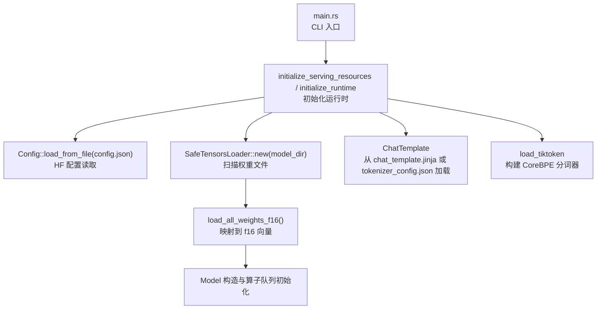
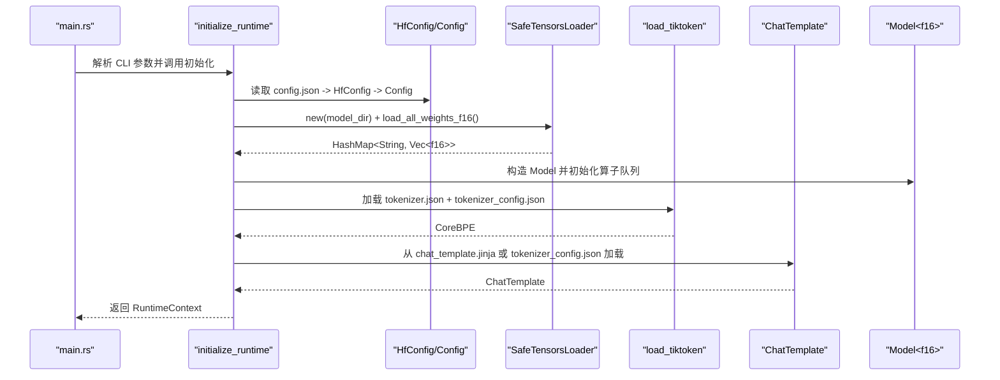
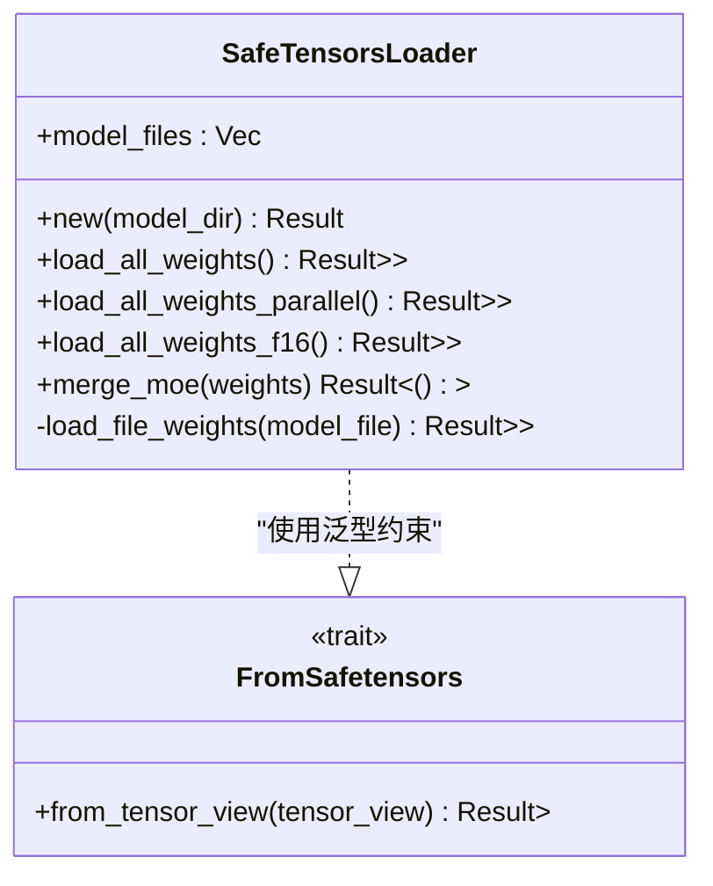
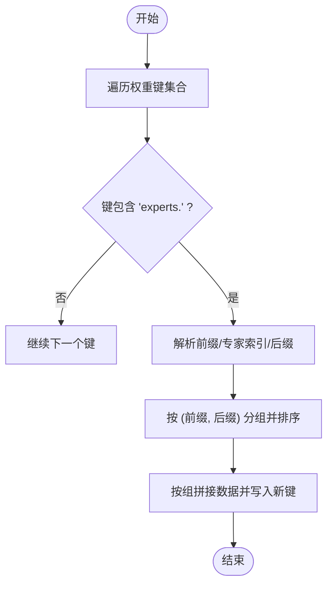
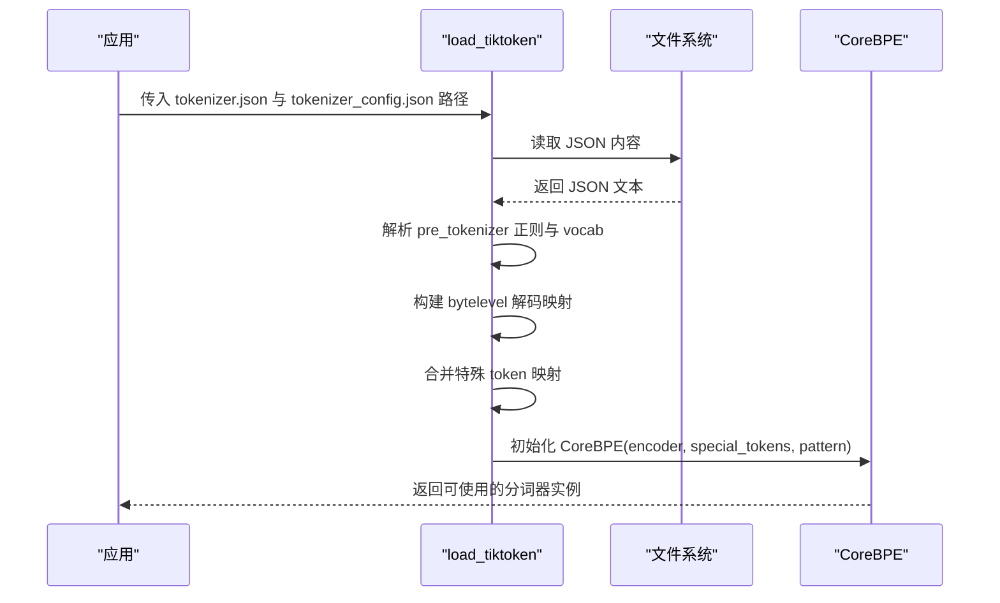
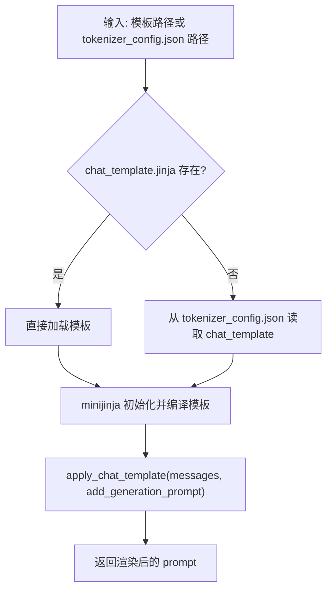
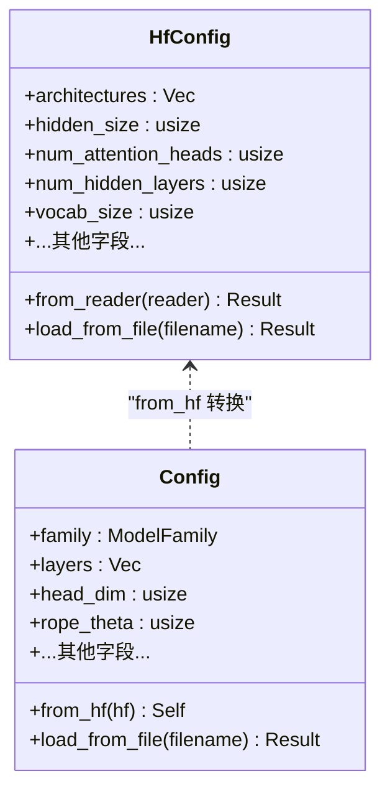
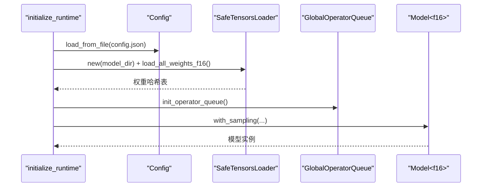
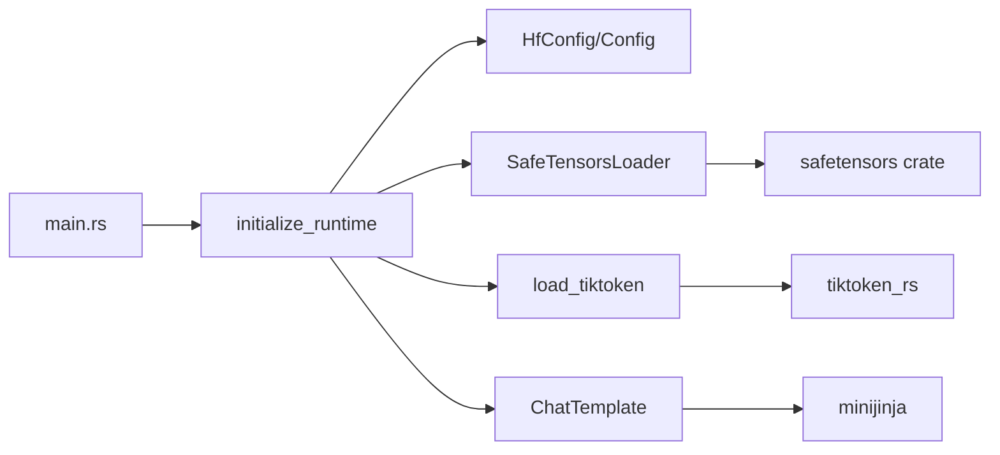

# 模型加载

<cite>
**本文引用的文件**   
- [src/runtime/loader/mod.rs](file://src/runtime/loader/mod.rs)
- [src/runtime/loader/safetensors.rs](file://src/runtime/loader/safetensors.rs)
- [src/runtime/loader/tokenizer.rs](file://src/runtime/loader/tokenizer.rs)
- [src/runtime/loader/chat_template.rs](file://src/runtime/loader/chat_template.rs)
- [src/config/huggingface_config.rs](file://src/config/huggingface_config.rs)
- [src/transformer/config/config.rs](file://src/transformer/config/config.rs)
- [src/runtim/init.rs](file://src/runtim/init.rs)
- [src/bin/main.rs](file://src/bin/main.rs)
- [src/config/config_types.rs](file://src/config/config_types.rs)
</cite>

## 目录
1. [简介](#简介)
2. [项目结构](#项目结构)
3. [核心组件](#核心组件)
4. [架构总览](#架构总览)
5. [详细组件分析](#详细组件分析)
6. [依赖关系分析](#依赖关系分析)
7. [性能与内存优化](#性能与内存优化)
8. [故障排查指南](#故障排查指南)
9. [结论](#结论)
10. [附录](#附录)

## 简介
本技术文档聚焦于模型加载系统，覆盖以下关键主题：
- SafeTensors 格式的解析与权重加载流程
- 分词器（Tokenizer）集成与文本预处理
- 聊天模板的加载与应用机制
- HuggingFace 配置文件的兼容性与转换过程
- 增量加载与权重共享的实现策略
- 模型文件组织与目录结构最佳实践
- 模型加载性能优化与内存使用控制
- 模型版本管理与向后兼容性处理
- 自定义模型格式支持指南

## 项目结构
模型加载相关代码主要分布在 runtime/loader、config 与 transformer/config 等模块中。整体入口由命令行程序启动，随后初始化运行时上下文并加载模型权重、配置与分词器。

图表来源
- [src/bin/main.rs:1-41](file://src/bin/main.rs#L1-L41)
- [src/runtim/init.rs:1-136](file://src/runtim/init.rs#L1-L136)
- [src/runtime/loader/mod.rs:1-8](file://src/runtime/loader/mod.rs#L1-L8)
- [src/runtime/loader/safetensors.rs:130-171](file://src/runtime/loader/safetensors.rs#L130-L171)
- [src/runtime/loader/chat_template.rs:21-44](file://src/runtime/loader/chat_template.rs#L21-L44)
- [src/runtime/loader/tokenizer.rs:100-146](file://src/runtime/loader/tokenizer.rs#L100-L146)
- [src/config/huggingface_config.rs:82-91](file://src/config/huggingface_config.rs#L82-L91)
- [src/transformer/config/config.rs:113-116](file://src/transformer/config/config.rs#L113-L116)

章节来源
- [src/bin/main.rs:1-41](file://src/bin/main.rs#L1-L41)
- [src/runtim/init.rs:1-136](file://src/runtim/init.rs#L1-L136)
- [src/runtime/loader/mod.rs:1-8](file://src/runtime/loader/mod.rs#L1-L8)

## 核心组件
- SafeTensors 权重加载器
  - 负责发现模型目录中的 safetensors 文件，使用内存映射反序列化，按类型转换为 Vec<T>，并提供并行加载与 MoE 专家权重合并能力。
- 分词器加载器
  - 基于 tiktoken_rs 构建 CoreBPE，解析 tokenizer.json 与 tokenizer_config.json，处理字节级解码与特殊 token 注册。
- 聊天模板引擎
  - 基于 minijinja 渲染 Jinja 模板，支持从独立模板文件或 tokenizer_config.json 的 chat_template 字段加载。
- HuggingFace 配置适配层
  - 将 HF config.json 读入轻量结构体，再转换为内部 Config，完成默认值推导与层计划生成。

章节来源
- [src/runtime/loader/safetensors.rs:130-312](file://src/runtime/loader/safetensors.rs#L130-L312)
- [src/runtime/loader/tokenizer.rs:100-242](file://src/runtime/loader/tokenizer.rs#L100-L242)
- [src/runtime/loader/chat_template.rs:21-95](file://src/runtime/loader/chat_template.rs#L21-L95)
- [src/config/huggingface_config.rs:10-91](file://src/config/huggingface_config.rs#L10-L91)
- [src/transformer/config/config.rs:39-116](file://src/transformer/config/config.rs#L39-L116)

## 架构总览
下图展示了从 CLI 到模型运行时的完整加载链路，包括配置、权重、分词器与聊天模板的协同工作。

图表来源
- [src/bin/main.rs:26-41](file://src/bin/main.rs#L26-L41)
- [src/runtim/init.rs:34-136](file://src/runtim/init.rs#L34-L136)
- [src/config/huggingface_config.rs:82-91](file://src/config/huggingface_config.rs#L82-L91)
- [src/transformer/config/config.rs:113-116](file://src/transformer/config/config.rs#L113-L116)
- [src/runtime/loader/safetensors.rs:130-195](file://src/runtime/loader/safetensors.rs#L130-L195)
- [src/runtime/loader/tokenizer.rs:100-146](file://src/runtime/loader/tokenizer.rs#L100-L146)
- [src/runtime/loader/chat_template.rs:21-44](file://src/runtime/loader/chat_template.rs#L21-L44)

## 详细组件分析

### SafeTensors 权重加载器
- 文件发现与排序
  - 优先匹配单文件命名模式；否则扫描目录下所有 .safetensors 并按路径排序，保证确定性加载顺序。
- 内存映射与反序列化
  - 使用内存映射打开文件，避免整文件拷贝；通过 safetensors crate 反序列化为张量视图。
- 数据类型转换
  - 提供 FromSafetensors trait，实现 f16/f32/f64 的转换，支持 F16/F32/BF16 源数据，小端序高效复制。
- 并行加载
  - 根据环境变量 ELLM_LOAD_THREADS 或 CPU 并发数自动选择线程数，分块并行加载各文件，最后合并结果。
- MoE 专家权重合并
  - 对形如 mlp.experts.{idx}.xxx 的键进行分组与拼接，输出为扁平 experts 权重，便于后续按索引切片访问。

图表来源
- [src/runtime/loader/safetensors.rs:9-128](file://src/runtime/loader/safetensors.rs#L9-L128)
- [src/runtime/loader/safetensors.rs:130-312](file://src/runtime/loader/safetensors.rs#L130-L312)

章节来源
- [src/runtime/loader/safetensors.rs:130-312](file://src/runtime/loader/safetensors.rs#L130-L312)

#### 算法流程（MoE 权重合并）

图表来源
- [src/runtime/loader/safetensors.rs:250-311](file://src/runtime/loader/safetensors.rs#L250-L311)

### 分词器集成与文本预处理
- 配置文件解析
  - 读取 tokenizer.json 与 tokenizer_config.json，提取预分词正则、词汇表与特殊 token 定义。
- 字节级解码器
  - 构建 byte-level 解码映射，将字符串 token 还原为字节序列，以兼容 BPE 编码。
- 特殊 token 注册
  - 合并 added_tokens、added_tokens_decoder、additional_special_tokens、eos_token、pad_token 等来源，确保特殊 token 在编码器中可用。
- CoreBPE 初始化
  - 使用 tiktoken_rs 创建 CoreBPE，支持 encode_with_special_tokens、split_by_token、decode 等接口。

图表来源
- [src/runtime/loader/tokenizer.rs:100-242](file://src/runtime/loader/tokenizer.rs#L100-L242)

章节来源
- [src/runtime/loader/tokenizer.rs:100-242](file://src/runtime/loader/tokenizer.rs#L100-L242)

### 聊天模板加载与应用
- 加载优先级
  - 若存在 chat_template.jinja，则直接加载；否则回退到 tokenizer_config.json 中的 chat_template 字段。
- 模板环境
  - 使用 minijinja 创建 Environment，注入 startswith/endswith 方法回调，支持条件判断。
- 渲染接口
  - apply_chat_template 接收消息列表与是否追加生成提示，渲染为最终 prompt 字符串。

图表来源
- [src/runtime/loader/chat_template.rs:21-95](file://src/runtime/loader/chat_template.rs#L21-L95)

章节来源
- [src/runtime/loader/chat_template.rs:21-95](file://src/runtime/loader/chat_template.rs#L21-L95)

### HuggingFace 配置文件兼容性与转换
- 原始配置结构
  - HfConfig 仅保留标量与简单容器类型，便于安全反序列化。
- 默认值与推导
  - head_dim、num_key_value_heads、intermediate_size、max_window_layers、rope_theta、rotary_dim 等字段具备合理默认值与推导逻辑。
- 层计划构建
  - 依据 family、FFN 参数、路由评分函数、滑动窗口等配置，生成 LayerPlan 栈，驱动具体层实现。

图表来源
- [src/config/huggingface_config.rs:10-91](file://src/config/huggingface_config.rs#L10-L91)
- [src/transformer/config/config.rs:39-116](file://src/transformer/config/config.rs#L39-L116)

章节来源
- [src/config/huggingface_config.rs:10-91](file://src/config/huggingface_config.rs#L10-L91)
- [src/transformer/config/config.rs:39-116](file://src/transformer/config/config.rs#L39-L116)

### 运行时初始化与模型构造
- 初始化流程
  - 读取 config.json 与 generation_config.json（可选），构建 SafeTensorsLoader 并加载权重，初始化全局算子队列与位置编码，构造 Model。
- 线程与调度
  - 根据 API 服务器数量与生成参数确定线程配置，启动执行器池与调度器。

图表来源
- [src/runtim/init.rs:34-136](file://src/runtim/init.rs#L34-L136)
- [src/runtime/loader/safetensors.rs:130-195](file://src/runtime/loader/safetensors.rs#L130-L195)

章节来源
- [src/runtim/init.rs:34-136](file://src/runtim/init.rs#L34-L136)

## 依赖关系分析
- 模块耦合
  - main.rs 依赖配置解析与运行时初始化；initialize_runtime 依赖 SafeTensorsLoader、Config、Model 等核心组件。
  - SafeTensorsLoader 与 FromSafetensors trait 解耦了数据类型转换，便于扩展新的目标类型。
- 外部依赖
  - safetensors crate 用于权重文件反序列化；tiktoken_rs 用于分词器；minijinja 用于模板渲染。
- 潜在循环依赖
  - 当前结构未见明显循环导入；loader 与 config 相互独立，通过运行时初始化串联。

图表来源
- [src/bin/main.rs:26-41](file://src/bin/main.rs#L26-L41)
- [src/runtim/init.rs:34-136](file://src/runtim/init.rs#L34-L136)
- [src/runtime/loader/safetensors.rs:130-195](file://src/runtime/loader/safetensors.rs#L130-L195)
- [src/runtime/loader/tokenizer.rs:100-146](file://src/runtime/loader/tokenizer.rs#L100-L146)
- [src/runtime/loader/chat_template.rs:21-44](file://src/runtime/loader/chat_template.rs#L21-L44)

章节来源
- [src/bin/main.rs:26-41](file://src/bin/main.rs#L26-L41)
- [src/runtim/init.rs:34-136](file://src/runtim/init.rs#L34-L136)

## 性能与内存优化
- 内存映射加载
  - 使用 memmap2 对 safetensors 文件进行内存映射，减少 I/O 与内存拷贝开销。
- 并行加载
  - 通过 ELLM_LOAD_THREADS 控制并行度，结合 thread::scope 管理生命周期，提升大模型加载速度。
- 数据类型选择
  - 优先使用 f16 降低显存占用；在支持 AVX512FP16 的平台可获得更好吞吐。
- MoE 权重合并
  - 将分散的专家权重拼接为连续数组，提高后续按索引切片的缓存局部性。
- 算子队列与执行器池
  - 初始化全局算子队列并启动执行器池，利用多线程并行执行算子，提升推理阶段吞吐。

[本节为通用性能建议，不直接分析具体文件]

## 故障排查指南
- 未找到 safetensors 文件
  - 检查模型目录是否存在 model.safetensors/pytorch_model.safetensors 或多个分片文件；确认扩展名为 .safetensors。
- 不支持的数据类型
  - 当源张量为非 F16/F32/BF16 时，会抛出错误；需转换权重至受支持类型。
- 字节长度校验失败
  - F16 张量字节长度必须为偶数；否则报无效长度错误。
- 分词器 JSON 解析失败
  - 确认 tokenizer.json 与 tokenizer_config.json 路径正确且格式合法；检查正则表达式与特殊 token 字段完整性。
- 聊天模板渲染异常
  - 确认模板语法与提供的变量 messages/add_generation_prompt 一致；必要时启用调试日志定位问题。

章节来源
- [src/runtime/loader/safetensors.rs:157-171](file://src/runtime/loader/safetensors.rs#L157-L171)
- [src/runtime/loader/safetensors.rs:43-70](file://src/runtime/loader/safetensors.rs#L43-L70)
- [src/runtime/loader/tokenizer.rs:104-146](file://src/runtime/loader/tokenizer.rs#L104-L146)
- [src/runtime/loader/chat_template.rs:46-73](file://src/runtime/loader/chat_template.rs#L46-L73)

## 结论
本模型加载系统围绕 SafeTensors 权重加载、分词器集成与聊天模板渲染三大支柱构建，并通过 HuggingFace 配置适配层实现良好的兼容性。通过内存映射、并行加载与 MoE 权重合并等手段，系统在加载性能与内存使用方面取得平衡。未来可在增量加载、权重共享与多格式支持方面进一步扩展。

[本节为总结性内容，不直接分析具体文件]

## 附录

### 模型文件组织与目录结构最佳实践
- 推荐结构
  - 根目录包含 config.json、tokenizer.json、tokenizer_config.json、chat_template.jinja（可选）、generation_config.json（可选）。
  - 权重文件可为单个 model.safetensors 或多个分片 *.safetensors；文件名排序决定加载顺序。
- 命名约定
  - MoE 专家权重建议使用 mlp.experts.{idx}.{suffix} 形式，便于 merge_moe 合并。
- 版本管理
  - 通过 revision 与 code_revision 字段区分模型与代码版本；建议在部署脚本中固化版本号。

[本节为概念性指导，不直接分析具体文件]

### 增量加载与权重共享策略
- 增量加载
  - 当前实现一次性加载全部权重；可扩展为按需加载特定层或模块，以降低首启延迟。
- 权重共享
  - 对于 tie_word_embeddings 场景，可在 Model 构造阶段复用 embedding 与 lm_head 权重指针，减少重复分配。

[本节为概念性指导，不直接分析具体文件]

### 自定义模型格式支持指南
- 新增数据类型
  - 实现 FromSafetensors trait 的新类型，并在加载流程中注册对应转换逻辑。
- 新增后端格式
  - 参考 SafeTensorsLoader 的文件发现与映射模式，封装新的 loader 类，保持统一接口。
- 配置兼容
  - 在 HfConfig 中添加新字段，并在 Config::from_hf 中提供默认值与推导逻辑。

[本节为概念性指导，不直接分析具体文件]