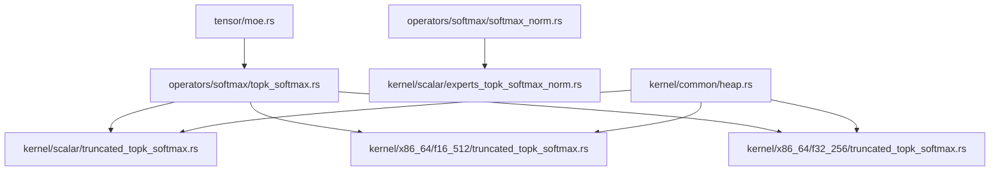
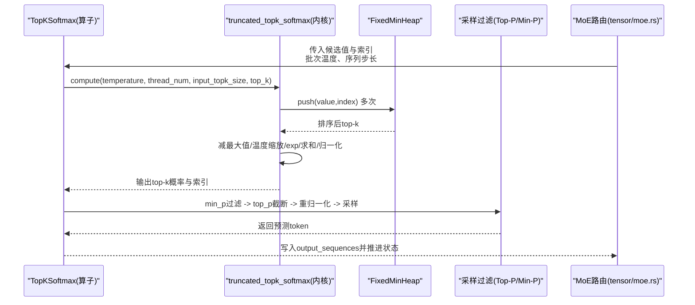
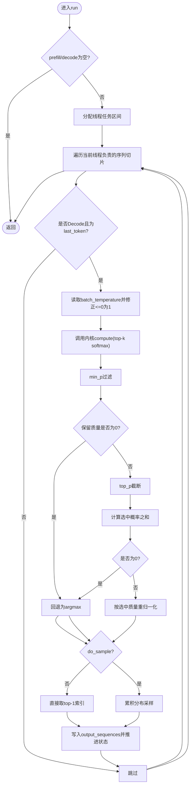
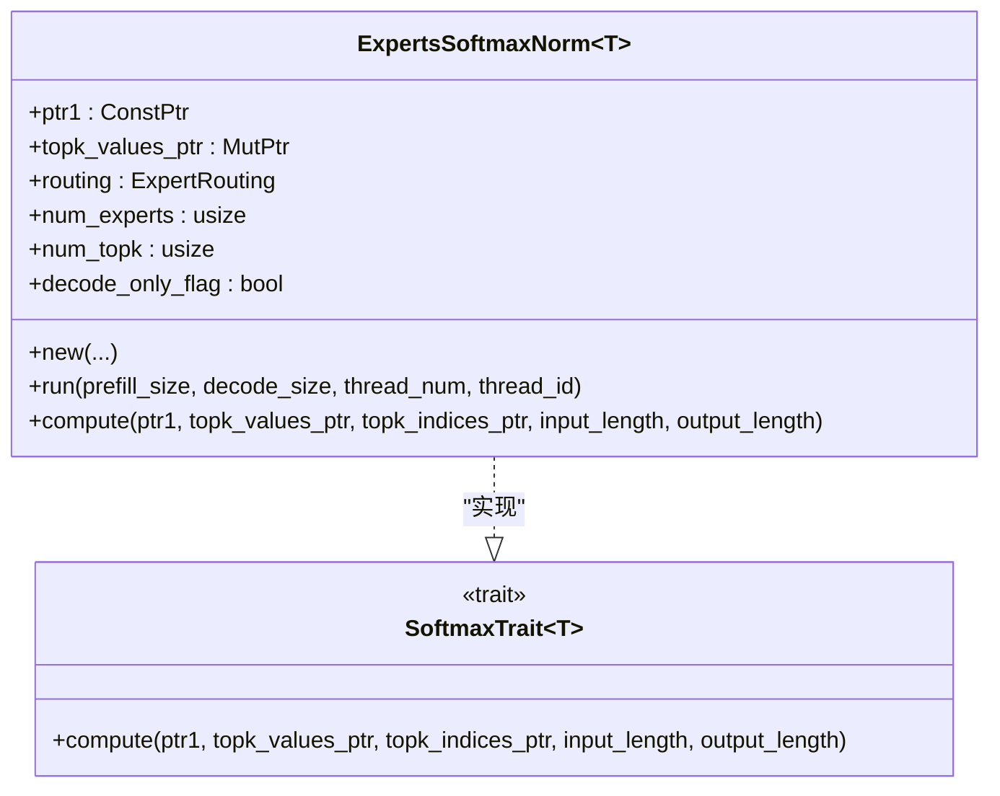
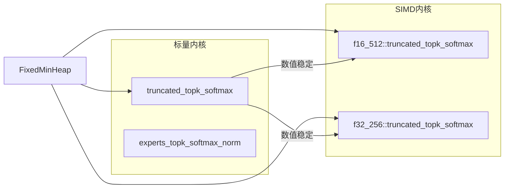
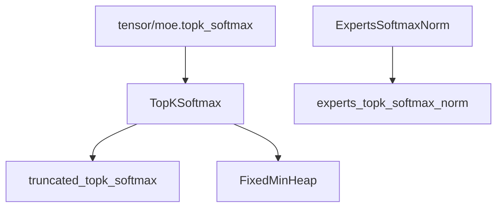

# Softmax 系列算子

<cite>
**本文引用的文件**   
- [src/operators/softmax/topk_softmax.rs](file://src/operators/softmax/topk_softmax.rs)
- [src/operators/softmax/softmax_norm.rs](file://src/operators/softmax/softmax_norm.rs)
- [src/kernel/scalar/truncated_topk_softmax.rs](file://src/kernel/scalar/truncated_topk_softmax.rs)
- [src/kernel/scalar/experts_topk_softmax_norm.rs](file://src/kernel/scalar/experts_topk_softmax_norm.rs)
- [src/kernel/x86_64/f16_512/truncated_topk_softmax.rs](file://src/kernel/x86_64/f16_512/truncated_topk_softmax.rs)
- [src/kernel/x86_64/f32_256/truncated_topk_softmax.rs](file://src/kernel/x86_64/f32_256/truncated_topk_softmax.rs)
- [src/kernel/common/heap.rs](file://src/kernel/common/heap.rs)
- [src/operators/traits/softmax.rs](file://src/operators/traits/softmax.rs)
- [src/tensor/moe.rs](file://src/tensor/moe.rs)
</cite>

## 目录
1. [简介](#简介)
2. [项目结构](#项目结构)
3. [核心组件](#核心组件)
4. [架构总览](#架构总览)
5. [详细组件分析](#详细组件分析)
6. [依赖关系分析](#依赖关系分析)
7. [性能与数值精度](#性能与数值精度)
8. [故障排查指南](#故障排查指南)
9. [结论](#结论)
10. [附录](#附录)

## 简介
本技术文档聚焦于 Softmax 系列算子在代码库中的实现与应用，覆盖以下主题：
- 标准 Softmax 的数值稳定性处理与溢出防护（减去最大值、温度缩放）
- TopK Softmax 的实现原理及其在采样中的应用（Top-K、Top-P、Min-P、温度参数）
- Softmax 归一化的数学基础与梯度计算要点
- 不同温度参数对概率分布的影响
- 与其他算子的融合优化（如专家路由、MoE 路由）
- 数值精度控制与性能优化策略（SIMD、固定容量堆、原地归约）
- 输出可视化与分析工具建议

## 项目结构
Softmax 相关实现分布在 operators、kernel 与 tensor 层：
- operators/softmax：对外暴露的算子接口与调度逻辑
- kernel/*：标量与 SIMD 内核实现（含 TopK 选择、指数与归一化）
- kernel/common：通用数据结构（固定容量最小堆）
- tensor/moe：将 TopK Softmax 集成到 MoE 路由流程中

图表来源
- [src/operators/softmax/topk_softmax.rs:1-120](file://src/operators/softmax/topk_softmax.rs#L1-L120)
- [src/operators/softmax/softmax_norm.rs:1-120](file://src/operators/softmax/softmax_norm.rs#L1-L120)
- [src/kernel/scalar/truncated_topk_softmax.rs:1-66](file://src/kernel/scalar/truncated_topk_softmax.rs#L1-L66)
- [src/kernel/scalar/experts_topk_softmax_norm.rs:1-59](file://src/kernel/scalar/experts_topk_softmax_norm.rs#L1-L59)
- [src/kernel/x86_64/f16_512/truncated_topk_softmax.rs:1-78](file://src/kernel/x86_64/f16_512/truncated_topk_softmax.rs#L1-L78)
- [src/kernel/x86_64/f32_256/truncated_topk_softmax.rs:1-68](file://src/kernel/x86_64/f32_256/truncated_topk_softmax.rs#L1-L68)
- [src/kernel/common/heap.rs:1-62](file://src/kernel/common/heap.rs#L1-L62)
- [src/tensor/moe.rs:290-317](file://src/tensor/moe.rs#L290-L317)

章节来源
- [src/operators/softmax/topk_softmax.rs:1-120](file://src/operators/softmax/topk_softmax.rs#L1-L120)
- [src/operators/softmax/softmax_norm.rs:1-120](file://src/operators/softmax/softmax_norm.rs#L1-L120)
- [src/kernel/scalar/truncated_topk_softmax.rs:1-66](file://src/kernel/scalar/truncated_topk_softmax.rs#L1-L66)
- [src/kernel/scalar/experts_topk_softmax_norm.rs:1-59](file://src/kernel/scalar/experts_topk_softmax_norm.rs#L1-L59)
- [src/kernel/x86_64/f16_512/truncated_topk_softmax.rs:1-78](file://src/kernel/x86_64/f16_512/truncated_topk_softmax.rs#L1-L78)
- [src/kernel/x86_64/f32_256/truncated_topk_softmax.rs:1-68](file://src/kernel/x86_64/f32_256/truncated_topk_softmax.rs#L1-L68)
- [src/kernel/common/heap.rs:1-62](file://src/kernel/common/heap.rs#L1-L62)
- [src/tensor/moe.rs:290-317](file://src/tensor/moe.rs#L290-L317)

## 核心组件
- TopKSoftmax<T>：面向解码阶段的 TopK Softmax + 采样（Top-P/Min-P），支持多线程分片与 EOS 终止。
- ExpertsSoftmaxNorm<T>：针对 MoE 专家路由的 TopK Softmax 归一化（可仅对 top-k 内部归一化或全专家归一化）。
- 内核函数：
  - truncated_topk_softmax：从多线程候选集合中选择 top-k，并进行数值稳定的 softmax。
  - experts_topk_softmax_norm：在 top-k 内或全专家维度进行 softmax 归一化。
- FixedMinHeap：固定容量的最小堆，用于高效维护 top-k 候选。

章节来源
- [src/operators/softmax/topk_softmax.rs:17-120](file://src/operators/softmax/topk_softmax.rs#L17-L120)
- [src/operators/softmax/softmax_norm.rs:14-108](file://src/operators/softmax/softmax_norm.rs#L14-L108)
- [src/kernel/scalar/truncated_topk_softmax.rs:6-66](file://src/kernel/scalar/truncated_topk_softmax.rs#L6-L66)
- [src/kernel/scalar/experts_topk_softmax_norm.rs:5-59](file://src/kernel/scalar/experts_topk_softmax_norm.rs#L5-L59)
- [src/kernel/common/heap.rs:4-62](file://src/kernel/common/heap.rs#L4-L62)

## 架构总览
下图展示了从高层算子到低层内核的数据流与控制流，以及硬件加速路径的选择。

图表来源
- [src/operators/softmax/topk_softmax.rs:127-206](file://src/operators/softmax/topk_softmax.rs#L127-L206)
- [src/kernel/scalar/truncated_topk_softmax.rs:6-66](file://src/kernel/scalar/truncated_topk_softmax.rs#L6-L66)
- [src/kernel/common/heap.rs:30-62](file://src/kernel/common/heap.rs#L30-L62)
- [src/tensor/moe.rs:290-317](file://src/tensor/moe.rs#L290-L317)

## 详细组件分析

### TopKSoftmax 组件
- 功能要点
  - 输入：每个线程的候选值与对应索引；温度；目标 top-k。
  - 输出：top-k 的概率与索引；最终选出的 token 写入 output_sequences。
  - 采样：支持 Min-P 阈值过滤、Top-P 累积质量截断、可选随机采样。
  - 数值稳定：先取 top-k 最大值，再按 temperature 缩放后进行 exp 与归一化。
- 关键流程
  - run：按线程分片遍历 decode_list，更新预填充阶段状态，仅在“最后一个 token”且处于 Decode 阶段时执行 TopK Softmax 与采样。
  - filter_and_sample：应用 min_p 过滤、top_p 截断、重新归一化、采样。
  - compute：调用内核 truncated_topk_softmax 完成 top-k 选择与 softmax。

图表来源
- [src/operators/softmax/topk_softmax.rs:127-206](file://src/operators/softmax/topk_softmax.rs#L127-L206)
- [src/operators/softmax/topk_softmax.rs:227-382](file://src/operators/softmax/topk_softmax.rs#L227-L382)
- [src/kernel/scalar/truncated_topk_softmax.rs:6-66](file://src/kernel/scalar/truncated_topk_softmax.rs#L6-L66)

章节来源
- [src/operators/softmax/topk_softmax.rs:17-120](file://src/operators/softmax/topk_softmax.rs#L17-L120)
- [src/operators/softmax/topk_softmax.rs:127-206](file://src/operators/softmax/topk_softmax.rs#L127-L206)
- [src/operators/softmax/topk_softmax.rs:227-382](file://src/operators/softmax/topk_softmax.rs#L227-L382)
- [src/operators/softmax/topk_softmax.rs:396-517](file://src/operators/softmax/topk_softmax.rs#L396-L517)

### ExpertsSoftmaxNorm 组件（MoE 路由）
- 功能要点
  - 输入：每个 token 对所有专家的得分。
  - 输出：top-k 专家索引与权重（概率）。
  - 归一化模式：
    - norm_topk_prob=true：仅对 top-k 内部做 softmax（避免全专家扫描）。
    - norm_topk_prob=false：对全部专家做 softmax，但只写回 top-k 的权重。
- 运行流程
  - run：单线程负责所有 token 的 top-k 选择与归一化，随后将结果写入路由结构（expert_counts、index_tensor、score_tensor）。

图表来源
- [src/operators/softmax/softmax_norm.rs:14-108](file://src/operators/softmax/softmax_norm.rs#L14-L108)
- [src/operators/traits/softmax.rs:28-37](file://src/operators/traits/softmax.rs#L28-L37)

章节来源
- [src/operators/softmax/softmax_norm.rs:14-108](file://src/operators/softmax/softmax_norm.rs#L14-L108)
- [src/operators/softmax/softmax_norm.rs:110-180](file://src/operators/softmax/softmax_norm.rs#L110-L180)
- [src/kernel/scalar/experts_topk_softmax_norm.rs:5-59](file://src/kernel/scalar/experts_topk_softmax_norm.rs#L5-L59)

### 内核实现与硬件加速
- 标量内核
  - truncated_topk_softmax：使用固定容量最小堆收集 top-k，然后进行数值稳定的 softmax。
  - experts_topk_softmax_norm：支持两种归一化模式（仅 top-k 或全专家）。
- SIMD 内核
  - f16_512/truncated_topk_softmax：AVX512FP16 路径，批量 exp 与归一化。
  - f32_256/truncated_topk_softmax：AVX2 路径，批量 exp 与归一化。
- 共同特性
  - 通过减去 top-k 最大值保证数值稳定。
  - 显式处理非有限值（NaN/Inf）以避免污染结果。
  - 对温度进行保护（≤0 视为 1）。

图表来源
- [src/kernel/scalar/truncated_topk_softmax.rs:6-66](file://src/kernel/scalar/truncated_topk_softmax.rs#L6-L66)
- [src/kernel/scalar/experts_topk_softmax_norm.rs:5-59](file://src/kernel/scalar/experts_topk_softmax_norm.rs#L5-L59)
- [src/kernel/x86_64/f16_512/truncated_topk_softmax.rs:1-78](file://src/kernel/x86_64/f16_512/truncated_topk_softmax.rs#L1-L78)
- [src/kernel/x86_64/f32_256/truncated_topk_softmax.rs:1-68](file://src/kernel/x86_64/f32_256/truncated_topk_softmax.rs#L1-L68)
- [src/kernel/common/heap.rs:30-62](file://src/kernel/common/heap.rs#L30-L62)

章节来源
- [src/kernel/scalar/truncated_topk_softmax.rs:6-66](file://src/kernel/scalar/truncated_topk_softmax.rs#L6-L66)
- [src/kernel/scalar/experts_topk_softmax_norm.rs:5-59](file://src/kernel/scalar/experts_topk_softmax_norm.rs#L5-L59)
- [src/kernel/x86_64/f16_512/truncated_topk_softmax.rs:1-78](file://src/kernel/x86_64/f16_512/truncated_topk_softmax.rs#L1-L78)
- [src/kernel/x86_64/f32_256/truncated_topk_softmax.rs:1-68](file://src/kernel/x86_64/f32_256/truncated_topk_softmax.rs#L1-L68)
- [src/kernel/common/heap.rs:30-62](file://src/kernel/common/heap.rs#L30-L62)

### 与 MoE 路由的融合
- tensor/moe.rs 提供 topk_softmax 便捷方法，封装了内存布局、线程容量推导与算子构造，便于在模型推理中直接调用。
- 典型用法：传入候选索引指针、输出序列缓冲、批次温度、序列步长、input_top_k、num_topk、top_p、min_p、do_sample、eos_ids 等参数。

章节来源
- [src/tensor/moe.rs:290-317](file://src/tensor/moe.rs#L290-L317)

## 依赖关系分析
- 组件耦合
  - TopKSoftmax 依赖内核 truncated_topk_softmax 与 FixedMinHeap。
  - ExpertsSoftmaxNorm 依赖内核 experts_topk_softmax_norm，并通过路由结构聚合结果。
  - tensor/moe 作为上层编排者，组合 TopKSoftmax 完成端到端路由与采样。
- 外部依赖
  - 数值运算 trait：Exp、Sqrt、FromNumber 等，统一 exp/sqrt 行为。
  - 运行时状态：Phase、SlotState、SequenceSlice 用于解码阶段控制。

图表来源
- [src/operators/softmax/topk_softmax.rs:396-517](file://src/operators/softmax/topk_softmax.rs#L396-L517)
- [src/operators/softmax/softmax_norm.rs:110-180](file://src/operators/softmax/softmax_norm.rs#L110-L180)
- [src/tensor/moe.rs:290-317](file://src/tensor/moe.rs#L290-L317)
- [src/kernel/common/heap.rs:30-62](file://src/kernel/common/heap.rs#L30-L62)

章节来源
- [src/operators/softmax/topk_softmax.rs:396-517](file://src/operators/softmax/topk_softmax.rs#L396-L517)
- [src/operators/softmax/softmax_norm.rs:110-180](file://src/operators/softmax/softmax_norm.rs#L110-L180)
- [src/tensor/moe.rs:290-317](file://src/tensor/moe.rs#L290-L317)
- [src/kernel/common/heap.rs:30-62](file://src/kernel/common/heap.rs#L30-L62)

## 性能与数值精度

### 数值稳定性与溢出防护
- 减最大值：在 exp 之前减去 top-k 的最大值，避免指数溢出。
- 温度保护：当 temperature ≤ 0 时回退为 1，防止除零或符号错误。
- 非有限值过滤：在构建 top-k 前跳过 NaN/Inf，确保后续统计正确。
- 归一化下界保护：在部分路径中对分母施加最小正值，避免除零。

章节来源
- [src/kernel/scalar/truncated_topk_softmax.rs:33-66](file://src/kernel/scalar/truncated_topk_softmax.rs#L33-L66)
- [src/kernel/x86_64/f16_512/truncated_topk_softmax.rs:49-77](file://src/kernel/x86_64/f16_512/truncated_topk_softmax.rs#L49-L77)
- [src/kernel/x86_64/f32_256/truncated_topk_softmax.rs:39-68](file://src/kernel/x86_64/f32_256/truncated_topk_softmax.rs#L39-L68)
- [src/operators/softmax/topk_softmax.rs:218-225](file://src/operators/softmax/topk_softmax.rs#L218-L225)

### 温度参数的影响
- 温度 > 1：分布更平滑，多样性提升，确定性下降。
- 温度 < 1：分布更尖锐，确定性增强，多样性降低。
- 温度 = 1：标准 softmax。
- 温度 ≤ 0：实现中强制为 1，避免数值异常。

章节来源
- [src/operators/softmax/topk_softmax.rs:218-225](file://src/operators/softmax/topk_softmax.rs#L218-L225)
- [src/kernel/x86_64/f16_512/truncated_topk_softmax.rs:49-53](file://src/kernel/x86_64/f16_512/truncated_topk_softmax.rs#L49-L53)

### 采样策略（Top-P / Min-P）
- Min-P：以最大概率为基准，低于阈值的候选置零，减少尾部噪声。
- Top-P：按概率降序累积，达到目标质量即截断，平衡多样性和可控性。
- 重归一化：截断后对选中子集重新归一化，保证概率和为 1。
- 采样：若启用 do_sample，则基于累积分布随机选择；否则取 top-1。

章节来源
- [src/operators/softmax/topk_softmax.rs:227-382](file://src/operators/softmax/topk_softmax.rs#L227-L382)

### 性能优化策略
- 固定容量最小堆：O(N log K) 选择 top-k，空间 O(K)。
- SIMD 加速：
  - f32_256：AVX2 向量 exp 与归一化。
  - f16_512：AVX512FP16 向量 exp 与归一化。
- 原地操作：尽量就地更新输出缓冲区，减少额外拷贝。
- 条件编译：根据目标平台特性选择最优路径。

章节来源
- [src/kernel/common/heap.rs:30-62](file://src/kernel/common/heap.rs#L30-L62)
- [src/kernel/x86_64/f32_256/truncated_topk_softmax.rs:44-68](file://src/kernel/x86_64/f32_256/truncated_topk_softmax.rs#L44-L68)
- [src/kernel/x86_64/f16_512/truncated_topk_softmax.rs:55-77](file://src/kernel/x86_64/f16_512/truncated_topk_softmax.rs#L55-L77)

### 与其他算子的融合
- 与 MatMul/Expert Routing 融合：在 MoE 场景下，TopK Softmax 紧接路由打分，减少中间存储与同步开销。
- 与 RMSNorm/Silu 等激活融合：虽不直接在本模块体现，但整体算子管线遵循“少访存、多复用”的设计原则。

章节来源
- [src/operators/softmax/softmax_norm.rs:54-108](file://src/operators/softmax/softmax_norm.rs#L54-L108)
- [src/tensor/moe.rs:290-317](file://src/tensor/moe.rs#L290-L317)

## 故障排查指南
- 症状：输出包含 NaN 或 Inf
  - 检查输入是否包含非有限值；内核会在构建 top-k 前跳过这些值，但仍需确认上游数据清洗。
  - 确认温度参数是否被误设为 0 或负数（实现会回退为 1，但应显式校验）。
- 症状：采样未触发或总是选择 top-1
  - 检查 do_sample 标志；若为 false，将直接返回 top-1。
  - 检查 top_p/min_p 设置是否导致截断后质量为 0，此时会回退为 argmax。
- 症状：MoE 路由权重异常
  - 确认 norm_topk_prob 配置是否符合预期（仅 top-k 归一化 vs 全专家归一化）。
  - 核对 expert_counts 与 index_tensor/score_tensor 写入顺序与容量。

章节来源
- [src/operators/softmax/topk_softmax.rs:227-382](file://src/operators/softmax/topk_softmax.rs#L227-L382)
- [src/operators/softmax/softmax_norm.rs:54-108](file://src/operators/softmax/softmax_norm.rs#L54-L108)

## 结论
该 Softmax 系列算子实现了高可用、高性能的 TopK Softmax 与采样能力，具备完善的数值稳定性保障与多种优化路径。结合 MoE 路由与 SIMD 加速，可在大规模生成场景中保持低延迟与高吞吐。建议在工程实践中：
- 合理设置温度、Top-P、Min-P 以平衡确定性与多样性。
- 优先启用 SIMD 路径并确保输入数据无非法值。
- 在 MoE 路由中选择合适的归一化模式，避免不必要的全专家扫描。

## 附录

### 数学基础与梯度要点
- 标准 Softmax：p_i = exp(x_i - max(x)) / Σ_j exp(x_j - max(x))
- 温度缩放：x'_i = x_i / T
- 梯度：∂L/∂x_i = p_i (δ_i - Σ_j p_j δ_j)，其中 δ 为损失对输出的梯度。
- 注意：实际推理通常无需显式计算梯度，但在训练或对齐时需遵循上述公式。

[本节为概念性说明，不直接分析具体文件]

### 可视化与分析工具建议
- 概率分布可视化：绘制 top-k 概率条形图，观察温度与采样策略的影响。
- 累积质量曲线：展示 Top-P 截断点与剩余质量。
- 热力图：MoE 路由中各 token 对专家的注意力权重分布。
- 指标监控：平均熵、Top-1 命中率、Top-P 覆盖率、EOS 提前终止率。

[本节为概念性说明，不直接分析具体文件]