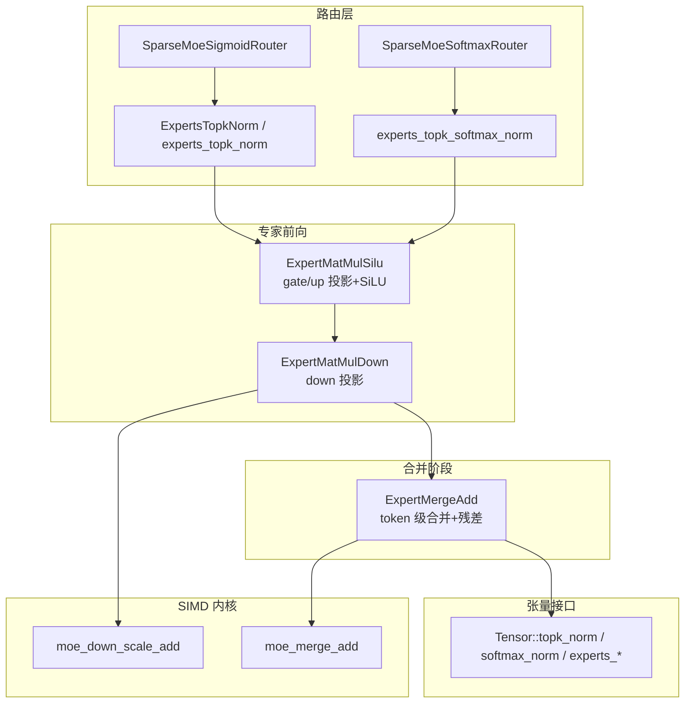
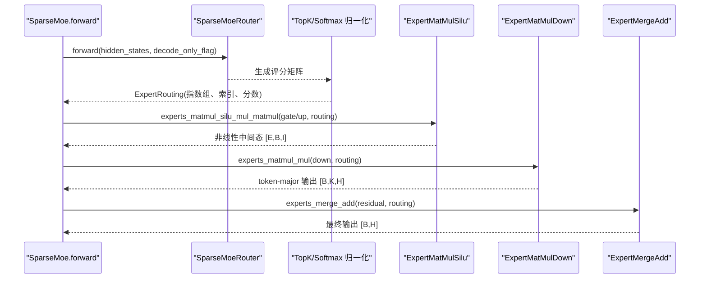
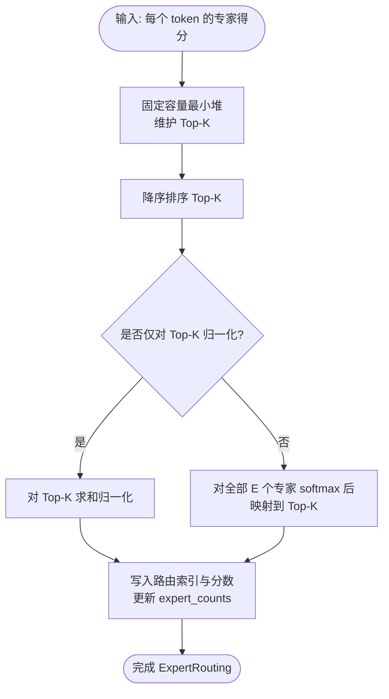
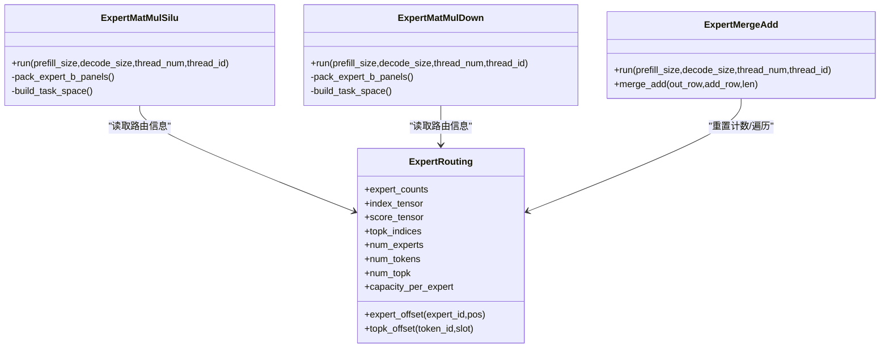

# 专家混合算子

<cite>
**本文引用的文件列表**
- [src/operators/expert/expert_routing.rs](file://src/operators/expert/expert_routing.rs)
- [src/transformer/sparse_moe/layer.rs](file://src/transformer/sparse_moe/layer.rs)
- [src/tensor/moe.rs](file://src/tensor/moe.rs)
- [src/kernel/scalar/experts_topk_norm.rs](file://src/kernel/scalar/experts_topk_norm.rs)
- [src/kernel/scalar/experts_topk_softmax_norm.rs](file://src/kernel/scalar/experts_topk_softmax_norm.rs)
- [src/operators/expert/expert_merge_add.rs](file://src/operators/expert/expert_merge_add.rs)
- [src/operators/expert/expert_matmul_mul.rs](file://src/operators/expert/expert_matmul_mul.rs)
- [src/operators/expert/expert_matmul_silu_mul_matmul.rs](file://src/operators/expert/expert_matmul_silu_mul_matmul.rs)
- [src/operators/expert/expert_topk_norm.rs](file://src/operators/expert/expert_topk_norm.rs)
- [src/transformer/sparse_moe/router_softmax.rs](file://src/transformer/sparse_moe/router_softmax.rs)
- [src/transformer/sparse_moe/router_sigmoid.rs](file://src/transformer/sparse_moe/router_sigmoid.rs)
- [src/kernel/x86_64/f16_512/moe_merge.rs](file://src/kernel/x86_64/f16_512/moe_merge.rs)
- [src/kernel/x86_64/f16_512/moe_down.rs](file://src/kernel/x86_64/f16_512/moe_down.rs)
- [src/transformer/config/router_scoring.rs](file://src/transformer/config/router_scoring.rs)
</cite>

## 目录
1. [简介](#简介)
2. [项目结构](#项目结构)
3. [核心组件](#核心组件)
4. [架构总览](#架构总览)
5. [详细组件分析](#详细组件分析)
6. [依赖关系分析](#依赖关系分析)
7. [性能与优化](#性能与优化)
8. [故障排查指南](#故障排查指南)
9. [结论](#结论)
10. [附录](#附录)

## 简介
本技术文档聚焦于“专家混合（MoE）”算子的实现与优化，涵盖路由算法、负载均衡、Top-K 选择策略、专家前向并行计算与结果合并、权重存储与访问模式、稀疏计算与内存局部性改进、动态扩展策略以及性能调优建议。该实现以 Rust 为核心，采用算子化流水线与 SIMD 内核加速，支持 Softmax 与 Sigmoid 两种路由打分方式，并通过紧凑的 per-expert 队列组织路由后的 token，最大化 GEMM 微内核的吞吐。

## 项目结构
围绕 MoE 的关键代码分布在以下模块：
- 路由与打分：Softmax/Sigmoid 路由器与 Top-K 归一化核
- 专家前向：Gate/Up 投影 + SiLU 融合、Down 投影
- 结果合并：按 token 聚合 top-k 专家输出并叠加残差
- 张量接口：将路由与专家前向封装为 Tensor 方法，统一入队执行
- 内核优化：x86_64 AVX-512 FP16 专用路径

图表来源
- [src/transformer/sparse_moe/router_softmax.rs:57-83](file://src/transformer/sparse_moe/router_softmax.rs#L57-L83)
- [src/transformer/sparse_moe/router_sigmoid.rs:57-76](file://src/transformer/sparse_moe/router_sigmoid.rs#L57-L76)
- [src/operators/expert/expert_topk_norm.rs:53-103](file://src/operators/expert/expert_topk_norm.rs#L53-L103)
- [src/kernel/scalar/experts_topk_norm.rs:4-48](file://src/kernel/scalar/experts_topk_norm.rs#L4-L48)
- [src/kernel/scalar/experts_topk_softmax_norm.rs:5-59](file://src/kernel/scalar/experts_topk_softmax_norm.rs#L5-L59)
- [src/operators/expert/expert_matmul_silu_mul_matmul.rs:367-559](file://src/operators/expert/expert_matmul_silu_mul_matmul.rs#L367-L559)
- [src/operators/expert/expert_matmul_mul.rs:399-578](file://src/operators/expert/expert_matmul_mul.rs#L399-L578)
- [src/operators/expert/expert_merge_add.rs:90-149](file://src/operators/expert/expert_merge_add.rs#L90-L149)
- [src/kernel/x86_64/f16_512/moe_down.rs:14-36](file://src/kernel/x86_64/f16_512/moe_down.rs#L14-L36)
- [src/kernel/x86_64/f16_512/moe_merge.rs:13-32](file://src/kernel/x86_64/f16_512/moe_merge.rs#L13-L32)
- [src/tensor/moe.rs:155-176](file://src/tensor/moe.rs#L155-L176)

章节来源
- [src/transformer/sparse_moe/layer.rs:152-198](file://src/transformer/sparse_moe/layer.rs#L152-L198)
- [src/tensor/moe.rs:155-176](file://src/tensor/moe.rs#L155-L176)

## 核心组件
- ExpertRouting：集中维护每 expert 的紧凑 token 队列、路由索引与分数，提供偏移计算与任务分配辅助函数。
- SparseMoeRouter：封装 Softmax/Sigmoid 两种打分器，输出 ExpertRouting。
- ExpertsTopkNorm / experts_topk_norm：基于最小堆的 Top-K 选择与概率归一化。
- ExpertMatMulSilu：对每个 expert 并行执行 gate/up 投影，并在同一通道内融合 SiLU(gate)*up。
- ExpertMatMulDown：对每个 expert 执行 down 投影，按 token-major 布局写回带路由权重的结果。
- ExpertMergeAdd：按 token 聚合 top-k 专家输出，并叠加残差；f16 路径使用 AVX-512 FP16 向量加法。
- Tensor 接口：将上述算子通过 Operator 队列异步执行，屏蔽线程调度细节。

章节来源
- [src/operators/expert/expert_routing.rs:44-65](file://src/operators/expert/expert_routing.rs#L44-L65)
- [src/operators/expert/expert_topk_norm.rs:12-46](file://src/operators/expert/expert_topk_norm.rs#L12-L46)
- [src/operators/expert/expert_matmul_silu_mul_matmul.rs:36-91](file://src/operators/expert/expert_matmul_silu_mul_matmul.rs#L36-L91)
- [src/operators/expert/expert_matmul_mul.rs:42-89](file://src/operators/expert/expert_matmul_mul.rs#L42-L89)
- [src/operators/expert/expert_merge_add.rs:38-56](file://src/operators/expert/expert_merge_add.rs#L38-L56)
- [src/tensor/moe.rs:95-134](file://src/tensor/moe.rs#L95-L134)

## 架构总览
MoE 前向流程分为三个阶段：路由打分与 Top-K 选择、专家并行前向、结果合并与残差叠加。

图表来源
- [src/transformer/sparse_moe/layer.rs:152-198](file://src/transformer/sparse_moe/layer.rs#L152-L198)
- [src/tensor/moe.rs:95-134](file://src/tensor/moe.rs#L95-L134)
- [src/operators/expert/expert_matmul_silu_mul_matmul.rs:367-559](file://src/operators/expert/expert_matmul_silu_mul_matmul.rs#L367-L559)
- [src/operators/expert/expert_matmul_mul.rs:399-578](file://src/operators/expert/expert_matmul_mul.rs#L399-L578)
- [src/operators/expert/expert_merge_add.rs:90-149](file://src/operators/expert/expert_merge_add.rs#L90-L149)

## 详细组件分析

### 路由与负载均衡
- 打分方式
  - Softmax 路由：先做线性门控，再对每个 token 的专家得分进行 softmax 归一化，随后取 Top-K。
  - Sigmoid 路由：先做线性门控加可选偏置，再对每个 token 的专家得分进行 sigmoid，然后 Top-K 并按选中集合归一化。
- Top-K 选择与归一化
  - 基于固定容量最小堆在 O(E log K) 时间内选出 Top-K 专家，保持并列稳定顺序。
  - 支持两种归一化策略：仅对选中的 K 个专家归一化，或对全 E 个专家 softmax 后再映射到 Top-K。
- 负载均衡
  - 通过原子计数器记录每个 expert 已分配的 token 数，避免单点过载。
  - 构建任务空间时按 expert 切分，结合全局任务 ID 到 expert 与局部 tile 的映射，提升并行度与缓存命中。

图表来源
- [src/kernel/scalar/experts_topk_norm.rs:4-48](file://src/kernel/scalar/experts_topk_norm.rs#L4-L48)
- [src/kernel/scalar/experts_topk_softmax_norm.rs:5-59](file://src/kernel/scalar/experts_topk_softmax_norm.rs#L5-L59)
- [src/operators/expert/expert_topk_norm.rs:53-103](file://src/operators/expert/expert_topk_norm.rs#L53-L103)

章节来源
- [src/transformer/sparse_moe/router_softmax.rs:57-83](file://src/transformer/sparse_moe/router_softmax.rs#L57-L83)
- [src/transformer/sparse_moe/router_sigmoid.rs:57-76](file://src/transformer/sparse_moe/router_sigmoid.rs#L57-L76)
- [src/operators/expert/expert_topk_norm.rs:53-103](file://src/operators/expert/expert_topk_norm.rs#L53-L103)
- [src/kernel/scalar/experts_topk_norm.rs:4-48](file://src/kernel/scalar/experts_topk_norm.rs#L4-L48)
- [src/kernel/scalar/experts_topk_softmax_norm.rs:5-59](file://src/kernel/scalar/experts_topk_softmax_norm.rs#L5-L59)

### 专家前向并行与结果合并
- Gate/Up 投影融合 SiLU
  - 对每个 expert 并行处理被路由到的 token 块，预打包权重面板，按 micro tile 迭代 reduction 维度。
  - 在 f16 路径下调用 AVX-512 FP16 内核，减少访存与计算开销。
- Down 投影
  - 同样按 expert 与输出列宏块划分任务，预打包 B 面板，逐块累加到每线程私有累加器，最后乘以路由权重并 scatter 到 token-major 输出。
- 合并与残差叠加
  - 将每个 token 的 top-k 专家输出相加，并加上残差；f16 路径使用 AVX-512 FP16 向量加法。

图表来源
- [src/operators/expert/expert_routing.rs:44-65](file://src/operators/expert/expert_routing.rs#L44-L65)
- [src/operators/expert/expert_matmul_silu_mul_matmul.rs:36-91](file://src/operators/expert/expert_matmul_silu_mul_matmul.rs#L36-L91)
- [src/operators/expert/expert_matmul_mul.rs:42-89](file://src/operators/expert/expert_matmul_mul.rs#L42-L89)
- [src/operators/expert/expert_merge_add.rs:38-56](file://src/operators/expert/expert_merge_add.rs#L38-L56)

章节来源
- [src/operators/expert/expert_matmul_silu_mul_matmul.rs:367-559](file://src/operators/expert/expert_matmul_silu_mul_matmul.rs#L367-L559)
- [src/operators/expert/expert_matmul_mul.rs:399-578](file://src/operators/expert/expert_matmul_mul.rs#L399-L578)
- [src/operators/expert/expert_merge_add.rs:90-149](file://src/operators/expert/expert_merge_add.rs#L90-L149)

### 专家权重的高效存储与访问模式
- 预打包权重面板
  - 将 down/gate/up 权重按 reduction_block × micro_tile 的面板重排，便于微内核连续加载。
  - 在 new() 中一次性完成打包，run() 只读，避免运行时重排开销。
- 线程私有缓存池
  - A 输入 tile、累加器、索引缓冲等按线程切分，避免锁竞争与重复分配。
- 任务空间构建
  - 根据 expert_counts 与 batch 大小，为每个 expert 构建任务元数据与路由 token 列表，降低随机访存。

章节来源
- [src/operators/expert/expert_matmul_silu_mul_matmul.rs:214-259](file://src/operators/expert/expert_matmul_silu_mul_matmul.rs#L214-L259)
- [src/operators/expert/expert_matmul_mul.rs:210-254](file://src/operators/expert/expert_matmul_mul.rs#L210-L254)
- [src/operators/expert/expert_matmul_silu_mul_matmul.rs:310-365](file://src/operators/expert/expert_matmul_silu_mul_matmul.rs#L310-L365)
- [src/operators/expert/expert_matmul_mul.rs:313-397](file://src/operators/expert/expert_matmul_mul.rs#L313-L397)

### 稀疏计算优化与内存局部性
- 紧凑 per-expert 队列
  - 将路由到同一 expert 的 token 连续存放，提高 GEMM 的局部性与批量化能力。
- Micro-kernel 分块
  - 行/列方向按 micro tile 切分，减少寄存器压力，提升缓存命中率。
- 尾部处理
  - 对非对齐长度采用标量或轻量向量路径，保证正确性与性能平衡。

章节来源
- [src/operators/expert/expert_routing.rs:27-41](file://src/operators/expert/expert_routing.rs#L27-L41)
- [src/operators/expert/expert_matmul_silu_mul_matmul.rs:283-308](file://src/operators/expert/expert_matmul_silu_mul_matmul.rs#L283-L308)
- [src/operators/expert/expert_matmul_mul.rs:277-310](file://src/operators/expert/expert_matmul_mul.rs#L277-L310)
- [src/kernel/x86_64/f16_512/moe_down.rs:14-36](file://src/kernel/x86_64/f16_512/moe_down.rs#L14-L36)
- [src/kernel/x86_64/f16_512/moe_merge.rs:13-32](file://src/kernel/x86_64/f16_512/moe_merge.rs#L13-L32)

### 专家数量动态调整与扩展策略
- 容量规划
  - capacity_per_expert = num_tokens * num_topk，确保每个 expert 可容纳所有 token 的 top-k 槽位。
- 原子计数与边界检查
  - 使用 AtomicUsize 统计每个 expert 的已分配 token 数，防止越界写入。
- 扩展建议
  - 增大 num_experts 时需同步扩容 index/score/topk 缓冲区，并重新评估 capacity_per_expert 以避免溢出。
  - 若出现负载不均衡，可通过增加 num_topk 或引入惩罚项调节路由分布。

章节来源
- [src/tensor/moe.rs:246-288](file://src/tensor/moe.rs#L246-L288)
- [src/operators/expert/expert_topk_norm.rs:89-101](file://src/operators/expert/expert_topk_norm.rs#L89-L101)

## 依赖关系分析
- 高层编排
  - SparseMoe 组合路由与专家前向，调用 Tensor 接口将算子入队执行。
- 路由打分
  - Softmax 路由依赖 softmax_norm；Sigmoid 路由依赖 sigmoid_gate + topk_norm。
- 专家前向
  - ExpertMatMulSilu 与 ExpertMatMulDown 均依赖 ExpertRouting 提供的紧凑队列与任务分配。
- 合并阶段
  - ExpertMergeAdd 负责 token 级聚合与残差叠加，并使用 SIMD 内核加速。

图表来源
- [src/transformer/sparse_moe/layer.rs:152-198](file://src/transformer/sparse_moe/layer.rs#L152-L198)
- [src/transformer/sparse_moe/router_softmax.rs:57-83](file://src/transformer/sparse_moe/router_softmax.rs#L57-L83)
- [src/transformer/sparse_moe/router_sigmoid.rs:57-76](file://src/transformer/sparse_moe/router_sigmoid.rs#L57-L76)
- [src/operators/expert/expert_matmul_silu_mul_matmul.rs:367-559](file://src/operators/expert/expert_matmul_silu_mul_matmul.rs#L367-L559)
- [src/operators/expert/expert_matmul_mul.rs:399-578](file://src/operators/expert/expert_matmul_mul.rs#L399-L578)
- [src/operators/expert/expert_merge_add.rs:90-149](file://src/operators/expert/expert_merge_add.rs#L90-L149)

章节来源
- [src/transformer/config/router_scoring.rs:6-22](file://src/transformer/config/router_scoring.rs#L6-L22)

## 性能与优化
- 关键优化点
  - 预打包权重面板：减少运行时转置与访存碎片。
  - 线程私有缓存池：避免锁竞争与重复分配。
  - Micro-kernel 分块：提升缓存局部性与寄存器复用。
  - AVX-512 FP16 内核：向量化的 scale-add 与 merge-add，显著降低延迟。
- 调参建议
  - a_row_step_macro/b_row_step_micro/column_step_macro 需与硬件缓存层级匹配，通常 3×32 的微内核在 f16 上表现良好。
  - 合理设置 num_topk 与 capacity_per_expert，避免路由溢出与空载。
  - 对于长序列场景，适当增大 token_block_rows 以提升批量化程度。
- 监控指标
  - 各 expert 的 expert_counts 分布用于诊断负载不均衡。
  - 观察不同 micro tile 配置下的吞吐与延迟变化。

[本节为通用指导，无需特定文件引用]

## 故障排查指南
- 路由溢出
  - 现象：调试断言失败或越界写入。
  - 排查：检查 capacity_per_expert 是否足够，确认 num_tokens 与 num_topk 乘积未超过容量。
- 负载不均衡
  - 现象：部分 expert 空闲，另一些过载。
  - 排查：调整路由打分（如引入 bias）、增大 num_topk 或增加 num_experts。
- 精度问题
  - 现象：f16 路径与参考实现存在偏差。
  - 排查：核对 AVX-512 FP16 内核的尾处理和舍入行为，必要时切换至标量路径验证。
- 线程安全
  - 现象：并发运行导致竞态。
  - 排查：确认 expert_counts 使用原子操作，且 reset_gating 在合适时机清零。

章节来源
- [src/operators/expert/expert_topk_norm.rs:89-101](file://src/operators/expert/expert_topk_norm.rs#L89-L101)
- [src/operators/expert/expert_merge_add.rs:110-117](file://src/operators/expert/expert_merge_add.rs#L110-L117)

## 结论
该 MoE 实现通过紧凑路由队列、预打包权重与 micro-kernel 分块，结合 AVX-512 FP16 内核，实现了高效的专家并行前向与结果合并。Softmax/Sigmoid 双路由策略与灵活的 Top-K 归一化选项，使其能够适配多种模型需求。通过合理的容量规划与参数调优，可在多核 CPU 上获得良好的吞吐与延迟表现。

[本节为总结，无需特定文件引用]

## 附录
- 路由打分类型选择
  - 从配置解析 RouterScoringKind，默认依据模型族决定 Softmax 或 Sigmoid。
- 张量接口示例路径
  - Tensor::softmax_norm / topk_norm / experts_matmul_silu_mul_matmul / experts_matmul_mul / experts_merge_add

章节来源
- [src/transformer/config/router_scoring.rs:11-22](file://src/transformer/config/router_scoring.rs#L11-L22)
- [src/tensor/moe.rs:155-176](file://src/tensor/moe.rs#L155-L176)
- [src/tensor/moe.rs:223-244](file://src/tensor/moe.rs#L223-L244)
- [src/tensor/moe.rs:95-134](file://src/tensor/moe.rs#L95-L134)