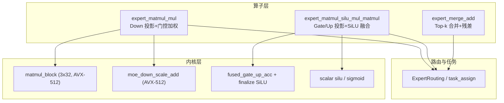
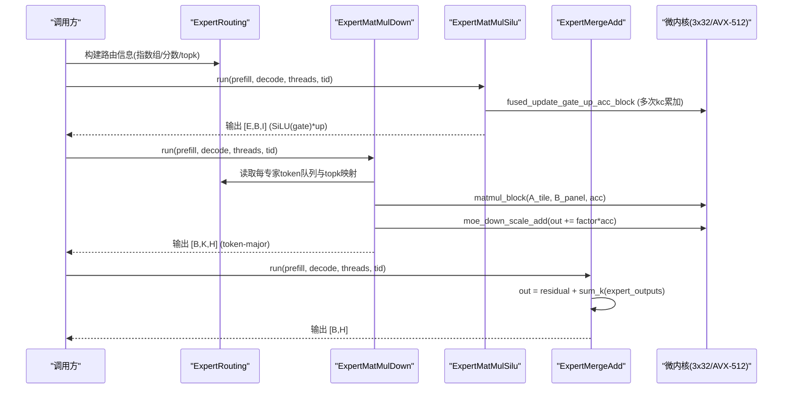
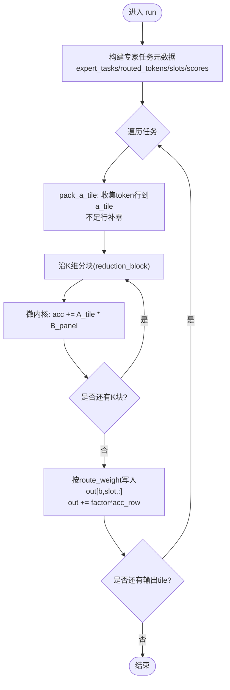
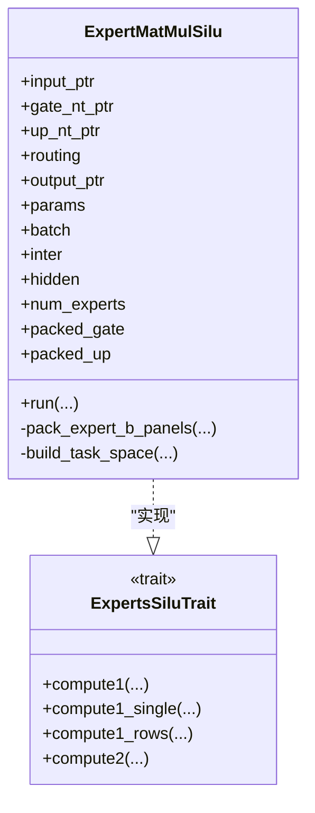
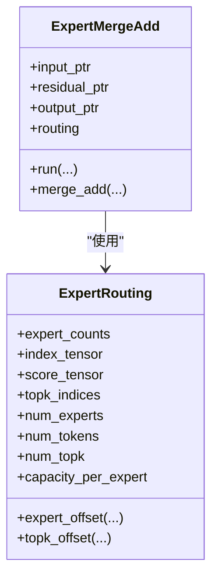
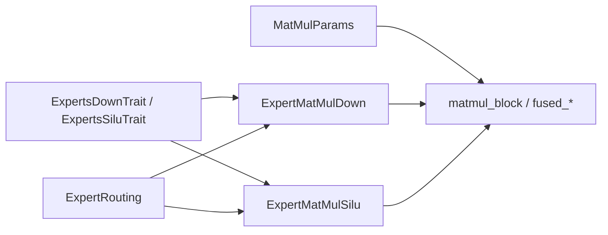

# 专家计算算子

<cite>
**本文引用的文件**
- [src/operators/expert/expert_matmul_mul.rs](file://src/operators/expert/expert_matmul_mul.rs)
- [src/operators/expert/expert_matmul_silu_mul_matmul.rs](file://src/operators/expert/expert_matmul_silu_mul_matmul.rs)
- [src/kernel/scalar/silu.rs](file://src/kernel/scalar/silu.rs)
- [src/num_traits/sigmoid.rs](file://src/num_traits/sigmoid.rs)
- [src/operators/expert/expert_routing.rs](file://src/operators/expert/expert_routing.rs)
- [src/kernel/x86_64/f16_512/matmul_block.rs](file://src/kernel/x86_64/f16_512/matmul_block.rs)
- [src/operators/traits/expert.rs](file://src/operators/traits/expert.rs)
- [src/kernel/common/matmul_params.rs](file://src/kernel/common/matmul_params.rs)
- [src/kernel/x86_64/f16_512/moe_down.rs](file://src/kernel/x86_64/f16_512/moe_down.rs)
- [src/operators/expert/expert_merge_add.rs](file://src/operators/expert/expert_merge_add.rs)
- [src/kernel/x86_64/f16_512/fused_gate_up_silu_mul_block.rs](file://src/kernel/x86_64/f16_512/fused_gate_up_silu_mul_block.rs)
</cite>

## 目录
1. [简介](#简介)
2. [项目结构](#项目结构)
3. [核心组件](#核心组件)
4. [架构总览](#架构总览)
5. [详细组件分析](#详细组件分析)
6. [依赖关系分析](#依赖关系分析)
7. [性能与并行性](#性能与并行性)
8. [数值稳定性与精度控制](#数值稳定性与精度控制)
9. [故障排查指南](#故障排查指南)
10. [结论](#结论)
11. [附录：扩展自定义专家网络](#附录扩展自定义专家网络)

## 简介
本技术文档聚焦于 MoE（Mixture of Experts）前向传播中的“专家”路径，深入解析两个关键算子：
- expert_matmul_mul：稀疏路由后的 down-projection 矩阵乘法并乘以门控权重。
- expert_matmul_silu_mul_matmul：Gate/Up 双分支投影、SiLU 激活与逐元素乘法的融合实现。

文档将阐述其数学原理、数据布局、微内核优化、任务划分与并行策略、数值稳定性与精度控制，并提供性能分析与调优建议，以及扩展自定义专家网络的实践指南。

## 项目结构
围绕专家算子的关键代码分布在 operators/expert、kernel/x86_64/f16_512、operators/traits 等目录中。整体采用“高层算子 + 底层微内核”的分层设计：
- 高层算子负责任务构建、路由索引处理、线程池调度、内存池复用与输出写回。
- 底层微内核提供 AVX-512 FP16 加速的 GEMM、缩放累加、SiLU 融合等原语。

图表来源
- [src/operators/expert/expert_matmul_mul.rs:1-200](file://src/operators/expert/expert_matmul_mul.rs#L1-L200)
- [src/operators/expert/expert_matmul_silu_mul_matmul.rs:1-200](file://src/operators/expert/expert_matmul_silu_mul_matmul.rs#L1-L200)
- [src/operators/expert/expert_routing.rs:1-168](file://src/operators/expert/expert_routing.rs#L1-L168)
- [src/kernel/x86_64/f16_512/matmul_block.rs:1-120](file://src/kernel/x86_64/f16_512/matmul_block.rs#L1-L120)
- [src/kernel/x86_64/f16_512/moe_down.rs:1-60](file://src/kernel/x86_64/f16_512/moe_down.rs#L1-L60)
- [src/kernel/x86_64/f16_512/fused_gate_up_silu_mul_block.rs:1-120](file://src/kernel/x86_64/f16_512/fused_gate_up_silu_mul_block.rs#L1-L120)
- [src/kernel/scalar/silu.rs:1-40](file://src/kernel/scalar/silu.rs#L1-L40)

章节来源
- [src/operators/expert/expert_matmul_mul.rs:1-200](file://src/operators/expert/expert_matmul_mul.rs#L1-L200)
- [src/operators/expert/expert_matmul_silu_mul_matmul.rs:1-200](file://src/operators/expert/expert_matmul_silu_mul_matmul.rs#L1-L200)
- [src/operators/expert/expert_routing.rs:1-168](file://src/operators/expert/expert_routing.rs#L1-L168)
- [src/kernel/x86_64/f16_512/matmul_block.rs:1-120](file://src/kernel/x86_64/f16_512/matmul_block.rs#L1-L120)
- [src/kernel/x86_64/f16_512/moe_down.rs:1-60](file://src/kernel/x86_64/f16_512/moe_down.rs#L1-L60)
- [src/kernel/x86_64/f16_512/fused_gate_up_silu_mul_block.rs:1-120](file://src/kernel/x86_64/f16_512/fused_gate_up_silu_mul_block.rs#L1-L120)
- [src/kernel/scalar/silu.rs:1-40](file://src/kernel/scalar/silu.rs#L1-L40)

## 核心组件
- ExpertMatMulDown（Down 投影）：对每个被路由到某专家的 token，执行 NONLIN × W_down 的 GEMM，并将结果按 top-k slot 写回 token-major 输出，同时乘以该 token 对该专家的门控权重。
- ExpertMatMulSilu（Gate/Up 投影 + SiLU）：对输入 hidden 分别做 Gate 和 Up 两条线性投影，在 K 维度上分块累加，最后对 gate 分支应用 SiLU 并与 up 分支逐元素相乘，得到非线性中间表示。
- ExpertMergeAdd（Top-k 合并）：将每个 token 的 top-k 个专家输出相加，并加上残差，形成最终隐藏状态。
- ExpertRouting：维护紧凑化的 per-expert token 队列、top-k 索引与分数，支持任务分配与偏移计算。
- 微内核：3x32 的 AVX-512 FP16 GEMM、moe_down_scale_add、fused_gate_up_acc + finalize SiLU、标量 SiLU/sigmoid。

章节来源
- [src/operators/expert/expert_matmul_mul.rs:1-200](file://src/operators/expert/expert_matmul_mul.rs#L1-L200)
- [src/operators/expert/expert_matmul_silu_mul_matmul.rs:1-200](file://src/operators/expert/expert_matmul_silu_mul_matmul.rs#L1-L200)
- [src/operators/expert/expert_merge_add.rs:1-120](file://src/operators/expert/expert_merge_add.rs#L1-L120)
- [src/operators/expert/expert_routing.rs:1-168](file://src/operators/expert/expert_routing.rs#L1-L168)
- [src/kernel/x86_64/f16_512/matmul_block.rs:1-120](file://src/kernel/x86_64/f16_512/matmul_block.rs#L1-L120)
- [src/kernel/x86_64/f16_512/moe_down.rs:1-60](file://src/kernel/x86_64/f16_512/moe_down.rs#L1-L60)
- [src/kernel/x86_64/f16_512/fused_gate_up_silu_mul_block.rs:1-120](file://src/kernel/x86_64/f16_512/fused_gate_up_silu_mul_block.rs#L1-L120)
- [src/kernel/scalar/silu.rs:1-40](file://src/kernel/scalar/silu.rs#L1-L40)

## 架构总览
下图展示了从输入到输出的完整专家前向流程，包括路由、GEMM、激活与合并阶段。

图表来源
- [src/operators/expert/expert_matmul_silu_mul_matmul.rs:367-559](file://src/operators/expert/expert_matmul_silu_mul_matmul.rs#L367-L559)
- [src/operators/expert/expert_matmul_mul.rs:399-578](file://src/operators/expert/expert_matmul_mul.rs#L399-L578)
- [src/operators/expert/expert_merge_add.rs:90-149](file://src/operators/expert/expert_merge_add.rs#L90-L149)
- [src/kernel/x86_64/f16_512/fused_gate_up_silu_mul_block.rs:21-78](file://src/kernel/x86_64/f16_512/fused_gate_up_silu_mul_block.rs#L21-L78)
- [src/kernel/x86_64/f16_512/matmul_block.rs:22-85](file://src/kernel/x86_64/f16_512/matmul_block.rs#L22-L85)
- [src/kernel/x86_64/f16_512/moe_down.rs:14-36](file://src/kernel/x86_64/f16_512/moe_down.rs#L14-L36)

## 详细组件分析

### 算子一：expert_matmul_mul（Down 投影 + 门控加权）
- 数学表达
  - 输入：NONLIN[e, b, Hmid]；权重：W_down[e, H, Hmid]（NT 布局）。
  - 计算：OUT[b, slot(b,e), H] += score(b,e) × (NONLIN[e,b,:] × W_down[e,:])。
  - 输出为 token-major 布局，slot 由 top-k 列表确定。
- 数据布局与预打包
  - 权重按 expert 切分为 panel：[reduction_panels][output_panels][reduction_block×micro_cols]，便于缓存命中与向量加载。
  - 输入按 micro_rows 打包成 a_tile，不足行补零。
- 任务划分与并行
  - 基于 ExpertTaskMeta 将全局任务分配到各专家与局部 tile；线程通过 assign 获取任务区间。
  - 每线程私有 a_tile、acc、idx_buf 等 scratch，避免锁竞争。
- 微内核与特化
  - f16 特化使用 3x32 AVX-512 GEMM 微核；单行/少行路径有专用实现。
  - compute2 使用 moe_down_scale_add 进行 out += factor*acc 的缩放累加。
- 复杂度与内存访问
  - 时间复杂度 O(B·K·H·Hmid)，但仅对路由到的 token 计算。
  - 通过 panel 重排与 micro-tile 循环，提升 L1/L2 命中率，减少重复访存。

图表来源
- [src/operators/expert/expert_matmul_mul.rs:399-578](file://src/operators/expert/expert_matmul_mul.rs#L399-L578)
- [src/operators/expert/expert_matmul_mul.rs:277-310](file://src/operators/expert/expert_matmul_mul.rs#L277-L310)
- [src/operators/expert/expert_matmul_mul.rs:210-254](file://src/operators/expert/expert_matmul_mul.rs#L210-L254)
- [src/kernel/x86_64/f16_512/matmul_block.rs:22-85](file://src/kernel/x86_64/f16_512/matmul_block.rs#L22-L85)
- [src/kernel/x86_64/f16_512/moe_down.rs:14-36](file://src/kernel/x86_64/f16_512/moe_down.rs#L14-L36)

章节来源
- [src/operators/expert/expert_matmul_mul.rs:1-200](file://src/operators/expert/expert_matmul_mul.rs#L1-L200)
- [src/operators/expert/expert_matmul_mul.rs:399-578](file://src/operators/expert/expert_matmul_mul.rs#L399-L578)
- [src/operators/expert/expert_matmul_mul.rs:210-254](file://src/operators/expert/expert_matmul_mul.rs#L210-L254)
- [src/kernel/x86_64/f16_512/matmul_block.rs:22-85](file://src/kernel/x86_64/f16_512/matmul_block.rs#L22-L85)
- [src/kernel/x86_64/f16_512/moe_down.rs:14-36](file://src/kernel/x86_64/f16_512/moe_down.rs#L14-L36)

### 算子二：expert_matmul_silu_mul_matmul（Gate/Up 投影 + SiLU 融合）
- 数学表达
  - Gate: G = X · W_gate^T；Up: U = X · W_up^T。
  - 输出：C = SiLU(G) ⊙ U，其中 SiLU(x) = x · sigmoid(x)。
- 融合策略
  - 在 K 维度上分块累加，gate 与 up 共享 A_tile，分别维护各自的 3×32 累加缓冲。
  - 完成所有 kc 累加后，对 gate 分支执行 SiLU，再与 up 分支逐元素相乘，一次性写出。
- 微内核
  - fused_update_gate_up_acc_block：单次 kc 更新两路累加缓冲。
  - fused_finalize_gate_up_silu_mul_block：SiLU 与逐元素乘融合，按 N 步长写出。
  - 非 AVX-512 路径退化为标量循环，保证可移植性。
- 数据布局
  - 输入 X[B,H]；权重 NT 布局 [E,I,H]；输出 [E,B,I]。
  - 权重同样按 panel 预打包，提高访存效率。

图表来源
- [src/operators/expert/expert_matmul_silu_mul_matmul.rs:35-91](file://src/operators/expert/expert_matmul_silu_mul_matmul.rs#L35-L91)
- [src/operators/traits/expert.rs:18-51](file://src/operators/traits/expert.rs#L18-L51)

章节来源
- [src/operators/expert/expert_matmul_silu_mul_matmul.rs:1-200](file://src/operators/expert/expert_matmul_silu_mul_matmul.rs#L1-L200)
- [src/operators/expert/expert_matmul_silu_mul_matmul.rs:367-559](file://src/operators/expert/expert_matmul_silu_mul_matmul.rs#L367-L559)
- [src/kernel/x86_64/f16_512/fused_gate_up_silu_mul_block.rs:21-118](file://src/kernel/x86_64/f16_512/fused_gate_up_silu_mul_block.rs#L21-L118)
- [src/operators/traits/expert.rs:18-51](file://src/operators/traits/expert.rs#L18-L51)

### 辅助组件：路由与合并
- ExpertRouting
  - 维护 expert_counts（原子计数）、index_tensor（紧凑队列）、score_tensor（对应分数）、topk_indices（token→expert slot 映射）。
  - task_assign 将全局任务 id 映射到具体专家与局部 tile。
- ExpertMergeAdd
  - 将每个 token 的 top-k 专家输出相加，并加上残差。
  - 支持 reset_gating 重置 expert_counts，以便下一轮路由。

图表来源
- [src/operators/expert/expert_routing.rs:43-65](file://src/operators/expert/expert_routing.rs#L43-L65)
- [src/operators/expert/expert_merge_add.rs:37-88](file://src/operators/expert/expert_merge_add.rs#L37-L88)

章节来源
- [src/operators/expert/expert_routing.rs:1-168](file://src/operators/expert/expert_routing.rs#L1-L168)
- [src/operators/expert/expert_merge_add.rs:1-120](file://src/operators/expert/expert_merge_add.rs#L1-L120)

## 依赖关系分析
- 高层算子依赖 traits 接口以解耦不同数据类型与硬件后端。
- MatMulParams 统一描述宏块与微块的步长，供微内核通用调用。
- 微内核根据目标特性选择 AVX-512 或标量路径。

图表来源
- [src/operators/traits/expert.rs:1-56](file://src/operators/traits/expert.rs#L1-L56)
- [src/kernel/common/matmul_params.rs:1-36](file://src/kernel/common/matmul_params.rs#L1-L36)
- [src/operators/expert/expert_matmul_mul.rs:1-120](file://src/operators/expert/expert_matmul_mul.rs#L1-L120)
- [src/operators/expert/expert_matmul_silu_mul_matmul.rs:1-120](file://src/operators/expert/expert_matmul_silu_mul_matmul.rs#L1-L120)
- [src/operators/expert/expert_routing.rs:1-65](file://src/operators/expert/expert_routing.rs#L1-L65)

章节来源
- [src/operators/traits/expert.rs:1-56](file://src/operators/traits/expert.rs#L1-L56)
- [src/kernel/common/matmul_params.rs:1-36](file://src/kernel/common/matmul_params.rs#L1-L36)
- [src/operators/expert/expert_matmul_mul.rs:1-120](file://src/operators/expert/expert_matmul_mul.rs#L1-L120)
- [src/operators/expert/expert_matmul_silu_mul_matmul.rs:1-120](file://src/operators/expert/expert_matmul_silu_mul_matmul.rs#L1-L120)
- [src/operators/expert/expert_routing.rs:1-65](file://src/operators/expert/expert_routing.rs#L1-L65)

## 性能与并行性
- 并行模型
  - 线程级并行：detect_threads 自动探测可用并行度，assign 将任务均匀分配给线程。
  - 每线程私有 scratch 池，避免动态分配与锁竞争。
- 微内核优化
  - 3x32 MR×NR 微核充分利用 AVX-512 寄存器宽度，最大化 FMA 吞吐。
  - 权重 panel 预打包，减少间接寻址与跨行访存开销。
- 任务粒度
  - 以 token_block_rows × output_block_cols 为基本任务单元，兼顾负载均衡与尾块处理。
- 调优建议
  - 合理设置宏块与微块尺寸，使 KC 与 NR 对齐以提升缓存与向量利用率。
  - 对于小 batch 场景，优先使用 single/rows 路径以减少 pack 开销。
  - 若硬件不支持 AVX-512，确保标量路径正确启用，必要时调整 tile 大小降低延迟。

章节来源
- [src/operators/expert/expert_matmul_mul.rs:95-101](file://src/operators/expert/expert_matmul_mul.rs#L95-L101)
- [src/operators/expert/expert_matmul_mul.rs:210-254](file://src/operators/expert/expert_matmul_mul.rs#L210-L254)
- [src/kernel/x86_64/f16_512/matmul_block.rs:22-85](file://src/kernel/x86_64/f16_512/matmul_block.rs#L22-L85)
- [src/operators/expert/expert_matmul_silu_mul_matmul.rs:140-158](file://src/operators/expert/expert_matmul_silu_mul_matmul.rs#L140-L158)

## 数值稳定性与精度控制
- 累加精度
  - 微内核内部以 f32 累加后再转回 f16，降低大 K 维累积误差。
- SiLU 实现
  - 标量路径使用 v * sigmoid(v)，sigmoid 通过 exp 实现；注意极端值下的溢出风险。
  - 融合路径在 AVX-512 下使用专用 sigmoid 内核，减少函数调用开销。
- 门控权重
  - 在 down 路径中，门控权重作为因子参与 out += factor*acc，保持与路由一致的比例。
- 建议
  - 对极大/极小输入，可在上游增加裁剪或归一化，避免 exp 溢出。
  - 在需要更高精度的场景，考虑在关键路径使用 f32 累加器。

章节来源
- [src/kernel/scalar/silu.rs:1-40](file://src/kernel/scalar/silu.rs#L1-L40)
- [src/num_traits/sigmoid.rs:1-41](file://src/num_traits/sigmoid.rs#L1-L41)
- [src/kernel/x86_64/f16_512/fused_gate_up_silu_mul_block.rs:84-118](file://src/kernel/x86_64/f16_512/fused_gate_up_silu_mul_block.rs#L84-L118)
- [src/kernel/x86_64/f16_512/moe_down.rs:14-36](file://src/kernel/x86_64/f16_512/moe_down.rs#L14-L36)

## 故障排查指南
- 症状：输出全零或 NaN
  - 检查 expert_counts 是否为 0，确认路由阶段是否正确填充 index_tensor 与 score_tensor。
  - 验证 packed 权重面板尺寸与 stride 是否与参数一致。
- 症状：越界或段错误
  - 核对 token_block_rows、output_block_cols、micro_tile_rows/cols 与断言条件。
  - 确认 idx_buf 与 routed_tokens 长度不超过 capacity_per_expert。
- 症状：性能异常低
  - 确认是否命中 AVX-512 路径；否则回退标量路径会显著降速。
  - 检查 KC 与 NR 的对齐情况，避免大量尾块处理。
- 症状：多进程/多线程并发问题
  - 确保 ExpertRouting 的 expert_counts 在每轮路由前清零（reset_gating=true）。
  - 验证线程间无共享可变状态，scratch 池按线程隔离。

章节来源
- [src/operators/expert/expert_routing.rs:67-125](file://src/operators/expert/expert_routing.rs#L67-L125)
- [src/operators/expert/expert_merge_add.rs:110-118](file://src/operators/expert/expert_merge_add.rs#L110-L118)
- [src/operators/expert/expert_matmul_mul.rs:415-428](file://src/operators/expert/expert_matmul_mul.rs#L415-L428)
- [src/operators/expert/expert_matmul_silu_mul_matmul.rs:389-391](file://src/operators/expert/expert_matmul_silu_mul_matmul.rs#L389-L391)

## 结论
本项目通过分层设计与高度优化的微内核，实现了高效的 MoE 专家前向计算。expert_matmul_mul 与 expert_matmul_silu_mul_matmul 分别在 down 投影与 gate/up 融合路径上达到高吞吐与低延迟。结合紧凑路由、panel 预打包与 AVX-512 加速，系统在多种规模下均能保持良好性能。建议在部署时关注数值稳定与硬件特性检测，并根据实际负载微调 tile 与并行度。

## 附录：扩展自定义专家网络
- 新增算子步骤
  - 定义新的 trait 方法（参考 ExpertsDownTrait/ExpertsSiluTrait），并在高层算子中实现 compute1/compute2 等钩子。
  - 在 new() 中完成权重 panel 预打包与线程私有 scratch 分配。
  - 在 run() 中复用 build_task_space 与 task_assign 机制，按 micro-tile 循环组织计算。
- 微内核适配
  - 针对新操作编写对应的 AVX-512 内核，并确保 fallback 标量路径。
  - 使用 MatMulParams 统一描述宏/微块步长，便于复用 matmul_block。
- 测试与对齐
  - 添加单元测试覆盖边界条件（如 valid_rows < mr、len 非 32 倍数等）。
  - 与参考实现进行数值对齐测试，确保误差在容忍范围内。

章节来源
- [src/operators/traits/expert.rs:1-56](file://src/operators/traits/expert.rs#L1-L56)
- [src/operators/expert/expert_matmul_mul.rs:581-647](file://src/operators/expert/expert_matmul_mul.rs#L581-L647)
- [src/operators/expert/expert_matmul_silu_mul_matmul.rs:562-638](file://src/operators/expert/expert_matmul_silu_mul_matmul.rs#L562-L638)
- [src/kernel/common/matmul_params.rs:1-36](file://src/kernel/common/matmul_params.rs#L1-L36)