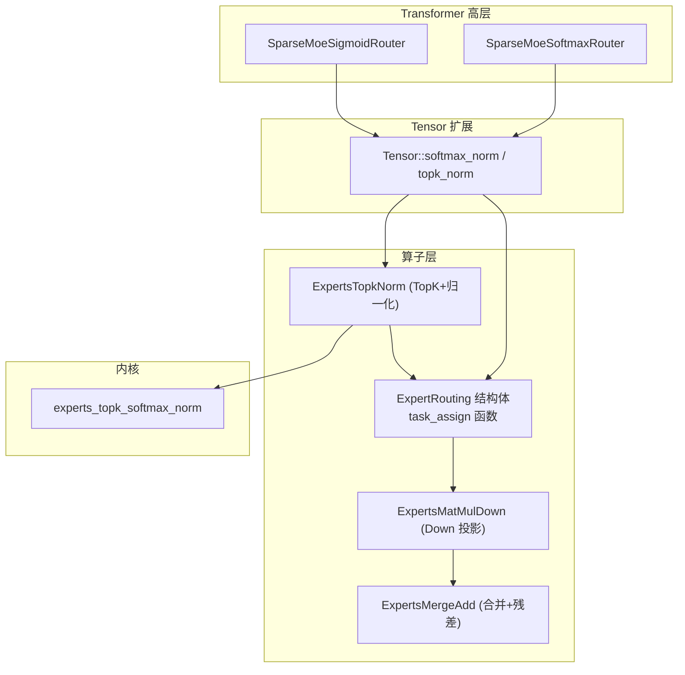
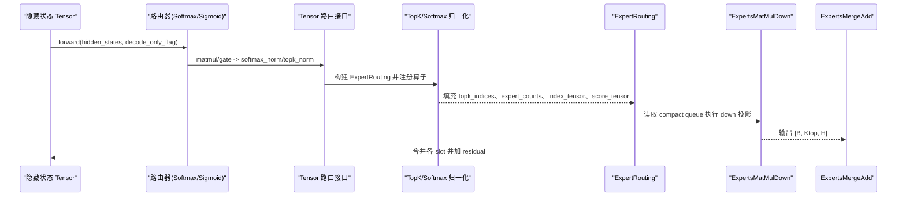
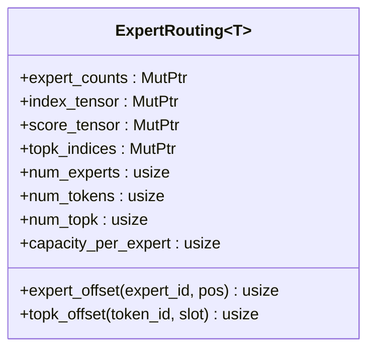
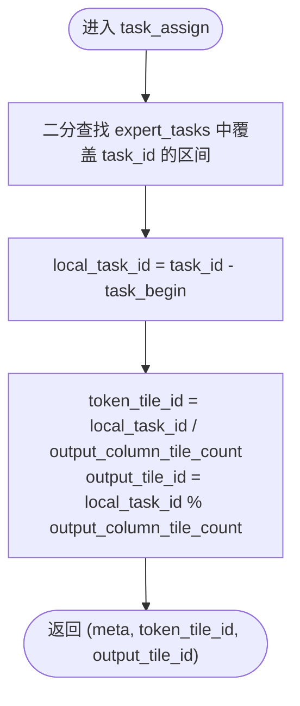
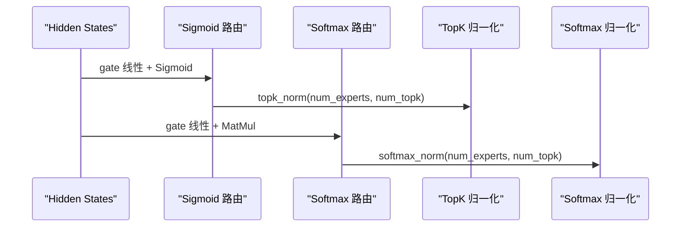
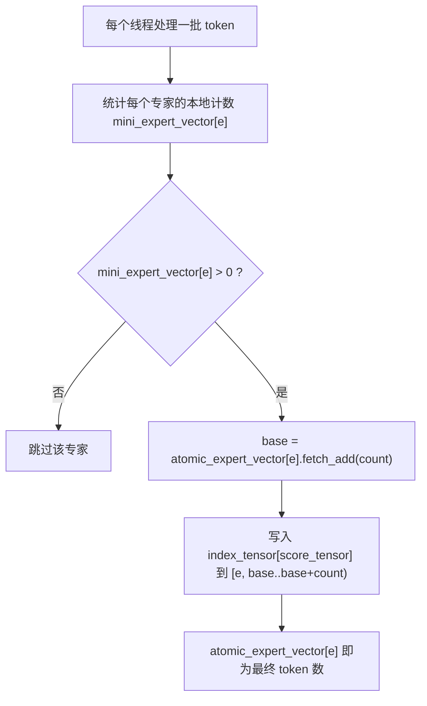
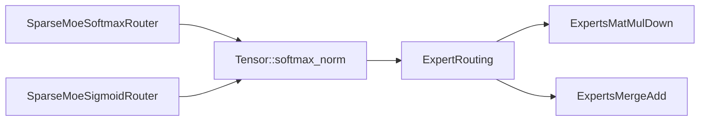

# 专家路由算法

<cite>
**本文引用的文件列表**
- [expert_routing.rs](file://src/operators/expert/expert_routing.rs)
- [moe.rs](file://src/tensor/moe.rs)
- [router_softmax.rs](file://src/transformer/sparse_moe/router_softmax.rs)
- [router_sigmoid.rs](file://src/transformer/sparse_moe/router_sigmoid.rs)
- [expert_topk_norm.rs](file://src/operators/expert/expert_topk_norm.rs)
- [experts_topk_softmax_norm.rs](file://src/kernel/scalar/experts_topk_softmax_norm.rs)
- [expert_matmul_mul.rs](file://src/operators/expert/expert_matmul_mul.rs)
- [expert_merge_add.rs](file://src/operators/expert/expert_merge_add.rs)
- [tests.rs](file://src/transformer/sparse_moe/tests.rs)
- [moe_routing_data_structures.md](file://docs/design/transformers/moe_routing_data_structures.md)
</cite>

## 目录
1. [简介](#简介)
2. [项目结构](#项目结构)
3. [核心组件](#核心组件)
4. [架构总览](#架构总览)
5. [详细组件分析](#详细组件分析)
6. [依赖关系分析](#依赖关系分析)
7. [性能与内存访问模式](#性能与内存访问模式)
8. [容量限制与负载均衡](#容量限制与负载均衡)
9. [测试与调试指南](#测试与调试指南)
10. [结论](#结论)

## 简介
本技术文档聚焦于 MoE（Mixture of Experts）中的“专家路由”子系统，围绕 ExpertRouting 数据结构、任务分配函数 task_assign、稀疏/密集两种路由模式的差异、容量限制与负载均衡策略、以及性能优化与内存访问模式进行深入解析。同时提供可复现的测试用例与调试方法，帮助读者快速理解并高效使用该系统。

## 项目结构
与专家路由相关的代码主要分布在以下模块：
- 算子层：路由结果结构与任务分配逻辑位于 operators/expert；TopK/Softmax 路由核位于 kernel/scalar；Down/Merge 等下游算子位于 operators/expert。
- Tensor 扩展：在 tensor/moe.rs 中为 Tensor 增加 softmax_norm/topk_norm 等路由相关接口，负责构造 ExpertRouting 并注册 Operator。
- Transformer 高层：sparse_moe 下实现 Softmax/Sigmoid 两类路由器，分别调用 Tensor 的路由接口产出 ExpertRouting。
- 设计文档：docs/design/transformers/moe_routing_data_structures.md 对路由数据结构的演进与新旧映射做了详细说明。

图表来源
- [router_softmax.rs:57-83](file://src/transformer/sparse_moe/router_softmax.rs#L57-L83)
- [router_sigmoid.rs:57-76](file://src/transformer/sparse_moe/router_sigmoid.rs#L57-L76)
- [moe.rs:155-244](file://src/tensor/moe.rs#L155-L244)
- [expert_routing.rs:24-65](file://src/operators/expert/expert_routing.rs#L24-L65)
- [expert_topk_norm.rs:53-103](file://src/operators/expert/expert_topk_norm.rs#L53-L103)
- [experts_topk_softmax_norm.rs:5-59](file://src/kernel/scalar/experts_topk_softmax_norm.rs#L5-L59)
- [expert_matmul_mul.rs:399-578](file://src/operators/expert/expert_matmul_mul.rs#L399-L578)
- [expert_merge_add.rs:90-149](file://src/operators/expert/expert_merge_add.rs#L90-L149)

章节来源
- [moe_routing_data_structures.md:1-767](file://docs/design/transformers/moe_routing_data_structures.md#L1-L767)

## 核心组件
- ExpertRouting<T>：集中保存路由阶段产出的关键缓冲与元信息，包括每专家计数、紧凑 token 队列、对应分数、每个 token 的 top-k 专家索引等。
- task_assign(expert_tasks, output_column_tile_count, task_id)：将全局任务 ID 映射到具体 expert 及其内部局部矩阵 tile，用于并行调度。
- 路由模式：
  - 稀疏路由（Sigmoid + TopK）：先通过 gate 线性变换与 Sigmoid，再取 top-k 并做归一化，适合选择少数强相关专家的场景。
  - 密集路由（Softmax）：对所有专家打分后做 softmax，再取 top-k 并归一化，适合需要更均衡分布或全专家参与的场景。
- 容量限制：capacity_per_expert 控制每个专家最大容纳的 token 数，当前默认按 num_tokens * num_topk 保守分配。
- 负载均衡：通过原子计数器 atomic_expert_vector（即 expert_counts）进行无锁写入，避免频繁冲突；后续可通过前缀和或阈值重排进一步优化。

章节来源
- [expert_routing.rs:43-65](file://src/operators/expert/expert_routing.rs#L43-L65)
- [expert_routing.rs:24-41](file://src/operators/expert/expert_routing.rs#L24-L41)
- [moe.rs:246-288](file://src/tensor/moe.rs#L246-L288)
- [moe_routing_data_structures.md:151-332](file://docs/design/transformers/moe_routing_data_structures.md#L151-L332)

## 架构总览
下图展示了从输入 hidden_states 到最终输出的一条完整 MoE 路径，包含路由、专家计算与合并三个阶段。

图表来源
- [router_softmax.rs:57-83](file://src/transformer/sparse_moe/router_softmax.rs#L57-L83)
- [router_sigmoid.rs:57-76](file://src/transformer/sparse_moe/router_sigmoid.rs#L57-L76)
- [moe.rs:155-244](file://src/tensor/moe.rs#L155-L244)
- [expert_topk_norm.rs:53-103](file://src/operators/expert/expert_topk_norm.rs#L53-L103)
- [expert_matmul_mul.rs:399-578](file://src/operators/expert/expert_matmul_mul.rs#L399-L578)
- [expert_merge_add.rs:90-149](file://src/operators/expert/expert_merge_add.rs#L90-L149)

## 详细组件分析

### ExpertRouting 结构体设计与内存布局
- 字段说明
  - expert_counts：每专家已分配的 token 数量（AtomicUsize），用于并发安全地写入紧凑队列。
  - index_tensor：[num_experts × capacity_per_expert]，存储被路由到该专家的 token id。
  - score_tensor：与 index_tensor 对齐，存储对应 token 的路由权重。
  - topk_indices：[num_tokens × num_topk]，记录每个 token 选择的 top-k 专家 id。
  - num_experts、num_tokens、num_topk、capacity_per_expert：维度与容量元信息。
- 内存布局要点
  - 专家主序紧凑队列：index_tensor 与 score_tensor 以专家为第一维，便于下游直接顺序遍历专家内的 token。
  - capacity_per_expert 保守设置为 num_tokens × num_topk，保证最坏情况下不溢出。
- 辅助偏移计算
  - expert_offset(expert_id, pos)：定位专家 e 的第 pos 个条目。
  - topk_offset(token_id, slot)：定位 token 的第 k 个专家槽位。

图表来源
- [expert_routing.rs:43-65](file://src/operators/expert/expert_routing.rs#L43-L65)

章节来源
- [expert_routing.rs:43-65](file://src/operators/expert/expert_routing.rs#L43-L65)
- [moe.rs:246-288](file://src/tensor/moe.rs#L246-L288)
- [moe_routing_data_structures.md:186-332](file://docs/design/transformers/moe_routing_data_structures.md#L186-L332)

### 任务分配机制 task_assign
- 输入
  - expert_tasks：按 expert 切分的任务元信息数组，每个元素包含 expert_id、token_begin、sequence_length、task_begin、task_end。
  - output_column_tile_count：输出列方向上的 tile 数量。
  - task_id：全局任务编号。
- 过程
  - 使用 partition_point 找到 task_id 所属的 expert 区间。
  - 计算 local_task_id = task_id - task_begin。
  - 返回 (expert_meta, token_tile_id, output_tile_id)，其中 token_tile_id = local_task_id / output_column_tile_count，output_tile_id = local_task_id % output_column_tile_count。
- 作用
  - 将全局任务空间均匀分配到不同 expert 与其内部的 token 块与输出列块，形成细粒度并行单元。

图表来源
- [expert_routing.rs:24-41](file://src/operators/expert/expert_routing.rs#L24-L41)

章节来源
- [expert_routing.rs:24-41](file://src/operators/expert/expert_routing.rs#L24-L41)
- [expert_matmul_mul.rs:313-397](file://src/operators/expert/expert_matmul_mul.rs#L313-L397)

### 稀疏路由 vs 密集路由
- 稀疏路由（Sigmoid + TopK）
  - 流程：hidden_states → gate 线性变换 → Sigmoid → topk_norm（TopK 选择 + 归一化）。
  - 特点：仅激活少量专家，吞吐高，适合长尾分布或低资源场景。
  - 实现位置：SparseMoeSigmoidRouter.forward 调用 Tensor::sigmoid_gate 与 topk_norm。
- 密集路由（Softmax）
  - 流程：hidden_states → gate 线性变换 → softmax_norm（Softmax + TopK 选择 + 归一化）。
  - 特点：概率分布更平滑，可能提升模型表达能力，但计算开销更大。
  - 实现位置：SparseMoeSoftmaxRouter.forward 调用 Tensor::matmul 与 softmax_norm。
- 适用场景建议
  - 推理时若追求延迟与吞吐，优先稀疏路由；训练或需要更强表达时使用密集路由。

图表来源
- [router_sigmoid.rs:57-76](file://src/transformer/sparse_moe/router_sigmoid.rs#L57-L76)
- [router_softmax.rs:57-83](file://src/transformer/sparse_moe/router_softmax.rs#L57-L83)
- [moe.rs:178-244](file://src/tensor/moe.rs#L178-L244)

章节来源
- [router_sigmoid.rs:57-76](file://src/transformer/sparse_moe/router_sigmoid.rs#L57-L76)
- [router_softmax.rs:57-83](file://src/transformer/sparse_moe/router_softmax.rs#L57-L83)
- [moe.rs:155-244](file://src/tensor/moe.rs#L155-L244)

### 容量限制与负载均衡
- 容量限制
  - capacity_per_expert 初始设为 num_tokens × num_topk，确保任何 token 的所有 top-k 专家都能写入而不越界。
  - 写入时使用 expert_offset 计算目标位置，并通过 debug_assert 检查不超过容量。
- 负载均衡
  - 使用 AtomicUsize 作为 per-expert 计数器，线程内先计算本地计数，再通过 fetch_add 一次性申请全局起始位置，减少原子操作次数。
  - 后续可引入前缀和或动态重排，使负载更均衡，降低热点专家压力。

图表来源
- [moe_routing_data_structures.md:421-498](file://docs/design/transformers/moe_routing_data_structures.md#L421-L498)
- [expert_topk_norm.rs:89-101](file://src/operators/expert/expert_topk_norm.rs#L89-L101)

章节来源
- [moe.rs:246-288](file://src/tensor/moe.rs#L246-L288)
- [expert_topk_norm.rs:89-101](file://src/operators/expert/expert_topk_norm.rs#L89-L101)
- [moe_routing_data_structures.md:421-498](file://docs/design/transformers/moe_routing_data_structures.md#L421-L498)

### 路由性能优化技巧与内存访问模式
- 预打包权重面板
  - 在 new() 中将 down 权重按 reduction_block_cols × micro_tile_cols 的面板打包，run() 只读，提高缓存命中。
- 微内核分块
  - 采用 micro_tile_rows=3、micro_tile_cols=32 的微内核，结合 AVX-512 FP16 加速路径，最大化吞吐。
- 线程私有池
  - a_tile_pool、acc_pool、idx_buf_pool、task_meta_pool、routed_*_pool 等均为每线程私有，避免竞争与重复分配。
- 紧凑队列顺序访问
  - 下游直接顺序读取 index_tensor/score_tensor，避免扫描 dense bool 矩阵，显著减少访存与分支。
- 任务空间构建
  - build_task_space 在每个线程内构建 expert_tasks 与 routed 缓冲，减少跨线程同步。

章节来源
- [expert_matmul_mul.rs:103-197](file://src/operators/expert/expert_matmul_mul.rs#L103-L197)
- [expert_matmul_mul.rs:210-275](file://src/operators/expert/expert_matmul_mul.rs#L210-L275)
- [expert_matmul_mul.rs:313-397](file://src/operators/expert/expert_matmul_mul.rs#L313-L397)
- [expert_matmul_mul.rs:399-578](file://src/operators/expert/expert_matmul_mul.rs#L399-L578)

## 依赖关系分析
- 高层路由器依赖 Tensor 扩展接口完成评分与路由。
- Tensor 扩展负责分配 ExpertRouting 缓冲并注册 Operators。
- 路由算子（TopK/Softmax）写入 ExpertRouting 的核心缓冲。
- 下游算子（Down/Merge）消费 ExpertRouting 的紧凑队列与 top-k 索引。

图表来源
- [router_softmax.rs:57-83](file://src/transformer/sparse_moe/router_softmax.rs#L57-L83)
- [router_sigmoid.rs:57-76](file://src/transformer/sparse_moe/router_sigmoid.rs#L57-L76)
- [moe.rs:155-244](file://src/tensor/moe.rs#L155-L244)
- [expert_matmul_mul.rs:399-578](file://src/operators/expert/expert_matmul_mul.rs#L399-L578)
- [expert_merge_add.rs:90-149](file://src/operators/expert/expert_merge_add.rs#L90-L149)

章节来源
- [router_softmax.rs:57-83](file://src/transformer/sparse_moe/router_softmax.rs#L57-L83)
- [router_sigmoid.rs:57-76](file://src/transformer/sparse_moe/router_sigmoid.rs#L57-L76)
- [moe.rs:155-244](file://src/tensor/moe.rs#L155-L244)

## 性能与内存访问模式
- 路由阶段
  - 使用线程本地 mini 缓冲聚合后再批量写回全局缓冲，降低原子操作频率。
  - 紧凑队列顺序写入，利于预取与缓存复用。
- 专家计算阶段
  - 按 expert 顺序拉取 token 队列，配合预打包权重面板，减少随机访存。
  - 微内核分块与 SIMD 特化路径显著提升吞吐。
- 合并阶段
  - 逐 token 累加所有 top-k 专家输出，SIMD 向量化加法路径。

章节来源
- [moe_routing_data_structures.md:579-660](file://docs/design/transformers/moe_routing_data_structures.md#L579-L660)
- [expert_matmul_mul.rs:210-275](file://src/operators/expert/expert_matmul_mul.rs#L210-L275)
- [expert_merge_add.rs:173-186](file://src/operators/expert/expert_merge_add.rs#L173-L186)

## 容量限制与负载均衡
- 容量上限
  - capacity_per_expert 保守设置，避免溢出；实际有效长度由 expert_counts 控制。
- 负载均衡策略
  - 原子计数器 + 批量写入，减少争用。
  - 未来可引入基于 expert_counts 的动态重排或阈值截断，抑制热点专家。
- 边界检查
  - 写入前使用 debug_assert 校验 pos < capacity_per_expert，保障健壮性。

章节来源
- [expert_topk_norm.rs:89-101](file://src/operators/expert/expert_topk_norm.rs#L89-L101)
- [moe.rs:246-288](file://src/tensor/moe.rs#L246-L288)
- [moe_routing_data_structures.md:661-728](file://docs/design/transformers/moe_routing_data_structures.md#L661-L728)

## 测试与调试指南
- 端到端队列结构验证
  - 验证 MoE 前向过程中算子队列的顺序与类型是否符合预期（MatMul/Gate → ExpertsSoftmaxNorm/ExpertsTopkNorm → ExpertsMatMulSilu → ExpertsMatMulDown → ExpertsMergeAdd）。
- 单线程与多线程一致性
  - 对比单线程与多线程运行结果的位级一致性，确保并行正确性。
- 零权重退化测试
  - 当权重为零时，MoE 输出应等于 residual，验证合并路径的正确性。
- 路由构造工具
  - 使用 routing_from_dense 与 empty_routing 构造测试数据，便于隔离路由与计算阶段的验证。
- 调试建议
  - 打印 expert_counts 与 index_tensor 的有效长度，确认紧凑队列是否正确构建。
  - 检查 topk_indices 与 routed_slots 的对应关系，确保输出 slot 解析无误。

章节来源
- [tests.rs:92-216](file://src/transformer/sparse_moe/tests.rs#L92-L216)
- [expert_routing.rs:67-125](file://src/operators/expert/expert_routing.rs#L67-L125)
- [expert_routing.rs:127-167](file://src/operators/expert/expert_routing.rs#L127-L167)

## 结论
本系统通过紧凑专家队列与原子计数器的组合，实现了高效且可扩展的专家路由与计算流水线。task_assign 提供了细粒度的任务划分能力，支持多核并行；稀疏与密集两种路由模式满足不同场景需求。通过预打包权重、微内核分块与 SIMD 特化，系统在内存访问与计算吞吐上均取得良好表现。未来可在负载均衡与容量管理上进行进一步优化，如动态重排与阈值控制，以提升极端负载下的稳定性与效率。