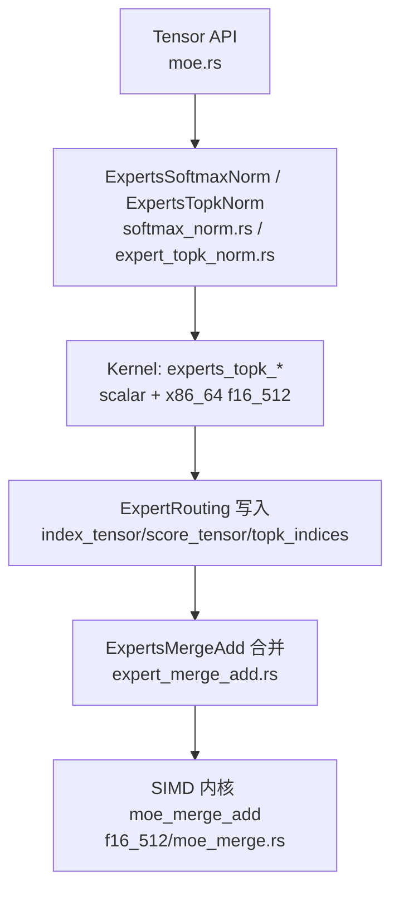
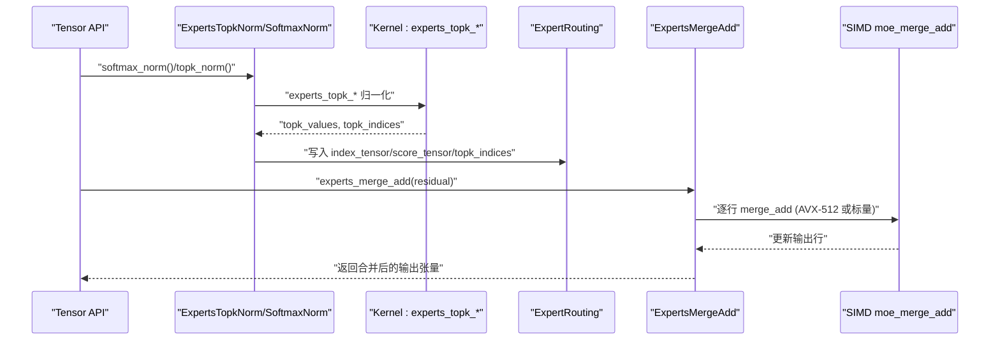
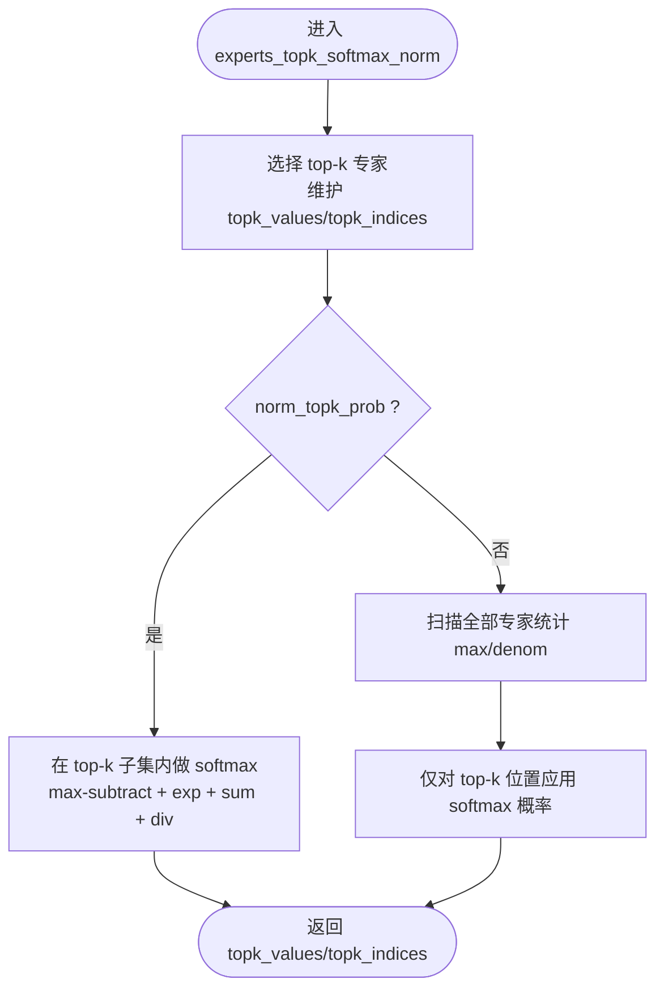
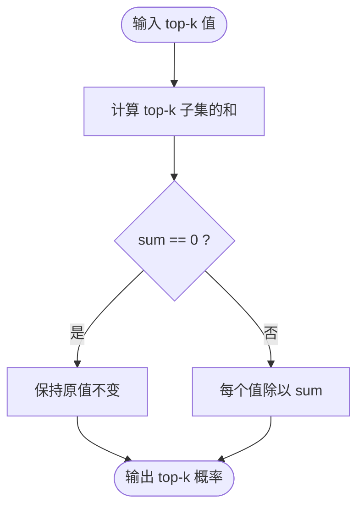
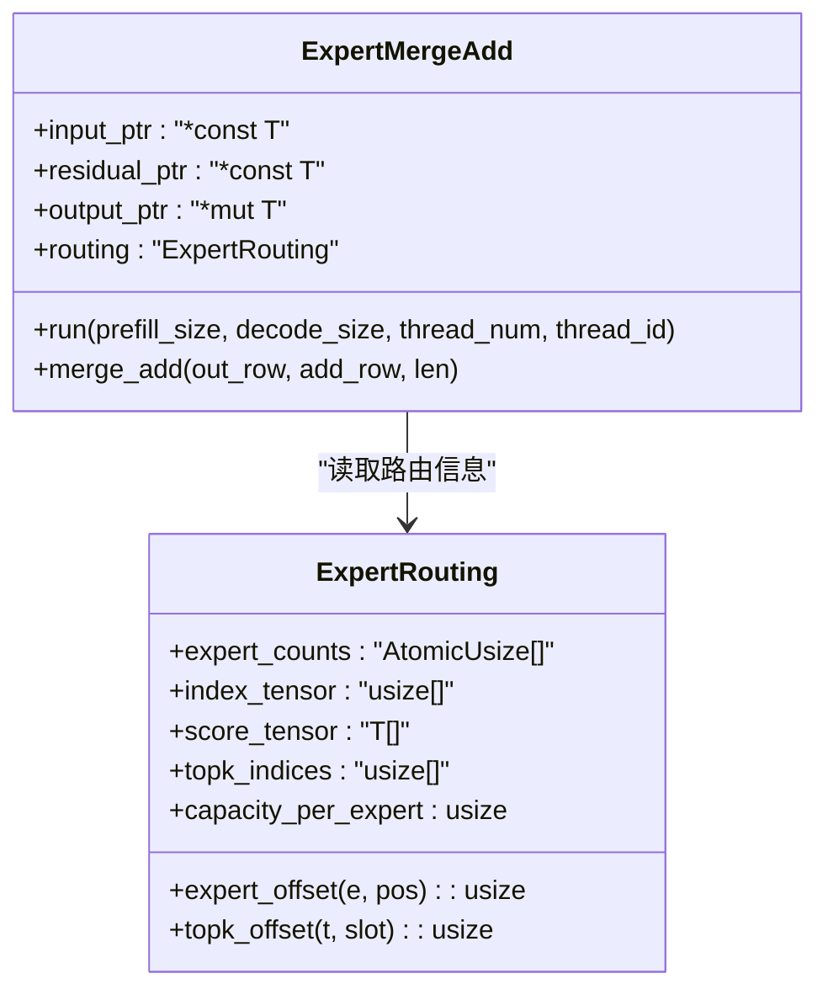
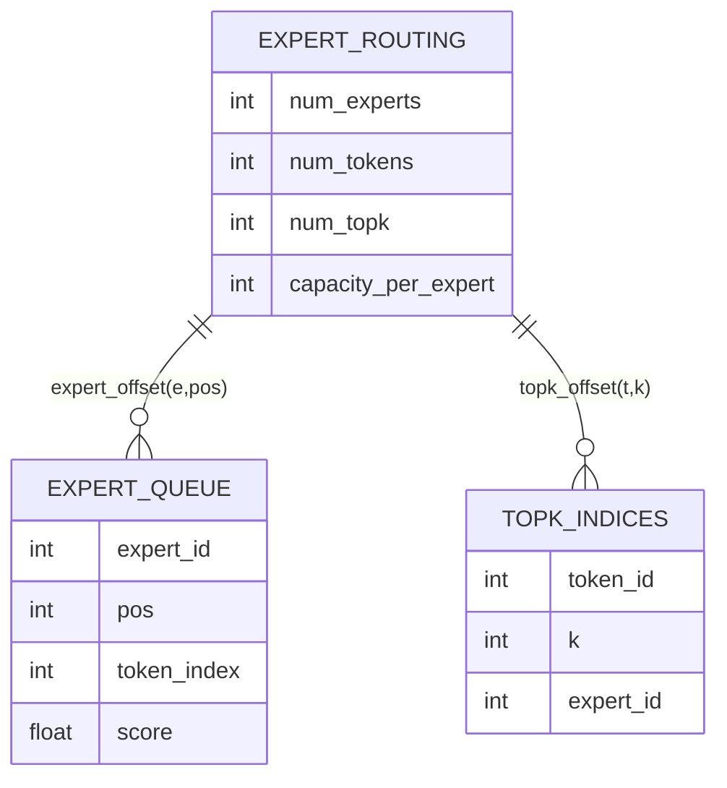
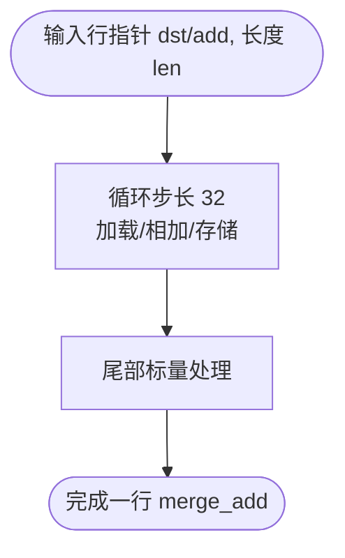
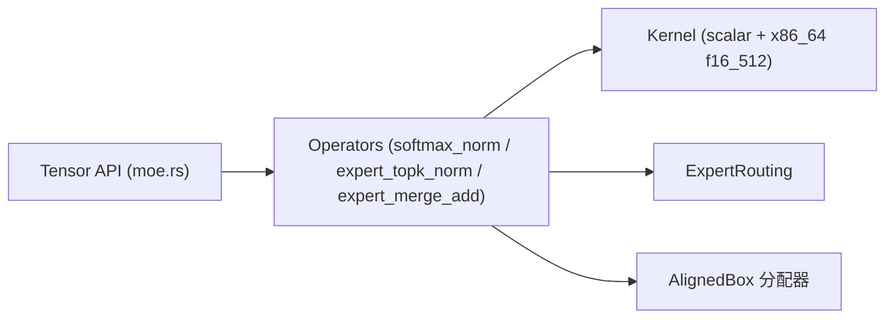

# 结果合并与归一化

<cite>
**本文引用的文件**   
- [src/operators/expert/expert_merge_add.rs](file://src/operators/expert/expert_merge_add.rs)
- [src/kernel/x86_64/f16_512/moe_merge.rs](file://src/kernel/x86_64/f16_512/moe_merge.rs)
- [src/tensor/moe.rs](file://src/tensor/moe.rs)
- [src/operators/expert/expert_topk_norm.rs](file://src/operators/expert/expert_topk_norm.rs)
- [src/kernel/scalar/experts_topk_norm.rs](file://src/kernel/scalar/experts_topk_norm.rs)
- [src/kernel/scalar/experts_topk_softmax_norm.rs](file://src/kernel/scalar/experts_topk_softmax_norm.rs)
- [src/kernel/x86_64/f16_512/experts_topk_softmax_norm.rs](file://src/kernel/x86_64/f16_512/experts_topk_softmax_norm.rs)
- [src/operators/softmax/softmax_norm.rs](file://src/operators/softmax/softmax_norm.rs)
- [src/operators/expert/expert_routing.rs](file://src/operators/expert/expert_routing.rs)
- [docs/design/transformers/moe_routing_data_structures.md](file://docs/design/transformers/moe_routing_data_structures.md)
- [src/mem_mgr/allocator.rs](file://src/mem_mgr/allocator.rs)
- [README.md](file://README.md)
</cite>

## 目录
1. [简介](#简介)
2. [项目结构](#项目结构)
3. [核心组件](#核心组件)
4. [架构总览](#架构总览)
5. [详细组件分析](#详细组件分析)
6. [依赖关系分析](#依赖关系分析)
7. [性能考量](#性能考量)
8. [故障排查指南](#故障排查指南)
9. [结论](#结论)
10. [附录](#附录)

## 简介
本技术文档聚焦于 MoE（Mixture of Experts）中“专家输出合并”和“Top-K 归一化”的实现细节与工程优化。内容覆盖：
- 多个专家输出的合并策略：加权求和与直接相加的差异、内存布局与数据流
- Top-K 归一化算法：Softmax 归一化与分数缩放的技术要点
- 负载均衡对合并结果的影响及优化策略
- 数值精度控制与溢出防护
- 合并性能分析与内存使用优化技巧
- 不同归一化方法的对比与选择建议

## 项目结构
围绕“路由—归一化—专家计算—合并”的流水线，关键代码分布在以下模块：
- 路由与拓扑：ExpertRouting 数据结构与分配
- 归一化：Top-K 选择与权重归一化（Softmax/线性归一化）
- 合并：按 token 聚合 top-k 专家输出并叠加残差
- 内核加速：AVX-512 FP16 向量路径与标量回退

图表来源
- [src/tensor/moe.rs](file://src/tensor/moe.rs)
- [src/operators/softmax/softmax_norm.rs](file://src/operators/softmax/softmax_norm.rs)
- [src/operators/expert/expert_topk_norm.rs](file://src/operators/expert/expert_topk_norm.rs)
- [src/kernel/scalar/experts_topk_softmax_norm.rs](file://src/kernel/scalar/experts_topk_softmax_norm.rs)
- [src/kernel/x86_64/f16_512/experts_topk_softmax_norm.rs](file://src/kernel/x86_64/f16_512/experts_topk_softmax_norm.rs)
- [src/operators/expert/expert_merge_add.rs](file://src/operators/expert/expert_merge_add.rs)
- [src/kernel/x86_64/f16_512/moe_merge.rs](file://src/kernel/x86_64/f16_512/moe_merge.rs)

章节来源
- [src/tensor/moe.rs](file://src/tensor/moe.rs)
- [src/operators/expert/expert_routing.rs](file://src/operators/expert/expert_routing.rs)
- [docs/design/transformers/moe_routing_data_structures.md](file://docs/design/transformers/moe_routing_data_structures.md)

## 核心组件
- ExpertRouting：集中管理路由计数、紧凑队列（index_tensor/score_tensor）以及每 token 的 top-k 索引
- ExpertsTopkNorm / ExpertsSoftmaxNorm：完成 Top-K 选择与权重归一化，并将结果写入 ExpertRouting
- ExpertsMergeAdd：将每个 token 的 top-k 专家输出累加到残差上，得到最终输出
- SIMD 内核：针对 f16 的 AVX-512 向量加法与 Top-K Softmax 实现

章节来源
- [src/operators/expert/expert_routing.rs](file://src/operators/expert/expert_routing.rs)
- [src/operators/expert/expert_topk_norm.rs](file://src/operators/expert/expert_topk_norm.rs)
- [src/operators/softmax/softmax_norm.rs](file://src/operators/softmax/softmax_norm.rs)
- [src/operators/expert/expert_merge_add.rs](file://src/operators/expert/expert_merge_add.rs)

## 架构总览
下图展示了从路由到合并的关键调用链与数据流向。

图表来源
- [src/tensor/moe.rs](file://src/tensor/moe.rs)
- [src/operators/expert/expert_topk_norm.rs](file://src/operators/expert/expert_topk_norm.rs)
- [src/operators/softmax/softmax_norm.rs](file://src/operators/softmax/softmax_norm.rs)
- [src/operators/expert/expert_merge_add.rs](file://src/operators/expert/expert_merge_add.rs)
- [src/kernel/x86_64/f16_512/moe_merge.rs](file://src/kernel/x86_64/f16_512/moe_merge.rs)

## 详细组件分析

### 组件A：Top-K 归一化（Softmax 与线性归一化）
- 目标：为每个 token 选出 top-k 专家，并生成可用于合并的权重
- 两种模式：
  - norm_topk_prob=true：仅在选出的 top-k 子集上做 softmax，避免全量 exp 求和，减少热点路径开销
  - norm_topk_prob=false：在全量专家上做 softmax，再取 top-k 的概率值
- 数值稳定性：通过减去最大值进行稳定化，避免 exp 溢出；在 f16 路径中对输入范围做钳制，防止中间结果溢出

图表来源
- [src/kernel/scalar/experts_topk_softmax_norm.rs](file://src/kernel/scalar/experts_topk_softmax_norm.rs)
- [src/kernel/x86_64/f16_512/experts_topk_softmax_norm.rs](file://src/kernel/x86_64/f16_512/experts_topk_softmax_norm.rs)

章节来源
- [src/kernel/scalar/experts_topk_softmax_norm.rs](file://src/kernel/scalar/experts_topk_softmax_norm.rs)
- [src/kernel/x86_64/f16_512/experts_topk_softmax_norm.rs](file://src/kernel/x86_64/f16_512/experts_topk_softmax_norm.rs)
- [src/operators/softmax/softmax_norm.rs](file://src/operators/softmax/softmax_norm.rs)

### 组件B：Top-K 线性归一化（非 softmax）
- 目标：在 top-k 子集内进行简单的 L1 归一化（各值除以子集和），适用于不需要指数变换的场景
- 特点：计算更轻量，适合对数值稳定性要求较低且追求吞吐的路径

图表来源
- [src/kernel/scalar/experts_topk_norm.rs](file://src/kernel/scalar/experts_topk_norm.rs)

章节来源
- [src/kernel/scalar/experts_topk_norm.rs](file://src/kernel/scalar/experts_topk_norm.rs)

### 组件C：专家输出合并（加权求和 vs 直接相加）
- 加权求和：在路由阶段已生成权重（如 softmax 概率），合并时以权重乘以专家输出后再累加
- 直接相加：若权重为 1 或未显式加权，则直接将 top-k 专家输出相加，再叠加残差
- 内存布局：
  - 输入：[num_tokens, K, H]（K=top-k，H=hidden_size）
  - 残差：[num_tokens, H]
  - 输出：[num_tokens, H]
- 线程划分：按 token 行切分，每个线程处理一部分 token，避免竞争

图表来源
- [src/operators/expert/expert_merge_add.rs](file://src/operators/expert/expert_merge_add.rs)
- [src/operators/expert/expert_routing.rs](file://src/operators/expert/expert_routing.rs)

章节来源
- [src/operators/expert/expert_merge_add.rs](file://src/operators/expert/expert_merge_add.rs)
- [src/operators/expert/expert_routing.rs](file://src/operators/expert/expert_routing.rs)

### 组件D：路由数据结构与紧凑队列
- 旧结构问题：dense 矩阵导致大量无效扫描与重复构建 token 列表
- 新结构：专家主序的紧凑队列，原子计数 + 预分配容量，避免二次扫描
- 字段说明：
  - expert_counts：每专家的 token 数（原子）
  - index_tensor：专家队列中的 token 索引
  - score_tensor：对应位置的权重
  - topk_indices：每 token 的 top-k 专家 ID

图表来源
- [src/operators/expert/expert_routing.rs](file://src/operators/expert/expert_routing.rs)
- [docs/design/transformers/moe_routing_data_structures.md](file://docs/design/transformers/moe_routing_data_structures.md)

章节来源
- [src/operators/expert/expert_routing.rs](file://src/operators/expert/expert_routing.rs)
- [docs/design/transformers/moe_routing_data_structures.md](file://docs/design/transformers/moe_routing_data_structures.md)

### 组件E：SIMD 加速与数值稳定性
- 合并内核：AVX-512 FP16 向量加法，按 32 元素向量化，尾部标量补齐
- Softmax 内核：f16 路径对 exp 输入做范围钳制，避免溢出；采用 max-subtract 稳定化

图表来源
- [src/kernel/x86_64/f16_512/moe_merge.rs](file://src/kernel/x86_64/f16_512/moe_merge.rs)

章节来源
- [src/kernel/x86_64/f16_512/moe_merge.rs](file://src/kernel/x86_64/f16_512/moe_merge.rs)

## 依赖关系分析
- Tensor API 层负责编排算子与内存分配
- 路由与归一化算子依赖 kernel 层的 scalar 与 x86_64 特化实现
- 合并算子依赖 ExpertRouting 提供的紧凑队列与原子计数
- 对齐分配器用于保证 SIMD 友好的内存布局

图表来源
- [src/tensor/moe.rs](file://src/tensor/moe.rs)
- [src/operators/softmax/softmax_norm.rs](file://src/operators/softmax/softmax_norm.rs)
- [src/operators/expert/expert_topk_norm.rs](file://src/operators/expert/expert_topk_norm.rs)
- [src/operators/expert/expert_merge_add.rs](file://src/operators/expert/expert_merge_add.rs)
- [src/mem_mgr/allocator.rs](file://src/mem_mgr/allocator.rs)

章节来源
- [src/tensor/moe.rs](file://src/tensor/moe.rs)
- [src/mem_mgr/allocator.rs](file://src/mem_mgr/allocator.rs)

## 性能考量
- 合并路径
  - 向量宽度：f16 下每次处理 32 个元素，显著降低访存与指令开销
  - 线程并行：按 token 行切分，避免写冲突；必要时重置路由计数
- 归一化路径
  - 仅在 top-k 子集做 softmax 可避免全量 exp 与求和，提升吞吐
  - 全量 softmax 场景需一次全局扫描统计 max/denom，但能保持概率一致性
- 内存布局
  - 专家主序紧凑队列减少二次扫描与重建 token 列表的开销
  - 对齐分配确保 SIMD 高效加载/存储
- 负载不均衡
  - 单 CPU 服务器避免跨设备通信与 GPU 上的小批负载不均衡问题
  - 通过合理设置 capacity_per_expert 与路由策略缓解热点专家

章节来源
- [src/operators/expert/expert_merge_add.rs](file://src/operators/expert/expert_merge_add.rs)
- [src/kernel/x86_64/f16_512/moe_merge.rs](file://src/kernel/x86_64/f16_512/moe_merge.rs)
- [src/kernel/scalar/experts_topk_softmax_norm.rs](file://src/kernel/scalar/experts_topk_softmax_norm.rs)
- [docs/design/transformers/moe_routing_data_structures.md](file://docs/design/transformers/moe_routing_data_structures.md)
- [README.md](file://README.md)

## 故障排查指南
- 路由计数未清零
  - 现象：多次 run 后 expert_counts 不为零，导致越界或重复写入
  - 定位：检查 ExpertMergeAdd.run 是否在执行前重置计数
- 越界断言失败
  - 现象：pos < capacity_per_expert 断言失败
  - 定位：确认 capacity_per_expert 是否足够（通常为 num_tokens * num_topk）
- 数值异常
  - 现象：NaN/Inf 出现在 softmax 或合并结果
  - 定位：检查 exp 输入范围钳制与 max-subtract 是否正确执行
- 对齐与 SIMD
  - 现象：在非 AVX-512FP16 平台退化到标量路径，性能下降
  - 定位：确认目标特性检测与分支逻辑

章节来源
- [src/operators/expert/expert_merge_add.rs](file://src/operators/expert/expert_merge_add.rs)
- [src/operators/expert/expert_topk_norm.rs](file://src/operators/expert/expert_topk_norm.rs)
- [src/kernel/x86_64/f16_512/experts_topk_softmax_norm.rs](file://src/kernel/x86_64/f16_512/experts_topk_softmax_norm.rs)

## 结论
- 合并策略应优先采用“权重×专家输出”的加权求和，以保证与路由概率一致；当权重恒为 1 时可直接相加
- Top-K 归一化建议在 top-k 子集内做 softmax，兼顾数值稳定与性能；需要严格全局概率时使用全量 softmax
- 紧凑队列与原子计数有效缓解负载不均衡带来的额外开销
- 对齐分配与 SIMD 内核显著提升合并吞吐；注意 f16 的数值范围与溢出防护

## 附录
- 不同归一化方法的选择建议
  - 需要严格概率解释：全量 softmax（norm_topk_prob=false）
  - 追求吞吐与局部一致性：子集 softmax（norm_topk_prob=true）
  - 无需指数变换：线性归一化（L1 归一化）
- 实验与对比
  - 可通过单元测试与基准测试验证不同模式的数值误差与性能差异
  - 关注不同 batch/token/expert 规模下的缓存命中与向量利用率