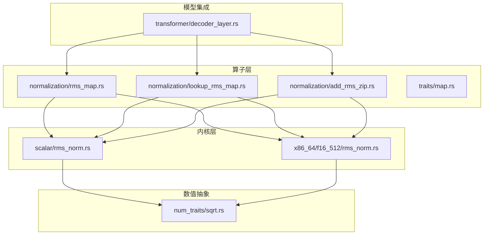
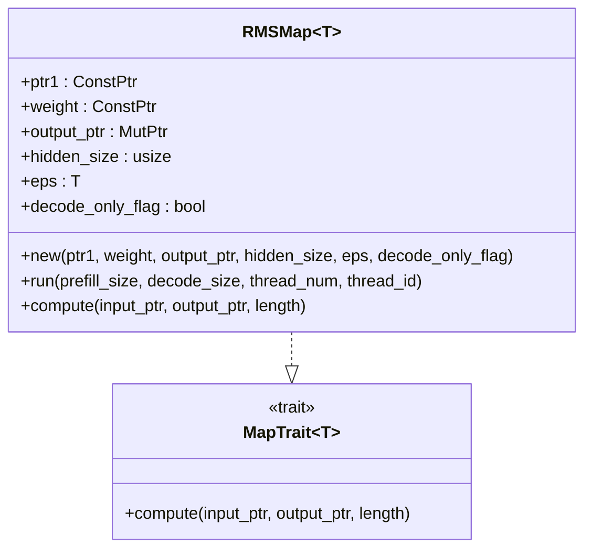
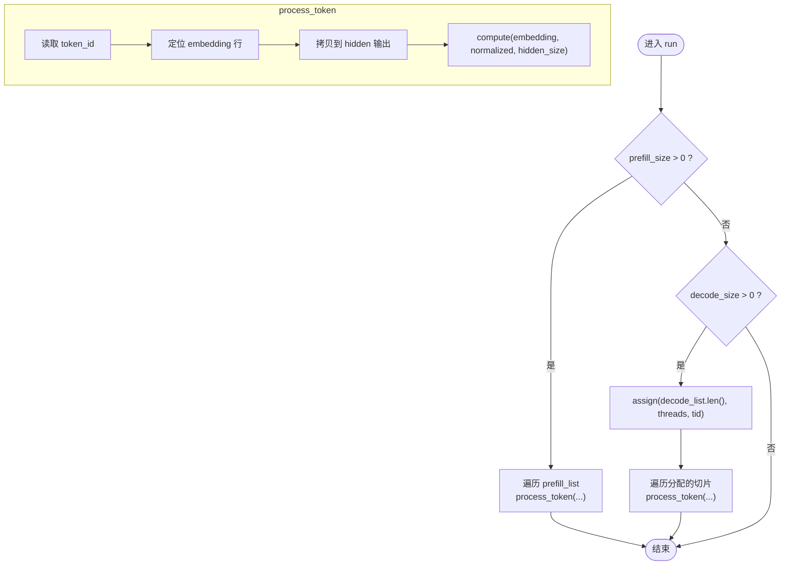
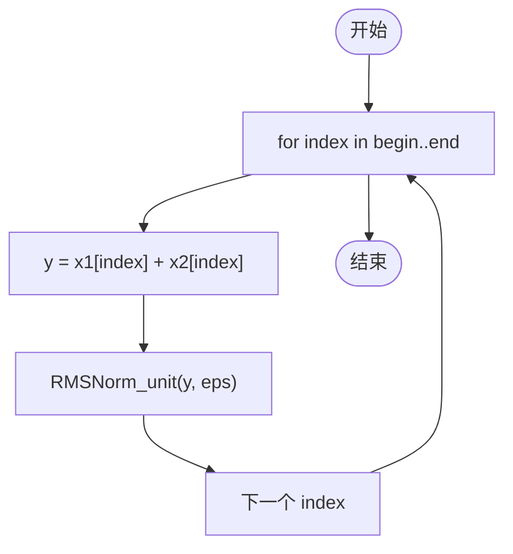
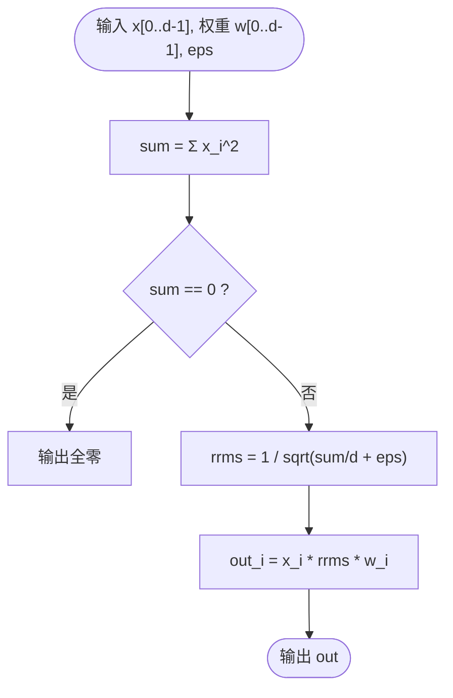
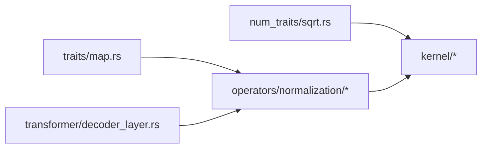

# 归一化算子

<cite>
**本文引用的文件列表**
- [src/kernel/scalar/rms_norm.rs](file://src/kernel/scalar/rms_norm.rs)
- [src/kernel/x86_64/f16_512/rms_norm.rs](file://src/kernel/x86_64/f16_512/rms_norm.rs)
- [src/operators/normalization/rms_map.rs](file://src/operators/normalization/rms_map.rs)
- [src/operators/normalization/lookup_rms_map.rs](file://src/operators/normalization/lookup_rms_map.rs)
- [src/operators/normalization/add_rms_zip.rs](file://src/operators/normalization/add_rms_zip.rs)
- [src/operators/traits/map.rs](file://src/operators/traits/map.rs)
- [src/num_traits/sqrt.rs](file://src/num_traits/sqrt.rs)
- [src/transformer/decoder_layer.rs](file://src/transformer/decoder_layer.rs)
- [src/tensor/tests/performance.rs](file://src/tensor/tests/performance.rs)
</cite>

## 目录
1. [简介](#简介)
2. [项目结构](#项目结构)
3. [核心组件](#核心组件)
4. [架构总览](#架构总览)
5. [详细组件分析](#详细组件分析)
6. [依赖关系分析](#依赖关系分析)
7. [性能与精度考量](#性能与精度考量)
8. [故障排查指南](#故障排查指南)
9. [结论](#结论)
10. [附录：可视化与验证方法](#附录可视化与验证方法)

## 简介
本技术文档聚焦于归一化算子的实现与优化，重点覆盖以下主题：
- RMSNorm 的数学原理与数值稳定性设计
- LayerNorm 与 RMSNorm 的差异及适用场景
- 归一化参数的查找与映射机制（含嵌入查找融合）
- 归一化与激活函数的融合优化思路
- f16/f32 数据类型的精度处理策略
- 性能基准测试方法与调优建议
- 归一化效果的可视化与验证方法

## 项目结构
本项目将归一化相关能力分层组织：
- 内核层（kernel）：提供标量与 x86_64 AVX512-FP16 专用实现
- 算子层（operators）：封装 Map/ZipMap 接口、批调度与线程分片
- 数值类型抽象（num_traits）：统一 sqrt 等基础运算
- Transformer 集成（transformer）：在解码层中调用归一化算子



图表来源
- [src/kernel/scalar/rms_norm.rs:1-152](file://src/kernel/scalar/rms_norm.rs#L1-L152)
- [src/kernel/x86_64/f16_512/rms_norm.rs:1-257](file://src/kernel/x86_64/f16_512/rms_norm.rs#L1-L257)
- [src/operators/normalization/rms_map.rs:1-268](file://src/operators/normalization/rms_map.rs#L1-L268)
- [src/operators/normalization/lookup_rms_map.rs:1-420](file://src/operators/normalization/lookup_rms_map.rs#L1-L420)
- [src/operators/normalization/add_rms_zip.rs:1-230](file://src/operators/normalization/add_rms_zip.rs#L1-L230)
- [src/operators/traits/map.rs:1-8](file://src/operators/traits/map.rs#L1-L8)
- [src/num_traits/sqrt.rs:1-28](file://src/num_traits/sqrt.rs#L1-L28)
- [src/transformer/decoder_layer.rs:166-203](file://src/transformer/decoder_layer.rs#L166-L203)

章节来源
- [src/kernel/scalar/rms_norm.rs:1-152](file://src/kernel/scalar/rms_norm.rs#L1-L152)
- [src/kernel/x86_64/f16_512/rms_norm.rs:1-257](file://src/kernel/x86_64/f16_512/rms_norm.rs#L1-L257)
- [src/operators/normalization/rms_map.rs:1-268](file://src/operators/normalization/rms_map.rs#L1-L268)
- [src/operators/normalization/lookup_rms_map.rs:1-420](file://src/operators/normalization/lookup_rms_map.rs#L1-L420)
- [src/operators/normalization/add_rms_zip.rs:1-230](file://src/operators/normalization/add_rms_zip.rs#L1-L230)
- [src/operators/traits/map.rs:1-8](file://src/operators/traits/map.rs#L1-L8)
- [src/num_traits/sqrt.rs:1-28](file://src/num_traits/sqrt.rs#L1-L28)
- [src/transformer/decoder_layer.rs:166-203](file://src/transformer/decoder_layer.rs#L166-L203)

## 核心组件
- RMSMap：对每个隐藏向量执行带权重的 RMSNorm，支持多线程并行与按行分片。
- LookupRMSMap：将词表嵌入查找与 RMSNorm 融合，减少中间存储与访存开销。
- AddRMSZipMap：先做逐元素相加再执行无权重 RMSNorm，常用于残差连接后的归一化。
- 底层内核：
  - scalar/rms_norm.rs：通用标量实现，f16/f32/f64 均通过 Sqrt trait 泛型实现。
  - x86_64/f16_512/rms_norm.rs：针对 AVX512-FP16 的专用路径，包含 sum_square/max_abs/scaled_sum_square 等辅助函数与 norm 缩放核。

章节来源
- [src/operators/normalization/rms_map.rs:1-268](file://src/operators/normalization/rms_map.rs#L1-L268)
- [src/operators/normalization/lookup_rms_map.rs:1-420](file://src/operators/normalization/lookup_rms_map.rs#L1-L420)
- [src/operators/normalization/add_rms_zip.rs:1-230](file://src/operators/normalization/add_rms_zip.rs#L1-L230)
- [src/kernel/scalar/rms_norm.rs:1-152](file://src/kernel/scalar/rms_norm.rs#L1-L152)
- [src/kernel/x86_64/f16_512/rms_norm.rs:1-257](file://src/kernel/x86_64/f16_512/rms_norm.rs#L1-L257)

## 架构总览
RMSNorm 在系统中的调用链如下：
- 解码层在输入前与注意力后分别调用 RMS 归一化
- 算子层根据目标平台选择标量或 AVX512-FP16 内核
- 内核层完成方差计算、倒数平方根与逐元素缩放

```mermaid
sequenceDiagram
participant DL as "DecoderLayer"
participant RM as "RMSMap"
case LK as "LookupRMSMap"
case AZ as "AddRMSZipMap"
participant SC as "Scalar Kernel"
participant AVX as "AVX512-FP16 Kernel"
DL->>RM : run(prefill_size, decode_size, threads, tid)
alt 平台支持 AVX512-FP16
RM->>AVX : rms_norm(input, weight, output, length, eps)
else 回退到标量
RM->>SC : rms_norm(...)
end
DL->>LK : run(..., prefill_list, decode_list)
LK->>LK : process_token(查嵌入)
LK->>RM : compute(embedding, hidden, hidden_size)
RM->>SC : rms_norm(...)
RM->>AVX : rms_norm(...)
DL->>AZ : run(..., threads, tid)
AZ->>SC : add_rms_norm(x, y, out, length, eps)
AZ->>AVX : add_rms_norm(...)
```

图表来源
- [src/transformer/decoder_layer.rs:166-203](file://src/transformer/decoder_layer.rs#L166-L203)
- [src/operators/normalization/rms_map.rs:38-97](file://src/operators/normalization/rms_map.rs#L38-L97)
- [src/operators/normalization/lookup_rms_map.rs:56-177](file://src/operators/normalization/lookup_rms_map.rs#L56-L177)
- [src/operators/normalization/add_rms_zip.rs:54-122](file://src/operators/normalization/add_rms_zip.rs#L54-L122)
- [src/kernel/scalar/rms_norm.rs:5-71](file://src/kernel/scalar/rms_norm.rs#L5-L71)
- [src/kernel/x86_64/f16_512/rms_norm.rs:88-161](file://src/kernel/x86_64/f16_512/rms_norm.rs#L88-L161)

## 详细组件分析

### RMSMap：带权重 RMSNorm 映射
- 功能：对每个隐藏向量 x ∈ R^d 计算 y = x ⊙ w ⊙ rsqrt(mean(x^2) + ε)，其中 w 为可学习权重。
- 并行：使用 assign 进行行级任务切分，支持多核并发。
- 平台分发：当目标为 x86_64 且启用 avx512fp16 时，走专用内核；否则回退标量实现。



图表来源
- [src/operators/normalization/rms_map.rs:9-121](file://src/operators/normalization/rms_map.rs#L9-L121)
- [src/operators/traits/map.rs:5-7](file://src/operators/traits/map.rs#L5-L7)

章节来源
- [src/operators/normalization/rms_map.rs:1-268](file://src/operators/normalization/rms_map.rs#L1-L268)
- [src/operators/traits/map.rs:1-8](file://src/operators/traits/map.rs#L1-L8)

### LookupRMSMap：嵌入查找与 RMSNorm 融合
- 功能：从序列索引读取词嵌入，写入 hidden 缓冲区，并同时对同一向量执行 RMSNorm 得到 normalized 输出。
- 流程：
  - 预填充阶段：遍历 prefill_list，按位置顺序读取 token 并处理
  - 解码阶段：按线程分配 decode_list 中的切片，逐个 token 处理
- 优势：避免额外中间张量，降低内存带宽压力。



图表来源
- [src/operators/normalization/lookup_rms_map.rs:56-177](file://src/operators/normalization/lookup_rms_map.rs#L56-L177)

章节来源
- [src/operators/normalization/lookup_rms_map.rs:1-420](file://src/operators/normalization/lookup_rms_map.rs#L1-L420)

### AddRMSZipMap：加和后再归一化
- 功能：y = (x1 + x2) ⊙ rsqrt(mean((x1+x2)^2) + ε)，常用于残差连接后归一化。
- 并行：同样基于行切分，适合批量残差融合。



图表来源
- [src/operators/normalization/add_rms_zip.rs:54-122](file://src/operators/normalization/add_rms_zip.rs#L54-L122)
- [src/kernel/scalar/rms_norm.rs:52-71](file://src/kernel/scalar/rms_norm.rs#L52-L71)

章节来源
- [src/operators/normalization/add_rms_zip.rs:1-230](file://src/operators/normalization/add_rms_zip.rs#L1-L230)
- [src/kernel/scalar/rms_norm.rs:52-71](file://src/kernel/scalar/rms_norm.rs#L52-L71)

### 底层内核实现与数值细节
- 标量实现（scalar/rms_norm.rs）：
  - 计算二阶矩 mean(x^2)，加上 ε 后取倒数平方根，再与权重逐元素相乘
  - 提供 unit 版本（无权重）与 add 融合版本（先加后归一化）
- AVX512-FP16 实现（x86_64/f16_512/rms_norm.rs）：
  - 提供 sum_square、max_abs、scaled_sum_square 等向量化辅助
  - norm 核以固定分母直接缩放，减少重复计算
  - 对全零输入进行安全处理，避免除零



图表来源
- [src/kernel/scalar/rms_norm.rs:5-30](file://src/kernel/scalar/rms_norm.rs#L5-L30)
- [src/kernel/x86_64/f16_512/rms_norm.rs:88-114](file://src/kernel/x86_64/f16_512/rms_norm.rs#L88-L114)

章节来源
- [src/kernel/scalar/rms_norm.rs:1-152](file://src/kernel/scalar/rms_norm.rs#L1-L152)
- [src/kernel/x86_64/f16_512/rms_norm.rs:1-257](file://src/kernel/x86_64/f16_512/rms_norm.rs#L1-L257)

## 依赖关系分析
- 算子层依赖 traits 定义 MapTrait/ZipMapTrait，屏蔽具体内核差异
- 内核层依赖 num_traits::Sqrt 统一 sqrt 语义，便于泛型扩展
- 模型层在解码器层中组合多个归一化步骤（输入前、注意力后、MLP 后）



图表来源
- [src/operators/traits/map.rs:1-8](file://src/operators/traits/map.rs#L1-L8)
- [src/num_traits/sqrt.rs:1-28](file://src/num_traits/sqrt.rs#L1-L28)
- [src/transformer/decoder_layer.rs:166-203](file://src/transformer/decoder_layer.rs#L166-L203)

章节来源
- [src/operators/traits/map.rs:1-8](file://src/operators/traits/map.rs#L1-L8)
- [src/num_traits/sqrt.rs:1-28](file://src/num_traits/sqrt.rs#L1-L28)
- [src/transformer/decoder_layer.rs:166-203](file://src/transformer/decoder_layer.rs#L166-L203)

## 性能与精度考量

### 数学原理与数值稳定性
- RMSNorm 公式：y = x ⊙ w ⊙ rsqrt(mean(x^2) + ε)
- 数值稳定点：
  - ε 防止分母为零，通常取 1e-6 量级
  - 对全零输入分支处理，避免 NaN/Inf
  - 求和采用更高精度累加（如 f32 累加 f16 输入），减小舍入误差

章节来源
- [src/kernel/scalar/rms_norm.rs:15-30](file://src/kernel/scalar/rms_norm.rs#L15-L30)
- [src/kernel/x86_64/f16_512/rms_norm.rs:95-114](file://src/kernel/x86_64/f16_512/rms_norm.rs#L95-L114)

### LayerNorm 与 RMSNorm 的差异与适用场景
- LayerNorm：减去均值再除以标准差，保留平移不变性
- RMSNorm：仅用二阶矩，不中心化，参数更少、计算更简单
- 适用场景：
  - RMSNorm 在大模型中广泛使用，兼顾精度与效率
  - LayerNorm 在某些任务中对分布偏移更鲁棒，但开销更大

（本节为概念性说明，不直接分析具体文件）

### 归一化与激活函数的融合优化
- 常见融合模式：
  - SiLU/GELU 与线性层融合（项目中存在 fused_gate_up_silu_mul_block 等模块）
  - 归一化与残差相加融合（AddRMSZipMap）
  - 嵌入查找与归一化融合（LookupRMSMap）
- 收益：减少中间张量、降低访存、提升吞吐

章节来源
- [src/operators/normalization/add_rms_zip.rs:54-122](file://src/operators/normalization/add_rms_zip.rs#L54-L122)
- [src/operators/normalization/lookup_rms_map.rs:56-177](file://src/operators/normalization/lookup_rms_map.rs#L56-L177)

### 数据类型与精度策略（f16/f32）
- f16 路径：
  - 在 AVX512-FP16 平台上使用专用内核，利用 SIMD 加速
  - 求和与中间结果常以 f32 累加以保持精度
- f32 路径：
  - 直接使用标量内核，保证数值一致性
- 关键支撑：
  - Sqrt trait 为不同浮点类型提供统一 sqrt 接口
  - 测试用例使用 ULP 或绝对误差阈值校验

章节来源
- [src/operators/normalization/rms_map.rs:77-109](file://src/operators/normalization/rms_map.rs#L77-L109)
- [src/operators/normalization/lookup_rms_map.rs:157-177](file://src/operators/normalization/lookup_rms_map.rs#L157-L177)
- [src/num_traits/sqrt.rs:1-28](file://src/num_traits/sqrt.rs#L1-L28)
- [src/kernel/scalar/rms_norm.rs:73-151](file://src/kernel/scalar/rms_norm.rs#L73-L151)
- [src/kernel/x86_64/f16_512/rms_norm.rs:162-256](file://src/kernel/x86_64/f16_512/rms_norm.rs#L162-L256)

### 性能基准与调优建议
- 基准参考：
  - 项目提供了矩阵乘的性能测试模板，可作为归一化算子基准的参考范式（线程绑定、面板线程数、GFLOPs 统计）
- 调优建议：
  - 优先启用 AVX512-FP16 路径，确保长度对齐以提升向量化效率
  - 合理设置 batch/chunk 大小，使每线程任务粒度适中
  - 使用 fused 算子（LookupRMSMap、AddRMSZipMap）减少内存带宽瓶颈
  - 关注缓存局部性，尽量顺序访问隐藏维度

章节来源
- [src/tensor/tests/performance.rs:308-387](file://src/tensor/tests/performance.rs#L308-L387)

## 故障排查指南
- 常见问题
  - 全零输入导致除零：内核已包含分支处理，若仍出现异常，检查 ε 配置与输入合法性
  - 平台特性未启用：确认编译目标与运行时 CPU 是否支持 avx512fp16，否则自动回退标量实现
  - 线程分配不均：检查 assign 逻辑与任务规模，避免某些线程空闲
- 调试手段
  - 使用单元测试断言（ULP/绝对误差）对比参考实现
  - 打印中间值（如 rrms、sum）定位数值问题
  - 在 decoder_layer 中逐步验证各阶段输出

章节来源
- [src/kernel/x86_64/f16_512/rms_norm.rs:102-114](file://src/kernel/x86_64/f16_512/rms_norm.rs#L102-L114)
- [src/operators/normalization/rms_map.rs:77-97](file://src/operators/normalization/rms_map.rs#L77-L97)
- [src/operators/normalization/lookup_rms_map.rs:157-177](file://src/operators/normalization/lookup_rms_map.rs#L157-L177)

## 结论
本项目实现了高效、可扩展的 RMSNorm 算子族，涵盖：
- 通用标量与 AVX512-FP16 专用内核
- 面向推理阶段的融合优化（嵌入查找、残差相加）
- 清晰的类型抽象与平台分发机制
- 完善的测试与数值稳定性保障

在实际部署中，建议结合硬件特性选择合适的内核路径，并通过融合算子与合理的批大小调优获得最佳吞吐。

## 附录：可视化与验证方法
- 可视化建议
  - 绘制归一化前后隐藏向量的范数分布直方图，观察尺度变化
  - 对比不同 ε 下的输出稳定性曲线
- 验证方法
  - 与参考实现（如 HuggingFace）对齐：构造相同输入，比较输出误差与余弦相似度
  - 使用 ULP 或相对误差阈值进行断言，覆盖边界情况（全零、极小值、极大值）
  - 在 decoder_layer 中插入中间 dump，逐层比对

（本节为方法论说明，不直接分析具体文件）