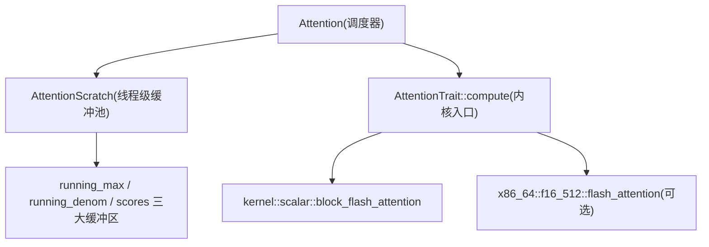
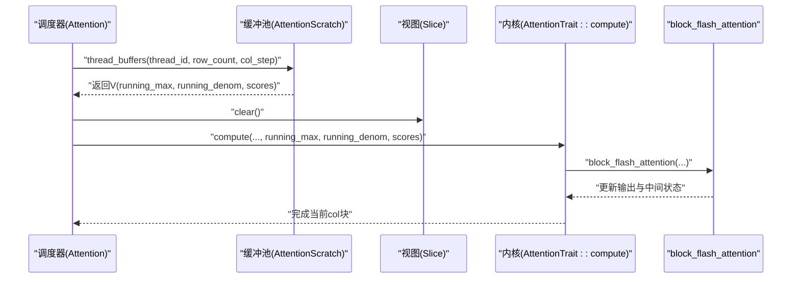
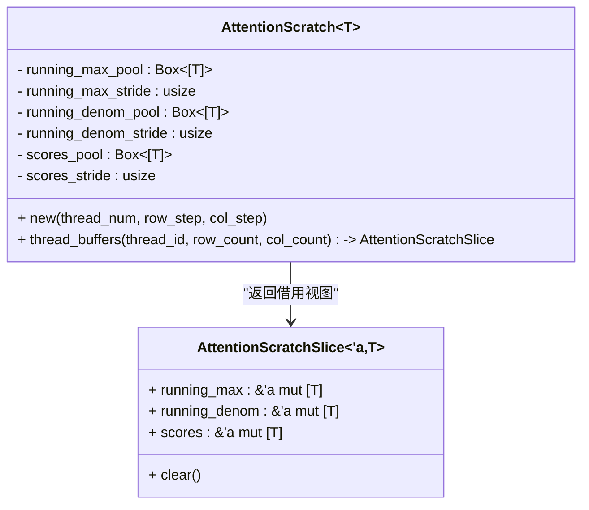
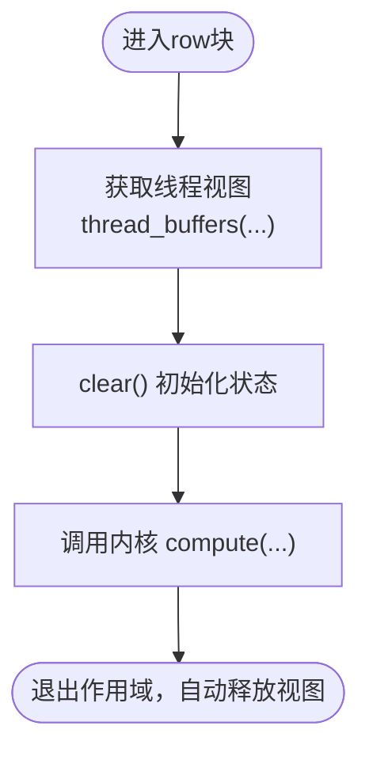
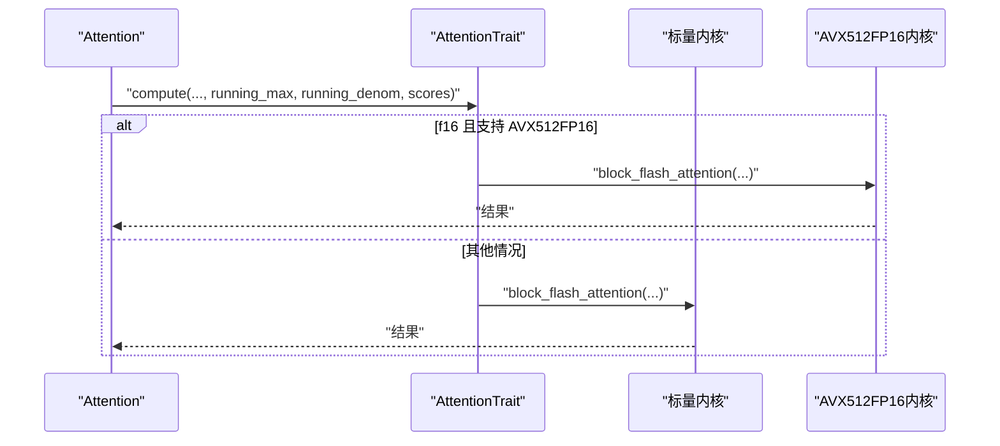
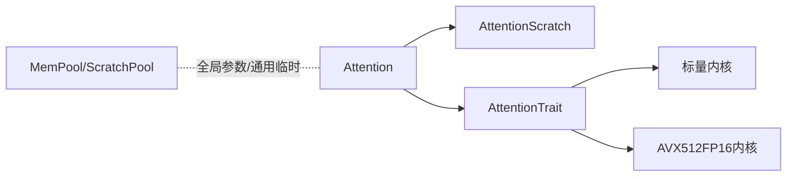

# 注意力临时内存管理

<cite>
**本文引用的文件**
- [src/operators/attention/scratch.rs](file://src/operators/attention/scratch.rs)
- [src/operators/attention/attention.rs](file://src/operators/attention/attention.rs)
- [src/operators/attention/compute.rs](file://src/operators/attention/compute.rs)
- [src/operators/traits/linear.rs](file://src/operators/traits/linear.rs)
- [src/mem_mgr/mod.rs](file://src/mem_mgr/mod.rs)
- [src/mem_mgr/mem_pool.rs](file://src/mem_mgr/mem_pool.rs)
- [src/mem_mgr/allocator.rs](file://src/mem_mgr/allocator.rs)
- [docs/design/operators/attention.md](file://docs/design/operators/attention.md)
</cite>

## 目录
1. [引言](#引言)
2. [项目结构](#项目结构)
3. [核心组件](#核心组件)
4. [架构总览](#架构总览)
5. [详细组件分析](#详细组件分析)
6. [依赖关系分析](#依赖关系分析)
7. [性能考量](#性能考量)
8. [故障排查指南](#故障排查指南)
9. [结论](#结论)
10. [附录](#附录)

## 引言
本技术文档聚焦于注意力（Attention）算子的“临时内存管理”，围绕 AttentionScratch 的设计模式与线程级缓冲区复用机制展开，解释运行最大值、运行分母和分数矩阵的内存布局优化；阐述 ScratchSlice 的生命周期管理与自动清理；说明多线程环境下的内存安全与并发访问控制；并提供内存使用监控与泄漏检测思路，以及自定义临时内存分配器的集成指南与性能调优建议。

## 项目结构
注意力模块采用“计算调度 + 内核实现 + 临时缓冲池”的分层组织：
- 调度与切片：负责将 Q/K/V 数据按行/列块切分，并选择序列拆分或头拆分策略。
- 临时缓冲：为每个线程预分配固定大小的 running_max、running_denom、scores 三类缓冲区，避免重复分配与拷贝。
- 内核调用：通过 AttentionTrait 统一接口，将具体数值路径（标量或 AVX512FP16）接入。

图表来源
- [src/operators/attention/attention.rs:102-111](file://src/operators/attention/attention.rs#L102-L111)
- [src/operators/attention/scratch.rs:19-73](file://src/operators/attention/scratch.rs#L19-L73)
- [src/operators/attention/compute.rs:10-62](file://src/operators/attention/compute.rs#L10-L62)
- [src/operators/attention/compute.rs:64-130](file://src/operators/attention/compute.rs#L64-L130)

章节来源
- [src/operators/attention/attention.rs:1-143](file://src/operators/attention/attention.rs#L1-L143)
- [src/operators/attention/scratch.rs:1-92](file://src/operators/attention/scratch.rs#L1-L92)
- [src/operators/attention/compute.rs:1-174](file://src/operators/attention/compute.rs#L1-L174)

## 核心组件
- AttentionScratch<T>：线程级临时缓冲池，内部维护三个 Box<[T]> 池与对应 stride，按 thread_id 零拷贝派生切片。
- AttentionScratchSlice<'a, T>：对单个线程可见的运行时视图，包含 running_max、running_denom、scores 三个可变切片，提供 clear() 初始化。
- Attention<T>：注意力调度器，持有 AttentionScratch，并在每次处理一个 row_chunk 时获取并清空对应线程的 ScratchSlice。
- AttentionTrait<T>：注意力内核的统一抽象，默认实现委托给标量 block_flash_attention，f16 特化在支持 AVX512FP16 时使用硬件加速路径。

章节来源
- [src/operators/attention/scratch.rs:3-17](file://src/operators/attention/scratch.rs#L3-L17)
- [src/operators/attention/scratch.rs:19-73](file://src/operators/attention/scratch.rs#L19-L73)
- [src/operators/attention/scratch.rs:75-91](file://src/operators/attention/scratch.rs#L75-L91)
- [src/operators/attention/attention.rs:14-37](file://src/operators/attention/attention.rs#L14-L37)
- [src/operators/attention/attention.rs:102-111](file://src/operators/attention/attention.rs#L102-L111)
- [src/operators/traits/linear.rs:1-22](file://src/operators/traits/linear.rs#L1-L22)
- [src/operators/attention/compute.rs:10-62](file://src/operators/attention/compute.rs#L10-L62)
- [src/operators/attention/compute.rs:64-130](file://src/operators/attention/compute.rs#L64-L130)

## 架构总览
下图展示了从调度到内核的一次典型调用链，以及 ScratchSlice 的获取与清理时机。

图表来源
- [src/operators/attention/attention.rs:174-214](file://src/operators/attention/attention.rs#L174-L214)
- [src/operators/attention/scratch.rs:40-73](file://src/operators/attention/scratch.rs#L40-L73)
- [src/operators/attention/scratch.rs:79-91](file://src/operators/attention/scratch.rs#L79-L91)
- [src/operators/attention/compute.rs:22-61](file://src/operators/attention/compute.rs#L22-L61)

## 详细组件分析

### AttentionScratch 设计模式与内存池复用
- 设计要点
  - 三池合一：running_max_pool、running_denom_pool、scores_pool 分别按 thread_num × stride 连续分配，stride 由 row_step/col_step 决定，确保每线程拥有独立且对齐的访问窗口。
  - 零拷贝派生：thread_buffers 通过指针偏移直接构造切片，避免额外分配与拷贝。
  - 生命周期绑定：返回的 AttentionScratchSlice 借用父池，随函数作用域结束自动释放，天然符合 RAII。
- 内存布局优化
  - running_max/running_denom 长度 = row_count（当前处理的行数），scores 长度 = col_step（列块宽度）。
  - 每线程的 stride 至少为 row_step/col_step，避免不同线程间越界与伪共享热点。
- 复杂度
  - 分配：O(1)（首次构造时为 O(thread_num × stride)，后续复用为常数时间）。
  - 派生切片：O(1)。
  - 清理：O(row_count + col_step)。

图表来源
- [src/operators/attention/scratch.rs:3-17](file://src/operators/attention/scratch.rs#L3-L17)
- [src/operators/attention/scratch.rs:19-73](file://src/operators/attention/scratch.rs#L19-L73)
- [src/operators/attention/scratch.rs:75-91](file://src/operators/attention/scratch.rs#L75-L91)

章节来源
- [src/operators/attention/scratch.rs:19-73](file://src/operators/attention/scratch.rs#L19-L73)
- [src/operators/attention/scratch.rs:75-91](file://src/operators/attention/scratch.rs#L75-L91)

### 线程级缓冲区分配策略与零拷贝优化
- 分配策略
  - 一次性为所有线程分配连续空间，以 thread_id 作为索引偏移，保证无锁访问与缓存友好。
  - stride 取 max(1) 防止除零与退化场景。
- 零拷贝
  - 通过原始指针加法与 from_raw_parts_mut 构造切片，不复制数据，仅创建视图。
- 并发安全
  - 同一时刻只允许一个线程访问其 own slice，不存在跨线程写冲突。
  - 若上层存在多核并行，需确保 thread_id 唯一且不重叠。

章节来源
- [src/operators/attention/scratch.rs:23-38](file://src/operators/attention/scratch.rs#L23-L38)
- [src/operators/attention/scratch.rs:40-73](file://src/operators/attention/scratch.rs#L40-L73)

### 运行最大值、运行分母与分数矩阵的内存布局优化
- 运行最大值（running_max）
  - 用于在线稳定 softmax 的最大值跟踪，长度等于当前处理的行数，便于逐行归一化。
- 运行分母（running_denom）
  - 累积指数和，长度同 running_max，配合 running_max 进行数值稳定的归一化。
- 分数矩阵（scores）
  - 存储当前列块的注意力分数，长度为列步长 col_step，利于向量化与缓存局部性。
- 布局优势
  - 三者均为连续数组，避免间接寻址开销；每线程独立区域，减少竞争与伪共享。

章节来源
- [src/operators/attention/scratch.rs:4-11](file://src/operators/attention/scratch.rs#L4-L11)
- [src/operators/attention/scratch.rs:40-73](file://src/operators/attention/scratch.rs#L40-L73)

### ScratchSlice 生命周期管理与自动清理
- 生命周期
  - 由 AttentionScratch::thread_buffers 返回的引用视图，生命周期受父对象与调用栈限制。
  - 离开作用域后自动 drop，无需显式释放。
- 自动清理
  - clear() 在每个 row_chunk 开始时被调用，重置 running_max 为负无穷、其余为零，保证下一次计算的初始态正确。

图表来源
- [src/operators/attention/attention.rs:174-214](file://src/operators/attention/attention.rs#L174-L214)
- [src/operators/attention/scratch.rs:79-91](file://src/operators/attention/scratch.rs#L79-L91)

章节来源
- [src/operators/attention/scratch.rs:75-91](file://src/operators/attention/scratch.rs#L75-L91)
- [src/operators/attention/attention.rs:174-214](file://src/operators/attention/attention.rs#L174-L214)

### 多线程环境下的内存安全与并发访问控制
- 线程隔离
  - 每个线程通过 thread_id 访问各自独立的 buffer 区间，避免写冲突。
- 边界检查
  - 调度侧使用 debug_assert 校验 thread_id 范围，生产构建下仍应保证传入合法。
- 潜在风险与建议
  - 若上层错误地将相同 thread_id 分配给多个任务，会导致数据竞争。建议在调度层增加断言或日志。
  - 如需跨线程共享 scratch，应引入互斥或原子计数，但会破坏零拷贝与低延迟目标。

章节来源
- [src/operators/attention/attention.rs:102-111](file://src/operators/attention/attention.rs#L102-L111)

### 内核集成与数据流
- AttentionTrait 统一入口，默认实现走标量路径；f16 在具备 AVX512FP16 特性时走硬件加速路径。
- 数据流：Q/K/V 输入 → 行/列块遍历 → 获取 ScratchSlice → 调用内核 → 写入输出。

图表来源
- [src/operators/attention/compute.rs:10-62](file://src/operators/attention/compute.rs#L10-L62)
- [src/operators/attention/compute.rs:64-130](file://src/operators/attention/compute.rs#L64-L130)

章节来源
- [src/operators/attention/compute.rs:10-62](file://src/operators/attention/compute.rs#L10-L62)
- [src/operators/attention/compute.rs:64-130](file://src/operators/attention/compute.rs#L64-L130)

## 依赖关系分析
- Attention 依赖 AttentionScratch 提供线程级临时缓冲。
- AttentionTrait 解耦了数值路径，使底层内核可替换。
- 全局内存池（MemPool/ScratchPool）可用于权重与通用临时缓冲，但与 AttentionScratch 的线程级池职责分离：前者面向参数/全局复用，后者面向单次算子执行的线程内复用。

图表来源
- [src/operators/attention/attention.rs:14-37](file://src/operators/attention/attention.rs#L14-L37)
- [src/operators/attention/scratch.rs:3-17](file://src/operators/attention/scratch.rs#L3-L17)
- [src/operators/attention/compute.rs:10-62](file://src/operators/attention/compute.rs#L10-L62)
- [src/mem_mgr/mod.rs:1-3](file://src/mem_mgr/mod.rs#L1-L3)
- [src/mem_mgr/mem_pool.rs:88-128](file://src/mem_mgr/mem_pool.rs#L88-L128)

章节来源
- [src/operators/attention/attention.rs:14-37](file://src/operators/attention/attention.rs#L14-L37)
- [src/mem_mgr/mem_pool.rs:88-128](file://src/mem_mgr/mem_pool.rs#L88-L128)

## 性能考量
- 缓存友好
  - 行/列块大小（row_step、col_step）影响 L1/L2 命中率；col_step 越大，scores 局部性越好，但单线程工作负载增大。
- 并行度匹配
  - 短序列优先采用 head 拆分策略提升线程利用率；长序列采用行三角划分保持因果语义与负载均衡。
- 数值稳定性
  - running_max 与 running_denom 的逐行更新避免了溢出与下溢风险。
- 分支预测
  - tail 行处理与对齐行处理分离，减少条件分支带来的开销。

章节来源
- [docs/design/operators/attention.md:317-384](file://docs/design/operators/attention.md#L317-L384)
- [src/operators/attention/attention.rs:314-436](file://src/operators/attention/attention.rs#L314-L436)

## 故障排查指南
- 症状：输出全零或 NaN
  - 可能原因：未调用 clear() 或 row_count/col_step 配置不当导致越界。
  - 定位：检查 AttentionScratchSlice::clear 调用点与 thread_buffers 的参数。
- 症状：多线程下结果不稳定
  - 可能原因：thread_id 冲突或超出范围。
  - 定位：确认调度层传入的 thread_id 唯一且小于 thread_num。
- 症状：内存增长异常
  - 可能原因：误用全局 MemPool/ScratchPool 而未回收；注意 AttentionScratch 是局部池，不应与全局池混用。
  - 定位：审查全局池的使用路径与生命周期。

章节来源
- [src/operators/attention/scratch.rs:79-91](file://src/operators/attention/scratch.rs#L79-L91)
- [src/operators/attention/attention.rs:102-111](file://src/operators/attention/attention.rs#L102-L111)
- [src/mem_mgr/mem_pool.rs:208-235](file://src/mem_mgr/mem_pool.rs#L208-L235)

## 结论
AttentionScratch 通过“线程级连续池 + 零拷贝视图 + 明确生命周期”的组合，实现了高效、安全的注意力临时内存管理。配合 AttentionTrait 的内核抽象与合理的行/列块策略，可在 CPU 上获得良好的吞吐与稳定性。对于更复杂的场景，可结合全局 MemPool/ScratchPool 进行更大范围的复用，同时遵循线程隔离原则以避免竞争。

## 附录

### 内存使用量监控与泄漏检测建议
- 统计维度
  - 峰值占用：记录各池最大分配长度（running_max/denom/scores）× 元素大小。
  - 分配次数：首次构造与扩容次数。
  - 清理频率：clear() 调用次数与平均耗时。
- 检测方法
  - 在 Debug 模式下启用断言与日志，记录 thread_id 与 row_count/col_step。
  - 使用系统工具（如 Linux perf、valgrind）观察内存分配热点与越界访问。
- 指标采集位置
  - 在 AttentionScratch::new 与 thread_buffers 处记录分配与派生事件。
  - 在 Attention::visit_aligned_row_range/visit_tail_row_range 中记录 clear 与 compute 调用。

章节来源
- [src/operators/attention/scratch.rs:23-38](file://src/operators/attention/scratch.rs#L23-L38)
- [src/operators/attention/scratch.rs:40-73](file://src/operators/attention/scratch.rs#L40-L73)
- [src/operators/attention/attention.rs:174-214](file://src/operators/attention/attention.rs#L174-L214)

### 自定义临时内存分配器集成指南
- 目标
  - 在不改变上层 API 的前提下，替换 AttentionScratch 的底层分配策略（例如对接外部内存池或 NUMA 感知分配器）。
- 步骤
  - 定义新的 BufferProvider<T>，要求提供 allocate(len)、get_slice(thread_id, len) 方法。
  - 修改 AttentionScratch 内部字段，将 Box<[T]> 替换为 Provider 实例。
  - 保持 thread_buffers 的零拷贝派生逻辑不变，仅调整指针偏移来源。
- 约束
  - 新分配器必须满足 64 字节对齐（SIMD 友好），并保证线程隔离。
  - 需要实现 Drop 或显式 reset 以支持复用。
- 参考实现
  - 现有 AlignedBox 提供了 64 字节对齐与基本操作，可作为基线参考。

章节来源
- [src/mem_mgr/allocator.rs:1-156](file://src/mem_mgr/allocator.rs#L1-L156)
- [src/operators/attention/scratch.rs:40-73](file://src/operators/attention/scratch.rs#L40-L73)

### 性能调优建议
- 调整 row_step/col_step
  - 增大 col_step 可提升向量化效率，但会增加单线程工作负载；根据硬件缓存层级与 SIMD 宽度进行权衡。
- 线程数与任务粒度
  - 短序列优先 head 拆分，长序列优先行三角拆分，最大化线程覆盖与 K/V 局部性。
- 避免不必要的初始化
  - 仅在必要时调用 clear()，并确保 row_count/col_step 与实际块大小一致，避免多余清零。

章节来源
- [docs/design/operators/attention.md:317-384](file://docs/design/operators/attention.md#L317-L384)
- [src/operators/attention/attention.rs:314-436](file://src/operators/attention/attention.rs#L314-L436)