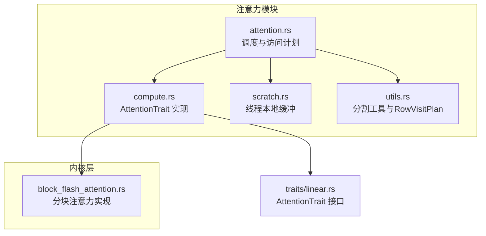
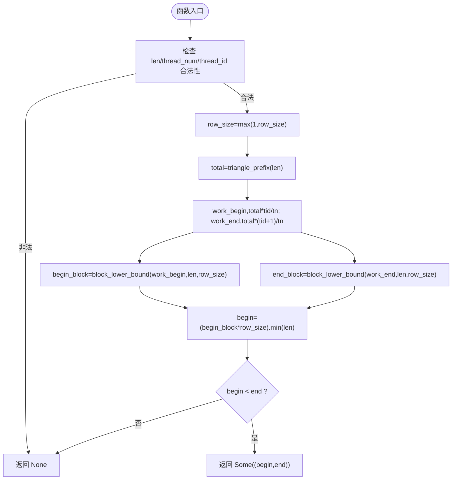
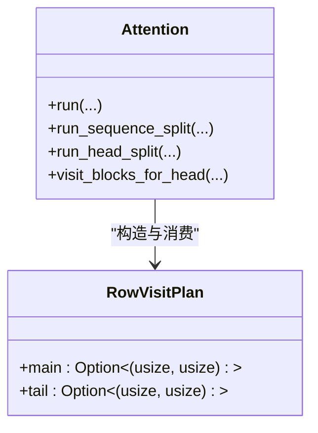
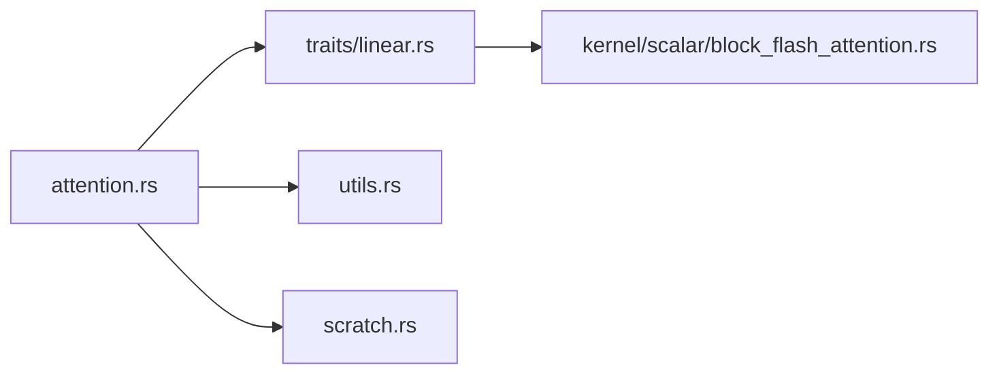

# 注意力工具函数

<cite>
**本文引用的文件**   
- [src/operators/attention/utils.rs](file://src/operators/attention/utils.rs)
- [src/operators/attention/attention.rs](file://src/operators/attention/attention.rs)
- [src/operators/attention/compute.rs](file://src/operators/attention/compute.rs)
- [src/operators/attention/scratch.rs](file://src/operators/attention/scratch.rs)
- [src/kernel/scalar/block_flash_attention.rs](file://src/kernel/scalar/block_flash_attention.rs)
- [src/operators/traits/linear.rs](file://src/operators/traits/linear.rs)
</cite>

## 目录
1. [简介](#简介)
2. [项目结构](#项目结构)
3. [核心组件](#核心组件)
4. [架构总览](#架构总览)
5. [详细组件分析](#详细组件分析)
6. [依赖关系分析](#依赖关系分析)
7. [性能考虑](#性能考虑)
8. [故障排查指南](#故障排查指南)
9. [结论](#结论)
10. [附录](#附录)

## 简介
本技术文档聚焦于注意力计算中的工具函数与关键实现细节，重点覆盖：
- 三角形序列分割算法 split_sequence_by_triangle 的原理与负载均衡策略
- RowVisitPlan 数据结构的用途及主尾部分割逻辑
- 注意力计算中的索引映射与偏移计算技巧
- 步幅对齐与内存对齐的优化策略
- 注意力掩码生成与可见区域计算方法
- 单元测试用例与边界条件处理
- 自定义分割算法集成指南与性能对比方法

## 项目结构
注意力相关代码位于 operators/attention 模块，包含核心调度、分块计算、线程本地缓冲与工具函数；底层算子由 kernel 层提供。



图表来源
- [src/operators/attention/attention.rs:1-120](file://src/operators/attention/attention.rs#L1-L120)
- [src/operators/attention/compute.rs:1-62](file://src/operators/attention/compute.rs#L1-L62)
- [src/operators/attention/scratch.rs:1-40](file://src/operators/attention/scratch.rs#L1-L40)
- [src/operators/attention/utils.rs:1-61](file://src/operators/attention/utils.rs#L1-L61)
- [src/kernel/scalar/block_flash_attention.rs:1-34](file://src/kernel/scalar/block_flash_attention.rs#L1-L34)
- [src/operators/traits/linear.rs:1-22](file://src/operators/traits/linear.rs#L1-L22)

章节来源
- [src/operators/attention/mod.rs:1-11](file://src/operators/attention/mod.rs#L1-L11)

## 核心组件
- Attention 结构体：封装 Q/K/V 指针、步幅、维度、解码标志、线程数等，并提供 run 入口以选择“按序列行切分”或“按头切分”的策略。
- AttentionTrait：定义 compute 接口，将具体分块注意力实现（标量或硬件加速）与上层调度解耦。
- AttentionScratch：为每个线程分配 running_max、running_denom、scores 缓冲区，避免跨线程竞争与重复分配。
- utils 工具：提供 split_sequence_by_triangle 与 RowVisitPlan，用于在三角形注意力场景下对行范围进行负载均衡与主尾分离。

章节来源
- [src/operators/attention/attention.rs:11-143](file://src/operators/attention/attention.rs#L11-L143)
- [src/operators/traits/linear.rs:1-22](file://src/operators/traits/linear.rs#L1-L22)
- [src/operators/attention/scratch.rs:1-73](file://src/operators/attention/scratch.rs#L1-L73)
- [src/operators/attention/utils.rs:1-61](file://src/operators/attention/utils.rs#L1-L61)

## 架构总览
注意力计算的执行路径如下：
- 上层根据序列切片信息选择 run_head_split 或 run_sequence_split
- 构建 RowVisitPlan（main/tail），分别对应“可对齐的行块”和“尾部未对齐行”
- visit_blocks_for_head 调用 visit_aligned_row_range / visit_tail_row_range
- 每块列区间内通过 AttentionTrait::compute 进入 block_flash_attention 完成数值计算

```mermaid
sequenceDiagram
participant Caller as "调用方"
participant Att as "Attention.run"
participant Split as "run_sequence_split/run_head_split"
participant Plan as "RowVisitPlan"
participant Visit as "visit_blocks_for_head"
trait as "AttentionTrait : : compute"
kernel as "block_flash_attention"
Caller->>Att : 传入切片列表、线程参数
Att->>Split : 选择按行或按头切分
Split->>Plan : 构造 main/tail 访问计划
Split->>Visit : 遍历KV头与局部头
Visit->>trait : compute(row, col块)
trait->>kernel : 分块注意力计算
kernel-->>trait : 更新输出与运行统计
trait-->>Visit : 返回
Visit-->>Split : 完成
Split-->>Att : 完成
Att-->>Caller : 返回
```

图表来源
- [src/operators/attention/attention.rs:313-505](file://src/operators/attention/attention.rs#L313-L505)
- [src/operators/attention/compute.rs:10-62](file://src/operators/attention/compute.rs#L10-L62)
- [src/kernel/scalar/block_flash_attention.rs:5-95](file://src/kernel/scalar/block_flash_attention.rs#L5-L95)

## 详细组件分析

### 三角形序列分割算法 split_sequence_by_triangle
目标
- 在自注意力中，第 i 行的可见列数为 i+1，整体计算量为三角形分布 sum_{i=0}^{len-1}(i+1)。
- 为了在多核上负载均衡，需要按“三角形工作量”而非“行数”均匀划分任务。

算法要点
- 使用 triangle_prefix(len) = len*(len+1)/2 表示前 len 行的总计算量。
- 给定 thread_num 与 thread_id，计算该线程应负责的“工作份额” work_begin..work_end。
- 通过二分查找 block_lower_bound(target, len, row_size) 找到满足“前 blocks 个 row_step 大小的块”累计工作量不小于 target 的最小块号。
- 将块号乘以 row_size 得到 begin/end，并裁剪到 len，保证对齐且无越界。
- 若 begin < end 则返回 Some((begin, end))，否则 None。

负载均衡特性
- 基于三角形总量均分，确保各线程处理的“有效计算量”近似相等。
- 通过 row_size 对齐，减少循环分支与访存不规则性。
- 当 len 不是 row_size 的整数倍时，尾部行由最后一个线程单独处理（见 RowVisitPlan.tail）。

复杂度
- 时间：O(log(L/R))，其中 L=len，R=row_size，二分查找块号。
- 空间：O(1)，仅常数级变量。

边界与异常
- len==0 或 thread_num==0 或 thread_id>=thread_num 直接返回 None。
- row_size 被强制至少为 1，避免除零与死循环。
- 测试覆盖了尾行单独处理、整倍数步长、多线程无重叠全覆盖等情形。



图表来源
- [src/operators/attention/utils.rs:10-61](file://src/operators/attention/utils.rs#L10-L61)

章节来源
- [src/operators/attention/utils.rs:10-61](file://src/operators/attention/utils.rs#L10-L61)
- [src/operators/attention/utils.rs:63-124](file://src/operators/attention/utils.rs#L63-L124)

### RowVisitPlan 数据结构与主尾分割逻辑
用途
- 将行范围划分为两部分：
  - main：从 0 开始、长度为 aligned_len 的可对齐行块（aligned_len = length / row_step * row_step）
  - tail：剩余未对齐的尾部行（长度可能为 0）
- 在 run_sequence_split 中，main 由 split_sequence_by_triangle 进一步按线程拆分；tail 仅在最后一个线程承担，避免额外同步与复杂边界。

主尾分割策略
- run_sequence_split：
  - main = split_sequence_by_triangle(aligned_len, row_step, thread_num, thread_id)
  - tail = (aligned_len < slice_len && thread_id == thread_num-1) ? Some((aligned_len, slice_len)) : None
- run_head_split：
  - main = (aligned_len != 0) ? Some((0, aligned_len)) : None
  - tail = (aligned_len < slice_len) ? Some((aligned_len, slice_len)) : None



图表来源
- [src/operators/attention/utils.rs:1-7](file://src/operators/attention/utils.rs#L1-7)
- [src/operators/attention/attention.rs:313-436](file://src/operators/attention/attention.rs#L313-L436)

章节来源
- [src/operators/attention/attention.rs:313-436](file://src/operators/attention/attention.rs#L313-L436)
- [src/operators/attention/utils.rs:1-7](file://src/operators/attention/utils.rs#L1-7)

### 注意力计算中的索引映射与偏移计算
- 行索引映射：对于第 row 行，Q/O 的起始偏移为 row * q_seq_stride，K/V 的列偏移为 col * k_seq_stride / v_seq_stride。
- 可见列范围：visible_col_end = min(total_col_end, next_sequence_index + row + 1)，体现因果掩码（当前行只能看到自身及之前位置）。
- 块内偏移：col_begin..col_end 作为列块，scores 数组以 offset 索引存储 score，再按 head_size 累加到输出向量。
- 运行统计：running_max[row_offset] 与 running_denom[row_offset] 维护增量 softmax 的最大值与分母，支持分块合并。

章节来源
- [src/operators/attention/attention.rs:157-270](file://src/operators/attention/attention.rs#L157-L270)
- [src/kernel/scalar/block_flash_attention.rs:35-95](file://src/kernel/scalar/block_flash_attention.rs#L35-L95)

### 步幅对齐与内存对齐优化
- row_step 控制“主块”的行步幅，split_sequence_by_triangle 保证 begin/end 均为 row_step 的倍数，便于向量化与缓存友好。
- col_step 控制列块大小，AttentionScratch 中 scores 缓冲区按 col_step 分配，减少重复分配与锁竞争。
- 在 run 入口，当“可对齐行数 < 线程数”时切换到 run_head_split，避免过多空任务与细粒度调度开销。

章节来源
- [src/operators/attention/attention.rs:438-505](file://src/operators/attention/attention.rs#L438-L505)
- [src/operators/attention/scratch.rs:19-73](file://src/operators/attention/scratch.rs#L19-L73)

### 注意力掩码生成与可见区域计算
- 掩码采用隐式因果形式：visible_col_end = min(total_col_end, next_sequence_index + row + 1)。
- 在分块计算中，实际参与计算的列为 col_begin..min(col_end, visible_col_end)，超出部分跳过。
- next_sequence_index 用于支持增量解码场景下的窗口移动。

章节来源
- [src/kernel/scalar/block_flash_attention.rs:35-41](file://src/kernel/scalar/block_flash_attention.rs#L35-L41)
- [src/operators/attention/attention.rs:157-180](file://src/operators/attention/attention.rs#L157-L180)

### 单元测试与边界条件
- split_sequence_by_triangle 的测试覆盖：
  - 对齐到 row_size
  - row_size 默认回退为 1
  - 尾行单独处理
  - 整倍数步长情况
  - 多线程无重叠、完整覆盖对齐长度
- Attention 与 block_flash_attention 的测试验证：
  - 与朴素注意力结果一致
  - 正确读取带步幅的 KV 布局
  - 正确处理行范围与 next_sequence_index 的可见区域

章节来源
- [src/operators/attention/utils.rs:63-124](file://src/operators/attention/utils.rs#L63-L124)
- [src/operators/attention/attention.rs:508-703](file://src/operators/attention/attention.rs#L508-L703)
- [src/kernel/scalar/block_flash_attention.rs:97-280](file://src/kernel/scalar/block_flash_attention.rs#L97-L280)

### 自定义分割算法集成指南
目标
- 在不改变上层调度与计算内核的前提下，替换行范围的负载均衡策略。

步骤
- 在 utils.rs 中新增一个与 split_sequence_by_triangle 签名一致的函数，保持输入语义：len、row_size、thread_num、thread_id，返回可选的 (begin, end)。
- 在 run_sequence_split 中将 RowVisitPlan.main 的赋值处替换为新函数调用。
- 保留 tail 的处理逻辑（通常仍由最后一个线程负责未对齐尾部），以确保对齐性与完整性。
- 编写针对新函数的单元测试，覆盖：
  - 空序列、无效线程ID
  - 非对齐尾部
  - 多线程无重叠与完全覆盖
  - 极端 row_size（如 1 或大于 len）

注意事项
- 返回值必须满足 begin % row_size == 0 且 end % row_size == 0（除非 end == len 且 len 本身未对齐）。
- 保证 begin < end 才返回 Some，否则返回 None，避免空任务。
- 若引入新的并行维度（如按列块切分），需同步调整 AttentionScratch 的尺寸与 clear 初始化。

章节来源
- [src/operators/attention/utils.rs:40-61](file://src/operators/attention/utils.rs#L40-L61)
- [src/operators/attention/attention.rs:313-361](file://src/operators/attention/attention.rs#L313-L361)

### 性能对比方法
- 基准指标：吞吐（tokens/s）、延迟（ms/token）、CPU 利用率、缓存命中率（可用 perf 或 VTune）。
- 对比维度：
  - 不同 row_size 与 col_step 组合
  - 不同 thread_num 与 batch_size
  - 不同 attention_heads_per_kv 与 kv_head_num
- 建议流程：
  - 固定模型与权重，仅切换分割函数或步幅参数
  - 预热后多次采样取中位数与 P95
  - 记录内存占用峰值与 Scratch 分配次数
  - 结合火焰图定位热点（如 scores 写入、exp 计算）

[本节为通用指导，不直接分析具体文件]

## 依赖关系分析
- Attention 依赖 AttentionTrait 抽象，compute 的具体实现由 kernel 层提供。
- utils 提供分割工具，被 run_sequence_split 使用。
- scratch 提供线程本地缓冲，降低跨线程共享开销。



图表来源
- [src/operators/attention/attention.rs:1-120](file://src/operators/attention/attention.rs#L1-L120)
- [src/operators/traits/linear.rs:1-22](file://src/operators/traits/linear.rs#L1-L22)
- [src/operators/attention/utils.rs:1-61](file://src/operators/attention/utils.rs#L1-L61)
- [src/operators/attention/scratch.rs:1-40](file://src/operators/attention/scratch.rs#L1-L40)
- [src/kernel/scalar/block_flash_attention.rs:1-34](file://src/kernel/scalar/block_flash_attention.rs#L1-L34)

章节来源
- [src/operators/attention/attention.rs:1-120](file://src/operators/attention/attention.rs#L1-L120)
- [src/operators/traits/linear.rs:1-22](file://src/operators/traits/linear.rs#L1-L22)

## 性能考虑
- 合理设置 row_step 与 col_step：
  - row_step 越大，主块越多，但单块行数增加，需平衡缓存与并行度。
  - col_step 影响 scores 缓冲区大小与每次计算的列块规模。
- 选择行切分或头切分：
  - 短序列（可对齐行数小于线程数）优先按头切分，减少空任务。
  - 长序列优先按行切分，利用三角形负载均衡。
- 避免不必要的清空与分配：
  - 复用 AttentionScratch，clear 仅重置必要字段。
- 数值稳定性：
  - 使用 running_max 与 running_denom 的增量 softmax 合并，防止溢出与精度损失。

[本节为通用指导，不直接分析具体文件]

## 故障排查指南
常见问题与定位思路
- 结果为 NaN/Inf：
  - 检查 inverse_sqrt_head 是否为 0 或极小值
  - 确认 running_max 初始化为负无穷，running_denom 初始化为 0
- 输出未覆盖或未对齐：
  - 检查 split_sequence_by_triangle 返回值是否满足 begin%row_size==0
  - 确认 tail 仅在最后一个线程处理
- 可见区域错误：
  - 核对 next_sequence_index 与 total_col_end 的计算
  - 验证 visible_col_end 的 min 操作是否正确

章节来源
- [src/operators/attention/scratch.rs:75-91](file://src/operators/attention/scratch.rs#L75-L91)
- [src/operators/attention/attention.rs:157-270](file://src/operators/attention/attention.rs#L157-L270)
- [src/kernel/scalar/block_flash_attention.rs:35-95](file://src/kernel/scalar/block_flash_attention.rs#L35-L95)

## 结论
本实现通过三角形负载分割、主尾分离与分块增量 softmax，兼顾了并行效率与数值稳定性。配合合理的步幅与线程策略，可在多种序列长度与批大小下取得良好性能。扩展自定义分割算法时，仅需关注负载均衡与对齐约束，即可无缝接入现有调度与计算框架。

## 附录
- 术语
  - 行步幅（row_step）：主块行跨度，用于对齐与批量处理
  - 列步幅（col_step）：列块大小，影响分块计算与缓冲区尺寸
  - 可见区域：受因果掩码限制，当前行仅能看到的列范围
  - 运行统计：running_max、running_denom，用于增量 softmax 合并

[本节为概念说明，不直接分析具体文件]