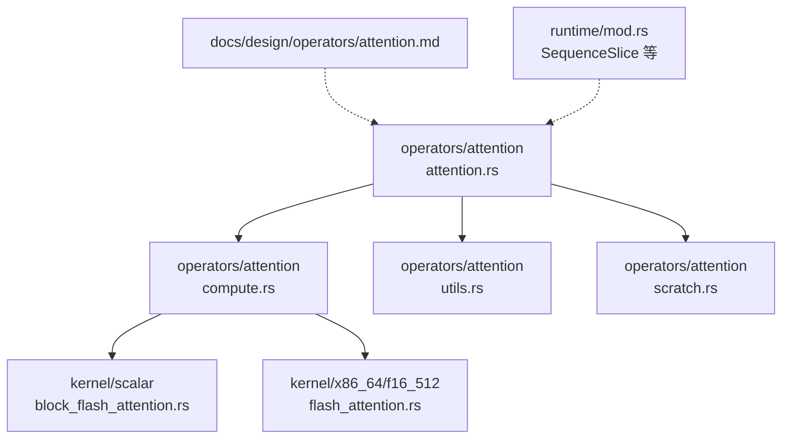
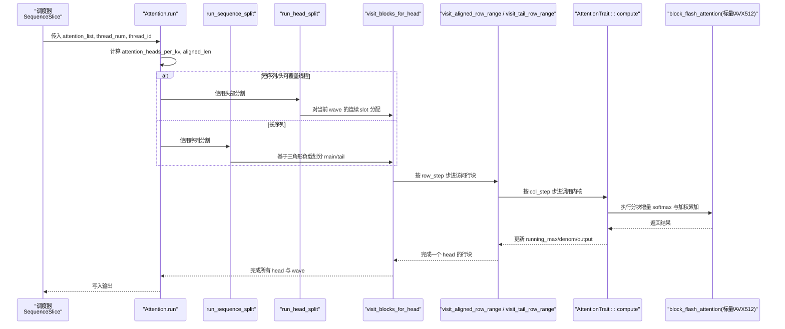
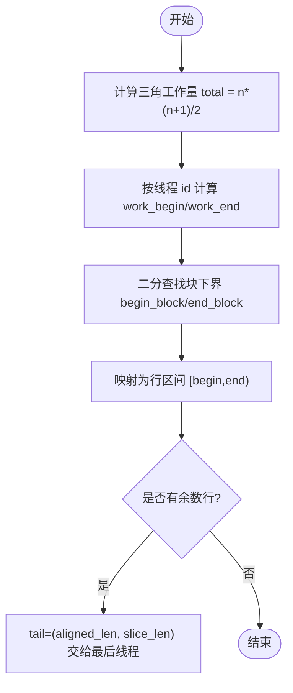
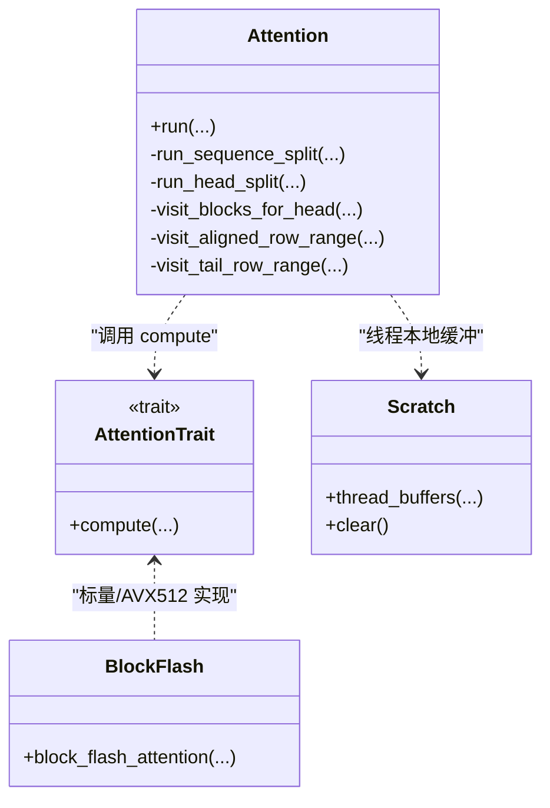
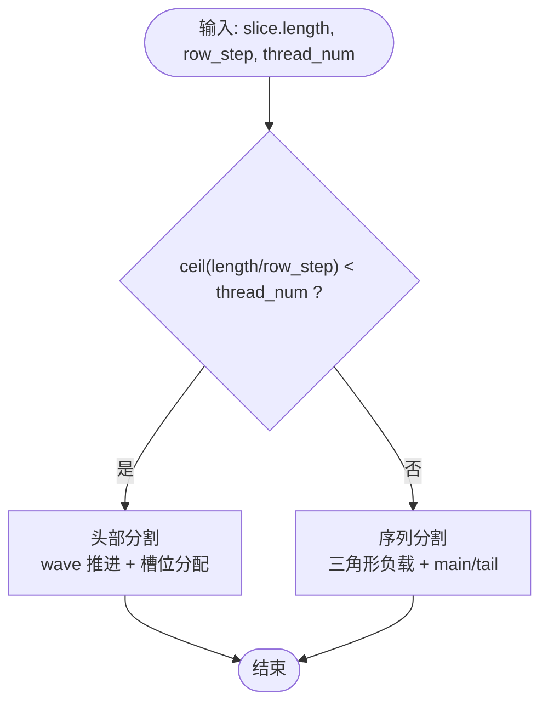
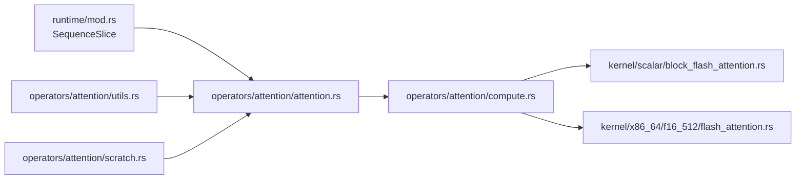

# 注意力核心计算

<cite>
**本文引用的文件**   
- [attention.rs](file://src/operators/attention/attention.rs)
- [compute.rs](file://src/operators/attention/compute.rs)
- [utils.rs](file://src/operators/attention/utils.rs)
- [scratch.rs](file://src/operators/attention/scratch.rs)
- [block_flash_attention.rs](file://src/kernel/scalar/block_flash_attention.rs)
- [flash_attention.rs](file://src/kernel/x86_64/f16_512/flash_attention.rs)
- [attention.md](file://docs/design/operators/attention.md)
- [mod.rs](file://src/runtime/mod.rs)
</cite>

## 目录
1. [简介](#简介)
2. [项目结构](#项目结构)
3. [核心组件](#核心组件)
4. [架构总览](#架构总览)
5. [详细组件分析](#详细组件分析)
6. [依赖关系分析](#依赖关系分析)
7. [性能考量](#性能考量)
8. [故障排查指南](#故障排查指南)
9. [结论](#结论)
10. [附录](#附录)

## 简介
本文件聚焦于 eLLM 中注意力算子的核心计算实现，系统性阐述 Attention 结构体设计、Q/K/V 指针与内存布局、行访问计划（RowVisitPlan）的三角形掩码处理与分块算法、序列分割与头部分割两种并行策略的选择逻辑、KV Cache 步幅与数据访问模式、以及 f16/f32 路径下的内核选择。同时给出性能调优参数与硬件适配建议，并提供调试方法与性能分析要点。

## 项目结构
注意力相关代码主要分布在 operators/attention 与 kernel 层：
- operators/attention：调度与高层遍历、线程缓冲管理、工具函数
- kernel/scalar：通用标量分块 FlashAttention 内核
- kernel/x86_64/f16_512：针对 AVX512FP16 的 f16 加速路径
- docs/design/operators/attention.md：静态并行分配的设计说明

图表来源
- [attention.rs:1-120](file://src/operators/attention/attention.rs#L1-L120)
- [compute.rs:1-62](file://src/operators/attention/compute.rs#L1-L62)
- [utils.rs:1-61](file://src/operators/attention/utils.rs#L1-L61)
- [scratch.rs:1-40](file://src/operators/attention/scratch.rs#L1-L40)
- [block_flash_attention.rs:1-95](file://src/kernel/scalar/block_flash_attention.rs#L1-L95)
- [flash_attention.rs:142-210](file://src/kernel/x86_64/f16_512/flash_attention.rs#L142-L210)
- [attention.md:1-60](file://docs/design/operators/attention.md#L1-L60)
- [mod.rs:11-23](file://src/runtime/mod.rs#L11-L23)

章节来源
- [attention.rs:1-120](file://src/operators/attention/attention.rs#L1-L120)
- [compute.rs:1-62](file://src/operators/attention/compute.rs#L1-L62)
- [utils.rs:1-61](file://src/operators/attention/utils.rs#L1-L61)
- [scratch.rs:1-40](file://src/operators/attention/scratch.rs#L1-L40)
- [block_flash_attention.rs:1-95](file://src/kernel/scalar/block_flash_attention.rs#L1-L95)
- [flash_attention.rs:142-210](file://src/kernel/x86_64/f16_512/flash_attention.rs#L142-L210)
- [attention.md:1-60](file://docs/design/operators/attention.md#L1-L60)
- [mod.rs:11-23](file://src/runtime/mod.rs#L11-L23)

## 核心组件
- Attention<T>：封装 Q/K/V 与输出指针、批/头/序列维度、步幅、分块粒度、解码标志、线程数与线程本地缓冲；提供 run 入口与两种并行策略分支。
- RowVisitPlan：描述主对齐行区间与尾部非对齐行区间，用于三角形掩码下的负载均衡。
- AttentionScratch：按线程切分的 running_max、running_denom、scores 缓冲区池，避免跨线程竞争。
- AttentionTrait::compute：将具体数值计算下沉到内核层，支持 f16/f32 特化与平台特性开关。
- block_flash_attention：分块增量 softmax 的核心实现，逐列块更新运行最大值与归一化因子，并加权累加 V。

章节来源
- [attention.rs:12-143](file://src/operators/attention/attention.rs#L12-L143)
- [utils.rs:1-61](file://src/operators/attention/utils.rs#L1-L61)
- [scratch.rs:1-92](file://src/operators/attention/scratch.rs#L1-L92)
- [compute.rs:10-62](file://src/operators/attention/compute.rs#L10-L62)
- [block_flash_attention.rs:1-95](file://src/kernel/scalar/block_flash_attention.rs#L1-L95)

## 架构总览
整体流程：上层通过 SequenceSlice 组织每个批次内的连续 token 范围；Attention.run 根据 slice.length 与 row_step 决定“序列分割”或“头部分割”；随后以 row_step × col_step 为块粒度进行分块计算，调用 AttentionTrait::compute 进入内核层；f16 在具备 AVX512FP16 时走 x86_64 路径，否则回退至标量路径。

图表来源
- [attention.rs:438-505](file://src/operators/attention/attention.rs#L438-L505)
- [attention.rs:313-436](file://src/operators/attention/attention.rs#L313-L436)
- [attention.rs:272-311](file://src/operators/attention/attention.rs#L272-L311)
- [attention.rs:157-270](file://src/operators/attention/attention.rs#L157-L270)
- [compute.rs:10-62](file://src/operators/attention/compute.rs#L10-L62)
- [block_flash_attention.rs:1-95](file://src/kernel/scalar/block_flash_attention.rs#L1-L95)
- [flash_attention.rs:142-210](file://src/kernel/x86_64/f16_512/flash_attention.rs#L142-L210)

## 详细组件分析

### Attention 结构体与内存布局
- 指针与维度
  - q_ptr/k_ptr/v_ptr/output_ptr：指向 Q/K/V/O 的原始内存
  - sequence_length/batch_size/attention_head_num/kv_head_num/head_size：模型维度
  - k_batch_stride/k_head_stride/k_seq_stride、v_batch_stride/v_head_stride/v_seq_stride、q_seq_stride：控制 K/V/Q 在 batch×head×seq×dim 上的真实访问步幅
  - inverse_sqrt_head：缩放系数 1/sqrt(head_dim)
  - row_step/col_step：行/列分块粒度
  - decode_only_flag/thread_num：解码标志与线程数
- 内存布局要点
  - Q 的组织通常按 [token_start_index + row][head][head_dim] 线性访问，由 q_seq_stride 控制
  - K/V 采用 batch×kv_head×seq×head_dim 的布局，通过 k_batch_stride/k_head_stride/k_seq_stride 与 v_* 对应步幅进行跨 batch 与跨 head 的跳跃访问
  - 该布局与 GQA 一致：多个 Q head 共享同一 kv_head 的 K/V

章节来源
- [attention.rs:12-100](file://src/operators/attention/attention.rs#L12-L100)
- [attention.md:46-66](file://docs/design/operators/attention.md#L46-L66)

### 行访问计划 RowVisitPlan 与三角形掩码
- RowVisitPlan.main：对齐到 row_step 的主区间，按三角形工作量近似进行负载均衡
- RowVisitPlan.tail：剩余不足 row_step 的尾部行，交由最后一个线程处理，保证完整覆盖
- split_sequence_by_triangle：基于三角前缀工作量估计，二分定位块边界，确保每个线程获得连续的、近似均衡的行区间

图表来源
- [utils.rs:9-61](file://src/operators/attention/utils.rs#L9-L61)
- [attention.rs:313-361](file://src/operators/attention/attention.rs#L313-L361)

章节来源
- [utils.rs:1-125](file://src/operators/attention/utils.rs#L1-L125)
- [attention.rs:313-361](file://src/operators/attention/attention.rs#L313-L361)

### 分块计算与内核选择
- 外层遍历
  - visit_aligned_row_range：按 row_step 步进，先清零输出行，再按 col_step 步进调用内核
  - visit_tail_row_range：处理尾部非对齐行，同样按 col_step 步进
  - visit_blocks_for_head：组合 main 与 tail 两个行区间
- 内核选择
  - AttentionTrait::compute 默认走标量路径
  - f16 特化在目标支持 AVX512FP16 时走 x86_64::f16_512::flash_attention::block_flash_attention，否则回退标量
- 分块增量 softmax
  - 每行维护 running_max/running_denom，按列块增量合并，避免全量 exp 与重算

图表来源
- [attention.rs:157-311](file://src/operators/attention/attention.rs#L157-L311)
- [compute.rs:10-130](file://src/operators/attention/compute.rs#L10-L130)
- [scratch.rs:1-92](file://src/operators/attention/scratch.rs#L1-L92)
- [block_flash_attention.rs:1-95](file://src/kernel/scalar/block_flash_attention.rs#L1-L95)
- [flash_attention.rs:142-210](file://src/kernel/x86_64/f16_512/flash_attention.rs#L142-L210)

章节来源
- [attention.rs:157-311](file://src/operators/attention/attention.rs#L157-L311)
- [compute.rs:10-130](file://src/operators/attention/compute.rs#L10-L130)
- [scratch.rs:1-92](file://src/operators/attention/scratch.rs#L1-L92)
- [block_flash_attention.rs:1-95](file://src/kernel/scalar/block_flash_attention.rs#L1-L95)
- [flash_attention.rs:142-210](file://src/kernel/x86_64/f16_512/flash_attention.rs#L142-L210)

### 并行策略：序列分割 vs 头部分割
- 选择条件
  - use_head_split = slice.length > 0 && thread_num > 0 && ceil(slice.length / row_step) < thread_num
  - 不满足则走序列分割
- 序列分割（长序列）
  - 基于三角形工作量估算，将主区间按线程切分为连续行区间，尾部行交给最后线程
  - 每个线程遍历其行区间内全部 kv_head 及其 local heads
- 头部分割（短序列）
  - 以 kv_head 为波推进，每波激活尽可能少的 kv_head 以覆盖所有线程
  - 在当前波内，将 (kv_head, local_head) 展平为连续槽位，按 thread_id 静态分配连续槽段
  - 每个槽位仍使用相同的 row_step × col_step 分块遍历

图表来源
- [attention.rs:438-505](file://src/operators/attention/attention.rs#L438-L505)
- [attention.rs:363-436](file://src/operators/attention/attention.rs#L363-L436)
- [attention.rs:313-361](file://src/operators/attention/attention.rs#L313-L361)
- [attention.md:121-134](file://docs/design/operators/attention.md#L121-L134)

章节来源
- [attention.rs:438-505](file://src/operators/attention/attention.rs#L438-L505)
- [attention.rs:363-436](file://src/operators/attention/attention.rs#L363-L436)
- [attention.rs:313-361](file://src/operators/attention/attention.rs#L313-L361)
- [attention.md:121-134](file://docs/design/operators/attention.md#L121-L134)

### KV Cache 步幅与数据访问模式
- 步幅字段
  - k_batch_stride/k_head_stride/k_seq_stride：K 在 batch、head、seq 维度的步幅
  - v_batch_stride/v_head_stride/v_seq_stride：V 对应步幅
  - q_seq_stride：Q 在 seq 维度的步幅
- 访问模式
  - 对于给定 slice，按 batch_index 定位 K/V 的 batch 基址，再按 kv_head 与 local_head 索引访问
  - 行内按 q_seq_stride 访问 Q 与输出，按 k_seq_stride/v_seq_stride 访问 K/V 的列块
  - 该布局与 GQA 一致：多 Q head 共享同一 kv_head 的 K/V

章节来源
- [attention.rs:12-100](file://src/operators/attention/attention.rs#L12-L100)
- [attention.rs:438-505](file://src/operators/attention/attention.rs#L438-L505)
- [attention.md:46-66](file://docs/design/operators/attention.md#L46-L66)

### 线程缓冲与缓存友好性
- AttentionScratch 为每个线程预分配 running_max、running_denom、scores 缓冲区，避免锁与竞争
- 每次行块开始前 clear，减少跨块状态污染
- 行块与列块粒度（row_step=1, col_step=8）有助于提升访存局部性与吞吐

章节来源
- [scratch.rs:1-92](file://src/operators/attention/scratch.rs#L1-L92)
- [attention.md:291-312](file://docs/design/operators/attention.md#L291-L312)

## 依赖关系分析
- Attention 依赖 runtime 提供的 SequenceSlice 作为任务切片
- AttentionTrait::compute 将数值计算委托给 kernel 层，f16 路径在编译期按 target_feature 选择 AVX512FP16 实现
- utils 提供三角形分割工具，scratch 提供线程本地缓冲

图表来源
- [mod.rs:11-23](file://src/runtime/mod.rs#L11-L23)
- [attention.rs:1-120](file://src/operators/attention/attention.rs#L1-L120)
- [compute.rs:10-62](file://src/operators/attention/compute.rs#L10-L62)
- [block_flash_attention.rs:1-95](file://src/kernel/scalar/block_flash_attention.rs#L1-L95)
- [flash_attention.rs:142-210](file://src/kernel/x86_64/f16_512/flash_attention.rs#L142-L210)

章节来源
- [mod.rs:11-23](file://src/runtime/mod.rs#L11-L23)
- [attention.rs:1-120](file://src/operators/attention/attention.rs#L1-L120)
- [compute.rs:10-62](file://src/operators/attention/compute.rs#L10-L62)
- [block_flash_attention.rs:1-95](file://src/kernel/scalar/block_flash_attention.rs#L1-L95)
- [flash_attention.rs:142-210](file://src/kernel/x86_64/f16_512/flash_attention.rs#L142-L210)

## 性能考量
- 分块粒度
  - row_step=1、col_step=8 是当前默认值，影响 L1/L2 缓存命中与向量宽度利用率
- 并行策略
  - 长序列优先序列分割，匹配因果注意力的三角形负载形状，提高负载均衡
  - 短序列优先头部分割，最小化激活的 kv_head 数量，提升缓存复用与核心覆盖率
- 内核选择
  - f16 在 AVX512FP16 可用时显著提速；否则回退标量路径
- 线程本地缓冲
  - 避免跨线程同步开销，降低 false sharing 风险
- 访存局部性
  - 通过 stride 与分块顺序，尽量保持 K/V 的列块顺序访问，减少随机跳转

[本节为通用指导，无需特定文件引用]

## 故障排查指南
- 精度问题
  - 核对 running_max/running_denom 的初始化与增量合并逻辑，确认 next_max 与 carry 的计算顺序
  - 对比 naive 参考实现与分块实现的差异，关注数值溢出与下溢
- 可见列截断
  - 检查 visible_col_end 与 row_col_end 的裁剪是否正确，确保因果掩码生效
- 步幅与布局
  - 验证 k_batch_stride/k_head_stride/k_seq_stride 与 v_* 步幅是否与上层张量布局一致
  - 确认 q_seq_stride 与 head_size 的关系，避免越界
- 并行边界
  - 检查 use_head_split 条件与 wave 大小计算，避免线程无工作或重复工作
  - 确认 tail 行仅由最后线程处理，防止遗漏
- 平台特性
  - f16 路径需启用 AVX512FP16；若未启用应回退标量路径

章节来源
- [block_flash_attention.rs:1-95](file://src/kernel/scalar/block_flash_attention.rs#L1-L95)
- [flash_attention.rs:142-210](file://src/kernel/x86_64/f16_512/flash_attention.rs#L142-L210)
- [attention.rs:157-270](file://src/operators/attention/attention.rs#L157-L270)
- [attention.rs:438-505](file://src/operators/attention/attention.rs#L438-L505)

## 结论
本注意力实现以 SequenceSlice 为外部任务单元，结合三角形负载估计与分块增量 softmax，在 CPU 上实现了高效且稳定的静态并行。长序列场景通过序列分割维持负载均衡，短序列场景通过 kv_head 波与槽位分配提升核心覆盖与缓存命中率。f16 路径在 AVX512FP16 平台上可获得显著加速。合理的步幅与分块粒度、线程本地缓冲与内核选择共同构成了高性能的关键。

[本节为总结性内容，无需特定文件引用]

## 附录
- 关键参数速查
  - row_step：行分块粒度（当前为 1）
  - col_step：列分块粒度（当前为 8）
  - attention_heads_per_kv：GQA 组大小
  - inverse_sqrt_head：缩放系数
  - decode_only_flag：解码标志（当前调度路径未分支）
- 常用调试手段
  - 打印 visible_col_end、row_col_end、next_max、carry、next_denom 等中间变量
  - 对比不同 col_step 与 row_step 的性能与精度
  - 在 f16 路径开启/关闭 AVX512FP16 特性对比性能

章节来源
- [attention.md:291-312](file://docs/design/operators/attention.md#L291-L312)
- [attention.rs:12-100](file://src/operators/attention/attention.rs#L12-L100)