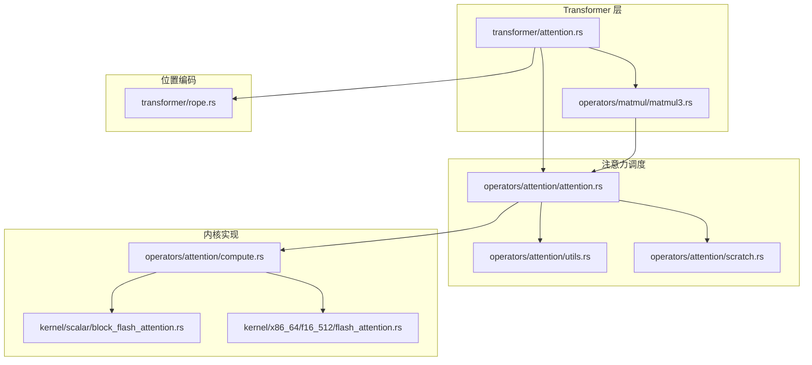
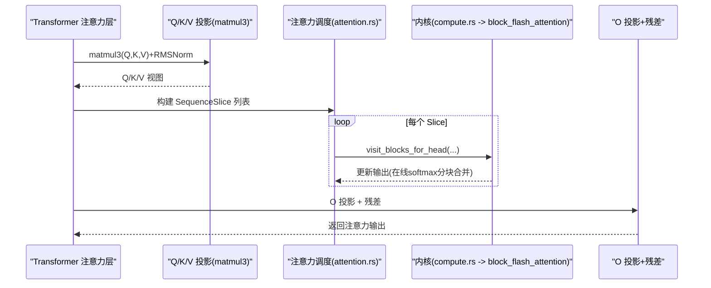
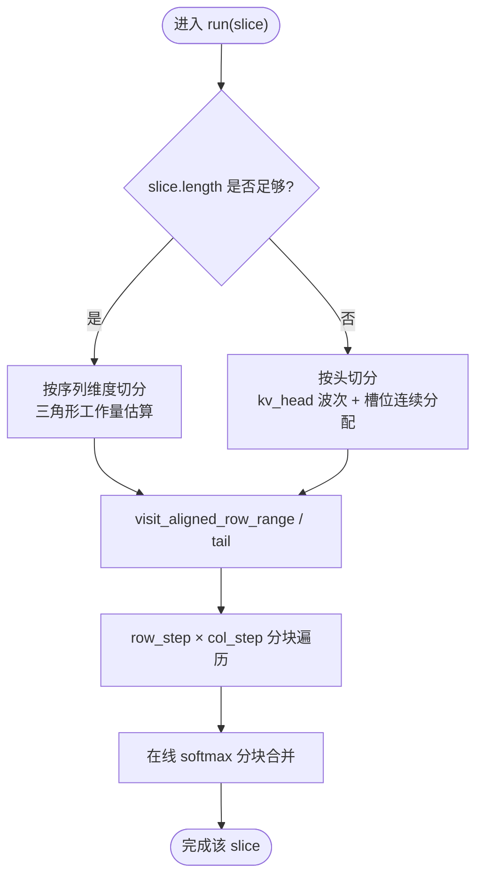
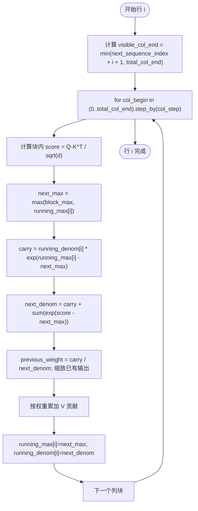
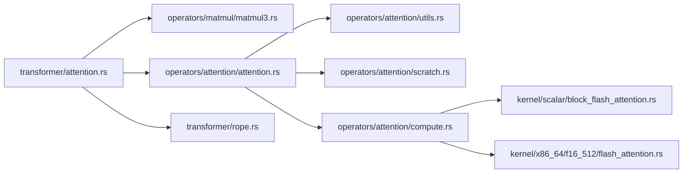

# 注意力算子

<cite>
**本文引用的文件列表**
- [attention.rs](file://src/operators/attention/attention.rs)
- [compute.rs](file://src/operators/attention/compute.rs)
- [block_flash_attention.rs](file://src/kernel/scalar/block_flash_attention.rs)
- [flash_attention.rs](file://src/kernel/x86_64/f16_512/flash_attention.rs)
- [utils.rs](file://src/operators/attention/utils.rs)
- [scratch.rs](file://src/operators/attention/scratch.rs)
- [attention.md](file://docs/design/operators/attention.md)
- [rope.rs](file://src/transformer/rope.rs)
- [attention.rs](file://src/transformer/attention.rs)
- [matmul3.rs](file://src/operators/matmul/matmul3.rs)
</cite>

## 目录
1. [简介](#简介)
2. [项目结构](#项目结构)
3. [核心组件](#核心组件)
4. [架构总览](#架构总览)
5. [详细组件分析](#详细组件分析)
6. [依赖关系分析](#依赖关系分析)
7. [性能与调优](#性能与调优)
8. [故障排查指南](#故障排查指南)
9. [结论](#结论)
10. [附录](#附录)

## 简介
本技术文档围绕注意力算子的实现进行深入解析，涵盖以下主题：
- 多头注意力的计算流程与分块算法
- FlashAttention 风格的内存优化策略（在线 softmax、分块合并）
- KV Cache 的布局与访问模式（GQA、逐 head 顺序计算）
- 位置编码 RoPE 的集成方式
- 注意力掩码（因果下三角）的处理与长序列优化
- 性能调优参数与硬件适配策略（AVX512-FP16 路径）
- 调试工具与可视化方法建议

## 项目结构
注意力相关代码主要分布在如下模块：
- 高层 Transformer 层：负责 Q/K/V 投影、形状变换、调用注意力内核
- 注意力调度与遍历：按 SequenceSlice 组织任务，选择“按序列切分”或“按头切分”
- 内核实现：标量通用路径 + x86_64 AVX512-FP16 专用路径
- 辅助工具：行/列分块计划、线程级 Scratch 缓冲管理
- 位置编码：RoPE 频率表生成与 YARN 缩放支持

图表来源
- [attention.rs:92-209](file://src/transformer/attention.rs#L92-L209)
- [matmul3.rs:549-576](file://src/operators/matmul/matmul3.rs#L549-L576)
- [attention.rs:439-505](file://src/operators/attention/attention.rs#L439-L505)
- [utils.rs:40-61](file://src/operators/attention/utils.rs#L40-L61)
- [scratch.rs:19-73](file://src/operators/attention/scratch.rs#L19-L73)
- [compute.rs:10-62](file://src/operators/attention/compute.rs#L10-L62)
- [block_flash_attention.rs:5-95](file://src/kernel/scalar/block_flash_attention.rs#L5-L95)
- [flash_attention.rs:142-210](file://src/kernel/x86_64/f16_512/flash_attention.rs#L142-L210)
- [rope.rs:179-231](file://src/transformer/rope.rs#L179-L231)

章节来源
- [attention.rs:92-209](file://src/transformer/attention.rs#L92-L209)
- [attention.md:1-390](file://docs/design/operators/attention.md#L1-L390)

## 核心组件
- Attention 调度器：维护 Q/K/V 指针、步长、head 数、批大小、分块粒度等；根据 Slice 长度选择“按序列切分”或“按头切分”；内部以 row_step × col_step 分块遍历。
- 计算接口 AttentionTrait：将具体数值类型（f16/f32）映射到对应内核实现。
- 标量内核 block_flash_attention：实现在线 softmax 的分块合并，避免全矩阵存储 scores。
- AVX512-FP16 内核：在具备目标特性时启用，使用向量指令加速 dot product、加权累加等。
- 工具与缓冲：RowVisitPlan 用于按三角形工作量划分主段与尾部；Scratch 为每线程分配 running_max/denom/scores 缓冲。
- RoPE：生成旋转频率表，支持 YARN 缩放与 attention_scaling。

章节来源
- [attention.rs:14-143](file://src/operators/attention/attention.rs#L14-L143)
- [compute.rs:10-174](file://src/operators/attention/compute.rs#L10-L174)
- [block_flash_attention.rs:5-95](file://src/kernel/scalar/block_flash_attention.rs#L5-L95)
- [flash_attention.rs:142-210](file://src/kernel/x86_64/f16_512/flash_attention.rs#L142-L210)
- [utils.rs:1-61](file://src/operators/attention/utils.rs#L1-L61)
- [scratch.rs:1-92](file://src/operators/attention/scratch.rs#L1-L92)
- [rope.rs:179-231](file://src/transformer/rope.rs#L179-L231)

## 架构总览
注意力前向的整体流程：
- Transformer 层对输入进行 Q/K/V 线性投影并融合 RMSNorm（可选），得到 Q/K/V 张量
- 将 K/V 重排为便于缓存访问的形状，准备注意力计算
- 调度器基于 SequenceSlice 决定并行策略（长序列按行区间切分，短序列按 kv_head 波次切分）
- 每个头内按 row_step × col_step 分块执行在线 softmax 的块状注意力
- 输出经 O 投影并与残差相加，完成一层注意力

图表来源
- [attention.rs:92-209](file://src/transformer/attention.rs#L92-L209)
- [matmul3.rs:549-576](file://src/operators/matmul/matmul3.rs#L549-L576)
- [attention.rs:273-311](file://src/operators/attention/attention.rs#L273-L311)
- [compute.rs:10-62](file://src/operators/attention/compute.rs#L10-L62)
- [block_flash_attention.rs:35-95](file://src/kernel/scalar/block_flash_attention.rs#L35-L95)

## 详细组件分析

### 调度与并行策略（SequenceSlice、行/列分块、两种切分模式）
- 最小任务单元是 SequenceSlice，包含 token_start_index、batch_index、next_sequence_index、length 等字段，表示一个 batch 内连续的一段 token 范围。
- 当 slice.length 足够大（ceil(length / row_step) >= thread_num）时，采用“按序列维度切分”，利用三角形工作量估计将行区间静态分配给各线程，保证因果注意力的负载均衡。
- 当 slice.length 较短时，采用“按头切分”，以 kv_head 为单位推进“波次”，在当前波次内将展平的 (kv_head, local_head) 槽位连续分配给线程，提高短序列下的核利用率与 KV 局部性。
- 内部遍历采用 row_step × col_step 分块，当前默认 row_step=1、col_step=8。

图表来源
- [attention.rs:439-505](file://src/operators/attention/attention.rs#L439-L505)
- [utils.rs:40-61](file://src/operators/attention/utils.rs#L40-L61)
- [attention.md:136-215](file://docs/design/operators/attention.md#L136-L215)

章节来源
- [attention.rs:114-143](file://src/operators/attention/attention.rs#L114-L143)
- [utils.rs:1-61](file://src/operators/attention/utils.rs#L1-L61)
- [attention.md:107-215](file://docs/design/operators/attention.md#L107-L215)

### 在线 Softmax 与分块合并（FlashAttention 风格）
- 每个行 i 的可见列上限由 next_sequence_index + i + 1 与 total_col_end 共同决定，体现因果掩码。
- 分块扫描列方向，维护 running_max 与 running_denom，通过指数平移保持数值稳定，并在块间进行权重迁移与结果合并，避免显式存储整个注意力分数矩阵。
- 标量路径与 AVX512-FP16 路径均遵循相同数学语义，后者在可用时提供更高吞吐。

图表来源
- [block_flash_attention.rs:35-95](file://src/kernel/scalar/block_flash_attention.rs#L35-L95)
- [flash_attention.rs:162-210](file://src/kernel/x86_64/f16_512/flash_attention.rs#L162-L210)

章节来源
- [block_flash_attention.rs:5-95](file://src/kernel/scalar/block_flash_attention.rs#L5-L95)
- [flash_attention.rs:142-210](file://src/kernel/x86_64/f16_512/flash_attention.rs#L142-L210)

### 多线程 Scratch 缓冲与内存布局
- AttentionScratch 为每个线程预分配 running_max、running_denom、scores 缓冲，按 row_step 与 col_step 对齐，避免跨线程竞争与重复分配。
- 每次处理新的行块前会清空这些缓冲，确保在线 softmax 状态正确初始化。

章节来源
- [scratch.rs:19-92](file://src/operators/attention/scratch.rs#L19-L92)

### 位置编码 RoPE 集成
- RotaryEmbedding 负责生成最大长度内的 cos/sin 频率表，支持 partial rotary（rotary_dim ≤ head_dim）与 YARN 缩放（factor、beta_fast/beta_slow、attention_factor）。
- 在 Transformer 层的 matmul3 中，结合 position_embedding 与 rope_sequence_index 进行旋转操作，随后送入注意力计算。

章节来源
- [rope.rs:179-231](file://src/transformer/rope.rs#L179-L231)
- [matmul3.rs:549-576](file://src/operators/matmul/matmul3.rs#L549-L576)

### 注意力掩码与长序列优化
- 掩码通过 visible_col_end 在行级别截断，天然满足因果约束，无需额外 mask 矩阵。
- 长序列优化体现在：
  - 按三角形工作量切分行区间，减少尾部分配不均
  - 列方向分块（col_step）降低峰值内存占用
  - 短序列切换至按头切分，提升核覆盖与 KV 局部性

章节来源
- [attention.md:356-371](file://docs/design/operators/attention.md#L356-L371)
- [attention.rs:158-215](file://src/operators/attention/attention.rs#L158-L215)

### 计算接口与硬件适配
- AttentionTrait::compute 为 f16/f32 特化，f16 在 x86_64 且开启 avx512fp16 目标特性时走 AVX512-FP16 路径，否则回退到标量路径。
- AVX512-FP16 路径使用 _mm512_* 指令集进行点积、缩放与加权累加，显著加速热点循环。

章节来源
- [compute.rs:64-130](file://src/operators/attention/compute.rs#L64-L130)
- [flash_attention.rs:1-93](file://src/kernel/x86_64/f16_512/flash_attention.rs#L1-L93)

## 依赖关系分析
- Transformer 层依赖 matmul3 完成 Q/K/V 投影与 RMSNorm 融合，再调用 Tensor::attention 进入调度器。
- 调度器依赖 utils（三角形切分）、scratch（线程缓冲）与 compute（内核路由）。
- compute 根据目标特性选择标量或 AVX512-FP16 内核。
- RoPE 在 matmul3 阶段参与 Q/K 旋转，影响后续注意力计算。

图表来源
- [attention.rs:92-209](file://src/transformer/attention.rs#L92-L209)
- [matmul3.rs:549-576](file://src/operators/matmul/matmul3.rs#L549-L576)
- [attention.rs:439-505](file://src/operators/attention/attention.rs#L439-L505)
- [compute.rs:10-62](file://src/operators/attention/compute.rs#L10-L62)
- [block_flash_attention.rs:5-95](file://src/kernel/scalar/block_flash_attention.rs#L5-L95)
- [flash_attention.rs:142-210](file://src/kernel/x86_64/f16_512/flash_attention.rs#L142-L210)
- [rope.rs:179-231](file://src/transformer/rope.rs#L179-L231)

## 性能与调优
- 关键参数
  - row_step：行方向分块粒度，影响线程分配的区间对齐与缓存命中
  - col_step：列方向分块粒度，控制单块内 score 缓冲大小与访存局部性
  - thread_num：CPU 工作线程数，影响并行度与短序列时的头切分策略
  - decode_only_flag：解码阶段标志（当前调度未分支，但可预留扩展）
- 硬件适配
  - 在 x86_64 且启用 avx512fp16 目标特性时，自动选择 AVX512-FP16 内核，获得更高吞吐
  - 若不可用，则回退到标量路径，保证正确性与兼容性
- 长序列优化
  - 三角形工作量切分使因果注意力的负载更均衡
  - 短序列按 kv_head 波次推进，减少同时驻留的 KV head 数量，提升 L3 命中率
- 内存与缓存
  - 固定形状、维度优先的 KV 布局配合逐 head 顺序计算，增强时间/空间局部性
  - 分块在线 softmax 避免全矩阵 scores 存储，降低峰值内存

章节来源
- [attention.md:291-332](file://docs/design/operators/attention.md#L291-L332)
- [compute.rs:84-129](file://src/operators/attention/compute.rs#L84-L129)
- [README.zh-CN.md:147-160](file://README.zh-CN.md#L147-L160)

## 故障排查指南
- 数值稳定性
  - 检查 running_max 初始化为负无穷、running_denom 初始化为零是否正确
  - 确认指数平移使用 next_max 而非 block_max，避免溢出
- 掩码与可见范围
  - 验证 visible_col_end 计算逻辑，确保不超过 total_col_end 且符合因果约束
- 线程与缓冲区
  - 确认 thread_buffers 的 stride 与 row_count/col_count 匹配，避免越界
  - clear() 是否在每块开始前被调用
- 硬件路径
  - 若 AVX512-FP16 路径异常，检查编译目标特性与运行时 CPU 能力
- 调试建议
  - 对比 naive_attention_row 参考实现，逐步缩小差异范围
  - 打印 running_max/denom 变化轨迹，定位不稳定点

章节来源
- [block_flash_attention.rs:97-281](file://src/kernel/scalar/block_flash_attention.rs#L97-L281)
- [scratch.rs:75-92](file://src/operators/attention/scratch.rs#L75-L92)
- [attention.rs:158-270](file://src/operators/attention/attention.rs#L158-L270)

## 结论
本注意力算子采用“SequenceSlice 外层任务 + 行/列分块 + 在线 softmax 分块合并”的设计，兼顾了长序列的负载均衡与短序列的核覆盖率。KV 缓存采用维度优先布局与逐 head 顺序计算，充分利用 CPU L3 缓存优势。RoPE 在投影阶段集成，支持 YARN 缩放。在具备 AVX512-FP16 的平台上可获得更高吞吐，同时保留标量路径以保证兼容性与正确性。

## 附录
- 术语
  - GQA：Grouped Query Attention，多 Q 头共享少 KV 头
  - Prefill/Decode：预填充与解码两个推理阶段
  - 在线 softmax：分块维护 running_max/denom 的数值稳定实现
- 参考设计文档
  - 静态并行分配与两种切分模式的详细说明见设计文档

章节来源
- [attention.md:1-390](file://docs/design/operators/attention.md#L1-L390)