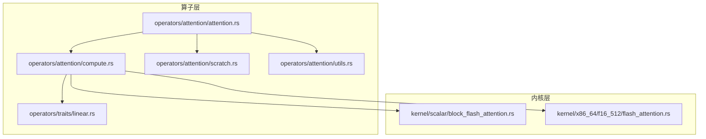
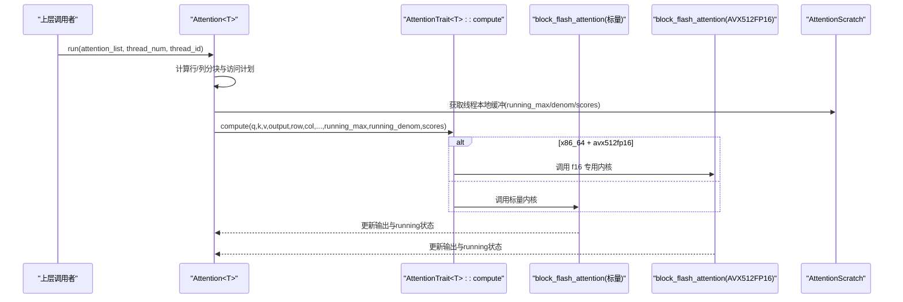
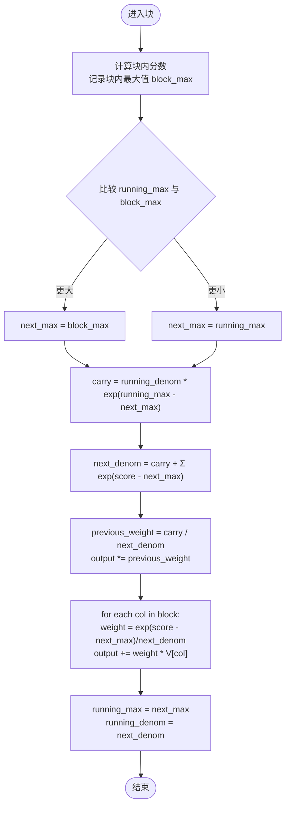
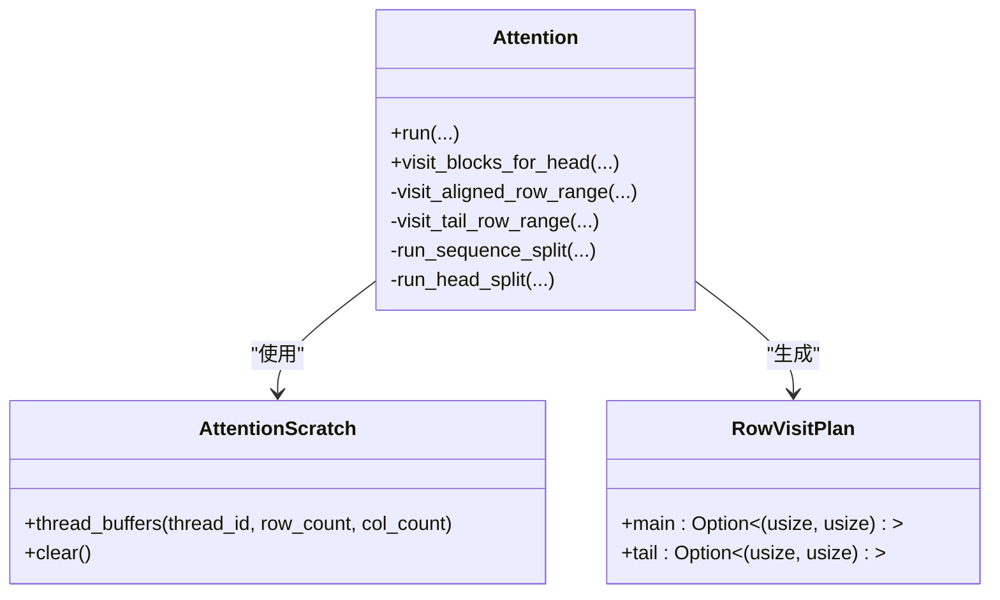
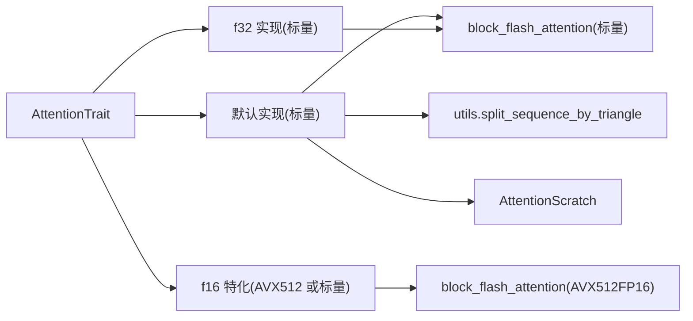

# 注意力计算内核

<cite>
**本文引用的文件**   
- [src/operators/attention/compute.rs](file://src/operators/attention/compute.rs)
- [src/operators/attention/attention.rs](file://src/operators/attention/attention.rs)
- [src/kernel/scalar/block_flash_attention.rs](file://src/kernel/scalar/block_flash_attention.rs)
- [src/kernel/x86_64/f16_512/flash_attention.rs](file://src/kernel/x86_64/f16_512/flash_attention.rs)
- [src/operators/attention/utils.rs](file://src/operators/attention/utils.rs)
- [src/operators/attention/scratch.rs](file://src/operators/attention/scratch.rs)
- [src/operators/traits/linear.rs](file://src/operators/traits/linear.rs)
- [src/operators/traits/softmax.rs](file://src/operators/traits/softmax.rs)
- [src/tensor/tests/performance.rs](file://src/tensor/tests/performance.rs)
</cite>

## 目录
1. [简介](#简介)
2. [项目结构](#项目结构)
3. [核心组件](#核心组件)
4. [架构总览](#架构总览)
5. [详细组件分析](#详细组件分析)
6. [依赖关系分析](#依赖关系分析)
7. [性能与精度考量](#性能与精度考量)
8. [故障排查指南](#故障排查指南)
9. [结论](#结论)
10. [附录：扩展与自定义实现指南](#附录扩展与自定义实现指南)

## 简介
本文件聚焦于注意力计算内核，系统性解析 AttentionTrait::compute 接口的实现原理、数值稳定性优化策略（在线 Softmax）、分块计算与缓存局部性优化、不同数据类型（f16/f32）的精度差异与优化路径，并给出性能基准与精度验证方法以及扩展点说明。

## 项目结构
注意力计算相关代码主要分布在 operators/attention 与 kernel 子系统中：
- operators/attention：对外暴露 Attention 结构与 AttentionTrait 接口，负责调度、线程划分、行/列分块、Scratch 缓冲管理。
- kernel/scalar：通用标量实现的在线分块 FlashAttention。
- kernel/x86_64/f16_512：针对 AVX512FP16 的 f16 加速实现。
- operators/traits：定义 AttentionTrait 等算子接口。
- tensor/tests：包含并行执行与性能测试样例，可作为注意力内核性能评估参考。

图示来源
- [src/operators/attention/attention.rs:1-120](file://src/operators/attention/attention.rs#L1-L120)
- [src/operators/attention/compute.rs:1-174](file://src/operators/attention/compute.rs#L1-L174)
- [src/kernel/scalar/block_flash_attention.rs:1-95](file://src/kernel/scalar/block_flash_attention.rs#L1-L95)
- [src/kernel/x86_64/f16_512/flash_attention.rs:142-210](file://src/kernel/x86_64/f16_512/flash_attention.rs#L142-L210)
- [src/operators/attention/scratch.rs:1-92](file://src/operators/attention/scratch.rs#L1-L92)
- [src/operators/attention/utils.rs:1-61](file://src/operators/attention/utils.rs#L1-L61)
- [src/operators/traits/linear.rs:1-22](file://src/operators/traits/linear.rs#L1-L22)

章节来源
- [src/operators/attention/attention.rs:1-120](file://src/operators/attention/attention.rs#L1-L120)
- [src/operators/attention/compute.rs:1-174](file://src/operators/attention/compute.rs#L1-L174)
- [src/kernel/scalar/block_flash_attention.rs:1-95](file://src/kernel/scalar/block_flash_attention.rs#L1-L95)
- [src/kernel/x86_64/f16_512/flash_attention.rs:142-210](file://src/kernel/x86_64/f16_512/flash_attention.rs#L142-L210)
- [src/operators/attention/scratch.rs:1-92](file://src/operators/attention/scratch.rs#L1-L92)
- [src/operators/attention/utils.rs:1-61](file://src/operators/attention/utils.rs#L1-L61)
- [src/operators/traits/linear.rs:1-22](file://src/operators/traits/linear.rs#L1-L22)

## 核心组件
- AttentionTrait<T>::compute：统一入口，按数据类型选择具体内核实现（标量或 AVX512FP16）。
- Attention<T>：负责序列切片、KV 头分组、行/列分块、线程分配、Scratch 缓冲生命周期管理。
- block_flash_attention（标量）：在线 Softmax 的分块实现，维护 running_max 与 running_denom。
- flash_attention（AVX512FP16）：f16 专用内核，使用向量指令与预取优化。
- AttentionScratch：每线程独立的运行最大值、运行分母与临时 scores 缓冲区。
- RowVisitPlan 与 split_sequence_by_triangle：基于三角分布的行访问计划，保证负载均衡与对齐。

章节来源
- [src/operators/traits/linear.rs:1-22](file://src/operators/traits/linear.rs#L1-L22)
- [src/operators/attention/compute.rs:10-174](file://src/operators/attention/compute.rs#L10-L174)
- [src/operators/attention/attention.rs:145-506](file://src/operators/attention/attention.rs#L145-L506)
- [src/kernel/scalar/block_flash_attention.rs:1-95](file://src/kernel/scalar/block_flash_attention.rs#L1-L95)
- [src/kernel/x86_64/f16_512/flash_attention.rs:142-210](file://src/kernel/x86_64/f16_512/flash_attention.rs#L142-L210)
- [src/operators/attention/scratch.rs:1-92](file://src/operators/attention/scratch.rs#L1-L92)
- [src/operators/attention/utils.rs:1-61](file://src/operators/attention/utils.rs#L1-L61)

## 架构总览
下图展示了从高层调用到具体内核执行的完整流程，包括分块、线程化与在线 Softmax 的状态更新。

图示来源
- [src/operators/attention/attention.rs:438-506](file://src/operators/attention/attention.rs#L438-L506)
- [src/operators/attention/compute.rs:10-174](file://src/operators/attention/compute.rs#L10-L174)
- [src/kernel/scalar/block_flash_attention.rs:1-95](file://src/kernel/scalar/block_flash_attention.rs#L1-L95)
- [src/kernel/x86_64/f16_512/flash_attention.rs:142-210](file://src/kernel/x86_64/f16_512/flash_attention.rs#L142-L210)
- [src/operators/attention/scratch.rs:1-92](file://src/operators/attention/scratch.rs#L1-L92)

## 详细组件分析

### AttentionTrait::compute 接口与多后端分发
- 默认实现（泛型 T）：转发至标量内核 block_flash_attention。
- f16 特化：在支持 avx512fp16 的目标上调用 AVX512 专用内核；否则回退到标量实现。
- f32 实现：始终使用标量内核。

要点
- 通过编译期目标特性检测进行运行时分支，避免不必要的开销。
- 所有实现均遵循统一的参数约定与内存布局（Q/K/V 步长、行/列范围、next_sequence_index 等）。

章节来源
- [src/operators/attention/compute.rs:10-174](file://src/operators/attention/compute.rs#L10-L174)
- [src/operators/traits/linear.rs:1-22](file://src/operators/traits/linear.rs#L1-L22)

### 在线 Softmax 与数值稳定性
在线算法的核心思想是逐块合并 softmax 统计量，避免一次性计算导致溢出或不稳定。

关键变量
- running_max[row]：当前已处理列块的最大值。
- running_denom[row]：当前已处理列块的归一化分母。
- scores[block]：当前块内各列的未缩放分数。

合并步骤（对每个 row 和每个 col 块）
1. 计算当前块内 score 并求块内最大值 block_max。
2. 计算 next_max = max(running_max, block_max)。
3. 计算 carry = running_denom * exp(running_max - next_max)。
4. 计算 next_denom = carry + sum(exp(score - next_max))。
5. 将已有输出乘以 previous_weight = carry / next_denom。
6. 累加新权重下的 value 贡献：sum(exp(score - next_max)/next_denom * v)。
7. 更新 running_max = next_max，running_denom = next_denom。

数值稳定性
- 通过减去 next_max 再指数化，避免 exp 溢出。
- 使用“运行最大值”与“运行分母”增量合并，保持全局 softmax 等价。

图示来源
- [src/kernel/scalar/block_flash_attention.rs:35-95](file://src/kernel/scalar/block_flash_attention.rs#L35-L95)
- [src/kernel/x86_64/f16_512/flash_attention.rs:175-209](file://src/kernel/x86_64/f16_512/flash_attention.rs#L175-L209)

章节来源
- [src/kernel/scalar/block_flash_attention.rs:35-95](file://src/kernel/scalar/block_flash_attention.rs#L35-L95)
- [src/kernel/x86_64/f16_512/flash_attention.rs:175-209](file://src/kernel/x86_64/f16_512/flash_attention.rs#L175-L209)

### 注意力权重的归一化与溢出防护
- 归一化过程：在每个块内以 next_max 为基准进行指数化，并以 next_denom 作为分母，确保权重之和为 1。
- 溢出防护：通过减去 next_max 的方式控制指数输入范围；当 next_max 增大时，旧状态的贡献通过 carry 项平滑过渡。

章节来源
- [src/kernel/scalar/block_flash_attention.rs:64-92](file://src/kernel/scalar/block_flash_attention.rs#L64-L92)
- [src/kernel/x86_64/f16_512/flash_attention.rs:185-208](file://src/kernel/x86_64/f16_512/flash_attention.rs#L185-L208)

### 数据类型差异与优化策略（f16 vs f32）
- f32：标量实现，数值精度高，适合验证与调试。
- f16：在支持 avx512fp16 的平台上启用专用内核，利用向量乘加与预取提升吞吐；在不支持平台自动回退到标量实现。
- 精度差异：f16 的舍入误差略大，但通过在线 Softmax 的数值稳定性设计，整体误差可控。

章节来源
- [src/operators/attention/compute.rs:64-174](file://src/operators/attention/compute.rs#L64-L174)
- [src/kernel/x86_64/f16_512/flash_attention.rs:142-210](file://src/kernel/x86_64/f16_512/flash_attention.rs#L142-L210)

### 分块计算与缓存局部性优化
- 行分块：由 row_step 控制，结合 split_sequence_by_triangle 按三角工作量均衡分配，保证主块对齐、尾块单独处理。
- 列分块：col_step 控制，减少单块内 scores 占用，提高缓存命中率。
- 预取：AVX512 内核中使用 _mm_prefetch 提前加载 K/V 数据，降低访存延迟。
- Scratch 缓冲：每线程独立分配 running_max、running_denom、scores，避免跨线程竞争与重复分配。

图示来源
- [src/operators/attention/attention.rs:157-311](file://src/operators/attention/attention.rs#L157-L311)
- [src/operators/attention/scratch.rs:1-92](file://src/operators/attention/scratch.rs#L1-L92)
- [src/operators/attention/utils.rs:1-61](file://src/operators/attention/utils.rs#L1-L61)

章节来源
- [src/operators/attention/attention.rs:157-311](file://src/operators/attention/attention.rs#L157-L311)
- [src/operators/attention/utils.rs:1-61](file://src/operators/attention/utils.rs#L1-L61)
- [src/operators/attention/scratch.rs:1-92](file://src/operators/attention/scratch.rs#L1-L92)

### 线程化与任务划分
- 行维度：根据 row_step 与线程数，按三角工作量切分 main 与 tail 区间，避免负载不均。
- 头维度：当可用线程较多且行块较少时，切换到 head_split 模式，按 KV 头波次分配线程，提高并行度。
- 线程本地缓冲：每线程持有独立的 running_max/denom/scores，避免锁竞争。

章节来源
- [src/operators/attention/attention.rs:313-436](file://src/operators/attention/attention.rs#L313-L436)
- [src/operators/attention/utils.rs:1-61](file://src/operators/attention/utils.rs#L1-L61)

## 依赖关系分析
- AttentionTrait 定义了 compute 接口，Attention 提供默认与类型特化实现。
- 标量内核与 AVX512 内核共享相同签名，便于统一调度。
- utils 提供行访问计划，scratch 提供线程本地缓冲，二者被 Attention 组合使用。

图示来源
- [src/operators/traits/linear.rs:1-22](file://src/operators/traits/linear.rs#L1-L22)
- [src/operators/attention/compute.rs:10-174](file://src/operators/attention/compute.rs#L10-L174)
- [src/kernel/scalar/block_flash_attention.rs:1-95](file://src/kernel/scalar/block_flash_attention.rs#L1-L95)
- [src/kernel/x86_64/f16_512/flash_attention.rs:142-210](file://src/kernel/x86_64/f16_512/flash_attention.rs#L142-L210)
- [src/operators/attention/utils.rs:1-61](file://src/operators/attention/utils.rs#L1-L61)
- [src/operators/attention/scratch.rs:1-92](file://src/operators/attention/scratch.rs#L1-L92)

章节来源
- [src/operators/traits/linear.rs:1-22](file://src/operators/traits/linear.rs#L1-L22)
- [src/operators/attention/compute.rs:10-174](file://src/operators/attention/compute.rs#L10-L174)
- [src/kernel/scalar/block_flash_attention.rs:1-95](file://src/kernel/scalar/block_flash_attention.rs#L1-L95)
- [src/kernel/x86_64/f16_512/flash_attention.rs:142-210](file://src/kernel/x86_64/f16_512/flash_attention.rs#L142-L210)
- [src/operators/attention/utils.rs:1-61](file://src/operators/attention/utils.rs#L1-L61)
- [src/operators/attention/scratch.rs:1-92](file://src/operators/attention/scratch.rs#L1-L92)

## 性能与精度考量
- 性能
  - 分块大小（row_step、col_step）影响缓存命中与并行粒度，需结合硬件 L1/L2 容量与线程数调优。
  - AVX512FP16 内核通过向量化与预取显著降低访存延迟，建议在支持该特性的平台上优先使用。
  - 线程分配策略（行分块 vs 头分块）应依据实际 batch/seq/head 规模动态选择。
- 精度
  - f32 作为参考实现用于对齐与回归测试。
  - f16 在在线 Softmax 下具备良好数值稳定性，但仍建议设置合理容忍阈值进行断言。
- 基准与验证
  - 可参考 tensor/tests 中的并行执行与性能打印方式，构造注意力场景的基准用例。
  - 建议使用 naive_attention_row 作为参考，对比分块实现结果，确保误差在允许范围内。

章节来源
- [src/tensor/tests/performance.rs:308-387](file://src/tensor/tests/performance.rs#L308-L387)
- [src/operators/attention/attention.rs:508-703](file://src/operators/attention/attention.rs#L508-L703)
- [src/kernel/scalar/block_flash_attention.rs:97-280](file://src/kernel/scalar/block_flash_attention.rs#L97-L280)

## 故障排查指南
- 常见错误
  - 越界访问：检查 row_begin/row_end、col_begin/col_end 与 total_col_end 的一致性，确保 visible_col_end 计算正确。
  - 线程安全：确认每线程使用独立的 scratch 缓冲，避免并发写冲突。
  - 数值异常：若出现 NaN/Inf，检查 next_max 更新与 exp 输入是否有效，确认 running_denom 不为零。
- 定位手段
  - 使用 f32 实现进行对齐测试，逐步缩小问题范围。
  - 打印 running_max/running_denom 与 scores 的中间值，观察合并逻辑是否正确。
  - 在 AVX512 路径与非 AVX512 路径分别运行，排除 SIMD 相关差异。

章节来源
- [src/operators/attention/attention.rs:157-270](file://src/operators/attention/attention.rs#L157-L270)
- [src/kernel/scalar/block_flash_attention.rs:35-95](file://src/kernel/scalar/block_flash_attention.rs#L35-L95)
- [src/kernel/x86_64/f16_512/flash_attention.rs:175-209](file://src/kernel/x86_64/f16_512/flash_attention.rs#L175-L209)

## 结论
本注意力内核采用在线 Softmax 的分块实现，结合行/列分块与线程本地缓冲，兼顾数值稳定性与缓存局部性。通过类型特化与编译期特性检测，f16 可在支持 AVX512FP16 的平台获得显著加速，同时保持与 f32 参考实现的对齐。合理的分块策略与线程分配是性能优化的关键。

## 附录：扩展与自定义实现指南
- 新增数据类型
  - 在 AttentionTrait 中为新的 T 实现 compute，并在 compute.rs 中添加对应特化，选择合适内核（标量或 SIMD）。
- 替换内核实现
  - 在 kernel 目录下新增特定架构的内核，保持与现有 block_flash_attention 一致的函数签名。
  - 在 compute.rs 中通过条件编译切换至新内核。
- 调整分块策略
  - 修改 Attention 中的 row_step/col_step 与 split_sequence_by_triangle 的使用，以适应不同硬件与工作负载。
- 精度与性能验证
  - 编写与 naive_attention_row 对齐的单元测试，覆盖边界情况（如 next_sequence_index 非零、尾块处理）。
  - 参考 tensor/tests 的并行执行框架，构建端到端性能基准，输出 GFLOPS 与时延指标。

章节来源
- [src/operators/traits/linear.rs:1-22](file://src/operators/traits/linear.rs#L1-L22)
- [src/operators/attention/compute.rs:10-174](file://src/operators/attention/compute.rs#L10-L174)
- [src/operators/attention/utils.rs:1-61](file://src/operators/attention/utils.rs#L1-L61)
- [src/tensor/tests/performance.rs:308-387](file://src/tensor/tests/performance.rs#L308-L387)