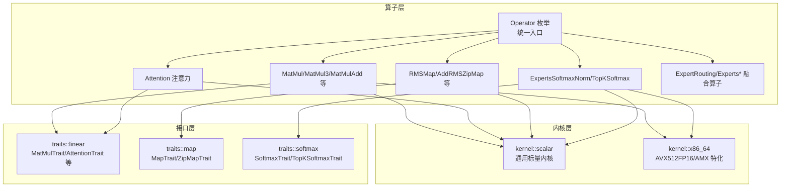
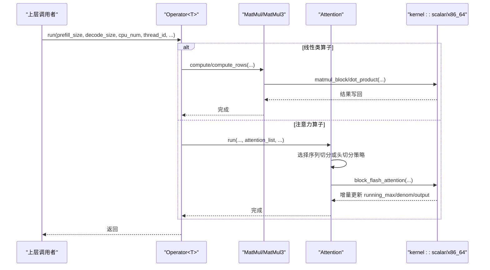
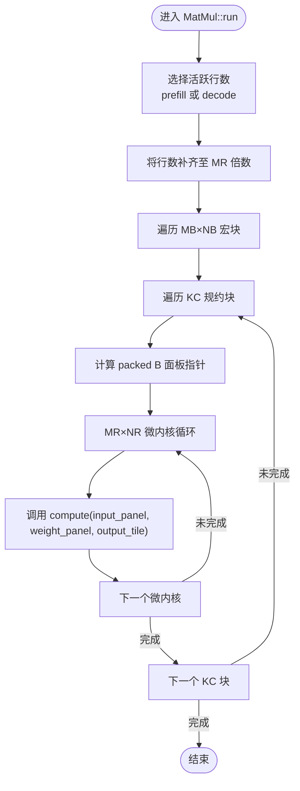
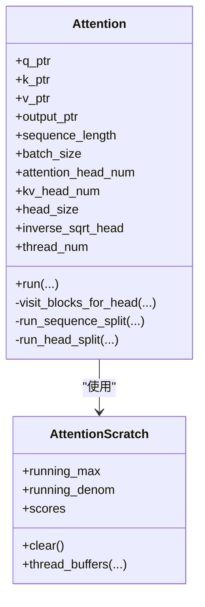
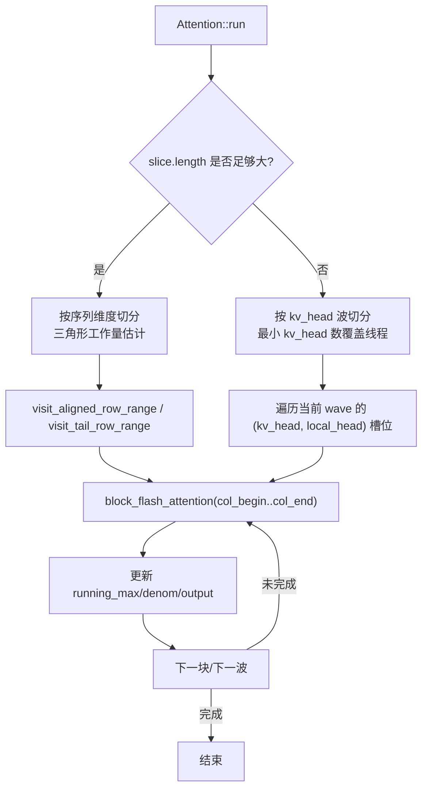
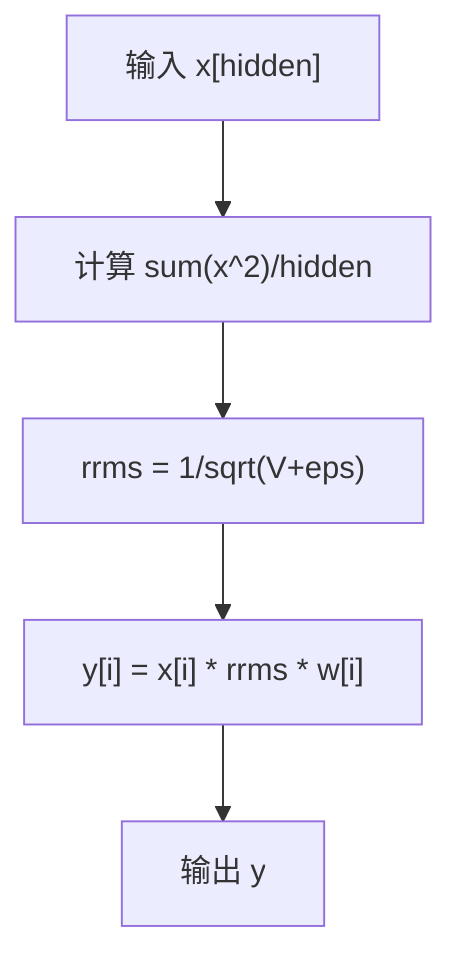
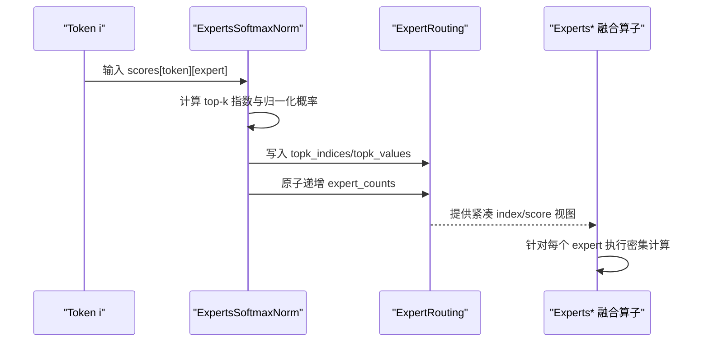
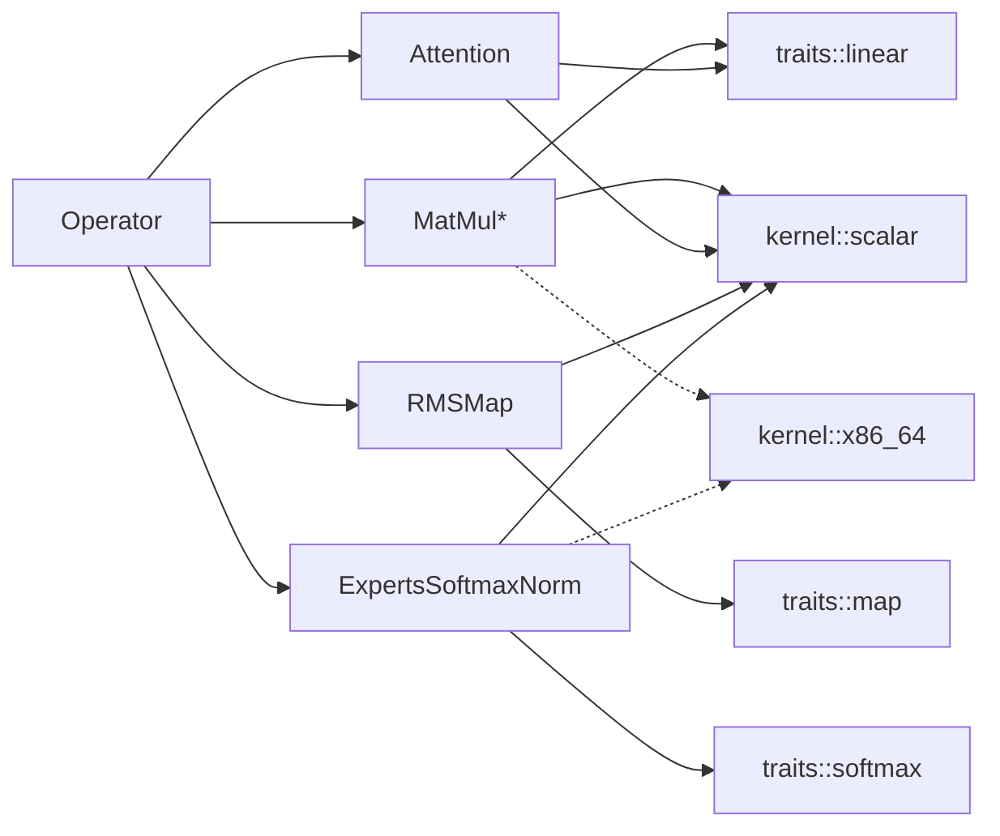

# 算子库

<cite>
**本文引用的文件**   
- [src/lib.rs](file://src/lib.rs)
- [src/operators/mod.rs](file://src/operators/mod.rs)
- [src/operators/operator.rs](file://src/operators/operator.rs)
- [src/operators/traits/linear.rs](file://src/operators/traits/linear.rs)
- [src/operators/matmul/matmul.rs](file://src/operators/matmul/matmul.rs)
- [src/operators/attention/attention.rs](file://src/operators/attention/attention.rs)
- [src/kernel/scalar/block_flash_attention.rs](file://src/kernel/scalar/block_flash_attention.rs)
- [src/operators/normalization/rms_map.rs](file://src/operators/normalization/rms_map.rs)
- [src/kernel/scalar/rms_norm.rs](file://src/kernel/scalar/rms_norm.rs)
- [src/operators/softmax/softmax_norm.rs](file://src/operators/softmax/softmax_norm.rs)
- [src/operators/expert/expert_routing.rs](file://src/operators/expert/expert_routing.rs)
- [src/operators/traits/map.rs](file://src/operators/traits/map.rs)
- [src/operators/traits/softmax.rs](file://src/operators/traits/softmax.rs)
- [docs/design/operators/attention.md](file://docs/design/operators/attention.md)
</cite>

## 目录
1. [简介](#简介)
2. [项目结构](#项目结构)
3. [核心组件](#核心组件)
4. [架构总览](#架构总览)
5. [详细组件分析](#详细组件分析)
6. [依赖关系分析](#依赖关系分析)
7. [性能考量](#性能考量)
8. [故障排查指南](#故障排查指南)
9. [结论](#结论)
10. [附录](#附录)

## 简介
本文件面向 eLLM 算子库，系统化阐述其架构与统一接口规范，覆盖线性算子（矩阵乘法、加法等）、注意力算子（含块级 FlashAttention 实现与内存优化）、归一化（RMSNorm/LayerNorm 思路）、专家混合路由与负载均衡、Softmax 系列数值稳定性，以及自定义算子开发指南与基准调优方法。文档以源码为依据，提供可视化图示与“章节来源”定位，便于读者快速定位实现细节。

## 项目结构
eLLM 的算子系统位于 operators 层，通过 Operator 枚举统一调度；底层内核在 kernel 中按标量与 x86_64 特化组织；算子对外暴露 traits 作为统一接口。

图表来源
- [src/operators/mod.rs:1-109](file://src/operators/mod.rs#L1-L109)
- [src/operators/operator.rs:1-224](file://src/operators/operator.rs#L1-L224)
- [src/operators/traits/linear.rs:1-96](file://src/operators/traits/linear.rs#L1-L96)
- [src/operators/traits/map.rs:1-8](file://src/operators/traits/map.rs#L1-L8)
- [src/operators/traits/softmax.rs:1-49](file://src/operators/traits/softmax.rs#L1-L49)

章节来源
- [src/lib.rs:1-16](file://src/lib.rs#L1-L16)
- [src/operators/mod.rs:1-109](file://src/operators/mod.rs#L1-L109)

## 核心组件
- 统一入口：Operator 枚举集中管理所有算子实例，并提供 run/kind 等统一调用方式。
- 线性算子族：MatMul/MatMul3/MatMulAdd/MatMulSigmoid/MatMulTopK 等，遵循 MatMulTrait/MatMulkqvTrait 等接口。
- 注意力算子：Attention 支持 GQA、因果掩码、分块遍历与线程静态划分。
- 归一化：RMSMap 封装 RMSNorm，支持 f16/f32 路径选择。
- Softmax 系列：ExpertsSoftmaxNorm/TopKSoftmax 用于 MoE 路由评分与采样。
- 专家混合：ExpertRouting 维护紧凑路由表与每专家计数，配合 Experts* 融合算子完成 top-k 激活与合并。

章节来源
- [src/operators/operator.rs:1-224](file://src/operators/operator.rs#L1-L224)
- [src/operators/traits/linear.rs:1-96](file://src/operators/traits/linear.rs#L1-L96)
- [src/operators/attention/attention.rs:1-506](file://src/operators/attention/attention.rs#L1-L506)
- [src/operators/normalization/rms_map.rs:1-122](file://src/operators/normalization/rms_map.rs#L1-L122)
- [src/operators/softmax/softmax_norm.rs:1-181](file://src/operators/softmax/softmax_norm.rs#L1-L181)
- [src/operators/expert/expert_routing.rs:1-168](file://src/operators/expert/expert_routing.rs#L1-L168)

## 架构总览
下图展示从上层 Operator 到具体算子与内核的调用链，体现“统一接口 + 多后端特化”的分层设计。

图表来源
- [src/operators/operator.rs:79-198](file://src/operators/operator.rs#L79-L198)
- [src/operators/matmul/matmul.rs:165-288](file://src/operators/matmul/matmul.rs#L165-L288)
- [src/operators/attention/attention.rs:439-505](file://src/operators/attention/attention.rs#L439-L505)
- [src/kernel/scalar/block_flash_attention.rs:5-95](file://src/kernel/scalar/block_flash_attention.rs#L5-L95)

## 详细组件分析

### 线性算子：矩阵乘法与变体
- 设计要点
  - 权重 B 在构造时预打包为 panel 布局，运行时避免重复 pack/分配。
  - 宏块/微内核 tile 对齐，确保无 tail 分支，利于向量化。
  - 支持 f16 路径下 AVX512FP16 特化，否则回退标量路径。
- 关键流程
  - new：计算并缓存 packed_b panels、面板步长等。
  - run：根据 prefill/decode 选择活跃行数，按 MB/NB/KC/MR/NR 分块遍历，逐 tile 调用 compute。
  - compute：默认走 scalar::matmul_block；f16 特化优先走 x86_64::f16_512。
- 复杂度与内存
  - 时间 O(MNK)，空间 O(NK) 用于 packed B。
  - 通过 panel 访问提升 L1/L2 命中，减少随机访存。

图表来源
- [src/operators/matmul/matmul.rs:165-288](file://src/operators/matmul/matmul.rs#L165-L288)
- [src/operators/matmul/matmul.rs:294-362](file://src/operators/matmul/matmul.rs#L294-L362)

章节来源
- [src/operators/matmul/matmul.rs:27-100](file://src/operators/matmul/matmul.rs#L27-L100)
- [src/operators/matmul/matmul.rs:165-288](file://src/operators/matmul/matmul.rs#L165-L288)
- [src/operators/traits/linear.rs:24-95](file://src/operators/traits/linear.rs#L24-L95)

### 注意力算子：GQA、分块与块级 FlashAttention
- 并行策略
  - 外部任务以 SequenceSlice 为单位；内部根据 slice.length 与 row_step 决定“按序列维度切分”或“按 kv_head 波切分”。
  - 短 slice 采用 kv_head 波推进，尽量少的 kv_head 覆盖尽可能多的线程，降低缓存压力。
- 块级 FlashAttention
  - 行方向按 row_step，列方向按 col_step 分块；逐块维护 running_max/running_denom，增量更新输出，避免全量 softmax 中间矩阵。
  - 因果约束在每行可见列上截断，保证自回归语义。
- 内存与访存
  - 按 head 顺序处理，最大化 KV 局部性；使用 per-thread scratch 缓冲 running_max/denom/scores。

图表来源
- [src/operators/attention/attention.rs:14-143](file://src/operators/attention/attention.rs#L14-L143)
- [src/operators/attention/attention.rs:273-311](file://src/operators/attention/attention.rs#L273-L311)
- [src/operators/attention/attention.rs:314-436](file://src/operators/attention/attention.rs#L314-L436)

图表来源
- [src/operators/attention/attention.rs:439-505](file://src/operators/attention/attention.rs#L439-L505)
- [src/kernel/scalar/block_flash_attention.rs:5-95](file://src/kernel/scalar/block_flash_attention.rs#L5-L95)
- [docs/design/operators/attention.md:107-332](file://docs/design/operators/attention.md#L107-L332)

章节来源
- [src/operators/attention/attention.rs:14-143](file://src/operators/attention/attention.rs#L14-L143)
- [src/operators/attention/attention.rs:439-505](file://src/operators/attention/attention.rs#L439-L505)
- [src/kernel/scalar/block_flash_attention.rs:5-95](file://src/kernel/scalar/block_flash_attention.rs#L5-L95)
- [docs/design/operators/attention.md:1-390](file://docs/design/operators/attention.md#L1-L390)

### 归一化：RMSNorm 与 LayerNorm 思路
- RMSNorm 实现
  - 计算方差 rrms = 1/sqrt(mean(x^2)+eps)，再逐元素乘以可学习权重。
  - MapTrait 抽象 map 型算子，RMSMap 对 f16/f32 分别选择内核路径。
- LayerNorm 思路
  - 若需均值中心化，可在 RMSNorm 基础上增加减均值步骤；当前库以 RMSNorm 为主，LayerNorm 可按相同 MapTrait 模式扩展。

图表来源
- [src/kernel/scalar/rms_norm.rs:5-30](file://src/kernel/scalar/rms_norm.rs#L5-L30)
- [src/operators/normalization/rms_map.rs:65-97](file://src/operators/normalization/rms_map.rs#L65-L97)

章节来源
- [src/operators/normalization/rms_map.rs:1-122](file://src/operators/normalization/rms_map.rs#L1-L122)
- [src/kernel/scalar/rms_norm.rs:1-152](file://src/kernel/scalar/rms_norm.rs#L1-L152)
- [src/operators/traits/map.rs:1-8](file://src/operators/traits/map.rs#L1-L8)

### 专家混合网络：路由与负载均衡
- 路由数据结构
  - ExpertRouting 维护每专家计数、紧凑 index_tensor/score_tensor、topk_indices 等，支持原子计数写入。
- 评分与 Top-K
  - ExpertsSoftmaxNorm 对 token×experts 打分，做 softmax 后取 top-k，并将 token 索引与分数写入紧凑 buffer，同时原子递增 expert_counts。
- 负载均衡
  - 通过 top-k 选择与评分归一化，结合容量限制 capacity_per_expert，避免单专家过载；后续 Experts* 融合算子基于紧凑 buffer 进行高效计算。

图表来源
- [src/operators/softmax/softmax_norm.rs:54-108](file://src/operators/softmax/softmax_norm.rs#L54-L108)
- [src/operators/expert/expert_routing.rs:44-65](file://src/operators/expert/expert_routing.rs#L44-L65)

章节来源
- [src/operators/softmax/softmax_norm.rs:1-181](file://src/operators/softmax/softmax_norm.rs#L1-L181)
- [src/operators/expert/expert_routing.rs:1-168](file://src/operators/expert/expert_routing.rs#L1-L168)

### Softmax 系列：数值稳定性与实现细节
- 数值稳定
  - 块级 FlashAttention 内按块维护 running_max，并使用 (score - next_max).exp 避免溢出。
  - ExpertsSoftmaxNorm 对 top-k 概率做组内归一化，保持数值稳定与一致性。
- 实现路径
  - f16 路径优先走 x86_64::f16_512 特化；f32 走 x86_64::f32_256 或标量路径。

章节来源
- [src/kernel/scalar/block_flash_attention.rs:5-95](file://src/kernel/scalar/block_flash_attention.rs#L5-L95)
- [src/operators/softmax/softmax_norm.rs:110-180](file://src/operators/softmax/softmax_norm.rs#L110-L180)

### 自定义算子开发指南与最佳实践
- 定义接口
  - 若为 map/zip-map 类型，实现 MapTrait/ZipMapTrait；若为线性类，实现 MatMulTrait/MatMulkqvTrait；若为 softmax 类，实现 SoftmaxTrait/TopKSoftmaxTrait。
- 注册与调度
  - 在 Operator 枚举中添加新变体，并在 run 分支中分发；在 mod.rs 中导出模块与别名。
- 内核实现
  - 先在 kernel::scalar 提供通用实现，再在 kernel::x86_64 提供目标特性特化（如 avx512fp16）。
- 内存与并发
  - 使用 ConstPtr/MutPtr 包装裸指针，避免生命周期问题；必要时使用 AlignedBox 分配对齐内存；多线程场景注意数据分区与原子操作。
- 测试与对齐
  - 编写单元测试验证数值接近性与边界条件；参考现有算子的 test 模块风格。

章节来源
- [src/operators/traits/map.rs:1-8](file://src/operators/traits/map.rs#L1-L8)
- [src/operators/traits/linear.rs:1-96](file://src/operators/traits/linear.rs#L1-L96)
- [src/operators/traits/softmax.rs:1-49](file://src/operators/traits/softmax.rs#L1-L49)
- [src/operators/mod.rs:1-109](file://src/operators/mod.rs#L1-L109)
- [src/operators/operator.rs:1-224](file://src/operators/operator.rs#L1-L224)

## 依赖关系分析
- 耦合与内聚
  - Operator 仅依赖各算子实现的 run 接口，低耦合；算子内部依赖 traits 与 kernel，高内聚。
- 直接/间接依赖
  - MatMul/Attention/RMSMap/Softmax 均依赖 kernel::scalar，部分依赖 x86_64 特化。
- 外部依赖
  - 主要依赖标准库与 CPU SIMD 指令集特性检测。

图表来源
- [src/operators/mod.rs:1-109](file://src/operators/mod.rs#L1-L109)
- [src/operators/operator.rs:1-224](file://src/operators/operator.rs#L1-L224)
- [src/operators/traits/linear.rs:1-96](file://src/operators/traits/linear.rs#L1-L96)
- [src/operators/traits/map.rs:1-8](file://src/operators/traits/map.rs#L1-L8)
- [src/operators/traits/softmax.rs:1-49](file://src/operators/traits/softmax.rs#L1-L49)

章节来源
- [src/operators/mod.rs:1-109](file://src/operators/mod.rs#L1-L109)
- [src/operators/operator.rs:1-224](file://src/operators/operator.rs#L1-L224)

## 性能考量
- 矩阵乘法
  - 合理设置 MB/NB/KC/MR/NR 使 tile 对齐，减少尾块分支；f16 开启 AVX512FP16 路径。
- 注意力
  - 短序列优先按 kv_head 波切分，提高核心覆盖率与缓存命中率；长序列按三角形工作量切分，平衡负载。
  - 使用 running_max/denom 增量更新，避免显式构建全量 score 矩阵，显著降低峰值内存。
- 归一化与 Softmax
  - 利用硬件向量路径；对 f16 优先走 x86_64 特化；注意 eps 取值避免除零。
- 专家混合
  - 控制 capacity_per_expert 与 num_topk，避免热点专家；紧凑 buffer 提升访存连续性。

## 故障排查指南
- 数值不稳定
  - 检查 running_max/denom 初始化与更新逻辑；确认 causal 截断范围正确。
- 线程安全
  - ExpertRouting 的 expert_counts 使用原子操作；确保多 writer 场景不越界。
- 对齐与越界
  - MatMul 要求 m_max 覆盖 padded rows；N/K 需满足 micro tile 对齐；注意 stride 参数与 layout 一致。
- 路径选择
  - 确认目标特性检测（avx512fp16）与编译开关匹配；未启用时回退标量路径。

章节来源
- [src/kernel/scalar/block_flash_attention.rs:5-95](file://src/kernel/scalar/block_flash_attention.rs#L5-L95)
- [src/operators/expert/expert_routing.rs:44-65](file://src/operators/expert/expert_routing.rs#L44-L65)
- [src/operators/matmul/matmul.rs:165-288](file://src/operators/matmul/matmul.rs#L165-L288)

## 结论
eLLM 算子库以统一 Operator 入口与清晰 traits 接口为核心，结合分块与块级 FlashAttention 的内存友好实现，在 CPU 平台上实现了高效的线性、注意力、归一化与 MoE 路由能力。通过静态并行与 panel 预打包等系统级优化，兼顾吞吐与时延，适合长上下文推理场景。

## 附录
- 术语
  - GQA：分组查询注意力，Q 头数与 KV 头数比例决定共享关系。
  - Block FlashAttention：分块计算注意力，增量维护统计量以降低内存占用。
  - Panel：权重按规约块与输出块切分的连续存储布局，提升缓存局部性。